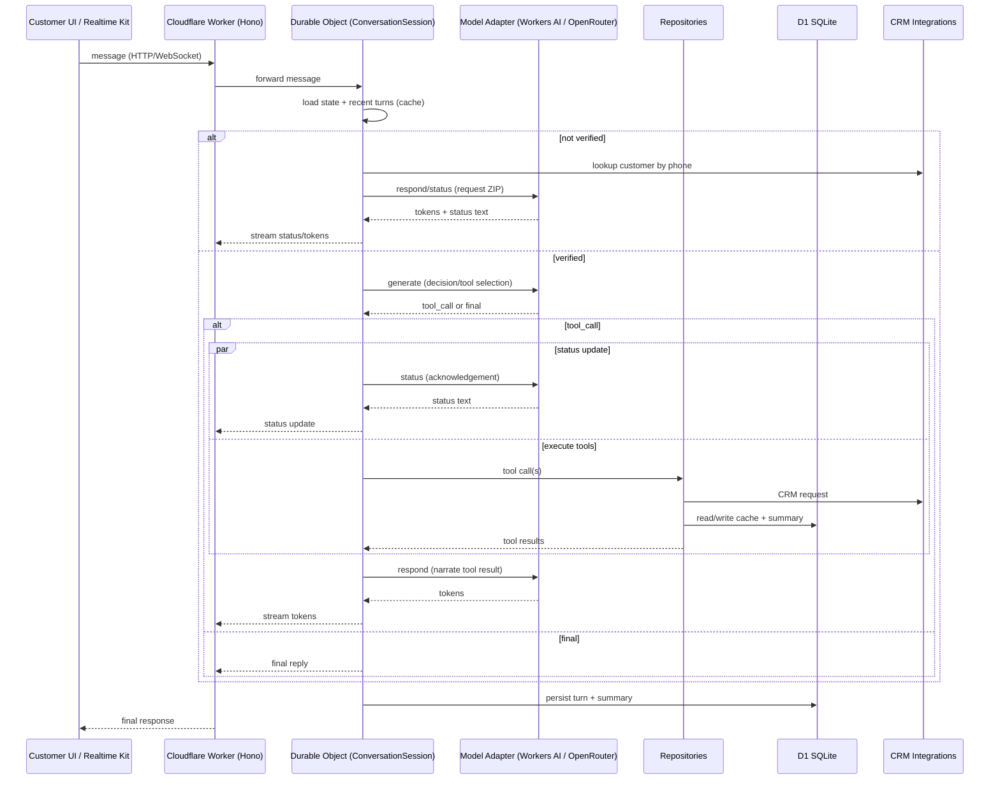
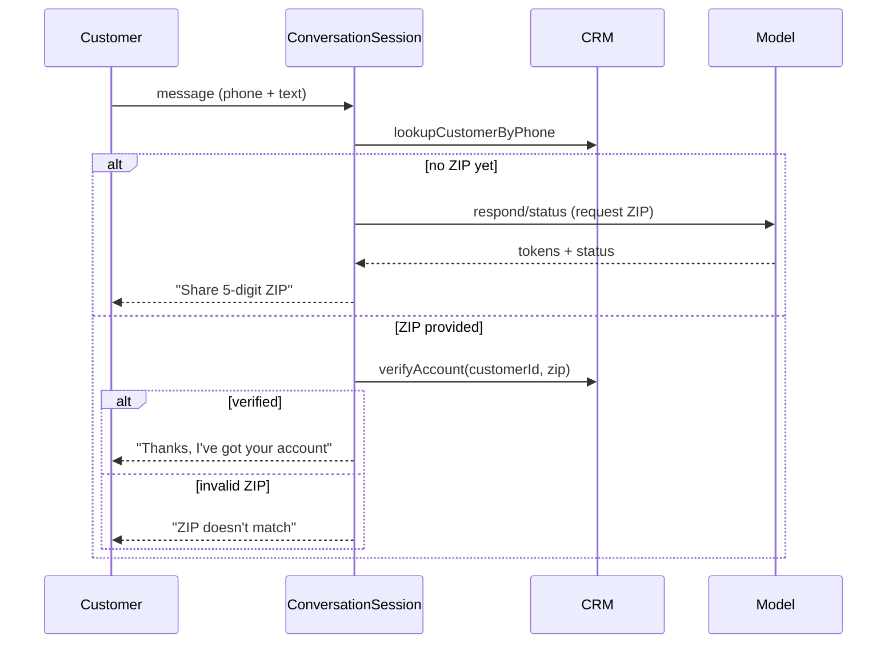
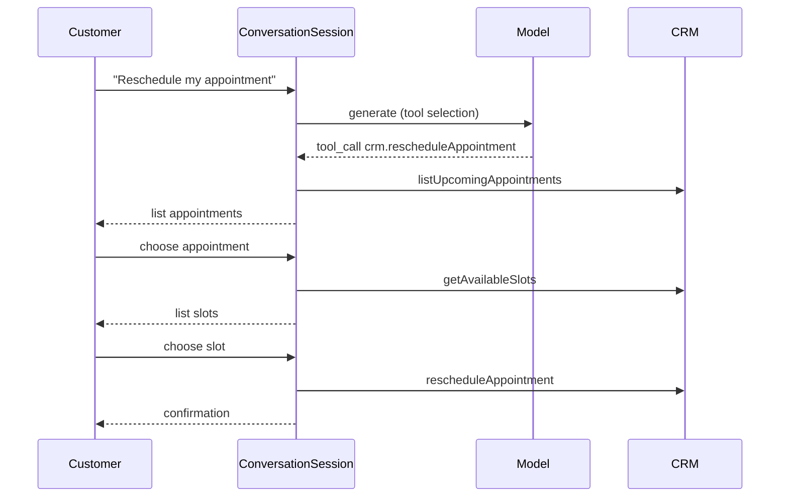
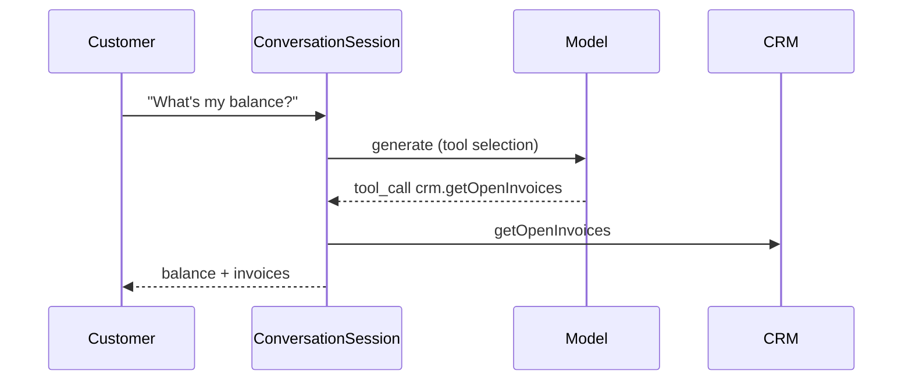
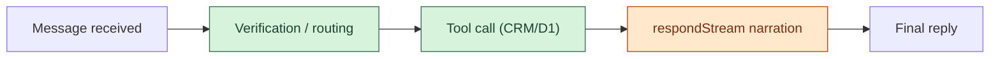

# PestCall

AI-powered customer service agent for pest control with ticketing, call traces, and a worker-first API.

## High-level flow

The system routes customer messages through a Cloudflare Worker and a Durable Object that manages state, verification, tool orchestration, and cached context. Model calls handle decisioning, status acknowledgements, and narration. A single model/provider is used per request (selected by config), not multiple models in parallel. Tool execution goes through repositories to D1/CRM, and status updates can be emitted while tools run.

### Model selection (plain-English)

Think of "Model" as one active AI provider chosen by config for each request:

- You can configure Workers AI or OpenRouter (via AI Gateway).
- For any given request, only one provider/model is used.
- The model is called in three ways:
  - `generate` decides whether to call a tool or return a direct reply.
  - `status` produces quick acknowledgements while work is running.
  - `respond` narrates tool results or final answers.

So yes, multiple model providers are available in the system, but only one is active at a time based on config.



### Verification flow (ZIP gate)



### Reschedule flow (tool + workflow)



### Billing flow (tool call)



### Bottlenecks (observed latency)

From logs, the slowest step is usually `respondStream` when narrating responses via OpenRouter. Status calls are fast, and tool calls are typically faster than the streamed narration.



## Requirements

- Bun
- Wrangler (installed via dev deps)

## Quick start

1. Install dependencies:

```sh
bun install
```

2. Create environment file:

```sh
cp .env.example .env
```

Create web environment file (for API base URL + auth token):

```sh
cp apps/web/.env.example apps/web/.env.local
```

3. Run local D1 migrations:

```sh
bun db:migrate:local
```

4. Run tests:

```sh
bun run test
bun run test:integration
bun run test:e2e
```

## Local dev (Worker)

Run the Worker with local bindings:

```sh
cd apps/worker
cp .dev.vars.example .dev.vars
wrangler dev --local
```

RPC endpoints are served under `/rpc`.
Customize tone and scope via `AGENT_TONE`, `AGENT_GREETING`, and `AGENT_OFFTOPIC_MESSAGE` in `apps/worker/.dev.vars`.

## Local dev (Web)

```sh
cd apps/web
bun dev
```

Set `NEXT_PUBLIC_API_BASE_URL` to your Worker URL (local or deployed).

## Deploy (Worker)

Use the scripted deploy to create the D1 database if missing, apply migrations, and deploy:

```sh
bun deploy:worker
```

Seed demo data with:

```sh
bun deploy:worker --seed
```

## Model providers (AI Gateway + OpenRouter)

This project supports Workers AI and OpenRouter (via Cloudflare AI Gateway).

To use OpenRouter:

1. Enable the OpenRouter integration in the AI Gateway UI:
   - https://dash.cloudflare.com/197ac8ab6d5079d3faab60cea42eaa7e/ai/ai-gateway/gateways/cs-bot/integrations
2. Set these values in `apps/worker/wrangler.toml`:
   - `AI_GATEWAY_ACCOUNT_ID`
   - `AI_GATEWAY_ID`
   - `AI_GATEWAY_TOKEN` (AI Gateway auth token, set as secret if required)
   - `OPENROUTER_REFERER` (allowed referrer, if restricted)
   - `OPENROUTER_TITLE` (optional display name)
3. Set the OpenRouter key as a secret:

```sh
bunx wrangler secret put OPENROUTER_TOKEN --config apps/worker/wrangler.toml
```

If your AI Gateway requires a gateway auth token, set it as a secret too:

```sh
bunx wrangler secret put AI_GATEWAY_TOKEN --config apps/worker/wrangler.toml
```

Then set `AGENT_MODEL=openrouter` (or choose an OpenRouter model ID in Prompt Studio, e.g. `openai/gpt-5-mini`).

## Database layout

- Migrations live in `apps/worker/migrations`.
- Seeds live in `apps/worker/seeds`.
- Naming convention: `YYYYMMDDHHMMSS_description.sql` (full timestamp, lowercase snake).
- Keep seed data small and deterministic for local demos.

## Useful commands

- `bun lint` - lint source with Biome
- `bun format` - auto-format with Biome
- `bun typecheck` - TypeScript project build/typecheck
- `bun run test` - unit tests
- `bun run test:integration` - integration tests
- `bun run test:e2e` - local e2e tests (requires local Worker)
- `bun run test:e2e:remote` - remote e2e against deployed Worker
- `bun db:migrate:local` - apply local D1 migrations
- `bun db:seed:local` - seed local D1 fixtures
- `bun deploy:worker` - deploy Worker (runs migrations)
- `bun deploy:worker --seed` - deploy + seed
- `bun logs:worker` - tail Worker logs (pretty)

## Repo layout

- `apps/worker` Cloudflare Worker API (oRPC)
- `apps/web` Next.js UI (customer portal + agent dashboard)
- `packages/core` shared domain logic and types
- `docs/` project documentation

## Documentation

- [Testing](docs/testing.md) - Test structure and best practices
- [CI/CD](docs/ci.md) - Continuous integration setup
- [Styleguide](docs/styleguide.md) - Code style and patterns
- [Documentation Styleguide](docs/docs-styleguide.md) - How to write docs
- [MCP Setup](docs/mcp/README.md) - Model Context Protocol servers (Postman, Serena, Context7)
- [Postman Setup](postman/README.md) - API testing with Postman collections and environments

## AI Coding Tools

This project uses [rulesync](https://github.com/dyoshikawa/rulesync) to maintain consistent AI coding assistant rules across multiple tools (Claude Code, Cursor, GitHub Copilot, Codex CLI).

**After cloning or pulling changes to `.rulesync/`, sync your AI tool configurations:**

```sh
bun run sync:rules
```

This generates tool-specific configuration files (`.claude/`, `.cursor/`, etc.) from the shared rules in `.rulesync/`. Generated files are git-ignored and created locally for each developer.

**To update team rules**: Edit files in `.rulesync/`, commit them, and other team members run `bun run sync:rules` to get the updates.

See [`.rulesync/README.md`](.rulesync/README.md) for more details.
