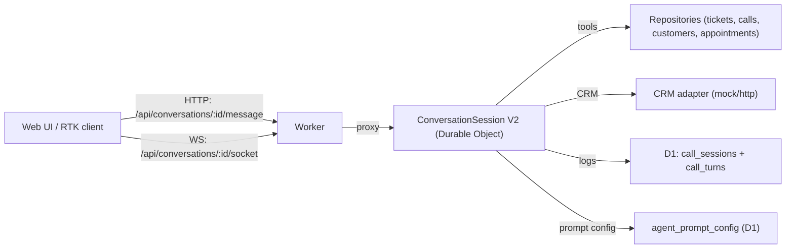

# AI agent architecture (source of truth)

Single, canonical view of the PestCall agent: how requests flow, where state lives, what is validated, and what remains to harden.

## System shape

Core loop: DO receives turn → builds model messages with context → `runWithTools` calls a tool → tool result is narrated/streamed → DO buffers events for resync and persists summaries to D1.

## Transport and endpoints

- Conversation API (v2): `/api/v2/conversations/:id/{socket|message|resync|debug|rtk-token|summary}` proxied to the DO in [`apps/worker/src/index.ts`](../apps/worker/src/index.ts).
- WebSocket stream events: `token`, `status`, `final`, `error`, `resync`, `speaking`.
- Resync: POST `/resync` with `lastEventId` replays buffered events plus state snapshot.
- RealtimeKit: `/rtk-token` issues participant tokens; meeting/config pulled from env (see [`realtime-kit.ts`](../apps/worker/src/realtime-kit.ts)).

## Durable Object responsibilities

- Owns session state (verification, customer id, workflow ids, cached options/slots, greeting flags, event buffer, turn metrics).
- Routes messages to `runWithTools` with tool definitions from [`tool-definitions.ts`](../apps/worker/src/models/tool-definitions.ts) and handlers from [`tool-flow/registry.ts`](../apps/worker/src/durable-objects/conversation-session/tool-flow/registry.ts).
- Applies gating: verification (`conversation.verification.verified`) and workflow activity (`rescheduleWorkflowId`, `cancelWorkflowId`, `activeSelection`, `availableSlots`).
- Streams narrator tokens and aggregates tool acknowledgements into status events.
- Persists summaries to D1 via repositories; long-term context comes from [`calls.ts`](../apps/worker/src/repositories/calls.ts).

Session modules (v2):
- Coordinator/routes: [`v2/session.ts`](../apps/worker/src/durable-objects/conversation-session/v2/session.ts)
- State manager: [`v2/state.ts`](../apps/worker/src/durable-objects/conversation-session/v2/state.ts)
- Event emitter/buffer: [`v2/events.ts`](../apps/worker/src/durable-objects/conversation-session/v2/events.ts)
- Connections: [`v2/connection.ts`](../apps/worker/src/durable-objects/conversation-session/v2/connection.ts)
- Providers: [`v2/providers/tool-provider.ts`](../apps/worker/src/durable-objects/conversation-session/v2/providers/tool-provider.ts), [`v2/providers/prompt-provider.ts`](../apps/worker/src/durable-objects/conversation-session/v2/providers/prompt-provider.ts)

## Prompts and model selection

- Prompt config lives in D1 `agent_prompt_config`; migrations [`20250201200000_agent_prompt_config.sql`](../apps/worker/migrations/20250201200000_agent_prompt_config.sql) and [`20250201203000_agent_prompt_config_additions.sql`](../apps/worker/migrations/20250201203000_agent_prompt_config_additions.sql).
- Repository and RPC: [`repositories/agent-config.ts`](../apps/worker/src/repositories/agent-config.ts), [`routes/agent-config.ts`](../apps/worker/src/routes/agent-config.ts).
- UI editor: [`apps/web/src/app/agent/page.tsx`](../apps/web/src/app/agent/page.tsx).
- Fields: `personaSummary`, `scopeMessage`, `toolGuidance.*`, `modelId`, `tone`.
- Prompt provider builds greeting + system prompt per config; model id read from config/env.

## Tools and workflows

- Tools defined in [`models/tool-definitions.ts`](../apps/worker/src/models/tool-definitions.ts) with Zod schemas and acknowledgements.
- Handlers in [`tool-flow/registry.ts`](../apps/worker/src/durable-objects/conversation-session/tool-flow/registry.ts) call repositories and CRM adapters.
- Workflows (cancel/reschedule) use two-step commits (select → confirm) and slot fetching before reschedule confirm. Workflow constants in [`workflows/constants.ts`](../apps/worker/src/workflows/constants.ts).

## Streaming and resync behavior

- Greeting sent on WebSocket connect once per call session (tracked in domainState).
- Tokens emitted via `emitToken()` as SSE is parsed; `final` includes the narrated message and tool outputs.
- Event buffer retained for resync and sent alongside the latest domain state.
- Barge-in: `barge_in` message or new message during `speaking` cancels current stream (`canceledStreamIds`).

## Debugging and observability

- Snapshot: `GET /api/conversations/:id/debug` (state, eventBuffer, turnDecision, turnMetrics, persisted session/turns).
- Summary: `GET /api/conversations/:id/summary`.
- Logs: `bun run scripts/logs-call-session.ts <callSessionId>` filters worker logs.
- D1 inspection: `call_sessions`, `call_turns`, `customers_cache` (see repository code for shape).

## Testing

- Integration/e2e live under `apps/worker/src/conversation-session.*.e2e.test.ts` and `conversation-session.websocket.e2e.test.ts` to cover streaming, verification, cancellation, reschedule, and tool correctness.
- Router integration tests (`apps/worker/src/router.integration.test.ts`) validate RPC flows (tickets, CRM, workflows).

## Outstanding tests

- Validate multi-tool chains with `maxRecursiveToolRuns > 1`.
- End-to-end cancel/reschedule completion through v2 (tool calls + narrator outputs).
- Voice/RealtimeKit flow end-to-end with token refresh and speaking states.

## Future improvements

- Re-enter intent/workflow selection automatically after verification within the DO (no standalone verification reply).
- Add off-domain handling with human-offer escalation for repeated unclear turns.
- Improve DO logging ergonomics (per-turn completion logs, simpler filtering by session id).
- Implement real appointment CRUD in D1: create/reschedule/cancel appointments and list upcoming appointments from DB.
