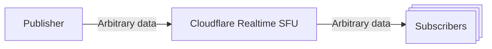
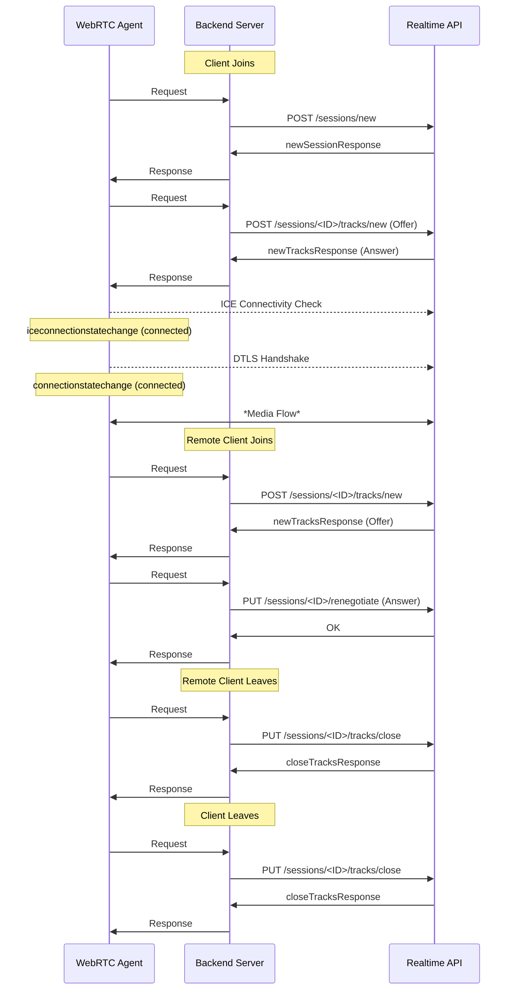
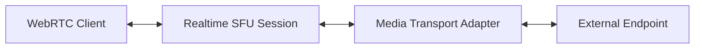
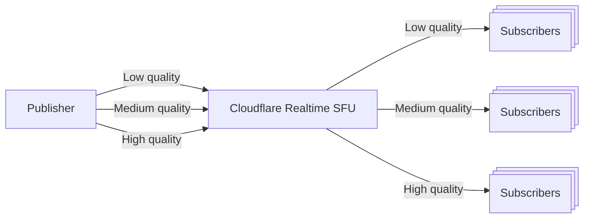
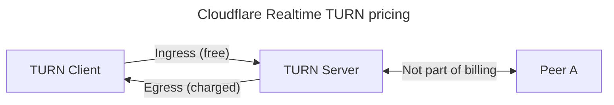
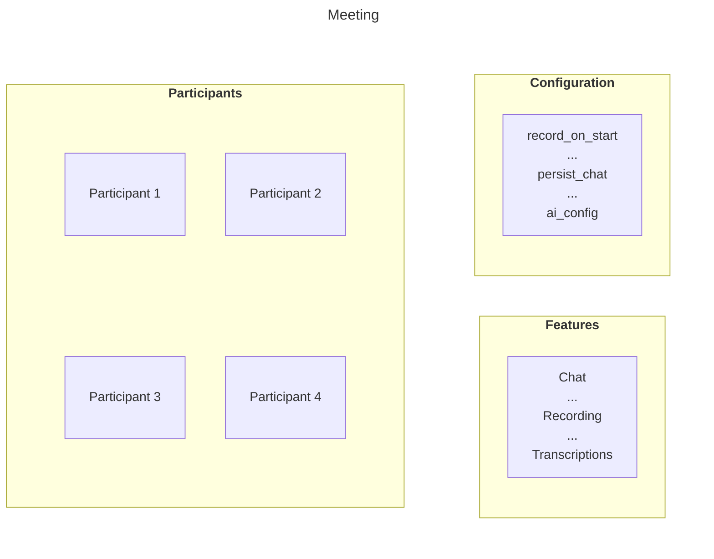
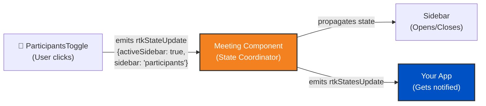

<page>
---
title: Overview · Cloudflare Realtime docs
description: RealtimeKit is a set of SDKs and APIs that lets you add
  customizable live video and voice to web or mobile applications. It is fully
  customisable and you sets up in just a few lines of code.
lastUpdated: 2025-12-01T15:18:21.000Z
chatbotDeprioritize: false
source_url:
  html: https://developers.cloudflare.com/realtime/
  md: https://developers.cloudflare.com/realtime/index.md
---

Cloudflare Realtime is a comprehensive suite of products designed to help you build powerful, scalable real-time applications.

### RealtimeKit

[RealtimeKit](https://developers.cloudflare.com/realtime/realtimekit/) is a set of SDKs and APIs that lets you add customizable live video and voice to web or mobile applications. It is fully customisable and you sets up in just a few lines of code.

It sits on top of the Realtime SFU, abstracting away the heavy lifting of media routing, peer management, and other complex WebRTC operations.

### Realtime SFU

The [Realtime SFU (Selective Forwarding Unit)](https://developers.cloudflare.com/realtime/sfu/) is a powerful media server that efficiently routes video and audio. The Realtime SFU runs on [Cloudflare's global cloud network](https://www.cloudflare.com/network/) in hundreds of cities worldwide.

For developers with WebRTC expertise, the SFU can be used independently to build highly custom applications that require full control over media streams. This is recommended only for those who want to leverage Cloudflare's network with their own WebRTC logic.

### TURN Service

The [TURN service](https://developers.cloudflare.com/realtime/turn/) is a managed service that acts as a relay for WebRTC traffic. It ensures connectivity for users behind restrictive firewalls or NATs by providing a public relay point for media streams.

## Choose the right Realtime product

Use this comparison table to quickly find the right Realtime product for your needs:

| | **RealtimeKit** | **Realtime SFU** | **TURN Service** |
| - | - | - | - |
| **What is it** | High-level SDKs and APIs with pre-built UI components for video/voice integration. Built on top of Realtime SFU. | Low-level WebRTC media server (Selective Forwarding Unit) that routes audio/video/data streams between participants. | Managed relay service for WebRTC traffic that ensures connectivity through restrictive firewalls and NATs. |
| **Who is it for** | Developers who want to quickly add video/voice features without handling WebRTC complexities. | Developers with WebRTC expertise who need full control over media streams and want to build highly custom applications. | Any WebRTC application needing reliable connectivity in restrictive network environments. |
| **Effort to get started** | Low - Just a few lines of code with UI Kit and Core SDK. | High - Requires deep WebRTC knowledge. No SDK provided (unopinionated). You manage sessions, tracks, and presence protocol. Works with every WebRTC library. | Low - Automatically used by WebRTC libraries (browser WebRTC, Pion, libwebrtc). No additional code needed. |
| **WebRTC expertise required** | None - Abstracts away WebRTC complexities. | Expert - You handle all WebRTC logic yourself. | None - Used transparently by WebRTC libraries. |
| **Primitives** | Meetings, Sessions, Participants, Presets (roles), Stage, Waiting Room | Sessions (PeerConnections), Tracks (MediaStreamTracks), pub/sub model - no rooms concept | TURN allocations, relayed transport addresses, protocols (UDP/TCP/TLS) |
| **Key use cases** | Team meetings, virtual classrooms, webinars, live streaming with interactive features, social video chat | Highly custom real-time apps, unique WebRTC architectures that don't fit standard patterns, leveraging Cloudflare's network with custom logic | Ensuring connectivity for all users regardless of firewall/NAT configuration, used alongside SFU or peer-to-peer WebRTC |
| **Key features** | Pre-built UI components, automatic track management, recording, chat, polls, breakout rooms, virtual backgrounds, transcription | Unopinionated architecture, no lock-in, globally scalable, full control over media routing, programmable "switchboard" | Anycast routing to nearest location, multiple protocol options |
| **Pricing** | Pricing by minute [view details](https://workers.cloudflare.com/pricing#media) | $0.05/GB egress | Free when used with Realtime SFU, otherwise $0.05/GB egress |
| **Free tier** | None | First 1,000 GB free each month | First 1,000 GB free each month |

## Related products

**[Workers AI](https://developers.cloudflare.com/workers-ai/)**

Run machine learning models, powered by serverless GPUs, on Cloudflare’s global network.

**[Stream](https://developers.cloudflare.com/stream/)**

Cloudflare Stream lets you or your end users upload, store, encode, and deliver live and on-demand video with one API, without configuring or maintaining infrastructure.

## More resources

[Developer Discord](https://discord.cloudflare.com)

Connect with the Realtime community on Discord to ask questions, show what you are building, and discuss the platform with other developers.

[Use cases](https://developers.cloudflare.com/realtime/realtimekit/introduction#use-cases)

Learn how you can build and deploy ambitious Realtime applications to Cloudflare's global network.

[@CloudflareDev](https://x.com/cloudflaredev)

Follow @CloudflareDev on Twitter to learn about product announcements, and what is new in Cloudflare Realtime.

</page>

<page>
---
title: 404 - Page Not Found · Cloudflare Realtime docs
chatbotDeprioritize: false
source_url:
  html: https://developers.cloudflare.com/realtime/404/
  md: https://developers.cloudflare.com/realtime/404/index.md
---

# 404

Check the URL, try using our [search](https://developers.cloudflare.com/search/) or try our LLM-friendly [llms.txt directory](https://developers.cloudflare.com/llms.txt).

</page>

<page>
---
title: Realtime Agents · Cloudflare Realtime docs
lastUpdated: 2026-01-15T16:49:28.000Z
chatbotDeprioritize: true
source_url:
  html: https://developers.cloudflare.com/realtime/agents/
  md: https://developers.cloudflare.com/realtime/agents/index.md
---

* [Getting started](https://developers.cloudflare.com/realtime/agents/getting-started/)

</page>

<page>
---
title: Overview · Cloudflare Realtime docs
description: "With RealtimeKit, you can expect:"
lastUpdated: 2025-12-08T11:30:45.000Z
chatbotDeprioritize: false
source_url:
  html: https://developers.cloudflare.com/realtime/realtimekit/
  md: https://developers.cloudflare.com/realtime/realtimekit/index.md
---

Add live video and voice to your web or mobile apps in minutes — customizable SDKs, Integrate in just a few lines of code.

With RealtimeKit, you can expect:

* **Fast, simple integration:** Add live video and voice calling to any platform using our SDKs in minutes.
* **Customizable:** Tailor the experience to your needs.
* **Powered by WebRTC:** Built on top of modern, battle-tested WebRTC technology. RealtimeKit sits on top of [Realtime SFU](https://developers.cloudflare.com/realtime/sfu/) handling media track management, peer management, and other complicated tasks for you.

Experience the product:

[Try A Demo Meeting](https://demo.realtime.cloudflare.com)

[Build using Examples](https://github.com/cloudflare/realtimekit-web-examples)

[RealtimeKit Dashboard](https://dash.cloudflare.com/?to=/:account/realtime/kit)

## Build with RealtimeKit

RealtimeKit powers a wide range of usecases — here are the most common ones

#### Group Calls

Experience team meetings, virtual classrooms with interactive plugins, and seamless private or group video chats — all within your platform.

#### Webinars

Host large, interactive one-to-many events with virtual stage management, and engagement tools like plugins, chat, and polls — ideal for product demos, company all-hands, and live workshops

#### Audio Only Calls

Host audio-only calls — perfect for team discussions, support lines, and community hangouts— low bandwidth usage and features like mute controls, hand-raise, and role management.

## Product Suite

* [**UI Kit**](https://developers.cloudflare.com/realtime/realtimekit/ui-kit) UI library of pre-built, customizable components for rapid development — sits on top of the Core SDK.

* [**Core SDK**](https://developers.cloudflare.com/realtime/realtimekit/core) Client SDK built on top of Realtime SFU that provides a full set of APIs for managing video calls, from joining and leaving sessions to muting, unmuting, and toggling audio and video.

* [**Realtime SFU**](https://developers.cloudflare.com/realtime/sfu) efficiently routes media with low latency—all running on Cloudflare’s global network for reliability and scale.

The **Backend Infrastructure** Powering the SDKs is a robust layer that includes REST APIs for managing meetings, participants, recordings and more, along with webhooks for server-side events. A dedicated signalling server coordinates real-time updates.

</page>

<page>
---
title: Overview · Cloudflare Realtime docs
description: Cloudflare Realtime SFU is infrastructure for real-time
  audio/video/data applications. It allows you to build real-time apps without
  worrying about scaling or regions. It can act as a selective forwarding unit
  (WebRTC SFU), as a fanout delivery system for broadcasting (WebRTC CDN) or
  anything in between.
lastUpdated: 2025-08-18T10:34:43.000Z
chatbotDeprioritize: false
source_url:
  html: https://developers.cloudflare.com/realtime/sfu/
  md: https://developers.cloudflare.com/realtime/sfu/index.md
---

Build real-time serverless video, audio and data applications.

Cloudflare Realtime SFU is infrastructure for real-time audio/video/data applications. It allows you to build real-time apps without worrying about scaling or regions. It can act as a selective forwarding unit (WebRTC SFU), as a fanout delivery system for broadcasting (WebRTC CDN) or anything in between.

Cloudflare Realtime SFU runs on [Cloudflare's global cloud network](https://www.cloudflare.com/network/) in hundreds of cities worldwide.

[Get started](https://developers.cloudflare.com/realtime/sfu/get-started/)

[Realtime dashboard](https://dash.cloudflare.com/?to=/:account/calls)

[Orange Meets demo app](https://github.com/cloudflare/orange)

</page>

<page>
---
title: TURN Service · Cloudflare Realtime docs
description: Separately from the SFU, Realtime offers a managed TURN service.
  TURN acts as a relay point for traffic between WebRTC clients like the browser
  and SFUs, particularly in scenarios where direct communication is obstructed
  by NATs or firewalls. TURN maintains an allocation of public IP addresses and
  ports for each session, ensuring connectivity even in restrictive network
  environments.
lastUpdated: 2025-11-26T14:06:25.000Z
chatbotDeprioritize: false
source_url:
  html: https://developers.cloudflare.com/realtime/turn/
  md: https://developers.cloudflare.com/realtime/turn/index.md
---

Separately from the SFU, Realtime offers a managed TURN service. TURN acts as a relay point for traffic between WebRTC clients like the browser and SFUs, particularly in scenarios where direct communication is obstructed by NATs or firewalls. TURN maintains an allocation of public IP addresses and ports for each session, ensuring connectivity even in restrictive network environments.

Using Cloudflare Realtime TURN service is available free of charge when used together with the Realtime SFU. Otherwise, it costs $0.05/real-time GB outbound from Cloudflare to the TURN client.

## Service address and ports

| Protocol | Primary address | Primary port | Alternate port |
| - | - | - | - |
| STUN over UDP | stun.cloudflare.com | 3478/udp | 53/udp |
| TURN over UDP | turn.cloudflare.com | 3478/udp | 53 udp |
| TURN over TCP | turn.cloudflare.com | 3478/tcp | 80/tcp |
| TURN over TLS | turn.cloudflare.com | 5349/tcp | 443/tcp |

Note

Use of alternate port 53 only by itself is not recommended. Port 53 is blocked by many ISPs, and by popular browsers such as [Chrome](https://chromium.googlesource.com/chromium/src.git/+/refs/heads/master/net/base/port_util.cc#44) and [Firefox](https://github.com/mozilla/gecko-dev/blob/master/netwerk/base/nsIOService.cpp#L132). It is useful only in certain specific scenerios.

## Regions

Cloudflare Realtime TURN service runs on [Cloudflare's global network](https://www.cloudflare.com/network) - a growing global network of thousands of machines distributed across hundreds of locations, with the notable exception of the Cloudflare's [China Network](https://developers.cloudflare.com/china-network/).

When a client tries to connect to `turn.cloudflare.com`, it *automatically* connects to the Cloudflare location closest to them. We achieve this using [anycast routing](https://www.cloudflare.com/learning/cdn/glossary/anycast-network/).

To learn more about the architecture that makes this possible, read this [technical deep-dive about Realtime](https://blog.cloudflare.com/cloudflare-calls-anycast-webrtc).

## Protocols and Ciphers for TURN over TLS

TLS versions supported include TLS 1.1, TLS 1.2, and TLS 1.3.

| OpenSSL Name | TLS 1.1 | TLS 1.2 | TLS 1.3 |
| - | - | - | - |
| AEAD-AES128-GCM-SHA256 | No | No | ✅ |
| AEAD-AES256-GCM-SHA384 | No | No | ✅ |
| AEAD-CHACHA20-POLY1305-SHA256 | No | No | ✅ |
| ECDHE-ECDSA-AES128-GCM-SHA256 | No | ✅ | No |
| ECDHE-RSA-AES128-GCM-SHA256 | No | ✅ | No |
| ECDHE-RSA-AES128-SHA | ✅ | ✅ | No |
| AES128-GCM-SHA256 | No | ✅ | No |
| AES128-SHA | ✅ | ✅ | No |
| AES256-SHA | ✅ | ✅ | No |

## MTU

There is no specific MTU limit for Cloudflare Realtime TURN service.

## Limits

Cloudflare Realtime TURN service places limits on:

* Unique IP address you can communicate with per relay allocation (>5 new IP/sec)
* Packet rate outbound and inbound to the relay allocation (>5-10 kpps)
* Data rate outbound and inbound to the relay allocation (>50-100 Mbps)

Limits apply to each TURN allocation independently

Each limit is for a single TURN allocation (single TURN user) and not account wide. Same limit will apply to each user regardless of the number of unique TURN users.

These limits are suitable for high-demand applications and also have burst rates higher than those documented above. Hitting these limits will result in packet drops.

</page>

<page>
---
title: AI (Transcription and Summary) · Cloudflare Realtime docs
description: RealtimeKit provides AI-powered features to enhance your meetings,
  including real-time transcription and automatic meeting summaries. These
  features help you capture important discussions and generate concise overviews
  of your meetings.
lastUpdated: 2026-01-13T15:01:55.000Z
chatbotDeprioritize: false
source_url:
  html: https://developers.cloudflare.com/realtime/realtimekit/ai/
  md: https://developers.cloudflare.com/realtime/realtimekit/ai/index.md
---

RealtimeKit provides AI-powered features to enhance your meetings, including real-time transcription and automatic meeting summaries. These features help you capture important discussions and generate concise overviews of your meetings.

## Meeting transcription

RealtimeKit's meeting transcription allows you to transcribe your RealtimeKit meetings in real-time, making it easy to capture important discussions and refer back to them later.

### Control transcriptions using presets

You can control whether a participant's audio will be transcribed using the `transcription_enabled` flag in the participant's preset. All participants with `transcription_enabled` turned on in their preset will be able to generate transcripts in real-time in a RealtimeKit meeting.

Follow the [Preset Creation Guide](https://developers.cloudflare.com/realtime/realtimekit/concepts/preset/) to create a new preset.

### Configure transcription behavior

You can control transcription behavior through a configurable AI setup. When creating a meeting using the REST API, you can pass an AI configuration for transcriptions. This allows for greater control over the transcription process.

#### Supported languages

You can specify the language for transcription to ensure accurate and relevant results. The following languages are supported:

* **English (United States)** - `en-US`
* **English (India)** - `en-IN`
* **German** - `de`
* **Hindi** - `hi`
* **Swedish** - `sv`
* **Russian** - `ru`
* **Polish** - `pl`
* **Greek** - `el`
* **French** - `fr`
* **Dutch** - `nl`
* **Turkish** - `tr`
* **Spanish** - `es`
* **Italian** - `it`
* **Portuguese** - `pt`
* **Romanian** - `ro`
* **Korean** - `ko`
* **Indonesian** - `id`
* **Multi** - `multi`

Example:

```json
"language": "en-US"
```

#### Keywords

Keywords can be added to help the transcription engine accurately detect and transcribe specific terms, such as names, technical jargon, or other context-specific words. This is particularly useful in meetings where certain terms are frequently used and need to be recognized correctly.

Example:

```json
"keywords": ["RealtimeKit", "Mary", "Sue"]
```

#### Profanity filter

You can enable or disable the profanity filter based on your needs. This feature ensures that any offensive language is either included or excluded from the transcriptions, depending on your preference.

Example:

```json
"profanity_filter": false
```

#### Example configuration

Here is an example of how to pass the AI configuration in the meeting creation API:

```json
{
  "title": "Meeting Transcriptions",
  "ai_config": {
    "transcription": {
      "keywords": ["RealtimeKit"],
      "language": "en-US",
      "profanity_filter": false
    }
  }
}
```

### Consume transcripts

There are three ways to consume transcripts:

1. **Client Core SDK** - The transcripts can be consumed on the client-side using the RealtimeKit SDK. These transcripts are generated on the server in real-time
2. **Webhooks** - The meeting transcript can be consumed via a webhook after the meeting ends
3. **REST API** - The meeting transcript can be fetched via the REST API

#### Consume transcripts in real-time

For consuming transcripts in real-time on the client SDK, ensure that the `transcription_enabled` flag is enabled in the preset. Transcripts for all participants with this flag set will be broadcasted in the meeting.

You can use the `meeting.ai` object to access the transcripts:

```javascript
console.log(meeting.ai.transcripts);
```

The transcripts are also emitted by the `meeting.ai` object, so a listener can be attached to it:

```javascript
meeting.ai.on("transcript", (transcriptData) => {
  console.log("Transcript:", transcriptData);
});
```

As participants speak during the meeting, you will receive partial transcripts, giving you real-time feedback even before they finish their sentences. The `isPartialTranscript` flag in the transcript data shows whether the transcript is partial or final.

Example transcript data:

```json
{
  "id": "1a2b3c4d-5678-90ab-cdef-1234567890ab",
  "name": "Alice",
  "peerId": "4f5g6h7i-8j9k-0lmn-opqr-1234567890st",
  "userId": "uvwxyz-1234-5678-90ab-cdefghijklmn",
  "customParticipantId": "abc123xyz",
  "transcript": "Hello?",
  "isPartialTranscript": true,
  "date": "Wed Aug 07 2024 10:15:30 GMT+0530 (India Standard Time)"
}
```

In the example above, `isPartialTranscript` is `true`, indicating the transcript is still in progress. Once the participant finishes speaking, the final transcript will be sent with `isPartialTranscript` set to `false`. This helps you distinguish between ongoing speech and completed transcriptions, making the transcription process more dynamic and responsive.

#### Consume transcript via webhook

You can configure a webhook with the `meeting.transcript` event enabled to receive the meeting transcript after the meeting has ended. You can do this either on the Developer Portal or using the REST API.

For webhook format details, refer to [Webhooks](https://developers.cloudflare.com/api/resources/realtime_kit/subresources/webhooks/).

### Fetch the meeting transcript

You do not need to rely on the webhook to get the transcript for a meeting. RealtimeKit provides a REST API to obtain the transcripts for a particular session. You can use this API to get the transcript for a meeting at a later time. RealtimeKit stores the transcript of a meeting for 7 days since the start of the meeting.

The transcript is received in the form of a CSV with the following format:

```plaintext
Timestamp, Participant ID, User ID, Custom Participant ID, Participant Name, Transcript
```

Field descriptions:

* **Timestamp** - An ISO 8601 format string indicating the time of utterance (or the time of speech)
* **Participant ID** - An identifier for individual peers in the meeting. For instance, if the participant joins the meeting twice, both peers will have the same User ID but different Participant IDs
* **User ID** - An identifier for a participant in the meeting, as returned by the Add Participant API call
* **Custom Participant ID** - An identifier that you can specify to identify a user. This can be sent in the request body of the Add Participant API call
* **Participant Name** - The display name of the user
* **Transcript** - The transcribed utterance

### Test transcription

Once you have configured a preset and a webhook according to the instructions above, you can proceed to test whether meeting transcription is working for your organization:

1. [Create a meeting](https://developers.cloudflare.com/realtime/realtimekit/concepts/meeting/)
2. [Add a participant](https://developers.cloudflare.com/realtime/realtimekit/concepts/participant/) to the meeting. Make sure that the preset you use was configured according to this guide
3. Join the meeting with the `authToken` you just obtained. As you unmute and speak, your speech should be getting transcribed in real-time for all the participants in the meeting
4. Once the meeting ends, you will receive a webhook with the event `meeting.transcript`. The body of this webhook will consist of the entire meeting transcript

## Meeting summary

RealtimeKit's meeting summary feature allows you to automatically generate concise summaries of your meeting based on the transcription data. This feature makes it easy to capture key points and action items, providing a concise overview of your discussions.

Note

To generate a meeting summary, transcription must be enabled. The summarization feature relies on the transcription data to create accurate and meaningful summaries.

### Enable meeting summarization

To enable automatic summarization post meeting, set the `summarize_on_end` flag when creating a meeting using the REST API.

#### Summarization configuration options

You can tailor the summarization process using the following configuration options:

##### Word limit

Define the word limit for the summary, ensuring it fits your needs. You can set a limit between 150 and 1000 words.

Example:

```json
"word_limit": 500
```

##### Text format

Choose the format for the summary text. Supported formats are:

* `plain_text`
* `markdown`

Example:

```json
"text_format": "markdown"
```

##### Summary type

Select the type of summary based on the nature of the meeting. Supported types are:

* `general`
* `team_meeting`
* `sales_call`
* `client_check_in`
* `interview`
* `daily_standup`
* `one_on_one_meeting`
* `lecture`
* `code_review`

Example:

```json
"summary_type": "team_meeting"
```

#### Example configuration

Here is an example of how to enable summarization in the meeting creation API call:

```json
{
  "title": "Team Meeting",
  "ai_config": {
    "summarization": {
      "word_limit": 500,
      "text_format": "plain_text",
      "summary_type": "team_meeting"
    }
  },
  "summarize_on_end": true
}
```

### Consume summaries

There are two ways to consume the generated summaries:

1. **Webhooks** - Receive the meeting summary via a webhook after the meeting ends
2. **API Call** - Fetch the meeting summary using the REST API

#### Fetch summary via webhook

To receive the meeting summary automatically once the meeting concludes, configure a webhook with the `meeting.summary` event enabled. This can be done either on the Developer Portal or using the REST API.

For webhook format details, refer to [Webhooks](https://developers.cloudflare.com/api/resources/realtime_kit/subresources/webhooks/).

#### Fetch summary via API call

You can use the API to fetch the summary for a meeting at a later time using the REST API. RealtimeKit stores the summary of a meeting for 7 days since the start of the meeting.

### Trigger summary manually

If you need to generate a summary after the meeting has ended, you can trigger the summary using the REST API.

## Next steps

Explore additional capabilities:

* [Webhooks](https://developers.cloudflare.com/api/resources/realtime_kit/subresources/webhooks/) - Set up webhooks for AI events

</page>

<page>
---
title: Get started - Workers and Wrangler · Cloudflare Realtime docs
description: Deploy your first Realtime Agent using the CLI.
lastUpdated: 2025-08-29T17:03:29.000Z
chatbotDeprioritize: false
source_url:
  html: https://developers.cloudflare.com/realtime/agents/getting-started/
  md: https://developers.cloudflare.com/realtime/agents/getting-started/index.md
---

Warning

This guide is experimental, Realtime agents will be consolidated into the [Agents SDK](https://developers.cloudflare.com/agents/) in a future release

This guide will instruct you through setting up and deploying your first Realtime Agents project. You will use [Workers](https://developers.cloudflare.com/workers/), the Realtime Agents SDK, a Workers AI binding, and a large language model (LLM) to deploy your first AI-powered application on the Cloudflare global network.

1. Sign up for a [Cloudflare account](https://dash.cloudflare.com/sign-up/workers-and-pages).
2. Install [`Node.js`](https://docs.npmjs.com/downloading-and-installing-node-js-and-npm).

Node.js version manager

Use a Node version manager like [Volta](https://volta.sh/) or [nvm](https://github.com/nvm-sh/nvm) to avoid permission issues and change Node.js versions. [Wrangler](https://developers.cloudflare.com/workers/wrangler/install-and-update/), discussed later in this guide, requires a Node version of `16.17.0` or later.

## 1. Create a Worker project

You will create a new Worker project using the `create-cloudflare` CLI (C3). [C3](https://github.com/cloudflare/workers-sdk/tree/main/packages/create-cloudflare) is a command-line tool designed to help you set up and deploy new applications to Cloudflare.

Create a new project named `hello-agent` by running:

* npm

  ```sh
  npm create cloudflare@latest -- hello-agent
  ```

* yarn

  ```sh
  yarn create cloudflare hello-agent
  ```

* pnpm

  ```sh
  pnpm create cloudflare@latest hello-agent
  ```

Running `npm create cloudflare@latest` will prompt you to install the [`create-cloudflare` package](https://www.npmjs.com/package/create-cloudflare), and lead you through setup. C3 will also install [Wrangler](https://developers.cloudflare.com/workers/wrangler/), the Cloudflare Developer Platform CLI.

For setup, select the following options:

* For *What would you like to start with?*, choose `Hello World example`.
* For *Which template would you like to use?*, choose `Worker only`.
* For *Which language do you want to use?*, choose `TypeScript`.
* For *Do you want to use git for version control?*, choose `Yes`.
* For *Do you want to deploy your application?*, choose `No` (we will be making some changes before deploying).

This will create a new `hello-agent` directory. Your new `hello-agent` directory will include:

* A `"Hello World"` [Worker](https://developers.cloudflare.com/workers/get-started/guide/#3-write-code) at `src/index.ts`.
* A [`wrangler.jsonc`](https://developers.cloudflare.com/workers/wrangler/configuration/) configuration file.

Go to your application directory:

```sh
cd hello-agent
```

## 2. Install the Realtime Agents SDK

```sh
npm i @cloudflare/realtime-agents
```

## 3. Connect your Worker to Workers AI

You must create an AI binding for your Worker to connect to Workers AI. [Bindings](https://developers.cloudflare.com/workers/runtime-apis/bindings/) allow your Workers to interact with resources, like Workers AI, on the Cloudflare Developer Platform.

To bind Workers AI to your Worker, add the following to the end of your Wrangler file:

* wrangler.jsonc

  ```jsonc
  {
    "$schema": "./node_modules/wrangler/config-schema.json",
    "ai": {
      "binding": "AI"
    }
  }
  ```

* wrangler.toml

  ```toml
  [ai]
  binding = "AI"
  ```

Your binding is [available in your Worker code](https://developers.cloudflare.com/workers/reference/migrate-to-module-workers/#bindings-in-es-modules-format) on [`env.AI`](https://developers.cloudflare.com/workers/runtime-apis/handlers/fetch/).

## 4. Implement the Worker

Update the `index.ts` file in your `hello-agent` application directory with the following code:

* JavaScript

  ```js
  import {
    DeepgramSTT,
    TextComponent,
    RealtimeKitTransport,
    ElevenLabsTTS,
    RealtimeAgent,
  } from "@cloudflare/realtime-agents";


  class MyTextProcessor extends TextComponent {
    env;


    constructor(env) {
      super();
      this.env = env;
    }


    async onTranscript(text, reply) {
      const { response } = await this.env.AI.run(
        "@cf/meta/llama-3.1-8b-instruct",
        {
          prompt: text,
        },
      );
      reply(response);
    }
  }


  export class MyAgent extends RealtimeAgent {
    constructor(ctx, env) {
      super(ctx, env);
    }


    async init(agentId, meetingId, authToken, workerUrl, accountId, apiToken) {
      // Construct your text processor for generating responses to text
      const textProcessor = new MyTextProcessor(this.env);
      // Construct a Meeting object to join the RTK meeting
      const rtkTransport = new RealtimeKitTransport(meetingId, authToken);


      // Construct a pipeline to take in meeting audio, transcribe it using
      // Deepgram, and pass our generated responses through ElevenLabs to
      // be spoken in the meeting
      await this.initPipeline(
        [
          rtkTransport,
          new DeepgramSTT(this.env.DEEPGRAM_API_KEY),
          textProcessor,
          new ElevenLabsTTS(this.env.ELEVENLABS_API_KEY),
          rtkTransport,
        ],
        agentId,
        workerUrl,
        accountId,
        apiToken,
      );


      const { meeting } = rtkTransport;


      // The RTK meeting object is accessible to us, so we can register handlers
      // on various events like participant joins/leaves, chat, etc.
      // This is optional
      meeting.participants.joined.on("participantJoined", (participant) => {
        textProcessor.speak(`Participant Joined ${participant.name}`);
      });
      meeting.participants.joined.on("participantLeft", (participant) => {
        textProcessor.speak(`Participant Left ${participant.name}`);
      });


      // Make sure to actually join the meeting after registering all handlers
      await meeting.join();
    }


    async deinit() {
      // Add any other cleanup logic required
      await this.deinitPipeline();
    }
  }


  export default {
    async fetch(request, env, _ctx) {
      const url = new URL(request.url);
      const meetingId = url.searchParams.get("meetingId");
      if (!meetingId) {
        return new Response(null, { status: 400 });
      }


      const agentId = meetingId;
      const agent = env.MY_AGENT.idFromName(meetingId);
      const stub = env.MY_AGENT.get(agent);
      // The fetch method is implemented for handling internal pipeline logic
      if (url.pathname.startsWith("/agentsInternal")) {
        return stub.fetch(request);
      }


      // Your logic continues here
      switch (url.pathname) {
        case "/init":
          // This is the authToken for joining a meeting, it can be passed
          // in query parameters as well if needed
          const authHeader = request.headers.get("Authorization");
          if (!authHeader) {
            return new Response(null, { status: 401 });
          }


          // We just need the part after `Bearer `
          await stub.init(
            agentId,
            meetingId,
            authHeader.split(" ")[1],
            url.host,
            env.ACCOUNT_ID,
            env.API_TOKEN,
          );


          return new Response(null, { status: 200 });
        case "/deinit":
          await stub.deinit();
          return new Response(null, { status: 200 });
      }


      return new Response(null, { status: 404 });
    },
  };
  ```

* TypeScript

  ```ts
  import { DeepgramSTT, TextComponent, RealtimeKitTransport, ElevenLabsTTS, RealtimeAgent } from '@cloudflare/realtime-agents';


  class MyTextProcessor extends TextComponent {
    env: Env;


    constructor(env: Env) {
      super();
      this.env = env;
    }


    async onTranscript(text: string, reply: (text: string) => void) {
      const { response } = await this.env.AI.run('@cf/meta/llama-3.1-8b-instruct', {
        prompt: text,
      });
      reply(response!);
    }
  }


  export class MyAgent extends RealtimeAgent<Env> {
    constructor(ctx: DurableObjectState, env: Env) {
      super(ctx, env);
    }


    async init(agentId: string, meetingId: string, authToken: string, workerUrl: string, accountId: string, apiToken: string) {
      // Construct your text processor for generating responses to text
      const textProcessor = new MyTextProcessor(this.env);
      // Construct a Meeting object to join the RTK meeting
      const rtkTransport = new RealtimeKitTransport(meetingId, authToken);


      // Construct a pipeline to take in meeting audio, transcribe it using
      // Deepgram, and pass our generated responses through ElevenLabs to
      // be spoken in the meeting
      await this.initPipeline(
        [
          rtkTransport,
          new DeepgramSTT(this.env.DEEPGRAM_API_KEY),
          textProcessor,
          new ElevenLabsTTS(this.env.ELEVENLABS_API_KEY),
          rtkTransport,
        ],
        agentId,
        workerUrl,
        accountId,
        apiToken,
      );


      const { meeting } = rtkTransport;


      // The RTK meeting object is accessible to us, so we can register handlers
      // on various events like participant joins/leaves, chat, etc.
      // This is optional
      meeting.participants.joined.on('participantJoined', (participant) => {
        textProcessor.speak(`Participant Joined ${participant.name}`);
      });
      meeting.participants.joined.on('participantLeft', (participant) => {
        textProcessor.speak(`Participant Left ${participant.name}`);
      });


      // Make sure to actually join the meeting after registering all handlers
      await meeting.join();
    }


    async deinit() {
      // Add any other cleanup logic required
      await this.deinitPipeline();
    }
  }


  export default {
    async fetch(request, env, _ctx): Promise<Response> {
      const url = new URL(request.url);
      const meetingId = url.searchParams.get('meetingId');
      if (!meetingId) {
        return new Response(null, { status: 400 });
      }


      const agentId = meetingId;
      const agent = env.MY_AGENT.idFromName(meetingId);
      const stub = env.MY_AGENT.get(agent);
      // The fetch method is implemented for handling internal pipeline logic
      if (url.pathname.startsWith('/agentsInternal')) {
        return stub.fetch(request);
      }


      // Your logic continues here
      switch (url.pathname) {
        case '/init':
          // This is the authToken for joining a meeting, it can be passed
          // in query parameters as well if needed
          const authHeader = request.headers.get('Authorization');
          if (!authHeader) {
            return new Response(null, { status: 401 });
          }


          // We just need the part after `Bearer `
          await stub.init(agentId, meetingId, authHeader.split(' ')[1], url.host, env.ACCOUNT_ID, env.API_TOKEN);


          return new Response(null, { status: 200 });
        case '/deinit':
          await stub.deinit();
          return new Response(null, { status: 200 });
      }


      return new Response(null, { status: 404 });
    },
  } satisfies ExportedHandler<Env>;
  ```

The Realtime Agents SDK provides several elements that work together to create an end-to-end pipeline

* `RealtimeKitTransport`: Represents a RealtimeKit meeting that will be joined by the agent

* `DeepgramSTT`: Takes in meeting audio and provides transcripts powered by Deepgram

* `TextComponent`: A concrete implementation for this element needs to be provided by the user as it is responsible for processing the text generated in the meeting and sending back responses. We have implemented it in the `MyTextProcessor` class

* `ElevenLabsTTS`: Converts the generated responses to audio to be spoken in the meeting

We use all of these elements together to create a simple chatbot-like pipeline. As a pre-requisite, we require the meeting ID to be joined along with an authorization token for joining the meeting, which is passed during the worker invocation. Additionally, our class must extend `RealtimeAgent` as it contains certain internal logic to handle interactions with our pipeline backend

In `wrangler.jsonc`, append the following fields to enable the [Node.js Compatibility](https://developers.cloudflare.com/workers/runtime-apis/nodejs/) flag and create our Durable Object:

```json
  "compatibility_flags": ["nodejs_compat"],
  "migrations": [
    {
      "new_sqlite_classes": ["MyAgent"],
      "tag": "v1",
    },
  ],
  "durable_objects": {
    "bindings": [
      {
        "class_name": "MyAgent",
        "name": "MY_AGENT",
      },
    ],
  },
```

You must also setup a few [secrets](https://developers.cloudflare.com/workers/configuration/secrets/):

* `ACCOUNT_ID`: Your Cloudflare account ID
* `API_TOKEN`: Cloudflare API token scoped for `Admin` access to `Realtime`
* `ELEVENLABS_API_KEY`, `DEEPGRAM_API_KEY`: ElevenLabs & Deepgram API keys

## 5. Deploy your AI Worker

Before deploying your AI Worker globally, log in with your Cloudflare account by running:

```sh
npx wrangler login
```

You will be directed to a web page asking you to log in to the Cloudflare dashboard. After you have logged in, you will be asked if Wrangler can make changes to your Cloudflare account. Scroll down and select **Allow** to continue.

Finally, deploy your Worker to make your project accessible on the Internet. To deploy your Worker, run:

```sh
npx wrangler deploy
```

```sh
https://hello-agent.<YOUR_SUBDOMAIN>.workers.dev
```

## 6. Generate a RealtimeKit token

Finally, to invoke the worker, we need to generate a RealtimeKit token from the [dashboard](https://dash.realtime.cloudflare.com/dashboard):

1. Go to the `Meetings` tab and click on `Create Meeting`:


1. Click on `Join` next to the meeting and generate the RealtimeKit link. This contains the `meetingId` (`bbbb2fac-953c-4239-9ba8-75ba912d76fc`) and the `authToken` to be passed in the final step:

`https://demo.realtime.cloudflare.com/v2/meeting?id=bbbb2fac-953c-4239-9ba8-75ba912d76fc&authToken=ey...`


1. Repeat the same `Join` flow to join the meeting yourself before adding in the Agent

Finally, invoke the worker to make the agent join a meeting:

```sh
curl -X POST https://hello-agent.<YOUR_SUBDOMAIN>.workers.dev/init?meetingId=<REALTIME_KIT_MEETING_ID> -H "Authorization: Bearer <REALTIME_KIT_AUTH_TOKEN>"
```

## Related resources

* [Cloudflare Developers community on Discord](https://discord.cloudflare.com) - Submit feature requests, report bugs, and share your feedback directly with the Cloudflare team by joining the Cloudflare Discord server.

</page>

<page>
---
title: Audio Only Calls · Cloudflare Realtime docs
description: >-
  RealtimeKit supports voice calls, allowing you to build audio-only experiences
  such as audio rooms, support lines, or community hangouts.

  In these meetings, participants use their microphones and hear others, but
  cannot use their camera. Voice meetings reduce bandwidth requirements and
  focus on audio communication.
lastUpdated: 2026-01-13T15:01:55.000Z
chatbotDeprioritize: false
source_url:
  html: https://developers.cloudflare.com/realtime/realtimekit/audio-calls/
  md: https://developers.cloudflare.com/realtime/realtimekit/audio-calls/index.md
---

RealtimeKit supports voice calls, allowing you to build audio-only experiences such as audio rooms, support lines, or community hangouts. In these meetings, participants use their microphones and hear others, but cannot use their camera. Voice meetings reduce bandwidth requirements and focus on audio communication.

## How Audio Calls Work

A participant’s meeting experience is determined by the **Preset** applied to that participant. To run a voice meeting, ensure all participants join with a Preset that has meeting type set to `Voice`.

For details on Presets and how to configure them, refer to [Preset](https://developers.cloudflare.com/realtime/realtimekit/concepts/preset/).

## Pricing

When a participant joins with a `Voice` meeting type Preset, they are considered an **Audio-Only Participant** for billing. This is different from the billing for Audio/Video Participants.

For detailed pricing information, refer to [Pricing](https://developers.cloudflare.com/realtime/realtimekit/pricing/).

## Building Audio Experiences

You can build voice meeting experiences using either the UI Kit or the Core SDK.

### UI Kit

UI Kit provides a pre-built meeting experience with customization options.

When participants join with a `Voice` meeting type Preset, UI Kit automatically renders a voice-only interface. You can use the default meeting UI or build your own UI using UI Kit components.

To get started, refer to [Build using UI Kit](https://developers.cloudflare.com/realtime/realtimekit/ui-kit/).

### Core SDK

Core SDK provides full control to build custom audio-only interfaces. Video-related APIs are non-functional for participants with `Voice` type Presets.

To get started, refer to [Build using Core SDK](https://developers.cloudflare.com/realtime/realtimekit/core/).

</page>

<page>
---
title: Message Broadcast APIs · Cloudflare Realtime docs
description: The broadcast APIs allow a user to send custom messages to all
  other users in a meeting.
lastUpdated: 2025-12-26T08:34:28.000Z
chatbotDeprioritize: false
source_url:
  html: https://developers.cloudflare.com/realtime/realtimekit/broadcast-apis/
  md: https://developers.cloudflare.com/realtime/realtimekit/broadcast-apis/index.md
---

The broadcast APIs allow a user to send custom messages to all other users in a meeting.

### Broadcasting a Message

The Participants module on the meeting object allows you to broadcast messages to all other users in a meeting (or to other meetings in case of connected meetings) over the signaling channel.

### Subscribe to Messages

Use the `broadcastedMessage` event to listen for messages sent via `broadcastMessage` and handle them in your application.

### Rate Limiting & Constraints

* The method is rate‑limited (server‑side + client‑side) to prevent abuse.
* Default client‑side config in the deprecated module: maxInvocations = 5 per period = 1s.
* The Participants module exposes a `rateLimitConfig` and `updateRateLimits(maxInvocations, period)` for tuning on the client, but server‑side limits may still apply.
* The event type cannot be `spotlight`. This is reserved for internal use by the SDK.

### Examples

#### Broadcast to everyone in the meeting

#### Broadcast to a specific set of participants.

Only the participants with those participantIds receive the message.

#### Broadcast to a preset

All participants whose preset name is `speaker` receive the message.

#### Broadcast across multiple meetings

All participants in the specified meetings receive the message.

</page>

<page>
---
title: Storage and Broadcast · Cloudflare Realtime docs
description: The RealtimeKit Stores API allows you to create multiple key-value
  pair realtime stores. Users can subscribe to changes in a store and receive
  real-time updates. Data is stored until a session is active.
lastUpdated: 2025-12-30T17:46:42.000Z
chatbotDeprioritize: false
source_url:
  html: https://developers.cloudflare.com/realtime/realtimekit/collaborative-stores/
  md: https://developers.cloudflare.com/realtime/realtimekit/collaborative-stores/index.md
---

The RealtimeKit Stores API allows you to create multiple key-value pair realtime stores. Users can subscribe to changes in a store and receive real-time updates. Data is stored until a [session](https://developers.cloudflare.com/realtime/realtimekit/concepts/meeting/#session) is active.

### Create a Store

You can create a realtime store (changes are synced with other users):

| Param | Type | Description | Required |
| - | - | - | - |
| `name` | string | Name of the store | true |

To create a store:

Note

This method must be executed for every user.

### Update a Store

You can add, update or delete entires in a store:

| Param | Type | Description | Required |
| - | - | - | - |
| `key` | string | Unique identifier used to store/update a value in the store | Yes |
| `value` | StoreValue | Value that can be stored agains a key | Yes |

Note

The `set` method overwrites the existing value, while the `update` method updates the existing value.

For example, if the stored value is `['a', 'b']` and you call `update` with `['c']`, the final value will be `['a', 'b', 'c']`.

### Subscribe to a Store

You can attach event listeners on a store's key, which fire when the value changes.

### Fetch Store Data

You can fetch the data stored in the store:

</page>

<page>
---
title: Concepts · Cloudflare Realtime docs
description: This page outlines the core concepts and key terminology used
  throughout RealtimeKit.
lastUpdated: 2025-12-08T11:30:45.000Z
chatbotDeprioritize: false
source_url:
  html: https://developers.cloudflare.com/realtime/realtimekit/concepts/
  md: https://developers.cloudflare.com/realtime/realtimekit/concepts/index.md
---

This page outlines the core concepts and key terminology used throughout RealtimeKit.

### App

An App represents a **workspace** within RealtimeKit. It groups together your meetings, participants, presets, recordings, and other configuration under an isolated namespace.

Treat each App like an environment-specific container—most teams create one App for staging and another for production to avoid mixing data.

### Meeting

A Meeting is a **re-usable virtual room** that you can join anytime. Every time participants join a meeting, a new [session](https://developers.cloudflare.com/realtime/realtimekit/concepts#session) is created.

A session is marked `ENDED` shortly after the last participant leaves. A meeting can have only **one active session** at any given time.

For more information about meetings, refer to [Meetings](https://developers.cloudflare.com/realtime/realtimekit/concepts#meeting).

### Session

A Session is the **live instance of a meeting**. It is created when the first participant joins a meeting and ends shortly after the last participant leaves.

Each session is independent, with its own participants, chat, and recordings. It also inherits the configurations set while creating the meeting - `record on start`, `persist_chat`, and more.

Example - A recurring “Weekly Standup” **meeting will generate a new session** every time participants join.

### Participant

A **Participant** is created when you add a user to a meeting via the [REST API](https://developers.cloudflare.com/api/resources/realtime_kit/subresources/meetings/methods/create/). This API call returns a unique `authToken` that the client-side SDK uses to join the session and authenticate the user.

> **Note:** Please do not re-use auth tokens for participants.

For more information about participants, refer to [Participants](https://developers.cloudflare.com/realtime/realtimekit/concepts/participant/).

### Preset

A Preset is a reusable set of permissions that defines the experience and the UI’s look and feel for a participant.

Created at the App level, it can be applied to any participant across any meeting in that App.

It also defines the meeting type a user joins—video call, audio call, or webinar. Participants in the same meeting can use different presets to create flexible roles. Example: In a large ed-tech class:

* **Teacher** will join with a `webinar-host` preset, allowing them to share their media and providing host controls.
* **Students** will join with a `webinar-participant` preset, which restricts them from sharing media but allows them to use features like chat.
* **Teaching assistant** will join with a `group-call-host` preset, enabling them to share their media but not have full control.

It also lets you customize the UI’s look and feel, including colors and themes, so the experience matches your application's branding.

For more information about presets, refer to [Presets](https://developers.cloudflare.com/realtime/realtimekit/concepts/preset/).

</page>

<page>
---
title: Build using Core SDK · Cloudflare Realtime docs
description: To integrate the Core SDK, you will need to initialize it with a
  participant's auth token, and then use the provided SDK APIs to control the
  peer in the session.
lastUpdated: 2026-01-16T13:21:53.000Z
chatbotDeprioritize: false
source_url:
  html: https://developers.cloudflare.com/realtime/realtimekit/core/
  md: https://developers.cloudflare.com/realtime/realtimekit/core/index.md
---

### Initialize Core SDK

To integrate the Core SDK, you will need to initialize it with a [participant's auth token](https://developers.cloudflare.com/api/resources/realtime_kit/#create-a-participant), and then use the provided SDK APIs to control the peer in the session.

Initialization might differ slightly based on your tech stack. Please choose your preferred tech stack below.

### Advanced Options

</page>

<page>
---
title: FAQ · Cloudflare Realtime docs
lastUpdated: 2026-01-16T13:21:53.000Z
chatbotDeprioritize: false
source_url:
  html: https://developers.cloudflare.com/realtime/realtimekit/faq/
  md: https://developers.cloudflare.com/realtime/realtimekit/faq/index.md
---

How can I generate the Cloudflare API Token?

To use RealtimeKit APIs, you must have a [Cloudflare account](https://dash.cloudflare.com).

Follow the [Create API token guide](https://developers.cloudflare.com/fundamentals/api/get-started/create-token/) to create a new token via the [Cloudflare dashboard](https://dash.cloudflare.com/profile/api-tokens). When configuring permissions, ensure that **Realtime** / **Realtime Admin** permissions are selected. Configure any additional [access policies and restrictions](https://developers.cloudflare.com/fundamentals/api/reference/permissions/) as needed for your use case.

### Meetings

Can I schedule meetings in advance with RealtimeKit?

While RealtimeKit does not include a built-in scheduling system, you can implement the scheduling experience on top of it in your application. RealtimeKit meetings do not have start or end time, so your backend must store the schedule and enforce when users are allowed to join. A common approach is:

* When a user schedules a meeting, your backend creates a meeting in RealtimeKit and stores the meeting `id` together with the start and end times.
* When a user tries to join the meeting in your application, your backend checks whether the current time is within the allowed window.
* If the checks pass, your backend [adds the participant](https://developers.cloudflare.com/api/resources/realtime_kit/subresources/meetings/methods/add_participant/) to the meeting, returns the participant auth token to the frontend and the frontend passes that token to the RealtimeKit SDK so the user can join.

How do I prevent participants from joining a meeting after a specific date or time?

You can disable the meeting at the required time by setting its status to `INACTIVE` using a `PATCH` request to the [Update Meeting](https://developers.cloudflare.com/api/resources/realtime_kit/subresources/meetings/methods/update_meeting_by_id/) endpoint.

This prevents participants from joining the meeting and prevents any new Sessions from starting.

```bash
curl https://api.cloudflare.com/client/v4/accounts/{ACCOUNT_ID}/realtime/kit/{APP_ID}/meetings/{MEETING_ID} \
--request PATCH \
--header "Authorization: Bearer <CLOUDFLARE_API_TOKEN>" \
--header "Content-Type: application/json" \
--data '{ "status": "INACTIVE" }'
```

### Participants

How do I generate an auth token for a participant?

Your backend generates an authentication token by adding the user as a participant to a meeting with the [Add Participant](https://developers.cloudflare.com/api/resources/realtime_kit/subresources/meetings/methods/add_participant/) API endpoint. The API response includes a `token` field, which is the authentication token for that participant in that meeting. If you need a new token for an existing participant after the previous token has expired, use the [Refresh Participant Token](https://developers.cloudflare.com/api/resources/realtime_kit/subresources/meetings/methods/refresh_participant_token/) endpoint. For more details, see [Participant tokens](https://developers.cloudflare.com/realtime/realtimekit/concepts/participant/#participant-tokens).

Can the same user join from multiple devices or browser tabs?

Yes. A single participant can be represented by multiple peers if the user joins the same meeting from different devices or tabs. Each connection becomes a separate peer, but they all map back to the same participant.

How can I prevent a user from joining a meeting again?

Delete that user's participant for the meeting using the [Delete Participant](https://developers.cloudflare.com/api/resources/realtime_kit/subresources/meetings/methods/delete_meeting_participant/) API endpoint. Once the participant is deleted and you stop issuing new tokens for them, they will no longer be able to join that meeting.

Can the same participant join multiple sessions of a meeting?

Yes. As long as the participant exists for that meeting and has a valid authentication token, that participant can join multiple live sessions of the same meeting over time.

Do I need to create a new participant for every session?

In most cases, no. You typically create a participant once for a given user and meeting, and then reuse that participant across sessions of that meeting. You may need to refresh the participant’s authentication token over time, but you do not need to recreate the participant.

What should I use for custom\_participant\_id?

Use a stable internal identifier from your own system, such as a numeric user id or UUID. Do not use personal data such as email addresses, phone numbers, or other personally identifiable information.

### Presets

Do I need a new preset for every meeting or participant?

Presets are **re-usable** set of rules and configurations that are defined at the App level. You can use the same preset for multiple participants.

Read more about presets [here](https://developers.cloudflare.com/realtime/realtimekit/concepts/preset/).

### Client Side SDKs

How do I decide which SDK to select?

RealtimeKit support all the popular frameworks for web and mobile platforms.

We **recommend using our UI Kits** For most use cases.

Please Note: When you use our UI Kit, you also get the core SDK with it, which can be used to build additional features based on your needs.

For more information please refer to our [SDK Selection Guide](https://developers.cloudflare.com/realtime/realtimekit/sdk-selection/)

### Camera

How can I set an end user's camera quality to 1080p?

When initializing RealtimeKit, you can set the media configurations for camera quality.

Refer to the media configurations [here](https://developers.cloudflare.com/realtime/realtimekit/core/#advanced-options) for more details.

Higher camera quality increases bandwidth usage and may impact meeting performance on lower-end devices if the end user's device is not powerful enough to handle 1080p from multiple peers.

How can I set a custom frame rate for an end user's camera feed?

When initializing RealtimeKit, you can set the media configurations for camera.

Refer to the media configurations [here](https://developers.cloudflare.com/realtime/realtimekit/core/#advanced-options) for more details.

Higher video frame rates increase bandwidth usage and may impact the video feed quality of other peers in the meeting if there are bandwidth issues with the end user's device. Set the video frame rate to a lower value (for example, <= 30) in group calls. The current default is 24/30 FPS based on the simulcast layer.

### Microphone

Why is my microphone not auto-selected when plugged in?

RealtimeKit SDK attempts to provide the best experience by auto-selecting the microphone. It prefers Bluetooth devices over wired devices. However, if the device was already plugged in before joining a RealtimeKit meeting and the device does not have `bluetooth`, `headset`, or `earphone` in its label, it may be missed.

We support auto-selection of microphones with the label `bluetooth`, `headset`, `earphone`, or `microphone`, and USB devices with labels such as `usb` and `wired`. Some commonly used devices such as AirPods or Airdopes are also supported. We do not auto-select virtual devices.

If auto-selection fails, end users can manually select the microphone from the Settings button in the meeting and the SDK will remember the selection for future sessions. If you have a device that you believe is commonly used, please contact support to request first-hand auto-selection support for it.

### Screen Share

How can I set a custom frame rate for screen share?

When initializing RealtimeKit, you can set the media configurations for screen share.

Refer to the media configurations [here](https://developers.cloudflare.com/realtime/realtimekit/core/#advanced-options) for more details.

Higher screen share frame rates increase bandwidth usage and may impact the video feed quality of other peers in the meeting if there are bandwidth issues with the end user's device. Set the screen share frame rate to a lower value (for example, <= 30) in group calls. In most use cases, 5 FPS (default) is sufficient for screen share.

### Chat

I cannot send a chat message

There could be multiple reasons for this.

First, try a sample meeting on the [demo app](https://demo.realtime.cloudflare.com/). If you cannot send a message in the demo app, contact support. If you can send a message in the demo app, the issue is on the integration side.

To troubleshoot integration issues, first check if the user has joined the meeting successfully. If the user has [joined](https://developers.cloudflare.com/realtime/realtimekit/core/meeting-object-explained/) the meeting successfully, check if the user's [preset](https://developers.cloudflare.com/realtime/realtimekit/concepts/preset/) has permissions to send messages. If you are using a custom UI, check if the core [Chat APIs](https://developers.cloudflare.com/realtime/realtimekit/core/chat/) are working to eliminate the Core SDK from the usual suspects.

If this does not solve the issue, check if your framework is blocking the UI. Frameworks like Material UI can block input focus using focus traps in Drawer component. There is usually a prop to disable the focus trap. Material UI has a `disableEnforceFocus` prop for this purpose.

If you are still unable to send a message, please contact support.

</page>

<page>
---
title: Legal · Cloudflare Realtime docs
lastUpdated: 2026-01-13T15:01:55.000Z
chatbotDeprioritize: false
source_url:
  html: https://developers.cloudflare.com/realtime/realtimekit/legal/
  md: https://developers.cloudflare.com/realtime/realtimekit/legal/index.md
---

* [Privacy Policy](https://www.cloudflare.com/application/privacypolicy/)
* [Application Terms of Service](https://www.cloudflare.com/application/terms/)
* [Third party licenses](https://developers.cloudflare.com/realtime/realtimekit/legal/3rdparty/)

</page>

<page>
---
title: Pricing · Cloudflare Realtime docs
description: Cloudflare RealtimeKit is currently in Beta and is available at no
  cost during this period.
lastUpdated: 2026-01-13T15:01:55.000Z
chatbotDeprioritize: false
source_url:
  html: https://developers.cloudflare.com/realtime/realtimekit/pricing/
  md: https://developers.cloudflare.com/realtime/realtimekit/pricing/index.md
---

Cloudflare RealtimeKit is currently in Beta and is available at no cost during this period.

When RealtimeKit reaches general availability (GA), usage will be charged according to the pricing model below:

| Feature | Price |
| - | - |
| Audio/Video Participant | $0.002 / minute |
| Audio-Only Participant | $0.0005 / minute |
| Export (recording, RTMP or HLS streaming) | $0.010 / minute |
| Export (recording, RTMP or HLS streaming, audio only) | $0.003 / minute |
| Export (Raw RTP) into R2 | $0.0005 / minute |
| Transcription (Real-time) | Standard model pricing via Workers AI |

Whether a participant is an audio-only participant or an audio/video participant is determined by the `Meeting Type` of their [preset](https://developers.cloudflare.com/realtime/realtimekit/concepts/preset/).

</page>

<page>
---
title: Quickstart · Cloudflare Realtime docs
description: To integrate RealtimeKit in your application, you must have a
  Cloudflare account.
lastUpdated: 2026-01-13T15:01:55.000Z
chatbotDeprioritize: false
source_url:
  html: https://developers.cloudflare.com/realtime/realtimekit/quickstart/
  md: https://developers.cloudflare.com/realtime/realtimekit/quickstart/index.md
---

### Prerequisites

To integrate RealtimeKit in your application, you must have a [Cloudflare account](https://dash.cloudflare.com).

1. Follow the [Create API token guide](https://developers.cloudflare.com/fundamentals/api/get-started/create-token/) to create a new token via the [Cloudflare dashboard](https://dash.cloudflare.com/profile/api-tokens).
2. When configuring permissions, ensure that **Realtime** / **Realtime Admin** permissions are selected.
3. Configure any additional [access policies and restrictions](https://developers.cloudflare.com/fundamentals/api/reference/permissions/) as needed for your use case.

*Optional:* Alternatively, [create tokens programmatically via the API](https://developers.cloudflare.com/fundamentals/api/how-to/create-via-api/). Please ensure your access policy includes the **Realtime** permission.

### Installation

Select a framework based on the platform you are building for.

### Create a RealtimeKit App

You can create an application from the [Cloudflare Dashboard](https://dash.cloudflare.com/?to=/:account/realtime/kit), by clicking on Create App.

*Optional:* You can also use our [API reference](https://developers.cloudflare.com/api/resources/realtime_kit/) for creating an application:

```bash
curl --location 'https://api.cloudflare.com/client/v4/accounts/<account_id>/realtime/kit/apps' \
--header 'Content-Type: application/json' \
--header 'Authorization: Bearer <api_token>' \
--data '{"name": "My First Cloudflare RealtimeKit app"}'
```

> **Note:** We recommend creating different apps for staging and production environments.

### Create a Meeting

Use our [Meetings API](https://developers.cloudflare.com/api/resources/realtime_kit/subresources/meetings/methods/create/) to create a meeting. We will use the **ID from the response** in subsequent steps.

```bash
curl --location 'https://api.cloudflare.com/client/v4/accounts/<account_id>/realtime/kit/<app_id>/meetings' \
--header 'Content-Type: application/json' \
--header 'Authorization: Bearer <api_token>' \
--data '{"title": "My First Cloudflare RealtimeKit meeting"}'
```

### Add Participants

#### Create a Preset

Presets define what permissions a user should have. Learn more in the Concepts guide. You can create new presets using the [Presets API](https://developers.cloudflare.com/api/resources/realtime_kit/subresources/presets/methods/create/) or via the [RealtimeKit dashboard](https://dash.cloudflare.com/?to=/:account/realtime/kit).

> **Note:** Skip this step if you created the app in the dashboard—default presets are already set up for you.

> **Note:** Presets can be reused across multiple meetings. Define a role (for example, admin or viewer) once and apply it to participants in any number of meetings.

#### Add a Participant

A participant is added to a meeting using the `Meeting ID` created above and selecting a `Preset Name` from the available options.

The response includes an `authToken` which the **Client SDK uses to add this participant to the meeting** room.

```bash
curl --location 'https://api.cloudflare.com/client/v4/accounts/<account_id>/realtime/kit/<app_id>/meetings/<meeting_id>/participants' \
--header 'Content-Type: application/json' \
--header 'Authorization: Bearer <api_token>' \
--data '{
  "name": "Mary Sue",
  "preset_name": "<preset_name>",
  "custom_participant_id": "<uuid_of_the_user_in_your_system>"
}'
```

Learn more about adding participants in the [API reference](https://developers.cloudflare.com/api/resources/realtime_kit/subresources/meetings/methods/add_participant/).

### Frontend Integration

You can now add the RealtimeKit Client SDK to your application.

</page>

<page>
---
title: Recording · Cloudflare Realtime docs
description: Learn how RealtimeKit records the audio and video of multiple users
  in a meeting, as well as interacts with RealtimeKit plugins, in a single file
  using composite recording mode.
lastUpdated: 2025-12-09T12:31:43.000Z
chatbotDeprioritize: false
source_url:
  html: https://developers.cloudflare.com/realtime/realtimekit/recording-guide/
  md: https://developers.cloudflare.com/realtime/realtimekit/recording-guide/index.md
---

Learn how RealtimeKit records the audio and video of multiple users in a meeting, as well as interacts with RealtimeKit plugins, in a single file using composite recording mode.

Visit the following pages to learn more about recording meetings:

* [Stop Recording](https://developers.cloudflare.com/realtime/realtimekit/recording-guide/stop-recording/)
* [Monitor Recording Status](https://developers.cloudflare.com/realtime/realtimekit/recording-guide/monitor-status/)
* [Configure Video Settings](https://developers.cloudflare.com/realtime/realtimekit/recording-guide/configure-codecs/)
* [Set Audio Configurations](https://developers.cloudflare.com/realtime/realtimekit/recording-guide/configure-audio-codec/)
* [Add Watermark](https://developers.cloudflare.com/realtime/realtimekit/recording-guide/add-watermark/)
* [Create Custom Recording App Using Recording SDKs](https://developers.cloudflare.com/realtime/realtimekit/recording-guide/create-record-app-using-sdks/)
* [Disable Upload to RealtimeKit Bucket](https://developers.cloudflare.com/realtime/realtimekit/recording-guide/configure-realtimekit-bucket-config/)
* [Interactive Recordings with Timed Metadata](https://developers.cloudflare.com/realtime/realtimekit/recording-guide/interactive-recording/)
* [Manage Recording Config Precedence Order](https://developers.cloudflare.com/realtime/realtimekit/recording-guide/manage-recording-config-hierarchy/)
* [Upload Recording to Your Cloud](https://developers.cloudflare.com/realtime/realtimekit/recording-guide/custom-cloud-storage/)
* [Start Recording](https://developers.cloudflare.com/realtime/realtimekit/recording-guide/start-recording/)

RealtimeKit records the audio and video of multiple users in a meeting, as well as interactions with RealtimeKit plugins, in a single file using composite recording mode.

## How does RealtimeKit recording work?

RealtimeKit recordings are powered by anonymous virtual bot users who join your meeting, record it, and then upload it to RealtimeKit's Cloudflare R2 bucket. For video files, we currently support the [H.264](https://en.wikipedia.org/wiki/Advanced_Video_Coding) and [VP8](https://en.wikipedia.org/wiki/VP8) codecs.

1. When the recording is finished, it is stored in RealtimeKit's Cloudflare R2 bucket.

2. RealtimeKit generates a downloadable link from which the recording can be downloaded. You can get the download URL using the [Fetch details of a recording API](https://developers.cloudflare.com/api/resources/realtime_kit/subresources/recordings/) or from the Developer Portal.

   You can receive notifications of recording status in any of the following ways:

   * Using the `recording.statusUpdate` webhook. RealtimeKit uses webhooks to notify your application when an event happens.
   * Using the [Fetch active recording API](https://developers.cloudflare.com/api/resources/realtime_kit/subresources/recordings/methods/get_active_recordings/).
   * You can also view the states of recording from the Developer Portal.

3. Download the recording from the download url and store it to your cloud storage. The file is kept on RealtimeKit's server for seven days before being deleted.

   You can get the download URL using the [Fetch active recording API](https://developers.cloudflare.com/api/resources/realtime_kit/subresources/recordings/methods/start_recordings/) or from the Developer Portal.

   We support transferring recordings to AWS, Azure, and DigitalOcean storage buckets. You can also choose to preconfigure the storage configurations using the Developer Portal or the [Start recording a meeting API](https://developers.cloudflare.com/api/resources/realtime_kit/subresources/recordings/methods/start_recordings/).

## Workflow

A typical workflow for recording a meeting involves the following steps:

1. Start a recording using the [Start Recording API](https://developers.cloudflare.com/api/resources/realtime_kit/subresources/recordings/methods/start_recordings/) or client side SDK.
2. Stop the recording using the [Stop Recording API](https://developers.cloudflare.com/api/resources/realtime_kit/subresources/recordings/) or client side SDK.
3. Fetch the download URL for downloading the recording using the [Fetch Recording Details API](https://developers.cloudflare.com/api/resources/realtime_kit/subresources/recordings/methods/get_one_recording/), webhook, or from the Developer Portal.

</page>

<page>
---
title: Release Notes · Cloudflare Realtime docs
description: Subscribe to RSS
lastUpdated: 2026-01-13T15:01:55.000Z
chatbotDeprioritize: false
source_url:
  html: https://developers.cloudflare.com/realtime/realtimekit/release-notes/
  md: https://developers.cloudflare.com/realtime/realtimekit/release-notes/index.md
---

[Subscribe to RSS](https://developers.cloudflare.com/realtime/realtimekit/release-notes/index.xml)

## 2026-01-05

**RealtimeKit Web Core 1.2.3**

**Fixes**

* Fixed an issue where users who joined a meeting with audio and video disabled and then initiated tab screen sharing would experience SDP corruption upon stopping the screen share, preventing subsequent actions such as enabling audio or video.

  Error thrown:

  ```text
  InvalidAccessError: Failed to execute 'setRemoteDescription' on 'RTCPeerConnection': Failed to set remote answer sdp: Failed to set remote audio description send parameters for m-section with mid='<N>'
  ```

* Fixed an issue where awaiting `RealtimeKitClient.initMedia` did not return media tracks

  Example usage:

  ```ts
  const media = await RealtimeKitClient.initMedia({
    video : true,
    audio: true,
  });

  const { videoTrack, audioTrack } = media;
  ```

* Fixed an issue where an undefined variable caused `TypeError: Cannot read properties of undefined (reading 'getValue')` in media retrieval due to a race condition.

## 2025-12-17

**RealtimeKit Web Core 1.2.2**

**Fixes**

* Fixed an issue where camera switching between front and rear cameras was not working on Android devices
* Fixed device selection logic to prioritize media devices more effectively
* Added PIP support for [Reactions](https://developers.cloudflare.com/realtime/realtimekit/ui-kit/addons/#reactions-1)

## 2025-11-18

**RealtimeKit Web Core 1.2.1**

**Fixes**

* Resolved an issue preventing default media device selection.
* Fixed SDK bundle to include `browser.js` instead of incorrectly shipping `index.iife.js` in 1.2.0.

**Enhancements**

* External media devices are now prioritized over internal devices when no preferred device is set.

## 2025-10-30

**RealtimeKit Web Core 1.2.0**

**Features**

* Added support for configuring simulcast via `initMeeting`:

  ```ts
  initMeeting({
    overrides: {
      simulcastConfig: {
        disable: false,
        encodings: [{ scaleResolutionDownBy: 2 }],
      },
    },
  });
  ```

**Fixes**

* Resolved an issue where remote participants' video feeds were not visible during grid pagination in certain edge cases.
* Fixed a bug preventing participants from switching microphones if the first listed microphone was non-functional.

**Breaking changes**

* Legacy media engine support has been removed. If your organization was created before March 1, 2025 and you are upgrading to this SDK version or later, you may experience recording issues. Contact support to migrate to the new Cloudflare SFU media engine to ensure continued recording functionality.

## 2025-08-26

**RealtimeKit Web Core 1.1.7**

**Fixes**

* Prevented speaker change events from being emitted when the active speaker does not change.
* Addressed a behavioral change in microphone switching on recent versions of Google Chrome.
* Added `deviceInfo` logs to improve debugging capabilities for React Native.
* Fixed an issue that queued multiple media consumers for the same peer, optimizing resource usage.

## 2025-08-14

**RealtimeKit Web Core 1.1.6**

**Enhancements**

* Internal changes to make debugging of media consumption issues easier and faster.

## 2025-08-04

**RealtimeKit Web Core 1.1.5**

**Fixes**

* Improved React Native support for `AudioActivityReporter` with proper audio sampling.
* Resolved issue preventing users from creating polls.
* Fixed issue where leaving a meeting took more than 20 seconds.

## 2025-07-17

**RealtimeKit Web Core 1.1.4**

**Fixes**

* Livestream feature is now available to all beta users.
* Fixed Livestream stage functionality where hosts were not consuming peer videos upon participants' stage join.
* Resolved issues with viewer joins and leaves in Livestream stage.

## 2025-07-08

**RealtimeKit Web Core 1.1.3**

**Fixes**

* Fixed issue where users could not enable video mid-meeting if they joined without video initially.

## 2025-07-02

**RealtimeKit Web Core 1.1.2**

**Fixes**

* Fixed edge case in large meetings where existing participants could not hear or see newly joined users.

## 2025-06-30

**RealtimeKit Web Core 1.1.0–1.1.1**

**Features**

* Added methods to toggle self tile visibility.
* Introduced broadcast functionality across connected meetings (breakout rooms).

**New API**

* Broadcast messages across meetings:

  ```ts
  meeting.participants.broadcastMessage("<message_type>", { message: "Hi" }, {
    meetingIds: ["<connected_meeting_id>"],
  });
  ```

**Enhancements**

* Reduced time to display videos of newly joined participants when joining in bulk.
* Added support for multiple meetings on the same page in RealtimeKit Core SDK.

## 2025-06-17

**RealtimeKit Web Core 1.0.2**

**Fixes**

* Enhanced error handling for media operations.
* Fixed issue where active participants with audio or video were not appearing in the active participant list.

## 2025-05-29

**RealtimeKit Web Core 1.0.1**

**Fixes**

* Resolved initial setup issues with Cloudflare RealtimeKit integration.
* Fixed meeting join and media connectivity issues.
* Enhanced media track handling.

## 2025-05-29

**RealtimeKit Web Core 1.0.0**

**Features**

* Initial release of Cloudflare RealtimeKit with support for group calls, webinars, livestreaming, polls, and chat.

</page>

<page>
---
title: REST API Reference · Cloudflare Realtime docs
lastUpdated: 2026-01-07T12:33:50.000Z
chatbotDeprioritize: false
source_url:
  html: https://developers.cloudflare.com/realtime/realtimekit/rest-api-reference/
  md: https://developers.cloudflare.com/realtime/realtimekit/rest-api-reference/index.md
---


</page>

<page>
---
title: Select SDK(s) · Cloudflare Realtime docs
description: "RealtimeKit provides two ways to build real-time media applications:"
lastUpdated: 2025-12-30T17:46:42.000Z
chatbotDeprioritize: false
source_url:
  html: https://developers.cloudflare.com/realtime/realtimekit/sdk-selection/
  md: https://developers.cloudflare.com/realtime/realtimekit/sdk-selection/index.md
---

Note

If you haven't already, we recommend trying out our [demo app](https://demo.realtime.cloudflare.com/meeting?demo=Default) to get a feel for what RealtimeKit can do.

### Offerings

RealtimeKit provides two ways to build real-time media applications:

**UI Kit**: UI library of pre-built, customizable components for rapid development — sits on top of the Core SDK.

**Core SDK**: Client SDK built on top of Realtime SFU that provides a full set of APIs for managing video calls, from joining and leaving sessions to muting, unmuting, and toggling audio and video.

Note

When you use our UI Kit, you also get access to the core SDK with it, which can be used to build additional features based on your needs.

### Select you framework

RealtimeKit support all the popular frameworks for web and mobile platforms. Please select the Platform and Framework that you are building on.

| Framework/Library | Core SDK | UI Kit |
| - | - | - |
| Web-Components (HTML, Vue, Svelte) | [@cloudflare/realtimekit](https://www.npmjs.com/package/@cloudflare/realtimekit) | [@cloudflare/realtimekit-ui](https://www.npmjs.com/package/@cloudflare/realtimekit-ui) |
| React | [@cloudflare/realtimekit-react](https://www.npmjs.com/package/@cloudflare/realtimekit-react) | [@cloudflare/realtimekit-react-ui](https://www.npmjs.com/package/@cloudflare/realtimekit-react-ui) |
| Angular | [@cloudflare/realtimekit](https://www.npmjs.com/package/@cloudflare/realtimekit) | [@cloudflare/realtimekit-angular-ui](https://www.npmjs.com/package/@cloudflare/realtimekit-angular-ui) |
| Android | [com.cloudflare.realtimekit:core](https://central.sonatype.com/artifact/com.cloudflare.realtimekit/core) | [com.cloudflare.realtimekit:ui-android](https://central.sonatype.com/artifact/com.cloudflare.realtimekit/ui-android) |
| iOS | [RealtimeKit](https://github.com/dyte-in/RealtimeKitCoreiOS) | [RealtimeKitUI](https://github.com/dyte-in/RealtimeKitUI) |
| Flutter | [realtimekit\_core](https://pub.dev/packages/realtimekit_core) | [realtimekit\_ui](https://pub.dev/packages/realtimekit_ui) |
| React Native | [@cloudflare/realtimekit-react-native](https://www.npmjs.com/package/@cloudflare/realtimekit-react-native) | [@cloudflare/realtimekit-react-native-ui](https://www.npmjs.com/package/@cloudflare/realtimekit-react-native-ui) |

### Technical comparison

Here is a comprehensive guide to help you choose the right option for your project. This comparison will help you understand the trade-offs between using the Core SDK alone versus combining it with the UI Kit.

| Feature | Core SDK only | UI Kit |
| - | - | - |
| **What you get** | Core APIs for managing media, host controls, chat, recording and more. | prebuilt UI components along with Core APIs. |
| **Bundle size** | Minimal (media/network only) | Larger (includes Core SDK + UI components) |
| **Time to ship** | Longer (build UI from scratch). Typically 5-6 days. | Faster (UI Kit handles Core SDK calls). Can build an ship under 2 hours. |
| **Customization** | Complete control, manual implementation. Need to build you own UI | High level of customization with plug and play component library. |
| **State management** | Needs to be manually handled. | Automatic, UI Kit takes care of state management. |
| **UI flexibility** | Unlimited (build anything) | High (component library + add-ons) |
| **Learning curve** | Steeper (learn Core SDK APIs directly) | Gentler (declarative components wrap Core SDK) |
| **Maintenance** | More code to maintain. Larger project. | Less code, component updates included |
| **Design system** | Headless, integrates with any design system. | Allows you to provide your theme. |
| **Access to Core SDK** | Direct API access | Direct API access + UI components |

Note

If you are building with our Core SDK only, you can reference our [open source repos](https://github.com/orgs/cloudflare/repositories?q=realtimekit) for implementation examples to speed up your development.

</page>

<page>
---
title: Build using UI Kit · Cloudflare Realtime docs
description: The default RealtimeKit Meeting UI component gives you a complete
  meeting experience out of the box, with all the essential features built in.
  Just drop it into your app and you are ready to go.
lastUpdated: 2026-01-13T15:01:55.000Z
chatbotDeprioritize: false
source_url:
  html: https://developers.cloudflare.com/realtime/realtimekit/ui-kit/
  md: https://developers.cloudflare.com/realtime/realtimekit/ui-kit/index.md
---

The default RealtimeKit Meeting UI component gives you a complete meeting experience out of the box, with all the essential features built in. Just drop it into your app and you are ready to go.

Select a framework based on the platform you are building for.

## Next steps

You have successfully integrated RealtimeKit with the default meeting UI. Participants can now see and hear each other in sessions.

#### Building Custom Meeting Experiences

While the default UI provides a complete meeting experience, you may want to build a custom interface using individual UI Kit components. This approach gives you full control over the layout, design, and user experience.

To build your own custom meeting UI, follow these guides in order:

1. **[UI Kit Components Library](https://developers.cloudflare.com/realtime/realtimekit/ui-kit/component-library/)** - Browse available components and their visual representations
2. **[UI Kit Meeting Lifecycle](https://developers.cloudflare.com/realtime/realtimekit/ui-kit/state-management/)** - Lifecycle of a meeting and how components communicate and synchronize with each other
3. **[Session Lifecycle](https://developers.cloudflare.com/realtime/realtimekit/concepts/session-lifecycle/)** - Understand different peer states and transitions
4. **[Meeting Object Explained](https://developers.cloudflare.com/realtime/realtimekit/core/meeting-object-explained/)** - Access meeting data and participant information using the Core SDK
5. **[Build Your Own UI](https://developers.cloudflare.com/realtime/realtimekit/ui-kit/build-your-own-ui/)** - Put everything together to create a custom meeting interface

</page>

<page>
---
title: Realtime vs Regular SFUs · Cloudflare Realtime docs
description: Cloudflare Realtime represents a paradigm shift in building
  real-time applications by leveraging a distributed real-time data plane. It
  creates a seamless experience in real-time communication, transcending
  traditional geographical limitations and scalability concerns. Realtime is
  designed for developers looking to integrate WebRTC functionalities in a
  server-client architecture without delving deep into the complexities of
  regional scaling or server management.
lastUpdated: 2025-08-12T17:36:47.000Z
chatbotDeprioritize: false
source_url:
  html: https://developers.cloudflare.com/realtime/sfu/calls-vs-sfus/
  md: https://developers.cloudflare.com/realtime/sfu/calls-vs-sfus/index.md
---

## Cloudflare Realtime vs. Traditional SFUs

Cloudflare Realtime represents a paradigm shift in building real-time applications by leveraging a distributed real-time data plane. It creates a seamless experience in real-time communication, transcending traditional geographical limitations and scalability concerns. Realtime is designed for developers looking to integrate WebRTC functionalities in a server-client architecture without delving deep into the complexities of regional scaling or server management.

### The Limitations of Centralized SFUs

Selective Forwarding Units (SFUs) play a critical role in managing WebRTC connections by selectively forwarding media streams to participants in a video call. However, their centralized nature introduces inherent limitations:

* **Regional Dependency:** A centralized SFU requires a specific region for deployment, leading to latency issues for global users except for those in proximity to the selected region.

* **Scalability Concerns:** Scaling a centralized SFU to meet global demand can be challenging and inefficient, often requiring additional infrastructure and complexity.

### How is Cloudflare Realtime different?

Cloudflare Realtime addresses these limitations by leveraging Cloudflare's global network infrastructure:

* **Global Distribution Without Regions:** Unlike traditional SFUs, Cloudflare Realtime operates on a global scale without regional constraints. It utilizes Cloudflare's extensive network of over 250 locations worldwide to ensure low-latency video forwarding, making it fast and efficient for users globally.

* **Decentralized Architecture:** There are no dedicated servers for Realtime. Every server within Cloudflare's network contributes to handling Realtime, ensuring scalability and reliability. This approach mirrors the distributed nature of Cloudflare's products such as 1.1.1.1 DNS or Cloudflare's CDN.

## How Cloudflare Realtime Works

### Establishing Peer Connections

To initiate a real-time communication session, an end user's client establishes a WebRTC PeerConnection to the nearest Cloudflare location. This connection benefits from anycast routing, optimizing for the lowest possible latency.

### Signaling and Media Stream Management

* **HTTPS API for Signaling:** Cloudflare Realtime simplifies signaling with a straightforward HTTPS API. This API manages the initiation and coordination of media streams, enabling clients to push new MediaStreamTracks or request these tracks from the server.

* **Efficient Media Handling:** Unlike traditional approaches that require multiple connections for different media streams from different clients, Cloudflare Realtime maintains a single PeerConnection per client. This streamlined process reduces complexity and improves performance by handling both the push and pull of media through a singular connection.

### Application-Level Management

Cloudflare Realtime delegates the responsibility of state management and participant tracking to the application layer. Developers are empowered to design their logic for handling events such as participant joins or media stream updates, offering flexibility to create tailored experiences in applications.

## Getting Started with Cloudflare Realtime

Integrating Cloudflare Realtime into your application promises a straightforward and efficient process, removing the hurdles of regional scalability and server management so you can focus on creating engaging real-time experiences for users worldwide.

</page>

<page>
---
title: Changelog · Cloudflare Realtime docs
description: Subscribe to RSS
lastUpdated: 2025-08-12T17:36:47.000Z
chatbotDeprioritize: false
source_url:
  html: https://developers.cloudflare.com/realtime/sfu/changelog/
  md: https://developers.cloudflare.com/realtime/sfu/changelog/index.md
---

[Subscribe to RSS](https://developers.cloudflare.com/realtime/sfu/changelog/index.xml)

## 2025-11-21

**WebSocket adapter video (JPEG) support**

Updated Media Transport Adapters (WebSocket adapter) to support video egress as JPEG frames in addition to audio.

* Stream audio and video between WebRTC tracks and WebSocket endpoints
* Video egress-only as JPEG at approximately 1 FPS for snapshots, thumbnails, and computer vision pipelines
* Clarified media formats for PCM audio and JPEG video over Protocol Buffers
* Updated docs: [Adapters](https://developers.cloudflare.com/realtime/sfu/media-transport-adapters/), [WebSocket adapter](https://developers.cloudflare.com/realtime/sfu/media-transport-adapters/websocket-adapter/)

## 2025-08-29

**Media Transport Adapters (WebSocket) open beta**

Open beta for Media Transport Adapters (WebSocket adapter) to bridge audio between WebRTC and WebSocket.

* Ingest (WebSocket → WebRTC) and Stream (WebRTC → WebSocket)
* Opus for WebRTC tracks; PCM over WebSocket via Protocol Buffers

Docs: [Adapters](https://developers.cloudflare.com/realtime/sfu/media-transport-adapters/), [WebSocket adapter](https://developers.cloudflare.com/realtime/sfu/media-transport-adapters/websocket-adapter/)

## 2024-09-25

**TURN service is generally available (GA)**

Cloudflare Realtime TURN service is generally available and helps address common challenges with real-time communication. For more information, refer to the [blog post](https://blog.cloudflare.com/webrtc-turn-using-anycast/) or [TURN documentation](https://developers.cloudflare.com/realtime/turn/).

## 2024-04-04

**Orange Meets availability**

Orange Meets, Cloudflare's internal video conferencing app, is open source and available for use from [Github](https://github.com/cloudflare/orange?cf_target_id=40DF7321015C5928F9359DD01303E8C2).

## 2024-04-04

**Cloudflare Realtime open beta**

Cloudflare Realtime is in open beta and available from the Cloudflare Dashboard.

## 2022-09-27

**Cloudflare Realtime closed beta**

Cloudflare Realtime is available as a closed beta for users who request an invitation. Refer to the [blog post](https://blog.cloudflare.com/announcing-cloudflare-calls/) for more information.

</page>

<page>
---
title: DataChannels · Cloudflare Realtime docs
description: DataChannels are a way to send arbitrary data, not just audio or
  video data, between client in low latency. DataChannels are useful for
  scenarios like chat, game state, or any other data that doesn't need to be
  encoded as audio or video but still needs to be sent between clients in real
  time.
lastUpdated: 2025-08-12T17:36:47.000Z
chatbotDeprioritize: false
source_url:
  html: https://developers.cloudflare.com/realtime/sfu/datachannels/
  md: https://developers.cloudflare.com/realtime/sfu/datachannels/index.md
---

DataChannels are a way to send arbitrary data, not just audio or video data, between client in low latency. DataChannels are useful for scenarios like chat, game state, or any other data that doesn't need to be encoded as audio or video but still needs to be sent between clients in real time.

While it is possible to send audio and video over DataChannels, it's not optimal because audio and video transfer includes media specific optimizations that DataChannels do not have, such as simulcast, forward error correction, better caching across the Cloudflare network for retransmissions.



DataChannels on Cloudflare Realtime can scale up to many subscribers per publisher, there is no limit to the number of subscribers per publisher.

### How to use DataChannels

1. Create two Realtime sessions, one for the publisher and one for the subscribers.
2. Create a DataChannel by calling /datachannels/new with the location set to "local" and the dataChannelName set to the name of the DataChannel.
3. Create a DataChannel by calling /datachannels/new with the location set to "remote" and the sessionId set to the sessionId of the publisher.
4. Use the DataChannel to send data from the publisher to the subscribers.

### Unidirectional DataChannels

Cloudflare Realtime SFU DataChannels are one way only. This means that you can only send data from the publisher to the subscribers. Subscribers cannot send data back to the publisher. While regular MediaStream WebRTC DataChannels are bidirectional, this introduces a problem for Cloudflare Realtime because the SFU does not know which session to send the data back to. This is especially problematic for scenarios where you have multiple subscribers and you want to send data from the publisher to all subscribers at scale, such as distributing game score updates to all players in a multiplayer game.

To send data in a bidirectional way, you can use two DataChannels, one for sending data from the publisher to the subscribers and one for sending data the opposite direction.

## Example

An example of DataChannels in action can be found in the [Realtime Examples github repo](https://github.com/cloudflare/calls-examples/tree/main/echo-datachannels).

</page>

<page>
---
title: Demos · Cloudflare Realtime docs
description: Learn how you can use Realtime within your existing architecture.
lastUpdated: 2025-08-12T17:36:47.000Z
chatbotDeprioritize: false
source_url:
  html: https://developers.cloudflare.com/realtime/sfu/demos/
  md: https://developers.cloudflare.com/realtime/sfu/demos/index.md
---

Learn how you can use Realtime within your existing architecture.

## Demos

Explore the following demo applications for Realtime.

* [Realtime Echo Demo:](https://github.com/cloudflare/calls-examples/tree/main/echo) Demonstrates a local stream alongside a remote echo stream.
* [Orange Meets:](https://github.com/cloudflare/orange) Orange Meets is a demo WebRTC application built using Cloudflare Realtime.
* [WHIP-WHEP Server:](https://github.com/cloudflare/calls-examples/tree/main/whip-whep-server) WHIP and WHEP server implemented on top of Realtime API.
* [Realtime DataChannel Test:](https://github.com/cloudflare/calls-examples/tree/main/echo-datachannels) This example establishes two datachannels, one publishes data and the other one subscribes, the test measures how fast a message travels to and from the server.

</page>

<page>
---
title: Example architecture · Cloudflare Realtime docs
lastUpdated: 2025-08-12T17:36:47.000Z
chatbotDeprioritize: false
source_url:
  html: https://developers.cloudflare.com/realtime/sfu/example-architecture/
  md: https://developers.cloudflare.com/realtime/sfu/example-architecture/index.md
---


1. Clients connect to the backend service
2. Backend service manages the relationship between the clients and the tracks they should subscribe to
3. Backend service contacts the Cloudflare Realtime API to pass the SDP from the clients to establish the WebRTC connection.
4. Realtime API relays back the Realtime API SDP reply and renegotiation messages.
5. If desired, headless clients can be used to record the content from other clients or publish content.
6. Admin manages the rooms and room members.

</page>

<page>
---
title: Quickstart guide · Cloudflare Realtime docs
description: >-
  Every Realtime App is a separate environment, so you can make one for
  development, staging and production versions for your product.

  Either using Dashboard, or the API create a Realtime App. When you create a
  Realtime App, you will get:
lastUpdated: 2026-01-09T04:34:13.000Z
chatbotDeprioritize: false
source_url:
  html: https://developers.cloudflare.com/realtime/sfu/get-started/
  md: https://developers.cloudflare.com/realtime/sfu/get-started/index.md
---

Before you get started:

You must first [create a Cloudflare account](https://developers.cloudflare.com/fundamentals/account/create-account/).

## Create your first app

Every Realtime App is a separate environment, so you can make one for development, staging and production versions for your product. Either using [Dashboard](https://dash.cloudflare.com/?to=/:account/realtime/sfu), or the [API](https://developers.cloudflare.com/api/resources/calls/subresources/sfu/methods/create/) create a Realtime App. When you create a Realtime App, you will get:

* App ID
* App Secret

These two combined will allow you to make API Realtime from your backend server to Realtime.

</page>

<page>
---
title: Connection API · Cloudflare Realtime docs
description: Cloudflare Realtime simplifies the management of peer connections
  and media tracks through HTTPS API endpoints. These endpoints allow developers
  to efficiently manage sessions, add or remove tracks, and gather session
  information.
lastUpdated: 2025-08-12T17:36:47.000Z
chatbotDeprioritize: false
source_url:
  html: https://developers.cloudflare.com/realtime/sfu/https-api/
  md: https://developers.cloudflare.com/realtime/sfu/https-api/index.md
---

Cloudflare Realtime simplifies the management of peer connections and media tracks through HTTPS API endpoints. These endpoints allow developers to efficiently manage sessions, add or remove tracks, and gather session information.

## API Endpoints

* **Create a New Session**: Initiates a new session on Cloudflare Realtime, which can be modified with other endpoints below.
  * `POST /apps/{appId}/sessions/new`
* **Add a New Track**: Adds a media track (audio or video) to an existing session.
  * `POST /apps/{appId}/sessions/{sessionId}/tracks/new`
* **Renegotiate a Session**: Updates the session's negotiation state to accommodate new tracks or changes in the existing ones.
  * `PUT /apps/{appId}/sessions/{sessionId}/renegotiate`
* **Close a Track**: Removes a specified track from the session.
  * `PUT /apps/{appId}/sessions/{sessionId}/tracks/close`
* **Retrieve Session Information**: Fetches detailed information about a specific session.
  * `GET /apps/{appId}/sessions/{sessionId}`

[View full API and schema (OpenAPI format)](https://developers.cloudflare.com/realtime/static/calls-api-2024-05-21.yaml)

## Handling Secrets

It is vital to manage App ID and its secret securely. While track and session IDs can be public, they should be protected to prevent misuse. An attacker could exploit these IDs to disrupt service if your backend server does not authenticate request origins properly, for example by sending requests to close tracks on sessions other than their own. Ensuring the security and authenticity of requests to your backend server is crucial for maintaining the integrity of your application.

## Using STUN and TURN Servers

Cloudflare Realtime is designed to operate efficiently without the need for TURN servers in most scenarios, as Cloudflare exposes a publicly routable IP address for Realtime. However, integrating a STUN server can be necessary for facilitating peer discovery and connectivity.

* **Cloudflare STUN Server**: `stun.cloudflare.com:3478`

Utilizing Cloudflare's STUN server can help the connection process for Realtime applications.

## Lifecycle of a Simple Session

This section provides an overview of the typical lifecycle of a simple session, focusing on audio-only applications. It illustrates how clients are notified by the backend server as new remote clients join or leave, incorporating video would introduce additional tracks and considerations into the session.



</page>

<page>
---
title: Introduction · Cloudflare Realtime docs
description: Cloudflare Realtime can be used to add realtime audio, video and
  data into your applications. Cloudflare Realtime uses WebRTC, which is the
  lowest latency way to communicate across a broad range of platforms like
  browsers, mobile, and native apps.
lastUpdated: 2025-08-12T17:36:47.000Z
chatbotDeprioritize: false
source_url:
  html: https://developers.cloudflare.com/realtime/sfu/introduction/
  md: https://developers.cloudflare.com/realtime/sfu/introduction/index.md
---

Cloudflare Realtime can be used to add realtime audio, video and data into your applications. Cloudflare Realtime uses WebRTC, which is the lowest latency way to communicate across a broad range of platforms like browsers, mobile, and native apps.

Realtime integrates with your backend and frontend application to add realtime functionality.

## Why Cloudflare Realtime exists

* **It is difficult to scale WebRTC**: Many struggle scaling WebRTC servers. Operators run into issues about how many users can be in the same "room" or want to build unique solutions that do not fit into the current concepts in high level APIs.

* **High egress costs**: WebRTC is expensive to use as managed solutions charge a high premium on cloud egress and running your own servers incur system administration and scaling overhead. Cloudflare already has 300+ locations with upwards of 1,000 servers in some locations. Cloudflare Realtime scales easily on top of this architecture and can offer the lowest WebRTC usage costs.

* **WebRTC is growing**: Developers are realizing that WebRTC is not just for video conferencing. WebRTC is supported on many platforms, it is mature and well understood.

## What makes Cloudflare Realtime unique

* **Unopinionated**: Cloudflare Realtime does not offer a SDK. It instead allows you to access raw WebRTC to solve unique problems that might not fit into existing concepts. The API is deliberately simple.

* **No rooms**: Unlike other WebRTC products, Cloudflare Realtime lets you be in charge of each track (audio/video/data) instead of offering abstractions such as rooms. You define the presence protocol on top of simple pub/sub. Each end user can publish and subscribe to audio/video/data tracks as they wish.

* **No lock-in**: You can use Cloudflare Realtime to solve scalability issues with your SFU. You can use in combination with peer-to-peer architecture. You can use Cloudflare Realtime standalone. To what extent you use Cloudflare Realtime is up to you.

## What exactly does Cloudflare Realtime do?

* **SFU**: Realtime is a special kind of pub/sub server that is good at forwarding media data to clients that subscribe to certain data. Each client connects to Cloudflare Realtime via WebRTC and either sends data, receives data or both using WebRTC. This can be audio/video tracks or DataChannels.

* **It scales**: All Cloudflare servers act as a single server so millions of WebRTC clients can connect to Cloudflare Realtime. Each can send data, receive data or both with other clients.

## How most developers get started

1. Get started with the echo example, which you can download from the Cloudflare dashboard when you create a Realtime App or from [demos](https://developers.cloudflare.com/realtime/sfu/demos/). This will show you how to send and receive audio and video.

2. Understand how you can manipulate who can receive what media by passing around session and track ids. Remember, you control who receives what media. Each media track is represented by a unique ID. It is your responsibility to save and distribute this ID.

Realtime is not a presence protocol

Realtime does not know what a room is. It only knows media tracks. It is up to you to make a room by saving who is in a room along with track IDs that unique identify media tracks. If each participant publishes their audio/video, and receives audio/video from each other, you have got yourself a video conference!

1. Create an app where you manage each connection to Cloudflare Realtime and the track IDs created by each connection. You can use any tool to save and share tracks. Check out the example apps at [demos](https://developers.cloudflare.com/realtime/sfu/demos/), such as [Orange Meets](https://github.com/cloudflare/orange), which is a full-fledged video conferencing app that uses [Workers Durable Objects](https://developers.cloudflare.com/durable-objects/) to keep track of track IDs.

</page>

<page>
---
title: Limits, timeouts and quotas · Cloudflare Realtime docs
description: Understanding the limits and timeouts of Cloudflare Realtime is
  crucial for optimizing the performance and reliability of your applications.
  This section outlines the key constraints and behaviors you should be aware of
  when integrating Cloudflare Realtime into your app.
lastUpdated: 2025-11-26T14:07:27.000Z
chatbotDeprioritize: false
source_url:
  html: https://developers.cloudflare.com/realtime/sfu/limits/
  md: https://developers.cloudflare.com/realtime/sfu/limits/index.md
---

Understanding the limits and timeouts of Cloudflare Realtime is crucial for optimizing the performance and reliability of your applications. This section outlines the key constraints and behaviors you should be aware of when integrating Cloudflare Realtime into your app.

## Free

* Each account gets 1,000GB/month of data transfer from Cloudflare to your client for free.
* Data transfer from your client to Cloudflare is always free of charge.

## Limits

* **API Realtime per Session**: You can make up to 50 API calls per second for each session. There is no ratelimit on a App basis, just sessions.

* **Tracks per API Call**: Up to 64 tracks can be added with a single API call. If you need to add more tracks to a session, you should distribute them across multiple API calls.

* **Tracks per Session**: There's no upper limit to the number of tracks a session can contain, the practical limit is governed by your connection's bandwidth to and from Cloudflare.

## Inactivity Timeout

* **Track Timeout**: Tracks will automatically timeout and be garbage collected after 30 seconds of inactivity, where inactivity is defined as no media packets being received by Cloudflare. This mechanism ensures efficient use of resources and session cleanliness across all Sessions that use a track.

## PeerConnection Requirements

* **Session State**: For any operation on a session (e.g., pulling or pushing tracks), the PeerConnection state must be `connected`. Operations will block for up to 5 seconds awaiting this state before timing out. This ensures that only active and viable sessions are engaged in media transmission.

## Handling Connectivity Issues

* **Internet Connectivity Considerations**: The potential for internet connectivity loss between the client and Cloudflare is an operational reality that must be addressed. Implementing a detection and reconnection strategy is recommended to maintain session continuity. This could involve periodic 'heartbeat' signals to your backend server to monitor connectivity status. Upon detecting connectivity issues, automatically attempting to reconnect and establish a new session is advised. Sessions and tracks will remain available for reuse for 30 seconds before timing out, providing a brief window for reconnection attempts.

Adhering to these limits and understanding the timeout behaviors will help ensure that your applications remain responsive and stable while providing a seamless user experience.

## Supported Codecs

Cloudflare Realtime supports the following codecs:

### Supported video codecs

* **H264**
* **H265**
* **VP8**
* **VP9**
* **AV1**

### Supported audio codecs

* **Opus**
* **G.711 PCM (A-law)**
* **G.711 PCM (µ-law)**

Note

For external 48kHz PCM support refer to the [WebSocket adapter](https://developers.cloudflare.com/realtime/sfu/media-transport-adapters/websocket-adapter/)

</page>

<page>
---
title: Media Transport Adapters · Cloudflare Realtime docs
description: Media Transport Adapters bridge WebRTC and other transport
  protocols. Adapters handle protocol conversion, codec transcoding, and
  bidirectional media flow between WebRTC sessions and external endpoints.
lastUpdated: 2025-12-08T19:53:07.000Z
chatbotDeprioritize: false
source_url:
  html: https://developers.cloudflare.com/realtime/sfu/media-transport-adapters/
  md: https://developers.cloudflare.com/realtime/sfu/media-transport-adapters/index.md
---

Media Transport Adapters bridge WebRTC and other transport protocols. Adapters handle protocol conversion, codec transcoding, and bidirectional media flow between WebRTC sessions and external endpoints.

## What adapters do

Adapters extend Realtime beyond WebRTC-to-WebRTC communication:

* Ingest audio/video from external sources into WebRTC sessions
* Stream WebRTC media to external systems for processing or storage
* Integrate with AI services for transcription, translation, or generation
* Bridge WebRTC applications with legacy communication systems

## Available adapters

### WebSocket adapter (beta)

Stream audio and video between WebRTC tracks and WebSocket endpoints. Video is egress-only and is converted to JPEG. Currently in beta; the API may change.

[Learn more](https://developers.cloudflare.com/realtime/sfu/media-transport-adapters/websocket-adapter/)

## Architecture

Media Transport Adapters operate as intermediaries between Cloudflare Realtime SFU sessions and external endpoints:



### Key concepts

**Adapter instance**: Each connection creates a unique instance with an `adapterId` to manage its lifecycle.

**Location types**:

* `local` (Ingest): Receives media from external endpoints to create new WebRTC tracks
* `remote` (Stream): Sends media from existing WebRTC tracks to external endpoints

**Codec support**: Adapters convert between WebRTC and external system formats.

## Common use cases

### AI processing

* Speech-to-text transcription
* Text-to-speech generation
* Real-time translation
* Audio enhancement

### Media recording

* Cloud recording
* Content delivery networks
* Media processing pipelines

### Legacy integration

* Traditional telephony
* Broadcasting infrastructure
* Custom media servers

## API overview

Media Transport Adapters are managed through the Realtime SFU API:

```plaintext
POST /v1/apps/{appId}/adapters/{adapterType}/new
POST /v1/apps/{appId}/adapters/{adapterType}/close
```

Each adapter type has specific configuration requirements and capabilities. Refer to individual adapter documentation for detailed API specifications.

## Best practices

* Close adapter instances when no longer needed
* Implement reconnection logic for network failures
* Choose codecs based on bandwidth and quality requirements
* Secure endpoints with authentication for sensitive media

## Limitations

* Each adapter type has specific codec and format support
* Network latency between Cloudflare edge and external endpoints affects real-time performance
* Maximum message size and streaming modes vary by adapter type

## Get started

[WebSocket adapter (beta)](https://developers.cloudflare.com/realtime/sfu/media-transport-adapters/websocket-adapter/) - Stream audio and video between WebRTC and WebSocket endpoints (video egress to JPEG)

</page>

<page>
---
title: Pricing · Cloudflare Realtime docs
description: Cloudflare Realtime billing is based on data sent from Cloudflare
  edge to your application.
lastUpdated: 2025-08-12T17:36:47.000Z
chatbotDeprioritize: false
source_url:
  html: https://developers.cloudflare.com/realtime/sfu/pricing/
  md: https://developers.cloudflare.com/realtime/sfu/pricing/index.md
---

Cloudflare Realtime billing is based on data sent from Cloudflare edge to your application.

Cloudflare Realtime SFU and TURN services cost $0.05 per GB of data egress.

There is a free tier of 1,000 GB before any charges start. This free tier includes usage from both SFU and TURN services, not two independent free tiers. Cloudflare Realtime billing appears as a single line item on your Cloudflare bill, covering both SFU and TURN.

Traffic between Cloudflare Realtime TURN and Cloudflare Realtime SFU or Cloudflare Stream (WHIP/WHEP) does not get double charged, so if you are using both SFU and TURN at the same time, you will get charged for only one.

### TURN

Please see the [TURN FAQ page](https://developers.cloudflare.com/realtime/turn/faq), where there is additional information on specifically which traffic path from RFC8656 is measured and counts towards billing.

### SFU

Only traffic originating from Cloudflare towards clients incurs charges. Traffic pushed to Cloudflare incurs no charge even if there is no client pulling same traffic from Cloudflare.

</page>

<page>
---
title: Sessions and Tracks · Cloudflare Realtime docs
description: "Cloudflare Realtime offers a simple yet powerful framework for
  building real-time experiences. At the core of this system are three key
  concepts: Applications,  Sessions and Tracks. Familiarizing yourself with
  these concepts is crucial for using Realtime."
lastUpdated: 2025-08-12T17:36:47.000Z
chatbotDeprioritize: false
source_url:
  html: https://developers.cloudflare.com/realtime/sfu/sessions-tracks/
  md: https://developers.cloudflare.com/realtime/sfu/sessions-tracks/index.md
---

Cloudflare Realtime offers a simple yet powerful framework for building real-time experiences. At the core of this system are three key concepts: **Applications**, **Sessions** and **Tracks**. Familiarizing yourself with these concepts is crucial for using Realtime.

## Application

A Realtime Application is an environment within different Sessions and Tracks can interact. Examples of this could be production, staging or different environments where you'd want separation between Sessions and Tracks. Cloudflare Realtime usage can be queried at Application, Session or Track level.

## Sessions

A **Session** in Cloudflare Realtime correlates directly to a WebRTC PeerConnection. It represents the establishment of a communication channel between a client and the nearest Cloudflare data center, as determined by Cloudflare's anycast routing. Typically, a client will maintain a single Session, encompassing all communications between the client and Cloudflare.

* **One-to-One Mapping with PeerConnection**: Each Session is a direct representation of a WebRTC PeerConnection, facilitating real-time media data transfer.
* **Anycast Routing**: The client connects to the closest Cloudflare data center, optimizing latency and performance.
* **Unified Communication Channel**: A single Session can handle all types of communication between a client and Cloudflare, ensuring streamlined data flow.

## Tracks

Within a Session, there can be one or more **Tracks**.

* **Tracks map to MediaStreamTrack**: Tracks align with the MediaStreamTrack concept, facilitating audio, video, or data transmission.
* **Globally Unique Ids**: When you push a track to Cloudflare, it is assigned a unique ID, which can then be used to pull the track into another session elsewhere.
* **Available globally**: The ability to push and pull tracks is central to what makes Realtime a versatile tool for real-time applications. Each track is available globally to be retrieved from any Session within an App.

## Realtime as a Programmable "Switchboard"

The analogy of a switchboard is apt for understanding Realtime. Historically, switchboard operators connected calls by manually plugging in jacks. Similarly, Realtime allows for the dynamic routing of media streams, acting as a programmable switchboard for modern real-time communication.

## Beyond "Rooms", "Users", and "Participants"

While many SFUs utilize concepts like "rooms" to manage media streams among users, this approach has scalability and flexibility limitations. Cloudflare Realtime opts for a more granular and flexible model with Sessions and Tracks, enabling a wide range of use cases:

* Large-scale remote events, like 'fireside chats' with thousands of participants.
* Interactive conversations with the ability to bring audience members "on stage."
* Educational applications where an instructor can present to multiple virtual classrooms simultaneously.

### Presence Protocol vs. Media Flow

Realtime distinguishes between the presence protocol and media flow, allowing for scalability and flexibility in real-time applications. This separation enables developers to craft tailored experiences, from intimate calls to massive, low-latency broadcasts.

</page>

<page>
---
title: Simulcast · Cloudflare Realtime docs
description: Simulcast is a feature of WebRTC that allows a publisher to send
  multiple video streams of the same media at different qualities. For example,
  this is useful for scenarios where you want to send a high quality stream for
  desktop users and a lower quality stream for mobile users.
lastUpdated: 2025-10-01T17:28:53.000Z
chatbotDeprioritize: false
source_url:
  html: https://developers.cloudflare.com/realtime/sfu/simulcast/
  md: https://developers.cloudflare.com/realtime/sfu/simulcast/index.md
---

Simulcast is a feature of WebRTC that allows a publisher to send multiple video streams of the same media at different qualities. For example, this is useful for scenarios where you want to send a high quality stream for desktop users and a lower quality stream for mobile users.



### How it works

Simulcast in WebRTC allows a single video source, like a camera or screen share, to be encoded at multiple quality levels and sent simultaneously, which is beneficial for subscribers with varying network conditions and device capabilities. The video source is encoded into multiple streams, each identified by RIDs (RTP Stream Identifiers) for different quality levels, such as low, medium, and high. These simulcast streams are described in the SDP you send to Cloudflare Realtime SFU. It's the responsibility of the Cloudflare Realtime SFU to ensure that the appropriate quality stream is delivered to each subscriber based on their network conditions and device capabilities.

Cloudflare Realtime SFU will automatically handle the simulcast configuration based on the SDP you send to it from the publisher. The SFU will then automatically switch between the different quality levels based on the subscriber's network conditions, or the quality level can be controlled manually via the API. You can control the quality switching behavior using the `simulcast` configuration object when you send an API call to start pulling a remote track.

### Quality Control

The `simulcast` configuration object in the API call when you start pulling a remote track allows you to specify:

* `preferredRid`: The preferred quality level for the video stream (RID for the simulcast stream. [RIDs can be specified by the publisher.](https://developer.mozilla.org/en-US/docs/Web/API/RTCRtpSender/setParameters#encodings))

* `priorityOrdering`: Controls how the SFU handles bandwidth constraints.

  * `none`: Keep sending the preferred layer, set via the preferredRid, even if there's not enough bandwidth.
  * `asciibetical`: Use alphabetical ordering (a-z) to determine priority, where 'a' is most desirable and 'z' is least desirable.

* `ridNotAvailable`: Controls what happens when the preferred RID is no longer available, for example when the publisher stops sending it.

  * `none`: Do nothing.
  * `asciibetical`: Switch to the next available RID based on the priority ordering, where 'a' is most desirable and 'z' is least desirable.

  You will likely want to order the asciibetical RIDs based on your desired metric, such as higest resoltion to lowest or highest bandwidth to lowest.

### Bandwidth Management across media tracks

Cloudflare Realtime treats all media tracks equally at the transport level. For example, if you have multiple video tracks (cameras, screen shares, etc.), they all have equal priority for bandwidth allocation. This means:

1. Each track's simulcast configuration is handled independently
2. The SFU performs automatic bandwidth estimation and layer switching based on network conditions independently for each track

### Layer Switching Behavior

When a layer switch is requested (through updating `preferredRid`) with the `/tracks/update` API:

1. The SFU will automatically generate a Full Intraframe Request (FIR)
2. PLI generation is debounced to prevent excessive requests

### Publisher Configuration

For publishers (local tracks), you only need to include the simulcast attributes in your SDP. The SFU will automatically handle the simulcast configuration based on the SDP. For example, the SDP should contain a section like this:

```txt
a=simulcast:send f;h;q
a=rid:f send
a=rid:h send
a=rid:q send
```

If the publisher endpoint is a browser you can include these by specifying `sendEncodings` when creating the transceiver like this:

```js
const transceiver = peerConnection.addTransceiver(track, {
  direction: "sendonly",
  sendEncodings: [
    { scaleResolutionDownBy: 1, rid: "f" },
    { scaleResolutionDownBy: 2, rid: "h" },
    { scaleResolutionDownBy: 4, rid: "q" },
  ],
});
```

## Example

Here's an example of how to use simulcast with Cloudflare Realtime:

1. Create a new local track with simulcast configuration. There should be a section in the SDP with `a=simulcast:send`.
2. Use the [Cloudflare Realtime API](https://developers.cloudflare.com/realtime/sfu/https-api) to push this local track, by calling the /tracks/new endpoint.
3. Use the [Cloudflare Realtime API](https://developers.cloudflare.com/realtime/sfu/https-api) to start pulling a remote track (from another browser or device), by calling the /tracks/new endpoint and specifying the `simulcast` configuration object along with the remote track ID you get from step 2.

For more examples, check out the [Realtime Examples GitHub repository](https://github.com/cloudflare/calls-examples/tree/main/echo-simulcast).

</page>

<page>
---
title: Analytics · Cloudflare Realtime docs
description: Cloudflare Realtime TURN service counts ingress and egress usage in
  bytes. You can access this real-time and historical data using the TURN
  analytics API. You can see TURN usage data in a time series or aggregate that
  shows traffic in bytes over time.
lastUpdated: 2025-12-05T17:40:43.000Z
chatbotDeprioritize: false
source_url:
  html: https://developers.cloudflare.com/realtime/turn/analytics/
  md: https://developers.cloudflare.com/realtime/turn/analytics/index.md
---

Cloudflare Realtime TURN service counts ingress and egress usage in bytes. You can access this real-time and historical data using the TURN analytics API. You can see TURN usage data in a time series or aggregate that shows traffic in bytes over time.

Cloudflare TURN analytics is available over the GraphQL API only.

API token permissions

You will need the "Account Analytics" permission on your API token to make queries to the Realtime GraphQL API.

Note

See [GraphQL API](https://developers.cloudflare.com/analytics/graphql-api/) for more information on how to set up your GraphQL client. The examples below use the same GraphQL endpoint at `https://api.cloudflare.com/client/v4/graphql`.

## Available metrics and dimensions

TURN analytics provides rich data that you can query and aggregate in various ways.

### Metrics

You can query the following metrics:

* **egressBytes**: Total bytes sent from TURN servers to clients
* **ingressBytes**: Total bytes received by TURN servers from clients
* **concurrentConnections**: Average number of concurrent connections

These metrics support aggregations using `sum` and `avg` functions.

### Dimensions

You can break down your data by the following dimensions:

* **Time aggregations**: `datetime`, `datetimeMinute`, `datetimeFiveMinutes`, `datetimeFifteenMinutes`, `datetimeHour`
* **Geographic**: `datacenterCity`, `datacenterCountry`, `datacenterRegion` (Cloudflare data center location)
* **Identity**: `keyId`, `customIdentifier`, `username`

### Filters

You can filter the data in TURN analytics on:

* Datetime range
* TURN Key ID
* TURN Username
* Custom identifier

Note

[Custom identifiers](https://developers.cloudflare.com/realtime/turn/replacing-existing/#tag-users-with-custom-identifiers) are useful for accounting usage for different users in your system.

## GraphQL clients

GraphQL is a self-documenting protocol. You can use any GraphQL client to explore the schema and available fields. Popular options include:

* **[Altair](https://altairgraphql.dev/)**: A feature-rich GraphQL client with schema documentation explorer
* **[GraphiQL](https://github.com/graphql/graphiql)**: The original GraphQL IDE
* **[Postman](https://www.postman.com/)**: Supports GraphQL queries with schema introspection

To explore the full schema, configure your client to connect to `https://api.cloudflare.com/client/v4/graphql` with your API credentials. Refer to [Explore the GraphQL schema](https://developers.cloudflare.com/analytics/graphql-api/getting-started/explore-graphql-schema/) for detailed instructions.

## Useful TURN analytics queries

Below are some example queries for common usecases. You can modify them to adapt your use case and get different views to the analytics data.

### Concurrent connections with data usage over time

This comprehensive query shows how to retrieve multiple metrics simultaneously, including concurrent connections, egress, and ingress bytes in 5-minute intervals. This is useful for building dashboards and monitoring real-time usage.

```graphql
query concurrentConnections {
  viewer {
    accounts(filter: { accountTag: $accountId }) {
      callsTurnUsageAdaptiveGroups(
        limit: 10000
        filter: { date_geq: $dateFrom, date_leq: $dateTo }
      ) {
        dimensions {
          datetimeFiveMinutes
        }
        avg {
          concurrentConnectionsFiveMinutes
        }
        sum {
          egressBytes
          ingressBytes
        }
      }
    }
  }
}
```

Example response:

```json
{
  "data": {
    "viewer": {
      "accounts": [
        {
          "callsTurnUsageAdaptiveGroups": [
            {
              "avg": {
                "concurrentConnectionsFiveMinutes": 816
              },
              "dimensions": {
                "datetimeFiveMinutes": "2025-12-02T03:45:00Z"
              },
              "sum": {
                "egressBytes": 207314144,
                "ingressBytes": 8534200
              }
            },
            {
              "avg": {
                "concurrentConnectionsFiveMinutes": 1945
              },
              "dimensions": {
                "datetimeFiveMinutes": "2025-12-02T16:00:00Z"
              },
              "sum": {
                "egressBytes": 462909020,
                "ingressBytes": 128434592
              }
            },


          ]
        }
      ]
    }
  ]
}
```

### Top TURN keys by egress

```plaintext
query egressByTurnKey{
  viewer {
    usage: accounts(filter: { accountTag: $accountId }) {
        callsTurnUsageAdaptiveGroups(
          filter: {
          date_geq: $dateFrom,
          date_leq: $dateTo
        }
          limit: 2
          orderBy: [sum_egressBytes_DESC]
        ) {
          dimensions {
            keyId
          }
          sum {
            egressBytes
          }
        }
      }
    },
    "errors": null
  }
```

Example response:

```plaintext
{
  "data": {
    "viewer": {
      "usage": [
        {
          "callsTurnUsageAdaptiveGroups": [
            {
              "dimensions": {
                "keyId": "82a58d0aeabfa8f4a4e0c4a9efc9cda5"
              },
              "sum": {
                "egressBytes": 160040068147
              }
            }
          ]
        }
      ]
    }
  },
  "errors": null
}
```

### Top TURN custom identifiers

```graphql
query topTurnCustomIdentifiers {
  viewer {
    accounts(filter: { accountTag: $accountId }) {
      callsTurnUsageAdaptiveGroups(
        filter: { date_geq: $dateFrom, date_leq: $dateTo }
        limit: 1
        orderBy: [sum_egressBytes_DESC]
      ) {
        dimensions {
          customIdentifier
        }
        sum {
          egressBytes
        }
      }
    }
  }
}
```

Example response:

```plaintext
{
  "data": {
    "viewer": {
      "accounts": [
        {
          "callsTurnUsageAdaptiveGroups": [
            {
              "dimensions": {
                "customIdentifier": "some identifier"
              },
              "sum": {
                "egressBytes": 160040068147
              }
            }
          ]
        }
      ]
    }
  },
  "errors": null
}
```

### Usage for a specific custom identifier

```graphql
query {
  viewer {
    accounts(filter: { accountTag: $accountId }) {
      callsTurnUsageAdaptiveGroups(
        filter: {
          date_geq: $dateFrom
          date_leq: $dateTo
          customIdentifier: "tango"
        }
        limit: 100
        orderBy: []
      ) {
        dimensions {
          keyId
          customIdentifier
        }
        sum {
          egressBytes
        }
      }
    }
  }
}
```

Example response:

```plaintext
{
  "data": {
    "viewer": {
      "usage": [
        {
          "callsTurnUsageAdaptiveGroups": [
            {
              "dimensions": {
                "customIdentifier": "tango",
                "keyId": "74007022d80d7ebac4815fb776b9d3ed"
              },
              "sum": {
                "egressBytes": 162641324
              }
            }
          ]
        }
      ]
    }
  },
  "errors": null
}
```

### Usage as a timeseries (for graphs)

```graphql
query {
  viewer {
    accounts(filter: { accountTag: $accountId }) {
      callsTurnUsageAdaptiveGroups(
        filter: { date_geq: $dateFrom, date_leq: $dateTo }
        limit: 100
        orderBy: [datetimeMinute_ASC]
      ) {
        dimensions {
          datetimeMinute
        }
        sum {
          egressBytes
        }
      }
    }
  }
}
```

Example response:

```plaintext
{
  "data": {
    "viewer": {
      "accounts": [
        {
          "callsTurnUsageAdaptiveGroups": [
            {
              "dimensions": {
                "datetimeMinute": "2025-12-01T00:00:00Z"
              },
              "sum": {
                "egressBytes": 159512
              }
            },
            {
              "dimensions": {
                "datetimeMinute": "2025-12-01T00:01:00Z"
              },
              "sum": {
                "egressBytes": 133818
              }
            },
            ... (more data here)
           ]
        }
      ]
    }
  },
  "errors": null
}
```

### Usage breakdown by geographic location

You can break down usage data by Cloudflare data center location to understand where your TURN traffic is being served. This is useful for optimizing regional capacity and understanding geographic distribution of your users.

```graphql
query {
  viewer {
    accounts(filter: { accountTag: $accountId }) {
      callsTurnUsageAdaptiveGroups(
        limit: 100
        filter: { date_geq: $dateFrom, date_leq: $dateTo }
        orderBy: [sum_egressBytes_DESC]
      ) {
        dimensions {
          datacenterCity
          datacenterCode
          datacenterRegion
          datacenterCountry
        }
        sum {
          egressBytes
          ingressBytes
        }
        avg {
          concurrentConnectionsFiveMinutes
        }
      }
    }
  }
}
```

Example response:

```json
{
  "data": {
    "viewer": {
      "accounts": [
        {
          "callsTurnUsageAdaptiveGroups": [
            {
              "avg": {
                "concurrentConnectionsFiveMinutes": 3135
              },
              "dimensions": {
                "datacenterCity": "Columbus",
                "datacenterCode": "CMH",
                "datacenterCountry": "US",
                "datacenterRegion": "ENAM"
              },
              "sum": {
                "egressBytes": 47720931316,
                "ingressBytes": 19351966366
              }
            },
            ...
          ]
        }
      ]
    }
  },
  "errors": null
}
```

### Filter by specific key or identifier

You can filter data to analyze a specific TURN key or custom identifier. This is useful for debugging specific connections or analyzing usage patterns for particular clients.

```graphql
query {
  viewer {
    accounts(filter: { accountTag: $accountId }) {
      callsTurnUsageAdaptiveGroups(
        limit: 1000
        filter: {
          keyId: "82a58d0aeabfa8f4a4e0c4a9efc9cda5"
          date_geq: $dateFrom
          date_leq: $dateTo
        }
        orderBy: [datetimeFiveMinutes_ASC]
      ) {
        dimensions {
          datetimeFiveMinutes
          keyId
        }
        sum {
          egressBytes
          ingressBytes
        }
        avg {
          concurrentConnectionsFiveMinutes
        }
      }
    }
  }
}
```

Example response:

```json
{
  "data": {
    "viewer": {
      "accounts": [
        {
          "callsTurnUsageAdaptiveGroups": [
            {
              "avg": {
                "concurrentConnectionsFiveMinutes": 130
              },
              "dimensions": {
                "datetimeFiveMinutes": "2025-12-01T00:00:00Z",
                "keyId": "82a58d0aeabfa8f4a4e0c4a9efc9cda5"
              },
              "sum": {
                "egressBytes": 609156,
                "ingressBytes": 464326
              }
            },
            {
              "avg": {
                "concurrentConnectionsFiveMinutes": 118
              },
              "dimensions": {
                "datetimeFiveMinutes": "2025-12-01T00:05:00Z",
                "keyId": "82a58d0aeabfa8f4a4e0c4a9efc9cda5"
              },
              "sum": {
                "egressBytes": 534948,
                "ingressBytes": 401286
              }
            },
            ...
          ]
        }
      ]
    }
  },
  "errors": null
}
```

### Time aggregation options

You can choose different time aggregation intervals depending on your analysis needs:

* **`datetimeMinute`**: 1-minute intervals (most granular)
* **`datetimeFiveMinutes`**: 5-minute intervals (recommended for dashboards)
* **`datetimeFifteenMinutes`**: 15-minute intervals
* **`datetimeHour`**: Hourly intervals (best for long-term trends)

Example query with hourly aggregation:

```graphql
query {
  viewer {
    accounts(filter: { accountTag: $accountId }) {
      callsTurnUsageAdaptiveGroups(
        limit: 1000
        filter: {
          keyId: "82a58d0aeabfa8f4a4e0c4a9efc9cda5"
          date_geq: $dateFrom
          date_leq: $dateTo
        }
        orderBy: [datetimeFiveMinutes_ASC]
      ) {
        dimensions {
          datetimeFiveMinutes
          keyId
        }
        sum {
          egressBytes
          ingressBytes
        }
        avg {
          concurrentConnectionsFiveMinutes
        }
      }
    }
  }
}
```

Example response:

```json
{
  "data": {
    "viewer": {
      "accounts": [
        {
          "callsTurnUsageAdaptiveGroups": [
            {
              "avg": {
                "concurrentConnectionsFiveMinutes": 130
              },
              "dimensions": {
                "datetimeFiveMinutes": "2025-12-01T00:00:00Z",
                "keyId": "82a58d0aeabfa8f4a4e0c4a9efc9cda5"
              },
              "sum": {
                "egressBytes": 609156,
                "ingressBytes": 464326
              }
            },
            {
              "avg": {
                "concurrentConnectionsFiveMinutes": 118
              },
              "dimensions": {
                "datetimeFiveMinutes": "2025-12-01T00:05:00Z",
                "keyId": "82a58d0aeabfa8f4a4e0c4a9efc9cda5"
              },
              "sum": {
                "egressBytes": 534948,
                "ingressBytes": 401286
              }
            },
            ...
          ]
        }
      ]
    }
  },
  "errors": null
}
```

## Advanced use cases

### Combining multiple dimensions

You can combine multiple dimensions in a single query to get more detailed breakdowns. For example, to see usage by both time and location:

```graphql
query {
  viewer {
    accounts(filter: { accountTag: $accountId }) {
      callsTurnUsageAdaptiveGroups(
        limit: 10000
        filter: { date_geq: $dateFrom, date_leq: $dateTo }
        orderBy: [datetimeHour_ASC, sum_egressBytes_DESC]
      ) {
        dimensions {
          datetimeHour
          datacenterCity
          datacenterCountry
        }
        sum {
          egressBytes
          ingressBytes
        }
      }
    }
  }
}
```

Example response:

```json
{
  "data": {
    "viewer": {
      "accounts": [
        {
          "callsTurnUsageAdaptiveGroups": [
            {
              "dimensions": {
                "datacenterCity": "Chennai",
                "datacenterCountry": "IN",
                "datetimeHour": "2025-12-01T00:00:00Z"
              },
              "sum": {
                "egressBytes": 3416216,
                "ingressBytes": 498927214
              }
            },
            {
              "dimensions": {
                "datacenterCity": "Mumbai",
                "datacenterCountry": "IN",
                "datetimeHour": "2025-12-01T00:00:00Z"
              },
              "sum": {
                "egressBytes": 1267076,
                "ingressBytes": 1140140
              }
            },
            ...
          ]
        }
      ]
    }
  },
  "errors": null
}
```

### Identifying top consumers

To find which keys or custom identifiers are using the most bandwidth:

```graphql
query {
  viewer {
    accounts(filter: { accountTag: $accountId }) {
      callsTurnUsageAdaptiveGroups(
        limit: 10
        filter: { date_geq: $dateFrom, date_leq: $dateTo }
        orderBy: [sum_egressBytes_DESC, sum_ingressBytes_DESC]
      ) {
        dimensions {
          keyId
          customIdentifier
        }
        sum {
          egressBytes
          ingressBytes
        }
        avg {
          concurrentConnectionsFiveMinutes
        }
      }
    }
  }
}
```

Example response:

```json
{
  "data": {
    "viewer": {
      "accounts": [
        {
          "callsTurnUsageAdaptiveGroups": [
            {
              "avg": {
                "concurrentConnectionsFiveMinutes": 837305
              },
              "dimensions": {
                "customIdentifier": "",
                "keyId": "82a58d0aeabfa8f4a4e0c4a9efc9cda5"
              },
              "sum": {
                "egressBytes": 160040068147,
                "ingressBytes": 154955460564
              }
            }
          ]
        }
      ]
    }
  },
  "errors": null
}
```

## Schema exploration

The GraphQL Analytics API is self-documenting. You can use introspection to discover all available fields, filters, and capabilities for `callsTurnUsageAdaptiveGroups`. Using a GraphQL client like Altair or GraphiQL, you can browse the schema interactively to find additional dimensions and metrics that may be useful for your specific use case.

For more information on GraphQL introspection and schema exploration, refer to:

* [Explore the GraphQL schema](https://developers.cloudflare.com/analytics/graphql-api/getting-started/explore-graphql-schema/)
* [GraphQL introspection](https://developers.cloudflare.com/analytics/graphql-api/features/discovery/introspection/)

</page>

<page>
---
title: Custom TURN domains · Cloudflare Realtime docs
description: Cloudflare Realtime TURN service supports using custom domains for
  UDP, and TCP - but not TLS protocols. Custom domains do not affect any of the
  performance of Cloudflare Realtime TURN and is set up via a simple CNAME DNS
  record on your domain.
lastUpdated: 2025-04-08T20:01:03.000Z
chatbotDeprioritize: false
source_url:
  html: https://developers.cloudflare.com/realtime/turn/custom-domains/
  md: https://developers.cloudflare.com/realtime/turn/custom-domains/index.md
---

Cloudflare Realtime TURN service supports using custom domains for UDP, and TCP - but not TLS protocols. Custom domains do not affect any of the performance of Cloudflare Realtime TURN and is set up via a simple CNAME DNS record on your domain.

| Protocol | Custom domains | Primary port | Alternate port |
| - | - | - | - |
| STUN over UDP | ✅ | 3478/udp | 53/udp |
| TURN over UDP | ✅ | 3478/udp | 53 udp |
| TURN over TCP | ✅ | 3478/tcp | 80/tcp |
| TURN over TLS | No | 5349/tcp | 443/tcp |

## Setting up a CNAME record

To use custom domains for TURN, you must create a CNAME DNS record pointing to `turn.cloudflare.com`.

Warning

Do not resolve the address of `turn.cloudflare.com` or `stun.cloudflare.com` or use an IP address as the value you input to your DNS record. Only CNAME records are supported.

Any DNS provider, including Cloudflare DNS can be used to set up a CNAME for custom domains.

Note

If Cloudflare's authoritative DNS service is used, the record must be set to [DNS-only or "grey cloud" mode](https://developers.cloudflare.com/dns/proxy-status/#dns-only-records).\`

There is no additional charge to using a custom hostname with Cloudflare Realtime TURN.

</page>

<page>
---
title: FAQ · Cloudflare Realtime docs
description: Cloudflare TURN pricing is based on the data sent from the
  Cloudflare edge to the TURN client, as described in RFC 8656 Figure 1. This
  means data sent from the TURN server to the TURN client and captures all data,
  including TURN overhead, following successful authentication.
lastUpdated: 2025-10-26T16:28:30.000Z
chatbotDeprioritize: false
source_url:
  html: https://developers.cloudflare.com/realtime/turn/faq/
  md: https://developers.cloudflare.com/realtime/turn/faq/index.md
---

## General

### What is Cloudflare Realtime TURN pricing? How exactly is it calculated?

Cloudflare TURN pricing is based on the data sent from the Cloudflare edge to the TURN client, as described in [RFC 8656 Figure 1](https://datatracker.ietf.org/doc/html/rfc8656#fig-turn-model). This means data sent from the TURN server to the TURN client and captures all data, including TURN overhead, following successful authentication.

Pricing for Cloudflare Realtime TURN service is $0.05 per GB of data used.

Cloudflare's STUN service at `stun.cloudflare.com` is free and unlimited.

There is a free tier of 1,000 GB before any charges start. Cloudflare Realtime billing appears as a single line item on your Cloudflare bill, covering both SFU and TURN.

Traffic between Cloudflare Realtime TURN and Cloudflare Realtime SFU or Cloudflare Stream (WHIP/WHEP) does not incur any charges.



### Is Realtime TURN HIPAA/GDPR/FedRAMP compliant?

Please view Cloudflare's [certifications and compliance resources](https://www.cloudflare.com/trust-hub/compliance-resources/) and contact your Cloudflare enterprise account manager for more information.

### What data can Cloudflare access when TURN is used with WebRTC?

When Cloudflare Realtime TURN is used in conjunction with WebRTC, Cloudflare cannot access the contents of the media being relayed. This is because WebRTC employs Datagram Transport Layer Security (DTLS) encryption for all media streams, which encrypts the data end-to-end between the communicating peers before it reaches the TURN server. As a result, Cloudflare only relays encrypted packets and cannot decrypt or inspect the media content, which may include audio, video, or data channel information.

From a data privacy perspective, the only information Cloudflare processes to operate the TURN service is the metadata necessary for establishing and maintaining the relay connection. This includes IP addresses of the TURN clients, port numbers, and session timing information. Cloudflare does not have access to any personally identifiable information contained within the encrypted media streams themselves.

This architecture ensures that media communications relayed through Cloudflare Realtime TURN maintain end-to-end encryption between participants, with Cloudflare functioning solely as an intermediary relay service without visibility into the encrypted content.

### Is Realtime TURN end-to-end encrypted?

TURN protocol, [RFC 8656](https://datatracker.ietf.org/doc/html/rfc8656), does not discuss encryption beyond wrapper protocols such as TURN over TLS. If you are using TURN with WebRTC will encrypt data at the WebRTC level.

### What regions does Cloudflare Realtime TURN operate at?

Cloudflare Realtime TURN server runs on [Cloudflare's global network](https://www.cloudflare.com/network) - a growing global network of thousands of machines distributed across hundreds of locations, with the notable exception of the Cloudflare's [China Network](https://developers.cloudflare.com/china-network/).

### Does Cloudflare Realtime TURN use the Cloudflare Backbone or is there any "magic" Cloudflare do to speed connection up?

Cloudflare Realtime TURN allocations are homed in the nearest available Cloudflare data center to the TURN client via anycast routing. If both ends of a connection are using Cloudflare Realtime TURN, Cloudflare will be able to control the routing and, if possible, route TURN packets through the Cloudflare backbone.

### What is the difference between Cloudflare Realtime TURN with a enterprise plan vs self-serve (pay with your credit card) plans?

There is no performance or feature level difference for Cloudflare Realtime TURN service in enterprise or self-serve plans, however those on [enterprise plans](https://www.cloudflare.com/enterprise/) will get the benefit of priority support, predictable flat-rate pricing and SLA guarantees.

### Does Cloudflare Realtime TURN run in the Cloudflare China Network?

Cloudflare's [China Network](https://developers.cloudflare.com/china-network/) does not participate in serving Realtime traffic and TURN traffic from China will connect to Cloudflare locations outside of China.

### How long does it take for TURN activity to be available in analytics?

TURN usage shows up in analytics in 30 seconds.

## Technical

### I need to allowlist (whitelist) Cloudflare Realtime TURN IP addresses. Which IP addresses should I use?

Cloudflare Realtime TURN is easy to use by IT administrators who have strict firewalls because it requires very few IP addresses to be allowlisted compared to other providers. You must allowlist both IPv6 and IPv4 addresses.

Please allowlist the following IP addresses:

* `2a06:98c1:3200::1/128`
* `2606:4700:48::1/128`
* `141.101.90.1/32`
* `162.159.207.1/32`

Watch for IP changes

Cloudflare tries to, but cannot guarantee that the IP addresses used for the TURN service won't change. If you are allowlisting IP addresses and do not have a enterprise contract, you must set up alerting that detects changes the DNS response from `turn.cloudflare.com` (A and AAAA records) and update the hardcoded IP address(es) accordingly within 14 days of the DNS change.

For more details about static IPs, guarantees and other arrangements please discuss with your enterprise account team.

Your enterprise team will be able to provide additional addresses to allowlist as future backup to achieve address diversity while still keeping a short list of IPs.

### I would like to hardcode IP addresses used for TURN in my application to save a DNS lookup

Although this is not recommended, we understand there is a very small set of circumstances where hardcoding IP addresses might be useful. In this case, you must set up alerting that detects changes the DNS response from `turn.cloudflare.com` (A and AAAA records) and update the hardcoded IP address(es) accordingly within 14 days of the DNS change. Note that this DNS response could return more than one IP address. In addition, you must set up a failover to a DNS query if there is a problem connecting to the hardcoded IP address. Cloudflare tries to, but cannot guarantee that the IP address used for the TURN service won't change unless this is in your enterprise contract. For more details about static IPs, guarantees and other arrangements please discuss with your enterprise account team.

### I see that TURN IP are published above. Do you also publish IPs for STUN?

TURN service at `turn.cloudflare.com` will also respond to binding requests ("STUN requests").

### Does Cloudflare Realtime TURN support the expired IETF RFC draft "draft-uberti-behave-turn-rest-00"?

The Cloudflare Realtime credential generation function returns a JSON structure similar to the [expired RFC draft "draft-uberti-behave-turn-rest-00"](https://datatracker.ietf.org/doc/html/draft-uberti-behave-turn-rest-00), but it does not include the TTL value. If you need a response in this format, you can modify the JSON from the Cloudflare Realtime credential generation endpoint to the required format in your backend server or Cloudflare Workers.

### I am observing packet loss when using Cloudflare Realtime TURN - how can I debug this?

Packet loss is normal in UDP and can happen occasionally even on reliable connections. However, if you observe systematic packet loss, consider the following:

* Are you sending or receiving data at a high rate (>50-100Mbps) from a single TURN client? Realtime TURN might be dropping packets to signal you to slow down.
* Are you sending or receiving large amounts of data with very small packet sizes (high packet rate > 5-10kpps) from a single TURN client? Cloudflare Realtime might be dropping packets.
* Are you sending packets to new unique addresses at a high rate resembling to [port scanning](https://en.wikipedia.org/wiki/Port_scanner) behavior?

### I plan to use Realtime TURN at scale. What is the rate at which I can issue credentials?

There is no defined limit for credential issuance. Start at 500 credentials/sec and scale up linearly. Ensure you use more than 50% of the issued credentials.

### What is the maximum value I can use for TURN credential expiry time?

You can set a expiration time for a credential up to 48 hours in the future. If you need your TURN allocation to last longer than this, you will need to [update](https://developer.mozilla.org/en-US/docs/Web/API/RTCPeerConnection/setConfiguration) the TURN credentials.

### Does Realtime TURN support IPv6?

Yes. Cloudflare Realtime is available over both IPv4 and IPv6 for TURN Client to TURN server communication, however it does not issue relay addresses in IPv6 as described in [RFC 6156](https://datatracker.ietf.org/doc/html/rfc6156).

### Does Realtime TURN issue IPv6 relay addresses?

No. Realtime TURN will not respect `REQUESTED-ADDRESS-FAMILY` STUN attribute if specified and will issue IPv4 addresses only.

### Does Realtime TURN support TCP relaying?

No. Realtime does not implement [RFC6062](https://datatracker.ietf.org/doc/html/rfc6062) and will not respect `REQUESTED-TRANSPORT` STUN attribute.

### I am unable to make CreatePermission or ChannelBind requests with certain IP addresses. Why is that?

Cloudflare Realtime denies CreatePermission or ChannelBind requests if private IP ranges (e.g loopback addresses, linklocal unicast or multicast blocks) or IP addresses that are part of [BYOIP](https://developers.cloudflare.com/byoip/) are used.

If you are a Cloudflare BYOIP customer and wish to connect to your BYOIP ranges with Realtime TURN, please reach out to your account manager for further details.

### What is the maximum duration limit for a TURN allocation?

There is no maximum duration limit for a TURN allocation. Per [RFC 8656 Section 3.2](https://datatracker.ietf.org/doc/html/rfc8656#section-3.2), once a relayed transport address is allocated, a client must keep the allocation alive. To do this, the client periodically sends a Refresh request to the server. The Refresh request needs to be authenticated with a valid TURN credential. The maximum duration for a credential is 48 hours. If a longer allocation is required, a new credential must be generated at least every 48 hours.

### How often does Cloudflare perform maintenance on a server that is actively handling a TURN allocation? What is the impact of this?

Even though this is not common, in certain scenarios TURN allocations may be disrupted. This could be caused by maintenance on the Cloudflare server handling the allocation or could be related to Internet network topology changes that cause TURN packets to arrive at a different Cloudflare datacenter. Regardless of the reason, [ICE restart](https://datatracker.ietf.org/doc/html/rfc8445#section-2.4) support by clients is highly recommended.

### What will happen if TURN credentials expire while the TURN allocation is in use?

Cloudflare Realtime will immediately stop billing and recording usage for analytics. After a short delay, the connection will be disconnected.

</page>

<page>
---
title: Generate Credentials · Cloudflare Realtime docs
description: Cloudflare will issue TURN keys, but these keys cannot be used as
  credentials with turn.cloudflare.com. To use TURN, you need to create
  credentials with a expiring TTL value.
lastUpdated: 2025-12-03T04:47:02.000Z
chatbotDeprioritize: false
source_url:
  html: https://developers.cloudflare.com/realtime/turn/generate-credentials/
  md: https://developers.cloudflare.com/realtime/turn/generate-credentials/index.md
---

Cloudflare will issue TURN keys, but these keys cannot be used as credentials with `turn.cloudflare.com`. To use TURN, you need to create credentials with a expiring TTL value.

## Create a TURN key

To create a TURN credential, you first need to create a TURN key using [Dashboard](https://dash.cloudflare.com/?to=/:account/calls), or the [API](https://developers.cloudflare.com/api/resources/calls/subresources/turn/methods/create/).

You should keep your TURN key on the server side (don't share it with the browser/app). A TURN key is a long-term secret that allows you to generate unlimited, shorter lived TURN credentials for TURN clients.

With a TURN key you can:

* Generate TURN credentials that expire
* Revoke previously issued TURN credentials

## Create credentials

You should generate short-lived credentials for each TURN user. In order to create credentials, you should have a back-end service that uses your TURN Token ID and API token to generate credentials. It will make an API call like this:

```bash
curl https://rtc.live.cloudflare.com/v1/turn/keys/$TURN_KEY_ID/credentials/generate-ice-servers \
--header "Authorization: Bearer $TURN_KEY_API_TOKEN" \
--header "Content-Type: application/json" \
--data '{"ttl": 86400}'
```

The JSON response below can then be passed on to your front-end application:

```json
{
  "iceServers": [
    {
      "urls": [
        "stun:stun.cloudflare.com:3478",
        "stun:stun.cloudflare.com:53"
      ]
    },
    {
      "urls": [
        "turn:turn.cloudflare.com:3478?transport=udp",
        "turn:turn.cloudflare.com:53?transport=udp",
        "turn:turn.cloudflare.com:3478?transport=tcp",
        "turn:turn.cloudflare.com:80?transport=tcp",
        "turns:turn.cloudflare.com:5349?transport=tcp",
        "turns:turn.cloudflare.com:443?transport=tcp"
      ],
      "username": "bc91b63e2b5d759f8eb9f3b58062439e0a0e15893d76317d833265ad08d6631099ce7c7087caabb31ad3e1c386424e3e",
      "credential": "ebd71f1d3edbc2b0edae3cd5a6d82284aeb5c3b8fdaa9b8e3bf9cec683e0d45fe9f5b44e5145db3300f06c250a15b4a0"
    }
  ]
}
```

Note

The list of returned URLs contains URLs with the primary and alternate ports. The alternate port 53 is known to be blocked by web browsers, and the TURN URL will time out if used in browsers. If you are using trickle ICE, this will not cause issues. Without trickle ICE you might want to filter out the URL with port 53 to avoid waiting for a timeout.

Use `iceServers` as follows when instantiating the `RTCPeerConnection`:

```js
const myPeerConnection = new RTCPeerConnection({
  iceServers: [
    {
      urls: [
        "stun:stun.cloudflare.com:3478",
        "stun:stun.cloudflare.com:53"
      ]
    },
    {
      urls: [
        "turn:turn.cloudflare.com:3478?transport=udp",
        "turn:turn.cloudflare.com:53?transport=udp",
        "turn:turn.cloudflare.com:3478?transport=tcp",
        "turn:turn.cloudflare.com:80?transport=tcp",
        "turns:turn.cloudflare.com:5349?transport=tcp",
        "turns:turn.cloudflare.com:443?transport=tcp"
      ],
      "username": "bc91b63e2b5d759f8eb9f3b58062439e0a0e15893d76317d833265ad08d6631099ce7c7087caabb31ad3e1c386424e3e",
      "credential": "ebd71f1d3edbc2b0edae3cd5a6d82284aeb5c3b8fdaa9b8e3bf9cec683e0d45fe9f5b44e5145db3300f06c250a15b4a0"
    },
  ],
});
```

The `ttl` value can be adjusted to expire the short lived key in a certain amount of time. This value should be larger than the time you'd expect the users to use the TURN service. For example, if you're using TURN for a video conferencing app, the value should be set to the longest video call you'd expect to happen in the app.

When using short-lived TURN credentials with WebRTC, credentials can be refreshed during a WebRTC session using the `RTCPeerConnection` [`setConfiguration()`](https://developer.mozilla.org/en-US/docs/Web/API/RTCPeerConnection/setConfiguration) API.

## Revoke credentials

Short lived credentials can also be revoked before their TTL expires with a API call like this:

```bash
curl --request POST \
https://rtc.live.cloudflare.com/v1/turn/keys/$TURN_KEY_ID/credentials/$USERNAME/revoke \
--header "Authorization: Bearer $TURN_KEY_API_TOKEN"
```

</page>

<page>
---
title: Replacing existing TURN servers · Cloudflare Realtime docs
description: If you are a existing TURN provider but would like to switch to
  providing Cloudflare Realtime TURN for your customers, there is a few
  considerations.
lastUpdated: 2025-04-08T20:01:03.000Z
chatbotDeprioritize: false
source_url:
  html: https://developers.cloudflare.com/realtime/turn/replacing-existing/
  md: https://developers.cloudflare.com/realtime/turn/replacing-existing/index.md
---

If you are a existing TURN provider but would like to switch to providing Cloudflare Realtime TURN for your customers, there is a few considerations.

## Benefits

Cloudflare Realtime TURN service can reduce tangible and untangible costs associated with TURN servers:

* Server costs (AWS EC2 etc)
* Bandwidth costs (Egress, load balancing etc)
* Time and effort to set up a TURN process and maintenance of server
* Scaling the servers up and down
* Maintain the TURN server with security and feature updates
* Maintain high availability

## Recommendations

### Separate environments with TURN keys

When using Cloudflare Realtime TURN service at scale, consider separating environments such as "testing", "staging" or "production" with TURN keys. You can create up to 1,000 TURN keys in your account, which can be used to generate end user credentials.

There is no limit to how many end-user credentials you can create with a particular TURN key.

### Tag users with custom identifiers

Cloudflare Realtime TURN service lets you tag each credential with a custom identifier as you generate a credential like below:

```bash
curl https://rtc.live.cloudflare.com/v1/turn/keys/$TURN_KEY_ID/credentials/generate \
--header "Authorization: Bearer $TURN_KEY_API_TOKEN" \
--header "Content-Type: application/json" \
--data '{"ttl": 864000, "customIdentifier": "user4523958"}'
```

Use this field to aggregate usage for a specific user or group of users and collect analytics.

### Monitor usage

You can monitor account wide usage with the [GraphQL analytics API](https://developers.cloudflare.com/realtime/turn/analytics/). This is useful for keeping track of overall usage for billing purposes, watching for unexpected changes. You can get timeseries data from TURN analytics with various filters in place.

### Monitor for credential abuse

If you share TURN credentials with end users, credential abuse is possible. You can monitor for abuse by tagging each credential with custom identifiers and monitoring for top custom identifiers in your application via the [GraphQL analytics API](https://developers.cloudflare.com/realtime/turn/analytics/).

## How to bill end users for their TURN usage

When billing for TURN usage in your application, it's crucial to understand and account for adaptive sampling in TURN analytics. This system employs adaptive sampling to efficiently handle large datasets while maintaining accuracy.

The sampling process in TURN analytics works on two levels:

* At data collection: Usage data points may be sampled if they are generated too quickly.
* At query time: Additional sampling may occur if the query is too complex or covers a large time range.

To ensure accurate billing, write a single query that sums TURN usage per customer per time period, returning a single value. Avoid using queries that list usage for multiple customers simultaneously.

By following these guidelines and understanding how TURN analytics handles sampling, you can ensure more accurate billing for your end users based on their TURN usage.

Note

Cloudflare Realtime only bills for traffic from Cloudflare's servers to your client, called `egressBytes`.

### Example queries

Incorrect approach example

Querying TURN usage for multiple customers in a single query can lead to inaccurate results. This is because the usage pattern of one customer could affect the sampling rate applied to another customer's data, potentially skewing the results.

```plaintext
query{
  viewer {
    usage: accounts(filter: { accountTag: "8846293bd06d1af8c106d89ec1454fe6" }) {
        callsTurnUsageAdaptiveGroups(
          filter: {
          datetimeMinute_gt: "2024-07-15T02:07:07Z"
          datetimeMinute_lt: "2024-08-10T02:07:05Z"
        }
          limit: 100
          orderBy: [customIdentifier_ASC]
        ) {
          dimensions {
            customIdentifier
          }
          sum {
            egressBytes
          }
        }
      }
    }
  }
```

Below is a query that queries usage only for a single customer.

```plaintext
query{
  viewer {
    usage: accounts(filter: { accountTag: "8846293bd06d1af8c106d89ec1454fe6" }) {
        callsTurnUsageAdaptiveGroups(
          filter: {
          datetimeMinute_gt: "2024-07-15T02:07:07Z"
          datetimeMinute_lt: "2024-08-10T02:07:05Z"
          customIdentifier: "myCustomer1111"
        }
          limit: 1
          orderBy: [customIdentifier_ASC]
        ) {
          dimensions {
            customIdentifier
          }
          sum {
            egressBytes
          }
        }
      }
    }
  }
```

</page>

<page>
---
title: TURN Feature Matrix · Cloudflare Realtime docs
lastUpdated: 2025-12-05T18:35:45.000Z
chatbotDeprioritize: false
source_url:
  html: https://developers.cloudflare.com/realtime/turn/rfc-matrix/
  md: https://developers.cloudflare.com/realtime/turn/rfc-matrix/index.md
---

## TURN client to TURN server protocols

| Protocol | Support | Relevant specification |
| - | - | - |
| UDP | ✅ | [RFC 5766](https://datatracker.ietf.org/doc/html/rfc5766) |
| TCP | ✅ | [RFC 5766](https://datatracker.ietf.org/doc/html/rfc5766) |
| TLS | ✅ | [RFC 5766](https://datatracker.ietf.org/doc/html/rfc5766) |
| DTLS | No | [draft-petithuguenin-tram-turn-dtls-00](http://tools.ietf.org/html/draft-petithuguenin-tram-turn-dtls-00) |

## TURN client to TURN server protocols

| Protocol | Support | Relevant specification |
| - | - | - |
| TURN (base RFC) | ✅ | [RFC 5766](https://datatracker.ietf.org/doc/html/rfc5766) |
| TURN REST API | ✅ (See [FAQ](https://developers.cloudflare.com/realtime/turn/faq/#does-cloudflare-realtime-turn-support-the-expired-ietf-rfc-draft-draft-uberti-behave-turn-rest-00)) | [draft-uberti-behave-turn-rest-00](http://tools.ietf.org/html/draft-uberti-behave-turn-rest-00) |
| Origin field in TURN (Multi-tenant TURN Server) | ✅ | [draft-ietf-tram-stun-origin-06](https://tools.ietf.org/html/draft-ietf-tram-stun-origin-06) |
| ALPN support for STUN & TURN | ✅ | [RFC 7443](https://datatracker.ietf.org/doc/html/rfc7443) |
| TURN Bandwidth draft specs | No | [draft-thomson-tram-turn-bandwidth-01](http://tools.ietf.org/html/draft-thomson-tram-turn-bandwidth-01) |
| TURN-bis (with dual allocation) draft specs | No | [draft-ietf-tram-turnbis-04](http://tools.ietf.org/html/draft-ietf-tram-turnbis-04) |
| TCP relaying TURN extension | No | [RFC 6062](https://datatracker.ietf.org/doc/html/rfc6062) |
| IPv6 extension for TURN | No | [RFC 6156](https://datatracker.ietf.org/doc/html/rfc6156) |
| oAuth third-party TURN/STUN authorization | No | [RFC 7635](https://datatracker.ietf.org/doc/html/rfc7635) |
| DTLS support (for TURN) | No | [draft-petithuguenin-tram-stun-dtls-00](https://datatracker.ietf.org/doc/html/draft-petithuguenin-tram-stun-dtls-00) |
| Mobile ICE (MICE) support | No | [draft-wing-tram-turn-mobility-02](http://tools.ietf.org/html/draft-wing-tram-turn-mobility-02) |

</page>

<page>
---
title: What is TURN? · Cloudflare Realtime docs
description: TURN (Traversal Using Relays around NAT) is a protocol that assists
  in traversing Network Address Translators (NATs) or firewalls in order to
  facilitate peer-to-peer communications. It is an extension of the STUN
  (Session Traversal Utilities for NAT) protocol and is defined in RFC 8656.
lastUpdated: 2025-04-08T20:01:03.000Z
chatbotDeprioritize: false
source_url:
  html: https://developers.cloudflare.com/realtime/turn/what-is-turn/
  md: https://developers.cloudflare.com/realtime/turn/what-is-turn/index.md
---

## What is TURN?

TURN (Traversal Using Relays around NAT) is a protocol that assists in traversing Network Address Translators (NATs) or firewalls in order to facilitate peer-to-peer communications. It is an extension of the STUN (Session Traversal Utilities for NAT) protocol and is defined in [RFC 8656](https://datatracker.ietf.org/doc/html/rfc8656).

## How do I use TURN?

Just like you would use a web browser or cURL to use the HTTP protocol, you need to use a tool or a library to use TURN protocol in your application.

Most users of TURN will use it as part of a WebRTC library, such as the one in their browser or part of [Pion](https://github.com/pion/webrtc), [webrtc-rs](https://github.com/webrtc-rs/webrtc) or [libwebrtc](https://webrtc.googlesource.com/src/).

You can use TURN directly in your application too. [Pion](https://github.com/pion/turn) offers a TURN client library in Golang, so does [webrtc-rs](https://github.com/webrtc-rs/webrtc/tree/master/turn) in Rust.

## Key concepts to know when understanding TURN

1. **NAT (Network Address Translation)**: A method used by routers to map multiple private IP addresses to a single public IP address. This is commonly done by home internet routers so multiple computers in the same network can share a single public IP address.

2. **TURN Server**: A relay server that acts as an intermediary for traffic between clients behind NATs. Cloudflare Realtime TURN service is a example of a TURN server.

3. **TURN Client**: An application or device that uses the TURN protocol to communicate through a TURN server. This is your application. It can be a web application using the WebRTC APIs or a native application running on mobile or desktop.

4. **Allocation**: When a TURN server creates an allocation, the TURN server reserves an IP and a port unique to that client.

5. **Relayed Transport Address**: The IP address and port reserved on the TURN server that others on the Internet can use to send data to the TURN client.

## How TURN Works

1. A TURN client sends an Allocate request to a TURN server.
2. The TURN server creates an allocation and returns a relayed transport address to the client.
3. The client can then give this relayed address to its peers.
4. When a peer sends data to the relayed address, the TURN server forwards it to the client.
5. When the client wants to send data to a peer, it sends it through the TURN server, which then forwards it to the peer.

## TURN vs VPN

TURN works similar to a VPN (Virtual Private Network). However TURN servers and VPNs serve different purposes and operate in distinct ways.

A VPN is a general-purpose tool that encrypts all internet traffic from a device, routing it through a VPN server to enhance privacy, security, and anonymity. It operates at the network layer, affects all internet activities, and is often used to bypass geographical restrictions or secure connections on public Wi-Fi.

A TURN server is a specialized tool used by specific applications, particularly for real-time communication. It operates at the application layer, only affecting traffic for applications that use it, and serves as a relay to traverse NATs and firewalls when direct connections between peers are not possible. While a VPN impacts overall internet speed and provides anonymity, a TURN server only affects the performance of specific applications using it.

## Why is TURN Useful?

TURN is often valuable in scenarios where direct peer-to-peer communication is impossible due to NAT or firewall restrictions. Here are some key benefits:

1. **NAT Traversal**: TURN provides a way to establish connections between peers that are both behind NATs, which would otherwise be challenging or impossible.

2. **Firewall Bypassing**: In environments with strict firewall policies, TURN can enable communication that would otherwise be blocked.

3. **Consistent Connectivity**: TURN offers a reliable fallback method when direct or NAT-assisted connections fail.

4. **Privacy**: By relaying traffic through a TURN server, the actual IP addresses of the communicating parties can be hidden from each other.

5. **VoIP and Video Conferencing**: TURN is crucial for applications like Voice over IP (VoIP) and video conferencing, ensuring reliable connections regardless of network configuration.

6. **Online Gaming**: TURN can help online games establish peer-to-peer connections between players behind different types of NATs.

7. **IoT Device Communication**: Internet of Things (IoT) devices can use TURN to communicate when they're behind NATs or firewalls.

</page>

<page>
---
title: Meeting · Cloudflare Realtime docs
description: Meeting is a re-usable virtual room that you can join and interact
  in, in real-time.
lastUpdated: 2025-12-30T17:46:42.000Z
chatbotDeprioritize: false
source_url:
  html: https://developers.cloudflare.com/realtime/realtimekit/concepts/meeting/
  md: https://developers.cloudflare.com/realtime/realtimekit/concepts/meeting/index.md
---

Meeting is a **re-usable virtual room** that you can join and interact in, in real-time.

You can assign a title and feature configuration to it, then add participants who are authorised to join. The Meeting itself doesn't "start" or "end"; it just exists.

Because Meetings do not have a specific date or time, you can create them well in advance or create them just-in-time, right when users need to join.

The following diagram shows the blueprint of a Meeting:



### Session

A **Session** is a live instance of a Meeting. It starts automatically when the first participant joins the meeting and ends shortly after the last participant leaves. A Session inherits all settings (like features and title) from its parent Meeting.

Because the Meeting is persistent, it can have many different Sessions over time.

Example - **Think of a Meeting as a recurring weekly standup event.**

The Meeting is the permanent “standup event” that exists in your system.

Each week, when participants join for that week’s standup, a **new Session** is created — this Session represents that week’s actual live standup.

> **Note**: This distinction is important for billing. You are charged on a per-participant basis only for the duration of an active Session, not for an idle Meeting.

You can get the details of your sessions from the [RealtimeKit Dashboard](https://dash.cloudflare.com/?to=/:account/realtime/kit) or using the [Sessions API](https://developers.cloudflare.com/api/resources/realtime_kit/subresources/sessions/) endpoints.


### Session Terminologies

#### Waiting Room

A **waiting room** lets participants join a meeting without immediately entering the live session. This gives hosts full control over **who gets in**, **when they enter**, and **how the meeting flow is managed**.

Hosts can also configure specific behaviours for how users move from the waiting room into the meeting.

* **Join when accepted by someone** Participants stay in the waiting room until a host or another authorized user explicitly admits them. Ideal for highly controlled or private meetings.

* **Join when a privileged user joins** Participants remain in the waiting room initially, but are automatically admitted once a host or other privileged user enters the meeting. Useful for scheduled events where attendees should only join after the moderator is present.

* **Accept users into waiting room** Hosts can see the list of waiting users, admit them individually or in bulk, or remove them. This mode provides maximum visibility and control over incoming participants.

These options allow you to tailor how access is managed—whether you need strict admission control, a smoother flow once a host arrives, or a combination of both.

#### Stage

Meetings can be configured with a **virtual stage**, which helps you manage who actively participates with audio and video during high-attendance sessions.

When a participant is **on the stage**, they are visible in the grid and they can publish their audio and video to everyone in the meeting. Participants who are **off the stage** cannot publish media, but they can still fully engage through features like **chat**, **polls**, **Q\&A**, and **plugins**—making the experience interactive without overwhelming the live video layout.

Participants can also **request to join the stage**, allowing them to signal when they want to speak or present. Hosts retain full control at all times: they can **approve or deny requests**, or directly **invite or remove participants from the stage** as needed.

This setup is ideal for webinars, town halls, AMAs, and other structured events where only a subset of users should broadcast while everyone else participates from the audience.

#### Connected Meetings

Connected Meetings let you create linked meeting spaces, that participants can switch between during a session. This is useful for workshops, classrooms, parallel discussions, or any scenario where the main meeting splits into smaller groups before coming back together.

You can control how participants move between these connected spaces using the following permissions:

* **Full Access:** Allows participants to create, update, and delete connected meetings.
* **Switch Connected Meeting:** Lets participants move freely between the available connected (child) meetings.
* **Switch to Parent Meeting:** Allows participants to return to the main (parent) meeting at any time.

### Create a meeting

You create and manage RealtimeKit meetings, typically from your backend, using the [Meetings API](https://developers.cloudflare.com/api/resources/realtime_kit/subresources/meetings/). To create a meeting, send a `POST` request to the [Create Meeting](https://developers.cloudflare.com/api/resources/realtime_kit/subresources/meetings/methods/create/) endpoint.

API Prerequisites

Make sure you have the following values for this API request:

* Your Cloudflare `ACCOUNT_ID`
* RealtimeKit `APP_ID`
* Your `CLOUDFLARE_API_TOKEN` (with Realtime permissions)

If you do not have them yet, refer to the [Getting Started](https://developers.cloudflare.com/realtime/realtimekit/quickstart/) guide.

```bash
curl https://api.cloudflare.com/client/v4/accounts/{ACCOUNT_ID}/realtime/kit/{APP_ID}/meetings \
  --request POST \
  --header "Authorization: Bearer <CLOUDFLARE_API_TOKEN>" \
  --header "Content-Type: application/json" \
  --data '{
    "title": "My First Cloudflare RealtimeKit meeting"
    }'
```

A successful response includes a unique `id` for the created meeting. Save this ID, as it is required for all future operations on this specific meeting, such as adding participants or disabling it.

For a complete list of all available configuration parameters, refer to the [Create Meeting API](https://developers.cloudflare.com/api/resources/realtime_kit/subresources/meetings/methods/create/).

### Where to Go Next

After learning about Meetings and Sessions, you can explore the following next steps:

* Configure [Presets](https://developers.cloudflare.com/realtime/realtimekit/concepts/preset/) for your App – Set up default permissions, media settings, and behavior for all Sessions created from a Meeting.
* Add [Participants](https://developers.cloudflare.com/realtime/realtimekit/concepts/participant/) to a Meeting – Manage who can join, their roles, and the access controls they inherit.
* Get started with [RealtimeKit SDKs](https://developers.cloudflare.com/realtime/realtimekit/quickstart/) – Integrate RealtimeKit into your web or mobile app with just a few lines of code.

</page>

<page>
---
title: Participant · Cloudflare Realtime docs
description: >-
  Before a user can join a meeting through the RealtimeKit SDK, your backend
  must add that user as a participant to that meeting using the Add Participant
  API.

  In RealtimeKit, a participant represents a user who is allowed to join a
  specific meeting.
lastUpdated: 2025-12-30T17:46:42.000Z
chatbotDeprioritize: false
source_url:
  html: https://developers.cloudflare.com/realtime/realtimekit/concepts/participant/
  md: https://developers.cloudflare.com/realtime/realtimekit/concepts/participant/index.md
---

Before a user can join a meeting through the RealtimeKit SDK, your backend must add that user as a participant to that meeting using the [Add Participant API](https://developers.cloudflare.com/api/resources/realtime_kit/subresources/meetings/methods/add_participant/). In RealtimeKit, a **participant** represents a user who is allowed to join a specific meeting.

You can think of this as enrolling a student into a classroom. The meeting is the classroom, and adding a participant is how you register a user so that they are allowed to attend.

When you add a participant, you also choose which [preset](https://developers.cloudflare.com/realtime/realtimekit/concepts/preset/) to apply. The preset defines the role, permissions, and meeting experience of that participant.

### Participant tokens

When you add a participant to a meeting using the [Add Participant](https://developers.cloudflare.com/api/resources/realtime_kit/subresources/meetings/methods/add_participant/) API endpoint, it returns:

* A participant `id` that identifies this participant within the meeting.
* An authentication `token` for that participant.

Your backend should make it available to your frontend application. When the user chooses to join the meeting, the frontend passes the token to the RealtimeKit SDK.

RealtimeKit uses the token to authenticate the participant and determine which meeting and which participant is joining. Without a valid authentication token, the SDK cannot join the meeting on behalf of that participant. As long as a participant has a valid authentication token, that participant can join multiple live sessions of the same meeting over time.

### Token validity and refresh

Participant authentication tokens are time bound and eventually expire. When a token expires, you do not need to create a new participant for the same user in the meeting.

Instead, your backend can call the [Refresh Participant Token](https://developers.cloudflare.com/api/resources/realtime_kit/subresources/meetings/methods/refresh_participant_token/) API endpoint. This endpoint issues a new authentication token for the existing participant record, keeping details such as the participant `id` and preset the same.

### Custom participant identifier

When adding the participant, you can optionally provide a custom participant identifier, referred to as `custom_participant_id`. This value is purely for your use. RealtimeKit stores it and returns it in APIs, but does not use it to control access. It allows you to map your application's user to RealtimeKit participant and to correlate RealtimeKit session data, events or analytics with user information in your system.

Note

**Do not** use personal data such as email address, phone number, or any other personally identifiable information as `custom_participant_id`. Use a stable internal identifier from your own system, such as a numeric user id or UUID.

### Where to Go Next

After understanding participants, you can explore the following topics:

* Learn how [Presets](https://developers.cloudflare.com/realtime/realtimekit/concepts/preset) define roles and permissions for participants
* [Get started with RealtimeKit SDKs](https://developers.cloudflare.com/realtime/realtimekit/ui-kit/)

</page>

<page>
---
title: Preset · Cloudflare Realtime docs
description: >-
  A Preset is a re-usable configuration that defines a participant’s experience
  in a Meeting.

  It determines:
lastUpdated: 2025-12-08T11:30:45.000Z
chatbotDeprioritize: false
source_url:
  html: https://developers.cloudflare.com/realtime/realtimekit/concepts/preset/
  md: https://developers.cloudflare.com/realtime/realtimekit/concepts/preset/index.md
---

A Preset is a **re-usable configuration** that defines a participant’s experience in a Meeting. It determines:

* The meeting type they join (Video, Audio, or Webinar)
* Actions they can perform (permissions and controls)
* The UI’s look and feel, including colors and themes, so the experience matches your application's branding.

Presets belong to an App, and they are applied to participants — not to meetings.

You can assign the same Preset to multiple participants when creating them through the Add Participant API. Participants in the same Meeting can have different Presets, allowing each user to have a distinct role and experience.

Example: Large Ed-Tech Classroom

* **Teacher** uses the `webinar-host` preset — they can share media and access host controls.
* **Students** use the `webinar-participant` preset — they cannot share media but can use features like chat.
* **Teaching** assistant uses the `group-call-host` preset — they can share media but don’t have full host privileges.

### Create a Preset

A set of default presets are created for you, when you create an app via the [Cloudflare dashboard](https://dash.cloudflare.com/?to=/:account/realtime/kit).

You can also create a preset using the [dashboard](https://dash.cloudflare.com/?to=/:account/realtime/kit) or the [Create Preset API](https://developers.cloudflare.com/api/resources/realtime_kit/subresources/presets/methods/create/).

```bash
curl https://api.cloudflare.com/client/v4/accounts/$ACCOUNT_ID/realtime/kit/$APP_ID/presets \
    -H 'Content-Type: application/json' \
    -H "Authorization: Bearer $CLOUDFLARE_API_TOKEN" \
    -d '{
          "config": {
            ...<preset-configuration-json>
        }'
```

### Preset Editor

We provide a UI-based editor to create and manage the presets in the [Cloudflare dashboard](https://dash.cloudflare.com/?to=/:account/realtime/kit).


The permissions are divided into the following categories:

* **Host Controls:** These permissions allow the user to control the meeting, manage participants, and perform administrative actions like kicking users, muting video/audio for others and more.

* **Stage Management:** Large meetings can be configured with a virtual stage. Participants on the stage can share their audio and video, while participants off the stage can view this media and still use features like chat, polls, and plugins.

  Users can request to join the stage, host can add/remove users from the stage at any point. Read more about stage management in [Meetings](https://developers.cloudflare.com/realtime/realtimekit/concepts/meeting#stage).

* **Chat:** RealtimeKit allows users to send and receive messages in real time. You can also send private messages (visible only to a specific user). You can configure who has access to send & messages and receive various kinds of messages.

* **Polls:** Allows user to configure who can create, view and interact with polls in the meeting.

* **Plugins:** Plugins are interactive real-time applications that run inside the meeting to make collaboration easier. RealtimeKit lets you build your own plugins and also offers built-in options like Whiteboard and Document Sharing.

  You can control which plugins a participant is allowed to view, open, or close.

* **Waiting Room:** A waiting room allows participants to join a meeting before they’re admitted, giving hosts control over who enters and when. It helps manage access, reduce interruptions, and ensure the meeting starts smoothly.

  Hosts can admit or remove participants at any time, and you can configure who should bypass the waiting room automatically. Read more about waiting rooms in [Meetings](https://developers.cloudflare.com/realtime/realtimekit/concepts/meeting#waiting-room).

* **Connected Meetings:** Connected Meetings let you meeting spaces linked to a main meeting, enabling smaller group discussions or parallel sessions. Participants can be given permission to move between meetings or return to the parent meeting. Hosts can create, update, or delete these connected spaces.

  Read more about connected meetings in [Meetings](https://developers.cloudflare.com/realtime/realtimekit/concepts/meeting#connected-meetings).

* **Miscellaneous:** Miscellaneous permissions let you fine-tune additional aspects of the participant experience that don’t fall under specific categories.

  These options control capabilities like - editing names, viewing the participant list, syncing tab views, enabling transcriptions, and other supplementary features that enhance how users interact within the meeting.

### Where to Go Next

After learning about Meetings and Sessions, you can explore the following next steps:

* Add [Participants](https://developers.cloudflare.com/realtime/realtimekit/concepts/participant) to a Meeting – Manage who can join, their roles, and the access controls they inherit.
* Get started with [RealtimeKit SDKs](https://developers.cloudflare.com/realtime/realtimekit/quickstart/) – Integrate RealtimeKit into your web or mobile app with just a few lines of code.

</page>

<page>
---
title: Session Lifecycle · Cloudflare Realtime docs
description: >-
  The Session Guide explains what a session is and how to initialize one.

  In this guide we will talk about what happens to a peer as they move through a
  session, when do they go to the setup screen, waitlist screen, ended screen or
  any other screen, and how you can hook into these events to perform custom
  actions.
lastUpdated: 2025-12-30T17:46:42.000Z
chatbotDeprioritize: false
source_url:
  html: https://developers.cloudflare.com/realtime/realtimekit/concepts/session-lifecycle/
  md: https://developers.cloudflare.com/realtime/realtimekit/concepts/session-lifecycle/index.md
---

The [Session Guide](https://developers.cloudflare.com/realtime/realtimekit/concepts/meeting/#session) explains what a session is and how to initialize one. In this guide we will talk about what happens to a peer as they move through a session, when do they go to the setup screen, waitlist screen, ended screen or any other screen, and how you can hook into these events to perform custom actions.

### Lifecycle of a Peer in a Session


Here’s how the peer lifecycle works:

1. **Initialization state**: When the SDK is initialized, the peer first sees a Setup Screen, where they can preview their audio and video before joining.

2. **Join intent**: When the peer decides to join, one of two things happens:

   * If waitlisting is enabled, they are moved to a Waitlist and see a Waitlist screen.
   * If not waitlisted, they join the session and see the main Meeting screen (Stage), where they can interact with others.

3. **During the session**: The peer can see and interact with others in the main Meeting screen (Stage).

4. **Session transitions**:

   * If the peer is rejected from the waitlist, they see a dedicated Rejected screen.
   * If the peer is kicked out, they see an Ended screen and the session ends for them.
   * If the peer leaves voluntarily, or if the meeting ends, they see an Ended screen, and the session ends for them.

Each of these screens is built with UI Kit components, which you can fully customize to match your app’s design and requirements.

The UI Kit SDKs automatically handle which notifications or screens to show at each state, so you don’t have to manage these transitions manually.

In upcoming pages, we will see how to hook into these events to perform custom actions and to build your own custom meeting experience.

</page>

<page>
---
title: Breakout Rooms · Cloudflare Realtime docs
description: Breakout rooms allow participants of a meeting to split into
  smaller groups for targeted discussions and collaboration. With the rise of
  remote work and online learning, breakout rooms have become an essential tool
  for enhancing engagement and building community in virtual settings. They are
  an ideal choice for workshops, online classrooms, or when you need to speak
  privately with select participants outside the main meeting.
lastUpdated: 2026-01-13T15:01:55.000Z
chatbotDeprioritize: false
source_url:
  html: https://developers.cloudflare.com/realtime/realtimekit/core/breakout-rooms/
  md: https://developers.cloudflare.com/realtime/realtimekit/core/breakout-rooms/index.md
---

Note

The breakout rooms feature, also known as connected meetings, is currently in beta, which means it is still being tested and evaluated, and may undergo some changes.

Breakout rooms allow participants of a meeting to split into smaller groups for targeted discussions and collaboration. With the rise of remote work and online learning, breakout rooms have become an essential tool for enhancing engagement and building community in virtual settings. They are an ideal choice for workshops, online classrooms, or when you need to speak privately with select participants outside the main meeting.

Note

Breakout rooms are currently supported on web only.

In RealtimeKit, breakout rooms are created as a separate meeting. Each breakout room is an independent meeting and can be managed like any other RealtimeKit meeting. RealtimeKit provides a set of SDK APIs to create, manage, and switch between breakout rooms.

## Key features

The following are some of the key features of RealtimeKit's breakout rooms:

* Manage permissions and privileges of hosts and participants using presets
* Hosts can create breakout rooms, assign participants, start and close the breakout rooms, and switch between rooms
* Participants can start and stop video, interact with other participants using chat and polls, and mute/unmute audio
* Record all breakout sessions individually like any other RealtimeKit meeting

## Roles in a breakout room

Roles in the breakout room are managed by presets.

### Host

Hosts can create breakout rooms, assign participants, start and close the breakout rooms, and switch between rooms.

### Participants

As a participant in a breakout room, you can:

* **Switch to Parent Meeting** - Switch back to the main meeting (if you have the required permissions)
* **Switch Connected Meetings** - Move from the main meeting to smaller, focused discussion groups (breakout rooms) for collaboration
* **Collaborate** - Use tools such as chat and polls during breakout sessions

## Audio and video

Each breakout room functions as an independent meeting. When you switch to a breakout room from the main meeting, it automatically switches to the audio and video of the breakout session. You can mute or unmute your audio and start or stop your video at any time during the breakout session, just as you can in the main meeting.

When the breakout session ends, your audio and video automatically switch back to the main meeting.

* If your video was turned on during a breakout session, it will remain on when you return to the main session
* If your microphone was on during a breakout session, it will stay on when you return to the main session

## Recording breakout sessions

Each breakout session is a separate session. Each breakout session's recording is stored and managed separately, just like any other RealtimeKit meeting. For more information, refer to [Recording](https://developers.cloudflare.com/realtime/realtimekit/recording-guide/).

## Breakout rooms management

Breakout rooms allow the participants to split into separate sessions. The host can create breakout rooms, assign participants, start and close the breakout rooms.

### Create presets

A preset is a set of permissions and UI configurations that are applied to hosts and participants. They determine the look, feel, and behavior of the breakout room.

For breakout rooms, you must provide the following permissions for hosts and participants in Connected Meetings:

#### Host

The host preset should have **Full Access** permission in Connected Meetings. This allows the host to:

* Create breakout rooms
* Assign participants to rooms
* Start and close breakout rooms
* Switch between rooms

#### Participants

You can choose to provide the following permissions to participants:

* **Switch Connected Meetings** - Allows participants to move between breakout rooms
* **Switch to Parent Meeting** - Allows participants to return to the main meeting

### Save the preset

1. Once you have made all the changes to your preset, click **Save**
2. Enter a name for your preset and click **Save**
3. Your preset is listed - click **Edit** to make any changes

### Create a meeting

Create a RealtimeKit meeting using the [Create Meeting API](https://developers.cloudflare.com/api/resources/realtime_kit/subresources/meetings/). This API returns a unique identifier for your meeting.

### Add participants

After creating the meeting, add each participant using the [Add Participant API](https://developers.cloudflare.com/api/resources/realtime_kit/subresources/meetings/methods/add_participant/). The `presetName` created earlier must be passed in the body of the Add Participant API request.

### Validate permissions

Before creating breakout rooms, validate the permissions of the current participant to ensure that the participant has the required permissions to create breakout rooms. Incorrect permissions can lead to errors being thrown.

### Create breakout rooms

### Retrieve list of breakout rooms and their participants

If there are more than one host in the room creating breakouts, you can retrieve consolidated list of breakout rooms using the following API.

### Move participants to breakout rooms

Once you have created breakout rooms, assign participants to the rooms.

### Move participants, with a specific preset, to breakout rooms

Once you have created breakout rooms, assign participants to the rooms.

### Move local participant to breakout room

To move the local participant to a different breakout room or back to the parent meeting, use the same API as for moving other participants, but pass the local participant's ID. The local participant must have the appropriate permissions: `canSwitchConnectedMeetings` to switch between breakout rooms, or `canSwitchToParentMeeting` to return to the parent meeting, if the request was originated by the non-host local participant.

### Handle breakout room events

If a participant has been moved to a breakout room, the `changingMeeting` event is triggered, followed by the `meetingChanged` event. These events are also triggered when a participant switches between the main meeting and breakout rooms. Participants will autojoin the breakout room if they are assigned to it. You won't have to join meeting explicitly.

### Close breakout rooms

You can close/delete the breakout rooms. This will force participants in those meetings to come to the main room.

## Next steps

You have successfully integrated breakout rooms into your RealtimeKit application. Participants can now:

* Join the main meeting
* Be assigned to breakout rooms by the host
* Switch between the main meeting and breakout rooms
* Collaborate in smaller focused groups

For more advanced customization, explore the following:

* [UI Kit Components Library](https://developers.cloudflare.com/realtime/realtimekit/ui-kit/component-library/) - Browse available components
* [UI Kit States](https://developers.cloudflare.com/realtime/realtimekit/ui-kit/state-management/) - Learn how components synchronize
* [Build Your Own UI](https://developers.cloudflare.com/realtime/realtimekit/ui-kit/build-your-own-ui/) - Create custom meeting interfaces

</page>

<page>
---
title: Chat · Cloudflare Realtime docs
description: This guide explains how to send and receive chat messages in a
  meeting using Cloudflare RealtimeKit.
lastUpdated: 2026-01-13T15:01:55.000Z
chatbotDeprioritize: false
source_url:
  html: https://developers.cloudflare.com/realtime/realtimekit/core/chat/
  md: https://developers.cloudflare.com/realtime/realtimekit/core/chat/index.md
---

This guide explains how to send and receive chat messages in a meeting using Cloudflare RealtimeKit.

## Introduction

### Message Type

## Sending a Chat Message

### Send a Text Message

### Send an Image

### Send a File

### Send Any Message Type

## Receiving Chat Messages

## Editing Chat Messages

### Edit a Text Message

### Edit an Image

### Edit a File

### Edit Any Message Type

## Other Chat Functions

### Get Messages by a User

### Get Messages of a Particular Type

### Pinning a Chat Message

### Deleting a Chat Message

## Export chat messages

You can programmatically retrieve all chat messages of a RealtimeKit session in the following ways:

* Using the Chat Replay API
* Setting up webhook for the `meeting.chatSynced` event

### Get chat download URL

To get the chat download URL, make an HTTP `GET` request to the [Chat Replay API endpoint](https://developers.cloudflare.com/api/resources/realtime_kit/subresources/sessions/methods/get_session_chat/). The API returns:

```json
{
  "success": true,
  "data": {
    "chat_download_url": "string",
    "chat_download_url_expiry": "string"
  }
}
```

* **`chat_download_url`** - A URL that allows you to download the entire chat dump of a session in CSV format from AWS S3
* **`chat_download_url_expiry`** - The expiry timestamp of the `chat_download_url`. If the URL expires, call this endpoint again to obtain a new download URL

For details on the Chat Replay API endpoint, refer to the [Realtime Kit API documentation](https://developers.cloudflare.com/api/resources/realtime_kit/subresources/sessions/methods/get_session_chat/).

### Download the chat dump file

You can download the chat dump file in CSV format by making an HTTP `GET` request to the `chat_download_url` obtained in the previous step.

The process of downloading a file from an HTTP URL differs based on whether you are downloading on the client side or server side.

#### Download on the client

To download at client side:

1. Make a `GET` request to the `chat_download_url`
2. Convert the response to a blob
3. Create an invisible `<a>` HTML element with a `download` attribute and add the blob to its `href`
4. Programmatically click on the `<a>` element so that the browser automatically starts downloading, then remove the `<a>` element

#### Download on the server

To download on the server using Node.js streams:

1. Create a writable stream for a local file
2. Make a `GET` request to `chat_download_url`
3. Get a readable stream using `res.body` and pipe to the writable stream created in the first step

### CSV chat dump format

The CSV file contains all chat messages along with participant information and metadata. It includes the following column headings:

* **`id`** - Unique chat message ID
* **`participantId`** - ID of the participant who sent the message
* **`sessionId`** - The session ID from which the chat message was sent
* **`meetingId`** - The ID of the meeting to which this session belongs
* **`displayName`** - Display name of the participant who sent this message
* **`pinned`** - A boolean that indicates if the current message was pinned
* **`isEdited`** - A boolean that indicates if the current message was edited
* **`payloadType`** - An ENUM that indicates the type of payload sent in the chat message. It can be one of `TEXT_MESSAGE`, `IMAGE_MESSAGE`, `FILE_MESSAGE`
* **`payload`** - The actual payload sent in the chat message
* **`createdAt`** - Timestamp when this chat message was sent

</page>

<page>
---
title: Display active speakers · Cloudflare Realtime docs
description: RealtimeKit automatically detects and tracks participants who are
  actively speaking in a meeting. You can display either a single active speaker
  or multiple active speakers in your application UI, depending on your design
  requirements.
lastUpdated: 2026-01-13T15:01:55.000Z
chatbotDeprioritize: false
source_url:
  html: https://developers.cloudflare.com/realtime/realtimekit/core/display-active-speakers/
  md: https://developers.cloudflare.com/realtime/realtimekit/core/display-active-speakers/index.md
---

RealtimeKit automatically detects and tracks participants who are actively speaking in a meeting. You can display either a single active speaker or multiple active speakers in your application UI, depending on your design requirements.

An active speaker in RealtimeKit is a remote participant with prominent audio activity at any given moment. The SDK maintains two types of data to help you build your UI:

* **Active speaker** — A single remote participant who is currently speaking most prominently, tracked via `meeting.participants.lastActiveSpeaker`.
* **Active participants** — A set of remote participants with the most prominent audio activity, tracked via `meeting.participants.active`.

The SDK automatically updates these properties and subscribes to participant media as speaking activity changes. It prioritizes prominent audio activity, so a participant not currently visible in your UI can replace a visible participant if their audio becomes more active.

Note

The SDK tracks active speakers only when the local participant is viewing or rendering participants in ACTIVE mode (page 0). Refer to the [Remote participants](https://developers.cloudflare.com/realtime/realtimekit/core/remote-participants/#participant-view-modes) page to learn about participant view modes.

Active speaker properties contain only remote participants. Use `meeting.self` to display the local participant.

The maximum number of participants in the `active` map is one less than the grid size configured in the local participant's [Preset](https://developers.cloudflare.com/realtime/realtimekit/concepts/preset/). This reserves space for the local participant in your UI. For example, if the grid size is 6, the `active` map contains a maximum of 5 remote participants.

## Display a single active speaker

## Display multiple active speakers

## Visualize audio activity

## Related resources

* [Meeting object explained](https://developers.cloudflare.com/realtime/realtimekit/core/meeting-object-explained/) - Understand the meeting object structure and available properties.
* [Remote participant](https://developers.cloudflare.com/realtime/realtimekit/core/remote-participants/) - Learn more about remote participants in a session and how to display their video.

</page>

<page>
---
title: End a session · Cloudflare Realtime docs
description: To end the current session for all participants, remove all
  participants using kickAll(). This stops any ongoing recording for that
  session and sets the session status to ENDED.
lastUpdated: 2026-01-13T15:01:55.000Z
chatbotDeprioritize: false
source_url:
  html: https://developers.cloudflare.com/realtime/realtimekit/core/end-a-session/
  md: https://developers.cloudflare.com/realtime/realtimekit/core/end-a-session/index.md
---

Prerequisites

Ensure your participant's preset has the **Kick Participants** (`kick_participant`) host permission enabled.

To end the current [session](https://developers.cloudflare.com/realtime/realtimekit/concepts/meeting/#session/) for all participants, remove all participants using `kickAll()`. This stops any ongoing recording for that session and sets the session status to `ENDED`.

Ending a session is different from leaving a meeting. Leaving disconnects only the current participant. The session remains active if other participants are still present.

## Steps

1. Check that the local participant has permission to remove participants.

2. End the session by removing all participants.

3. Listen for the session end event.

You can also end a session from your backend by removing all participants using the [Kick all participants](https://developers.cloudflare.com/api/resources/realtime_kit/subresources/active-session/methods/kick_all_participants/) API.

## End a session from your backend

### Remove all participants with the API

Use the [Kick all participants](https://developers.cloudflare.com/api/resources/realtime_kit/subresources/active-session/methods/kick_all_participants/) API method to remove all participants from an active session for a meeting.

Required API token permissions

At least one of the following [token permissions](https://developers.cloudflare.com/fundamentals/api/reference/permissions/) is required:

* `Realtime Admin`
* `Realtime`

```bash
curl "https://api.cloudflare.com/client/v4/accounts/$ACCOUNT_ID/realtime/kit/$APP_ID/meetings/$MEETING_ID/active-session/kick-all" \
  --request POST \
  --header "Authorization: Bearer $CLOUDFLARE_API_TOKEN"
```

### Listen for session end events with webhooks

Register a webhook that subscribes to `meeting.ended`. RealtimeKit sends this event when the session ends. You can use it to trigger backend workflows, such as sending a notification, generating a report, or updating session records in your database.

Required API token permissions

At least one of the following [token permissions](https://developers.cloudflare.com/fundamentals/api/reference/permissions/) is required:

* `Realtime Admin`
* `Realtime`

```bash
curl "https://api.cloudflare.com/client/v4/accounts/$ACCOUNT_ID/realtime/kit/$APP_ID/webhooks" \
  --request POST \
  --header "Authorization: Bearer $CLOUDFLARE_API_TOKEN" \
  --json '{
    "name": "Session ended webhook",
    "url": "<YOUR_WEBHOOK_URL>",
    "events": [
        "meeting.ended"
    ]
  }'
```

## Disable a meeting

Ending a session does not disable the meeting. Participants can join the meeting again and start a new session. To prevent participants from joining again and starting a new session, set the meeting status to `INACTIVE` using the [Update a meeting](https://developers.cloudflare.com/api/resources/realtime_kit/subresources/meetings/methods/update_meeting_by_id/) API.

Required API token permissions

At least one of the following [token permissions](https://developers.cloudflare.com/fundamentals/api/reference/permissions/) is required:

* `Realtime Admin`
* `Realtime`

```bash
curl "https://api.cloudflare.com/client/v4/accounts/$ACCOUNT_ID/realtime/kit/$APP_ID/meetings/$MEETING_ID" \
  --request PATCH \
  --header "Authorization: Bearer $CLOUDFLARE_API_TOKEN" \
  --json '{
    "status": "INACTIVE"
  }'
```

## Next steps

* Review how presets control permissions in [Preset](https://developers.cloudflare.com/realtime/realtimekit/concepts/preset/).
* Review the possible values of the local participant room state in [Local Participant](https://developers.cloudflare.com/realtime/realtimekit/core/local-participant/#state-properties/).

</page>

<page>
---
title: Error Codes · Cloudflare Realtime docs
description: This page describes RealtimeKit error codes to help you identify
  and troubleshoot issues.
lastUpdated: 2026-01-13T15:01:55.000Z
chatbotDeprioritize: false
source_url:
  html: https://developers.cloudflare.com/realtime/realtimekit/core/error-codes/
  md: https://developers.cloudflare.com/realtime/realtimekit/core/error-codes/index.md
---

This page describes RealtimeKit error codes to help you identify and troubleshoot issues.

</page>

<page>
---
title: Local Participant · Cloudflare Realtime docs
description: Manage local user media devices, control audio, video, and
  screenshare, and handle events in RealtimeKit meetings.
lastUpdated: 2026-01-13T15:01:55.000Z
chatbotDeprioritize: false
source_url:
  html: https://developers.cloudflare.com/realtime/realtimekit/core/local-participant/
  md: https://developers.cloudflare.com/realtime/realtimekit/core/local-participant/index.md
---

Manage local user media devices, control audio, video, and screenshare, and handle events in RealtimeKit meetings.

Prerequisites

Initialize the SDK and understand the meeting object structure. Refer to [Initialize SDK](https://developers.cloudflare.com/realtime/realtimekit/core/) and [Meeting Object Explained](https://developers.cloudflare.com/realtime/realtimekit/core/meeting-object-explained/).

## Introduction

The local user is accessible via `meeting.self` and contains all information and methods related to the current participant. This includes media controls, device management, participant metadata, and state information.

## Properties

### Metadata Properties

Access participant identifiers and display information:

### Media Properties

Access the local user's media tracks and states:

### State Properties

Access room state and participant status:

## Media Controls

### Audio control

Mute and unmute the microphone:

### Video control

Enable and disable the camera:

### Screen share control

Start and stop screen sharing:

### Change display name

Update the display name before joining the meeting:

## Manage media devices

### Get available devices

### Change device

Switch to a different media device:

## Display local video

## Screen share setup (iOS)

## Events

### Room joined

Fires when the local user joins the meeting:

### Room left

Fires when the local user leaves the meeting:

### Video update

Fires when video is enabled or disabled:

### Audio update

Fires when audio is enabled or disabled:

### Screen share update

Fires when screen sharing starts or stops:

### Device update

Fires when the active device changes:

### Device List Update

Triggered when the list of available devices changes (device plugged in or out):

### Network Quality Score

Monitor your own network quality:

### Permission Updates

Triggered when permissions are updated dynamically:

### Media Permission Errors

Triggered when media permissions are denied or media capture fails:

### Waitlist Status

For meetings with waiting room enabled:

### iOS-Specific Events

The iOS SDK provides additional platform-specific events:

## Pin and Unpin

Pin or unpin yourself in the meeting (requires appropriate permissions):

## Update Media Constraints

Update video or screenshare resolution at runtime:

</page>

<page>
---
title: Manage Participants in a Session · Cloudflare Realtime docs
description: >-
  Use RealtimeKit host controls to manage other participants in a live session.
  You can mute audio or video, pin a participant, or remove participants from
  the session.

  These actions require specific host control permissions enabled in the local
  participant's Preset.

  Before you show UI controls or call these methods, verify that the local
  participant has the necessary permissions.

  In this guide, the local participant refers to the user performing the
  actions.
lastUpdated: 2026-01-13T15:01:55.000Z
chatbotDeprioritize: false
source_url:
  html: https://developers.cloudflare.com/realtime/realtimekit/core/manage-participants-in-a-session/
  md: https://developers.cloudflare.com/realtime/realtimekit/core/manage-participants-in-a-session/index.md
---

Prerequisites

The local participant (for example, a host or moderator) must have the required **Host Controls** permissions enabled in their preset. For details, refer to [Preset](https://developers.cloudflare.com/realtime/realtimekit/concepts/preset/).

Use RealtimeKit host controls to manage other participants in a live session. You can mute audio or video, pin a participant, or remove participants from the session. These actions require specific host control permissions enabled in the local participant's [Preset](https://developers.cloudflare.com/realtime/realtimekit/concepts/preset/). Before you show UI controls or call these methods, verify that the local participant has the necessary permissions. In this guide, the **local participant** refers to the user performing the actions.

### Select a remote participant

## Mute audio

Mute audio of participants when you need to manage background noise, moderate a classroom or webinar, or prevent interruptions during a session. This action requires the **Mute Audio** (`disable_participant_audio`) host control permission enabled in the local participant's preset.

### Mute a participant

To mute a specific participant's audio:

### Mute all participants

This affects all participants, including the local participant. To mute audio for all participants in the session:

## Disable video

Disable video of participants when you need to moderate a session, enforce privacy, or prevent unwanted video during a classroom or webinar. This action requires the **Mute Video** (`disable_participant_video`) host control permission enabled in the local participant's preset.

### Disable video for a participant

To disable a specific participant's video:

### Disable video for all participants

This affects all participants, including the local participant. To disable video for all participants in the session:

## Pin participants

Pin a participant to highlight them, such as a webinar presenter or classroom teacher. This is a session-wide action. All participants will see the pinned participant as the focus. This action requires the **Pin Participant** (`pin_participant`) host control permission enabled in the local participant's preset.

Note

Only one participant can be pinned at a time. Pinning a new participant automatically unpins the previous one.

### Pin a participant

To pin a participant in a session:

### Unpin a participant

Unpin a participant when you need to undo the highlight and return the session to a standard grid or active speaker view. To unpin a pinned participant in a session:

## Remove participants

Remove participants from the session when you need to moderate disruptive behavior or enforce session rules. This action requires the **Kick Participants** (`kick_participant`) host control permission enabled in the local participant's preset.

### Remove a participant

To remove a specific participant from the session:

### Remove all participants

This removes everyone from the session, including the local participant. This ends the session for everyone.

For a complete end-a-session flow, refer to [End a session](https://developers.cloudflare.com/realtime/realtimekit/core/end-a-session/).

To remove all participants from the session:

## Next steps

* Review how presets control permissions in [Preset](https://developers.cloudflare.com/realtime/realtimekit/concepts/preset/).
* Review error handling details in [Error Codes](https://developers.cloudflare.com/realtime/realtimekit/core/error-codes/).

</page>

<page>
---
title: Media Acquisition Approaches · Cloudflare Realtime docs
description: RealtimeKit provides flexible approaches for acquiring and managing
  participant media (audio and video tracks). By default, the SDK handles media
  acquisition automatically when you initialize it. However, certain use cases
  require accessing media tracks before or independently of SDK initialization.
lastUpdated: 2026-01-13T15:01:55.000Z
chatbotDeprioritize: false
source_url:
  html: https://developers.cloudflare.com/realtime/realtimekit/core/media-acquisition-approaches/
  md: https://developers.cloudflare.com/realtime/realtimekit/core/media-acquisition-approaches/index.md
---

Note

This guide assumes that you are already familiar with [initializing the RealtimeKit SDK](https://developers.cloudflare.com/realtime/realtimekit/core/).

RealtimeKit provides flexible approaches for acquiring and managing participant media (audio and video tracks). By default, the SDK handles media acquisition automatically when you initialize it. However, certain use cases require accessing media tracks before or independently of SDK initialization.

## When to use custom media acquisition

Custom media acquisition is useful when you need to:

* **Validate participants before joining**: Pass audio and video through verification services (for example, proctoring systems in EdTech assessments).
* **Pre-process media streams**: Apply filters, transformations, or quality checks before the session starts.
* **Integrate with external services**: Send media to third-party APIs for analysis or compliance checks.
* **Reuse existing tracks**: Use media tracks acquired elsewhere in your application.

Warning

Most applications do not need custom media acquisition. If you are unsure whether your use case requires this feature, use the standard SDK initialization approach. Custom media management adds complexity and requires careful handling of browser media APIs.

## Approach 1: SDK-first (recommended)

Initialize the SDK first, then access media tracks from the meeting object. This is the simplest approach and suitable for most use cases.

**When to use**: You need to access media tracks after SDK initialization for logging, analysis, or integration with other services.

## Approach 2: Media-first

## Approach 3: Self-managed (advanced)

Acquire and manage media tracks independently using browser APIs, then pass them to the SDK when enabling audio and video.

**When to use**: You have existing media management infrastructure or need complete control over media acquisition.

**Considerations**:

* You are responsible for handling browser compatibility and API changes.
* SDK updates will not automatically fix media acquisition issues in your code.
* Requires deeper knowledge of WebRTC and browser media APIs.

Initialize the SDK with audio and video disabled, then enable them with your custom tracks:

</page>

<page>
---
title: Meeting Metadata · Cloudflare Realtime docs
description: All metadata pertaining to a meeting is stored in meeting.meta.
  This includes important information about the meeting state, type, and
  connections.
lastUpdated: 2026-01-13T15:01:55.000Z
chatbotDeprioritize: false
source_url:
  html: https://developers.cloudflare.com/realtime/realtimekit/core/meeting-metadata/
  md: https://developers.cloudflare.com/realtime/realtimekit/core/meeting-metadata/index.md
---

All metadata pertaining to a meeting is stored in `meeting.meta`. This includes important information about the meeting state, type, and connections.

## Available metadata

Select a framework based on the platform you are building for.

## Access meeting metadata

To access meeting metadata, use the `meeting.meta` object.

## Connection events

The `meta` object also emits events for indicating changes in the connection state of the meeting.

### Media connection updates

### Socket connection updates

## Next steps

Explore related topics:

* [Meeting Object Explained](https://developers.cloudflare.com/realtime/realtimekit/core/meeting-object-explained/) - Comprehensive meeting object reference
* [Session Lifecycle](https://developers.cloudflare.com/realtime/realtimekit/concepts/session-lifecycle/) - Understanding meeting states and transitions

</page>

<page>
---
title: Meeting Object Explained · Cloudflare Realtime docs
description: The meeting object is the core interface for interacting with a
  RealtimeKit session. It provides access to participants, local user controls,
  chat, polls, plugins, and more. This object is returned when you initialize
  the SDK.
lastUpdated: 2026-01-13T15:01:55.000Z
chatbotDeprioritize: false
source_url:
  html: https://developers.cloudflare.com/realtime/realtimekit/core/meeting-object-explained/
  md: https://developers.cloudflare.com/realtime/realtimekit/core/meeting-object-explained/index.md
---

The meeting object is the core interface for interacting with a RealtimeKit session. It provides access to participants, local user controls, chat, polls, plugins, and more. This object is returned when you initialize the SDK.

Prerequisites

This page assumes you've already initialized the SDK as described in the [Initialize SDK](https://developers.cloudflare.com/realtime/realtimekit/core/) guide.

The meeting object structure is identical across all web frameworks (React, Angular, Web Components). The only difference is how you access it - React SDK provides a custom hook `useRealtimeKitMeeting` for convenience.

This guide covers the core namespaces on the meeting object along with the most commonly used properties, methods, and events. Individual namespace references have been linked for more details.

## Meeting Object Structure

The meeting object contains several namespaces that organize different aspects of the meeting:

### [`meeting.self`](https://docs.realtime.cloudflare.com/web-core/reference/RTKSelf) - Local Participant

The `self` namespace represents the local user (you) in the meeting. It provides properties and methods to control your own audio, video, and screen sharing.

**Key Properties:**

```javascript
// Participant identifiers
meeting.self.id; // Peer ID (unique per session)
meeting.self.userId; // Participant ID (persistent across sessions)
meeting.self.name; // Participant display name


// Media state
meeting.self.audioEnabled; // Boolean: Is audio enabled?
meeting.self.videoEnabled; // Boolean: Is video enabled?
meeting.self.screenShareEnabled; // Boolean: Is screen share active?


// Media tracks
meeting.self.audioTrack; // Audio MediaStreamTrack, if audio is enabled
meeting.self.videoTrack; // Video MediaStreamTrack, if video is enabled
meeting.self.screenShareTracks; // Structure: { audio: MediaStreamTrack, video: MediaStreamTrack }, if screen share is enabled


// Room state
meeting.self.roomJoined; // Boolean: Has joined the meeting?
meeting.self.roomState; // Current room state
```

**Common Methods:**

```javascript
// Media controls
await meeting.self.enableAudio(); // Emits a `audioUpdate` event on `meeting.self` when successful.
await meeting.self.disableAudio(); // Emits a `audioUpdate` event on `meeting.self` when successful.
await meeting.self.enableVideo(); // Emits a `videoUpdate` event on `meeting.self` when successful.
await meeting.self.disableVideo(); // Emits a `videoUpdate` event on `meeting.self` when successful.
await meeting.self.enableScreenShare(); // Emits a `screenShareUpdate` event on `meeting.self` when successful.
await meeting.self.disableScreenShare(); // Emits a `screenShareUpdate` event on `meeting.self` when successful.


// Update Name
await meeting.self.setName("New Name"); // setName works only works before joining the meeting


// List Devices
await meeting.self.getAllDevices(); // Returns all available devices
await meeting.self.getAudioDevices(); // Returns all available audio devices
await meeting.self.getVideoDevices(); // Returns all available video devices
await meeting.self.getSpeakerDevices(); // Returns all available speaker devices
await meeting.self.getCurrentDevices(); // {audio: MediaDevice, video: MediaDevice, speaker: MediaDevice} Returns the current device configuration


// Change a device
await meeting.self.setDevice((await meeting.self.getAllDevices())[0]);
```

### [`meeting.participants`](https://docs.realtime.cloudflare.com/web-core/reference/RTKParticipants) - All Remote Participants

The `participants` namespace contains maps of all remote participants in the meeting, organized by their state.

Note

`meeting.participants` only contains remote participants. It does not include the local participant. Local participant is available in `meeting.self`.

**Participant Maps:**

```javascript
// All participants who have joined
meeting.participants.joined; // Map of joined participants
meeting.participants.joined.toArray(); // Array of joined participants


// Participants with active media
meeting.participants.active; // Map of participants with active audio/video
meeting.participants.active.toArray(); // Array of participants with active audio/video


// Participants in waiting room
meeting.participants.waitlisted; // Map of waitlisted participants
meeting.participants.waitlisted.toArray(); // Array of waitlisted participants


// Pinned participants
meeting.participants.pinned; // Map of pinned participants
meeting.participants.pinned.toArray(); // Array of pinned participants
```

**Accessing Participant Data:**

```javascript
// Get all joined participants as an array
const joinedParticipants = meeting.participants.joined.toArray();


// Access first participant's IDs
const firstParticipant = joinedParticipants[0];
console.log("First Participant Peer ID:", firstParticipant?.id); // Peer ID (unique per session)
console.log("First Participant User ID:", firstParticipant?.userId); // Participant ID (persistent)
console.log("First Participant Name:", firstParticipant?.name); // Display name
console.log("First Participant Audio Enabled:", firstParticipant?.audioEnabled); // Audio state
console.log("First Participant Video Enabled:", firstParticipant?.videoEnabled); // Video state
console.log(
  "First Participant Screen Share Enabled:",
  firstParticipant?.screenShareEnabled,
); // Screen share state
console.log("First Participant Audio Track:", firstParticipant?.audioTrack); // Audio MediaStreamTrack
console.log("First Participant Video Track:", firstParticipant?.videoTrack); // Video MediaStreamTrack
console.log(
  "First Participant Screen Share Track:",
  firstParticipant?.screenShareTracks,
); // Screen share MediaStreamTrack


// Access participant by peer ID
const participant = meeting.participants.joined.get("peer-id");


// Get count of joined participants
const count = meeting.participants.joined.size();
```

**Participant Properties:**

Each participant object has similar properties to `meeting.self`:

```javascript
participant.id; // Peer ID
participant.userId; // Participant ID
participant.name; // Display name
participant.audioEnabled; // Audio state
participant.videoEnabled; // Video state
participant.screenShareEnabled; // Screen share state
participant.audioTrack; // Audio MediaStreamTrack
participant.videoTrack; // Video MediaStreamTrack
participant.screenShareTrack; // Screen share MediaStreamTrack
```

### [`meeting.meta`](https://docs.realtime.cloudflare.com/web-core/reference/RTKMeta) - Meeting Metadata

The `meta` namespace contains information about the meeting room itself.

```javascript
meeting.meta.meetingId; // Meeting identifier
meeting.meta.meetingTitle; // Meeting Title
meeting.meta.meetingStartedTimestamp; // Meeting start time
```

### [`meeting.chat`](https://docs.realtime.cloudflare.com/web-core/reference/RTKChat) - Chat Messages

The `chat` namespace manages text messages, images, and files shared in the meeting.

```javascript
// Get all chat messages
const messages = meeting.chat.messages;


// Send a text message
await meeting.chat.sendTextMessage("Hello everyone!");


// Send an image
await meeting.chat.sendImageMessage(imageFile);


// Listen to chat messages
console.log("First message:", meeting.chat.messages[0]);


meeting.chat.on("chatUpdate", ({ message, messages }) => {
  console.log(`Received message ${message}`);
  console.log(`All messages in chat: ${messages.join(", ")}`);
});
```

### [`meeting.polls`](https://docs.realtime.cloudflare.com/web-core/reference/RTKPolls) - Polls

The `polls` namespace manages polls in the meeting.

```javascript
// Get all polls
const polls = meeting.polls.items;


// Create a poll
await meeting.polls.create(
  "What time works best?", //question
  ["9 AM", "2 PM", "5 PM"], // options
  false, // anonymous
  false, // hideVotes
);


// Vote on a poll
await meeting.polls.vote(pollId, optionIndex); // Retrieve pollId from meeting.polls.items
```

### [`meeting.plugins`](https://docs.realtime.cloudflare.com/web-core/reference/RTKPlugins) - Plugins

The `plugins` namespace manages meeting plugins (collaborative apps).

```javascript
// Get all available plugins
const plugins = meeting.plugins.all;


// Activate a plugin
await meeting.plugins.activate(pluginId);


// Deactivate a plugin
await meeting.plugins.deactivate();
```

### `meeting.ai` - AI Features

The `ai` namespace provides access to AI-powered features like live transcription.

```javascript
// Access live transcriptions
meeting.ai.transcripts; // Shows only when transcription is enabled in Preset
```

## Methods

### `meeting.join()`

Join the meeting room. Emits a `roomJoined` event on `meeting.self` when successful.

```javascript
await meeting.join();
```

### `meeting.leave()`

Leave the meeting room.

```javascript
await meeting.leave();
```

## Events

The meeting object and its namespaces emit events that you can listen to:

```javascript
// Participant joined
meeting.participants.joined.on("participantJoined", (participant) => {
  console.log(`${participant.name} joined`);
});


// Participant left
meeting.participants.joined.on("participantLeft", (participant) => {
  console.log(`${participant.name} left`);
});


// Room joined
meeting.self.on("roomJoined", () => {
  console.log("Successfully joined the meeting");
});


// Media updates
meeting.self.on("audioUpdate", ({ audioEnabled, audioTrack }) => {
  console.log("Audio state:", audioEnabled);
});


meeting.self.on("videoUpdate", ({ videoEnabled, videoTrack }) => {
  console.log("Video state:", videoEnabled);
});


meeting.self.on(
  "screenShareUpdate",
  ({ screenShareEnabled, screenShareTracks }) => {
    console.log("Screen share state:", screenShareEnabled);
  },
);


// Device updates
meeting.self.on("deviceUpdate", ({ device }) => {
  console.log("Device state:", device); // Triggers when device is changed
});


meeting.self.on("deviceListUpdate", ({ added, removed, devices }) => {
  console.log("Device list:", devices); // Triggers when device list is updated
});
```

## Understanding IDs

RealtimeKit uses two types of identifiers:

* **Peer ID (`id`)**: Unique identifier for each connection to a meeting. Changes every time a participant joins a new session. This is stored in `meeting.self.id` or `participant.id`.
* **Participant ID (`userId`)**: Persistent identifier for a participant across multiple sessions. This is stored in `meeting.self.userId` or `participant.userId`.

Use `userId` when you need to track the same user across different sessions or reconnections. Use `id` (peer ID) when working with the current session's connections.

## Best Practices

* **Listen to events** instead of polling for changes - the meeting object emits events when state changes occur
* **Use `toArray()`** to convert participant maps to arrays when you need to iterate over them
* **Check `roomJoined`** before accessing certain properties or calling methods that require an active session

## Next Steps

Now that you understand the meeting object structure, you can use it to build custom meeting experiences. The UI Kit components internally use this same meeting object to provide ready-to-use interfaces. In the next guide, we'll show you how to combine UI Kit components with direct meeting object access to create your own custom UI.

</page>

<page>
---
title: Polls · Cloudflare Realtime docs
description: This guide explains how to create, vote on, and interact with polls
  in a meeting using Cloudflare RealtimeKit.
lastUpdated: 2026-01-13T15:01:55.000Z
chatbotDeprioritize: false
source_url:
  html: https://developers.cloudflare.com/realtime/realtimekit/core/polls/
  md: https://developers.cloudflare.com/realtime/realtimekit/core/polls/index.md
---

This guide explains how to create, vote on, and interact with polls in a meeting using Cloudflare RealtimeKit.

## Introduction

### Poll Type

## Creating a Poll

## Voting on a Poll

## Other Poll Functions

### View Poll Results

### Get Notified When a Poll is Created or Updated

</page>

<page>
---
title: Remote Participants · Cloudflare Realtime docs
description: This guide explains how to access participant data, display videos,
  handle events, and manage participant permissions in your RealtimeKit
  meetings.
lastUpdated: 2026-01-13T15:01:55.000Z
chatbotDeprioritize: false
source_url:
  html: https://developers.cloudflare.com/realtime/realtimekit/core/remote-participants/
  md: https://developers.cloudflare.com/realtime/realtimekit/core/remote-participants/index.md
---

This guide explains how to access participant data, display videos, handle events, and manage participant permissions in your RealtimeKit meetings.

Prerequisites

This page assumes you've already initialized the SDK and understand the meeting object structure. Refer to [Initialize SDK](https://developers.cloudflare.com/realtime/realtimekit/core/) and [Meeting Object Explained](https://developers.cloudflare.com/realtime/realtimekit/core/meeting-object-explained/) if needed.

The participant object contains all information related to a particular participants, including information about the grid and each participants media streams, name, and state variables. It is accessible via `meeting.participants`.

### Properties

#### Metadata Properties:

* `id` - The `participantId` of the participant (aka `peerId`)
* `userId` - The `userId` of the participant
* `name` - The participant's name
* `picture` - The participant's picture (if any)
* `customParticipantId` - An arbitrary ID that can be set to identify the participant
* `isPinned` - Set to `true` if the participant is pinned
* `presetName` - Name of the preset associated with the participant

#### Media Properties:

These properties are available on each participant in `meeting.participants`.

* `videoEnabled` - Set to `true` if the participant's camera is on
* `audioEnabled` - Set to `true` if the participant is unmuted
* `screenShareEnabled` - Set to `true` if the participant is sharing their screen
* `videoTrack` - The video track of the participant
* `audioTrack` - The audio track of the participant
* `screenShareTracks` - The video and audio tracks of the participant's screen share

You can fetch a participant from the [Participant Maps](https://developers.cloudflare.com/realtime/realtimekit/core/remote-participants/#participant-maps/).

## Participant Maps

## Types of Grids

The SDK offers two kinds of grids out of the box

* **Active Grid** - Participants are automatically replaced in the grid based on who is speaking or has their video turned on.
* **Paginated Grid** - Allows users to view all participants by changing pages. Use `setPage()` to change the current page.

The `viewMode` property indicates which grid type is currently active, It can assume two values: `ACTIVE_GRID` mode or `PAGINATED`.

* **`ACTIVE_GRID` mode** - Participants are automatically replaced in the `meeting.participants.active`map based on their media state.
* **`PAGINATED` mode** - Participants in `meeting.participants.active` are fixed based on the page number. Use `setPage()` to change the active participants.

### Set View Mode

### Set Page in Paginated Mode

### Fetch View Mode

## Host Controls

The participant object allows the host, several controls. These can be selected while creating the host [preset](https://developers.cloudflare.com/api/resources/realtime_kit/subresources/presets/methods/create/).

### Media controls

With the correct permissions, the host can disable media for remote participants like so:

### Waiting Room Controls

The waiting room allows the host to control which users can join your meeting and when. They can either choose to accept or reject the request.

You can also automate this flow so that users join the meeting automatically when the host joins the meeting, using [presets](https://developers.cloudflare.com/api/resources/realtime_kit/subresources/presets/methods/create/).

#### Accept Waiting Room Request

#### Reject Waiting Room Request

#### Pin Participants

The host can choose to pin/unpin participants to the grid. The current limit on pinning is 1 participant.

### Update Participant Permissions

The host can additionally modify the permissions for a participant. Permissions for a participant are defined by their preset.

Note

When the host updates the permissions for a participant, the preset is not modified and the permission changes are limited to the duration of the meeting.

First, you need to find the participant(s) you want to update.

You can use the `updatePermission` method like so to modify the permissions for the participant.

The following permissions can be modified

## Display Videos in your UI

This guide will show you how to display videos in your custom grid.

Optionally, you can use the `RtkGrid` component from the UI Kit to display participants. This component handles all grid-related events and data automatically.

### Register Video Element

### Deregister Video Element

### Using UI Kit Grid

### Custom Grid using UI Kit

</page>

<page>
---
title: Stage Management · Cloudflare Realtime docs
description: This guide explains how to use stage management APIs for Webinar
  (WebRTC) use cases in Cloudflare RealtimeKit.
lastUpdated: 2026-01-13T15:01:55.000Z
chatbotDeprioritize: false
source_url:
  html: https://developers.cloudflare.com/realtime/realtimekit/core/stage-management/
  md: https://developers.cloudflare.com/realtime/realtimekit/core/stage-management/index.md
---

This guide explains how to use stage management APIs for Webinar (WebRTC) use cases in Cloudflare RealtimeKit.

Instead of a traditional publish-subscribe model, where a user can publish their media and others can choose to subscribe, RealtimeKit comes with an optional managed configuration. In this managed configuration, a less privileged user can be configured with a default behavior to not publish media. The user can then request permission to be allowed to publish their media, where a privileged user can choose to grant or deny access.

Using RealtimeKit's stage management APIs, a user can perform actions such as:

* Leave and join stage
* Manage stage requests and permissions
* Kick participants

## Access the Stage APIs

The stage module can be accessed under the `meeting.stage` namespace.

## Properties

### Status

The `meeting.stage.status` property returns the current stage status of the local user.

**Possible status values:**

* **`ON_STAGE`** - The user is currently on the stage and sharing audio and video.
* **`OFF_STAGE`** - The user is viewing the session but is not on the stage and is not sharing audio or video.
* **`REQUESTED_TO_JOIN_STAGE`** - The user has a pending request to join the stage and share audio and video. This status remains until the host accepts or rejects the request.
* **`ACCEPTED_TO_JOIN_STAGE`** - The host has accepted the user's request to join the stage.

Note

A user with permission to join stage directly can only assume `ON_STAGE` and `ACCEPTED_TO_JOIN_STAGE` status values.

## Host Controls

RealtimeKit's stage management APIs allow hosts to receive and manage stage requests as well as leave and join the stage.

### Join Stage

This method connects the user to the media room, enabling them to interact with other peers in the meeting.

### Leave Stage

By employing this method, the user will be disconnected from the media room and subsequently unable to communicate with their peers. Additionally, their audio and video will no longer be visible to others in the room.

### Grant Access

A privileged user can grant access to stage for a set of users with the `grantAccess` method.

**Parameters:**

* `userIds` (string\[]) - Array of user IDs to grant stage access. You can retrieve user IDs using `meeting.participants.toArray().map(p => p.userId)`

### Deny Access

A privileged user can deny access to stage for a set of users with the `denyAccess` method.

**Parameters:**

* `userIds` (string\[]) - Array of user IDs to deny stage access. You can retrieve user IDs using `meeting.participants.toArray().map(p => p.userId)`

### Kick Users

A privileged user can remove a set of users from stage using the `kick` method.

**Parameters:**

* `userIds` (string\[]) - Array of user IDs to remove from stage. You can retrieve user IDs using `meeting.participants.toArray().map(p => p.userId)`

## Participant Controls

RealtimeKit's stage management APIs allow participants to request and manage stage access.

### Request Access

This method is used to create a new stage request which can be approved by the host. Each user (viewer or host) must call this method in order to join the stage.

When the host calls this method, their status will be updated to `ACCEPTED_TO_JOIN_STAGE`.

### Cancel Access Request

You can call this method to cancel your stage request.

## Events

The `meeting.stage` module emits the following events:

### `stageAccessRequestUpdate`

Emitted when there is an update to stage access requests.

### `acceptPresentRequests`

Emitted when present requests are accepted.

### `stageStatusUpdate`

Emitted when the stage status changes.

### `newStageRequest`

Emitted when a new stage request is received.

### `stageRequestApproved`

Emitted when a stage request is approved.

### `stageRequestRejected`

Emitted when a stage request is rejected.

### React hooks

</page>

<page>
---
title: Video Effects · Cloudflare Realtime docs
description: Add video background effects and blur to participant video feeds in
  your RealtimeKit meetings using the Core SDK.
lastUpdated: 2026-01-13T15:01:55.000Z
chatbotDeprioritize: false
source_url:
  html: https://developers.cloudflare.com/realtime/realtimekit/core/video-effects/
  md: https://developers.cloudflare.com/realtime/realtimekit/core/video-effects/index.md
---

Add video background effects and blur to participant video feeds in your RealtimeKit meetings using the Core SDK.

Note

If you are using the `rtk-meeting` component with UI Kit and prefer a higher-level abstraction, refer to [UI Kit Addons](https://developers.cloudflare.com/realtime/realtimekit/ui-kit/addons/) instead.

</page>

<page>
---
title: Waiting Room · Cloudflare Realtime docs
description: The waiting room feature allows hosts to control who can join a
  meeting. When enabled, participants must wait for approval before entering the
  meeting.
lastUpdated: 2026-01-13T15:01:55.000Z
chatbotDeprioritize: false
source_url:
  html: https://developers.cloudflare.com/realtime/realtimekit/core/waiting-room/
  md: https://developers.cloudflare.com/realtime/realtimekit/core/waiting-room/index.md
---

Prerequisites

This page assumes you've already initialized the SDK and understand the meeting object structure. Refer to [Initialize SDK](https://developers.cloudflare.com/realtime/realtimekit/core/) and [Meeting Object Explained](https://developers.cloudflare.com/realtime/realtimekit/core/meeting-object-explained/) if needed.

The waiting room feature allows hosts to control who can join a meeting. When enabled, participants must wait for approval before entering the meeting.

## How the Waiting Room Works

After you call `meeting.join()`, one of two events will occur:

* **`roomJoined`** - You are allowed to join the meeting immediately
* **`waitlisted`** - You are placed in the waiting room and must wait for host approval

Use `meeting.self.roomState` to track the user's state in the meeting.

Note

The diagram below represents only waiting room-related states. The `roomState` property also transitions through other states like `'disconnected'`, `'left'`, `'kicked'`, and `'ended'`.

## Waiting Room States

### State Flow

```plaintext
        join()
          ↓
    [waitlisted]  ←------ (host rejects)
          ↓                     ↓
   (host accepts)           [rejected]
          ↓
      [joined]
```

## Listening to State Changes

### Joined Event

Triggered when the local user successfully joins the meeting.

### Waitlisted Event

Triggered when the local user is placed in the waiting room.

### Rejected Event

Triggered when the host rejects the entry request.

### Monitor State with roomState

You can also directly check the current room state.

## Host Actions

Hosts can manage waiting room requests using participant management methods. See [Remote Participants](https://developers.cloudflare.com/realtime/realtimekit/core/remote-participants/) for details on:

* **`acceptWaitingRoomRequest(participantId)`** - Accept a participant from the waiting room
* **`rejectWaitingRoomRequest(participantId)`** - Reject a participant's entry request

### Example: Host Accepting Participants

## Best Practices

* **Provide Clear Feedback** - Show users when they're in the waiting room and that they're waiting for approval
* **Set Expectations** - Let users know their request is being reviewed
* **Handle Rejection Gracefully** - Provide a friendly message if entry is rejected
* **Monitor State Changes** - Subscribe to room state changes to update your UI accordingly
* **Check Permissions** - Ensure your app has appropriate permissions configured in the preset to use waiting room features

</page>

<page>
---
title: Third party licenses · Cloudflare Realtime docs
description: Following is the third party license information for RealtimeKit SDKs.
lastUpdated: 2025-09-18T15:51:00.000Z
chatbotDeprioritize: false
source_url:
  html: https://developers.cloudflare.com/realtime/realtimekit/legal/3rdparty/
  md: https://developers.cloudflare.com/realtime/realtimekit/legal/3rdparty/index.md
---

Following is the third party license information for RealtimeKit SDKs.

## RealtimeKit Web SDKs

The following SDKs are collectively referred to as Web SDKs:

* [`@cloudflare/realtimekit`](https://www.npmjs.com/package/@cloudflare/realtimekit)
* [`@cloudflare/realtimekit-ui`](https://www.npmjs.com/package/@cloudflare/realtimekit-ui)
* [`@cloudflare/realtimekit-react`](https://www.npmjs.com/package/@cloudflare/realtimekit-react)
* [`@cloudflare/realtimekit-react-ui`](https://www.npmjs.com/package/@cloudflare/realtimekit-react-ui)
* [`@cloudflare/realtimekit-angular-ui`](https://www.npmjs.com/package/@cloudflare/realtimekit-angular-ui)
* [`@cloudflare/realtimekit-ui-addons`](https://www.npmjs.com/package/@cloudflare/realtimekit-ui-addons)
* [`@cloudflare/realtimekit-recording-sdk`](https://www.npmjs.com/package/@cloudflare/realtimekit-recording-sdk)
* [`@cloudflare/realtimekit-virtual-background`](https://www.npmjs.com/package/@cloudflare/realtimekit-virtual-background)

Overview of licenses:

* Apache-2.0 (3)
* ISC (1)
* MIT (16)
* Unknown (1)

### MIT (6 packages)

Used by:

[broker-factory](https://github.com/chrisguttandin/broker-factory)

[fast-unique-numbers](https://github.com/chrisguttandin/fast-unique-numbers)

[worker-factory](https://github.com/chrisguttandin/worker-factory)

[worker-timers](https://github.com/chrisguttandin/worker-timers)

[worker-timers-broker](https://github.com/chrisguttandin/worker-timers-broker)

[worker-timers-worker](https://github.com/chrisguttandin/worker-timers-worker)

```plaintext
MIT License


Copyright (c) 2025 Christoph Guttandin


Permission is hereby granted, free of charge, to any person obtaining a copy
of this software and associated documentation files (the "Software"), to deal
in the Software without restriction, including without limitation the rights
to use, copy, modify, merge, publish, distribute, sublicense, and/or sell
copies of the Software, and to permit persons to whom the Software is
furnished to do so, subject to the following conditions:


The above copyright notice and this permission notice shall be included in all
copies or substantial portions of the Software.


THE SOFTWARE IS PROVIDED "AS IS", WITHOUT WARRANTY OF ANY KIND, EXPRESS OR
IMPLIED, INCLUDING BUT NOT LIMITED TO THE WARRANTIES OF MERCHANTABILITY,
FITNESS FOR A PARTICULAR PURPOSE AND NONINFRINGEMENT. IN NO EVENT SHALL THE
AUTHORS OR COPYRIGHT HOLDERS BE LIABLE FOR ANY CLAIM, DAMAGES OR OTHER
LIABILITY, WHETHER IN AN ACTION OF CONTRACT, TORT OR OTHERWISE, ARISING FROM,
OUT OF OR IN CONNECTION WITH THE SOFTWARE OR THE USE OR OTHER DEALINGS IN THE
SOFTWARE.
```

### MIT (3 packages)

Used by:

[@floating-ui/core](https://github.com/floating-ui/floating-ui)

[@floating-ui/dom](https://github.com/floating-ui/floating-ui)

[@floating-ui/utils](https://github.com/floating-ui/floating-ui)

```plaintext
MIT License


Copyright (c) 2021 Floating UI contributors


Permission is hereby granted, free of charge, to any person obtaining a copy
of this software and associated documentation files (the "Software"), to deal
in the Software without restriction, including without limitation the rights
to use, copy, modify, merge, publish, distribute, sublicense, and/or sell
copies of the Software, and to permit persons to whom the Software is
furnished to do so, subject to the following conditions:


The above copyright notice and this permission notice shall be included in all
copies or substantial portions of the Software.


THE SOFTWARE IS PROVIDED "AS IS", WITHOUT WARRANTY OF ANY KIND, EXPRESS OR
IMPLIED, INCLUDING BUT NOT LIMITED TO THE WARRANTIES OF MERCHANTABILITY,
FITNESS FOR A PARTICULAR PURPOSE AND NONINFRINGEMENT. IN NO EVENT SHALL THE
AUTHORS OR COPYRIGHT HOLDERS BE LIABLE FOR ANY CLAIM, DAMAGES OR OTHER
LIABILITY, WHETHER IN AN ACTION OF CONTRACT, TORT OR OTHERWISE, ARISING FROM,
OUT OF OR IN CONNECTION WITH THE SOFTWARE OR THE USE OR OTHER DEALINGS IN THE
SOFTWARE.
```

### MIT (uuid)

Used by:

[uuid](https://github.com/uuidjs/uuid)

```plaintext
The MIT License (MIT)


Copyright (c) 2010-2020 Robert Kieffer and other contributors


Permission is hereby granted, free of charge, to any person obtaining a copy of this software and associated documentation files (the "Software"), to deal in the Software without restriction, including without limitation the rights to use, copy, modify, merge, publish, distribute, sublicense, and/or sell copies of the Software, and to permit persons to whom the Software is furnished to do so, subject to the following conditions:


The above copyright notice and this permission notice shall be included in all copies or substantial portions of the Software.


THE SOFTWARE IS PROVIDED "AS IS", WITHOUT WARRANTY OF ANY KIND, EXPRESS OR IMPLIED, INCLUDING BUT NOT LIMITED TO THE WARRANTIES OF MERCHANTABILITY, FITNESS FOR A PARTICULAR PURPOSE AND NONINFRINGEMENT. IN NO EVENT SHALL THE AUTHORS OR COPYRIGHT HOLDERS BE LIABLE FOR ANY CLAIM, DAMAGES OR OTHER LIABILITY, WHETHER IN AN ACTION OF CONTRACT, TORT OR OTHERWISE, ARISING FROM, OUT OF OR IN CONNECTION WITH THE SOFTWARE OR THE USE OR OTHER DEALINGS IN THE SOFTWARE.
```

### MIT (bowser)

Used by:

[bowser](https://github.com/lancedikson/bowser)

```plaintext
Copyright 2015, Dustin Diaz (the "Original Author")
All rights reserved.


MIT License


Permission is hereby granted, free of charge, to any person
obtaining a copy of this software and associated documentation
files (the "Software"), to deal in the Software without
restriction, including without limitation the rights to use,
copy, modify, merge, publish, distribute, sublicense, and/or sell
copies of the Software, and to permit persons to whom the
Software is furnished to do so, subject to the following
conditions:


The above copyright notice and this permission notice shall be
included in all copies or substantial portions of the Software.


Distributions of all or part of the Software intended to be used
by the recipients as they would use the unmodified Software,
containing modifications that substantially alter, remove, or
disable functionality of the Software, outside of the documented
configuration mechanisms provided by the Software, shall be
modified such that the Original Author's bug reporting email
addresses and urls are either replaced with the contact information
of the parties responsible for the changes, or removed entirely.


THE SOFTWARE IS PROVIDED "AS IS", WITHOUT WARRANTY OF ANY KIND,
EXPRESS OR IMPLIED, INCLUDING BUT NOT LIMITED TO THE WARRANTIES
OF MERCHANTABILITY, FITNESS FOR A PARTICULAR PURPOSE AND
NONINFRINGEMENT. IN NO EVENT SHALL THE AUTHORS OR COPYRIGHT
HOLDERS BE LIABLE FOR ANY CLAIM, DAMAGES OR OTHER LIABILITY,
WHETHER IN AN ACTION OF CONTRACT, TORT OR OTHERWISE, ARISING
FROM, OUT OF OR IN CONNECTION WITH THE SOFTWARE OR THE USE OR
OTHER DEALINGS IN THE SOFTWARE.


Except where noted, this license applies to any and all software
programs and associated documentation files created by the
Original Author, when distributed with the Software.
```

### MIT (sdp-transform)

Used by:

[sdp-transform](https://github.com/clux/sdp-transform)

```plaintext
(The MIT License)


Copyright (c) 2013 Eirik Albrigtsen


Permission is hereby granted, free of charge, to any person obtaining
a copy of this software and associated documentation files (the
'Software'), to deal in the Software without restriction, including
without limitation the rights to use, copy, modify, merge, publish,
distribute, sublicense, and/or sell copies of the Software, and to
permit persons to whom the Software is furnished to do so, subject to
the following conditions:


The above copyright notice and this permission notice shall be
included in all copies or substantial portions of the Software.


THE SOFTWARE IS PROVIDED 'AS IS', WITHOUT WARRANTY OF ANY KIND,
EXPRESS OR IMPLIED, INCLUDING BUT NOT LIMITED TO THE WARRANTIES OF
MERCHANTABILITY, FITNESS FOR A PARTICULAR PURPOSE AND NONINFRINGEMENT.
IN NO EVENT SHALL THE AUTHORS OR COPYRIGHT HOLDERS BE LIABLE FOR ANY
CLAIM, DAMAGES OR OTHER LIABILITY, WHETHER IN AN ACTION OF CONTRACT,
TORT OR OTHERWISE, ARISING FROM, OUT OF OR IN CONNECTION WITH THE
SOFTWARE OR THE USE OR OTHER DEALINGS IN THE SOFTWARE.
```

### MIT (@babel/runtime)

Used by:

[@babel/runtime](https://github.com/babel/babel)

```plaintext
MIT License


Copyright (c) 2014-present Sebastian McKenzie and other contributors


Permission is hereby granted, free of charge, to any person obtaining
a copy of this software and associated documentation files (the
"Software"), to deal in the Software without restriction, including
without limitation the rights to use, copy, modify, merge, publish,
distribute, sublicense, and/or sell copies of the Software, and to
permit persons to whom the Software is furnished to do so, subject to
the following conditions:


The above copyright notice and this permission notice shall be
included in all copies or substantial portions of the Software.


THE SOFTWARE IS PROVIDED "AS IS", WITHOUT WARRANTY OF ANY KIND,
EXPRESS OR IMPLIED, INCLUDING BUT NOT LIMITED TO THE WARRANTIES OF
MERCHANTABILITY, FITNESS FOR A PARTICULAR PURPOSE AND
NONINFRINGEMENT. IN NO EVENT SHALL THE AUTHORS OR COPYRIGHT HOLDERS BE
LIABLE FOR ANY CLAIM, DAMAGES OR OTHER LIABILITY, WHETHER IN AN ACTION
OF CONTRACT, TORT OR OTHERWISE, ARISING FROM, OUT OF OR IN CONNECTION
WITH THE SOFTWARE OR THE USE OR OTHER DEALINGS IN THE SOFTWARE.
```

### ISC (tslib)

Used by:

[tslib](https://github.com/Microsoft/tslib)

```plaintext
Copyright (c) Microsoft Corporation.


Permission to use, copy, modify, and/or distribute this software for any
purpose with or without fee is hereby granted.


THE SOFTWARE IS PROVIDED "AS IS" AND THE AUTHOR DISCLAIMS ALL WARRANTIES WITH
REGARD TO THIS SOFTWARE INCLUDING ALL IMPLIED WARRANTIES OF MERCHANTABILITY
AND FITNESS. IN NO EVENT SHALL THE AUTHOR BE LIABLE FOR ANY SPECIAL, DIRECT,
INDIRECT, OR CONSEQUENTIAL DAMAGES OR ANY DAMAGES WHATSOEVER RESULTING FROM
LOSS OF USE, DATA OR PROFITS, WHETHER IN AN ACTION OF CONTRACT, NEGLIGENCE OR
OTHER TORTIOUS ACTION, ARISING OUT OF OR IN CONNECTION WITH THE USE OR
PERFORMANCE OF THIS SOFTWARE.
```

### Apache-2.0 (@protobuf-ts/runtime)

Used by:

[@protobuf-ts/runtime](https://github.com/timostamm/protobuf-ts)

```plaintext
Apache License
                           Version 2.0, January 2004
                        http://www.apache.org/licenses/


   TERMS AND CONDITIONS FOR USE, REPRODUCTION, AND DISTRIBUTION


   1. Definitions.


      "License" shall mean the terms and conditions for use, reproduction,
      and distribution as defined by Sections 1 through 9 of this document.


      "Licensor" shall mean the copyright owner or entity authorized by
      the copyright owner that is granting the License.


      "Legal Entity" shall mean the union of the acting entity and all
      other entities that control, are controlled by, or are under common
      control with that entity. For the purposes of this definition,
      "control" means (i) the power, direct or indirect, to cause the
      direction or management of such entity, whether by contract or
      otherwise, or (ii) ownership of fifty percent (50%) or more of the
      outstanding shares, or (iii) beneficial ownership of such entity.


      "You" (or "Your") shall mean an individual or Legal Entity
      exercising permissions granted by this License.


      "Source" form shall mean the preferred form for making modifications,
      including but not limited to software source code, documentation
      source, and configuration files.


      "Object" form shall mean any form resulting from mechanical
      transformation or translation of a Source form, including but
      not limited to compiled object code, generated documentation,
      and conversions to other media types.


      "Work" shall mean the work of authorship, whether in Source or
      Object form, made available under the License, as indicated by a
      copyright notice that is included in or attached to the work
      (an example is provided in the Appendix below).


      "Derivative Works" shall mean any work, whether in Source or Object
      form, that is based on (or derived from) the Work and for which the
      editorial revisions, annotations, elaborations, or other modifications
      represent, as a whole, an original work of authorship. For the purposes
      of this License, Derivative Works shall not include works that remain
      separable from, or merely link (or bind by name) to the interfaces of,
      the Work and Derivative Works thereof.


      "Contribution" shall mean any work of authorship, including
      the original version of the Work and any modifications or additions
      to that Work or Derivative Works thereof, that is intentionally
      submitted to Licensor for inclusion in the Work by the copyright owner
      or by an individual or Legal Entity authorized to submit on behalf of
      the copyright owner. For the purposes of this definition, "submitted"
      means any form of electronic, verbal, or written communication sent
      to the Licensor or its representatives, including but not limited to
      communication on electronic mailing lists, source code control systems,
      and issue tracking systems that are managed by, or on behalf of, the
      Licensor for the purpose of discussing and improving the Work, but
      excluding communication that is conspicuously marked or otherwise
      designated in writing by the copyright owner as "Not a Contribution."


      "Contributor" shall mean Licensor and any individual or Legal Entity
      on behalf of whom a Contribution has been received by Licensor and
      subsequently incorporated within the Work.


   2. Grant of Copyright License. Subject to the terms and conditions of
      this License, each Contributor hereby grants to You a perpetual,
      worldwide, non-exclusive, no-charge, royalty-free, irrevocable
      copyright license to reproduce, prepare Derivative Works of,
      publicly display, publicly perform, sublicense, and distribute the
      Work and such Derivative Works in Source or Object form.


   3. Grant of Patent License. Subject to the terms and conditions of
      this License, each Contributor hereby grants to You a perpetual,
      worldwide, non-exclusive, no-charge, royalty-free, irrevocable
      (except as stated in this section) patent license to make, have made,
      use, offer to sell, sell, import, and otherwise transfer the Work,
      where such license applies only to those patent claims licensable
      by such Contributor that are necessarily infringed by their
      Contribution(s) alone or by combination of their Contribution(s)
      with the Work to which such Contribution(s) was submitted. If You
      institute patent litigation against any entity (including a
      cross-claim or counterclaim in a lawsuit) alleging that the Work
      or a Contribution incorporated within the Work constitutes direct
      or contributory patent infringement, then any patent licenses
      granted to You under this License for that Work shall terminate
      as of the date such litigation is filed.


   4. Redistribution. You may reproduce and distribute copies of the
      Work or Derivative Works thereof in any medium, with or without
      modifications, and in Source or Object form, provided that You
      meet the following conditions:


      (a) You must give any other recipients of the Work or
          Derivative Works a copy of this License; and


      (b) You must cause any modified files to carry prominent notices
          stating that You changed the files; and


      (c) You must retain, in the Source form of any Derivative Works
          that You distribute, all copyright, patent, trademark, and
          attribution notices from the Source form of the Work,
          excluding those notices that do not pertain to any part of
          the Derivative Works; and


      (d) If the Work includes a "NOTICE" text file as part of its
          distribution, then any Derivative Works that You distribute must
          include a readable copy of the attribution notices contained
          within such NOTICE file, excluding those notices that do not
          pertain to any part of the Derivative Works, in at least one
          of the following places: within a NOTICE text file distributed
          as part of the Derivative Works; within the Source form or
          documentation, if provided along with the Derivative Works; or,
          within a display generated by the Derivative Works, if and
          wherever such third-party notices normally appear. The contents
          of the NOTICE file are for informational purposes only and
          do not modify the License. You may add Your own attribution
          notices within Derivative Works that You distribute, alongside
          or as an addendum to the NOTICE text from the Work, provided
          that such additional attribution notices cannot be construed
          as modifying the License.


      You may add Your own copyright statement to Your modifications and
      may provide additional or different license terms and conditions
      for use, reproduction, or distribution of Your modifications, or
      for any such Derivative Works as a whole, provided Your use,
      reproduction, and distribution of the Work otherwise complies with
      the conditions stated in this License.


   5. Submission of Contributions. Unless You explicitly state otherwise,
      any Contribution intentionally submitted for inclusion in the Work
      by You to the Licensor shall be under the terms and conditions of
      this License, without any additional terms or conditions.
      Notwithstanding the above, nothing herein shall supersede or modify
      the terms of any separate license agreement you may have executed
      with Licensor regarding such Contributions.


   6. Trademarks. This License does not grant permission to use the trade
      names, trademarks, service marks, or product names of the Licensor,
      except as required for reasonable and customary use in describing the
      origin of the Work and reproducing the content of the NOTICE file.


   7. Disclaimer of Warranty. Unless required by applicable law or
      agreed to in writing, Licensor provides the Work (and each
      Contributor provides its Contributions) on an "AS IS" BASIS,
      WITHOUT WARRANTIES OR CONDITIONS OF ANY KIND, either express or
      implied, including, without limitation, any warranties or conditions
      of TITLE, NON-INFRINGEMENT, MERCHANTABILITY, or FITNESS FOR A
      PARTICULAR PURPOSE. You are solely responsible for determining the
      appropriateness of using or redistributing the Work and assume any
      risks associated with Your exercise of permissions under this License.


   8. Limitation of Liability. In no event and under no legal theory,
      whether in tort (including negligence), contract, or otherwise,
      unless required by applicable law (such as deliberate and grossly
      negligent acts) or agreed to in writing, shall any Contributor be
      liable to You for damages, including any direct, indirect, special,
      incidental, or consequential damages of any character arising as a
      result of this License or out of the use or inability to use the
      Work (including but not limited to damages for loss of goodwill,
      work stoppage, computer failure or malfunction, or any and all
      other commercial damages or losses), even if such Contributor
      has been advised of the possibility of such damages.


   9. Accepting Warranty or Additional Liability. While redistributing
      the Work or Derivative Works thereof, You may choose to offer,
      and charge a fee for, acceptance of support, warranty, indemnity,
      or other liability obligations and/or rights consistent with this
      License. However, in accepting such obligations, You may act only
      on Your own behalf and on Your sole responsibility, not on behalf
      of any other Contributor, and only if You agree to indemnify,
      defend, and hold each Contributor harmless for any liability
      incurred by, or claims asserted against, such Contributor by reason
      of your accepting any such warranty or additional liability.
```

### Unknown (hark)

Used by:

[hark](https://github.com/latentflip/hark)

```plaintext
License file is not available for hark.
Repository: https://github.com/latentflip/hark


Please refer to the package repository for complete license information.
```

### MIT (wildemitter)

Used by:

[wildemitter](https://github.com/HenrikJoreteg/wildemitter)

```plaintext
MIT License


Copyright (c) 2019 Henrik Joreteg


Permission is hereby granted, free of charge, to any person obtaining a copy
of this software and associated documentation files (the "Software"), to deal
in the Software without restriction, including without limitation the rights
to use, copy, modify, merge, publish, distribute, sublicense, and/or sell
copies of the Software, and to permit persons to whom the Software is
furnished to do so, subject to the following conditions:


The above copyright notice and this permission notice shall be included in all
copies or substantial portions of the Software.


THE SOFTWARE IS PROVIDED "AS IS", WITHOUT WARRANTY OF ANY KIND, EXPRESS OR
IMPLIED, INCLUDING BUT NOT LIMITED TO THE WARRANTIES OF MERCHANTABILITY,
FITNESS FOR A PARTICULAR PURPOSE AND NONINFRINGEMENT. IN NO EVENT SHALL THE
AUTHORS OR COPYRIGHT HOLDERS BE LIABLE FOR ANY CLAIM, DAMAGES OR OTHER
LIABILITY, WHETHER IN AN ACTION OF CONTRACT, TORT OR OTHERWISE, ARISING FROM,
OUT OF OR IN CONNECTION WITH THE SOFTWARE OR THE USE OR OTHER DEALINGS IN THE
SOFTWARE.
```

### Apache-2.0 (hls.js)

Used by:

[hls.js](https://github.com/video-dev/hls.js)

```plaintext
Copyright (c) 2017 Dailymotion (http://www.dailymotion.com)


Licensed under the Apache License, Version 2.0 (the "License");
you may not use this file except in compliance with the License.
You may obtain a copy of the License at


    http://www.apache.org/licenses/LICENSE-2.0


Unless required by applicable law or agreed to in writing, software
distributed under the License is distributed on an "AS IS" BASIS,
WITHOUT WARRANTIES OR CONDITIONS OF ANY KIND, either express or implied.
See the License for the specific language governing permissions and
limitations under the License.


src/remux/mp4-generator.js and src/demux/exp-golomb.ts implementation in this project
are derived from the HLS library for video.js (https://github.com/videojs/videojs-contrib-hls)


That work is also covered by the Apache 2 License, following copyright:
Copyright (c) 2013-2015 Brightcove


THE SOFTWARE IS PROVIDED "AS IS", WITHOUT WARRANTY OF ANY KIND, EXPRESS OR
IMPLIED, INCLUDING BUT NOT LIMITED TO THE WARRANTIES OF MERCHANTABILITY,
FITNESS FOR A PARTICULAR PURPOSE AND NONINFRINGEMENT. IN NO EVENT SHALL THE
AUTHORS OR COPYRIGHT HOLDERS BE LIABLE FOR ANY CLAIM, DAMAGES OR OTHER
LIABILITY, WHETHER IN AN ACTION OF CONTRACT, TORT OR OTHERWISE, ARISING FROM,
OUT OF OR IN CONNECTION WITH THE SOFTWARE OR THE USE OR OTHER DEALINGS IN
THE SOFTWARE.
```

### MIT (lodash-es)

Used by:

[lodash-es](https://github.com/lodash/lodash)

```plaintext
Copyright OpenJS Foundation and other contributors <https://openjsf.org/>


Based on Underscore.js, copyright Jeremy Ashkenas,
DocumentCloud and Investigative Reporters & Editors <http://underscorejs.org/>


This software consists of voluntary contributions made by many
individuals. For exact contribution history, see the revision history
available at https://github.com/lodash/lodash


The following license applies to all parts of this software except as
documented below:


====


Permission is hereby granted, free of charge, to any person obtaining
a copy of this software and associated documentation files (the
"Software"), to deal in the Software without restriction, including
without limitation the rights to use, copy, modify, merge, publish,
distribute, sublicense, and/or sell copies of the Software, and to
permit persons to whom the Software is furnished to do so, subject to
the following conditions:


The above copyright notice and this permission notice shall be
included in all copies or substantial portions of the Software.


THE SOFTWARE IS PROVIDED "AS IS", WITHOUT WARRANTY OF ANY KIND,
EXPRESS OR IMPLIED, INCLUDING BUT NOT LIMITED TO THE WARRANTIES OF
MERCHANTABILITY, FITNESS FOR A PARTICULAR PURPOSE AND
NONINFRINGEMENT. IN NO EVENT SHALL THE AUTHORS OR COPYRIGHT HOLDERS BE
LIABLE FOR ANY CLAIM, DAMAGES OR OTHER LIABILITY, WHETHER IN AN ACTION
OF CONTRACT, TORT OR OTHERWISE, ARISING FROM, OUT OF OR IN CONNECTION
WITH THE SOFTWARE OR THE USE OR OTHER DEALINGS IN THE SOFTWARE.


====


Copyright and related rights for sample code are waived via CC0. Sample
code is defined as all source code displayed within the prose of the
documentation.


CC0: http://creativecommons.org/publicdomain/zero/1.0/


====


Files located in the node_modules and vendor directories are externally
maintained libraries used by this software which have their own
licenses; we recommend you read them, as their terms may differ from the
terms above.
```

### MIT (resize-observer-polyfill)

Used by:

[resize-observer-polyfill](https://github.com/que-etc/resize-observer-polyfill)

```plaintext
The MIT License (MIT)


Copyright (c) 2016 Denis Rul


Permission is hereby granted, free of charge, to any person obtaining a copy
of this software and associated documentation files (the "Software"), to deal
in the Software without restriction, including without limitation the rights
to use, copy, modify, merge, publish, distribute, sublicense, and/or sell
copies of the Software, and to permit persons to whom the Software is
furnished to do so, subject to the following conditions:


The above copyright notice and this permission notice shall be included in all
copies or substantial portions of the Software.


THE SOFTWARE IS PROVIDED "AS IS", WITHOUT WARRANTY OF ANY KIND, EXPRESS OR
IMPLIED, INCLUDING BUT NOT LIMITED TO THE WARRANTIES OF MERCHANTABILITY,
FITNESS FOR A PARTICULAR PURPOSE AND NONINFRINGEMENT. IN NO EVENT SHALL THE
AUTHORS OR COPYRIGHT HOLDERS BE LIABLE FOR ANY CLAIM, DAMAGES OR OTHER
LIABILITY, WHETHER IN AN ACTION OF CONTRACT, TORT OR OTHERWISE, ARISING FROM,
OUT OF OR IN CONNECTION WITH THE SOFTWARE OR THE USE OR OTHER DEALINGS IN THE
SOFTWARE.
```

### Apache-2.0 (Volcomix/virtual-background)

Used by:

[Volcomix/virtual-background](https://github.com/Volcomix/virtual-background)

```plaintext
Apache License
                           Version 2.0, January 2004
                        http://www.apache.org/licenses/


   TERMS AND CONDITIONS FOR USE, REPRODUCTION, AND DISTRIBUTION


   1. Definitions.


      "License" shall mean the terms and conditions for use, reproduction,
      and distribution as defined by Sections 1 through 9 of this document.


      "Licensor" shall mean the copyright owner or entity authorized by
      the copyright owner that is granting the License.


      "Legal Entity" shall mean the union of the acting entity and all
      other entities that control, are controlled by, or are under common
      control with that entity. For the purposes of this definition,
      "control" means (i) the power, direct or indirect, to cause the
      direction or management of such entity, whether by contract or
      otherwise, or (ii) ownership of fifty percent (50%) or more of the
      outstanding shares, or (iii) beneficial ownership of such entity.


      "You" (or "Your") shall mean an individual or Legal Entity
      exercising permissions granted by this License.


      "Source" form shall mean the preferred form for making modifications,
      including but not limited to software source code, documentation
      source, and configuration files.


      "Object" form shall mean any form resulting from mechanical
      transformation or translation of a Source form, including but
      not limited to compiled object code, generated documentation,
      and conversions to other media types.


      "Work" shall mean the work of authorship, whether in Source or
      Object form, made available under the License, as indicated by a
      copyright notice that is included in or attached to the work
      (an example is provided in the Appendix below).


      "Derivative Works" shall mean any work, whether in Source or Object
      form, that is based on (or derived from) the Work and for which the
      editorial revisions, annotations, elaborations, or other modifications
      represent, as a whole, an original work of authorship. For the purposes
      of this License, Derivative Works shall not include works that remain
      separable from, or merely link (or bind by name) to the interfaces of,
      the Work and Derivative Works thereof.


      "Contribution" shall mean any work of authorship, including
      the original version of the Work and any modifications or additions
      to that Work or Derivative Works thereof, that is intentionally
      submitted to Licensor for inclusion in the Work by the copyright owner
      or by an individual or Legal Entity authorized to submit on behalf of
      the copyright owner. For the purposes of this definition, "submitted"
      means any form of electronic, verbal, or written communication sent
      to the Licensor or its representatives, including but not limited to
      communication on electronic mailing lists, source code control systems,
      and issue tracking systems that are managed by, or on behalf of, the
      Licensor for the purpose of discussing and improving the Work, but
      excluding communication that is conspicuously marked or otherwise
      designated in writing by the copyright owner as "Not a Contribution."


      "Contributor" shall mean Licensor and any individual or Legal Entity
      on behalf of whom a Contribution has been received by Licensor and
      subsequently incorporated within the Work.


   2. Grant of Copyright License. Subject to the terms and conditions of
      this License, each Contributor hereby grants to You a perpetual,
      worldwide, non-exclusive, no-charge, royalty-free, irrevocable
      copyright license to reproduce, prepare Derivative Works of,
      publicly display, publicly perform, sublicense, and distribute the
      Work and such Derivative Works in Source or Object form.


   3. Grant of Patent License. Subject to the terms and conditions of
      this License, each Contributor hereby grants to You a perpetual,
      worldwide, non-exclusive, no-charge, royalty-free, irrevocable
      (except as stated in this section) patent license to make, have made,
      use, offer to sell, sell, import, and otherwise transfer the Work,
      where such license applies only to those patent claims licensable
      by such Contributor that are necessarily infringed by their
      Contribution(s) alone or by combination of their Contribution(s)
      with the Work to which such Contribution(s) was submitted. If You
      institute patent litigation against any entity (including a
      cross-claim or counterclaim in a lawsuit) alleging that the Work
      or a Contribution incorporated within the Work constitutes direct
      or contributory patent infringement, then any patent licenses
      granted to You under this License for that Work shall terminate
      as of the date such litigation is filed.


   4. Redistribution. You may reproduce and distribute copies of the
      Work or Derivative Works thereof in any medium, with or without
      modifications, and in Source or Object form, provided that You
      meet the following conditions:


      (a) You must give any other recipients of the Work or
          Derivative Works a copy of this License; and


      (b) You must cause any modified files to carry prominent notices
          stating that You changed the files; and


      (c) You must retain, in the Source form of any Derivative Works
          that You distribute, all copyright, patent, trademark, and
          attribution notices from the Source form of the Work,
          excluding those notices that do not pertain to any part of
          the Derivative Works; and


      (d) If the Work includes a "NOTICE" text file as part of its
          distribution, then any Derivative Works that You distribute must
          include a readable copy of the attribution notices contained
          within such NOTICE file, excluding those notices that do not
          pertain to any part of the Derivative Works, in at least one
          of the following places: within a NOTICE text file distributed
          as part of the Derivative Works; within the Source form or
          documentation, if provided along with the Derivative Works; or,
          within a display generated by the Derivative Works, if and
          wherever such third-party notices normally appear. The contents
          of the NOTICE file are for informational purposes only and
          do not modify the License. You may add Your own attribution
          notices within Derivative Works that You distribute, alongside
          or as an addendum to the NOTICE text from the Work, provided
          that such additional attribution notices cannot be construed
          as modifying the License.


      You may add Your own copyright statement to Your modifications and
      may provide additional or different license terms and conditions
      for use, reproduction, or distribution of Your modifications, or
      for any such Derivative Works as a whole, provided Your use,
      reproduction, and distribution of the Work otherwise complies with
      the conditions stated in this License.


   5. Submission of Contributions. Unless You explicitly state otherwise,
      any Contribution intentionally submitted for inclusion in the Work
      by You to the Licensor shall be under the terms and conditions of
      this License, without any additional terms or conditions.
      Notwithstanding the above, nothing herein shall supersede or modify
      the terms of any separate license agreement you may have executed
      with Licensor regarding such Contributions.


   6. Trademarks. This License does not grant permission to use the trade
      names, trademarks, service marks, or product names of the Licensor,
      except as required for reasonable and customary use in describing the
      origin of the Work and reproducing the content of the NOTICE file.


   7. Disclaimer of Warranty. Unless required by applicable law or
      agreed to in writing, Licensor provides the Work (and each
      Contributor provides its Contributions) on an "AS IS" BASIS,
      WITHOUT WARRANTIES OR CONDITIONS OF ANY KIND, either express or
      implied, including, without limitation, any warranties or conditions
      of TITLE, NON-INFRINGEMENT, MERCHANTABILITY, or FITNESS FOR A
      PARTICULAR PURPOSE. You are solely responsible for determining the
      appropriateness of using or redistributing the Work and assume any
      risks associated with Your exercise of permissions under this License.


   8. Limitation of Liability. In no event and under no legal theory,
      whether in tort (including negligence), contract, or otherwise,
      unless required by applicable law (such as deliberate and grossly
      negligent acts) or agreed to in writing, shall any Contributor be
      liable to You for damages, including any direct, indirect, special,
      incidental, or consequential damages of any character arising as a
      result of this License or out of the use or inability to use the
      Work (including but not limited to damages for loss of goodwill,
      work stoppage, computer failure or malfunction, or any and all
      other commercial damages or losses), even if such Contributor
      has been advised of the possibility of such damages.


   9. Accepting Warranty or Additional Liability. While redistributing
      the Work or Derivative Works thereof, You may choose to offer,
      and charge a fee for, acceptance of support, warranty, indemnity,
      or other liability obligations and/or rights consistent with this
      License. However, in accepting such obligations, You may act only
      on Your own behalf and on Your sole responsibility, not on behalf
      of any other Contributor, and only if You agree to indemnify,
      defend, and hold each Contributor harmless for any liability
      incurred by, or claims asserted against, such Contributor by reason
      of your accepting any such warranty or additional liability.


   END OF TERMS AND CONDITIONS


   APPENDIX: How to apply the Apache License to your work.


      To apply the Apache License to your work, attach the following
      boilerplate notice, with the fields enclosed by brackets "[]"
      replaced with your own identifying information. (Don't include
      the brackets!)  The text should be enclosed in the appropriate
      comment syntax for the file format. We also recommend that a
      file or class name and description of purpose be included on the
      same "printed page" as the copyright notice for easier
      identification within third-party archives.


   Copyright 2022 Sébastien Jalliffier Verne


   Licensed under the Apache License, Version 2.0 (the "License");
   you may not use this file except in compliance with the License.
   You may obtain a copy of the License at


       http://www.apache.org/licenses/LICENSE-2.0


   Unless required by applicable law or agreed to in writing, software
   distributed under the License is distributed on an "AS IS" BASIS,
   WITHOUT WARRANTIES OR CONDITIONS OF ANY KIND, either express or implied.
   See the License for the specific language governing permissions and
   limitations under the License.
```

## RealtimeKit Android SDKs

The following SDKs are collectively referred to as Android SDKs:

* [`com.cloudflare.realtimekit:core-android`](https://central.sonatype.com/artifact/com.cloudflare.realtimekit/core-android)
* [`com.cloudflare.realtimekit:ui-android`](https://central.sonatype.com/artifact/com.cloudflare.realtimekit/ui-android)

Overview of licenses:

* Apache-2.0 (24)

### Apache-2.0 (15 packages)

Used by:

[androidx.appcompat:appcompat](https://cs.android.com/androidx/platform/frameworks/support)

[androidx.constraintlayout:constraintlayout](https://github.com/androidx/constraintlayout)

[androidx.core:core-ktx](https://cs.android.com/androidx/platform/frameworks/support)

[androidx.lifecycle:lifecycle-viewmodel-ktx](https://cs.android.com/androidx/platform/frameworks/support)

[androidx.startup:startup-runtime](https://cs.android.com/androidx/platform/frameworks/support)

[com.google.android.material:material](https://github.com/material-components/material-components-android)

[com.squareup.wire:wire-runtime](https://github.com/square/wire)

[com.squareup.wire:wire-runtime-jvm](https://github.com/square/wire)

[io.github.crow-misia.libyuv:libyuv-android](https://github.com/crow-misia/libyuv-android)

[org.jetbrains.kotlin:kotlin-bom](https://github.com/JetBrains/kotlin)

[org.jetbrains.kotlin:kotlin-stdlib](https://github.com/JetBrains/kotlin)

[org.jetbrains.kotlin:kotlin-stdlib-common](https://github.com/JetBrains/kotlin)

[org.jetbrains.kotlin:kotlin-stdlib-jdk8](https://github.com/JetBrains/kotlin)

[org.jetbrains.kotlinx:kotlinx-datetime](https://github.com/Kotlin/kotlinx-datetime)

[org.jetbrains.kotlinx:kotlinx-datetime-jvm](https://github.com/Kotlin/kotlinx-datetime)

```plaintext
Apache License
                           Version 2.0, January 2004
                        http://www.apache.org/licenses/


   TERMS AND CONDITIONS FOR USE, REPRODUCTION, AND DISTRIBUTION


   1. Definitions.


      "License" shall mean the terms and conditions for use, reproduction,
      and distribution as defined by Sections 1 through 9 of this document.


      "Licensor" shall mean the copyright owner or entity authorized by
      the copyright owner that is granting the License.


      "Legal Entity" shall mean the union of the acting entity and all
      other entities that control, are controlled by, or are under common
      control with that entity. For the purposes of this definition,
      "control" means (i) the power, direct or indirect, to cause the
      direction or management of such entity, whether by contract or
      otherwise, or (ii) ownership of fifty percent (50%) or more of the
      outstanding shares, or (iii) beneficial ownership of such entity.


      "You" (or "Your") shall mean an individual or Legal Entity
      exercising permissions granted by this License.


      "Source" form shall mean the preferred form for making modifications,
      including but not limited to software source code, documentation
      source, and configuration files.


      "Object" form shall mean any form resulting from mechanical
      transformation or translation of a Source form, including but
      not limited to compiled object code, generated documentation,
      and conversions to other media types.


      "Work" shall mean the work of authorship, whether in Source or
      Object form, made available under the License, as indicated by a
      copyright notice that is included in or attached to the work
      (an example is provided in the Appendix below).


      "Derivative Works" shall mean any work, whether in Source or Object
      form, that is based on (or derived from) the Work and for which the
      editorial revisions, annotations, elaborations, or other modifications
      represent, as a whole, an original work of authorship. For the purposes
      of this License, Derivative Works shall not include works that remain
      separable from, or merely link (or bind by name) to the interfaces of,
      the Work and Derivative Works thereof.


      "Contribution" shall mean any work of authorship, including
      the original version of the Work and any modifications or additions
      to that Work or Derivative Works thereof, that is intentionally
      submitted to Licensor for inclusion in the Work by the copyright owner
      or by an individual or Legal Entity authorized to submit on behalf of
      the copyright owner. For the purposes of this definition, "submitted"
      means any form of electronic, verbal, or written communication sent
      to the Licensor or its representatives, including but not limited to
      communication on electronic mailing lists, source code control systems,
      and issue tracking systems that are managed by, or on behalf of, the
      Licensor for the purpose of discussing and improving the Work, but
      excluding communication that is conspicuously marked or otherwise
      designated in writing by the copyright owner as "Not a Contribution."


      "Contributor" shall mean Licensor and any individual or Legal Entity
      on behalf of whom a Contribution has been received by Licensor and
      subsequently incorporated within the Work.


   2. Grant of Copyright License. Subject to the terms and conditions of
      this License, each Contributor hereby grants to You a perpetual,
      worldwide, non-exclusive, no-charge, royalty-free, irrevocable
      copyright license to reproduce, prepare Derivative Works of,
      publicly display, publicly perform, sublicense, and distribute the
      Work and such Derivative Works in Source or Object form.


   3. Grant of Patent License. Subject to the terms and conditions of
      this License, each Contributor hereby grants to You a perpetual,
      worldwide, non-exclusive, no-charge, royalty-free, irrevocable
      (except as stated in this section) patent license to make, have made,
      use, offer to sell, sell, import, and otherwise transfer the Work,
      where such license applies only to those patent claims licensable
      by such Contributor that are necessarily infringed by their
      Contribution(s) alone or by combination of their Contribution(s)
      with the Work to which such Contribution(s) was submitted. If You
      institute patent litigation against any entity (including a
      cross-claim or counterclaim in a lawsuit) alleging that the Work
      or a Contribution incorporated within the Work constitutes direct
      or contributory patent infringement, then any patent licenses
      granted to You under this License for that Work shall terminate
      as of the date such litigation is filed.


   4. Redistribution. You may reproduce and distribute copies of the
      Work or Derivative Works thereof in any medium, with or without
      modifications, and in Source or Object form, provided that You
      meet the following conditions:


      (a) You must give any other recipients of the Work or
          Derivative Works a copy of this License; and


      (b) You must cause any modified files to carry prominent notices
          stating that You changed the files; and


      (c) You must retain, in the Source form of any Derivative Works
          that You distribute, all copyright, patent, trademark, and
          attribution notices from the Source form of the Work,
          excluding those notices that do not pertain to any part of
          the Derivative Works; and


      (d) If the Work includes a "NOTICE" text file as part of its
          distribution, then any Derivative Works that You distribute must
          include a readable copy of the attribution notices contained
          within such NOTICE file, excluding those notices that do not
          pertain to any part of the Derivative Works, in at least one
          of the following places: within a NOTICE text file distributed
          as part of the Derivative Works; within the Source form or
          documentation, if provided along with the Derivative Works; or,
          within a display generated by the Derivative Works, if and
          wherever such third-party notices normally appear. The contents
          of the NOTICE file are for informational purposes only and
          do not modify the License. You may add Your own attribution
          notices within Derivative Works that You distribute, alongside
          or as an addendum to the NOTICE text from the Work, provided
          that such additional attribution notices cannot be construed
          as modifying the License.


      You may add Your own copyright statement to Your modifications and
      may provide additional or different license terms and conditions
      for use, reproduction, or distribution of Your modifications, or
      for any such Derivative Works as a whole, provided Your use,
      reproduction, and distribution of the Work otherwise complies with
      the conditions stated in this License.


   5. Submission of Contributions. Unless You explicitly state otherwise,
      any Contribution intentionally submitted for inclusion in the Work
      by You to the Licensor shall be under the terms and conditions of
      this License, without any additional terms or conditions.
      Notwithstanding the above, nothing herein shall supersede or modify
      the terms of any separate license agreement you may have executed
      with Licensor regarding such Contributions.


   6. Trademarks. This License does not grant permission to use the trade
      names, trademarks, service marks, or product names of the Licensor,
      except as required for reasonable and customary use in describing the
      origin of the Work and reproducing the content of the NOTICE file.


   7. Disclaimer of Warranty. Unless required by applicable law or
      agreed to in writing, Licensor provides the Work (and each
      Contributor provides its Contributions) on an "AS IS" BASIS,
      WITHOUT WARRANTIES OR CONDITIONS OF ANY KIND, either express or
      implied, including, without limitation, any warranties or conditions
      of TITLE, NON-INFRINGEMENT, MERCHANTABILITY, or FITNESS FOR A
      PARTICULAR PURPOSE. You are solely responsible for determining the
      appropriateness of using or redistributing the Work and assume any
      risks associated with Your exercise of permissions under this License.


   8. Limitation of Liability. In no event and under no legal theory,
      whether in tort (including negligence), contract, or otherwise,
      unless required by applicable law (such as deliberate and grossly
      negligent acts) or agreed to in writing, shall any Contributor be
      liable to You for damages, including any direct, indirect, special,
      incidental, or consequential damages of any character arising as a
      result of this License or out of the use or inability to use the
      Work (including but not limited to damages for loss of goodwill,
      work stoppage, computer failure or malfunction, or any and all
      other commercial damages or losses), even if such Contributor
      has been advised of the possibility of such damages.


   9. Accepting Warranty or Additional Liability. While redistributing
      the Work or Derivative Works thereof, You may choose to offer,
      and charge a fee for, acceptance of support, warranty, indemnity,
      or other liability obligations and/or rights consistent with this
      License. However, in accepting such obligations, You may act only
      on Your own behalf and on Your sole responsibility, not on behalf
      of any other Contributor, and only if You agree to indemnify,
      defend, and hold each Contributor harmless for any liability
      incurred by, or claims asserted against, such Contributor by reason
      of your accepting any such warranty or additional liability.


   END OF TERMS AND CONDITIONS


   APPENDIX: How to apply the Apache License to your work.


      To apply the Apache License to your work, attach the following
      boilerplate notice, with the fields enclosed by brackets "[]"
      replaced with your own identifying information. (Don't include
      the brackets!)  The text should be enclosed in the appropriate
      comment syntax for the file format. We also recommend that a
      file or class name and description of purpose be included on the
      same "printed page" as the copyright notice for easier
      identification within third-party archives.


   Copyright [yyyy] [name of copyright owner]


   Licensed under the Apache License, Version 2.0 (the "License");
   you may not use this file except in compliance with the License.
   You may obtain a copy of the License at


       http://www.apache.org/licenses/LICENSE-2.0


   Unless required by applicable law or agreed to in writing, software
   distributed under the License is distributed on an "AS IS" BASIS,
   WITHOUT WARRANTIES OR CONDITIONS OF ANY KIND, either express or implied.
   See the License for the specific language governing permissions and
   limitations under the License.
```

### Apache-2.0 (3 packages)

Used by:

[org.jetbrains.kotlinx:kotlinx-coroutines-android](https://github.com/Kotlin/kotlinx.coroutines)

[org.jetbrains.kotlinx:kotlinx-coroutines-core](https://github.com/Kotlin/kotlinx.coroutines)

[org.jetbrains.kotlinx:kotlinx-coroutines-core-jvm](https://github.com/Kotlin/kotlinx.coroutines)

```plaintext
Apache License
                           Version 2.0, January 2004
                        http://www.apache.org/licenses/


   TERMS AND CONDITIONS FOR USE, REPRODUCTION, AND DISTRIBUTION


   1. Definitions.


      "License" shall mean the terms and conditions for use, reproduction,
      and distribution as defined by Sections 1 through 9 of this document.


      "Licensor" shall mean the copyright owner or entity authorized by
      the copyright owner that is granting the License.


      "Legal Entity" shall mean the union of the acting entity and all
      other entities that control, are controlled by, or are under common
      control with that entity. For the purposes of this definition,
      "control" means (i) the power, direct or indirect, to cause the
      direction or management of such entity, whether by contract or
      otherwise, or (ii) ownership of fifty percent (50%) or more of the
      outstanding shares, or (iii) beneficial ownership of such entity.


      "You" (or "Your") shall mean an individual or Legal Entity
      exercising permissions granted by this License.


      "Source" form shall mean the preferred form for making modifications,
      including but not limited to software source code, documentation
      source, and configuration files.


      "Object" form shall mean any form resulting from mechanical
      transformation or translation of a Source form, including but
      not limited to compiled object code, generated documentation,
      and conversions to other media types.


      "Work" shall mean the work of authorship, whether in Source or
      Object form, made available under the License, as indicated by a
      copyright notice that is included in or attached to the work
      (an example is provided in the Appendix below).


      "Derivative Works" shall mean any work, whether in Source or Object
      form, that is based on (or derived from) the Work and for which the
      editorial revisions, annotations, elaborations, or other modifications
      represent, as a whole, an original work of authorship. For the purposes
      of this License, Derivative Works shall not include works that remain
      separable from, or merely link (or bind by name) to the interfaces of,
      the Work and Derivative Works thereof.


      "Contribution" shall mean any work of authorship, including
      the original version of the Work and any modifications or additions
      to that Work or Derivative Works thereof, that is intentionally
      submitted to Licensor for inclusion in the Work by the copyright owner
      or by an individual or Legal Entity authorized to submit on behalf of
      the copyright owner. For the purposes of this definition, "submitted"
      means any form of electronic, verbal, or written communication sent
      to the Licensor or its representatives, including but not limited to
      communication on electronic mailing lists, source code control systems,
      and issue tracking systems that are managed by, or on behalf of, the
      Licensor for the purpose of discussing and improving the Work, but
      excluding communication that is conspicuously marked or otherwise
      designated in writing by the copyright owner as "Not a Contribution."


      "Contributor" shall mean Licensor and any individual or Legal Entity
      on behalf of whom a Contribution has been received by Licensor and
      subsequently incorporated within the Work.


   2. Grant of Copyright License. Subject to the terms and conditions of
      this License, each Contributor hereby grants to You a perpetual,
      worldwide, non-exclusive, no-charge, royalty-free, irrevocable
      copyright license to reproduce, prepare Derivative Works of,
      publicly display, publicly perform, sublicense, and distribute the
      Work and such Derivative Works in Source or Object form.


   3. Grant of Patent License. Subject to the terms and conditions of
      this License, each Contributor hereby grants to You a perpetual,
      worldwide, non-exclusive, no-charge, royalty-free, irrevocable
      (except as stated in this section) patent license to make, have made,
      use, offer to sell, sell, import, and otherwise transfer the Work,
      where such license applies only to those patent claims licensable
      by such Contributor that are necessarily infringed by their
      Contribution(s) alone or by combination of their Contribution(s)
      with the Work to which such Contribution(s) was submitted. If You
      institute patent litigation against any entity (including a
      cross-claim or counterclaim in a lawsuit) alleging that the Work
      or a Contribution incorporated within the Work constitutes direct
      or contributory patent infringement, then any patent licenses
      granted to You under this License for that Work shall terminate
      as of the date such litigation is filed.


   4. Redistribution. You may reproduce and distribute copies of the
      Work or Derivative Works thereof in any medium, with or without
      modifications, and in Source or Object form, provided that You
      meet the following conditions:


      (a) You must give any other recipients of the Work or
          Derivative Works a copy of this License; and


      (b) You must cause any modified files to carry prominent notices
          stating that You changed the files; and


      (c) You must retain, in the Source form of any Derivative Works
          that You distribute, all copyright, patent, trademark, and
          attribution notices from the Source form of the Work,
          excluding those notices that do not pertain to any part of
          the Derivative Works; and


      (d) If the Work includes a "NOTICE" text file as part of its
          distribution, then any Derivative Works that You distribute must
          include a readable copy of the attribution notices contained
          within such NOTICE file, excluding those notices that do not
          pertain to any part of the Derivative Works, in at least one
          of the following places: within a NOTICE text file distributed
          as part of the Derivative Works; within the Source form or
          documentation, if provided along with the Derivative Works; or,
          within a display generated by the Derivative Works, if and
          wherever such third-party notices normally appear. The contents
          of the NOTICE file are for informational purposes only and
          do not modify the License. You may add Your own attribution
          notices within Derivative Works that You distribute, alongside
          or as an addendum to the NOTICE text from the Work, provided
          that such additional attribution notices cannot be construed
          as modifying the License.


      You may add Your own copyright statement to Your modifications and
      may provide additional or different license terms and conditions
      for use, reproduction, or distribution of Your modifications, or
      for any such Derivative Works as a whole, provided Your use,
      reproduction, and distribution of the Work otherwise complies with
      the conditions stated in this License.


   5. Submission of Contributions. Unless You explicitly state otherwise,
      any Contribution intentionally submitted for inclusion in the Work
      by You to the Licensor shall be under the terms and conditions of
      this License, without any additional terms or conditions.
      Notwithstanding the above, nothing herein shall supersede or modify
      the terms of any separate license agreement you may have executed
      with Licensor regarding such Contributions.


   6. Trademarks. This License does not grant permission to use the trade
      names, trademarks, service marks, or product names of the Licensor,
      except as required for reasonable and customary use in describing the
      origin of the Work and reproducing the content of the NOTICE file.


   7. Disclaimer of Warranty. Unless required by applicable law or
      agreed to in writing, Licensor provides the Work (and each
      Contributor provides its Contributions) on an "AS IS" BASIS,
      WITHOUT WARRANTIES OR CONDITIONS OF ANY KIND, either express or
      implied, including, without limitation, any warranties or conditions
      of TITLE, NON-INFRINGEMENT, MERCHANTABILITY, or FITNESS FOR A
      PARTICULAR PURPOSE. You are solely responsible for determining the
      appropriateness of using or redistributing the Work and assume any
      risks associated with Your exercise of permissions under this License.


   8. Limitation of Liability. In no event and under no legal theory,
      whether in tort (including negligence), contract, or otherwise,
      unless required by applicable law (such as deliberate and grossly
      negligent acts) or agreed to in writing, shall any Contributor be
      liable to You for damages, including any direct, indirect, special,
      incidental, or consequential damages of any character arising as a
      result of this License or out of the use or inability to use the
      Work (including but not limited to damages for loss of goodwill,
      work stoppage, computer failure or malfunction, or any and all
      other commercial damages or losses), even if such Contributor
      has been advised of the possibility of such damages.


   9. Accepting Warranty or Additional Liability. While redistributing
      the Work or Derivative Works thereof, You may choose to offer,
      and charge a fee for, acceptance of support, warranty, indemnity,
      or other liability obligations and/or rights consistent with this
      License. However, in accepting such obligations, You may act only
      on Your own behalf and on Your sole responsibility, not on behalf
      of any other Contributor, and only if You agree to indemnify,
      defend, and hold each Contributor harmless for any liability
      incurred by, or claims asserted against, such Contributor by reason
      of your accepting any such warranty or additional liability.


   END OF TERMS AND CONDITIONS


   APPENDIX: How to apply the Apache License to your work.


      To apply the Apache License to your work, attach the following
      boilerplate notice, with the fields enclosed by brackets "[]"
      replaced with your own identifying information. (Don't include
      the brackets!)  The text should be enclosed in the appropriate
      comment syntax for the file format. We also recommend that a
      file or class name and description of purpose be included on the
      same "printed page" as the copyright notice for easier
      identification within third-party archives.


   Copyright 2000-2020 JetBrains s.r.o. and Kotlin Programming Language contributors.


   Licensed under the Apache License, Version 2.0 (the "License");
   you may not use this file except in compliance with the License.
   You may obtain a copy of the License at


       http://www.apache.org/licenses/LICENSE-2.0


   Unless required by applicable law or agreed to in writing, software
   distributed under the License is distributed on an "AS IS" BASIS,
   WITHOUT WARRANTIES OR CONDITIONS OF ANY KIND, either express or implied.
   See the License for the specific language governing permissions and
   limitations under the License.
```

### Apache-2.0 (2 packages)

Used by:

[org.jetbrains.kotlinx:atomicfu](https://github.com/Kotlin/kotlinx.atomicfu)

[org.jetbrains.kotlinx:atomicfu-jvm](https://github.com/Kotlin/kotlinx.atomicfu)

```plaintext
/*
 * Copyright 2017 JetBrains s.r.o.
 *
 * Licensed under the Apache License, Version 2.0 (the "License");
 * you may not use this file except in compliance with the License.
 * You may obtain a copy of the License at
 *
 * http://www.apache.org/licenses/LICENSE-2.0
 *
 * Unless required by applicable law or agreed to in writing, software
 * distributed under the License is distributed on an "AS IS" BASIS,
 * WITHOUT WARRANTIES OR CONDITIONS OF ANY KIND, either express or implied.
 * See the License for the specific language governing permissions and
 * limitations under the License.
 */
```

### Apache-2.0 (2 packages)

Used by:

[org.jetbrains.kotlinx:kotlinx-serialization-json](https://github.com/Kotlin/kotlinx.serialization)

[org.jetbrains.kotlinx:kotlinx-serialization-json-jvm](https://github.com/Kotlin/kotlinx.serialization)

```plaintext
Apache License
                           Version 2.0, January 2004
                        http://www.apache.org/licenses/


   TERMS AND CONDITIONS FOR USE, REPRODUCTION, AND DISTRIBUTION


   1. Definitions.


      "License" shall mean the terms and conditions for use, reproduction,
      and distribution as defined by Sections 1 through 9 of this document.


      "Licensor" shall mean the copyright owner or entity authorized by
      the copyright owner that is granting the License.


      "Legal Entity" shall mean the union of the acting entity and all
      other entities that control, are controlled by, or are under common
      control with that entity. For the purposes of this definition,
      "control" means (i) the power, direct or indirect, to cause the
      direction or management of such entity, whether by contract or
      otherwise, or (ii) ownership of fifty percent (50%) or more of the
      outstanding shares, or (iii) beneficial ownership of such entity.


      "You" (or "Your") shall mean an individual or Legal Entity
      exercising permissions granted by this License.


      "Source" form shall mean the preferred form for making modifications,
      including but not limited to software source code, documentation
      source, and configuration files.


      "Object" form shall mean any form resulting from mechanical
      transformation or translation of a Source form, including but
      not limited to compiled object code, generated documentation,
      and conversions to other media types.


      "Work" shall mean the work of authorship, whether in Source or
      Object form, made available under the License, as indicated by a
      copyright notice that is included in or attached to the work
      (an example is provided in the Appendix below).


      "Derivative Works" shall mean any work, whether in Source or Object
      form, that is based on (or derived from) the Work and for which the
      editorial revisions, annotations, elaborations, or other modifications
      represent, as a whole, an original work of authorship. For the purposes
      of this License, Derivative Works shall not include works that remain
      separable from, or merely link (or bind by name) to the interfaces of,
      the Work and Derivative Works thereof.


      "Contribution" shall mean any work of authorship, including
      the original version of the Work and any modifications or additions
      to that Work or Derivative Works thereof, that is intentionally
      submitted to Licensor for inclusion in the Work by the copyright owner
      or by an individual or Legal Entity authorized to submit on behalf of
      the copyright owner. For the purposes of this definition, "submitted"
      means any form of electronic, verbal, or written communication sent
      to the Licensor or its representatives, including but not limited to
      communication on electronic mailing lists, source code control systems,
      and issue tracking systems that are managed by, or on behalf of, the
      Licensor for the purpose of discussing and improving the Work, but
      excluding communication that is conspicuously marked or otherwise
      designated in writing by the copyright owner as "Not a Contribution."


      "Contributor" shall mean Licensor and any individual or Legal Entity
      on behalf of whom a Contribution has been received by Licensor and
      subsequently incorporated within the Work.


   2. Grant of Copyright License. Subject to the terms and conditions of
      this License, each Contributor hereby grants to You a perpetual,
      worldwide, non-exclusive, no-charge, royalty-free, irrevocable
      copyright license to reproduce, prepare Derivative Works of,
      publicly display, publicly perform, sublicense, and distribute the
      Work and such Derivative Works in Source or Object form.


   3. Grant of Patent License. Subject to the terms and conditions of
      this License, each Contributor hereby grants to You a perpetual,
      worldwide, non-exclusive, no-charge, royalty-free, irrevocable
      (except as stated in this section) patent license to make, have made,
      use, offer to sell, sell, import, and otherwise transfer the Work,
      where such license applies only to those patent claims licensable
      by such Contributor that are necessarily infringed by their
      Contribution(s) alone or by combination of their Contribution(s)
      with the Work to which such Contribution(s) was submitted. If You
      institute patent litigation against any entity (including a
      cross-claim or counterclaim in a lawsuit) alleging that the Work
      or a Contribution incorporated within the Work constitutes direct
      or contributory patent infringement, then any patent licenses
      granted to You under this License for that Work shall terminate
      as of the date such litigation is filed.


   4. Redistribution. You may reproduce and distribute copies of the
      Work or Derivative Works thereof in any medium, with or without
      modifications, and in Source or Object form, provided that You
      meet the following conditions:


      (a) You must give any other recipients of the Work or
          Derivative Works a copy of this License; and


      (b) You must cause any modified files to carry prominent notices
          stating that You changed the files; and


      (c) You must retain, in the Source form of any Derivative Works
          that You distribute, all copyright, patent, trademark, and
          attribution notices from the Source form of the Work,
          excluding those notices that do not pertain to any part of
          the Derivative Works; and


      (d) If the Work includes a "NOTICE" text file as part of its
          distribution, then any Derivative Works that You distribute must
          include a readable copy of the attribution notices contained
          within such NOTICE file, excluding those notices that do not
          pertain to any part of the Derivative Works, in at least one
          of the following places: within a NOTICE text file distributed
          as part of the Derivative Works; within the Source form or
          documentation, if provided along with the Derivative Works; or,
          within a display generated by the Derivative Works, if and
          wherever such third-party notices normally appear. The contents
          of the NOTICE file are for informational purposes only and
          do not modify the License. You may add Your own attribution
          notices within Derivative Works that You distribute, alongside
          or as an addendum to the NOTICE text from the Work, provided
          that such additional attribution notices cannot be construed
          as modifying the License.


      You may add Your own copyright statement to Your modifications and
      may provide additional or different license terms and conditions
      for use, reproduction, or distribution of Your modifications, or
      for any such Derivative Works as a whole, provided Your use,
      reproduction, and distribution of the Work otherwise complies with
      the conditions stated in this License.


   5. Submission of Contributions. Unless You explicitly state otherwise,
      any Contribution intentionally submitted for inclusion in the Work
      by You to the Licensor shall be under the terms and conditions of
      this License, without any additional terms or conditions.
      Notwithstanding the above, nothing herein shall supersede or modify
      the terms of any separate license agreement you may have executed
      with Licensor regarding such Contributions.


   6. Trademarks. This License does not grant permission to use the trade
      names, trademarks, service marks, or product names of the Licensor,
      except as required for reasonable and customary use in describing the
      origin of the Work and reproducing the content of the NOTICE file.


   7. Disclaimer of Warranty. Unless required by applicable law or
      agreed to in writing, Licensor provides the Work (and each
      Contributor provides its Contributions) on an "AS IS" BASIS,
      WITHOUT WARRANTIES OR CONDITIONS OF ANY KIND, either express or
      implied, including, without limitation, any warranties or conditions
      of TITLE, NON-INFRINGEMENT, MERCHANTABILITY, or FITNESS FOR A
      PARTICULAR PURPOSE. You are solely responsible for determining the
      appropriateness of using or redistributing the Work and assume any
      risks associated with Your exercise of permissions under this License.


   8. Limitation of Liability. In no event and under no legal theory,
      whether in tort (including negligence), contract, or otherwise,
      unless required by applicable law (such as deliberate and grossly
      negligent acts) or agreed to in writing, shall any Contributor be
      liable to You for damages, including any direct, indirect, special,
      incidental, or consequential damages of any character arising as a
      result of this License or out of the use or inability to use the
      Work (including but not limited to damages for loss of goodwill,
      work stoppage, computer failure or malfunction, or any and all
      other commercial damages or losses), even if such Contributor
      has been advised of the possibility of such damages.


   9. Accepting Warranty or Additional Liability. While redistributing
      the Work or Derivative Works thereof, You may choose to offer,
      and charge a fee for, acceptance of support, warranty, indemnity,
      or other liability obligations and/or rights consistent with this
      License. However, in accepting such obligations, You may act only
      on Your own behalf and on Your sole responsibility, not on behalf
      of any other Contributor, and only if You agree to indemnify,
      defend, and hold each Contributor harmless for any liability
      incurred by, or claims asserted against, such Contributor by reason
      of your accepting any such warranty or additional liability.


   END OF TERMS AND CONDITIONS


   APPENDIX: How to apply the Apache License to your work.


      To apply the Apache License to your work, attach the following
      boilerplate notice, with the fields enclosed by brackets "{}"
      replaced with your own identifying information. (Don't include
      the brackets!)  The text should be enclosed in the appropriate
      comment syntax for the file format. We also recommend that a
      file or class name and description of purpose be included on the
      same "printed page" as the copyright notice for easier
      identification within third-party archives.


   Copyright {yyyy} {name of copyright owner}


   Licensed under the Apache License, Version 2.0 (the "License");
   you may not use this file except in compliance with the License.
   You may obtain a copy of the License at


       http://www.apache.org/licenses/LICENSE-2.0


   Unless required by applicable law or agreed to in writing, software
   distributed under the License is distributed on an "AS IS" BASIS,
   WITHOUT WARRANTIES OR CONDITIONS OF ANY KIND, either express or implied.
   See the License for the specific language governing permissions and
   limitations under the License.
```

### Apache-2.0 (io.ktor:ktor-bom)

Used by:

[io.ktor:ktor-bom](https://github.com/ktorio/ktor)

```plaintext
Apache License
                           Version 2.0, January 2004
                        http://www.apache.org/licenses/


   TERMS AND CONDITIONS FOR USE, REPRODUCTION, AND DISTRIBUTION


   1. Definitions.


      "License" shall mean the terms and conditions for use, reproduction,
      and distribution as defined by Sections 1 through 9 of this document.


      "Licensor" shall mean the copyright owner or entity authorized by
      the copyright owner that is granting the License.


      "Legal Entity" shall mean the union of the acting entity and all
      other entities that control, are controlled by, or are under common
      control with that entity. For the purposes of this definition,
      "control" means (i) the power, direct or indirect, to cause the
      direction or management of such entity, whether by contract or
      otherwise, or (ii) ownership of fifty percent (50%) or more of the
      outstanding shares, or (iii) beneficial ownership of such entity.


      "You" (or "Your") shall mean an individual or Legal Entity
      exercising permissions granted by this License.


      "Source" form shall mean the preferred form for making modifications,
      including but not limited to software source code, documentation
      source, and configuration files.


      "Object" form shall mean any form resulting from mechanical
      transformation or translation of a Source form, including but
      not limited to compiled object code, generated documentation,
      and conversions to other media types.


      "Work" shall mean the work of authorship, whether in Source or
      Object form, made available under the License, as indicated by a
      copyright notice that is included in or attached to the work
      (an example is provided in the Appendix below).


      "Derivative Works" shall mean any work, whether in Source or Object
      form, that is based on (or derived from) the Work and for which the
      editorial revisions, annotations, elaborations, or other modifications
      represent, as a whole, an original work of authorship. For the purposes
      of this License, Derivative Works shall not include works that remain
      separable from, or merely link (or bind by name) to the interfaces of,
      the Work and Derivative Works thereof.


      "Contribution" shall mean any work of authorship, including
      the original version of the Work and any modifications or additions
      to that Work or Derivative Works thereof, that is intentionally
      submitted to Licensor for inclusion in the Work by the copyright owner
      or by an individual or Legal Entity authorized to submit on behalf of
      the copyright owner. For the purposes of this definition, "submitted"
      means any form of electronic, verbal, or written communication sent
      to the Licensor or its representatives, including but not limited to
      communication on electronic mailing lists, source code control systems,
      and issue tracking systems that are managed by, or on behalf of, the
      Licensor for the purpose of discussing and improving the Work, but
      excluding communication that is conspicuously marked or otherwise
      designated in writing by the copyright owner as "Not a Contribution."


      "Contributor" shall mean Licensor and any individual or Legal Entity
      on behalf of whom a Contribution has been received by Licensor and
      subsequently incorporated within the Work.


   2. Grant of Copyright License. Subject to the terms and conditions of
      this License, each Contributor hereby grants to You a perpetual,
      worldwide, non-exclusive, no-charge, royalty-free, irrevocable
      copyright license to reproduce, prepare Derivative Works of,
      publicly display, publicly perform, sublicense, and distribute the
      Work and such Derivative Works in Source or Object form.


   3. Grant of Patent License. Subject to the terms and conditions of
      this License, each Contributor hereby grants to You a perpetual,
      worldwide, non-exclusive, no-charge, royalty-free, irrevocable
      (except as stated in this section) patent license to make, have made,
      use, offer to sell, sell, import, and otherwise transfer the Work,
      where such license applies only to those patent claims licensable
      by such Contributor that are necessarily infringed by their
      Contribution(s) alone or by combination of their Contribution(s)
      with the Work to which such Contribution(s) was submitted. If You
      institute patent litigation against any entity (including a
      cross-claim or counterclaim in a lawsuit) alleging that the Work
      or a Contribution incorporated within the Work constitutes direct
      or contributory patent infringement, then any patent licenses
      granted to You under this License for that Work shall terminate
      as of the date such litigation is filed.


   4. Redistribution. You may reproduce and distribute copies of the
      Work or Derivative Works thereof in any medium, with or without
      modifications, and in Source or Object form, provided that You
      meet the following conditions:


      (a) You must give any other recipients of the Work or
          Derivative Works a copy of this License; and


      (b) You must cause any modified files to carry prominent notices
          stating that You changed the files; and


      (c) You must retain, in the Source form of any Derivative Works
          that You distribute, all copyright, patent, trademark, and
          attribution notices from the Source form of the Work,
          excluding those notices that do not pertain to any part of
          the Derivative Works; and


      (d) If the Work includes a "NOTICE" text file as part of its
          distribution, then any Derivative Works that You distribute must
          include a readable copy of the attribution notices contained
          within such NOTICE file, excluding those notices that do not
          pertain to any part of the Derivative Works, in at least one
          of the following places: within a NOTICE text file distributed
          as part of the Derivative Works; within the Source form or
          documentation, if provided along with the Derivative Works; or,
          within a display generated by the Derivative Works, if and
          wherever such third-party notices normally appear. The contents
          of the NOTICE file are for informational purposes only and
          do not modify the License. You may add Your own attribution
          notices within Derivative Works that You distribute, alongside
          or as an addendum to the NOTICE text from the Work, provided
          that such additional attribution notices cannot be construed
          as modifying the License.


      You may add Your own copyright statement to Your modifications and
      may provide additional or different license terms and conditions
      for use, reproduction, or distribution of Your modifications, or
      for any such Derivative Works as a whole, provided Your use,
      reproduction, and distribution of the Work otherwise complies with
      the conditions stated in this License.


   5. Submission of Contributions. Unless You explicitly state otherwise,
      any Contribution intentionally submitted for inclusion in the Work
      by You to the Licensor shall be under the terms and conditions of
      this License, without any additional terms or conditions.
      Notwithstanding the above, nothing herein shall supersede or modify
      the terms of any separate license agreement you may have executed
      with Licensor regarding such Contributions.


   6. Trademarks. This License does not grant permission to use the trade
      names, trademarks, service marks, or product names of the Licensor,
      except as required for reasonable and customary use in describing the
      origin of the Work and reproducing the content of the NOTICE file.


   7. Disclaimer of Warranty. Unless required by applicable law or
      agreed to in writing, Licensor provides the Work (and each
      Contributor provides its Contributions) on an "AS IS" BASIS,
      WITHOUT WARRANTIES OR CONDITIONS OF ANY KIND, either express or
      implied, including, without limitation, any warranties or conditions
      of TITLE, NON-INFRINGEMENT, MERCHANTABILITY, or FITNESS FOR A
      PARTICULAR PURPOSE. You are solely responsible for determining the
      appropriateness of using or redistributing the Work and assume any
      risks associated with Your exercise of permissions under this License.


   8. Limitation of Liability. In no event and under no legal theory,
      whether in tort (including negligence), contract, or otherwise,
      unless required by applicable law (such as deliberate and grossly
      negligent acts) or agreed to in writing, shall any Contributor be
      liable to You for damages, including any direct, indirect, special,
      incidental, or consequential damages of any character arising as a
      result of this License or out of the use or inability to use the
      Work (including but not limited to damages for loss of goodwill,
      work stoppage, computer failure or malfunction, or any and all
      other commercial damages or losses), even if such Contributor
      has been advised of the possibility of such damages.


   9. Accepting Warranty or Additional Liability. While redistributing
      the Work or Derivative Works thereof, You may choose to offer,
      and charge a fee for, acceptance of support, warranty, indemnity,
      or other liability obligations and/or rights consistent with this
      License. However, in accepting such obligations, You may act only
      on Your own behalf and on Your sole responsibility, not on behalf
      of any other Contributor, and only if You agree to indemnify,
      defend, and hold each Contributor harmless for any liability
      incurred by, or claims asserted against, such Contributor by reason
      of your accepting any such warranty or additional liability.


   END OF TERMS AND CONDITIONS


   APPENDIX: How to apply the Apache License to your work.


      To apply the Apache License to your work, attach the following
      boilerplate notice, with the fields enclosed by brackets "{}"
      replaced with your own identifying information. (Don't include
      the brackets!)  The text should be enclosed in the appropriate
      comment syntax for the file format. We also recommend that a
      file or class name and description of purpose be included on the
      same "printed page" as the copyright notice for easier
      identification within third-party archives.


   Copyright 2000-2023 JetBrains s.r.o.


   Licensed under the Apache License, Version 2.0 (the "License");
   you may not use this file except in compliance with the License.
   You may obtain a copy of the License at


       http://www.apache.org/licenses/LICENSE-2.0


   Unless required by applicable law or agreed to in writing, software
   distributed under the License is distributed on an "AS IS" BASIS,
   WITHOUT WARRANTIES OR CONDITIONS OF ANY KIND, either express or implied.
   See the License for the specific language governing permissions and
   limitations under the License.
```

### Apache-2.0 (io.coil-kt:coil)

Used by:

[io.coil-kt:coil](https://github.com/coil-kt/coil)

```plaintext
Apache License
                           Version 2.0, January 2004
                        http://www.apache.org/licenses/


   TERMS AND CONDITIONS FOR USE, REPRODUCTION, AND DISTRIBUTION


   1. Definitions.


      "License" shall mean the terms and conditions for use, reproduction,
      and distribution as defined by Sections 1 through 9 of this document.


      "Licensor" shall mean the copyright owner or entity authorized by
      the copyright owner that is granting the License.


      "Legal Entity" shall mean the union of the acting entity and all
      other entities that control, are controlled by, or are under common
      control with that entity. For the purposes of this definition,
      "control" means (i) the power, direct or indirect, to cause the
      direction or management of such entity, whether by contract or
      otherwise, or (ii) ownership of fifty percent (50%) or more of the
      outstanding shares, or (iii) beneficial ownership of such entity.


      "You" (or "Your") shall mean an individual or Legal Entity
      exercising permissions granted by this License.


      "Source" form shall mean the preferred form for making modifications,
      including but not limited to software source code, documentation
      source, and configuration files.


      "Object" form shall mean any form resulting from mechanical
      transformation or translation of a Source form, including but
      not limited to compiled object code, generated documentation,
      and conversions to other media types.


      "Work" shall mean the work of authorship, whether in Source or
      Object form, made available under the License, as indicated by a
      copyright notice that is included in or attached to the work
      (an example is provided in the Appendix below).


      "Derivative Works" shall mean any work, whether in Source or Object
      form, that is based on (or derived from) the Work and for which the
      editorial revisions, annotations, elaborations, or other modifications
      represent, as a whole, an original work of authorship. For the purposes
      of this License, Derivative Works shall not include works that remain
      separable from, or merely link (or bind by name) to the interfaces of,
      the Work and Derivative Works thereof.


      "Contribution" shall mean any work of authorship, including
      the original version of the Work and any modifications or additions
      to that Work or Derivative Works thereof, that is intentionally
      submitted to Licensor for inclusion in the Work by the copyright owner
      or by an individual or Legal Entity authorized to submit on behalf of
      the copyright owner. For the purposes of this definition, "submitted"
      means any form of electronic, verbal, or written communication sent
      to the Licensor or its representatives, including but not limited to
      communication on electronic mailing lists, source code control systems,
      and issue tracking systems that are managed by, or on behalf of, the
      Licensor for the purpose of discussing and improving the Work, but
      excluding communication that is conspicuously marked or otherwise
      designated in writing by the copyright owner as "Not a Contribution."


      "Contributor" shall mean Licensor and any individual or Legal Entity
      on behalf of whom a Contribution has been received by Licensor and
      subsequently incorporated within the Work.


   2. Grant of Copyright License. Subject to the terms and conditions of
      this License, each Contributor hereby grants to You a perpetual,
      worldwide, non-exclusive, no-charge, royalty-free, irrevocable
      copyright license to reproduce, prepare Derivative Works of,
      publicly display, publicly perform, sublicense, and distribute the
      Work and such Derivative Works in Source or Object form.


   3. Grant of Patent License. Subject to the terms and conditions of
      this License, each Contributor hereby grants to You a perpetual,
      worldwide, non-exclusive, no-charge, royalty-free, irrevocable
      (except as stated in this section) patent license to make, have made,
      use, offer to sell, sell, import, and otherwise transfer the Work,
      where such license applies only to those patent claims licensable
      by such Contributor that are necessarily infringed by their
      Contribution(s) alone or by combination of their Contribution(s)
      with the Work to which such Contribution(s) was submitted. If You
      institute patent litigation against any entity (including a
      cross-claim or counterclaim in a lawsuit) alleging that the Work
      or a Contribution incorporated within the Work constitutes direct
      or contributory patent infringement, then any patent licenses
      granted to You under this License for that Work shall terminate
      as of the date such litigation is filed.


   4. Redistribution. You may reproduce and distribute copies of the
      Work or Derivative Works thereof in any medium, with or without
      modifications, and in Source or Object form, provided that You
      meet the following conditions:


      (a) You must give any other recipients of the Work or
          Derivative Works a copy of this License; and


      (b) You must cause any modified files to carry prominent notices
          stating that You changed the files; and


      (c) You must retain, in the Source form of any Derivative Works
          that You distribute, all copyright, patent, trademark, and
          attribution notices from the Source form of the Work,
          excluding those notices that do not pertain to any part of
          the Derivative Works; and


      (d) If the Work includes a "NOTICE" text file as part of its
          distribution, then any Derivative Works that You distribute must
          include a readable copy of the attribution notices contained
          within such NOTICE file, excluding those notices that do not
          pertain to any part of the Derivative Works, in at least one
          of the following places: within a NOTICE text file distributed
          as part of the Derivative Works; within the Source form or
          documentation, if provided along with the Derivative Works; or,
          within a display generated by the Derivative Works, if and
          wherever such third-party notices normally appear. The contents
          of the NOTICE file are for informational purposes only and
          do not modify the License. You may add Your own attribution
          notices within Derivative Works that You distribute, alongside
          or as an addendum to the NOTICE text from the Work, provided
          that such additional attribution notices cannot be construed
          as modifying the License.


      You may add Your own copyright statement to Your modifications and
      may provide additional or different license terms and conditions
      for use, reproduction, or distribution of Your modifications, or
      for any such Derivative Works as a whole, provided Your use,
      reproduction, and distribution of the Work otherwise complies with
      the conditions stated in this License.


   5. Submission of Contributions. Unless You explicitly state otherwise,
      any Contribution intentionally submitted for inclusion in the Work
      by You to the Licensor shall be under the terms and conditions of
      this License, without any additional terms or conditions.
      Notwithstanding the above, nothing herein shall supersede or modify
      the terms of any separate license agreement you may have executed
      with Licensor regarding such Contributions.


   6. Trademarks. This License does not grant permission to use the trade
      names, trademarks, service marks, or product names of the Licensor,
      except as required for reasonable and customary use in describing the
      origin of the Work and reproducing the content of the NOTICE file.


   7. Disclaimer of Warranty. Unless required by applicable law or
      agreed to in writing, Licensor provides the Work (and each
      Contributor provides its Contributions) on an "AS IS" BASIS,
      WITHOUT WARRANTIES OR CONDITIONS OF ANY KIND, either express or
      implied, including, without limitation, any warranties or conditions
      of TITLE, NON-INFRINGEMENT, MERCHANTABILITY, or FITNESS FOR A
      PARTICULAR PURPOSE. You are solely responsible for determining the
      appropriateness of using or redistributing the Work and assume any
      risks associated with Your exercise of permissions under this License.


   8. Limitation of Liability. In no event and under no legal theory,
      whether in tort (including negligence), contract, or otherwise,
      unless required by applicable law (such as deliberate and grossly
      negligent acts) or agreed to in writing, shall any Contributor be
      liable to You for damages, including any direct, indirect, special,
      incidental, or consequential damages of any character arising as a
      result of this License or out of the use or inability to use the
      Work (including but not limited to damages for loss of goodwill,
      work stoppage, computer failure or malfunction, or any and all
      other commercial damages or losses), even if such Contributor
      has been advised of the possibility of such damages.


   9. Accepting Warranty or Additional Liability. While redistributing
      the Work or Derivative Works thereof, You may choose to offer,
      and charge a fee for, acceptance of support, warranty, indemnity,
      or other liability obligations and/or rights consistent with this
      License. However, in accepting such obligations, You may act only
      on Your own behalf and on Your sole responsibility, not on behalf
      of any other Contributor, and only if You agree to indemnify,
      defend, and hold each Contributor harmless for any liability
      incurred by, or claims asserted against, such Contributor by reason
      of your accepting any such warranty or additional liability.


   END OF TERMS AND CONDITIONS


   APPENDIX: How to apply the Apache License to your work.


      To apply the Apache License to your work, attach the following
      boilerplate notice, with the fields enclosed by brackets "[]"
      replaced with your own identifying information. (Don't include
      the brackets!)  The text should be enclosed in the appropriate
      comment syntax for the file format. We also recommend that a
      file or class name and description of purpose be included on the
      same "printed page" as the copyright notice for easier
      identification within third-party archives.


   Copyright 2025 Coil Contributors


   Licensed under the Apache License, Version 2.0 (the "License");
   you may not use this file except in compliance with the License.
   You may obtain a copy of the License at


       http://www.apache.org/licenses/LICENSE-2.0


   Unless required by applicable law or agreed to in writing, software
   distributed under the License is distributed on an "AS IS" BASIS,
   WITHOUT WARRANTIES OR CONDITIONS OF ANY KIND, either express or implied.
   See the License for the specific language governing permissions and
   limitations under the License.
```

## RealtimeKit iOS SDKs

The following SDKs are collectively referred to as iOS SDKs:

* [`RealtimeKit`](https://github.com/dyte-in/RealtimeKitCoreiOS)
* [`RealtimeKitUI`](https://github.com/dyte-in/RealtimeKitUI)
* [`RealtimeKit KMM Core`](https://central.sonatype.com/artifact/com.cloudflare.realtimekit/core-iosarm64)

Overview of licenses:

* Apache-2.0 (8)

### Apache-2.0 (4 packages)

Used by:

[com.squareup.wire:wire-runtime-iosarm64](https://github.com/square/wire)

[org.jetbrains.kotlin:kotlin-stdlib](https://github.com/JetBrains/kotlin)

[org.jetbrains.kotlin:kotlin-stdlib-common](https://github.com/JetBrains/kotlin)

[org.jetbrains.kotlinx:kotlinx-datetime-iosarm64](https://github.com/Kotlin/kotlinx-datetime)

```plaintext
Apache License
                           Version 2.0, January 2004
                        http://www.apache.org/licenses/


   TERMS AND CONDITIONS FOR USE, REPRODUCTION, AND DISTRIBUTION


   1. Definitions.


      "License" shall mean the terms and conditions for use, reproduction,
      and distribution as defined by Sections 1 through 9 of this document.


      "Licensor" shall mean the copyright owner or entity authorized by
      the copyright owner that is granting the License.


      "Legal Entity" shall mean the union of the acting entity and all
      other entities that control, are controlled by, or are under common
      control with that entity. For the purposes of this definition,
      "control" means (i) the power, direct or indirect, to cause the
      direction or management of such entity, whether by contract or
      otherwise, or (ii) ownership of fifty percent (50%) or more of the
      outstanding shares, or (iii) beneficial ownership of such entity.


      "You" (or "Your") shall mean an individual or Legal Entity
      exercising permissions granted by this License.


      "Source" form shall mean the preferred form for making modifications,
      including but not limited to software source code, documentation
      source, and configuration files.


      "Object" form shall mean any form resulting from mechanical
      transformation or translation of a Source form, including but
      not limited to compiled object code, generated documentation,
      and conversions to other media types.


      "Work" shall mean the work of authorship, whether in Source or
      Object form, made available under the License, as indicated by a
      copyright notice that is included in or attached to the work
      (an example is provided in the Appendix below).


      "Derivative Works" shall mean any work, whether in Source or Object
      form, that is based on (or derived from) the Work and for which the
      editorial revisions, annotations, elaborations, or other modifications
      represent, as a whole, an original work of authorship. For the purposes
      of this License, Derivative Works shall not include works that remain
      separable from, or merely link (or bind by name) to the interfaces of,
      the Work and Derivative Works thereof.


      "Contribution" shall mean any work of authorship, including
      the original version of the Work and any modifications or additions
      to that Work or Derivative Works thereof, that is intentionally
      submitted to Licensor for inclusion in the Work by the copyright owner
      or by an individual or Legal Entity authorized to submit on behalf of
      the copyright owner. For the purposes of this definition, "submitted"
      means any form of electronic, verbal, or written communication sent
      to the Licensor or its representatives, including but not limited to
      communication on electronic mailing lists, source code control systems,
      and issue tracking systems that are managed by, or on behalf of, the
      Licensor for the purpose of discussing and improving the Work, but
      excluding communication that is conspicuously marked or otherwise
      designated in writing by the copyright owner as "Not a Contribution."


      "Contributor" shall mean Licensor and any individual or Legal Entity
      on behalf of whom a Contribution has been received by Licensor and
      subsequently incorporated within the Work.


   2. Grant of Copyright License. Subject to the terms and conditions of
      this License, each Contributor hereby grants to You a perpetual,
      worldwide, non-exclusive, no-charge, royalty-free, irrevocable
      copyright license to reproduce, prepare Derivative Works of,
      publicly display, publicly perform, sublicense, and distribute the
      Work and such Derivative Works in Source or Object form.


   3. Grant of Patent License. Subject to the terms and conditions of
      this License, each Contributor hereby grants to You a perpetual,
      worldwide, non-exclusive, no-charge, royalty-free, irrevocable
      (except as stated in this section) patent license to make, have made,
      use, offer to sell, sell, import, and otherwise transfer the Work,
      where such license applies only to those patent claims licensable
      by such Contributor that are necessarily infringed by their
      Contribution(s) alone or by combination of their Contribution(s)
      with the Work to which such Contribution(s) was submitted. If You
      institute patent litigation against any entity (including a
      cross-claim or counterclaim in a lawsuit) alleging that the Work
      or a Contribution incorporated within the Work constitutes direct
      or contributory patent infringement, then any patent licenses
      granted to You under this License for that Work shall terminate
      as of the date such litigation is filed.


   4. Redistribution. You may reproduce and distribute copies of the
      Work or Derivative Works thereof in any medium, with or without
      modifications, and in Source or Object form, provided that You
      meet the following conditions:


      (a) You must give any other recipients of the Work or
          Derivative Works a copy of this License; and


      (b) You must cause any modified files to carry prominent notices
          stating that You changed the files; and


      (c) You must retain, in the Source form of any Derivative Works
          that You distribute, all copyright, patent, trademark, and
          attribution notices from the Source form of the Work,
          excluding those notices that do not pertain to any part of
          the Derivative Works; and


      (d) If the Work includes a "NOTICE" text file as part of its
          distribution, then any Derivative Works that You distribute must
          include a readable copy of the attribution notices contained
          within such NOTICE file, excluding those notices that do not
          pertain to any part of the Derivative Works, in at least one
          of the following places: within a NOTICE text file distributed
          as part of the Derivative Works; within the Source form or
          documentation, if provided along with the Derivative Works; or,
          within a display generated by the Derivative Works, if and
          wherever such third-party notices normally appear. The contents
          of the NOTICE file are for informational purposes only and
          do not modify the License. You may add Your own attribution
          notices within Derivative Works that You distribute, alongside
          or as an addendum to the NOTICE text from the Work, provided
          that such additional attribution notices cannot be construed
          as modifying the License.


      You may add Your own copyright statement to Your modifications and
      may provide additional or different license terms and conditions
      for use, reproduction, or distribution of Your modifications, or
      for any such Derivative Works as a whole, provided Your use,
      reproduction, and distribution of the Work otherwise complies with
      the conditions stated in this License.


   5. Submission of Contributions. Unless You explicitly state otherwise,
      any Contribution intentionally submitted for inclusion in the Work
      by You to the Licensor shall be under the terms and conditions of
      this License, without any additional terms or conditions.
      Notwithstanding the above, nothing herein shall supersede or modify
      the terms of any separate license agreement you may have executed
      with Licensor regarding such Contributions.


   6. Trademarks. This License does not grant permission to use the trade
      names, trademarks, service marks, or product names of the Licensor,
      except as required for reasonable and customary use in describing the
      origin of the Work and reproducing the content of the NOTICE file.


   7. Disclaimer of Warranty. Unless required by applicable law or
      agreed to in writing, Licensor provides the Work (and each
      Contributor provides its Contributions) on an "AS IS" BASIS,
      WITHOUT WARRANTIES OR CONDITIONS OF ANY KIND, either express or
      implied, including, without limitation, any warranties or conditions
      of TITLE, NON-INFRINGEMENT, MERCHANTABILITY, or FITNESS FOR A
      PARTICULAR PURPOSE. You are solely responsible for determining the
      appropriateness of using or redistributing the Work and assume any
      risks associated with Your exercise of permissions under this License.


   8. Limitation of Liability. In no event and under no legal theory,
      whether in tort (including negligence), contract, or otherwise,
      unless required by applicable law (such as deliberate and grossly
      negligent acts) or agreed to in writing, shall any Contributor be
      liable to You for damages, including any direct, indirect, special,
      incidental, or consequential damages of any character arising as a
      result of this License or out of the use or inability to use the
      Work (including but not limited to damages for loss of goodwill,
      work stoppage, computer failure or malfunction, or any and all
      other commercial damages or losses), even if such Contributor
      has been advised of the possibility of such damages.


   9. Accepting Warranty or Additional Liability. While redistributing
      the Work or Derivative Works thereof, You may choose to offer,
      and charge a fee for, acceptance of support, warranty, indemnity,
      or other liability obligations and/or rights consistent with this
      License. However, in accepting such obligations, You may act only
      on Your own behalf and on Your sole responsibility, not on behalf
      of any other Contributor, and only if You agree to indemnify,
      defend, and hold each Contributor harmless for any liability
      incurred by, or claims asserted against, such Contributor by reason
      of your accepting any such warranty or additional liability.


   END OF TERMS AND CONDITIONS


   APPENDIX: How to apply the Apache License to your work.


      To apply the Apache License to your work, attach the following
      boilerplate notice, with the fields enclosed by brackets "[]"
      replaced with your own identifying information. (Don't include
      the brackets!)  The text should be enclosed in the appropriate
      comment syntax for the file format. We also recommend that a
      file or class name and description of purpose be included on the
      same "printed page" as the copyright notice for easier
      identification within third-party archives.


   Copyright [yyyy] [name of copyright owner]


   Licensed under the Apache License, Version 2.0 (the "License");
   you may not use this file except in compliance with the License.
   You may obtain a copy of the License at


       http://www.apache.org/licenses/LICENSE-2.0


   Unless required by applicable law or agreed to in writing, software
   distributed under the License is distributed on an "AS IS" BASIS,
   WITHOUT WARRANTIES OR CONDITIONS OF ANY KIND, either express or implied.
   See the License for the specific language governing permissions and
   limitations under the License.
```

### Apache-2.0 (io.ktor:ktor-bom)

Used by:

[io.ktor:ktor-bom](https://github.com/ktorio/ktor)

```plaintext
Apache License
                           Version 2.0, January 2004
                        http://www.apache.org/licenses/


   TERMS AND CONDITIONS FOR USE, REPRODUCTION, AND DISTRIBUTION


   1. Definitions.


      "License" shall mean the terms and conditions for use, reproduction,
      and distribution as defined by Sections 1 through 9 of this document.


      "Licensor" shall mean the copyright owner or entity authorized by
      the copyright owner that is granting the License.


      "Legal Entity" shall mean the union of the acting entity and all
      other entities that control, are controlled by, or are under common
      control with that entity. For the purposes of this definition,
      "control" means (i) the power, direct or indirect, to cause the
      direction or management of such entity, whether by contract or
      otherwise, or (ii) ownership of fifty percent (50%) or more of the
      outstanding shares, or (iii) beneficial ownership of such entity.


      "You" (or "Your") shall mean an individual or Legal Entity
      exercising permissions granted by this License.


      "Source" form shall mean the preferred form for making modifications,
      including but not limited to software source code, documentation
      source, and configuration files.


      "Object" form shall mean any form resulting from mechanical
      transformation or translation of a Source form, including but
      not limited to compiled object code, generated documentation,
      and conversions to other media types.


      "Work" shall mean the work of authorship, whether in Source or
      Object form, made available under the License, as indicated by a
      copyright notice that is included in or attached to the work
      (an example is provided in the Appendix below).


      "Derivative Works" shall mean any work, whether in Source or Object
      form, that is based on (or derived from) the Work and for which the
      editorial revisions, annotations, elaborations, or other modifications
      represent, as a whole, an original work of authorship. For the purposes
      of this License, Derivative Works shall not include works that remain
      separable from, or merely link (or bind by name) to the interfaces of,
      the Work and Derivative Works thereof.


      "Contribution" shall mean any work of authorship, including
      the original version of the Work and any modifications or additions
      to that Work or Derivative Works thereof, that is intentionally
      submitted to Licensor for inclusion in the Work by the copyright owner
      or by an individual or Legal Entity authorized to submit on behalf of
      the copyright owner. For the purposes of this definition, "submitted"
      means any form of electronic, verbal, or written communication sent
      to the Licensor or its representatives, including but not limited to
      communication on electronic mailing lists, source code control systems,
      and issue tracking systems that are managed by, or on behalf of, the
      Licensor for the purpose of discussing and improving the Work, but
      excluding communication that is conspicuously marked or otherwise
      designated in writing by the copyright owner as "Not a Contribution."


      "Contributor" shall mean Licensor and any individual or Legal Entity
      on behalf of whom a Contribution has been received by Licensor and
      subsequently incorporated within the Work.


   2. Grant of Copyright License. Subject to the terms and conditions of
      this License, each Contributor hereby grants to You a perpetual,
      worldwide, non-exclusive, no-charge, royalty-free, irrevocable
      copyright license to reproduce, prepare Derivative Works of,
      publicly display, publicly perform, sublicense, and distribute the
      Work and such Derivative Works in Source or Object form.


   3. Grant of Patent License. Subject to the terms and conditions of
      this License, each Contributor hereby grants to You a perpetual,
      worldwide, non-exclusive, no-charge, royalty-free, irrevocable
      (except as stated in this section) patent license to make, have made,
      use, offer to sell, sell, import, and otherwise transfer the Work,
      where such license applies only to those patent claims licensable
      by such Contributor that are necessarily infringed by their
      Contribution(s) alone or by combination of their Contribution(s)
      with the Work to which such Contribution(s) was submitted. If You
      institute patent litigation against any entity (including a
      cross-claim or counterclaim in a lawsuit) alleging that the Work
      or a Contribution incorporated within the Work constitutes direct
      or contributory patent infringement, then any patent licenses
      granted to You under this License for that Work shall terminate
      as of the date such litigation is filed.


   4. Redistribution. You may reproduce and distribute copies of the
      Work or Derivative Works thereof in any medium, with or without
      modifications, and in Source or Object form, provided that You
      meet the following conditions:


      (a) You must give any other recipients of the Work or
          Derivative Works a copy of this License; and


      (b) You must cause any modified files to carry prominent notices
          stating that You changed the files; and


      (c) You must retain, in the Source form of any Derivative Works
          that You distribute, all copyright, patent, trademark, and
          attribution notices from the Source form of the Work,
          excluding those notices that do not pertain to any part of
          the Derivative Works; and


      (d) If the Work includes a "NOTICE" text file as part of its
          distribution, then any Derivative Works that You distribute must
          include a readable copy of the attribution notices contained
          within such NOTICE file, excluding those notices that do not
          pertain to any part of the Derivative Works, in at least one
          of the following places: within a NOTICE text file distributed
          as part of the Derivative Works; within the Source form or
          documentation, if provided along with the Derivative Works; or,
          within a display generated by the Derivative Works, if and
          wherever such third-party notices normally appear. The contents
          of the NOTICE file are for informational purposes only and
          do not modify the License. You may add Your own attribution
          notices within Derivative Works that You distribute, alongside
          or as an addendum to the NOTICE text from the Work, provided
          that such additional attribution notices cannot be construed
          as modifying the License.


      You may add Your own copyright statement to Your modifications and
      may provide additional or different license terms and conditions
      for use, reproduction, or distribution of Your modifications, or
      for any such Derivative Works as a whole, provided Your use,
      reproduction, and distribution of the Work otherwise complies with
      the conditions stated in this License.


   5. Submission of Contributions. Unless You explicitly state otherwise,
      any Contribution intentionally submitted for inclusion in the Work
      by You to the Licensor shall be under the terms and conditions of
      this License, without any additional terms or conditions.
      Notwithstanding the above, nothing herein shall supersede or modify
      the terms of any separate license agreement you may have executed
      with Licensor regarding such Contributions.


   6. Trademarks. This License does not grant permission to use the trade
      names, trademarks, service marks, or product names of the Licensor,
      except as required for reasonable and customary use in describing the
      origin of the Work and reproducing the content of the NOTICE file.


   7. Disclaimer of Warranty. Unless required by applicable law or
      agreed to in writing, Licensor provides the Work (and each
      Contributor provides its Contributions) on an "AS IS" BASIS,
      WITHOUT WARRANTIES OR CONDITIONS OF ANY KIND, either express or
      implied, including, without limitation, any warranties or conditions
      of TITLE, NON-INFRINGEMENT, MERCHANTABILITY, or FITNESS FOR A
      PARTICULAR PURPOSE. You are solely responsible for determining the
      appropriateness of using or redistributing the Work and assume any
      risks associated with Your exercise of permissions under this License.


   8. Limitation of Liability. In no event and under no legal theory,
      whether in tort (including negligence), contract, or otherwise,
      unless required by applicable law (such as deliberate and grossly
      negligent acts) or agreed to in writing, shall any Contributor be
      liable to You for damages, including any direct, indirect, special,
      incidental, or consequential damages of any character arising as a
      result of this License or out of the use or inability to use the
      Work (including but not limited to damages for loss of goodwill,
      work stoppage, computer failure or malfunction, or any and all
      other commercial damages or losses), even if such Contributor
      has been advised of the possibility of such damages.


   9. Accepting Warranty or Additional Liability. While redistributing
      the Work or Derivative Works thereof, You may choose to offer,
      and charge a fee for, acceptance of support, warranty, indemnity,
      or other liability obligations and/or rights consistent with this
      License. However, in accepting such obligations, You may act only
      on Your own behalf and on Your sole responsibility, not on behalf
      of any other Contributor, and only if You agree to indemnify,
      defend, and hold each Contributor harmless for any liability
      incurred by, or claims asserted against, such Contributor by reason
      of your accepting any such warranty or additional liability.


   END OF TERMS AND CONDITIONS


   APPENDIX: How to apply the Apache License to your work.


      To apply the Apache License to your work, attach the following
      boilerplate notice, with the fields enclosed by brackets "{}"
      replaced with your own identifying information. (Don't include
      the brackets!)  The text should be enclosed in the appropriate
      comment syntax for the file format. We also recommend that a
      file or class name and description of purpose be included on the
      same "printed page" as the copyright notice for easier
      identification within third-party archives.


   Copyright 2000-2023 JetBrains s.r.o.


   Licensed under the Apache License, Version 2.0 (the "License");
   you may not use this file except in compliance with the License.
   You may obtain a copy of the License at


       http://www.apache.org/licenses/LICENSE-2.0


   Unless required by applicable law or agreed to in writing, software
   distributed under the License is distributed on an "AS IS" BASIS,
   WITHOUT WARRANTIES OR CONDITIONS OF ANY KIND, either express or implied.
   See the License for the specific language governing permissions and
   limitations under the License.
```

### Apache-2.0 (org.jetbrains.kotlinx:atomicfu-iosarm64)

Used by:

[org.jetbrains.kotlinx:atomicfu-iosarm64](https://github.com/Kotlin/kotlinx.atomicfu)

```plaintext
/*
 * Copyright 2017 JetBrains s.r.o.
 *
 * Licensed under the Apache License, Version 2.0 (the "License");
 * you may not use this file except in compliance with the License.
 * You may obtain a copy of the License at
 *
 * http://www.apache.org/licenses/LICENSE-2.0
 *
 * Unless required by applicable law or agreed to in writing, software
 * distributed under the License is distributed on an "AS IS" BASIS,
 * WITHOUT WARRANTIES OR CONDITIONS OF ANY KIND, either express or implied.
 * See the License for the specific language governing permissions and
 * limitations under the License.
 */
```

### Apache-2.0 (org.jetbrains.kotlinx:kotlinx-coroutines-core-iosarm64)

Used by:

[org.jetbrains.kotlinx:kotlinx-coroutines-core-iosarm64](https://github.com/Kotlin/kotlinx.coroutines)

```plaintext
Apache License
                           Version 2.0, January 2004
                        http://www.apache.org/licenses/


   TERMS AND CONDITIONS FOR USE, REPRODUCTION, AND DISTRIBUTION


   1. Definitions.


      "License" shall mean the terms and conditions for use, reproduction,
      and distribution as defined by Sections 1 through 9 of this document.


      "Licensor" shall mean the copyright owner or entity authorized by
      the copyright owner that is granting the License.


      "Legal Entity" shall mean the union of the acting entity and all
      other entities that control, are controlled by, or are under common
      control with that entity. For the purposes of this definition,
      "control" means (i) the power, direct or indirect, to cause the
      direction or management of such entity, whether by contract or
      otherwise, or (ii) ownership of fifty percent (50%) or more of the
      outstanding shares, or (iii) beneficial ownership of such entity.


      "You" (or "Your") shall mean an individual or Legal Entity
      exercising permissions granted by this License.


      "Source" form shall mean the preferred form for making modifications,
      including but not limited to software source code, documentation
      source, and configuration files.


      "Object" form shall mean any form resulting from mechanical
      transformation or translation of a Source form, including but
      not limited to compiled object code, generated documentation,
      and conversions to other media types.


      "Work" shall mean the work of authorship, whether in Source or
      Object form, made available under the License, as indicated by a
      copyright notice that is included in or attached to the work
      (an example is provided in the Appendix below).


      "Derivative Works" shall mean any work, whether in Source or Object
      form, that is based on (or derived from) the Work and for which the
      editorial revisions, annotations, elaborations, or other modifications
      represent, as a whole, an original work of authorship. For the purposes
      of this License, Derivative Works shall not include works that remain
      separable from, or merely link (or bind by name) to the interfaces of,
      the Work and Derivative Works thereof.


      "Contribution" shall mean any work of authorship, including
      the original version of the Work and any modifications or additions
      to that Work or Derivative Works thereof, that is intentionally
      submitted to Licensor for inclusion in the Work by the copyright owner
      or by an individual or Legal Entity authorized to submit on behalf of
      the copyright owner. For the purposes of this definition, "submitted"
      means any form of electronic, verbal, or written communication sent
      to the Licensor or its representatives, including but not limited to
      communication on electronic mailing lists, source code control systems,
      and issue tracking systems that are managed by, or on behalf of, the
      Licensor for the purpose of discussing and improving the Work, but
      excluding communication that is conspicuously marked or otherwise
      designated in writing by the copyright owner as "Not a Contribution."


      "Contributor" shall mean Licensor and any individual or Legal Entity
      on behalf of whom a Contribution has been received by Licensor and
      subsequently incorporated within the Work.


   2. Grant of Copyright License. Subject to the terms and conditions of
      this License, each Contributor hereby grants to You a perpetual,
      worldwide, non-exclusive, no-charge, royalty-free, irrevocable
      copyright license to reproduce, prepare Derivative Works of,
      publicly display, publicly perform, sublicense, and distribute the
      Work and such Derivative Works in Source or Object form.


   3. Grant of Patent License. Subject to the terms and conditions of
      this License, each Contributor hereby grants to You a perpetual,
      worldwide, non-exclusive, no-charge, royalty-free, irrevocable
      (except as stated in this section) patent license to make, have made,
      use, offer to sell, sell, import, and otherwise transfer the Work,
      where such license applies only to those patent claims licensable
      by such Contributor that are necessarily infringed by their
      Contribution(s) alone or by combination of their Contribution(s)
      with the Work to which such Contribution(s) was submitted. If You
      institute patent litigation against any entity (including a
      cross-claim or counterclaim in a lawsuit) alleging that the Work
      or a Contribution incorporated within the Work constitutes direct
      or contributory patent infringement, then any patent licenses
      granted to You under this License for that Work shall terminate
      as of the date such litigation is filed.


   4. Redistribution. You may reproduce and distribute copies of the
      Work or Derivative Works thereof in any medium, with or without
      modifications, and in Source or Object form, provided that You
      meet the following conditions:


      (a) You must give any other recipients of the Work or
          Derivative Works a copy of this License; and


      (b) You must cause any modified files to carry prominent notices
          stating that You changed the files; and


      (c) You must retain, in the Source form of any Derivative Works
          that You distribute, all copyright, patent, trademark, and
          attribution notices from the Source form of the Work,
          excluding those notices that do not pertain to any part of
          the Derivative Works; and


      (d) If the Work includes a "NOTICE" text file as part of its
          distribution, then any Derivative Works that You distribute must
          include a readable copy of the attribution notices contained
          within such NOTICE file, excluding those notices that do not
          pertain to any part of the Derivative Works, in at least one
          of the following places: within a NOTICE text file distributed
          as part of the Derivative Works; within the Source form or
          documentation, if provided along with the Derivative Works; or,
          within a display generated by the Derivative Works, if and
          wherever such third-party notices normally appear. The contents
          of the NOTICE file are for informational purposes only and
          do not modify the License. You may add Your own attribution
          notices within Derivative Works that You distribute, alongside
          or as an addendum to the NOTICE text from the Work, provided
          that such additional attribution notices cannot be construed
          as modifying the License.


      You may add Your own copyright statement to Your modifications and
      may provide additional or different license terms and conditions
      for use, reproduction, or distribution of Your modifications, or
      for any such Derivative Works as a whole, provided Your use,
      reproduction, and distribution of the Work otherwise complies with
      the conditions stated in this License.


   5. Submission of Contributions. Unless You explicitly state otherwise,
      any Contribution intentionally submitted for inclusion in the Work
      by You to the Licensor shall be under the terms and conditions of
      this License, without any additional terms or conditions.
      Notwithstanding the above, nothing herein shall supersede or modify
      the terms of any separate license agreement you may have executed
      with Licensor regarding such Contributions.


   6. Trademarks. This License does not grant permission to use the trade
      names, trademarks, service marks, or product names of the Licensor,
      except as required for reasonable and customary use in describing the
      origin of the Work and reproducing the content of the NOTICE file.


   7. Disclaimer of Warranty. Unless required by applicable law or
      agreed to in writing, Licensor provides the Work (and each
      Contributor provides its Contributions) on an "AS IS" BASIS,
      WITHOUT WARRANTIES OR CONDITIONS OF ANY KIND, either express or
      implied, including, without limitation, any warranties or conditions
      of TITLE, NON-INFRINGEMENT, MERCHANTABILITY, or FITNESS FOR A
      PARTICULAR PURPOSE. You are solely responsible for determining the
      appropriateness of using or redistributing the Work and assume any
      risks associated with Your exercise of permissions under this License.


   8. Limitation of Liability. In no event and under no legal theory,
      whether in tort (including negligence), contract, or otherwise,
      unless required by applicable law (such as deliberate and grossly
      negligent acts) or agreed to in writing, shall any Contributor be
      liable to You for damages, including any direct, indirect, special,
      incidental, or consequential damages of any character arising as a
      result of this License or out of the use or inability to use the
      Work (including but not limited to damages for loss of goodwill,
      work stoppage, computer failure or malfunction, or any and all
      other commercial damages or losses), even if such Contributor
      has been advised of the possibility of such damages.


   9. Accepting Warranty or Additional Liability. While redistributing
      the Work or Derivative Works thereof, You may choose to offer,
      and charge a fee for, acceptance of support, warranty, indemnity,
      or other liability obligations and/or rights consistent with this
      License. However, in accepting such obligations, You may act only
      on Your own behalf and on Your sole responsibility, not on behalf
      of any other Contributor, and only if You agree to indemnify,
      defend, and hold each Contributor harmless for any liability
      incurred by, or claims asserted against, such Contributor by reason
      of your accepting any such warranty or additional liability.


   END OF TERMS AND CONDITIONS


   APPENDIX: How to apply the Apache License to your work.


      To apply the Apache License to your work, attach the following
      boilerplate notice, with the fields enclosed by brackets "[]"
      replaced with your own identifying information. (Don't include
      the brackets!)  The text should be enclosed in the appropriate
      comment syntax for the file format. We also recommend that a
      file or class name and description of purpose be included on the
      same "printed page" as the copyright notice for easier
      identification within third-party archives.


   Copyright 2000-2020 JetBrains s.r.o. and Kotlin Programming Language contributors.


   Licensed under the Apache License, Version 2.0 (the "License");
   you may not use this file except in compliance with the License.
   You may obtain a copy of the License at


       http://www.apache.org/licenses/LICENSE-2.0


   Unless required by applicable law or agreed to in writing, software
   distributed under the License is distributed on an "AS IS" BASIS,
   WITHOUT WARRANTIES OR CONDITIONS OF ANY KIND, either express or implied.
   See the License for the specific language governing permissions and
   limitations under the License.
```

### Apache-2.0 (org.jetbrains.kotlinx:kotlinx-serialization-json-iosarm64)

Used by:

[org.jetbrains.kotlinx:kotlinx-serialization-json-iosarm64](https://github.com/Kotlin/kotlinx.serialization)

```plaintext
Apache License
                           Version 2.0, January 2004
                        http://www.apache.org/licenses/


   TERMS AND CONDITIONS FOR USE, REPRODUCTION, AND DISTRIBUTION


   1. Definitions.


      "License" shall mean the terms and conditions for use, reproduction,
      and distribution as defined by Sections 1 through 9 of this document.


      "Licensor" shall mean the copyright owner or entity authorized by
      the copyright owner that is granting the License.


      "Legal Entity" shall mean the union of the acting entity and all
      other entities that control, are controlled by, or are under common
      control with that entity. For the purposes of this definition,
      "control" means (i) the power, direct or indirect, to cause the
      direction or management of such entity, whether by contract or
      otherwise, or (ii) ownership of fifty percent (50%) or more of the
      outstanding shares, or (iii) beneficial ownership of such entity.


      "You" (or "Your") shall mean an individual or Legal Entity
      exercising permissions granted by this License.


      "Source" form shall mean the preferred form for making modifications,
      including but not limited to software source code, documentation
      source, and configuration files.


      "Object" form shall mean any form resulting from mechanical
      transformation or translation of a Source form, including but
      not limited to compiled object code, generated documentation,
      and conversions to other media types.


      "Work" shall mean the work of authorship, whether in Source or
      Object form, made available under the License, as indicated by a
      copyright notice that is included in or attached to the work
      (an example is provided in the Appendix below).


      "Derivative Works" shall mean any work, whether in Source or Object
      form, that is based on (or derived from) the Work and for which the
      editorial revisions, annotations, elaborations, or other modifications
      represent, as a whole, an original work of authorship. For the purposes
      of this License, Derivative Works shall not include works that remain
      separable from, or merely link (or bind by name) to the interfaces of,
      the Work and Derivative Works thereof.


      "Contribution" shall mean any work of authorship, including
      the original version of the Work and any modifications or additions
      to that Work or Derivative Works thereof, that is intentionally
      submitted to Licensor for inclusion in the Work by the copyright owner
      or by an individual or Legal Entity authorized to submit on behalf of
      the copyright owner. For the purposes of this definition, "submitted"
      means any form of electronic, verbal, or written communication sent
      to the Licensor or its representatives, including but not limited to
      communication on electronic mailing lists, source code control systems,
      and issue tracking systems that are managed by, or on behalf of, the
      Licensor for the purpose of discussing and improving the Work, but
      excluding communication that is conspicuously marked or otherwise
      designated in writing by the copyright owner as "Not a Contribution."


      "Contributor" shall mean Licensor and any individual or Legal Entity
      on behalf of whom a Contribution has been received by Licensor and
      subsequently incorporated within the Work.


   2. Grant of Copyright License. Subject to the terms and conditions of
      this License, each Contributor hereby grants to You a perpetual,
      worldwide, non-exclusive, no-charge, royalty-free, irrevocable
      copyright license to reproduce, prepare Derivative Works of,
      publicly display, publicly perform, sublicense, and distribute the
      Work and such Derivative Works in Source or Object form.


   3. Grant of Patent License. Subject to the terms and conditions of
      this License, each Contributor hereby grants to You a perpetual,
      worldwide, non-exclusive, no-charge, royalty-free, irrevocable
      (except as stated in this section) patent license to make, have made,
      use, offer to sell, sell, import, and otherwise transfer the Work,
      where such license applies only to those patent claims licensable
      by such Contributor that are necessarily infringed by their
      Contribution(s) alone or by combination of their Contribution(s)
      with the Work to which such Contribution(s) was submitted. If You
      institute patent litigation against any entity (including a
      cross-claim or counterclaim in a lawsuit) alleging that the Work
      or a Contribution incorporated within the Work constitutes direct
      or contributory patent infringement, then any patent licenses
      granted to You under this License for that Work shall terminate
      as of the date such litigation is filed.


   4. Redistribution. You may reproduce and distribute copies of the
      Work or Derivative Works thereof in any medium, with or without
      modifications, and in Source or Object form, provided that You
      meet the following conditions:


      (a) You must give any other recipients of the Work or
          Derivative Works a copy of this License; and


      (b) You must cause any modified files to carry prominent notices
          stating that You changed the files; and


      (c) You must retain, in the Source form of any Derivative Works
          that You distribute, all copyright, patent, trademark, and
          attribution notices from the Source form of the Work,
          excluding those notices that do not pertain to any part of
          the Derivative Works; and


      (d) If the Work includes a "NOTICE" text file as part of its
          distribution, then any Derivative Works that You distribute must
          include a readable copy of the attribution notices contained
          within such NOTICE file, excluding those notices that do not
          pertain to any part of the Derivative Works, in at least one
          of the following places: within a NOTICE text file distributed
          as part of the Derivative Works; within the Source form or
          documentation, if provided along with the Derivative Works; or,
          within a display generated by the Derivative Works, if and
          wherever such third-party notices normally appear. The contents
          of the NOTICE file are for informational purposes only and
          do not modify the License. You may add Your own attribution
          notices within Derivative Works that You distribute, alongside
          or as an addendum to the NOTICE text from the Work, provided
          that such additional attribution notices cannot be construed
          as modifying the License.


      You may add Your own copyright statement to Your modifications and
      may provide additional or different license terms and conditions
      for use, reproduction, or distribution of Your modifications, or
      for any such Derivative Works as a whole, provided Your use,
      reproduction, and distribution of the Work otherwise complies with
      the conditions stated in this License.


   5. Submission of Contributions. Unless You explicitly state otherwise,
      any Contribution intentionally submitted for inclusion in the Work
      by You to the Licensor shall be under the terms and conditions of
      this License, without any additional terms or conditions.
      Notwithstanding the above, nothing herein shall supersede or modify
      the terms of any separate license agreement you may have executed
      with Licensor regarding such Contributions.


   6. Trademarks. This License does not grant permission to use the trade
      names, trademarks, service marks, or product names of the Licensor,
      except as required for reasonable and customary use in describing the
      origin of the Work and reproducing the content of the NOTICE file.


   7. Disclaimer of Warranty. Unless required by applicable law or
      agreed to in writing, Licensor provides the Work (and each
      Contributor provides its Contributions) on an "AS IS" BASIS,
      WITHOUT WARRANTIES OR CONDITIONS OF ANY KIND, either express or
      implied, including, without limitation, any warranties or conditions
      of TITLE, NON-INFRINGEMENT, MERCHANTABILITY, or FITNESS FOR A
      PARTICULAR PURPOSE. You are solely responsible for determining the
      appropriateness of using or redistributing the Work and assume any
      risks associated with Your exercise of permissions under this License.


   8. Limitation of Liability. In no event and under no legal theory,
      whether in tort (including negligence), contract, or otherwise,
      unless required by applicable law (such as deliberate and grossly
      negligent acts) or agreed to in writing, shall any Contributor be
      liable to You for damages, including any direct, indirect, special,
      incidental, or consequential damages of any character arising as a
      result of this License or out of the use or inability to use the
      Work (including but not limited to damages for loss of goodwill,
      work stoppage, computer failure or malfunction, or any and all
      other commercial damages or losses), even if such Contributor
      has been advised of the possibility of such damages.


   9. Accepting Warranty or Additional Liability. While redistributing
      the Work or Derivative Works thereof, You may choose to offer,
      and charge a fee for, acceptance of support, warranty, indemnity,
      or other liability obligations and/or rights consistent with this
      License. However, in accepting such obligations, You may act only
      on Your own behalf and on Your sole responsibility, not on behalf
      of any other Contributor, and only if You agree to indemnify,
      defend, and hold each Contributor harmless for any liability
      incurred by, or claims asserted against, such Contributor by reason
      of your accepting any such warranty or additional liability.


   END OF TERMS AND CONDITIONS


   APPENDIX: How to apply the Apache License to your work.


      To apply the Apache License to your work, attach the following
      boilerplate notice, with the fields enclosed by brackets "{}"
      replaced with your own identifying information. (Don't include
      the brackets!)  The text should be enclosed in the appropriate
      comment syntax for the file format. We also recommend that a
      file or class name and description of purpose be included on the
      same "printed page" as the copyright notice for easier
      identification within third-party archives.


   Copyright {yyyy} {name of copyright owner}


   Licensed under the Apache License, Version 2.0 (the "License");
   you may not use this file except in compliance with the License.
   You may obtain a copy of the License at


       http://www.apache.org/licenses/LICENSE-2.0


   Unless required by applicable law or agreed to in writing, software
   distributed under the License is distributed on an "AS IS" BASIS,
   WITHOUT WARRANTIES OR CONDITIONS OF ANY KIND, either express or implied.
   See the License for the specific language governing permissions and
   limitations under the License.
```

## RealtimeKit Flutter SDKs

The following SDKs are collectively referred to as Flutter SDKs:

* [`realtimekit_core`](https://pub.dev/packages/realtimekit_core)
* [`realtimekit_ui`](https://pub.dev/packages/realtimekit_ui)

Overview of licenses:

* Apache-2.0 (1)
* BSD-3-Clause (55)
* MIT (10)
* MPL-2.0 (1)

### BSD-3-Clause (11 packages)

Used by:

[coverage](https://github.com/dart-lang/tools)

[glob](https://github.com/dart-lang/tools)

[http\_parser](https://github.com/dart-lang/http)

[matcher](https://github.com/dart-lang/test)

[path](https://github.com/dart-lang/core)

[pool](https://github.com/dart-lang/tools)

[pub\_semver](https://github.com/dart-lang/tools)

[source\_span](https://github.com/dart-lang/tools)

[string\_scanner](https://github.com/dart-lang/tools)

[test](https://github.com/dart-lang/test)

[watcher](https://github.com/dart-lang/tools)

```plaintext
Copyright 2014, the Dart project authors.


Redistribution and use in source and binary forms, with or without
modification, are permitted provided that the following conditions are
met:


    * Redistributions of source code must retain the above copyright
      notice, this list of conditions and the following disclaimer.
    * Redistributions in binary form must reproduce the above
      copyright notice, this list of conditions and the following
      disclaimer in the documentation and/or other materials provided
      with the distribution.
    * Neither the name of Google LLC nor the names of its
      contributors may be used to endorse or promote products derived
      from this software without specific prior written permission.


THIS SOFTWARE IS PROVIDED BY THE COPYRIGHT HOLDERS AND CONTRIBUTORS
"AS IS" AND ANY EXPRESS OR IMPLIED WARRANTIES, INCLUDING, BUT NOT
LIMITED TO, THE IMPLIED WARRANTIES OF MERCHANTABILITY AND FITNESS FOR
A PARTICULAR PURPOSE ARE DISCLAIMED. IN NO EVENT SHALL THE COPYRIGHT
OWNER OR CONTRIBUTORS BE LIABLE FOR ANY DIRECT, INDIRECT, INCIDENTAL,
SPECIAL, EXEMPLARY, OR CONSEQUENTIAL DAMAGES (INCLUDING, BUT NOT
LIMITED TO, PROCUREMENT OF SUBSTITUTE GOODS OR SERVICES; LOSS OF USE,
DATA, OR PROFITS; OR BUSINESS INTERRUPTION) HOWEVER CAUSED AND ON ANY
THEORY OF LIABILITY, WHETHER IN CONTRACT, STRICT LIABILITY, OR TORT
(INCLUDING NEGLIGENCE OR OTHERWISE) ARISING IN ANY WAY OUT OF THE USE
OF THIS SOFTWARE, EVEN IF ADVISED OF THE POSSIBILITY OF SUCH DAMAGE.
```

### BSD-3-Clause (5 packages)

Used by:

[async](https://github.com/dart-lang/core)

[collection](https://github.com/dart-lang/core)

[mime](https://github.com/dart-lang/tools)

[stream\_channel](https://github.com/dart-lang/tools)

[typed\_data](https://github.com/dart-lang/core)

```plaintext
Copyright 2015, the Dart project authors.


Redistribution and use in source and binary forms, with or without
modification, are permitted provided that the following conditions are
met:


    * Redistributions of source code must retain the above copyright
      notice, this list of conditions and the following disclaimer.
    * Redistributions in binary form must reproduce the above
      copyright notice, this list of conditions and the following
      disclaimer in the documentation and/or other materials provided
      with the distribution.
    * Neither the name of Google LLC nor the names of its
      contributors may be used to endorse or promote products derived
      from this software without specific prior written permission.


THIS SOFTWARE IS PROVIDED BY THE COPYRIGHT HOLDERS AND CONTRIBUTORS
"AS IS" AND ANY EXPRESS OR IMPLIED WARRANTIES, INCLUDING, BUT NOT
LIMITED TO, THE IMPLIED WARRANTIES OF MERCHANTABILITY AND FITNESS FOR
A PARTICULAR PURPOSE ARE DISCLAIMED. IN NO EVENT SHALL THE COPYRIGHT
OWNER OR CONTRIBUTORS BE LIABLE FOR ANY DIRECT, INDIRECT, INCIDENTAL,
SPECIAL, EXEMPLARY, OR CONSEQUENTIAL DAMAGES (INCLUDING, BUT NOT
LIMITED TO, PROCUREMENT OF SUBSTITUTE GOODS OR SERVICES; LOSS OF USE,
DATA, OR PROFITS; OR BUSINESS INTERRUPTION) HOWEVER CAUSED AND ON ANY
THEORY OF LIABILITY, WHETHER IN CONTRACT, STRICT LIABILITY, OR TORT
(INCLUDING NEGLIGENCE OR OTHERWISE) ARISING IN ANY WAY OUT OF THE USE
OF THIS SOFTWARE, EVEN IF ADVISED OF THE POSSIBILITY OF SUCH DAMAGE.
```

### BSD-3-Clause (5 packages)

Used by:

[convert](https://github.com/dart-lang/core)

[crypto](https://github.com/dart-lang/core)

[shelf\_static](https://github.com/dart-lang/shelf)

[source\_map\_stack\_trace](https://github.com/dart-lang/tools)

[vm\_service](https://github.com/dart-lang/sdk)

```plaintext
Copyright 2015, the Dart project authors.


Redistribution and use in source and binary forms, with or without
modification, are permitted provided that the following conditions are
met:


    * Redistributions of source code must retain the above copyright
      notice, this list of conditions and the following disclaimer.
    * Redistributions in binary form must reproduce the above
      copyright notice, this list of conditions and the following
      disclaimer in the documentation and/or other materials provided
      with the distribution.
    * Neither the name of Google LLC nor the names of its
      contributors may be used to endorse or promote products derived
      from this software without specific prior written permission.


THIS SOFTWARE IS PROVIDED BY THE COPYRIGHT HOLDERS AND CONTRIBUTORS
"AS IS" AND ANY EXPRESS OR IMPLIED WARRANTIES, INCLUDING, BUT NOT
LIMITED TO, THE IMPLIED WARRANTIES OF MERCHANTABILITY AND FITNESS FOR
A PARTICULAR PURPOSE ARE DISCLAIMED. IN NO EVENT SHALL THE COPYRIGHT
OWNER OR CONTRIBUTORS BE LIABLE FOR ANY DIRECT, INDIRECT, INCIDENTAL,
SPECIAL, EXEMPLARY, OR CONSEQUENTIAL DAMAGES (INCLUDING, BUT NOT
LIMITED TO, PROCUREMENT OF SUBSTITUTE GOODS OR SERVICES; LOSS OF USE,
DATA, OR PROFITS; OR BUSINESS INTERRUPTION) HOWEVER CAUSED AND ON ANY
THEORY OF LIABILITY, WHETHER IN CONTRACT, STRICT LIABILITY, OR TORT
(INCLUDING NEGLIGENCE OR OTHERWISE) ARISING IN ANY WAY OUT OF THE USE
OF THIS SOFTWARE, EVEN IF ADVISED OF THE POSSIBILITY OF SUCH DAMAGE.
```

### BSD-3-Clause (5 packages)

Used by:

[http\_multi\_server](https://github.com/dart-lang/http)

[shelf](https://github.com/dart-lang/shelf)

[shelf\_web\_socket](https://github.com/dart-lang/shelf)

[source\_maps](https://github.com/dart-lang/tools)

[stack\_trace](https://github.com/dart-lang/tools)

```plaintext
Copyright 2014, the Dart project authors.


Redistribution and use in source and binary forms, with or without
modification, are permitted provided that the following conditions are
met:


    * Redistributions of source code must retain the above copyright
      notice, this list of conditions and the following disclaimer.
    * Redistributions in binary form must reproduce the above
      copyright notice, this list of conditions and the following
      disclaimer in the documentation and/or other materials provided
      with the distribution.
    * Neither the name of Google LLC nor the names of its
      contributors may be used to endorse or promote products derived
      from this software without specific prior written permission.


THIS SOFTWARE IS PROVIDED BY THE COPYRIGHT HOLDERS AND CONTRIBUTORS
"AS IS" AND ANY EXPRESS OR IMPLIED WARRANTIES, INCLUDING, BUT NOT
LIMITED TO, THE IMPLIED WARRANTIES OF MERCHANTABILITY AND FITNESS FOR
A PARTICULAR PURPOSE ARE DISCLAIMED. IN NO EVENT SHALL THE COPYRIGHT
OWNER OR CONTRIBUTORS BE LIABLE FOR ANY DIRECT, INDIRECT, INCIDENTAL,
SPECIAL, EXEMPLARY, OR CONSEQUENTIAL DAMAGES (INCLUDING, BUT NOT
LIMITED TO, PROCUREMENT OF SUBSTITUTE GOODS OR SERVICES; LOSS OF USE,
DATA, OR PROFITS; OR BUSINESS INTERRUPTION) HOWEVER CAUSED AND ON ANY
THEORY OF LIABILITY, WHETHER IN CONTRACT, STRICT LIABILITY, OR TORT
(INCLUDING NEGLIGENCE OR OTHERWISE) ARISING IN ANY WAY OUT OF THE USE
OF THIS SOFTWARE, EVEN IF ADVISED OF THE POSSIBILITY OF SUCH DAMAGE.
```

### BSD-3-Clause (3 packages)

Used by:

[cross\_file](https://github.com/flutter/packages)

[flutter\_plugin\_android\_lifecycle](https://github.com/flutter/packages)

[plugin\_platform\_interface](https://github.com/flutter/packages)

```plaintext
Copyright 2013 The Flutter Authors. All rights reserved.


Redistribution and use in source and binary forms, with or without modification,
are permitted provided that the following conditions are met:


    * Redistributions of source code must retain the above copyright
      notice, this list of conditions and the following disclaimer.
    * Redistributions in binary form must reproduce the above
      copyright notice, this list of conditions and the following
      disclaimer in the documentation and/or other materials provided
      with the distribution.
    * Neither the name of Google Inc. nor the names of its
      contributors may be used to endorse or promote products derived
      from this software without specific prior written permission.


THIS SOFTWARE IS PROVIDED BY THE COPYRIGHT HOLDERS AND CONTRIBUTORS "AS IS" AND
ANY EXPRESS OR IMPLIED WARRANTIES, INCLUDING, BUT NOT LIMITED TO, THE IMPLIED
WARRANTIES OF MERCHANTABILITY AND FITNESS FOR A PARTICULAR PURPOSE ARE
DISCLAIMED. IN NO EVENT SHALL THE COPYRIGHT OWNER OR CONTRIBUTORS BE LIABLE FOR
ANY DIRECT, INDIRECT, INCIDENTAL, SPECIAL, EXEMPLARY, OR CONSEQUENTIAL DAMAGES
(INCLUDING, BUT NOT LIMITED TO, PROCUREMENT OF SUBSTITUTE GOODS OR SERVICES;
LOSS OF USE, DATA, OR PROFITS; OR BUSINESS INTERRUPTION) HOWEVER CAUSED AND ON
ANY THEORY OF LIABILITY, WHETHER IN CONTRACT, STRICT LIABILITY, OR TORT
(INCLUDING NEGLIGENCE OR OTHERWISE) ARISING IN ANY WAY OUT OF THE USE OF THIS
SOFTWARE, EVEN IF ADVISED OF THE POSSIBILITY OF SUCH DAMAGE.
```

### BSD-3-Clause (3 packages)

Used by:

[boolean\_selector](https://github.com/dart-lang/tools)

[meta](https://github.com/dart-lang/sdk)

[shelf\_packages\_handler](https://github.com/dart-lang/shelf)

```plaintext
Copyright 2016, the Dart project authors.


Redistribution and use in source and binary forms, with or without
modification, are permitted provided that the following conditions are
met:


    * Redistributions of source code must retain the above copyright
      notice, this list of conditions and the following disclaimer.
    * Redistributions in binary form must reproduce the above
      copyright notice, this list of conditions and the following
      disclaimer in the documentation and/or other materials provided
      with the distribution.
    * Neither the name of Google LLC nor the names of its
      contributors may be used to endorse or promote products derived
      from this software without specific prior written permission.


THIS SOFTWARE IS PROVIDED BY THE COPYRIGHT HOLDERS AND CONTRIBUTORS
"AS IS" AND ANY EXPRESS OR IMPLIED WARRANTIES, INCLUDING, BUT NOT
LIMITED TO, THE IMPLIED WARRANTIES OF MERCHANTABILITY AND FITNESS FOR
A PARTICULAR PURPOSE ARE DISCLAIMED. IN NO EVENT SHALL THE COPYRIGHT
OWNER OR CONTRIBUTORS BE LIABLE FOR ANY DIRECT, INDIRECT, INCIDENTAL,
SPECIAL, EXEMPLARY, OR CONSEQUENTIAL DAMAGES (INCLUDING, BUT NOT
LIMITED TO, PROCUREMENT OF SUBSTITUTE GOODS OR SERVICES; LOSS OF USE,
DATA, OR PROFITS; OR BUSINESS INTERRUPTION) HOWEVER CAUSED AND ON ANY
THEORY OF LIABILITY, WHETHER IN CONTRACT, STRICT LIABILITY, OR TORT
(INCLUDING NEGLIGENCE OR OTHERWISE) ARISING IN ANY WAY OUT OF THE USE
OF THIS SOFTWARE, EVEN IF ADVISED OF THE POSSIBILITY OF SUCH DAMAGE.
```

### MIT (3 packages)

Used by:

[flutter\_riverpod](https://github.com/rrousselGit/riverpod)

[riverpod](https://github.com/rrousselGit/riverpod)

[state\_notifier](https://github.com/rrousselGit/state_notifier)

```plaintext
MIT License


Copyright (c) 2020 Remi Rousselet


Permission is hereby granted, free of charge, to any person obtaining a copy
of this software and associated documentation files (the "Software"), to deal
in the Software without restriction, including without limitation the rights
to use, copy, modify, merge, publish, distribute, sublicense, and/or sell
copies of the Software, and to permit persons to whom the Software is
furnished to do so, subject to the following conditions:


The above copyright notice and this permission notice shall be included in all
copies or substantial portions of the Software.


THE SOFTWARE IS PROVIDED "AS IS", WITHOUT WARRANTY OF ANY KIND, EXPRESS OR
IMPLIED, INCLUDING BUT NOT LIMITED TO THE WARRANTIES OF MERCHANTABILITY,
FITNESS FOR A PARTICULAR PURPOSE AND NONINFRINGEMENT. IN NO EVENT SHALL THE
AUTHORS OR COPYRIGHT HOLDERS BE LIABLE FOR ANY CLAIM, DAMAGES OR OTHER
LIABILITY, WHETHER IN AN ACTION OF CONTRACT, TORT OR OTHERWISE, ARISING FROM,
OUT OF OR IN CONNECTION WITH THE SOFTWARE OR THE USE OR OTHER DEALINGS IN THE
SOFTWARE.
```

### BSD-3-Clause (2 packages)

Used by:

[file](https://github.com/dart-lang/tools)

[json\_annotation](https://github.com/google/json_serializable.dart)

```plaintext
Copyright 2017, the Dart project authors. All rights reserved.
Redistribution and use in source and binary forms, with or without
modification, are permitted provided that the following conditions are
met:


    * Redistributions of source code must retain the above copyright
      notice, this list of conditions and the following disclaimer.
    * Redistributions in binary form must reproduce the above
      copyright notice, this list of conditions and the following
      disclaimer in the documentation and/or other materials provided
      with the distribution.
    * Neither the name of Google Inc. nor the names of its
      contributors may be used to endorse or promote products derived
      from this software without specific prior written permission.


THIS SOFTWARE IS PROVIDED BY THE COPYRIGHT HOLDERS AND CONTRIBUTORS
"AS IS" AND ANY EXPRESS OR IMPLIED WARRANTIES, INCLUDING, BUT NOT
LIMITED TO, THE IMPLIED WARRANTIES OF MERCHANTABILITY AND FITNESS FOR
A PARTICULAR PURPOSE ARE DISCLAIMED. IN NO EVENT SHALL THE COPYRIGHT
OWNER OR CONTRIBUTORS BE LIABLE FOR ANY DIRECT, INDIRECT, INCIDENTAL,
SPECIAL, EXEMPLARY, OR CONSEQUENTIAL DAMAGES (INCLUDING, BUT NOT
LIMITED TO, PROCUREMENT OF SUBSTITUTE GOODS OR SERVICES; LOSS OF USE,
DATA, OR PROFITS; OR BUSINESS INTERRUPTION) HOWEVER CAUSED AND ON ANY
THEORY OF LIABILITY, WHETHER IN CONTRACT, STRICT LIABILITY, OR TORT
(INCLUDING NEGLIGENCE OR OTHERWISE) ARISING IN ANY WAY OUT OF THE USE
OF THIS SOFTWARE, EVEN IF ADVISED OF THE POSSIBILITY OF SUCH DAMAGE.
```

### BSD-3-Clause (2 packages)

Used by:

[io](https://github.com/dart-lang/tools)

[term\_glyph](https://github.com/dart-lang/tools)

```plaintext
Copyright 2017, the Dart project authors.


Redistribution and use in source and binary forms, with or without
modification, are permitted provided that the following conditions are
met:


    * Redistributions of source code must retain the above copyright
      notice, this list of conditions and the following disclaimer.
    * Redistributions in binary form must reproduce the above
      copyright notice, this list of conditions and the following
      disclaimer in the documentation and/or other materials provided
      with the distribution.
    * Neither the name of Google LLC nor the names of its
      contributors may be used to endorse or promote products derived
      from this software without specific prior written permission.


THIS SOFTWARE IS PROVIDED BY THE COPYRIGHT HOLDERS AND CONTRIBUTORS
"AS IS" AND ANY EXPRESS OR IMPLIED WARRANTIES, INCLUDING, BUT NOT
LIMITED TO, THE IMPLIED WARRANTIES OF MERCHANTABILITY AND FITNESS FOR
A PARTICULAR PURPOSE ARE DISCLAIMED. IN NO EVENT SHALL THE COPYRIGHT
OWNER OR CONTRIBUTORS BE LIABLE FOR ANY DIRECT, INDIRECT, INCIDENTAL,
SPECIAL, EXEMPLARY, OR CONSEQUENTIAL DAMAGES (INCLUDING, BUT NOT
LIMITED TO, PROCUREMENT OF SUBSTITUTE GOODS OR SERVICES; LOSS OF USE,
DATA, OR PROFITS; OR BUSINESS INTERRUPTION) HOWEVER CAUSED AND ON ANY
THEORY OF LIABILITY, WHETHER IN CONTRACT, STRICT LIABILITY, OR TORT
(INCLUDING NEGLIGENCE OR OTHERWISE) ARISING IN ANY WAY OUT OF THE USE
OF THIS SOFTWARE, EVEN IF ADVISED OF THE POSSIBILITY OF SUCH DAMAGE.
```

### BSD-3-Clause (2 packages)

Used by:

[ffi](https://github.com/dart-lang/native)

[package\_config](https://github.com/dart-lang/tools)

```plaintext
Copyright 2019, the Dart project authors.


Redistribution and use in source and binary forms, with or without
modification, are permitted provided that the following conditions are
met:


    * Redistributions of source code must retain the above copyright
      notice, this list of conditions and the following disclaimer.
    * Redistributions in binary form must reproduce the above
      copyright notice, this list of conditions and the following
      disclaimer in the documentation and/or other materials provided
      with the distribution.
    * Neither the name of Google LLC nor the names of its
      contributors may be used to endorse or promote products derived
      from this software without specific prior written permission.


THIS SOFTWARE IS PROVIDED BY THE COPYRIGHT HOLDERS AND CONTRIBUTORS
"AS IS" AND ANY EXPRESS OR IMPLIED WARRANTIES, INCLUDING, BUT NOT
LIMITED TO, THE IMPLIED WARRANTIES OF MERCHANTABILITY AND FITNESS FOR
A PARTICULAR PURPOSE ARE DISCLAIMED. IN NO EVENT SHALL THE COPYRIGHT
OWNER OR CONTRIBUTORS BE LIABLE FOR ANY DIRECT, INDIRECT, INCIDENTAL,
SPECIAL, EXEMPLARY, OR CONSEQUENTIAL DAMAGES (INCLUDING, BUT NOT
LIMITED TO, PROCUREMENT OF SUBSTITUTE GOODS OR SERVICES; LOSS OF USE,
DATA, OR PROFITS; OR BUSINESS INTERRUPTION) HOWEVER CAUSED AND ON ANY
THEORY OF LIABILITY, WHETHER IN CONTRACT, STRICT LIABILITY, OR TORT
(INCLUDING NEGLIGENCE OR OTHERWISE) ARISING IN ANY WAY OUT OF THE USE
OF THIS SOFTWARE, EVEN IF ADVISED OF THE POSSIBILITY OF SUCH DAMAGE.
```

### BSD-3-Clause (2 packages)

Used by:

[args](https://github.com/dart-lang/core)

[logging](https://github.com/dart-lang/core)

```plaintext
Copyright 2013, the Dart project authors.


Redistribution and use in source and binary forms, with or without
modification, are permitted provided that the following conditions are
met:


    * Redistributions of source code must retain the above copyright
      notice, this list of conditions and the following disclaimer.
    * Redistributions in binary form must reproduce the above
      copyright notice, this list of conditions and the following
      disclaimer in the documentation and/or other materials provided
      with the distribution.
    * Neither the name of Google LLC nor the names of its
      contributors may be used to endorse or promote products derived
      from this software without specific prior written permission.


THIS SOFTWARE IS PROVIDED BY THE COPYRIGHT HOLDERS AND CONTRIBUTORS
"AS IS" AND ANY EXPRESS OR IMPLIED WARRANTIES, INCLUDING, BUT NOT
LIMITED TO, THE IMPLIED WARRANTIES OF MERCHANTABILITY AND FITNESS FOR
A PARTICULAR PURPOSE ARE DISCLAIMED. IN NO EVENT SHALL THE COPYRIGHT
OWNER OR CONTRIBUTORS BE LIABLE FOR ANY DIRECT, INDIRECT, INCIDENTAL,
SPECIAL, EXEMPLARY, OR CONSEQUENTIAL DAMAGES (INCLUDING, BUT NOT
LIMITED TO, PROCUREMENT OF SUBSTITUTE GOODS OR SERVICES; LOSS OF USE,
DATA, OR PROFITS; OR BUSINESS INTERRUPTION) HOWEVER CAUSED AND ON ANY
THEORY OF LIABILITY, WHETHER IN CONTRACT, STRICT LIABILITY, OR TORT
(INCLUDING NEGLIGENCE OR OTHERWISE) ARISING IN ANY WAY OUT OF THE USE
OF THIS SOFTWARE, EVEN IF ADVISED OF THE POSSIBILITY OF SUCH DAMAGE.
```

### BSD-3-Clause (2 packages)

Used by:

[test\_api](https://github.com/dart-lang/test)

[test\_core](https://github.com/dart-lang/test)

```plaintext
Copyright 2018, the Dart project authors.


Redistribution and use in source and binary forms, with or without
modification, are permitted provided that the following conditions are
met:


    * Redistributions of source code must retain the above copyright
      notice, this list of conditions and the following disclaimer.
    * Redistributions in binary form must reproduce the above
      copyright notice, this list of conditions and the following
      disclaimer in the documentation and/or other materials provided
      with the distribution.
    * Neither the name of Google LLC nor the names of its
      contributors may be used to endorse or promote products derived
      from this software without specific prior written permission.


THIS SOFTWARE IS PROVIDED BY THE COPYRIGHT HOLDERS AND CONTRIBUTORS
"AS IS" AND ANY EXPRESS OR IMPLIED WARRANTIES, INCLUDING, BUT NOT
LIMITED TO, THE IMPLIED WARRANTIES OF MERCHANTABILITY AND FITNESS FOR
A PARTICULAR PURPOSE ARE DISCLAIMED. IN NO EVENT SHALL THE COPYRIGHT
OWNER OR CONTRIBUTORS BE LIABLE FOR ANY DIRECT, INDIRECT, INCIDENTAL,
SPECIAL, EXEMPLARY, OR CONSEQUENTIAL DAMAGES (INCLUDING, BUT NOT
LIMITED TO, PROCUREMENT OF SUBSTITUTE GOODS OR SERVICES; LOSS OF USE,
DATA, OR PROFITS; OR BUSINESS INTERRUPTION) HOWEVER CAUSED AND ON ANY
THEORY OF LIABILITY, WHETHER IN CONTRACT, STRICT LIABILITY, OR TORT
(INCLUDING NEGLIGENCE OR OTHERWISE) ARISING IN ANY WAY OUT OF THE USE
OF THIS SOFTWARE, EVEN IF ADVISED OF THE POSSIBILITY OF SUCH DAMAGE.
```

### MIT (focus\_detector\_v2)

Used by:

[focus\_detector\_v2](https://github.com/irfnyas/focus_detector)

```plaintext
MIT License


Copyright (c) 2021 Edson Bueno


Permission is hereby granted, free of charge, to any person obtaining a copy
of this software and associated documentation files (the "Software"), to deal
in the Software without restriction, including without limitation the rights
to use, copy, modify, merge, publish, distribute, sublicense, and/or sell
copies of the Software, and to permit persons to whom the Software is
furnished to do so, subject to the following conditions:


The above copyright notice and this permission notice shall be included in all
copies or substantial portions of the Software.


THE SOFTWARE IS PROVIDED "AS IS", WITHOUT WARRANTY OF ANY KIND, EXPRESS OR
IMPLIED, INCLUDING BUT NOT LIMITED TO THE WARRANTIES OF MERCHANTABILITY,
FITNESS FOR A PARTICULAR PURPOSE AND NONINFRINGEMENT. IN NO EVENT SHALL THE
AUTHORS OR COPYRIGHT HOLDERS BE LIABLE FOR ANY CLAIM, DAMAGES OR OTHER
LIABILITY, WHETHER IN AN ACTION OF CONTRACT, TORT OR OTHERWISE, ARISING FROM,
OUT OF OR IN CONNECTION WITH THE SOFTWARE OR THE USE OR OTHER DEALINGS IN THE
SOFTWARE.
```

### BSD-3-Clause (visibility\_detector)

Used by:

[visibility\_detector](https://github.com/google/flutter.widgets)

```plaintext
Copyright 2018 the Dart project authors, Inc. All rights reserved.
Redistribution and use in source and binary forms, with or without
modification, are permitted provided that the following conditions are
met:


    * Redistributions of source code must retain the above copyright
      notice, this list of conditions and the following disclaimer.
    * Redistributions in binary form must reproduce the above
      copyright notice, this list of conditions and the following
      disclaimer in the documentation and/or other materials provided
      with the distribution.
    * Neither the name of Google Inc. nor the names of its
      contributors may be used to endorse or promote products derived
      from this software without specific prior written permission.


THIS SOFTWARE IS PROVIDED BY THE COPYRIGHT HOLDERS AND CONTRIBUTORS
"AS IS" AND ANY EXPRESS OR IMPLIED WARRANTIES, INCLUDING, BUT NOT
LIMITED TO, THE IMPLIED WARRANTIES OF MERCHANTABILITY AND FITNESS FOR
A PARTICULAR PURPOSE ARE DISCLAIMED. IN NO EVENT SHALL THE COPYRIGHT
OWNER OR CONTRIBUTORS BE LIABLE FOR ANY DIRECT, INDIRECT, INCIDENTAL,
SPECIAL, EXEMPLARY, OR CONSEQUENTIAL DAMAGES (INCLUDING, BUT NOT
LIMITED TO, PROCUREMENT OF SUBSTITUTE GOODS OR SERVICES; LOSS OF USE,
DATA, OR PROFITS; OR BUSINESS INTERRUPTION) HOWEVER CAUSED AND ON ANY
THEORY OF LIABILITY, WHETHER IN CONTRACT, STRICT LIABILITY, OR TORT
(INCLUDING NEGLIGENCE OR OTHERWISE) ARISING IN ANY WAY OUT OF THE USE
OF THIS SOFTWARE, EVEN IF ADVISED OF THE POSSIBILITY OF SUCH DAMAGE.
```

### BSD-3-Clause (pubspec\_parse)

Used by:

[pubspec\_parse](https://github.com/dart-lang/tools)

```plaintext
Copyright 2018, the Dart project authors.


Redistribution and use in source and binary forms, with or without
modification, are permitted provided that the following conditions are
met:


    * Redistributions of source code must retain the above copyright
      notice, this list of conditions and the following disclaimer.
    * Redistributions in binary form must reproduce the above
      copyright notice, this list of conditions and the following
      disclaimer in the documentation and/or other materials provided
      with the distribution.
    * Neither the name of Google LLC nor the names of its
      contributors may be used to endorse or promote products derived
      from this software without specific prior written permission.


THIS SOFTWARE IS PROVIDED BY THE COPYRIGHT HOLDERS AND CONTRIBUTORS
"AS IS" AND ANY EXPRESS OR IMPLIED WARRANTIES, INCLUDING, BUT NOT
LIMITED TO, THE IMPLIED WARRANTIES OF MERCHANTABILITY AND FITNESS FOR
A PARTICULAR PURPOSE ARE DISCLAIMED. IN NO EVENT SHALL THE COPYRIGHT
OWNER OR CONTRIBUTORS BE LIABLE FOR ANY DIRECT, INDIRECT, INCIDENTAL,
SPECIAL, EXEMPLARY, OR CONSEQUENTIAL DAMAGES (INCLUDING, BUT NOT
LIMITED TO, PROCUREMENT OF SUBSTITUTE GOODS OR SERVICES; LOSS OF USE,
DATA, OR PROFITS; OR BUSINESS INTERRUPTION) HOWEVER CAUSED AND ON ANY
THEORY OF LIABILITY, WHETHER IN CONTRACT, STRICT LIABILITY, OR TORT
(INCLUDING NEGLIGENCE OR OTHERWISE) ARISING IN ANY WAY OUT OF THE USE
OF THIS SOFTWARE, EVEN IF ADVISED OF THE POSSIBILITY OF SUCH DAMAGE.
```

### BSD-3-Clause (checked\_yaml)

Used by:

[checked\_yaml](https://github.com/google/json_serializable.dart)

```plaintext
Copyright 2019, the Dart project authors. All rights reserved.
Redistribution and use in source and binary forms, with or without
modification, are permitted provided that the following conditions are
met:


    * Redistributions of source code must retain the above copyright
      notice, this list of conditions and the following disclaimer.
    * Redistributions in binary form must reproduce the above
      copyright notice, this list of conditions and the following
      disclaimer in the documentation and/or other materials provided
      with the distribution.
    * Neither the name of Google Inc. nor the names of its
      contributors may be used to endorse or promote products derived
      from this software without specific prior written permission.


THIS SOFTWARE IS PROVIDED BY THE COPYRIGHT HOLDERS AND CONTRIBUTORS
"AS IS" AND ANY EXPRESS OR IMPLIED WARRANTIES, INCLUDING, BUT NOT
LIMITED TO, THE IMPLIED WARRANTIES OF MERCHANTABILITY AND FITNESS FOR
A PARTICULAR PURPOSE ARE DISCLAIMED. IN NO EVENT SHALL THE COPYRIGHT
OWNER OR CONTRIBUTORS BE LIABLE FOR ANY DIRECT, INDIRECT, INCIDENTAL,
SPECIAL, EXEMPLARY, OR CONSEQUENTIAL DAMAGES (INCLUDING, BUT NOT
LIMITED TO, PROCUREMENT OF SUBSTITUTE GOODS OR SERVICES; LOSS OF USE,
DATA, OR PROFITS; OR BUSINESS INTERRUPTION) HOWEVER CAUSED AND ON ANY
THEORY OF LIABILITY, WHETHER IN CONTRACT, STRICT LIABILITY, OR TORT
(INCLUDING NEGLIGENCE OR OTHERWISE) ARISING IN ANY WAY OUT OF THE USE
OF THIS SOFTWARE, EVEN IF ADVISED OF THE POSSIBILITY OF SUCH DAMAGE.
```

### MIT (yaml)

Used by:

[yaml](https://github.com/dart-lang/tools)

```plaintext
Copyright (c) 2014, the Dart project authors.
Copyright (c) 2006, Kirill Simonov.


Permission is hereby granted, free of charge, to any person obtaining a copy of
this software and associated documentation files (the "Software"), to deal in
the Software without restriction, including without limitation the rights to
use, copy, modify, merge, publish, distribute, sublicense, and/or sell copies
of the Software, and to permit persons to whom the Software is furnished to do
so, subject to the following conditions:


The above copyright notice and this permission notice shall be included in all
copies or substantial portions of the Software.


THE SOFTWARE IS PROVIDED "AS IS", WITHOUT WARRANTY OF ANY KIND, EXPRESS OR
IMPLIED, INCLUDING BUT NOT LIMITED TO THE WARRANTIES OF MERCHANTABILITY,
FITNESS FOR A PARTICULAR PURPOSE AND NONINFRINGEMENT. IN NO EVENT SHALL THE
AUTHORS OR COPYRIGHT HOLDERS BE LIABLE FOR ANY CLAIM, DAMAGES OR OTHER
LIABILITY, WHETHER IN AN ACTION OF CONTRACT, TORT OR OTHERWISE, ARISING FROM,
OUT OF OR IN CONNECTION WITH THE SOFTWARE OR THE USE OR OTHER DEALINGS IN THE
SOFTWARE.
```

### MIT (get\_it)

Used by:

[get\_it](https://github.com/flutter-it/get_it)

```plaintext
MIT License


Copyright (c) 2018 Thomas Burkhart


Permission is hereby granted, free of charge, to any person obtaining a copy
of this software and associated documentation files (the "Software"), to deal
in the Software without restriction, including without limitation the rights
to use, copy, modify, merge, publish, distribute, sublicense, and/or sell
copies of the Software, and to permit persons to whom the Software is
furnished to do so, subject to the following conditions:


The above copyright notice and this permission notice shall be included in all
copies or substantial portions of the Software.


THE SOFTWARE IS PROVIDED "AS IS", WITHOUT WARRANTY OF ANY KIND, EXPRESS OR
IMPLIED, INCLUDING BUT NOT LIMITED TO THE WARRANTIES OF MERCHANTABILITY,
FITNESS FOR A PARTICULAR PURPOSE AND NONINFRINGEMENT. IN NO EVENT SHALL THE
AUTHORS OR COPYRIGHT HOLDERS BE LIABLE FOR ANY CLAIM, DAMAGES OR OTHER
LIABILITY, WHETHER IN AN ACTION OF CONTRACT, TORT OR OTHERWISE, ARISING FROM,
OUT OF OR IN CONNECTION WITH THE SOFTWARE OR THE USE OR OTHER DEALINGS IN THE
SOFTWARE.
```

### Apache-2.0 (clock)

Used by:

[clock](https://github.com/dart-lang/tools)

```plaintext
Apache License
                           Version 2.0, January 2004
                        http://www.apache.org/licenses/


   TERMS AND CONDITIONS FOR USE, REPRODUCTION, AND DISTRIBUTION


   1. Definitions.


      "License" shall mean the terms and conditions for use, reproduction,
      and distribution as defined by Sections 1 through 9 of this document.


      "Licensor" shall mean the copyright owner or entity authorized by
      the copyright owner that is granting the License.


      "Legal Entity" shall mean the union of the acting entity and all
      other entities that control, are controlled by, or are under common
      control with that entity. For the purposes of this definition,
      "control" means (i) the power, direct or indirect, to cause the
      direction or management of such entity, whether by contract or
      otherwise, or (ii) ownership of fifty percent (50%) or more of the
      outstanding shares, or (iii) beneficial ownership of such entity.


      "You" (or "Your") shall mean an individual or Legal Entity
      exercising permissions granted by this License.


      "Source" form shall mean the preferred form for making modifications,
      including but not limited to software source code, documentation
      source, and configuration files.


      "Object" form shall mean any form resulting from mechanical
      transformation or translation of a Source form, including but
      not limited to compiled object code, generated documentation,
      and conversions to other media types.


      "Work" shall mean the work of authorship, whether in Source or
      Object form, made available under the License, as indicated by a
      copyright notice that is included in or attached to the work
      (an example is provided in the Appendix below).


      "Derivative Works" shall mean any work, whether in Source or Object
      form, that is based on (or derived from) the Work and for which the
      editorial revisions, annotations, elaborations, or other modifications
      represent, as a whole, an original work of authorship. For the purposes
      of this License, Derivative Works shall not include works that remain
      separable from, or merely link (or bind by name) to the interfaces of,
      the Work and Derivative Works thereof.


      "Contribution" shall mean any work of authorship, including
      the original version of the Work and any modifications or additions
      to that Work or Derivative Works thereof, that is intentionally
      submitted to Licensor for inclusion in the Work by the copyright owner
      or by an individual or Legal Entity authorized to submit on behalf of
      the copyright owner. For the purposes of this definition, "submitted"
      means any form of electronic, verbal, or written communication sent
      to the Licensor or its representatives, including but not limited to
      communication on electronic mailing lists, source code control systems,
      and issue tracking systems that are managed by, or on behalf of, the
      Licensor for the purpose of discussing and improving the Work, but
      excluding communication that is conspicuously marked or otherwise
      designated in writing by the copyright owner as "Not a Contribution."


      "Contributor" shall mean Licensor and any individual or Legal Entity
      on behalf of whom a Contribution has been received by Licensor and
      subsequently incorporated within the Work.


   2. Grant of Copyright License. Subject to the terms and conditions of
      this License, each Contributor hereby grants to You a perpetual,
      worldwide, non-exclusive, no-charge, royalty-free, irrevocable
      copyright license to reproduce, prepare Derivative Works of,
      publicly display, publicly perform, sublicense, and distribute the
      Work and such Derivative Works in Source or Object form.


   3. Grant of Patent License. Subject to the terms and conditions of
      this License, each Contributor hereby grants to You a perpetual,
      worldwide, non-exclusive, no-charge, royalty-free, irrevocable
      (except as stated in this section) patent license to make, have made,
      use, offer to sell, sell, import, and otherwise transfer the Work,
      where such license applies only to those patent claims licensable
      by such Contributor that are necessarily infringed by their
      Contribution(s) alone or by combination of their Contribution(s)
      with the Work to which such Contribution(s) was submitted. If You
      institute patent litigation against any entity (including a
      cross-claim or counterclaim in a lawsuit) alleging that the Work
      or a Contribution incorporated within the Work constitutes direct
      or contributory patent infringement, then any patent licenses
      granted to You under this License for that Work shall terminate
      as of the date such litigation is filed.


   4. Redistribution. You may reproduce and distribute copies of the
      Work or Derivative Works thereof in any medium, with or without
      modifications, and in Source or Object form, provided that You
      meet the following conditions:


      (a) You must give any other recipients of the Work or
          Derivative Works a copy of this License; and


      (b) You must cause any modified files to carry prominent notices
          stating that You changed the files; and


      (c) You must retain, in the Source form of any Derivative Works
          that You distribute, all copyright, patent, trademark, and
          attribution notices from the Source form of the Work,
          excluding those notices that do not pertain to any part of
          the Derivative Works; and


      (d) If the Work includes a "NOTICE" text file as part of its
          distribution, then any Derivative Works that You distribute must
          include a readable copy of the attribution notices contained
          within such NOTICE file, excluding those notices that do not
          pertain to any part of the Derivative Works, in at least one
          of the following places: within a NOTICE text file distributed
          as part of the Derivative Works; within the Source form or
          documentation, if provided along with the Derivative Works; or,
          within a display generated by the Derivative Works, if and
          wherever such third-party notices normally appear. The contents
          of the NOTICE file are for informational purposes only and
          do not modify the License. You may add Your own attribution
          notices within Derivative Works that You distribute, alongside
          or as an addendum to the NOTICE text from the Work, provided
          that such additional attribution notices cannot be construed
          as modifying the License.


      You may add Your own copyright statement to Your modifications and
      may provide additional or different license terms and conditions
      for use, reproduction, or distribution of Your modifications, or
      for any such Derivative Works as a whole, provided Your use,
      reproduction, and distribution of the Work otherwise complies with
      the conditions stated in this License.


   5. Submission of Contributions. Unless You explicitly state otherwise,
      any Contribution intentionally submitted for inclusion in the Work
      by You to the Licensor shall be under the terms and conditions of
      this License, without any additional terms or conditions.
      Notwithstanding the above, nothing herein shall supersede or modify
      the terms of any separate license agreement you may have executed
      with Licensor regarding such Contributions.


   6. Trademarks. This License does not grant permission to use the trade
      names, trademarks, service marks, or product names of the Licensor,
      except as required for reasonable and customary use in describing the
      origin of the Work and reproducing the content of the NOTICE file.


   7. Disclaimer of Warranty. Unless required by applicable law or
      agreed to in writing, Licensor provides the Work (and each
      Contributor provides its Contributions) on an "AS IS" BASIS,
      WITHOUT WARRANTIES OR CONDITIONS OF ANY KIND, either express or
      implied, including, without limitation, any warranties or conditions
      of TITLE, NON-INFRINGEMENT, MERCHANTABILITY, or FITNESS FOR A
      PARTICULAR PURPOSE. You are solely responsible for determining the
      appropriateness of using or redistributing the Work and assume any
      risks associated with Your exercise of permissions under this License.


   8. Limitation of Liability. In no event and under no legal theory,
      whether in tort (including negligence), contract, or otherwise,
      unless required by applicable law (such as deliberate and grossly
      negligent acts) or agreed to in writing, shall any Contributor be
      liable to You for damages, including any direct, indirect, special,
      incidental, or consequential damages of any character arising as a
      result of this License or out of the use or inability to use the
      Work (including but not limited to damages for loss of goodwill,
      work stoppage, computer failure or malfunction, or any and all
      other commercial damages or losses), even if such Contributor
      has been advised of the possibility of such damages.


   9. Accepting Warranty or Additional Liability. While redistributing
      the Work or Derivative Works thereof, You may choose to offer,
      and charge a fee for, acceptance of support, warranty, indemnity,
      or other liability obligations and/or rights consistent with this
      License. However, in accepting such obligations, You may act only
      on Your own behalf and on Your sole responsibility, not on behalf
      of any other Contributor, and only if You agree to indemnify,
      defend, and hold each Contributor harmless for any liability
      incurred by, or claims asserted against, such Contributor by reason
      of your accepting any such warranty or additional liability.


   END OF TERMS AND CONDITIONS


   APPENDIX: How to apply the Apache License to your work.


      To apply the Apache License to your work, attach the following
      boilerplate notice, with the fields enclosed by brackets "[]"
      replaced with your own identifying information. (Don't include
      the brackets!)  The text should be enclosed in the appropriate
      comment syntax for the file format. We also recommend that a
      file or class name and description of purpose be included on the
      same "printed page" as the copyright notice for easier
      identification within third-party archives.


   Copyright [yyyy] [name of copyright owner]


   Licensed under the Apache License, Version 2.0 (the "License");
   you may not use this file except in compliance with the License.
   You may obtain a copy of the License at


       http://www.apache.org/licenses/LICENSE-2.0


   Unless required by applicable law or agreed to in writing, software
   distributed under the License is distributed on an "AS IS" BASIS,
   WITHOUT WARRANTIES OR CONDITIONS OF ANY KIND, either express or implied.
   See the License for the specific language governing permissions and
   limitations under the License.
```

### BSD-3-Clause (analyzer)

Used by:

[analyzer](https://github.com/dart-lang/sdk)

```plaintext
Copyright 2013, the Dart project authors.


Redistribution and use in source and binary forms, with or without
modification, are permitted provided that the following conditions are
met:


    * Redistributions of source code must retain the above copyright
      notice, this list of conditions and the following disclaimer.
    * Redistributions in binary form must reproduce the above
      copyright notice, this list of conditions and the following
      disclaimer in the documentation and/or other materials provided
      with the distribution.
    * Neither the name of Google LLC nor the names of its
      contributors may be used to endorse or promote products derived
      from this software without specific prior written permission.


THIS SOFTWARE IS PROVIDED BY THE COPYRIGHT HOLDERS AND CONTRIBUTORS
"AS IS" AND ANY EXPRESS OR IMPLIED WARRANTIES, INCLUDING, BUT NOT
LIMITED TO, THE IMPLIED WARRANTIES OF MERCHANTABILITY AND FITNESS FOR
A PARTICULAR PURPOSE ARE DISCLAIMED. IN NO EVENT SHALL THE COPYRIGHT
OWNER OR CONTRIBUTORS BE LIABLE FOR ANY DIRECT, INDIRECT, INCIDENTAL,
SPECIAL, EXEMPLARY, OR CONSEQUENTIAL DAMAGES (INCLUDING, BUT NOT
LIMITED TO, PROCUREMENT OF SUBSTITUTE GOODS OR SERVICES; LOSS OF USE,
DATA, OR PROFITS; OR BUSINESS INTERRUPTION) HOWEVER CAUSED AND ON ANY
THEORY OF LIABILITY, WHETHER IN CONTRACT, STRICT LIABILITY, OR TORT
(INCLUDING NEGLIGENCE OR OTHERWISE) ARISING IN ANY WAY OUT OF THE USE
OF THIS SOFTWARE, EVEN IF ADVISED OF THE POSSIBILITY OF SUCH DAMAGE.
```

### BSD-3-Clause (\_fe\_analyzer\_shared)

Used by:

[\_fe\_analyzer\_shared](https://github.com/dart-lang/sdk)

```plaintext
Copyright 2019, the Dart project authors.


Redistribution and use in source and binary forms, with or without
modification, are permitted provided that the following conditions are
met:


    * Redistributions of source code must retain the above copyright
      notice, this list of conditions and the following disclaimer.
    * Redistributions in binary form must reproduce the above
      copyright notice, this list of conditions and the following
      disclaimer in the documentation and/or other materials provided
      with the distribution.
    * Neither the name of Google LLC nor the names of its
      contributors may be used to endorse or promote products derived
      from this software without specific prior written permission.


THIS SOFTWARE IS PROVIDED BY THE COPYRIGHT HOLDERS AND CONTRIBUTORS
"AS IS" AND ANY EXPRESS OR IMPLIED WARRANTIES, INCLUDING, BUT NOT
LIMITED TO, THE IMPLIED WARRANTIES OF MERCHANTABILITY AND FITNESS FOR
A PARTICULAR PURPOSE ARE DISCLAIMED. IN NO EVENT SHALL THE COPYRIGHT
OWNER OR CONTRIBUTORS BE LIABLE FOR ANY DIRECT, INDIRECT, INCIDENTAL,
SPECIAL, EXEMPLARY, OR CONSEQUENTIAL DAMAGES (INCLUDING, BUT NOT
LIMITED TO, PROCUREMENT OF SUBSTITUTE GOODS OR SERVICES; LOSS OF USE,
DATA, OR PROFITS; OR BUSINESS INTERRUPTION) HOWEVER CAUSED AND ON ANY
THEORY OF LIABILITY, WHETHER IN CONTRACT, STRICT LIABILITY, OR TORT
(INCLUDING NEGLIGENCE OR OTHERWISE) ARISING IN ANY WAY OUT OF THE USE
OF THIS SOFTWARE, EVEN IF ADVISED OF THE POSSIBILITY OF SUCH DAMAGE.
```

### BSD-3-Clause (cli\_config)

Used by:

[cli\_config](https://github.com/dart-lang/tools)

```plaintext
Copyright 2023, the Dart project authors.


Redistribution and use in source and binary forms, with or without
modification, are permitted provided that the following conditions are
met:


    * Redistributions of source code must retain the above copyright
      notice, this list of conditions and the following disclaimer.
    * Redistributions in binary form must reproduce the above
      copyright notice, this list of conditions and the following
      disclaimer in the documentation and/or other materials provided
      with the distribution.
    * Neither the name of Google LLC nor the names of its
      contributors may be used to endorse or promote products derived
      from this software without specific prior written permission.


THIS SOFTWARE IS PROVIDED BY THE COPYRIGHT HOLDERS AND CONTRIBUTORS
"AS IS" AND ANY EXPRESS OR IMPLIED WARRANTIES, INCLUDING, BUT NOT
LIMITED TO, THE IMPLIED WARRANTIES OF MERCHANTABILITY AND FITNESS FOR
A PARTICULAR PURPOSE ARE DISCLAIMED. IN NO EVENT SHALL THE COPYRIGHT
OWNER OR CONTRIBUTORS BE LIABLE FOR ANY DIRECT, INDIRECT, INCIDENTAL,
SPECIAL, EXEMPLARY, OR CONSEQUENTIAL DAMAGES (INCLUDING, BUT NOT
LIMITED TO, PROCUREMENT OF SUBSTITUTE GOODS OR SERVICES; LOSS OF USE,
DATA, OR PROFITS; OR BUSINESS INTERRUPTION) HOWEVER CAUSED AND ON ANY
THEORY OF LIABILITY, WHETHER IN CONTRACT, STRICT LIABILITY, OR TORT
(INCLUDING NEGLIGENCE OR OTHERWISE) ARISING IN ANY WAY OUT OF THE USE
OF THIS SOFTWARE, EVEN IF ADVISED OF THE POSSIBILITY OF SUCH DAMAGE.
```

### BSD-3-Clause (js)

Used by:

[js](https://github.com/dart-lang/sdk)

```plaintext
Copyright 2012, the Dart project authors.


Redistribution and use in source and binary forms, with or without
modification, are permitted provided that the following conditions are
met:


    * Redistributions of source code must retain the above copyright
      notice, this list of conditions and the following disclaimer.
    * Redistributions in binary form must reproduce the above
      copyright notice, this list of conditions and the following
      disclaimer in the documentation and/or other materials provided
      with the distribution.
    * Neither the name of Google LLC nor the names of its
      contributors may be used to endorse or promote products derived
      from this software without specific prior written permission.


THIS SOFTWARE IS PROVIDED BY THE COPYRIGHT HOLDERS AND CONTRIBUTORS
"AS IS" AND ANY EXPRESS OR IMPLIED WARRANTIES, INCLUDING, BUT NOT
LIMITED TO, THE IMPLIED WARRANTIES OF MERCHANTABILITY AND FITNESS FOR
A PARTICULAR PURPOSE ARE DISCLAIMED. IN NO EVENT SHALL THE COPYRIGHT
OWNER OR CONTRIBUTORS BE LIABLE FOR ANY DIRECT, INDIRECT, INCIDENTAL,
SPECIAL, EXEMPLARY, OR CONSEQUENTIAL DAMAGES (INCLUDING, BUT NOT
LIMITED TO, PROCUREMENT OF SUBSTITUTE GOODS OR SERVICES; LOSS OF USE,
DATA, OR PROFITS; OR BUSINESS INTERRUPTION) HOWEVER CAUSED AND ON ANY
THEORY OF LIABILITY, WHETHER IN CONTRACT, STRICT LIABILITY, OR TORT
(INCLUDING NEGLIGENCE OR OTHERWISE) ARISING IN ANY WAY OUT OF THE USE
OF THIS SOFTWARE, EVEN IF ADVISED OF THE POSSIBILITY OF SUCH DAMAGE.
```

### MIT (node\_preamble)

Used by:

[node\_preamble](https://github.com/mbullington/node_preamble.dart)

```plaintext
The MIT License (MIT)


Copyright (c) 2015 Michael Bullington


Permission is hereby granted, free of charge, to any person obtaining a copy
of this software and associated documentation files (the "Software"), to deal
in the Software without restriction, including without limitation the rights
to use, copy, modify, merge, publish, distribute, sublicense, and/or sell
copies of the Software, and to permit persons to whom the Software is
furnished to do so, subject to the following conditions:


The above copyright notice and this permission notice shall be included in all
copies or substantial portions of the Software.


THE SOFTWARE IS PROVIDED "AS IS", WITHOUT WARRANTY OF ANY KIND, EXPRESS OR
IMPLIED, INCLUDING BUT NOT LIMITED TO THE WARRANTIES OF MERCHANTABILITY,
FITNESS FOR A PARTICULAR PURPOSE AND NONINFRINGEMENT. IN NO EVENT SHALL THE
AUTHORS OR COPYRIGHT HOLDERS BE LIABLE FOR ANY CLAIM, DAMAGES OR OTHER
LIABILITY, WHETHER IN AN ACTION OF CONTRACT, TORT OR OTHERWISE, ARISING FROM,
OUT OF OR IN CONNECTION WITH THE SOFTWARE OR THE USE OR OTHER DEALINGS IN THE
SOFTWARE.


===


Copyright 2012, the Dart project authors. All rights reserved.
Redistribution and use in source and binary forms, with or without
modification, are permitted provided that the following conditions are
met:
    * Redistributions of source code must retain the above copyright
      notice, this list of conditions and the following disclaimer.
    * Redistributions in binary form must reproduce the above
      copyright notice, this list of conditions and the following
      disclaimer in the documentation and/or other materials provided
      with the distribution.
    * Neither the name of Google Inc. nor the names of its
      contributors may be used to endorse or promote products derived
      from this software without specific prior written permission.
THIS SOFTWARE IS PROVIDED BY THE COPYRIGHT HOLDERS AND CONTRIBUTORS
"AS IS" AND ANY EXPRESS OR IMPLIED WARRANTIES, INCLUDING, BUT NOT
LIMITED TO, THE IMPLIED WARRANTIES OF MERCHANTABILITY AND FITNESS FOR
A PARTICULAR PURPOSE ARE DISCLAIMED. IN NO EVENT SHALL THE COPYRIGHT
OWNER OR CONTRIBUTORS BE LIABLE FOR ANY DIRECT, INDIRECT, INCIDENTAL,
SPECIAL, EXEMPLARY, OR CONSEQUENTIAL DAMAGES (INCLUDING, BUT NOT
LIMITED TO, PROCUREMENT OF SUBSTITUTE GOODS OR SERVICES; LOSS OF USE,
DATA, OR PROFITS; OR BUSINESS INTERRUPTION) HOWEVER CAUSED AND ON ANY
THEORY OF LIABILITY, WHETHER IN CONTRACT, STRICT LIABILITY, OR TORT
(INCLUDING NEGLIGENCE OR OTHERWISE) ARISING IN ANY WAY OUT OF THE USE
OF THIS SOFTWARE, EVEN IF ADVISED OF THE POSSIBILITY OF SUCH DAMAGE.
```

### BSD-3-Clause (web\_socket\_channel)

Used by:

[web\_socket\_channel](https://github.com/dart-lang/http)

```plaintext
Copyright 2016, the Dart project authors.


Redistribution and use in source and binary forms, with or without
modification, are permitted provided that the following conditions are
met:


    * Redistributions of source code must retain the above copyright
      notice, this list of conditions and the following disclaimer.
    * Redistributions in binary form must reproduce the above
      copyright notice, this list of conditions and the following
      disclaimer in the documentation and/or other materials provided
      with the distribution.
    * Neither the name of Google LLC nor the names of its
      contributors may be used to endorse or promote products derived
      from this software without specific prior written permission.


THIS SOFTWARE IS PROVIDED BY THE COPYRIGHT HOLDERS AND CONTRIBUTORS
"AS IS" AND ANY EXPRESS OR IMPLIED WARRANTIES, INCLUDING, BUT NOT
LIMITED TO, THE IMPLIED WARRANTIES OF MERCHANTABILITY AND FITNESS FOR
A PARTICULAR PURPOSE ARE DISCLAIMED. IN NO EVENT SHALL THE COPYRIGHT
OWNER OR CONTRIBUTORS BE LIABLE FOR ANY DIRECT, INDIRECT, INCIDENTAL,
SPECIAL, EXEMPLARY, OR CONSEQUENTIAL DAMAGES (INCLUDING, BUT NOT
LIMITED TO, PROCUREMENT OF SUBSTITUTE GOODS OR SERVICES; LOSS OF USE,
DATA, OR PROFITS; OR BUSINESS INTERRUPTION) HOWEVER CAUSED AND ON ANY
THEORY OF LIABILITY, WHETHER IN CONTRACT, STRICT LIABILITY, OR TORT
(INCLUDING NEGLIGENCE OR OTHERWISE) ARISING IN ANY WAY OUT OF THE USE
OF THIS SOFTWARE, EVEN IF ADVISED OF THE POSSIBILITY OF SUCH DAMAGE.
```

### BSD-3-Clause (web)

Used by:

[web](https://github.com/dart-lang/web)

```plaintext
Copyright 2023, the Dart project authors.


Redistribution and use in source and binary forms, with or without
modification, are permitted provided that the following conditions are
met:
    * Redistributions of source code must retain the above copyright
      notice, this list of conditions and the following disclaimer.
    * Redistributions in binary form must reproduce the above
      copyright notice, this list of conditions and the following
      disclaimer in the documentation and/or other materials provided
      with the distribution.
    * Neither the name of Google LLC nor the names of its
      contributors may be used to endorse or promote products derived
      from this software without specific prior written permission.


THIS SOFTWARE IS PROVIDED BY THE COPYRIGHT HOLDERS AND CONTRIBUTORS
"AS IS" AND ANY EXPRESS OR IMPLIED WARRANTIES, INCLUDING, BUT NOT
LIMITED TO, THE IMPLIED WARRANTIES OF MERCHANTABILITY AND FITNESS FOR
A PARTICULAR PURPOSE ARE DISCLAIMED. IN NO EVENT SHALL THE COPYRIGHT
OWNER OR CONTRIBUTORS BE LIABLE FOR ANY DIRECT, INDIRECT, INCIDENTAL,
SPECIAL, EXEMPLARY, OR CONSEQUENTIAL DAMAGES (INCLUDING, BUT NOT
LIMITED TO, PROCUREMENT OF SUBSTITUTE GOODS OR SERVICES; LOSS OF USE,
DATA, OR PROFITS; OR BUSINESS INTERRUPTION) HOWEVER CAUSED AND ON ANY
THEORY OF LIABILITY, WHETHER IN CONTRACT, STRICT LIABILITY, OR TORT
(INCLUDING NEGLIGENCE OR OTHERWISE) ARISING IN ANY WAY OUT OF THE USE
OF THIS SOFTWARE, EVEN IF ADVISED OF THE POSSIBILITY OF SUCH DAMAGE.
```

### BSD-3-Clause (web\_socket)

Used by:

[web\_socket](https://github.com/dart-lang/http)

```plaintext
Copyright 2024, the Dart project authors.


Redistribution and use in source and binary forms, with or without
modification, are permitted provided that the following conditions are
met:


    * Redistributions of source code must retain the above copyright
      notice, this list of conditions and the following disclaimer.
    * Redistributions in binary form must reproduce the above
      copyright notice, this list of conditions and the following
      disclaimer in the documentation and/or other materials provided
      with the distribution.
    * Neither the name of Google LLC nor the names of its
      contributors may be used to endorse or promote products derived
      from this software without specific prior written permission.


THIS SOFTWARE IS PROVIDED BY THE COPYRIGHT HOLDERS AND CONTRIBUTORS
"AS IS" AND ANY EXPRESS OR IMPLIED WARRANTIES, INCLUDING, BUT NOT
LIMITED TO, THE IMPLIED WARRANTIES OF MERCHANTABILITY AND FITNESS FOR
A PARTICULAR PURPOSE ARE DISCLAIMED. IN NO EVENT SHALL THE COPYRIGHT
OWNER OR CONTRIBUTORS BE LIABLE FOR ANY DIRECT, INDIRECT, INCIDENTAL,
SPECIAL, EXEMPLARY, OR CONSEQUENTIAL DAMAGES (INCLUDING, BUT NOT
LIMITED TO, PROCUREMENT OF SUBSTITUTE GOODS OR SERVICES; LOSS OF USE,
DATA, OR PROFITS; OR BUSINESS INTERRUPTION) HOWEVER CAUSED AND ON ANY
THEORY OF LIABILITY, WHETHER IN CONTRACT, STRICT LIABILITY, OR TORT
(INCLUDING NEGLIGENCE OR OTHERWISE) ARISING IN ANY WAY OUT OF THE USE
OF THIS SOFTWARE, EVEN IF ADVISED OF THE POSSIBILITY OF SUCH DAMAGE.
```

### BSD-3-Clause (frontend\_server\_client)

Used by:

[frontend\_server\_client](https://github.com/dart-lang/webdev)

```plaintext
Copyright 2020, the Dart project authors.


Redistribution and use in source and binary forms, with or without
modification, are permitted provided that the following conditions are
met:


    * Redistributions of source code must retain the above copyright
      notice, this list of conditions and the following disclaimer.
    * Redistributions in binary form must reproduce the above
      copyright notice, this list of conditions and the following
      disclaimer in the documentation and/or other materials provided
      with the distribution.
    * Neither the name of Google LLC nor the names of its
      contributors may be used to endorse or promote products derived
      from this software without specific prior written permission.


THIS SOFTWARE IS PROVIDED BY THE COPYRIGHT HOLDERS AND CONTRIBUTORS
"AS IS" AND ANY EXPRESS OR IMPLIED WARRANTIES, INCLUDING, BUT NOT
LIMITED TO, THE IMPLIED WARRANTIES OF MERCHANTABILITY AND FITNESS FOR
A PARTICULAR PURPOSE ARE DISCLAIMED. IN NO EVENT SHALL THE COPYRIGHT
OWNER OR CONTRIBUTORS BE LIABLE FOR ANY DIRECT, INDIRECT, INCIDENTAL,
SPECIAL, EXEMPLARY, OR CONSEQUENTIAL DAMAGES (INCLUDING, BUT NOT
LIMITED TO, PROCUREMENT OF SUBSTITUTE GOODS OR SERVICES; LOSS OF USE,
DATA, OR PROFITS; OR BUSINESS INTERRUPTION) HOWEVER CAUSED AND ON ANY
THEORY OF LIABILITY, WHETHER IN CONTRACT, STRICT LIABILITY, OR TORT
(INCLUDING NEGLIGENCE OR OTHERWISE) ARISING IN ANY WAY OUT OF THE USE
OF THIS SOFTWARE, EVEN IF ADVISED OF THE POSSIBILITY OF SUCH DAMAGE.
```

### BSD-3-Clause (webkit\_inspection\_protocol)

Used by:

[webkit\_inspection\_protocol](https://github.com/google/webkit_inspection_protocol.dart)

```plaintext
Copyright 2013, Google Inc.
All rights reserved.


Redistribution and use in source and binary forms, with or without
modification, are permitted provided that the following conditions are
met:


    * Redistributions of source code must retain the above copyright
notice, this list of conditions and the following disclaimer.
    * Redistributions in binary form must reproduce the above
copyright notice, this list of conditions and the following disclaimer
in the documentation and/or other materials provided with the
distribution.
    * Neither the name of Google Inc. nor the names of its
contributors may be used to endorse or promote products derived from
this software without specific prior written permission.


THIS SOFTWARE IS PROVIDED BY THE COPYRIGHT HOLDERS AND CONTRIBUTORS
"AS IS" AND ANY EXPRESS OR IMPLIED WARRANTIES, INCLUDING, BUT NOT
LIMITED TO, THE IMPLIED WARRANTIES OF MERCHANTABILITY AND FITNESS FOR
A PARTICULAR PURPOSE ARE DISCLAIMED. IN NO EVENT SHALL THE COPYRIGHT
OWNER OR CONTRIBUTORS BE LIABLE FOR ANY DIRECT, INDIRECT, INCIDENTAL,
SPECIAL, EXEMPLARY, OR CONSEQUENTIAL DAMAGES (INCLUDING, BUT NOT
LIMITED TO, PROCUREMENT OF SUBSTITUTE GOODS OR SERVICES; LOSS OF USE,
DATA, OR PROFITS; OR BUSINESS INTERRUPTION) HOWEVER CAUSED AND ON ANY
THEORY OF LIABILITY, WHETHER IN CONTRACT, STRICT LIABILITY, OR TORT
(INCLUDING NEGLIGENCE OR OTHERWISE) ARISING IN ANY WAY OUT OF THE USE
OF THIS SOFTWARE, EVEN IF ADVISED OF THE POSSIBILITY OF SUCH DAMAGE.
```

### MIT (file\_picker)

Used by:

[file\_picker](https://github.com/miguelpruivo/flutter_file_picker)

```plaintext
MIT License


Copyright (c) 2018 Miguel Ruivo


Permission is hereby granted, free of charge, to any person obtaining a copy
of this software and associated documentation files (the "Software"), to deal
in the Software without restriction, including without limitation the rights
to use, copy, modify, merge, publish, distribute, sublicense, and/or sell
copies of the Software, and to permit persons to whom the Software is
furnished to do so, subject to the following conditions:


The above copyright notice and this permission notice shall be included in all
copies or substantial portions of the Software.


THE SOFTWARE IS PROVIDED "AS IS", WITHOUT WARRANTY OF ANY KIND, EXPRESS OR
IMPLIED, INCLUDING BUT NOT LIMITED TO THE WARRANTIES OF MERCHANTABILITY,
FITNESS FOR A PARTICULAR PURPOSE AND NON INFRINGEMENT. IN NO EVENT SHALL THE
AUTHORS OR COPYRIGHT HOLDERS BE LIABLE FOR ANY CLAIM, DAMAGES OR OTHER
LIABILITY, WHETHER IN AN ACTION OF CONTRACT, TORT OR OTHERWISE, ARISING FROM,
OUT OF OR IN CONNECTION WITH THE SOFTWARE OR THE USE OR OTHER DEALINGS IN THE
SOFTWARE.
```

### BSD-3-Clause (win32)

Used by:

[win32](https://github.com/halildurmus/win32)

```plaintext
BSD 3-Clause License


Copyright (c) 2024, Halil Durmus


Redistribution and use in source and binary forms, with or without
modification, are permitted provided that the following conditions are met:


1. Redistributions of source code must retain the above copyright notice, this
   list of conditions and the following disclaimer.


2. Redistributions in binary form must reproduce the above copyright notice,
   this list of conditions and the following disclaimer in the documentation
   and/or other materials provided with the distribution.


3. Neither the name of the copyright holder nor the names of its
   contributors may be used to endorse or promote products derived from
   this software without specific prior written permission.


THIS SOFTWARE IS PROVIDED BY THE COPYRIGHT HOLDERS AND CONTRIBUTORS "AS IS"
AND ANY EXPRESS OR IMPLIED WARRANTIES, INCLUDING, BUT NOT LIMITED TO, THE
IMPLIED WARRANTIES OF MERCHANTABILITY AND FITNESS FOR A PARTICULAR PURPOSE ARE
DISCLAIMED. IN NO EVENT SHALL THE COPYRIGHT HOLDER OR CONTRIBUTORS BE LIABLE
FOR ANY DIRECT, INDIRECT, INCIDENTAL, SPECIAL, EXEMPLARY, OR CONSEQUENTIAL
DAMAGES (INCLUDING, BUT NOT LIMITED TO, PROCUREMENT OF SUBSTITUTE GOODS OR
SERVICES; LOSS OF USE, DATA, OR PROFITS; OR BUSINESS INTERRUPTION) HOWEVER
CAUSED AND ON ANY THEORY OF LIABILITY, WHETHER IN CONTRACT, STRICT LIABILITY,
OR TORT (INCLUDING NEGLIGENCE OR OTHERWISE) ARISING IN ANY WAY OUT OF THE USE
OF THIS SOFTWARE, EVEN IF ADVISED OF THE POSSIBILITY OF SUCH DAMAGE.
```

### MPL-2.0 (dbus)

Used by:

[dbus](https://github.com/canonical/dbus.dart)

```plaintext
Mozilla Public License Version 2.0
==================================


1. Definitions
--------------


1.1. "Contributor"
    means each individual or legal entity that creates, contributes to
    the creation of, or owns Covered Software.


1.2. "Contributor Version"
    means the combination of the Contributions of others (if any) used
    by a Contributor and that particular Contributor's Contribution.


1.3. "Contribution"
    means Covered Software of a particular Contributor.


1.4. "Covered Software"
    means Source Code Form to which the initial Contributor has attached
    the notice in Exhibit A, the Executable Form of such Source Code
    Form, and Modifications of such Source Code Form, in each case
    including portions thereof.


1.5. "Incompatible With Secondary Licenses"
    means


    (a) that the initial Contributor has attached the notice described
        in Exhibit B to the Covered Software; or


    (b) that the Covered Software was made available under the terms of
        version 1.1 or earlier of the License, but not also under the
        terms of a Secondary License.


1.6. "Executable Form"
    means any form of the work other than Source Code Form.


1.7. "Larger Work"
    means a work that combines Covered Software with other material, in
    a separate file or files, that is not Covered Software.


1.8. "License"
    means this document.


1.9. "Licensable"
    means having the right to grant, to the maximum extent possible,
    whether at the time of the initial grant or subsequently, any and
    all of the rights conveyed by this License.


1.10. "Modifications"
    means any of the following:


    (a) any file in Source Code Form that results from an addition to,
        deletion from, or modification of the contents of Covered
        Software; or


    (b) any new file in Source Code Form that contains any Covered
        Software.


1.11. "Patent Claims" of a Contributor
    means any patent claim(s), including without limitation, method,
    process, and apparatus claims, in any patent Licensable by such
    Contributor that would be infringed, but for the grant of the
    License, by the making, using, selling, offering for sale, having
    made, import, or transfer of either its Contributions or its
    Contributor Version.


1.12. "Secondary License"
    means either the GNU General Public License, Version 2.0, the GNU
    Lesser General Public License, Version 2.1, the GNU Affero General
    Public License, Version 3.0, or any later versions of those
    licenses.


1.13. "Source Code Form"
    means the form of the work preferred for making modifications.


1.14. "You" (or "Your")
    means an individual or a legal entity exercising rights under this
    License. For legal entities, "You" includes any entity that
    controls, is controlled by, or is under common control with You. For
    purposes of this definition, "control" means (a) the power, direct
    or indirect, to cause the direction or management of such entity,
    whether by contract or otherwise, or (b) ownership of more than
    fifty percent (50%) of the outstanding shares or beneficial
    ownership of such entity.


2. License Grants and Conditions
--------------------------------


2.1. Grants


Each Contributor hereby grants You a world-wide, royalty-free,
non-exclusive license:


(a) under intellectual property rights (other than patent or trademark)
    Licensable by such Contributor to use, reproduce, make available,
    modify, display, perform, distribute, and otherwise exploit its
    Contributions, either on an unmodified basis, with Modifications, or
    as part of a Larger Work; and


(b) under Patent Claims of such Contributor to make, use, sell, offer
    for sale, have made, import, and otherwise transfer either its
    Contributions or its Contributor Version.


2.2. Effective Date


The licenses granted in Section 2.1 with respect to any Contribution
become effective for each Contribution on the date the Contributor first
distributes such Contribution.


2.3. Limitations on Grant Scope


The licenses granted in this Section 2 are the only rights granted under
this License. No additional rights or licenses will be implied from the
distribution or licensing of Covered Software under this License.
Notwithstanding Section 2.1(b) above, no patent license is granted by a
Contributor:


(a) for any code that a Contributor has removed from Covered Software;
    or


(b) for infringements caused by: (i) Your and any other third party's
    modifications of Covered Software, or (ii) the combination of its
    Contributions with other software (except as part of its Contributor
    Version); or


(c) under Patent Claims infringed by Covered Software in the absence of
    its Contributions.


This License does not grant any rights in the trademarks, service marks,
or logos of any Contributor (except as may be necessary to comply with
the notice requirements in Section 3.4).


2.4. Subsequent Licenses


No Contributor makes additional grants as a result of Your choice to
distribute the Covered Software under a subsequent version of this
License (see Section 10.2) or under the terms of a Secondary License (if
permitted under the terms of Section 3.3).


2.5. Representation


Each Contributor represents that the Contributor believes its
Contributions are its original creation(s) or it has sufficient rights
to grant the rights to its Contributions conveyed by this License.


2.6. Fair Use


This License is not intended to limit any rights You have under
applicable copyright doctrines of fair use, fair dealing, or other
equivalents.


2.7. Conditions


Sections 3.1, 3.2, 3.3, and 3.4 are conditions of the licenses granted
in Section 2.1.


3. Responsibilities
-------------------


3.1. Distribution of Source Form


All distribution of Covered Software in Source Code Form, including any
Modifications that You create or to which You contribute, must be under
the terms of this License. You must inform recipients that the Source
Code Form of the Covered Software is governed by the terms of this
License, and how they can obtain a copy of this License. You may not
attempt to alter or restrict the recipients' rights in the Source Code
Form.


3.2. Distribution of Executable Form


If You distribute Covered Software in Executable Form then:


(a) such Covered Software must also be made available in Source Code
    Form, as described in Section 3.1, and You must inform recipients of
    the Executable Form how they can obtain a copy of such Source Code
    Form by reasonable means in a timely manner, at a charge no more
    than the cost of distribution to the recipient; and


(b) You may distribute such Executable Form under the terms of this
    License, or sublicense it under different terms, provided that the
    license for the Executable Form does not attempt to limit or alter
    the recipients' rights in the Source Code Form under this License.


3.3. Distribution of a Larger Work


You may create and distribute a Larger Work under terms of Your choice,
provided that You also comply with the requirements of this License for
the Covered Software. If the Larger Work is a combination of Covered
Software with a work governed by one or more Secondary Licenses, and the
Covered Software is not Incompatible With Secondary Licenses, this
License permits You to additionally distribute such Covered Software
under the terms of such Secondary License(s), so that the recipient of
the Larger Work may, at their option, further distribute the Covered
Software under the terms of either this License or such Secondary
License(s).


3.4. Notices


You may not remove or alter the substance of any license notices
(including copyright notices, patent notices, disclaimers of warranty,
or limitations of liability) contained within the Source Code Form of
the Covered Software, except that You may alter any license notices to
the extent required to remedy known factual inaccuracies.


3.5. Application of Additional Terms


You may choose to offer, and to charge a fee for, warranty, support,
indemnity or liability obligations to one or more recipients of Covered
Software. However, You may do so only on Your own behalf, and not on
behalf of any Contributor. You must make it absolutely clear that any
such warranty, support, indemnity, or liability obligation is offered by
You alone, and You hereby agree to indemnify every Contributor for any
liability incurred by such Contributor as a result of warranty, support,
indemnity or liability terms You offer. You may include additional
disclaimers of warranty and limitations of liability specific to any
jurisdiction.


4. Inability to Comply Due to Statute or Regulation
---------------------------------------------------


If it is impossible for You to comply with any of the terms of this
License with respect to some or all of the Covered Software due to
statute, judicial order, or regulation then You must: (a) comply with
the terms of this License to the maximum extent possible; and (b)
describe the limitations and the code they affect. Such description must
be placed in a text file included with all distributions of the Covered
Software under this License. Except to the extent prohibited by statute
or regulation, such description must be sufficiently detailed for a
recipient of ordinary skill to be able to understand it.


5. Termination
--------------


5.1. The rights granted under this License will terminate automatically
if You fail to comply with any of its terms. However, if You become
compliant, then the rights granted under this License from a particular
Contributor are reinstated (a) provisionally, unless and until such
Contributor explicitly and finally terminates Your grants, and (b) on an
ongoing basis, if such Contributor fails to notify You of the
non-compliance by some reasonable means prior to 60 days after You have
come back into compliance. Moreover, Your grants from a particular
Contributor are reinstated on an ongoing basis if such Contributor
notifies You of the non-compliance by some reasonable means, this is the
first time You have received notice of non-compliance with this License
from such Contributor, and You become compliant prior to 30 days after
Your receipt of the notice.


5.2. If You initiate litigation against any entity by asserting a patent
infringement claim (excluding declaratory judgment actions,
counter-claims, and cross-claims) alleging that a Contributor Version
directly or indirectly infringes any patent, then the rights granted to
You by any and all Contributors for the Covered Software under Section
2.1 of this License shall terminate.


5.3. In the event of termination under Sections 5.1 or 5.2 above, all
end user license agreements (excluding distributors and resellers) which
have been validly granted by You or Your distributors under this License
prior to termination shall survive termination.


************************************************************************
*                                                                      *
*  6. Disclaimer of Warranty                                           *
*  -------------------------                                           *
*                                                                      *
*  Covered Software is provided under this License on an "as is"       *
*  basis, without warranty of any kind, either expressed, implied, or  *
*  statutory, including, without limitation, warranties that the       *
*  Covered Software is free of defects, merchantable, fit for a        *
*  particular purpose or non-infringing. The entire risk as to the     *
*  quality and performance of the Covered Software is with You.        *
*  Should any Covered Software prove defective in any respect, You     *
*  (not any Contributor) assume the cost of any necessary servicing,   *
*  repair, or correction. This disclaimer of warranty constitutes an   *
*  essential part of this License. No use of any Covered Software is   *
*  authorized under this License except under this disclaimer.         *
*                                                                      *
************************************************************************


************************************************************************
*                                                                      *
*  7. Limitation of Liability                                          *
*  --------------------------                                          *
*                                                                      *
*  Under no circumstances and under no legal theory, whether tort      *
*  (including negligence), contract, or otherwise, shall any           *
*  Contributor, or anyone who distributes Covered Software as          *
*  permitted above, be liable to You for any direct, indirect,         *
*  special, incidental, or consequential damages of any character      *
*  including, without limitation, damages for lost profits, loss of    *
*  goodwill, work stoppage, computer failure or malfunction, or any    *
*  and all other commercial damages or losses, even if such party      *
*  shall have been informed of the possibility of such damages. This   *
*  limitation of liability shall not apply to liability for death or   *
*  personal injury resulting from such party's negligence to the       *
*  extent applicable law prohibits such limitation. Some               *
*  jurisdictions do not allow the exclusion or limitation of           *
*  incidental or consequential damages, so this exclusion and          *
*  limitation may not apply to You.                                    *
*                                                                      *
************************************************************************


8. Litigation
-------------


Any litigation relating to this License may be brought only in the
courts of a jurisdiction where the defendant maintains its principal
place of business and such litigation shall be governed by laws of that
jurisdiction, without reference to its conflict-of-law provisions.
Nothing in this Section shall prevent a party's ability to bring
cross-claims or counter-claims.


9. Miscellaneous
----------------


This License represents the complete agreement concerning the subject
matter hereof. If any provision of this License is held to be
unenforceable, such provision shall be reformed only to the extent
necessary to make it enforceable. Any law or regulation which provides
that the language of a contract shall be construed against the drafter
shall not be used to construe this License against a Contributor.


10. Versions of the License
---------------------------


10.1. New Versions


Mozilla Foundation is the license steward. Except as provided in Section
10.3, no one other than the license steward has the right to modify or
publish new versions of this License. Each version will be given a
distinguishing version number.


10.2. Effect of New Versions


You may distribute the Covered Software under the terms of the version
of the License under which You originally received the Covered Software,
or under the terms of any subsequent version published by the license
steward.


10.3. Modified Versions


If you create software not governed by this License, and you want to
create a new license for such software, you may create and use a
modified version of this License if you rename the license and remove
any references to the name of the license steward (except to note that
such modified license differs from this License).


10.4. Distributing Source Code Form that is Incompatible With Secondary
Licenses


If You choose to distribute Source Code Form that is Incompatible With
Secondary Licenses under the terms of this version of the License, the
notice described in Exhibit B of this License must be attached.


Exhibit A - Source Code Form License Notice
-------------------------------------------


  This Source Code Form is subject to the terms of the Mozilla Public
  License, v. 2.0. If a copy of the MPL was not distributed with this
  file, You can obtain one at http://mozilla.org/MPL/2.0/.


If it is not possible or desirable to put the notice in a particular
file, then You may include the notice in a location (such as a LICENSE
file in a relevant directory) where a recipient would be likely to look
for such a notice.


You may add additional accurate notices of copyright ownership.


Exhibit B - "Incompatible With Secondary Licenses" Notice
---------------------------------------------------------


  This Source Code Form is "Incompatible With Secondary Licenses", as
  defined by the Mozilla Public License, v. 2.0.
```

### MIT (xml)

Used by:

[xml](https://github.com/renggli/dart-xml)

```plaintext
The MIT License


Copyright (c) 2006-2025 Lukas Renggli.
All rights reserved.


Permission is hereby granted, free of charge, to any person obtaining a copy
of this software and associated documentation files (the "Software"), to deal
in the Software without restriction, including without limitation the rights
to use, copy, modify, merge, publish, distribute, sublicense, and/or sell
copies of the Software, and to permit persons to whom the Software is
furnished to do so, subject to the following conditions:


The above copyright notice and this permission notice shall be included in
all copies or substantial portions of the Software.


THE SOFTWARE IS PROVIDED "AS IS", WITHOUT WARRANTY OF ANY KIND, EXPRESS OR
IMPLIED, INCLUDING BUT NOT LIMITED TO THE WARRANTIES OF MERCHANTABILITY,
FITNESS FOR A PARTICULAR PURPOSE AND NONINFRINGEMENT. IN NO EVENT SHALL THE
AUTHORS OR COPYRIGHT HOLDERS BE LIABLE FOR ANY CLAIM, DAMAGES OR OTHER
LIABILITY, WHETHER IN AN ACTION OF CONTRACT, TORT OR OTHERWISE, ARISING FROM,
OUT OF OR IN CONNECTION WITH THE SOFTWARE OR THE USE OR OTHER DEALINGS IN
THE SOFTWARE.
```

### MIT (petitparser)

Used by:

[petitparser](https://github.com/petitparser/dart-petitparser)

```plaintext
The MIT License


Copyright (c) 2006-2024 Lukas Renggli.
All rights reserved.


Permission is hereby granted, free of charge, to any person obtaining a copy
of this software and associated documentation files (the "Software"), to deal
in the Software without restriction, including without limitation the rights
to use, copy, modify, merge, publish, distribute, sublicense, and/or sell
copies of the Software, and to permit persons to whom the Software is
furnished to do so, subject to the following conditions:


The above copyright notice and this permission notice shall be included in
all copies or substantial portions of the Software.


THE SOFTWARE IS PROVIDED "AS IS", WITHOUT WARRANTY OF ANY KIND, EXPRESS OR
IMPLIED, INCLUDING BUT NOT LIMITED TO THE WARRANTIES OF MERCHANTABILITY,
FITNESS FOR A PARTICULAR PURPOSE AND NONINFRINGEMENT. IN NO EVENT SHALL THE
AUTHORS OR COPYRIGHT HOLDERS BE LIABLE FOR ANY CLAIM, DAMAGES OR OTHER
LIABILITY, WHETHER IN AN ACTION OF CONTRACT, TORT OR OTHERWISE, ARISING FROM,
OUT OF OR IN CONNECTION WITH THE SOFTWARE OR THE USE OR OTHER DEALINGS IN
THE SOFTWARE.
```

## RealtimeKit React Native SDKs

The following SDKs are collectively referred to as React Native SDKs:

* [`@cloudflare/realtimekit-react-native`](https://www.npmjs.com/package/@cloudflare/realtimekit-react-native)
* [`@cloudflare/realtimekit-react-native-ui`](https://www.npmjs.com/package/@cloudflare/realtimekit-react-native-ui)

Overview of licenses:

* Apache-2.0 (3)
* BSD-2-Clause (10)
* BSD-3-Clause (3)
* GPL-2.0 (1)
* ISC (10)
* MIT (203)
* Artistic License 2.0 (1)
* CC-BY-4.0 (1)
* CC0 1.0 Universal (1)

### MIT (15 packages)

Used by:

[@babel/code-frame](https://github.com/babel/babel)

[@babel/compat-data](https://github.com/babel/babel)

[@babel/core](https://github.com/babel/babel)

[@babel/generator](https://github.com/babel/babel)

[@babel/helper-compilation-targets](https://github.com/babel/babel)

[@babel/helper-globals](https://github.com/babel/babel)

[@babel/helper-module-imports](https://github.com/babel/babel)

[@babel/helper-module-transforms](https://github.com/babel/babel)

[@babel/helper-string-parser](https://github.com/babel/babel)

[@babel/helper-validator-identifier](https://github.com/babel/babel)

[@babel/helper-validator-option](https://github.com/babel/babel)

[@babel/runtime](https://github.com/babel/babel)

[@babel/template](https://github.com/babel/babel)

[@babel/traverse](https://github.com/babel/babel)

[@babel/types](https://github.com/babel/babel)

```plaintext
MIT License


Copyright (c) 2014-present Sebastian McKenzie and other contributors


Permission is hereby granted, free of charge, to any person obtaining
a copy of this software and associated documentation files (the
"Software"), to deal in the Software without restriction, including
without limitation the rights to use, copy, modify, merge, publish,
distribute, sublicense, and/or sell copies of the Software, and to
permit persons to whom the Software is furnished to do so, subject to
the following conditions:


The above copyright notice and this permission notice shall be
included in all copies or substantial portions of the Software.


THE SOFTWARE IS PROVIDED "AS IS", WITHOUT WARRANTY OF ANY KIND,
EXPRESS OR IMPLIED, INCLUDING BUT NOT LIMITED TO THE WARRANTIES OF
MERCHANTABILITY, FITNESS FOR A PARTICULAR PURPOSE AND
NONINFRINGEMENT. IN NO EVENT SHALL THE AUTHORS OR COPYRIGHT HOLDERS BE
LIABLE FOR ANY CLAIM, DAMAGES OR OTHER LIABILITY, WHETHER IN AN ACTION
OF CONTRACT, TORT OR OTHERWISE, ARISING FROM, OUT OF OR IN CONNECTION
WITH THE SOFTWARE OR THE USE OR OTHER DEALINGS IN THE SOFTWARE.
```

### MIT (13 packages)

Used by:

[@svgr/babel-plugin-add-jsx-attribute](https://github.com/gregberge/svgr.git#main)

[@svgr/babel-plugin-remove-jsx-attribute](https://github.com/gregberge/svgr.git#main)

[@svgr/babel-plugin-remove-jsx-empty-expression](https://github.com/gregberge/svgr.git#main)

[@svgr/babel-plugin-replace-jsx-attribute-value](https://github.com/gregberge/svgr.git#main)

[@svgr/babel-plugin-svg-dynamic-title](https://github.com/gregberge/svgr.git#main)

[@svgr/babel-plugin-svg-em-dimensions](https://github.com/gregberge/svgr.git#main)

[@svgr/babel-plugin-transform-react-native-svg](https://github.com/gregberge/svgr.git#main)

[@svgr/babel-plugin-transform-svg-component](https://github.com/gregberge/svgr.git#main)

[@svgr/babel-preset](https://github.com/gregberge/svgr.git#main)

[@svgr/core](https://github.com/gregberge/svgr.git#main)

[@svgr/hast-util-to-babel-ast](https://github.com/gregberge/svgr.git#main)

[@svgr/plugin-jsx](https://github.com/gregberge/svgr.git#main)

[@svgr/plugin-svgo](https://github.com/gregberge/svgr.git#main)

```plaintext
Copyright 2017 Smooth Code


Permission is hereby granted, free of charge, to any person obtaining a copy of this software and associated documentation files (the "Software"), to deal in the Software without restriction, including without limitation the rights to use, copy, modify, merge, publish, distribute, sublicense, and/or sell copies of the Software, and to permit persons to whom the Software is furnished to do so, subject to the following conditions:


The above copyright notice and this permission notice shall be included in all copies or substantial portions of the Software.


THE SOFTWARE IS PROVIDED "AS IS", WITHOUT WARRANTY OF ANY KIND, EXPRESS OR IMPLIED, INCLUDING BUT NOT LIMITED TO THE WARRANTIES OF MERCHANTABILITY, FITNESS FOR A PARTICULAR PURPOSE AND NONINFRINGEMENT. IN NO EVENT SHALL THE AUTHORS OR COPYRIGHT HOLDERS BE LIABLE FOR ANY CLAIM, DAMAGES OR OTHER LIABILITY, WHETHER IN AN ACTION OF CONTRACT, TORT OR OTHERWISE, ARISING FROM, OUT OF OR IN CONNECTION WITH THE SOFTWARE OR THE USE OR OTHER DEALINGS IN THE SOFTWARE.
```

### MIT (9 packages)

Used by:

[callsites](https://github.com/sindresorhus/callsites)

[camelcase](https://github.com/sindresorhus/camelcase)

[env-paths](https://github.com/sindresorhus/env-paths)

[import-fresh](https://github.com/sindresorhus/import-fresh)

[index-to-position](https://github.com/sindresorhus/index-to-position)

[parent-module](https://github.com/sindresorhus/parent-module)

[parse-json](https://github.com/sindresorhus/parse-json)

[tagged-tag](https://github.com/sindresorhus/tagged-tag)

[type-fest](https://github.com/sindresorhus/type-fest)

```plaintext
MIT License


Copyright (c) Sindre Sorhus <sindresorhus@gmail.com> (https://sindresorhus.com)


Permission is hereby granted, free of charge, to any person obtaining a copy of this software and associated documentation files (the "Software"), to deal in the Software without restriction, including without limitation the rights to use, copy, modify, merge, publish, distribute, sublicense, and/or sell copies of the Software, and to permit persons to whom the Software is furnished to do so, subject to the following conditions:


The above copyright notice and this permission notice shall be included in all copies or substantial portions of the Software.


THE SOFTWARE IS PROVIDED "AS IS", WITHOUT WARRANTY OF ANY KIND, EXPRESS OR IMPLIED, INCLUDING BUT NOT LIMITED TO THE WARRANTIES OF MERCHANTABILITY, FITNESS FOR A PARTICULAR PURPOSE AND NONINFRINGEMENT. IN NO EVENT SHALL THE AUTHORS OR COPYRIGHT HOLDERS BE LIABLE FOR ANY CLAIM, DAMAGES OR OTHER LIABILITY, WHETHER IN AN ACTION OF CONTRACT, TORT OR OTHERWISE, ARISING FROM, OUT OF OR IN CONNECTION WITH THE SOFTWARE OR THE USE OR OTHER DEALINGS IN THE SOFTWARE.
```

### MIT (8 packages)

Used by:

[call-bind-apply-helpers](https://github.com/ljharb/call-bind-apply-helpers)

[call-bound](https://github.com/ljharb/call-bound)

[es-define-property](https://github.com/ljharb/es-define-property)

[es-errors](https://github.com/ljharb/es-errors)

[es-object-atoms](https://github.com/ljharb/es-object-atoms)

[possible-typed-array-names](https://github.com/ljharb/possible-typed-array-names)

[side-channel-list](https://github.com/ljharb/side-channel-list)

[side-channel-map](https://github.com/ljharb/side-channel-map)

```plaintext
MIT License


Copyright (c) 2024 Jordan Harband


Permission is hereby granted, free of charge, to any person obtaining a copy
of this software and associated documentation files (the "Software"), to deal
in the Software without restriction, including without limitation the rights
to use, copy, modify, merge, publish, distribute, sublicense, and/or sell
copies of the Software, and to permit persons to whom the Software is
furnished to do so, subject to the following conditions:


The above copyright notice and this permission notice shall be included in all
copies or substantial portions of the Software.


THE SOFTWARE IS PROVIDED "AS IS", WITHOUT WARRANTY OF ANY KIND, EXPRESS OR
IMPLIED, INCLUDING BUT NOT LIMITED TO THE WARRANTIES OF MERCHANTABILITY,
FITNESS FOR A PARTICULAR PURPOSE AND NONINFRINGEMENT. IN NO EVENT SHALL THE
AUTHORS OR COPYRIGHT HOLDERS BE LIABLE FOR ANY CLAIM, DAMAGES OR OTHER
LIABILITY, WHETHER IN AN ACTION OF CONTRACT, TORT OR OTHERWISE, ARISING FROM,
OUT OF OR IN CONNECTION WITH THE SOFTWARE OR THE USE OR OTHER DEALINGS IN THE
SOFTWARE.
```

### BSD-2-Clause (7 packages)

Used by:

[css-select](https://github.com/fb55/css-select)

[css-what](https://github.com/fb55/css-what)

[domelementtype](https://github.com/fb55/domelementtype)

[domhandler](https://github.com/fb55/domhandler)

[domutils](https://github.com/fb55/domutils)

[entities](https://github.com/fb55/entities)

[nth-check](https://github.com/fb55/nth-check)

```plaintext
Copyright (c) Felix Böhm
All rights reserved.


Redistribution and use in source and binary forms, with or without modification, are permitted provided that the following conditions are met:


Redistributions of source code must retain the above copyright notice, this list of conditions and the following disclaimer.


Redistributions in binary form must reproduce the above copyright notice, this list of conditions and the following disclaimer in the documentation and/or other materials provided with the distribution.


THIS IS PROVIDED BY THE COPYRIGHT HOLDERS AND CONTRIBUTORS "AS IS" AND ANY EXPRESS OR IMPLIED WARRANTIES, INCLUDING, BUT NOT LIMITED TO, THE IMPLIED WARRANTIES OF MERCHANTABILITY AND FITNESS FOR A PARTICULAR PURPOSE ARE DISCLAIMED. IN NO EVENT SHALL THE COPYRIGHT HOLDER OR CONTRIBUTORS BE LIABLE FOR ANY DIRECT, INDIRECT, INCIDENTAL, SPECIAL, EXEMPLARY, OR CONSEQUENTIAL DAMAGES (INCLUDING, BUT NOT LIMITED TO, PROCUREMENT OF SUBSTITUTE GOODS OR SERVICES; LOSS OF USE, DATA, OR PROFITS; OR BUSINESS INTERRUPTION) HOWEVER CAUSED AND ON ANY THEORY OF LIABILITY, WHETHER IN CONTRACT, STRICT LIABILITY, OR TORT (INCLUDING NEGLIGENCE OR OTHERWISE) ARISING IN ANY WAY OUT OF THE USE OF THIS,
EVEN IF ADVISED OF THE POSSIBILITY OF SUCH DAMAGE.
```

### MIT (6 packages)

Used by:

[broker-factory](https://github.com/chrisguttandin/broker-factory)

[fast-unique-numbers](https://github.com/chrisguttandin/fast-unique-numbers)

[worker-factory](https://github.com/chrisguttandin/worker-factory)

[worker-timers](https://github.com/chrisguttandin/worker-timers)

[worker-timers-broker](https://github.com/chrisguttandin/worker-timers-broker)

[worker-timers-worker](https://github.com/chrisguttandin/worker-timers-worker)

```plaintext
MIT License


Copyright (c) 2025 Christoph Guttandin


Permission is hereby granted, free of charge, to any person obtaining a copy
of this software and associated documentation files (the "Software"), to deal
in the Software without restriction, including without limitation the rights
to use, copy, modify, merge, publish, distribute, sublicense, and/or sell
copies of the Software, and to permit persons to whom the Software is
furnished to do so, subject to the following conditions:


The above copyright notice and this permission notice shall be included in all
copies or substantial portions of the Software.


THE SOFTWARE IS PROVIDED "AS IS", WITHOUT WARRANTY OF ANY KIND, EXPRESS OR
IMPLIED, INCLUDING BUT NOT LIMITED TO THE WARRANTIES OF MERCHANTABILITY,
FITNESS FOR A PARTICULAR PURPOSE AND NONINFRINGEMENT. IN NO EVENT SHALL THE
AUTHORS OR COPYRIGHT HOLDERS BE LIABLE FOR ANY CLAIM, DAMAGES OR OTHER
LIABILITY, WHETHER IN AN ACTION OF CONTRACT, TORT OR OTHERWISE, ARISING FROM,
OUT OF OR IN CONNECTION WITH THE SOFTWARE OR THE USE OR OTHER DEALINGS IN THE
SOFTWARE.
```

### MIT (5 packages)

Used by:

[is-arguments](https://github.com/inspect-js/is-arguments)

[is-generator-function](https://github.com/inspect-js/is-generator-function)

[is-nan](https://github.com/es-shims/is-nan)

[is-regex](https://github.com/inspect-js/is-regex)

[object-is](https://github.com/es-shims/object-is)

```plaintext
The MIT License (MIT)


Copyright (c) 2014 Jordan Harband


Permission is hereby granted, free of charge, to any person obtaining a copy of
this software and associated documentation files (the "Software"), to deal in
the Software without restriction, including without limitation the rights to
use, copy, modify, merge, publish, distribute, sublicense, and/or sell copies of
the Software, and to permit persons to whom the Software is furnished to do so,
subject to the following conditions:


The above copyright notice and this permission notice shall be included in all
copies or substantial portions of the Software.


THE SOFTWARE IS PROVIDED "AS IS", WITHOUT WARRANTY OF ANY KIND, EXPRESS OR
IMPLIED, INCLUDING BUT NOT LIMITED TO THE WARRANTIES OF MERCHANTABILITY, FITNESS
FOR A PARTICULAR PURPOSE AND NONINFRINGEMENT. IN NO EVENT SHALL THE AUTHORS OR
COPYRIGHT HOLDERS BE LIABLE FOR ANY CLAIM, DAMAGES OR OTHER LIABILITY, WHETHER
IN AN ACTION OF CONTRACT, TORT OR OTHERWISE, ARISING FROM, OUT OF OR IN
CONNECTION WITH THE SOFTWARE OR THE USE OR OTHER DEALINGS IN THE SOFTWARE.
```

### MIT (4 packages)

Used by:

[cipher-base](https://github.com/crypto-browserify/cipher-base)

[create-hash](https://github.com/crypto-browserify/createHash)

[create-hmac](https://github.com/crypto-browserify/createHmac)

[evp\_bytestokey](https://github.com/crypto-browserify/EVP_BytesToKey)

```plaintext
The MIT License (MIT)


Copyright (c) 2017 crypto-browserify contributors


Permission is hereby granted, free of charge, to any person obtaining a copy
of this software and associated documentation files (the "Software"), to deal
in the Software without restriction, including without limitation the rights
to use, copy, modify, merge, publish, distribute, sublicense, and/or sell
copies of the Software, and to permit persons to whom the Software is
furnished to do so, subject to the following conditions:


The above copyright notice and this permission notice shall be included in all
copies or substantial portions of the Software.


THE SOFTWARE IS PROVIDED "AS IS", WITHOUT WARRANTY OF ANY KIND, EXPRESS OR
IMPLIED, INCLUDING BUT NOT LIMITED TO THE WARRANTIES OF MERCHANTABILITY,
FITNESS FOR A PARTICULAR PURPOSE AND NONINFRINGEMENT. IN NO EVENT SHALL THE
AUTHORS OR COPYRIGHT HOLDERS BE LIABLE FOR ANY CLAIM, DAMAGES OR OTHER
LIABILITY, WHETHER IN AN ACTION OF CONTRACT, TORT OR OTHERWISE, ARISING FROM,
OUT OF OR IN CONNECTION WITH THE SOFTWARE OR THE USE OR OTHER DEALINGS IN THE
SOFTWARE.
```

### MIT (4 packages)

Used by:

[@jridgewell/gen-mapping](https://github.com/jridgewell/sourcemaps)

[@jridgewell/remapping](https://github.com/jridgewell/sourcemaps)

[@jridgewell/sourcemap-codec](https://github.com/jridgewell/sourcemaps)

[@jridgewell/trace-mapping](https://github.com/jridgewell/sourcemaps)

```plaintext
Copyright 2024 Justin Ridgewell <justin@ridgewell.name>


Permission is hereby granted, free of charge, to any person obtaining a copy
of this software and associated documentation files (the "Software"), to deal
in the Software without restriction, including without limitation the rights
to use, copy, modify, merge, publish, distribute, sublicense, and/or sell
copies of the Software, and to permit persons to whom the Software is
furnished to do so, subject to the following conditions:


The above copyright notice and this permission notice shall be included in
all copies or substantial portions of the Software.


THE SOFTWARE IS PROVIDED "AS IS", WITHOUT WARRANTY OF ANY KIND, EXPRESS OR
IMPLIED, INCLUDING BUT NOT LIMITED TO THE WARRANTIES OF MERCHANTABILITY,
FITNESS FOR A PARTICULAR PURPOSE AND NONINFRINGEMENT. IN NO EVENT SHALL THE
AUTHORS OR COPYRIGHT HOLDERS BE LIABLE FOR ANY CLAIM, DAMAGES OR OTHER
LIABILITY, WHETHER IN AN ACTION OF CONTRACT, TORT OR OTHERWISE, ARISING FROM,
OUT OF OR IN CONNECTION WITH THE SOFTWARE OR THE USE OR OTHER DEALINGS IN THE
SOFTWARE.
```

### MIT (3 packages)

Used by:

[is-callable](https://github.com/inspect-js/is-callable)

[is-typed-array](https://github.com/inspect-js/is-typed-array)

[which-typed-array](https://github.com/inspect-js/which-typed-array)

```plaintext
The MIT License (MIT)


Copyright (c) 2015 Jordan Harband


Permission is hereby granted, free of charge, to any person obtaining a copy
of this software and associated documentation files (the "Software"), to deal
in the Software without restriction, including without limitation the rights
to use, copy, modify, merge, publish, distribute, sublicense, and/or sell
copies of the Software, and to permit persons to whom the Software is
furnished to do so, subject to the following conditions:


The above copyright notice and this permission notice shall be included in all
copies or substantial portions of the Software.


THE SOFTWARE IS PROVIDED "AS IS", WITHOUT WARRANTY OF ANY KIND, EXPRESS OR
IMPLIED, INCLUDING BUT NOT LIMITED TO THE WARRANTIES OF MERCHANTABILITY,
FITNESS FOR A PARTICULAR PURPOSE AND NONINFRINGEMENT. IN NO EVENT SHALL THE
AUTHORS OR COPYRIGHT HOLDERS BE LIABLE FOR ANY CLAIM, DAMAGES OR OTHER
LIABILITY, WHETHER IN AN ACTION OF CONTRACT, TORT OR OTHERWISE, ARISING FROM,
OUT OF OR IN CONNECTION WITH THE SOFTWARE OR THE USE OR OTHER DEALINGS IN THE
SOFTWARE.
```

### MIT (3 packages)

Used by:

[base-64](https://github.com/mathiasbynens/base64)

[jsesc](https://github.com/mathiasbynens/jsesc)

[punycode](https://github.com/mathiasbynens/punycode.js)

```plaintext
Copyright Mathias Bynens <https://mathiasbynens.be/>


Permission is hereby granted, free of charge, to any person obtaining
a copy of this software and associated documentation files (the
"Software"), to deal in the Software without restriction, including
without limitation the rights to use, copy, modify, merge, publish,
distribute, sublicense, and/or sell copies of the Software, and to
permit persons to whom the Software is furnished to do so, subject to
the following conditions:


The above copyright notice and this permission notice shall be
included in all copies or substantial portions of the Software.


THE SOFTWARE IS PROVIDED "AS IS", WITHOUT WARRANTY OF ANY KIND,
EXPRESS OR IMPLIED, INCLUDING BUT NOT LIMITED TO THE WARRANTIES OF
MERCHANTABILITY, FITNESS FOR A PARTICULAR PURPOSE AND
NONINFRINGEMENT. IN NO EVENT SHALL THE AUTHORS OR COPYRIGHT HOLDERS BE
LIABLE FOR ANY CLAIM, DAMAGES OR OTHER LIABILITY, WHETHER IN AN ACTION
OF CONTRACT, TORT OR OTHERWISE, ARISING FROM, OUT OF OR IN CONNECTION
WITH THE SOFTWARE OR THE USE OR OTHER DEALINGS IN THE SOFTWARE.
```

### MIT (3 packages)

Used by:

[@types/hoist-non-react-statics](https://github.com/DefinitelyTyped/DefinitelyTyped)

[@types/lodash](https://github.com/DefinitelyTyped/DefinitelyTyped)

[@types/lodash.isequal](https://github.com/DefinitelyTyped/DefinitelyTyped)

```plaintext
    MIT License


    Copyright (c) Microsoft Corporation.


    Permission is hereby granted, free of charge, to any person obtaining a copy
    of this software and associated documentation files (the "Software"), to deal
    in the Software without restriction, including without limitation the rights
    to use, copy, modify, merge, publish, distribute, sublicense, and/or sell
    copies of the Software, and to permit persons to whom the Software is
    furnished to do so, subject to the following conditions:


    The above copyright notice and this permission notice shall be included in all
    copies or substantial portions of the Software.


    THE SOFTWARE IS PROVIDED "AS IS", WITHOUT WARRANTY OF ANY KIND, EXPRESS OR
    IMPLIED, INCLUDING BUT NOT LIMITED TO THE WARRANTIES OF MERCHANTABILITY,
    FITNESS FOR A PARTICULAR PURPOSE AND NONINFRINGEMENT. IN NO EVENT SHALL THE
    AUTHORS OR COPYRIGHT HOLDERS BE LIABLE FOR ANY CLAIM, DAMAGES OR OTHER
    LIABILITY, WHETHER IN AN ACTION OF CONTRACT, TORT OR OTHERWISE, ARISING FROM,
    OUT OF OR IN CONNECTION WITH THE SOFTWARE OR THE USE OR OTHER DEALINGS IN THE
    SOFTWARE
```

### MIT (2 packages)

Used by:

[assert](https://github.com/browserify/commonjs-assert)

[util](https://github.com/browserify/node-util)

```plaintext
Copyright Joyent, Inc. and other Node contributors. All rights reserved.
Permission is hereby granted, free of charge, to any person obtaining a copy
of this software and associated documentation files (the "Software"), to
deal in the Software without restriction, including without limitation the
rights to use, copy, modify, merge, publish, distribute, sublicense, and/or
sell copies of the Software, and to permit persons to whom the Software is
furnished to do so, subject to the following conditions:


The above copyright notice and this permission notice shall be included in
all copies or substantial portions of the Software.


THE SOFTWARE IS PROVIDED "AS IS", WITHOUT WARRANTY OF ANY KIND, EXPRESS OR
IMPLIED, INCLUDING BUT NOT LIMITED TO THE WARRANTIES OF MERCHANTABILITY,
FITNESS FOR A PARTICULAR PURPOSE AND NONINFRINGEMENT. IN NO EVENT SHALL THE
AUTHORS OR COPYRIGHT HOLDERS BE LIABLE FOR ANY CLAIM, DAMAGES OR OTHER
LIABILITY, WHETHER IN AN ACTION OF CONTRACT, TORT OR OTHERWISE, ARISING
FROM, OUT OF OR IN CONNECTION WITH THE SOFTWARE OR THE USE OR OTHER DEALINGS
IN THE SOFTWARE.
```

### MIT (2 packages)

Used by:

[call-bind](https://github.com/ljharb/call-bind)

[get-intrinsic](https://github.com/ljharb/get-intrinsic)

```plaintext
MIT License


Copyright (c) 2020 Jordan Harband


Permission is hereby granted, free of charge, to any person obtaining a copy
of this software and associated documentation files (the "Software"), to deal
in the Software without restriction, including without limitation the rights
to use, copy, modify, merge, publish, distribute, sublicense, and/or sell
copies of the Software, and to permit persons to whom the Software is
furnished to do so, subject to the following conditions:


The above copyright notice and this permission notice shall be included in all
copies or substantial portions of the Software.


THE SOFTWARE IS PROVIDED "AS IS", WITHOUT WARRANTY OF ANY KIND, EXPRESS OR
IMPLIED, INCLUDING BUT NOT LIMITED TO THE WARRANTIES OF MERCHANTABILITY,
FITNESS FOR A PARTICULAR PURPOSE AND NONINFRINGEMENT. IN NO EVENT SHALL THE
AUTHORS OR COPYRIGHT HOLDERS BE LIABLE FOR ANY CLAIM, DAMAGES OR OTHER
LIABILITY, WHETHER IN AN ACTION OF CONTRACT, TORT OR OTHERWISE, ARISING FROM,
OUT OF OR IN CONNECTION WITH THE SOFTWARE OR THE USE OR OTHER DEALINGS IN THE
SOFTWARE.
```

### MIT (2 packages)

Used by:

[dunder-proto](https://github.com/es-shims/dunder-proto)

[math-intrinsics](https://github.com/es-shims/math-intrinsics)

```plaintext
MIT License


Copyright (c) 2024 ECMAScript Shims


Permission is hereby granted, free of charge, to any person obtaining a copy
of this software and associated documentation files (the "Software"), to deal
in the Software without restriction, including without limitation the rights
to use, copy, modify, merge, publish, distribute, sublicense, and/or sell
copies of the Software, and to permit persons to whom the Software is
furnished to do so, subject to the following conditions:


The above copyright notice and this permission notice shall be included in all
copies or substantial portions of the Software.


THE SOFTWARE IS PROVIDED "AS IS", WITHOUT WARRANTY OF ANY KIND, EXPRESS OR
IMPLIED, INCLUDING BUT NOT LIMITED TO THE WARRANTIES OF MERCHANTABILITY,
FITNESS FOR A PARTICULAR PURPOSE AND NONINFRINGEMENT. IN NO EVENT SHALL THE
AUTHORS OR COPYRIGHT HOLDERS BE LIABLE FOR ANY CLAIM, DAMAGES OR OTHER
LIABILITY, WHETHER IN AN ACTION OF CONTRACT, TORT OR OTHERWISE, ARISING FROM,
OUT OF OR IN CONNECTION WITH THE SOFTWARE OR THE USE OR OTHER DEALINGS IN THE
SOFTWARE.
```

### MIT (2 packages)

Used by:

[gopd](https://github.com/ljharb/gopd)

[safe-regex-test](https://github.com/ljharb/safe-regex-test)

```plaintext
MIT License


Copyright (c) 2022 Jordan Harband


Permission is hereby granted, free of charge, to any person obtaining a copy
of this software and associated documentation files (the "Software"), to deal
in the Software without restriction, including without limitation the rights
to use, copy, modify, merge, publish, distribute, sublicense, and/or sell
copies of the Software, and to permit persons to whom the Software is
furnished to do so, subject to the following conditions:


The above copyright notice and this permission notice shall be included in all
copies or substantial portions of the Software.


THE SOFTWARE IS PROVIDED "AS IS", WITHOUT WARRANTY OF ANY KIND, EXPRESS OR
IMPLIED, INCLUDING BUT NOT LIMITED TO THE WARRANTIES OF MERCHANTABILITY,
FITNESS FOR A PARTICULAR PURPOSE AND NONINFRINGEMENT. IN NO EVENT SHALL THE
AUTHORS OR COPYRIGHT HOLDERS BE LIABLE FOR ANY CLAIM, DAMAGES OR OTHER
LIABILITY, WHETHER IN AN ACTION OF CONTRACT, TORT OR OTHERWISE, ARISING FROM,
OUT OF OR IN CONNECTION WITH THE SOFTWARE OR THE USE OR OTHER DEALINGS IN THE
SOFTWARE.
```

### MIT (2 packages)

Used by:

[hasown](https://github.com/inspect-js/hasOwn)

[set-function-length](https://github.com/ljharb/set-function-length)

```plaintext
MIT License


Copyright (c) Jordan Harband and contributors


Permission is hereby granted, free of charge, to any person obtaining a copy
of this software and associated documentation files (the "Software"), to deal
in the Software without restriction, including without limitation the rights
to use, copy, modify, merge, publish, distribute, sublicense, and/or sell
copies of the Software, and to permit persons to whom the Software is
furnished to do so, subject to the following conditions:


The above copyright notice and this permission notice shall be included in all
copies or substantial portions of the Software.


THE SOFTWARE IS PROVIDED "AS IS", WITHOUT WARRANTY OF ANY KIND, EXPRESS OR
IMPLIED, INCLUDING BUT NOT LIMITED TO THE WARRANTIES OF MERCHANTABILITY,
FITNESS FOR A PARTICULAR PURPOSE AND NONINFRINGEMENT. IN NO EVENT SHALL THE
AUTHORS OR COPYRIGHT HOLDERS BE LIABLE FOR ANY CLAIM, DAMAGES OR OTHER
LIABILITY, WHETHER IN AN ACTION OF CONTRACT, TORT OR OTHERWISE, ARISING FROM,
OUT OF OR IN CONNECTION WITH THE SOFTWARE OR THE USE OR OTHER DEALINGS IN THE
SOFTWARE.
```

### MIT (2 packages)

Used by:

[define-data-property](https://github.com/ljharb/define-data-property)

[typed-array-buffer](https://github.com/inspect-js/typed-array-buffer)

```plaintext
MIT License


Copyright (c) 2023 Jordan Harband


Permission is hereby granted, free of charge, to any person obtaining a copy
of this software and associated documentation files (the "Software"), to deal
in the Software without restriction, including without limitation the rights
to use, copy, modify, merge, publish, distribute, sublicense, and/or sell
copies of the Software, and to permit persons to whom the Software is
furnished to do so, subject to the following conditions:


The above copyright notice and this permission notice shall be included in all
copies or substantial portions of the Software.


THE SOFTWARE IS PROVIDED "AS IS", WITHOUT WARRANTY OF ANY KIND, EXPRESS OR
IMPLIED, INCLUDING BUT NOT LIMITED TO THE WARRANTIES OF MERCHANTABILITY,
FITNESS FOR A PARTICULAR PURPOSE AND NONINFRINGEMENT. IN NO EVENT SHALL THE
AUTHORS OR COPYRIGHT HOLDERS BE LIABLE FOR ANY CLAIM, DAMAGES OR OTHER
LIABILITY, WHETHER IN AN ACTION OF CONTRACT, TORT OR OTHERWISE, ARISING FROM,
OUT OF OR IN CONNECTION WITH THE SOFTWARE OR THE USE OR OTHER DEALINGS IN THE
SOFTWARE.
```

### MIT (2 packages)

Used by:

[hash-base](https://github.com/crypto-browserify/hash-base)

[md5.js](https://github.com/crypto-browserify/md5.js)

```plaintext
The MIT License (MIT)


Copyright (c) 2016 Kirill Fomichev


Permission is hereby granted, free of charge, to any person obtaining a copy
of this software and associated documentation files (the "Software"), to deal
in the Software without restriction, including without limitation the rights
to use, copy, modify, merge, publish, distribute, sublicense, and/or sell
copies of the Software, and to permit persons to whom the Software is
furnished to do so, subject to the following conditions:


The above copyright notice and this permission notice shall be included in
all copies or substantial portions of the Software.


THE SOFTWARE IS PROVIDED "AS IS", WITHOUT WARRANTY OF ANY KIND, EXPRESS OR
IMPLIED, INCLUDING BUT NOT LIMITED TO THE WARRANTIES OF MERCHANTABILITY,
FITNESS FOR A PARTICULAR PURPOSE AND NONINFRINGEMENT. IN NO EVENT SHALL THE
AUTHORS OR COPYRIGHT HOLDERS BE LIABLE FOR ANY CLAIM, DAMAGES OR OTHER
LIABILITY, WHETHER IN AN ACTION OF CONTRACT, TORT OR OTHERWISE, ARISING FROM,
OUT OF OR IN CONNECTION WITH THE SOFTWARE OR THE USE OR OTHER DEALINGS IN
THE SOFTWARE.
```

### MIT (2 packages)

Used by:

[randombytes](https://github.com/crypto-browserify/randombytes)

[randomfill](https://github.com/crypto-browserify/randomfill)

```plaintext
MIT License


Copyright (c) 2017 crypto-browserify


Permission is hereby granted, free of charge, to any person obtaining a copy
of this software and associated documentation files (the "Software"), to deal
in the Software without restriction, including without limitation the rights
to use, copy, modify, merge, publish, distribute, sublicense, and/or sell
copies of the Software, and to permit persons to whom the Software is
furnished to do so, subject to the following conditions:


The above copyright notice and this permission notice shall be included in all
copies or substantial portions of the Software.


THE SOFTWARE IS PROVIDED "AS IS", WITHOUT WARRANTY OF ANY KIND, EXPRESS OR
IMPLIED, INCLUDING BUT NOT LIMITED TO THE WARRANTIES OF MERCHANTABILITY,
FITNESS FOR A PARTICULAR PURPOSE AND NONINFRINGEMENT. IN NO EVENT SHALL THE
AUTHORS OR COPYRIGHT HOLDERS BE LIABLE FOR ANY CLAIM, DAMAGES OR OTHER
LIABILITY, WHETHER IN AN ACTION OF CONTRACT, TORT OR OTHERWISE, ARISING FROM,
OUT OF OR IN CONNECTION WITH THE SOFTWARE OR THE USE OR OTHER DEALINGS IN THE
SOFTWARE.
```

### MIT (2 packages)

Used by:

[diffie-hellman](https://github.com/crypto-browserify/diffie-hellman)

[public-encrypt](https://github.com/crypto-browserify/publicEncrypt)

```plaintext
Copyright (c) 2017 Calvin Metcalf


Permission is hereby granted, free of charge, to any person obtaining a copy
of this software and associated documentation files (the "Software"), to deal
in the Software without restriction, including without limitation the rights
to use, copy, modify, merge, publish, distribute, sublicense, and/or sell
copies of the Software, and to permit persons to whom the Software is
furnished to do so, subject to the following conditions:


The above copyright notice and this permission notice shall be included in all
copies or substantial portions of the Software.


THE SOFTWARE IS PROVIDED "AS IS", WITHOUT WARRANTY OF ANY KIND, EXPRESS OR
IMPLIED, INCLUDING BUT NOT LIMITED TO THE WARRANTIES OF MERCHANTABILITY,
FITNESS FOR A PARTICULAR PURPOSE AND NONINFRINGEMENT. IN NO EVENT SHALL THE
AUTHORS OR COPYRIGHT HOLDERS BE LIABLE FOR ANY CLAIM, DAMAGES OR OTHER
LIABILITY, WHETHER IN AN ACTION OF CONTRACT, TORT OR OTHERWISE, ARISING FROM,
OUT OF OR IN CONNECTION WITH THE SOFTWARE OR THE USE OR OTHER DEALINGS IN THE
SOFTWARE.
```

### MIT (2 packages)

Used by:

[side-channel](https://github.com/ljharb/side-channel)

[side-channel-weakmap](https://github.com/ljharb/side-channel-weakmap)

```plaintext
MIT License


Copyright (c) 2019 Jordan Harband


Permission is hereby granted, free of charge, to any person obtaining a copy
of this software and associated documentation files (the "Software"), to deal
in the Software without restriction, including without limitation the rights
to use, copy, modify, merge, publish, distribute, sublicense, and/or sell
copies of the Software, and to permit persons to whom the Software is
furnished to do so, subject to the following conditions:


The above copyright notice and this permission notice shall be included in all
copies or substantial portions of the Software.


THE SOFTWARE IS PROVIDED "AS IS", WITHOUT WARRANTY OF ANY KIND, EXPRESS OR
IMPLIED, INCLUDING BUT NOT LIMITED TO THE WARRANTIES OF MERCHANTABILITY,
FITNESS FOR A PARTICULAR PURPOSE AND NONINFRINGEMENT. IN NO EVENT SHALL THE
AUTHORS OR COPYRIGHT HOLDERS BE LIABLE FOR ANY CLAIM, DAMAGES OR OTHER
LIABILITY, WHETHER IN AN ACTION OF CONTRACT, TORT OR OTHERWISE, ARISING FROM,
OUT OF OR IN CONNECTION WITH THE SOFTWARE OR THE USE OR OTHER DEALINGS IN THE
SOFTWARE.
```

### MIT (2 packages)

Used by:

[no-case](https://github.com/blakeembrey/change-case)

[snake-case](https://github.com/blakeembrey/change-case)

```plaintext
The MIT License (MIT)


Copyright (c) 2014 Blake Embrey (hello@blakeembrey.com)


Permission is hereby granted, free of charge, to any person obtaining a copy
of this software and associated documentation files (the "Software"), to deal
in the Software without restriction, including without limitation the rights
to use, copy, modify, merge, publish, distribute, sublicense, and/or sell
copies of the Software, and to permit persons to whom the Software is
furnished to do so, subject to the following conditions:


The above copyright notice and this permission notice shall be included in
all copies or substantial portions of the Software.


THE SOFTWARE IS PROVIDED "AS IS", WITHOUT WARRANTY OF ANY KIND, EXPRESS OR
IMPLIED, INCLUDING BUT NOT LIMITED TO THE WARRANTIES OF MERCHANTABILITY,
FITNESS FOR A PARTICULAR PURPOSE AND NONINFRINGEMENT. IN NO EVENT SHALL THE
AUTHORS OR COPYRIGHT HOLDERS BE LIABLE FOR ANY CLAIM, DAMAGES OR OTHER
LIABILITY, WHETHER IN AN ACTION OF CONTRACT, TORT OR OTHERWISE, ARISING FROM,
OUT OF OR IN CONNECTION WITH THE SOFTWARE OR THE USE OR OTHER DEALINGS IN
THE SOFTWARE.
```

### MIT (uuid)

Used by:

[uuid](https://github.com/uuidjs/uuid)

```plaintext
The MIT License (MIT)


Copyright (c) 2010-2020 Robert Kieffer and other contributors


Permission is hereby granted, free of charge, to any person obtaining a copy of this software and associated documentation files (the "Software"), to deal in the Software without restriction, including without limitation the rights to use, copy, modify, merge, publish, distribute, sublicense, and/or sell copies of the Software, and to permit persons to whom the Software is furnished to do so, subject to the following conditions:


The above copyright notice and this permission notice shall be included in all copies or substantial portions of the Software.


THE SOFTWARE IS PROVIDED "AS IS", WITHOUT WARRANTY OF ANY KIND, EXPRESS OR IMPLIED, INCLUDING BUT NOT LIMITED TO THE WARRANTIES OF MERCHANTABILITY, FITNESS FOR A PARTICULAR PURPOSE AND NONINFRINGEMENT. IN NO EVENT SHALL THE AUTHORS OR COPYRIGHT HOLDERS BE LIABLE FOR ANY CLAIM, DAMAGES OR OTHER LIABILITY, WHETHER IN AN ACTION OF CONTRACT, TORT OR OTHERWISE, ARISING FROM, OUT OF OR IN CONNECTION WITH THE SOFTWARE OR THE USE OR OTHER DEALINGS IN THE SOFTWARE.
```

### MIT (bowser)

Used by:

[bowser](https://github.com/lancedikson/bowser)

```plaintext
Copyright 2015, Dustin Diaz (the "Original Author")
All rights reserved.


MIT License


Permission is hereby granted, free of charge, to any person
obtaining a copy of this software and associated documentation
files (the "Software"), to deal in the Software without
restriction, including without limitation the rights to use,
copy, modify, merge, publish, distribute, sublicense, and/or sell
copies of the Software, and to permit persons to whom the
Software is furnished to do so, subject to the following
conditions:


The above copyright notice and this permission notice shall be
included in all copies or substantial portions of the Software.


Distributions of all or part of the Software intended to be used
by the recipients as they would use the unmodified Software,
containing modifications that substantially alter, remove, or
disable functionality of the Software, outside of the documented
configuration mechanisms provided by the Software, shall be
modified such that the Original Author's bug reporting email
addresses and urls are either replaced with the contact information
of the parties responsible for the changes, or removed entirely.


THE SOFTWARE IS PROVIDED "AS IS", WITHOUT WARRANTY OF ANY KIND,
EXPRESS OR IMPLIED, INCLUDING BUT NOT LIMITED TO THE WARRANTIES
OF MERCHANTABILITY, FITNESS FOR A PARTICULAR PURPOSE AND
NONINFRINGEMENT. IN NO EVENT SHALL THE AUTHORS OR COPYRIGHT
HOLDERS BE LIABLE FOR ANY CLAIM, DAMAGES OR OTHER LIABILITY,
WHETHER IN AN ACTION OF CONTRACT, TORT OR OTHERWISE, ARISING
FROM, OUT OF OR IN CONNECTION WITH THE SOFTWARE OR THE USE OR
OTHER DEALINGS IN THE SOFTWARE.


Except where noted, this license applies to any and all software
programs and associated documentation files created by the
Original Author, when distributed with the Software.
```

### MIT (sdp-transform)

Used by:

[sdp-transform](https://github.com/clux/sdp-transform)

```plaintext
(The MIT License)


Copyright (c) 2013 Eirik Albrigtsen


Permission is hereby granted, free of charge, to any person obtaining
a copy of this software and associated documentation files (the
'Software'), to deal in the Software without restriction, including
without limitation the rights to use, copy, modify, merge, publish,
distribute, sublicense, and/or sell copies of the Software, and to
permit persons to whom the Software is furnished to do so, subject to
the following conditions:


The above copyright notice and this permission notice shall be
included in all copies or substantial portions of the Software.


THE SOFTWARE IS PROVIDED 'AS IS', WITHOUT WARRANTY OF ANY KIND,
EXPRESS OR IMPLIED, INCLUDING BUT NOT LIMITED TO THE WARRANTIES OF
MERCHANTABILITY, FITNESS FOR A PARTICULAR PURPOSE AND NONINFRINGEMENT.
IN NO EVENT SHALL THE AUTHORS OR COPYRIGHT HOLDERS BE LIABLE FOR ANY
CLAIM, DAMAGES OR OTHER LIABILITY, WHETHER IN AN ACTION OF CONTRACT,
TORT OR OTHERWISE, ARISING FROM, OUT OF OR IN CONNECTION WITH THE
SOFTWARE OR THE USE OR OTHER DEALINGS IN THE SOFTWARE.
```

### ISC (tslib)

Used by:

[tslib](https://github.com/Microsoft/tslib)

```plaintext
Copyright (c) Microsoft Corporation.


Permission to use, copy, modify, and/or distribute this software for any
purpose with or without fee is hereby granted.


THE SOFTWARE IS PROVIDED "AS IS" AND THE AUTHOR DISCLAIMS ALL WARRANTIES WITH
REGARD TO THIS SOFTWARE INCLUDING ALL IMPLIED WARRANTIES OF MERCHANTABILITY
AND FITNESS. IN NO EVENT SHALL THE AUTHOR BE LIABLE FOR ANY SPECIAL, DIRECT,
INDIRECT, OR CONSEQUENTIAL DAMAGES OR ANY DAMAGES WHATSOEVER RESULTING FROM
LOSS OF USE, DATA OR PROFITS, WHETHER IN AN ACTION OF CONTRACT, NEGLIGENCE OR
OTHER TORTIOUS ACTION, ARISING OUT OF OR IN CONNECTION WITH THE USE OR
PERFORMANCE OF THIS SOFTWARE.
```

### Apache-2.0 (@protobuf-ts/runtime)

Used by:

[@protobuf-ts/runtime](https://github.com/timostamm/protobuf-ts)

```plaintext
                                Apache License
                           Version 2.0, January 2004
                        http://www.apache.org/licenses/


   TERMS AND CONDITIONS FOR USE, REPRODUCTION, AND DISTRIBUTION


   1. Definitions.


      "License" shall mean the terms and conditions for use, reproduction,
      and distribution as defined by Sections 1 through 9 of this document.


      "Licensor" shall mean the copyright owner or entity authorized by
      the copyright owner that is granting the License.


      "Legal Entity" shall mean the union of the acting entity and all
      other entities that control, are controlled by, or are under common
      control with that entity. For the purposes of this definition,
      "control" means (i) the power, direct or indirect, to cause the
      direction or management of such entity, whether by contract or
      otherwise, or (ii) ownership of fifty percent (50%) or more of the
      outstanding shares, or (iii) beneficial ownership of such entity.


      "You" (or "Your") shall mean an individual or Legal Entity
      exercising permissions granted by this License.


      "Source" form shall mean the preferred form for making modifications,
      including but not limited to software source code, documentation
      source, and configuration files.


      "Object" form shall mean any form resulting from mechanical
      transformation or translation of a Source form, including but
      not limited to compiled object code, generated documentation,
      and conversions to other media types.


      "Work" shall mean the work of authorship, whether in Source or
      Object form, made available under the License, as indicated by a
      copyright notice that is included in or attached to the work
      (an example is provided in the Appendix below).


      "Derivative Works" shall mean any work, whether in Source or Object
      form, that is based on (or derived from) the Work and for which the
      editorial revisions, annotations, elaborations, or other modifications
      represent, as a whole, an original work of authorship. For the purposes
      of this License, Derivative Works shall not include works that remain
      separable from, or merely link (or bind by name) to the interfaces of,
      the Work and Derivative Works thereof.


      "Contribution" shall mean any work of authorship, including
      the original version of the Work and any modifications or additions
      to that Work or Derivative Works thereof, that is intentionally
      submitted to Licensor for inclusion in the Work by the copyright owner
      or by an individual or Legal Entity authorized to submit on behalf of
      the copyright owner. For the purposes of this definition, "submitted"
      means any form of electronic, verbal, or written communication sent
      to the Licensor or its representatives, including but not limited to
      communication on electronic mailing lists, source code control systems,
      and issue tracking systems that are managed by, or on behalf of, the
      Licensor for the purpose of discussing and improving the Work, but
      excluding communication that is conspicuously marked or otherwise
      designated in writing by the copyright owner as "Not a Contribution."


      "Contributor" shall mean Licensor and any individual or Legal Entity
      on behalf of whom a Contribution has been received by Licensor and
      subsequently incorporated within the Work.


   2. Grant of Copyright License. Subject to the terms and conditions of
      this License, each Contributor hereby grants to You a perpetual,
      worldwide, non-exclusive, no-charge, royalty-free, irrevocable
      copyright license to reproduce, prepare Derivative Works of,
      publicly display, publicly perform, sublicense, and distribute the
      Work and such Derivative Works in Source or Object form.


   3. Grant of Patent License. Subject to the terms and conditions of
      this License, each Contributor hereby grants to You a perpetual,
      worldwide, non-exclusive, no-charge, royalty-free, irrevocable
      (except as stated in this section) patent license to make, have made,
      use, offer to sell, sell, import, and otherwise transfer the Work,
      where such license applies only to those patent claims licensable
      by such Contributor that are necessarily infringed by their
      Contribution(s) alone or by combination of their Contribution(s)
      with the Work to which such Contribution(s) was submitted. If You
      institute patent litigation against any entity (including a
      cross-claim or counterclaim in a lawsuit) alleging that the Work
      or a Contribution incorporated within the Work constitutes direct
      or contributory patent infringement, then any patent licenses
      granted to You under this License for that Work shall terminate
      as of the date such litigation is filed.


   4. Redistribution. You may reproduce and distribute copies of the
      Work or Derivative Works thereof in any medium, with or without
      modifications, and in Source or Object form, provided that You
      meet the following conditions:


      (a) You must give any other recipients of the Work or
          Derivative Works a copy of this License; and


      (b) You must cause any modified files to carry prominent notices
          stating that You changed the files; and


      (c) You must retain, in the Source form of any Derivative Works
          that You distribute, all copyright, patent, trademark, and
          attribution notices from the Source form of the Work,
          excluding those notices that do not pertain to any part of
          the Derivative Works; and


      (d) If the Work includes a "NOTICE" text file as part of its
          distribution, then any Derivative Works that You distribute must
          include a readable copy of the attribution notices contained
          within such NOTICE file, excluding those notices that do not
          pertain to any part of the Derivative Works, in at least one
          of the following places: within a NOTICE text file distributed
          as part of the Derivative Works; within the Source form or
          documentation, if provided along with the Derivative Works; or,
          within a display generated by the Derivative Works, if and
          wherever such third-party notices normally appear. The contents
          of the NOTICE file are for informational purposes only and
          do not modify the License. You may add Your own attribution
          notices within Derivative Works that You distribute, alongside
          or as an addendum to the NOTICE text from the Work, provided
          that such additional attribution notices cannot be construed
          as modifying the License.


      You may add Your own copyright statement to Your modifications and
      may provide additional or different license terms and conditions
      for use, reproduction, or distribution of Your modifications, or
      for any such Derivative Works as a whole, provided Your use,
      reproduction, and distribution of the Work otherwise complies with
      the conditions stated in this License.


   5. Submission of Contributions. Unless You explicitly state otherwise,
      any Contribution intentionally submitted for inclusion in the Work
      by You to the Licensor shall be under the terms and conditions of
      this License, without any additional terms or conditions.
      Notwithstanding the above, nothing herein shall supersede or modify
      the terms of any separate license agreement you may have executed
      with Licensor regarding such Contributions.


   6. Trademarks. This License does not grant permission to use the trade
      names, trademarks, service marks, or product names of the Licensor,
      except as required for reasonable and customary use in describing the
      origin of the Work and reproducing the content of the NOTICE file.


   7. Disclaimer of Warranty. Unless required by applicable law or
      agreed to in writing, Licensor provides the Work (and each
      Contributor provides its Contributions) on an "AS IS" BASIS,
      WITHOUT WARRANTIES OR CONDITIONS OF ANY KIND, either express or
      implied, including, without limitation, any warranties or conditions
      of TITLE, NON-INFRINGEMENT, MERCHANTABILITY, or FITNESS FOR A
      PARTICULAR PURPOSE. You are solely responsible for determining the
      appropriateness of using or redistributing the Work and assume any
      risks associated with Your exercise of permissions under this License.


   8. Limitation of Liability. In no event and under no legal theory,
      whether in tort (including negligence), contract, or otherwise,
      unless required by applicable law (such as deliberate and grossly
      negligent acts) or agreed to in writing, shall any Contributor be
      liable to You for damages, including any direct, indirect, special,
      incidental, or consequential damages of any character arising as a
      result of this License or out of the use or inability to use the
      Work (including but not limited to damages for loss of goodwill,
      work stoppage, computer failure or malfunction, or any and all
      other commercial damages or losses), even if such Contributor
      has been advised of the possibility of such damages.


   9. Accepting Warranty or Additional Liability. While redistributing
      the Work or Derivative Works thereof, You may choose to offer,
      and charge a fee for, acceptance of support, warranty, indemnity,
      or other liability obligations and/or rights consistent with this
      License. However, in accepting such obligations, You may act only
      on Your own behalf and on Your sole responsibility, not on behalf
      of any other Contributor, and only if You agree to indemnify,
      defend, and hold each Contributor harmless for any liability
      incurred by, or claims asserted against, such Contributor by reason
      of your accepting any such warranty or additional liability.
```

### MIT (events)

Used by:

[events](https://github.com/Gozala/events)

```plaintext
MIT


Copyright Joyent, Inc. and other Node contributors.


Permission is hereby granted, free of charge, to any person obtaining a
copy of this software and associated documentation files (the
"Software"), to deal in the Software without restriction, including
without limitation the rights to use, copy, modify, merge, publish,
distribute, sublicense, and/or sell copies of the Software, and to permit
persons to whom the Software is furnished to do so, subject to the
following conditions:


The above copyright notice and this permission notice shall be included
in all copies or substantial portions of the Software.


THE SOFTWARE IS PROVIDED "AS IS", WITHOUT WARRANTY OF ANY KIND, EXPRESS
OR IMPLIED, INCLUDING BUT NOT LIMITED TO THE WARRANTIES OF
MERCHANTABILITY, FITNESS FOR A PARTICULAR PURPOSE AND NONINFRINGEMENT. IN
NO EVENT SHALL THE AUTHORS OR COPYRIGHT HOLDERS BE LIABLE FOR ANY CLAIM,
DAMAGES OR OTHER LIABILITY, WHETHER IN AN ACTION OF CONTRACT, TORT OR
OTHERWISE, ARISING FROM, OUT OF OR IN CONNECTION WITH THE SOFTWARE OR THE
USE OR OTHER DEALINGS IN THE SOFTWARE.
```

### MIT (fast-base64-decode)

Used by:

[fast-base64-decode](https://github.com/LinusU/fast-base64-decode)

```plaintext
MIT License


Copyright (c) 2018, 2020, 2022 Linus Unnebäck


Permission is hereby granted, free of charge, to any person obtaining a copy
of this software and associated documentation files (the "Software"), to deal
in the Software without restriction, including without limitation the rights
to use, copy, modify, merge, publish, distribute, sublicense, and/or sell
copies of the Software, and to permit persons to whom the Software is
furnished to do so, subject to the following conditions:


The above copyright notice and this permission notice shall be included in all
copies or substantial portions of the Software.


THE SOFTWARE IS PROVIDED "AS IS", WITHOUT WARRANTY OF ANY KIND, EXPRESS OR
IMPLIED, INCLUDING BUT NOT LIMITED TO THE WARRANTIES OF MERCHANTABILITY,
FITNESS FOR A PARTICULAR PURPOSE AND NONINFRINGEMENT. IN NO EVENT SHALL THE
AUTHORS OR COPYRIGHT HOLDERS BE LIABLE FOR ANY CLAIM, DAMAGES OR OTHER
LIABILITY, WHETHER IN AN ACTION OF CONTRACT, TORT OR OTHERWISE, ARISING FROM,
OUT OF OR IN CONNECTION WITH THE SOFTWARE OR THE USE OR OTHER DEALINGS IN THE
SOFTWARE.
```

### MIT (node-libs-react-native)

Used by:

[node-libs-react-native](https://github.com/parshap/node-libs-react-native)

```plaintext
(The MIT License)


Copyright (c) 2012 Tobias Koppers


Permission is hereby granted, free of charge, to any person obtaining
a copy of this software and associated documentation files (the
'Software'), to deal in the Software without restriction, including
without limitation the rights to use, copy, modify, merge, publish,
distribute, sublicense, and/or sell copies of the Software, and to
permit persons to whom the Software is furnished to do so, subject to
the following conditions:


The above copyright notice and this permission notice shall be
included in all copies or substantial portions of the Software.


THE SOFTWARE IS PROVIDED 'AS IS', WITHOUT WARRANTY OF ANY KIND,
EXPRESS OR IMPLIED, INCLUDING BUT NOT LIMITED TO THE WARRANTIES OF
MERCHANTABILITY, FITNESS FOR A PARTICULAR PURPOSE AND NONINFRINGEMENT.
IN NO EVENT SHALL THE AUTHORS OR COPYRIGHT HOLDERS BE LIABLE FOR ANY
CLAIM, DAMAGES OR OTHER LIABILITY, WHETHER IN AN ACTION OF CONTRACT,
TORT OR OTHERWISE, ARISING FROM, OUT OF OR IN CONNECTION WITH THE
SOFTWARE OR THE USE OR OTHER DEALINGS IN THE SOFTWARE.
```

### ISC (inherits)

Used by:

[inherits](https://github.com/isaacs/inherits)

```plaintext
The ISC License


Copyright (c) Isaac Z. Schlueter


Permission to use, copy, modify, and/or distribute this software for any
purpose with or without fee is hereby granted, provided that the above
copyright notice and this permission notice appear in all copies.


THE SOFTWARE IS PROVIDED "AS IS" AND THE AUTHOR DISCLAIMS ALL WARRANTIES WITH
REGARD TO THIS SOFTWARE INCLUDING ALL IMPLIED WARRANTIES OF MERCHANTABILITY AND
FITNESS. IN NO EVENT SHALL THE AUTHOR BE LIABLE FOR ANY SPECIAL, DIRECT,
INDIRECT, OR CONSEQUENTIAL DAMAGES OR ANY DAMAGES WHATSOEVER RESULTING FROM
LOSS OF USE, DATA OR PROFITS, WHETHER IN AN ACTION OF CONTRACT, NEGLIGENCE OR
OTHER TORTIOUS ACTION, ARISING OUT OF OR IN CONNECTION WITH THE USE OR
PERFORMANCE OF THIS SOFTWARE.
```

### MIT (function-bind)

Used by:

[function-bind](https://github.com/Raynos/function-bind)

```plaintext
Copyright (c) 2013 Raynos.


Permission is hereby granted, free of charge, to any person obtaining a copy
of this software and associated documentation files (the "Software"), to deal
in the Software without restriction, including without limitation the rights
to use, copy, modify, merge, publish, distribute, sublicense, and/or sell
copies of the Software, and to permit persons to whom the Software is
furnished to do so, subject to the following conditions:


The above copyright notice and this permission notice shall be included in
all copies or substantial portions of the Software.


THE SOFTWARE IS PROVIDED "AS IS", WITHOUT WARRANTY OF ANY KIND, EXPRESS OR
IMPLIED, INCLUDING BUT NOT LIMITED TO THE WARRANTIES OF MERCHANTABILITY,
FITNESS FOR A PARTICULAR PURPOSE AND NONINFRINGEMENT. IN NO EVENT SHALL THE
AUTHORS OR COPYRIGHT HOLDERS BE LIABLE FOR ANY CLAIM, DAMAGES OR OTHER
LIABILITY, WHETHER IN AN ACTION OF CONTRACT, TORT OR OTHERWISE, ARISING FROM,
OUT OF OR IN CONNECTION WITH THE SOFTWARE OR THE USE OR OTHER DEALINGS IN
THE SOFTWARE.
```

### MIT (get-proto)

Used by:

[get-proto](https://github.com/ljharb/get-proto)

```plaintext
MIT License


Copyright (c) 2025 Jordan Harband


Permission is hereby granted, free of charge, to any person obtaining a copy
of this software and associated documentation files (the "Software"), to deal
in the Software without restriction, including without limitation the rights
to use, copy, modify, merge, publish, distribute, sublicense, and/or sell
copies of the Software, and to permit persons to whom the Software is
furnished to do so, subject to the following conditions:


The above copyright notice and this permission notice shall be included in all
copies or substantial portions of the Software.


THE SOFTWARE IS PROVIDED "AS IS", WITHOUT WARRANTY OF ANY KIND, EXPRESS OR
IMPLIED, INCLUDING BUT NOT LIMITED TO THE WARRANTIES OF MERCHANTABILITY,
FITNESS FOR A PARTICULAR PURPOSE AND NONINFRINGEMENT. IN NO EVENT SHALL THE
AUTHORS OR COPYRIGHT HOLDERS BE LIABLE FOR ANY CLAIM, DAMAGES OR OTHER
LIABILITY, WHETHER IN AN ACTION OF CONTRACT, TORT OR OTHERWISE, ARISING FROM,
OUT OF OR IN CONNECTION WITH THE SOFTWARE OR THE USE OR OTHER DEALINGS IN THE
SOFTWARE.
```

### MIT (has-symbols)

Used by:

[has-symbols](https://github.com/inspect-js/has-symbols)

```plaintext
MIT License


Copyright (c) 2016 Jordan Harband


Permission is hereby granted, free of charge, to any person obtaining a copy
of this software and associated documentation files (the "Software"), to deal
in the Software without restriction, including without limitation the rights
to use, copy, modify, merge, publish, distribute, sublicense, and/or sell
copies of the Software, and to permit persons to whom the Software is
furnished to do so, subject to the following conditions:


The above copyright notice and this permission notice shall be included in all
copies or substantial portions of the Software.


THE SOFTWARE IS PROVIDED "AS IS", WITHOUT WARRANTY OF ANY KIND, EXPRESS OR
IMPLIED, INCLUDING BUT NOT LIMITED TO THE WARRANTIES OF MERCHANTABILITY,
FITNESS FOR A PARTICULAR PURPOSE AND NONINFRINGEMENT. IN NO EVENT SHALL THE
AUTHORS OR COPYRIGHT HOLDERS BE LIABLE FOR ANY CLAIM, DAMAGES OR OTHER
LIABILITY, WHETHER IN AN ACTION OF CONTRACT, TORT OR OTHERWISE, ARISING FROM,
OUT OF OR IN CONNECTION WITH THE SOFTWARE OR THE USE OR OTHER DEALINGS IN THE
SOFTWARE.
```

### MIT (has-tostringtag)

Used by:

[has-tostringtag](https://github.com/inspect-js/has-tostringtag)

```plaintext
MIT License


Copyright (c) 2021 Inspect JS


Permission is hereby granted, free of charge, to any person obtaining a copy
of this software and associated documentation files (the "Software"), to deal
in the Software without restriction, including without limitation the rights
to use, copy, modify, merge, publish, distribute, sublicense, and/or sell
copies of the Software, and to permit persons to whom the Software is
furnished to do so, subject to the following conditions:


The above copyright notice and this permission notice shall be included in all
copies or substantial portions of the Software.


THE SOFTWARE IS PROVIDED "AS IS", WITHOUT WARRANTY OF ANY KIND, EXPRESS OR
IMPLIED, INCLUDING BUT NOT LIMITED TO THE WARRANTIES OF MERCHANTABILITY,
FITNESS FOR A PARTICULAR PURPOSE AND NONINFRINGEMENT. IN NO EVENT SHALL THE
AUTHORS OR COPYRIGHT HOLDERS BE LIABLE FOR ANY CLAIM, DAMAGES OR OTHER
LIABILITY, WHETHER IN AN ACTION OF CONTRACT, TORT OR OTHERWISE, ARISING FROM,
OUT OF OR IN CONNECTION WITH THE SOFTWARE OR THE USE OR OTHER DEALINGS IN THE
SOFTWARE.
```

### MIT (available-typed-arrays)

Used by:

[available-typed-arrays](https://github.com/inspect-js/available-typed-arrays)

```plaintext
MIT License


Copyright (c) 2020 Inspect JS


Permission is hereby granted, free of charge, to any person obtaining a copy
of this software and associated documentation files (the "Software"), to deal
in the Software without restriction, including without limitation the rights
to use, copy, modify, merge, publish, distribute, sublicense, and/or sell
copies of the Software, and to permit persons to whom the Software is
furnished to do so, subject to the following conditions:


The above copyright notice and this permission notice shall be included in all
copies or substantial portions of the Software.


THE SOFTWARE IS PROVIDED "AS IS", WITHOUT WARRANTY OF ANY KIND, EXPRESS OR
IMPLIED, INCLUDING BUT NOT LIMITED TO THE WARRANTIES OF MERCHANTABILITY,
FITNESS FOR A PARTICULAR PURPOSE AND NONINFRINGEMENT. IN NO EVENT SHALL THE
AUTHORS OR COPYRIGHT HOLDERS BE LIABLE FOR ANY CLAIM, DAMAGES OR OTHER
LIABILITY, WHETHER IN AN ACTION OF CONTRACT, TORT OR OTHERWISE, ARISING FROM,
OUT OF OR IN CONNECTION WITH THE SOFTWARE OR THE USE OR OTHER DEALINGS IN THE
SOFTWARE.
```

### MIT (has-property-descriptors)

Used by:

[has-property-descriptors](https://github.com/inspect-js/has-property-descriptors)

```plaintext
MIT License


Copyright (c) 2022 Inspect JS


Permission is hereby granted, free of charge, to any person obtaining a copy
of this software and associated documentation files (the "Software"), to deal
in the Software without restriction, including without limitation the rights
to use, copy, modify, merge, publish, distribute, sublicense, and/or sell
copies of the Software, and to permit persons to whom the Software is
furnished to do so, subject to the following conditions:


The above copyright notice and this permission notice shall be included in all
copies or substantial portions of the Software.


THE SOFTWARE IS PROVIDED "AS IS", WITHOUT WARRANTY OF ANY KIND, EXPRESS OR
IMPLIED, INCLUDING BUT NOT LIMITED TO THE WARRANTIES OF MERCHANTABILITY,
FITNESS FOR A PARTICULAR PURPOSE AND NONINFRINGEMENT. IN NO EVENT SHALL THE
AUTHORS OR COPYRIGHT HOLDERS BE LIABLE FOR ANY CLAIM, DAMAGES OR OTHER
LIABILITY, WHETHER IN AN ACTION OF CONTRACT, TORT OR OTHERWISE, ARISING FROM,
OUT OF OR IN CONNECTION WITH THE SOFTWARE OR THE USE OR OTHER DEALINGS IN THE
SOFTWARE.
```

### MIT (for-each)

Used by:

[for-each](https://github.com/Raynos/for-each)

```plaintext
The MIT License (MIT)


Copyright (c) 2012 Raynos.


Permission is hereby granted, free of charge, to any person obtaining a copy
of this software and associated documentation files (the "Software"), to deal
in the Software without restriction, including without limitation the rights
to use, copy, modify, merge, publish, distribute, sublicense, and/or sell
copies of the Software, and to permit persons to whom the Software is
furnished to do so, subject to the following conditions:


The above copyright notice and this permission notice shall be included in all
copies or substantial portions of the Software.


THE SOFTWARE IS PROVIDED "AS IS", WITHOUT WARRANTY OF ANY KIND, EXPRESS OR
IMPLIED, INCLUDING BUT NOT LIMITED TO THE WARRANTIES OF MERCHANTABILITY,
FITNESS FOR A PARTICULAR PURPOSE AND NONINFRINGEMENT. IN NO EVENT SHALL THE
AUTHORS OR COPYRIGHT HOLDERS BE LIABLE FOR ANY CLAIM, DAMAGES OR OTHER
LIABILITY, WHETHER IN AN ACTION OF CONTRACT, TORT OR OTHERWISE, ARISING FROM,
OUT OF OR IN CONNECTION WITH THE SOFTWARE OR THE USE OR OTHER DEALINGS IN THE
SOFTWARE.
```

### MIT (define-properties)

Used by:

[define-properties](https://github.com/ljharb/define-properties)

```plaintext
The MIT License (MIT)


Copyright (C) 2015 Jordan Harband


Permission is hereby granted, free of charge, to any person obtaining a copy
of this software and associated documentation files (the "Software"), to deal
in the Software without restriction, including without limitation the rights
to use, copy, modify, merge, publish, distribute, sublicense, and/or sell
copies of the Software, and to permit persons to whom the Software is
furnished to do so, subject to the following conditions:


The above copyright notice and this permission notice shall be included in
all copies or substantial portions of the Software.


THE SOFTWARE IS PROVIDED "AS IS", WITHOUT WARRANTY OF ANY KIND, EXPRESS OR
IMPLIED, INCLUDING BUT NOT LIMITED TO THE WARRANTIES OF MERCHANTABILITY,
FITNESS FOR A PARTICULAR PURPOSE AND NONINFRINGEMENT. IN NO EVENT SHALL THE
AUTHORS OR COPYRIGHT HOLDERS BE LIABLE FOR ANY CLAIM, DAMAGES OR OTHER
LIABILITY, WHETHER IN AN ACTION OF CONTRACT, TORT OR OTHERWISE, ARISING FROM,
OUT OF OR IN CONNECTION WITH THE SOFTWARE OR THE USE OR OTHER DEALINGS IN
THE SOFTWARE.
```

### MIT (object-keys)

Used by:

[object-keys](https://github.com/ljharb/object-keys)

```plaintext
The MIT License (MIT)


Copyright (C) 2013 Jordan Harband


Permission is hereby granted, free of charge, to any person obtaining a copy
of this software and associated documentation files (the "Software"), to deal
in the Software without restriction, including without limitation the rights
to use, copy, modify, merge, publish, distribute, sublicense, and/or sell
copies of the Software, and to permit persons to whom the Software is
furnished to do so, subject to the following conditions:


The above copyright notice and this permission notice shall be included in
all copies or substantial portions of the Software.


THE SOFTWARE IS PROVIDED "AS IS", WITHOUT WARRANTY OF ANY KIND, EXPRESS OR
IMPLIED, INCLUDING BUT NOT LIMITED TO THE WARRANTIES OF MERCHANTABILITY,
FITNESS FOR A PARTICULAR PURPOSE AND NONINFRINGEMENT. IN NO EVENT SHALL THE
AUTHORS OR COPYRIGHT HOLDERS BE LIABLE FOR ANY CLAIM, DAMAGES OR OTHER
LIABILITY, WHETHER IN AN ACTION OF CONTRACT, TORT OR OTHERWISE, ARISING FROM,
OUT OF OR IN CONNECTION WITH THE SOFTWARE OR THE USE OR OTHER DEALINGS IN
THE SOFTWARE.
```

### MIT (object.assign)

Used by:

[object.assign](https://github.com/ljharb/object.assign)

```plaintext
The MIT License (MIT)


Copyright (c) 2014 Jordan Harband


Permission is hereby granted, free of charge, to any person obtaining a copy
of this software and associated documentation files (the "Software"), to deal
in the Software without restriction, including without limitation the rights
to use, copy, modify, merge, publish, distribute, sublicense, and/or sell
copies of the Software, and to permit persons to whom the Software is
furnished to do so, subject to the following conditions:


The above copyright notice and this permission notice shall be included in all
copies or substantial portions of the Software.


THE SOFTWARE IS PROVIDED "AS IS", WITHOUT WARRANTY OF ANY KIND, EXPRESS OR
IMPLIED, INCLUDING BUT NOT LIMITED TO THE WARRANTIES OF MERCHANTABILITY,
FITNESS FOR A PARTICULAR PURPOSE AND NONINFRINGEMENT. IN NO EVENT SHALL THE
AUTHORS OR COPYRIGHT HOLDERS BE LIABLE FOR ANY CLAIM, DAMAGES OR OTHER
LIABILITY, WHETHER IN AN ACTION OF CONTRACT, TORT OR OTHERWISE, ARISING FROM,
OUT OF OR IN CONNECTION WITH THE SOFTWARE OR THE USE OR OTHER DEALINGS IN THE
SOFTWARE.
```

### MIT (browserify-zlib)

Used by:

[browserify-zlib](https://github.com/devongovett/browserify-zlib)

```plaintext
The MIT License (MIT)


Copyright (c) 2014-2015 Devon Govett <devongovett@gmail.com>


Permission is hereby granted, free of charge, to any person obtaining a copy
of this software and associated documentation files (the "Software"), to deal
in the Software without restriction, including without limitation the rights
to use, copy, modify, merge, publish, distribute, sublicense, and/or sell
copies of the Software, and to permit persons to whom the Software is
furnished to do so, subject to the following conditions:


The above copyright notice and this permission notice shall be included in all
copies or substantial portions of the Software.


THE SOFTWARE IS PROVIDED "AS IS", WITHOUT WARRANTY OF ANY KIND, EXPRESS OR
IMPLIED, INCLUDING BUT NOT LIMITED TO THE WARRANTIES OF MERCHANTABILITY,
FITNESS FOR A PARTICULAR PURPOSE AND NONINFRINGEMENT. IN NO EVENT SHALL THE
AUTHORS OR COPYRIGHT HOLDERS BE LIABLE FOR ANY CLAIM, DAMAGES OR OTHER
LIABILITY, WHETHER IN AN ACTION OF CONTRACT, TORT OR OTHERWISE, ARISING FROM,
OUT OF OR IN CONNECTION WITH THE SOFTWARE OR THE USE OR OTHER DEALINGS IN THE
SOFTWARE.


This project contains parts of Node.js.
Node.js is licensed for use as follows:


"""
Copyright Node.js contributors. All rights reserved.


Permission is hereby granted, free of charge, to any person obtaining a copy
of this software and associated documentation files (the "Software"), to
deal in the Software without restriction, including without limitation the
rights to use, copy, modify, merge, publish, distribute, sublicense, and/or
sell copies of the Software, and to permit persons to whom the Software is
furnished to do so, subject to the following conditions:


The above copyright notice and this permission notice shall be included in
all copies or substantial portions of the Software.


THE SOFTWARE IS PROVIDED "AS IS", WITHOUT WARRANTY OF ANY KIND, EXPRESS OR
IMPLIED, INCLUDING BUT NOT LIMITED TO THE WARRANTIES OF MERCHANTABILITY,
FITNESS FOR A PARTICULAR PURPOSE AND NONINFRINGEMENT. IN NO EVENT SHALL THE
AUTHORS OR COPYRIGHT HOLDERS BE LIABLE FOR ANY CLAIM, DAMAGES OR OTHER
LIABILITY, WHETHER IN AN ACTION OF CONTRACT, TORT OR OTHERWISE, ARISING
FROM, OUT OF OR IN CONNECTION WITH THE SOFTWARE OR THE USE OR OTHER DEALINGS
IN THE SOFTWARE.
"""


This license applies to parts of Node.js originating from the
https://github.com/joyent/node repository:


"""
Copyright Joyent, Inc. and other Node contributors. All rights reserved.
Permission is hereby granted, free of charge, to any person obtaining a copy
of this software and associated documentation files (the "Software"), to
deal in the Software without restriction, including without limitation the
rights to use, copy, modify, merge, publish, distribute, sublicense, and/or
sell copies of the Software, and to permit persons to whom the Software is
furnished to do so, subject to the following conditions:


The above copyright notice and this permission notice shall be included in
all copies or substantial portions of the Software.


THE SOFTWARE IS PROVIDED "AS IS", WITHOUT WARRANTY OF ANY KIND, EXPRESS OR
IMPLIED, INCLUDING BUT NOT LIMITED TO THE WARRANTIES OF MERCHANTABILITY,
FITNESS FOR A PARTICULAR PURPOSE AND NONINFRINGEMENT. IN NO EVENT SHALL THE
AUTHORS OR COPYRIGHT HOLDERS BE LIABLE FOR ANY CLAIM, DAMAGES OR OTHER
LIABILITY, WHETHER IN AN ACTION OF CONTRACT, TORT OR OTHERWISE, ARISING
FROM, OUT OF OR IN CONNECTION WITH THE SOFTWARE OR THE USE OR OTHER DEALINGS
IN THE SOFTWARE.
"""
```

### MIT (pako)

Used by:

[pako](https://github.com/nodeca/pako)

```plaintext
(The MIT License)


Copyright (C) 2014-2017 by Vitaly Puzrin and Andrei Tuputcyn


Permission is hereby granted, free of charge, to any person obtaining a copy
of this software and associated documentation files (the "Software"), to deal
in the Software without restriction, including without limitation the rights
to use, copy, modify, merge, publish, distribute, sublicense, and/or sell
copies of the Software, and to permit persons to whom the Software is
furnished to do so, subject to the following conditions:


The above copyright notice and this permission notice shall be included in
all copies or substantial portions of the Software.


THE SOFTWARE IS PROVIDED "AS IS", WITHOUT WARRANTY OF ANY KIND, EXPRESS OR
IMPLIED, INCLUDING BUT NOT LIMITED TO THE WARRANTIES OF MERCHANTABILITY,
FITNESS FOR A PARTICULAR PURPOSE AND NONINFRINGEMENT. IN NO EVENT SHALL THE
AUTHORS OR COPYRIGHT HOLDERS BE LIABLE FOR ANY CLAIM, DAMAGES OR OTHER
LIABILITY, WHETHER IN AN ACTION OF CONTRACT, TORT OR OTHERWISE, ARISING FROM,
OUT OF OR IN CONNECTION WITH THE SOFTWARE OR THE USE OR OTHER DEALINGS IN
THE SOFTWARE.
```

### MIT (buffer)

Used by:

[buffer](https://github.com/feross/buffer)

```plaintext
The MIT License (MIT)


Copyright (c) Feross Aboukhadijeh, and other contributors.


Permission is hereby granted, free of charge, to any person obtaining a copy
of this software and associated documentation files (the "Software"), to deal
in the Software without restriction, including without limitation the rights
to use, copy, modify, merge, publish, distribute, sublicense, and/or sell
copies of the Software, and to permit persons to whom the Software is
furnished to do so, subject to the following conditions:


The above copyright notice and this permission notice shall be included in
all copies or substantial portions of the Software.


THE SOFTWARE IS PROVIDED "AS IS", WITHOUT WARRANTY OF ANY KIND, EXPRESS OR
IMPLIED, INCLUDING BUT NOT LIMITED TO THE WARRANTIES OF MERCHANTABILITY,
FITNESS FOR A PARTICULAR PURPOSE AND NONINFRINGEMENT. IN NO EVENT SHALL THE
AUTHORS OR COPYRIGHT HOLDERS BE LIABLE FOR ANY CLAIM, DAMAGES OR OTHER
LIABILITY, WHETHER IN AN ACTION OF CONTRACT, TORT OR OTHERWISE, ARISING FROM,
OUT OF OR IN CONNECTION WITH THE SOFTWARE OR THE USE OR OTHER DEALINGS IN
THE SOFTWARE.
```

### MIT (base64-js)

Used by:

[base64-js](https://github.com/beatgammit/base64-js)

```plaintext
The MIT License (MIT)


Copyright (c) 2014 Jameson Little


Permission is hereby granted, free of charge, to any person obtaining a copy
of this software and associated documentation files (the "Software"), to deal
in the Software without restriction, including without limitation the rights
to use, copy, modify, merge, publish, distribute, sublicense, and/or sell
copies of the Software, and to permit persons to whom the Software is
furnished to do so, subject to the following conditions:


The above copyright notice and this permission notice shall be included in
all copies or substantial portions of the Software.


THE SOFTWARE IS PROVIDED "AS IS", WITHOUT WARRANTY OF ANY KIND, EXPRESS OR
IMPLIED, INCLUDING BUT NOT LIMITED TO THE WARRANTIES OF MERCHANTABILITY,
FITNESS FOR A PARTICULAR PURPOSE AND NONINFRINGEMENT. IN NO EVENT SHALL THE
AUTHORS OR COPYRIGHT HOLDERS BE LIABLE FOR ANY CLAIM, DAMAGES OR OTHER
LIABILITY, WHETHER IN AN ACTION OF CONTRACT, TORT OR OTHERWISE, ARISING FROM,
OUT OF OR IN CONNECTION WITH THE SOFTWARE OR THE USE OR OTHER DEALINGS IN
THE SOFTWARE.
```

### BSD-3-Clause (ieee754)

Used by:

[ieee754](https://github.com/feross/ieee754)

```plaintext
Copyright 2008 Fair Oaks Labs, Inc.


Redistribution and use in source and binary forms, with or without modification, are permitted provided that the following conditions are met:


1. Redistributions of source code must retain the above copyright notice, this list of conditions and the following disclaimer.


2. Redistributions in binary form must reproduce the above copyright notice, this list of conditions and the following disclaimer in the documentation and/or other materials provided with the distribution.


3. Neither the name of the copyright holder nor the names of its contributors may be used to endorse or promote products derived from this software without specific prior written permission.


THIS SOFTWARE IS PROVIDED BY THE COPYRIGHT HOLDERS AND CONTRIBUTORS "AS IS" AND ANY EXPRESS OR IMPLIED WARRANTIES, INCLUDING, BUT NOT LIMITED TO, THE IMPLIED WARRANTIES OF MERCHANTABILITY AND FITNESS FOR A PARTICULAR PURPOSE ARE DISCLAIMED. IN NO EVENT SHALL THE COPYRIGHT HOLDER OR CONTRIBUTORS BE LIABLE FOR ANY DIRECT, INDIRECT, INCIDENTAL, SPECIAL, EXEMPLARY, OR CONSEQUENTIAL DAMAGES (INCLUDING, BUT NOT LIMITED TO, PROCUREMENT OF SUBSTITUTE GOODS OR SERVICES; LOSS OF USE, DATA, OR PROFITS; OR BUSINESS INTERRUPTION) HOWEVER CAUSED AND ON ANY THEORY OF LIABILITY, WHETHER IN CONTRACT, STRICT LIABILITY, OR TORT (INCLUDING NEGLIGENCE OR OTHERWISE) ARISING IN ANY WAY OUT OF THE USE OF THIS SOFTWARE, EVEN IF ADVISED OF THE POSSIBILITY OF SUCH DAMAGE.
```

### MIT (console-browserify)

Used by:

[console-browserify](https://github.com/browserify/console-browserify)

```plaintext
Copyright (c) 2012 Raynos.


Permission is hereby granted, free of charge, to any person obtaining a copy
of this software and associated documentation files (the "Software"), to deal
in the Software without restriction, including without limitation the rights
to use, copy, modify, merge, publish, distribute, sublicense, and/or sell
copies of the Software, and to permit persons to whom the Software is
furnished to do so, subject to the following conditions:


The above copyright notice and this permission notice shall be included in
all copies or substantial portions of the Software.


THE SOFTWARE IS PROVIDED "AS IS", WITHOUT WARRANTY OF ANY KIND, EXPRESS OR
IMPLIED, INCLUDING BUT NOT LIMITED TO THE WARRANTIES OF MERCHANTABILITY,
FITNESS FOR A PARTICULAR PURPOSE AND NONINFRINGEMENT. IN NO EVENT SHALL THE
AUTHORS OR COPYRIGHT HOLDERS BE LIABLE FOR ANY CLAIM, DAMAGES OR OTHER
LIABILITY, WHETHER IN AN ACTION OF CONTRACT, TORT OR OTHERWISE, ARISING FROM,
OUT OF OR IN CONNECTION WITH THE SOFTWARE OR THE USE OR OTHER DEALINGS IN
THE SOFTWARE.
```

### MIT (constants-browserify)

Used by:

[constants-browserify](https://github.com/juliangruber/constants-browserify)

```plaintext
Copyright (c) 2013 Julian Gruber <julian@juliangruber.com>


Permission is hereby granted, free of charge, to any person obtaining a copy of this software and associated documentation files (the "Software"), to deal in the Software without restriction, including without limitation the rights to use, copy, modify, merge, publish, distribute, sublicense, and/or sell copies of the Software, and to permit persons to whom the Software is furnished to do so, subject to the following conditions:


The above copyright notice and this permission notice shall be included in all copies or substantial portions of the Software.


THE SOFTWARE IS PROVIDED "AS IS", WITHOUT WARRANTY OF ANY KIND, EXPRESS OR IMPLIED, INCLUDING BUT NOT LIMITED TO THE WARRANTIES OF MERCHANTABILITY, FITNESS FOR A PARTICULAR PURPOSE AND NONINFRINGEMENT. IN NO EVENT SHALL THE AUTHORS OR COPYRIGHT HOLDERS BE LIABLE FOR ANY CLAIM, DAMAGES OR OTHER LIABILITY, WHETHER IN AN ACTION OF CONTRACT, TORT OR OTHERWISE, ARISING FROM, OUT OF OR IN CONNECTION WITH THE SOFTWARE OR THE USE OR OTHER DEALINGS IN THE SOFTWARE.
```

### Artistic License 2.0 (domain-browser)

Used by:

[domain-browser](https://github.com/bevry/domain-browser)

```plaintext
<!-- LICENSEFILE/ -->


# License


Unless stated otherwise all works are:


-   Copyright &copy; [Benjamin Lupton](https://balupton.com)


and licensed under:


-   [Artistic License 2.0](http://spdx.org/licenses/Artistic-2.0.html)


## The Artistic License 2.0


<pre>
Copyright (c) 2000-2006, The Perl Foundation.


Everyone is permitted to copy and distribute verbatim copies of this license document, but changing it is not allowed.


Preamble


This license establishes the terms under which a given free software Package may be copied, modified, distributed, and/or redistributed. The intent is that the Copyright Holder maintains some artistic control over the development of that Package while still keeping the Package available as open source and free software.


You are always permitted to make arrangements wholly outside of this license directly with the Copyright Holder of a given Package.  If the terms of this license do not permit the full use that you propose to make of the Package, you should contact the Copyright Holder and seek a different licensing arrangement.


Definitions


     "Copyright Holder" means the individual(s) or organization(s) named in the copyright notice for the entire Package.


     "Contributor" means any party that has contributed code or other material to the Package, in accordance with the Copyright Holder's procedures.


     "You" and "your" means any person who would like to copy, distribute, or modify the Package.


     "Package" means the collection of files distributed by the Copyright Holder, and derivatives of that collection and/or of those files. A given Package may consist of either the Standard Version, or a Modified Version.


     "Distribute" means providing a copy of the Package or making it accessible to anyone else, or in the case of a company or organization, to others outside of your company or organization.


     "Distributor Fee" means any fee that you charge for Distributing this Package or providing support for this Package to another party.  It does not mean licensing fees.


     "Standard Version" refers to the Package if it has not been modified, or has been modified only in ways explicitly requested by the Copyright Holder.


     "Modified Version" means the Package, if it has been changed, and such changes were not explicitly requested by the Copyright Holder.


     "Original License" means this Artistic License as Distributed with the Standard Version of the Package, in its current version or as it may be modified by The Perl Foundation in the future.


     "Source" form means the source code, documentation source, and configuration files for the Package.


     "Compiled" form means the compiled bytecode, object code, binary, or any other form resulting from mechanical transformation or translation of the Source form.


Permission for Use and Modification Without Distribution


(1) You are permitted to use the Standard Version and create and use Modified Versions for any purpose without restriction, provided that you do not Distribute the Modified Version.


Permissions for Redistribution of the Standard Version


(2) You may Distribute verbatim copies of the Source form of the Standard Version of this Package in any medium without restriction, either gratis or for a Distributor Fee, provided that you duplicate all of the original copyright notices and associated disclaimers.  At your discretion, such verbatim copies may or may not include a Compiled form of the Package.


(3) You may apply any bug fixes, portability changes, and other modifications made available from the Copyright Holder.  The resulting Package will still be considered the Standard Version, and as such will be subject to the Original License.


Distribution of Modified Versions of the Package as Source


(4) You may Distribute your Modified Version as Source (either gratis or for a Distributor Fee, and with or without a Compiled form of the Modified Version) provided that you clearly document how it differs from the Standard Version, including, but not limited to, documenting any non-standard features, executables, or modules, and provided that you do at least ONE of the following:


     (a) make the Modified Version available to the Copyright Holder of the Standard Version, under the Original License, so that the Copyright Holder may include your modifications in the Standard Version.
     (b) ensure that installation of your Modified Version does not prevent the user installing or running the Standard Version. In addition, the Modified Version must bear a name that is different from the name of the Standard Version.
     (c) allow anyone who receives a copy of the Modified Version to make the Source form of the Modified Version available to others under


          (i) the Original License or
          (ii) a license that permits the licensee to freely copy, modify and redistribute the Modified Version using the same licensing terms that apply to the copy that the licensee received, and requires that the Source form of the Modified Version, and of any works derived from it, be made freely available in that license fees are prohibited but Distributor Fees are allowed.


Distribution of Compiled Forms of the Standard Version or Modified Versions without the Source


(5)  You may Distribute Compiled forms of the Standard Version without the Source, provided that you include complete instructions on how to get the Source of the Standard Version.  Such instructions must be valid at the time of your distribution.  If these instructions, at any time while you are carrying out such distribution, become invalid, you must provide new instructions on demand or cease further distribution. If you provide valid instructions or cease distribution within thirty days after you become aware that the instructions are invalid, then you do not forfeit any of your rights under this license.


(6)  You may Distribute a Modified Version in Compiled form without the Source, provided that you comply with Section 4 with respect to the Source of the Modified Version.


Aggregating or Linking the Package


(7)  You may aggregate the Package (either the Standard Version or Modified Version) with other packages and Distribute the resulting aggregation provided that you do not charge a licensing fee for the Package.  Distributor Fees are permitted, and licensing fees for other components in the aggregation are permitted. The terms of this license apply to the use and Distribution of the Standard or Modified Versions as included in the aggregation.


(8) You are permitted to link Modified and Standard Versions with other works, to embed the Package in a larger work of your own, or to build stand-alone binary or bytecode versions of applications that include the Package, and Distribute the result without restriction, provided the result does not expose a direct interface to the Package.


Items That are Not Considered Part of a Modified Version


(9) Works (including, but not limited to, modules and scripts) that merely extend or make use of the Package, do not, by themselves, cause the Package to be a Modified Version.  In addition, such works are not considered parts of the Package itself, and are not subject to the terms of this license.


General Provisions


(10)  Any use, modification, and distribution of the Standard or Modified Versions is governed by this Artistic License. By using, modifying or distributing the Package, you accept this license. Do not use, modify, or distribute the Package, if you do not accept this license.


(11)  If your Modified Version has been derived from a Modified Version made by someone other than you, you are nevertheless required to ensure that your Modified Version complies with the requirements of this license.


(12)  This license does not grant you the right to use any trademark, service mark, tradename, or logo of the Copyright Holder.


(13)  This license includes the non-exclusive, worldwide, free-of-charge patent license to make, have made, use, offer to sell, sell, import and otherwise transfer the Package with respect to any patent claims licensable by the Copyright Holder that are necessarily infringed by the Package. If you institute patent litigation (including a cross-claim or counterclaim) against any party alleging that the Package constitutes direct or contributory patent infringement, then this Artistic License to you shall terminate on the date that such litigation is filed.


(14)  Disclaimer of Warranty:
THE PACKAGE IS PROVIDED BY THE COPYRIGHT HOLDER AND CONTRIBUTORS "AS IS" AND WITHOUT ANY EXPRESS OR IMPLIED WARRANTIES. THE IMPLIED WARRANTIES OF MERCHANTABILITY, FITNESS FOR A PARTICULAR PURPOSE, OR NON-INFRINGEMENT ARE DISCLAIMED TO THE EXTENT PERMITTED BY YOUR LOCAL LAW. UNLESS REQUIRED BY LAW, NO COPYRIGHT HOLDER OR CONTRIBUTOR WILL BE LIABLE FOR ANY DIRECT, INDIRECT, INCIDENTAL, OR CONSEQUENTIAL DAMAGES ARISING IN ANY WAY OUT OF THE USE OF THE PACKAGE, EVEN IF ADVISED OF THE POSSIBILITY OF SUCH DAMAGE.
</pre>


<!-- /LICENSEFILE -->
```

### MIT (https-browserify)

Used by:

[https-browserify](https://github.com/substack/https-browserify)

```plaintext
This software is released under the MIT license:


Copyright (c) James Halliday


Permission is hereby granted, free of charge, to any person obtaining a copy of
this software and associated documentation files (the "Software"), to deal in
the Software without restriction, including without limitation the rights to
use, copy, modify, merge, publish, distribute, sublicense, and/or sell copies of
the Software, and to permit persons to whom the Software is furnished to do so,
subject to the following conditions:


The above copyright notice and this permission notice shall be included in all
copies or substantial portions of the Software.


THE SOFTWARE IS PROVIDED "AS IS", WITHOUT WARRANTY OF ANY KIND, EXPRESS OR
IMPLIED, INCLUDING BUT NOT LIMITED TO THE WARRANTIES OF MERCHANTABILITY, FITNESS
FOR A PARTICULAR PURPOSE AND NONINFRINGEMENT. IN NO EVENT SHALL THE AUTHORS OR
COPYRIGHT HOLDERS BE LIABLE FOR ANY CLAIM, DAMAGES OR OTHER LIABILITY, WHETHER
IN AN ACTION OF CONTRACT, TORT OR OTHERWISE, ARISING FROM, OUT OF OR IN
CONNECTION WITH THE SOFTWARE OR THE USE OR OTHER DEALINGS IN THE SOFTWARE.
```

### MIT (os-browserify)

Used by:

[os-browserify](https://github.com/CoderPuppy/os-browserify)

```plaintext
The MIT License (MIT)


Copyright (c) 2017 CoderPuppy


Permission is hereby granted, free of charge, to any person obtaining a copy
of this software and associated documentation files (the "Software"), to deal
in the Software without restriction, including without limitation the rights
to use, copy, modify, merge, publish, distribute, sublicense, and/or sell
copies of the Software, and to permit persons to whom the Software is
furnished to do so, subject to the following conditions:


The above copyright notice and this permission notice shall be included in all
copies or substantial portions of the Software.


THE SOFTWARE IS PROVIDED "AS IS", WITHOUT WARRANTY OF ANY KIND, EXPRESS OR
IMPLIED, INCLUDING BUT NOT LIMITED TO THE WARRANTIES OF MERCHANTABILITY,
FITNESS FOR A PARTICULAR PURPOSE AND NONINFRINGEMENT. IN NO EVENT SHALL THE
AUTHORS OR COPYRIGHT HOLDERS BE LIABLE FOR ANY CLAIM, DAMAGES OR OTHER
LIABILITY, WHETHER IN AN ACTION OF CONTRACT, TORT OR OTHERWISE, ARISING FROM,
OUT OF OR IN CONNECTION WITH THE SOFTWARE OR THE USE OR OTHER DEALINGS IN THE
SOFTWARE.
```

### MIT (path-browserify)

Used by:

[path-browserify](https://github.com/browserify/path-browserify)

```plaintext
MIT License


Copyright (c) 2013 James Halliday


Permission is hereby granted, free of charge, to any person obtaining a copy of
this software and associated documentation files (the "Software"), to deal in
the Software without restriction, including without limitation the rights to
use, copy, modify, merge, publish, distribute, sublicense, and/or sell copies of
the Software, and to permit persons to whom the Software is furnished to do so,
subject to the following conditions:


The above copyright notice and this permission notice shall be included in all
copies or substantial portions of the Software.


THE SOFTWARE IS PROVIDED "AS IS", WITHOUT WARRANTY OF ANY KIND, EXPRESS OR
IMPLIED, INCLUDING BUT NOT LIMITED TO THE WARRANTIES OF MERCHANTABILITY, FITNESS
FOR A PARTICULAR PURPOSE AND NONINFRINGEMENT. IN NO EVENT SHALL THE AUTHORS OR
COPYRIGHT HOLDERS BE LIABLE FOR ANY CLAIM, DAMAGES OR OTHER LIABILITY, WHETHER
IN AN ACTION OF CONTRACT, TORT OR OTHERWISE, ARISING FROM, OUT OF OR IN
CONNECTION WITH THE SOFTWARE OR THE USE OR OTHER DEALINGS IN THE SOFTWARE.
```

### MIT (process)

Used by:

[process](https://github.com/shtylman/node-process)

```plaintext
(The MIT License)


Copyright (c) 2013 Roman Shtylman <shtylman@gmail.com>


Permission is hereby granted, free of charge, to any person obtaining
a copy of this software and associated documentation files (the
'Software'), to deal in the Software without restriction, including
without limitation the rights to use, copy, modify, merge, publish,
distribute, sublicense, and/or sell copies of the Software, and to
permit persons to whom the Software is furnished to do so, subject to
the following conditions:


The above copyright notice and this permission notice shall be
included in all copies or substantial portions of the Software.


THE SOFTWARE IS PROVIDED 'AS IS', WITHOUT WARRANTY OF ANY KIND,
EXPRESS OR IMPLIED, INCLUDING BUT NOT LIMITED TO THE WARRANTIES OF
MERCHANTABILITY, FITNESS FOR A PARTICULAR PURPOSE AND NONINFRINGEMENT.
IN NO EVENT SHALL THE AUTHORS OR COPYRIGHT HOLDERS BE LIABLE FOR ANY
CLAIM, DAMAGES OR OTHER LIABILITY, WHETHER IN AN ACTION OF CONTRACT,
TORT OR OTHERWISE, ARISING FROM, OUT OF OR IN CONNECTION WITH THE
SOFTWARE OR THE USE OR OTHER DEALINGS IN THE SOFTWARE.
```

### MIT (querystring-es3)

Used by:

[querystring-es3](https://github.com/mike-spainhower/querystring)

```plaintext
Copyright 2012 Irakli Gozalishvili. All rights reserved.
Permission is hereby granted, free of charge, to any person obtaining a copy
of this software and associated documentation files (the "Software"), to
deal in the Software without restriction, including without limitation the
rights to use, copy, modify, merge, publish, distribute, sublicense, and/or
sell copies of the Software, and to permit persons to whom the Software is
furnished to do so, subject to the following conditions:


The above copyright notice and this permission notice shall be included in
all copies or substantial portions of the Software.


THE SOFTWARE IS PROVIDED "AS IS", WITHOUT WARRANTY OF ANY KIND, EXPRESS OR
IMPLIED, INCLUDING BUT NOT LIMITED TO THE WARRANTIES OF MERCHANTABILITY,
FITNESS FOR A PARTICULAR PURPOSE AND NONINFRINGEMENT. IN NO EVENT SHALL THE
AUTHORS OR COPYRIGHT HOLDERS BE LIABLE FOR ANY CLAIM, DAMAGES OR OTHER
LIABILITY, WHETHER IN AN ACTION OF CONTRACT, TORT OR OTHERWISE, ARISING
FROM, OUT OF OR IN CONNECTION WITH THE SOFTWARE OR THE USE OR OTHER DEALINGS
IN THE SOFTWARE.
```

### MIT (react-native-crypto)

Used by:

[react-native-crypto](https://github.com/tradle/react-native-crypto)

```plaintext
The MIT License


Copyright (c) 2013 Dominic Tarr


Permission is hereby granted, free of charge,
to any person obtaining a copy of this software and
associated documentation files (the "Software"), to
deal in the Software without restriction, including
without limitation the rights to use, copy, modify,
merge, publish, distribute, sublicense, and/or sell
copies of the Software, and to permit persons to whom
the Software is furnished to do so,
subject to the following conditions:


The above copyright notice and this permission notice
shall be included in all copies or substantial portions of the Software.


THE SOFTWARE IS PROVIDED "AS IS", WITHOUT WARRANTY OF ANY KIND,
EXPRESS OR IMPLIED, INCLUDING BUT NOT LIMITED TO THE WARRANTIES
OF MERCHANTABILITY, FITNESS FOR A PARTICULAR PURPOSE AND NONINFRINGEMENT.
IN NO EVENT SHALL THE AUTHORS OR COPYRIGHT HOLDERS BE LIABLE FOR
ANY CLAIM, DAMAGES OR OTHER LIABILITY, WHETHER IN AN ACTION OF CONTRACT,
TORT OR OTHERWISE, ARISING FROM, OUT OF OR IN CONNECTION WITH THE
SOFTWARE OR THE USE OR OTHER DEALINGS IN THE SOFTWARE.
```

### MIT (browserify-cipher)

Used by:

[browserify-cipher](https://github.com/crypto-browserify/browserify-cipher)

```plaintext
The MIT License (MIT)


Copyright (c) 2014-2017 Calvin Metcalf & contributors


Permission is hereby granted, free of charge, to any person obtaining a copy
of this software and associated documentation files (the "Software"), to deal
in the Software without restriction, including without limitation the rights
to use, copy, modify, merge, publish, distribute, sublicense, and/or sell
copies of the Software, and to permit persons to whom the Software is
furnished to do so, subject to the following conditions:


The above copyright notice and this permission notice shall be included in all
copies or substantial portions of the Software.


THE SOFTWARE IS PROVIDED "AS IS", WITHOUT WARRANTY OF ANY KIND, EXPRESS OR
IMPLIED, INCLUDING BUT NOT LIMITED TO THE WARRANTIES OF MERCHANTABILITY,
FITNESS FOR A PARTICULAR PURPOSE AND NONINFRINGEMENT. IN NO EVENT SHALL THE
AUTHORS OR COPYRIGHT HOLDERS BE LIABLE FOR ANY CLAIM, DAMAGES OR OTHER
LIABILITY, WHETHER IN AN ACTION OF CONTRACT, TORT OR OTHERWISE, ARISING FROM,
OUT OF OR IN CONNECTION WITH THE SOFTWARE OR THE USE OR OTHER DEALINGS IN THE
SOFTWARE.
```

### MIT (browserify-aes)

Used by:

[browserify-aes](https://github.com/crypto-browserify/browserify-aes)

```plaintext
The MIT License (MIT)


Copyright (c) 2014-2017 browserify-aes contributors


Permission is hereby granted, free of charge, to any person obtaining a copy
of this software and associated documentation files (the "Software"), to deal
in the Software without restriction, including without limitation the rights
to use, copy, modify, merge, publish, distribute, sublicense, and/or sell
copies of the Software, and to permit persons to whom the Software is
furnished to do so, subject to the following conditions:


The above copyright notice and this permission notice shall be included in all
copies or substantial portions of the Software.


THE SOFTWARE IS PROVIDED "AS IS", WITHOUT WARRANTY OF ANY KIND, EXPRESS OR
IMPLIED, INCLUDING BUT NOT LIMITED TO THE WARRANTIES OF MERCHANTABILITY,
FITNESS FOR A PARTICULAR PURPOSE AND NONINFRINGEMENT. IN NO EVENT SHALL THE
AUTHORS OR COPYRIGHT HOLDERS BE LIABLE FOR ANY CLAIM, DAMAGES OR OTHER
LIABILITY, WHETHER IN AN ACTION OF CONTRACT, TORT OR OTHERWISE, ARISING FROM,
OUT OF OR IN CONNECTION WITH THE SOFTWARE OR THE USE OR OTHER DEALINGS IN THE
SOFTWARE.
```

### MIT (buffer-xor)

Used by:

[buffer-xor](https://github.com/crypto-browserify/buffer-xor)

```plaintext
The MIT License (MIT)


Copyright (c) 2015 Daniel Cousens


Permission is hereby granted, free of charge, to any person obtaining a copy
of this software and associated documentation files (the "Software"), to deal
in the Software without restriction, including without limitation the rights
to use, copy, modify, merge, publish, distribute, sublicense, and/or sell
copies of the Software, and to permit persons to whom the Software is
furnished to do so, subject to the following conditions:


The above copyright notice and this permission notice shall be included in all
copies or substantial portions of the Software.


THE SOFTWARE IS PROVIDED "AS IS", WITHOUT WARRANTY OF ANY KIND, EXPRESS OR
IMPLIED, INCLUDING BUT NOT LIMITED TO THE WARRANTIES OF MERCHANTABILITY,
FITNESS FOR A PARTICULAR PURPOSE AND NONINFRINGEMENT. IN NO EVENT SHALL THE
AUTHORS OR COPYRIGHT HOLDERS BE LIABLE FOR ANY CLAIM, DAMAGES OR OTHER
LIABILITY, WHETHER IN AN ACTION OF CONTRACT, TORT OR OTHERWISE, ARISING FROM,
OUT OF OR IN CONNECTION WITH THE SOFTWARE OR THE USE OR OTHER DEALINGS IN THE
SOFTWARE.
```

### MIT (safe-buffer)

Used by:

[safe-buffer](https://github.com/feross/safe-buffer)

```plaintext
The MIT License (MIT)


Copyright (c) Feross Aboukhadijeh


Permission is hereby granted, free of charge, to any person obtaining a copy
of this software and associated documentation files (the "Software"), to deal
in the Software without restriction, including without limitation the rights
to use, copy, modify, merge, publish, distribute, sublicense, and/or sell
copies of the Software, and to permit persons to whom the Software is
furnished to do so, subject to the following conditions:


The above copyright notice and this permission notice shall be included in
all copies or substantial portions of the Software.


THE SOFTWARE IS PROVIDED "AS IS", WITHOUT WARRANTY OF ANY KIND, EXPRESS OR
IMPLIED, INCLUDING BUT NOT LIMITED TO THE WARRANTIES OF MERCHANTABILITY,
FITNESS FOR A PARTICULAR PURPOSE AND NONINFRINGEMENT. IN NO EVENT SHALL THE
AUTHORS OR COPYRIGHT HOLDERS BE LIABLE FOR ANY CLAIM, DAMAGES OR OTHER
LIABILITY, WHETHER IN AN ACTION OF CONTRACT, TORT OR OTHERWISE, ARISING FROM,
OUT OF OR IN CONNECTION WITH THE SOFTWARE OR THE USE OR OTHER DEALINGS IN
THE SOFTWARE.
```

### MIT (readable-stream)

Used by:

[readable-stream](https://github.com/nodejs/readable-stream)

```plaintext
Node.js is licensed for use as follows:


"""
Copyright Node.js contributors. All rights reserved.


Permission is hereby granted, free of charge, to any person obtaining a copy
of this software and associated documentation files (the "Software"), to
deal in the Software without restriction, including without limitation the
rights to use, copy, modify, merge, publish, distribute, sublicense, and/or
sell copies of the Software, and to permit persons to whom the Software is
furnished to do so, subject to the following conditions:


The above copyright notice and this permission notice shall be included in
all copies or substantial portions of the Software.


THE SOFTWARE IS PROVIDED "AS IS", WITHOUT WARRANTY OF ANY KIND, EXPRESS OR
IMPLIED, INCLUDING BUT NOT LIMITED TO THE WARRANTIES OF MERCHANTABILITY,
FITNESS FOR A PARTICULAR PURPOSE AND NONINFRINGEMENT. IN NO EVENT SHALL THE
AUTHORS OR COPYRIGHT HOLDERS BE LIABLE FOR ANY CLAIM, DAMAGES OR OTHER
LIABILITY, WHETHER IN AN ACTION OF CONTRACT, TORT OR OTHERWISE, ARISING
FROM, OUT OF OR IN CONNECTION WITH THE SOFTWARE OR THE USE OR OTHER DEALINGS
IN THE SOFTWARE.
"""


This license applies to parts of Node.js originating from the
https://github.com/joyent/node repository:


"""
Copyright Joyent, Inc. and other Node contributors. All rights reserved.
Permission is hereby granted, free of charge, to any person obtaining a copy
of this software and associated documentation files (the "Software"), to
deal in the Software without restriction, including without limitation the
rights to use, copy, modify, merge, publish, distribute, sublicense, and/or
sell copies of the Software, and to permit persons to whom the Software is
furnished to do so, subject to the following conditions:


The above copyright notice and this permission notice shall be included in
all copies or substantial portions of the Software.


THE SOFTWARE IS PROVIDED "AS IS", WITHOUT WARRANTY OF ANY KIND, EXPRESS OR
IMPLIED, INCLUDING BUT NOT LIMITED TO THE WARRANTIES OF MERCHANTABILITY,
FITNESS FOR A PARTICULAR PURPOSE AND NONINFRINGEMENT. IN NO EVENT SHALL THE
AUTHORS OR COPYRIGHT HOLDERS BE LIABLE FOR ANY CLAIM, DAMAGES OR OTHER
LIABILITY, WHETHER IN AN ACTION OF CONTRACT, TORT OR OTHERWISE, ARISING
FROM, OUT OF OR IN CONNECTION WITH THE SOFTWARE OR THE USE OR OTHER DEALINGS
IN THE SOFTWARE.
"""
```

### MIT (abort-controller)

Used by:

[abort-controller](https://github.com/mysticatea/abort-controller)

```plaintext
MIT License


Copyright (c) 2017 Toru Nagashima


Permission is hereby granted, free of charge, to any person obtaining a copy
of this software and associated documentation files (the "Software"), to deal
in the Software without restriction, including without limitation the rights
to use, copy, modify, merge, publish, distribute, sublicense, and/or sell
copies of the Software, and to permit persons to whom the Software is
furnished to do so, subject to the following conditions:


The above copyright notice and this permission notice shall be included in all
copies or substantial portions of the Software.


THE SOFTWARE IS PROVIDED "AS IS", WITHOUT WARRANTY OF ANY KIND, EXPRESS OR
IMPLIED, INCLUDING BUT NOT LIMITED TO THE WARRANTIES OF MERCHANTABILITY,
FITNESS FOR A PARTICULAR PURPOSE AND NONINFRINGEMENT. IN NO EVENT SHALL THE
AUTHORS OR COPYRIGHT HOLDERS BE LIABLE FOR ANY CLAIM, DAMAGES OR OTHER
LIABILITY, WHETHER IN AN ACTION OF CONTRACT, TORT OR OTHERWISE, ARISING FROM,
OUT OF OR IN CONNECTION WITH THE SOFTWARE OR THE USE OR OTHER DEALINGS IN THE
SOFTWARE.
```

### MIT (event-target-shim)

Used by:

[event-target-shim](https://github.com/mysticatea/event-target-shim)

```plaintext
The MIT License (MIT)


Copyright (c) 2015 Toru Nagashima


Permission is hereby granted, free of charge, to any person obtaining a copy
of this software and associated documentation files (the "Software"), to deal
in the Software without restriction, including without limitation the rights
to use, copy, modify, merge, publish, distribute, sublicense, and/or sell
copies of the Software, and to permit persons to whom the Software is
furnished to do so, subject to the following conditions:


The above copyright notice and this permission notice shall be included in all
copies or substantial portions of the Software.


THE SOFTWARE IS PROVIDED "AS IS", WITHOUT WARRANTY OF ANY KIND, EXPRESS OR
IMPLIED, INCLUDING BUT NOT LIMITED TO THE WARRANTIES OF MERCHANTABILITY,
FITNESS FOR A PARTICULAR PURPOSE AND NONINFRINGEMENT. IN NO EVENT SHALL THE
AUTHORS OR COPYRIGHT HOLDERS BE LIABLE FOR ANY CLAIM, DAMAGES OR OTHER
LIABILITY, WHETHER IN AN ACTION OF CONTRACT, TORT OR OTHERWISE, ARISING FROM,
OUT OF OR IN CONNECTION WITH THE SOFTWARE OR THE USE OR OTHER DEALINGS IN THE
SOFTWARE.
```

### MIT (string\_decoder)

Used by:

[string\_decoder](https://github.com/nodejs/string_decoder)

```plaintext
Node.js is licensed for use as follows:


"""
Copyright Node.js contributors. All rights reserved.


Permission is hereby granted, free of charge, to any person obtaining a copy
of this software and associated documentation files (the "Software"), to
deal in the Software without restriction, including without limitation the
rights to use, copy, modify, merge, publish, distribute, sublicense, and/or
sell copies of the Software, and to permit persons to whom the Software is
furnished to do so, subject to the following conditions:


The above copyright notice and this permission notice shall be included in
all copies or substantial portions of the Software.


THE SOFTWARE IS PROVIDED "AS IS", WITHOUT WARRANTY OF ANY KIND, EXPRESS OR
IMPLIED, INCLUDING BUT NOT LIMITED TO THE WARRANTIES OF MERCHANTABILITY,
FITNESS FOR A PARTICULAR PURPOSE AND NONINFRINGEMENT. IN NO EVENT SHALL THE
AUTHORS OR COPYRIGHT HOLDERS BE LIABLE FOR ANY CLAIM, DAMAGES OR OTHER
LIABILITY, WHETHER IN AN ACTION OF CONTRACT, TORT OR OTHERWISE, ARISING
FROM, OUT OF OR IN CONNECTION WITH THE SOFTWARE OR THE USE OR OTHER DEALINGS
IN THE SOFTWARE.
"""


This license applies to parts of Node.js originating from the
https://github.com/joyent/node repository:


"""
Copyright Joyent, Inc. and other Node contributors. All rights reserved.
Permission is hereby granted, free of charge, to any person obtaining a copy
of this software and associated documentation files (the "Software"), to
deal in the Software without restriction, including without limitation the
rights to use, copy, modify, merge, publish, distribute, sublicense, and/or
sell copies of the Software, and to permit persons to whom the Software is
furnished to do so, subject to the following conditions:


The above copyright notice and this permission notice shall be included in
all copies or substantial portions of the Software.


THE SOFTWARE IS PROVIDED "AS IS", WITHOUT WARRANTY OF ANY KIND, EXPRESS OR
IMPLIED, INCLUDING BUT NOT LIMITED TO THE WARRANTIES OF MERCHANTABILITY,
FITNESS FOR A PARTICULAR PURPOSE AND NONINFRINGEMENT. IN NO EVENT SHALL THE
AUTHORS OR COPYRIGHT HOLDERS BE LIABLE FOR ANY CLAIM, DAMAGES OR OTHER
LIABILITY, WHETHER IN AN ACTION OF CONTRACT, TORT OR OTHERWISE, ARISING
FROM, OUT OF OR IN CONNECTION WITH THE SOFTWARE OR THE USE OR OTHER DEALINGS
IN THE SOFTWARE.
"""
```

### MIT (ripemd160)

Used by:

[ripemd160](https://github.com/crypto-browserify/ripemd160)

```plaintext
The MIT License (MIT)


Copyright (c) 2016 crypto-browserify


Permission is hereby granted, free of charge, to any person obtaining a copy
of this software and associated documentation files (the "Software"), to deal
in the Software without restriction, including without limitation the rights
to use, copy, modify, merge, publish, distribute, sublicense, and/or sell
copies of the Software, and to permit persons to whom the Software is
furnished to do so, subject to the following conditions:


The above copyright notice and this permission notice shall be included in all
copies or substantial portions of the Software.


THE SOFTWARE IS PROVIDED "AS IS", WITHOUT WARRANTY OF ANY KIND, EXPRESS OR
IMPLIED, INCLUDING BUT NOT LIMITED TO THE WARRANTIES OF MERCHANTABILITY,
FITNESS FOR A PARTICULAR PURPOSE AND NONINFRINGEMENT. IN NO EVENT SHALL THE
AUTHORS OR COPYRIGHT HOLDERS BE LIABLE FOR ANY CLAIM, DAMAGES OR OTHER
LIABILITY, WHETHER IN AN ACTION OF CONTRACT, TORT OR OTHERWISE, ARISING FROM,
OUT OF OR IN CONNECTION WITH THE SOFTWARE OR THE USE OR OTHER DEALINGS IN THE
SOFTWARE.
```

### MIT (sha.js)

Used by:

[sha.js](https://github.com/crypto-browserify/sha.js)

```plaintext
Copyright (c) 2013-2018 sha.js contributors


Permission is hereby granted, free of charge, to any person obtaining a copy
of this software and associated documentation files (the "Software"), to deal
in the Software without restriction, including without limitation the rights
to use, copy, modify, merge, publish, distribute, sublicense, and/or sell
copies of the Software, and to permit persons to whom the Software is
furnished to do so, subject to the following conditions:


The above copyright notice and this permission notice shall be included in all
copies or substantial portions of the Software.


THE SOFTWARE IS PROVIDED "AS IS", WITHOUT WARRANTY OF ANY KIND, EXPRESS OR
IMPLIED, INCLUDING BUT NOT LIMITED TO THE WARRANTIES OF MERCHANTABILITY,
FITNESS FOR A PARTICULAR PURPOSE AND NONINFRINGEMENT. IN NO EVENT SHALL THE
AUTHORS OR COPYRIGHT HOLDERS BE LIABLE FOR ANY CLAIM, DAMAGES OR OTHER
LIABILITY, WHETHER IN AN ACTION OF CONTRACT, TORT OR OTHERWISE, ARISING FROM,
OUT OF OR IN CONNECTION WITH THE SOFTWARE OR THE USE OR OTHER DEALINGS IN THE
SOFTWARE.


Copyright (c) 1998 - 2009, Paul Johnston & Contributors
All rights reserved.


Redistribution and use in source and binary forms, with or without
modification, are permitted provided that the following conditions are met:


Redistributions of source code must retain the above copyright notice, this
list of conditions and the following disclaimer.


Redistributions in binary form must reproduce the above copyright notice, this
list of conditions and the following disclaimer in the documentation and/or
other materials provided with the distribution.


Neither the name of the author nor the names of its contributors may be used to
endorse or promote products derived from this software without specific prior
written permission.


THIS SOFTWARE IS PROVIDED BY THE COPYRIGHT HOLDERS AND CONTRIBUTORS "AS IS" AND
ANY EXPRESS OR IMPLIED WARRANTIES, INCLUDING, BUT NOT LIMITED TO, THE IMPLIED
WARRANTIES OF MERCHANTABILITY AND FITNESS FOR A PARTICULAR PURPOSE ARE
DISCLAIMED. IN NO EVENT SHALL THE COPYRIGHT OWNER OR CONTRIBUTORS BE LIABLE FOR
ANY DIRECT, INDIRECT, INCIDENTAL, SPECIAL, EXEMPLARY, OR CONSEQUENTIAL DAMAGES
(INCLUDING, BUT NOT LIMITED TO, PROCUREMENT OF SUBSTITUTE GOODS OR SERVICES;
LOSS OF USE, DATA, OR PROFITS; OR BUSINESS INTERRUPTION) HOWEVER CAUSED AND ON
ANY THEORY OF LIABILITY, WHETHER IN CONTRACT, STRICT LIABILITY, OR TORT
(INCLUDING NEGLIGENCE OR OTHERWISE) ARISING IN ANY WAY OUT OF THE USE OF THIS
SOFTWARE, EVEN IF ADVISED OF THE POSSIBILITY OF SUCH DAMAGE.
```

### MIT (to-buffer)

Used by:

[to-buffer](https://github.com/browserify/to-buffer)

```plaintext
The MIT License (MIT)


Copyright (c) 2016 Mathias Buus


Permission is hereby granted, free of charge, to any person obtaining a copy
of this software and associated documentation files (the "Software"), to deal
in the Software without restriction, including without limitation the rights
to use, copy, modify, merge, publish, distribute, sublicense, and/or sell
copies of the Software, and to permit persons to whom the Software is
furnished to do so, subject to the following conditions:


The above copyright notice and this permission notice shall be included in
all copies or substantial portions of the Software.


THE SOFTWARE IS PROVIDED "AS IS", WITHOUT WARRANTY OF ANY KIND, EXPRESS OR
IMPLIED, INCLUDING BUT NOT LIMITED TO THE WARRANTIES OF MERCHANTABILITY,
FITNESS FOR A PARTICULAR PURPOSE AND NONINFRINGEMENT. IN NO EVENT SHALL THE
AUTHORS OR COPYRIGHT HOLDERS BE LIABLE FOR ANY CLAIM, DAMAGES OR OTHER
LIABILITY, WHETHER IN AN ACTION OF CONTRACT, TORT OR OTHERWISE, ARISING FROM,
OUT OF OR IN CONNECTION WITH THE SOFTWARE OR THE USE OR OTHER DEALINGS IN
THE SOFTWARE.
```

### MIT (isarray)

Used by:

[isarray](https://github.com/juliangruber/isarray)

```plaintext
MIT License


Copyright (c) 2013 Julian Gruber <julian@juliangruber.com>


Permission is hereby granted, free of charge, to any person obtaining a copy
of this software and associated documentation files (the "Software"), to deal
in the Software without restriction, including without limitation the rights
to use, copy, modify, merge, publish, distribute, sublicense, and/or sell
copies of the Software, and to permit persons to whom the Software is
furnished to do so, subject to the following conditions:


The above copyright notice and this permission notice shall be included in all
copies or substantial portions of the Software.


THE SOFTWARE IS PROVIDED "AS IS", WITHOUT WARRANTY OF ANY KIND, EXPRESS OR
IMPLIED, INCLUDING BUT NOT LIMITED TO THE WARRANTIES OF MERCHANTABILITY,
FITNESS FOR A PARTICULAR PURPOSE AND NONINFRINGEMENT. IN NO EVENT SHALL THE
AUTHORS OR COPYRIGHT HOLDERS BE LIABLE FOR ANY CLAIM, DAMAGES OR OTHER
LIABILITY, WHETHER IN AN ACTION OF CONTRACT, TORT OR OTHERWISE, ARISING FROM,
OUT OF OR IN CONNECTION WITH THE SOFTWARE OR THE USE OR OTHER DEALINGS IN THE
SOFTWARE.
```

### MIT (browserify-des)

Used by:

[browserify-des](https://github.com/crypto-browserify/browserify-des)

```plaintext
The MIT License (MIT)


Copyright (c) 2014-2017 Calvin Metcalf, Fedor Indutny & contributors


Permission is hereby granted, free of charge, to any person obtaining a copy
of this software and associated documentation files (the "Software"), to deal
in the Software without restriction, including without limitation the rights
to use, copy, modify, merge, publish, distribute, sublicense, and/or sell
copies of the Software, and to permit persons to whom the Software is
furnished to do so, subject to the following conditions:


The above copyright notice and this permission notice shall be included in all
copies or substantial portions of the Software.


THE SOFTWARE IS PROVIDED "AS IS", WITHOUT WARRANTY OF ANY KIND, EXPRESS OR
IMPLIED, INCLUDING BUT NOT LIMITED TO THE WARRANTIES OF MERCHANTABILITY,
FITNESS FOR A PARTICULAR PURPOSE AND NONINFRINGEMENT. IN NO EVENT SHALL THE
AUTHORS OR COPYRIGHT HOLDERS BE LIABLE FOR ANY CLAIM, DAMAGES OR OTHER
LIABILITY, WHETHER IN AN ACTION OF CONTRACT, TORT OR OTHERWISE, ARISING FROM,
OUT OF OR IN CONNECTION WITH THE SOFTWARE OR THE USE OR OTHER DEALINGS IN THE
SOFTWARE.
```

### MIT (des.js)

Used by:

[des.js](https://github.com/indutny/des.js)

```plaintext
This software is licensed under the MIT License.


Copyright Fedor Indutny, 2015.


Permission is hereby granted, free of charge, to any person obtaining a copy of this software and associated documentation files (the "Software"), to deal in the Software without restriction, including without limitation the rights to use, copy, modify, merge, publish, distribute, sublicense, and/or sell copies of the Software, and to permit persons to whom the Software is furnished to do so, subject to the following conditions:


The above copyright notice and this permission notice shall be included in all copies or substantial portions of the Software.


THE SOFTWARE IS PROVIDED "AS IS", WITHOUT WARRANTY OF ANY KIND, EXPRESS OR IMPLIED, INCLUDING BUT NOT LIMITED TO THE WARRANTIES OF MERCHANTABILITY, FITNESS FOR A PARTICULAR PURPOSE AND NONINFRINGEMENT. IN NO EVENT SHALL THE AUTHORS OR COPYRIGHT HOLDERS BE LIABLE FOR ANY CLAIM, DAMAGES OR OTHER LIABILITY, WHETHER IN AN ACTION OF CONTRACT, TORT OR OTHERWISE, ARISING FROM, OUT OF OR IN CONNECTION WITH THE SOFTWARE OR THE USE OR OTHER DEALINGS IN THE SOFTWARE.
```

### ISC (minimalistic-assert)

Used by:

[minimalistic-assert](https://github.com/calvinmetcalf/minimalistic-assert)

```plaintext
Copyright 2015 Calvin Metcalf


Permission to use, copy, modify, and/or distribute this software for any purpose
with or without fee is hereby granted, provided that the above copyright notice
and this permission notice appear in all copies.


THE SOFTWARE IS PROVIDED "AS IS" AND THE AUTHOR DISCLAIMS ALL WARRANTIES WITH
REGARD TO THIS SOFTWARE INCLUDING ALL IMPLIED WARRANTIES OF MERCHANTABILITY AND
FITNESS. IN NO EVENT SHALL THE AUTHOR BE LIABLE FOR ANY SPECIAL, DIRECT,
INDIRECT, OR CONSEQUENTIAL DAMAGES OR ANY DAMAGES WHATSOEVER RESULTING FROM
LOSS OF USE, DATA OR PROFITS, WHETHER IN AN ACTION OF CONTRACT, NEGLIGENCE
OR OTHER TORTIOUS ACTION, ARISING OUT OF OR IN CONNECTION WITH THE USE OR
PERFORMANCE OF THIS SOFTWARE.
```

### ISC (browserify-sign)

Used by:

[browserify-sign](https://github.com/crypto-browserify/browserify-sign)

```plaintext
Copyright (c) 2014-2015 Calvin Metcalf and browserify-sign contributors


Permission to use, copy, modify, and/or distribute this software for any
purpose with or without fee is hereby granted, provided that the above
copyright notice and this permission notice appear in all copies.


THE SOFTWARE IS PROVIDED "AS IS" AND THE AUTHOR DISCLAIMS ALL WARRANTIES
WITH REGARD TO THIS SOFTWARE INCLUDING ALL IMPLIED WARRANTIES OF
MERCHANTABILITY AND FITNESS. IN NO EVENT SHALL THE AUTHOR BE LIABLE FOR
ANY SPECIAL, DIRECT, INDIRECT, OR CONSEQUENTIAL DAMAGES OR ANY DAMAGES
WHATSOEVER RESULTING FROM LOSS OF USE, DATA OR PROFITS, WHETHER IN AN
ACTION OF CONTRACT, NEGLIGENCE OR OTHER TORTIOUS ACTION, ARISING OUT OF
OR IN CONNECTION WITH THE USE OR PERFORMANCE OF THIS SOFTWARE.
```

### MIT (bn.js)

Used by:

[bn.js](https://github.com/indutny/bn.js)

```plaintext
Copyright Fedor Indutny, 2015.


Permission is hereby granted, free of charge, to any person obtaining a copy
of this software and associated documentation files (the "Software"), to deal
in the Software without restriction, including without limitation the rights
to use, copy, modify, merge, publish, distribute, sublicense, and/or sell
copies of the Software, and to permit persons to whom the Software is
furnished to do so, subject to the following conditions:


The above copyright notice and this permission notice shall be included in all
copies or substantial portions of the Software.


THE SOFTWARE IS PROVIDED "AS IS", WITHOUT WARRANTY OF ANY KIND, EXPRESS OR
IMPLIED, INCLUDING BUT NOT LIMITED TO THE WARRANTIES OF MERCHANTABILITY,
FITNESS FOR A PARTICULAR PURPOSE AND NONINFRINGEMENT. IN NO EVENT SHALL THE
AUTHORS OR COPYRIGHT HOLDERS BE LIABLE FOR ANY CLAIM, DAMAGES OR OTHER
LIABILITY, WHETHER IN AN ACTION OF CONTRACT, TORT OR OTHERWISE, ARISING FROM,
OUT OF OR IN CONNECTION WITH THE SOFTWARE OR THE USE OR OTHER DEALINGS IN THE
SOFTWARE.
```

### MIT (browserify-rsa)

Used by:

[browserify-rsa](https://github.com/crypto-browserify/browserify-rsa)

```plaintext
The MIT License (MIT)


Copyright (c) 2014-2016 Calvin Metcalf & contributors


Permission is hereby granted, free of charge, to any person obtaining a copy
of this software and associated documentation files (the "Software"), to deal
in the Software without restriction, including without limitation the rights
to use, copy, modify, merge, publish, distribute, sublicense, and/or sell
copies of the Software, and to permit persons to whom the Software is
furnished to do so, subject to the following conditions:


The above copyright notice and this permission notice shall be included in all
copies or substantial portions of the Software.


THE SOFTWARE IS PROVIDED "AS IS", WITHOUT WARRANTY OF ANY KIND, EXPRESS OR
IMPLIED, INCLUDING BUT NOT LIMITED TO THE WARRANTIES OF MERCHANTABILITY,
FITNESS FOR A PARTICULAR PURPOSE AND NONINFRINGEMENT. IN NO EVENT SHALL THE
AUTHORS OR COPYRIGHT HOLDERS BE LIABLE FOR ANY CLAIM, DAMAGES OR OTHER
LIABILITY, WHETHER IN AN ACTION OF CONTRACT, TORT OR OTHERWISE, ARISING FROM,
OUT OF OR IN CONNECTION WITH THE SOFTWARE OR THE USE OR OTHER DEALINGS IN THE
SOFTWARE.
```

### MIT (elliptic)

Used by:

[elliptic](https://github.com/indutny/elliptic)

```plaintext
This software is licensed under the MIT License.


Copyright Fedor Indutny, 2014.


Permission is hereby granted, free of charge, to any person obtaining a copy of this software and associated documentation files (the "Software"), to deal in the Software without restriction, including without limitation the rights to use, copy, modify, merge, publish, distribute, sublicense, and/or sell copies of the Software, and to permit persons to whom the Software is furnished to do so, subject to the following conditions:


The above copyright notice and this permission notice shall be included in all copies or substantial portions of the Software.


THE SOFTWARE IS PROVIDED "AS IS", WITHOUT WARRANTY OF ANY KIND, EXPRESS OR IMPLIED, INCLUDING BUT NOT LIMITED TO THE WARRANTIES OF MERCHANTABILITY, FITNESS FOR A PARTICULAR PURPOSE AND NONINFRINGEMENT. IN NO EVENT SHALL THE AUTHORS OR COPYRIGHT HOLDERS BE LIABLE FOR ANY CLAIM, DAMAGES OR OTHER LIABILITY, WHETHER IN AN ACTION OF CONTRACT, TORT OR OTHERWISE, ARISING FROM, OUT OF OR IN CONNECTION WITH THE SOFTWARE OR THE USE OR OTHER DEALINGS IN THE SOFTWARE.
```

### MIT (brorand)

Used by:

[brorand](https://github.com/indutny/brorand)

```plaintext
This software is licensed under the MIT License.


Copyright Fedor Indutny, 2014.


Permission is hereby granted, free of charge, to any person obtaining a copy of this software and associated documentation files (the "Software"), to deal in the Software without restriction, including without limitation the rights to use, copy, modify, merge, publish, distribute, sublicense, and/or sell copies of the Software, and to permit persons to whom the Software is furnished to do so, subject to the following conditions:


The above copyright notice and this permission notice shall be included in all copies or substantial portions of the Software.


THE SOFTWARE IS PROVIDED "AS IS", WITHOUT WARRANTY OF ANY KIND, EXPRESS OR IMPLIED, INCLUDING BUT NOT LIMITED TO THE WARRANTIES OF MERCHANTABILITY, FITNESS FOR A PARTICULAR PURPOSE AND NONINFRINGEMENT. IN NO EVENT SHALL THE AUTHORS OR COPYRIGHT HOLDERS BE LIABLE FOR ANY CLAIM, DAMAGES OR OTHER LIABILITY, WHETHER IN AN ACTION OF CONTRACT, TORT OR OTHERWISE, ARISING FROM, OUT OF OR IN CONNECTION WITH THE SOFTWARE OR THE USE OR OTHER DEALINGS IN THE SOFTWARE.
```

### MIT (hash.js)

Used by:

[hash.js](https://github.com/indutny/hash.js)

```plaintext
This software is licensed under the MIT License.


Copyright Fedor Indutny, 2014.


Permission is hereby granted, free of charge, to any person obtaining a copy of this software and associated documentation files (the "Software"), to deal in the Software without restriction, including without limitation the rights to use, copy, modify, merge, publish, distribute, sublicense, and/or sell copies of the Software, and to permit persons to whom the Software is furnished to do so, subject to the following conditions:


The above copyright notice and this permission notice shall be included in all copies or substantial portions of the Software.


THE SOFTWARE IS PROVIDED "AS IS", WITHOUT WARRANTY OF ANY KIND, EXPRESS OR IMPLIED, INCLUDING BUT NOT LIMITED TO THE WARRANTIES OF MERCHANTABILITY, FITNESS FOR A PARTICULAR PURPOSE AND NONINFRINGEMENT. IN NO EVENT SHALL THE AUTHORS OR COPYRIGHT HOLDERS BE LIABLE FOR ANY CLAIM, DAMAGES OR OTHER LIABILITY, WHETHER IN AN ACTION OF CONTRACT, TORT OR OTHERWISE, ARISING FROM, OUT OF OR IN CONNECTION WITH THE SOFTWARE OR THE USE OR OTHER DEALINGS IN THE SOFTWARE.
```

### MIT (hmac-drbg)

Used by:

[hmac-drbg](https://github.com/indutny/hmac-drbg)

```plaintext
This software is licensed under the MIT License.


Copyright Fedor Indutny, 2017.


Permission is hereby granted, free of charge, to any person obtaining a copy of this software and associated documentation files (the "Software"), to deal in the Software without restriction, including without limitation the rights to use, copy, modify, merge, publish, distribute, sublicense, and/or sell copies of the Software, and to permit persons to whom the Software is furnished to do so, subject to the following conditions:


The above copyright notice and this permission notice shall be included in all copies or substantial portions of the Software.


THE SOFTWARE IS PROVIDED "AS IS", WITHOUT WARRANTY OF ANY KIND, EXPRESS OR IMPLIED, INCLUDING BUT NOT LIMITED TO THE WARRANTIES OF MERCHANTABILITY, FITNESS FOR A PARTICULAR PURPOSE AND NONINFRINGEMENT. IN NO EVENT SHALL THE AUTHORS OR COPYRIGHT HOLDERS BE LIABLE FOR ANY CLAIM, DAMAGES OR OTHER LIABILITY, WHETHER IN AN ACTION OF CONTRACT, TORT OR OTHERWISE, ARISING FROM, OUT OF OR IN CONNECTION WITH THE SOFTWARE OR THE USE OR OTHER DEALINGS IN THE SOFTWARE.
```

### MIT (minimalistic-crypto-utils)

Used by:

[minimalistic-crypto-utils](https://github.com/indutny/minimalistic-crypto-utils)

```plaintext
This software is licensed under the MIT License.


Copyright Fedor Indutny, 2017.


Permission is hereby granted, free of charge, to any person obtaining a copy of this software and associated documentation files (the "Software"), to deal in the Software without restriction, including without limitation the rights to use, copy, modify, merge, publish, distribute, sublicense, and/or sell copies of the Software, and to permit persons to whom the Software is furnished to do so, subject to the following conditions:


The above copyright notice and this permission notice shall be included in all copies or substantial portions of the Software.


THE SOFTWARE IS PROVIDED "AS IS", WITHOUT WARRANTY OF ANY KIND, EXPRESS OR IMPLIED, INCLUDING BUT NOT LIMITED TO THE WARRANTIES OF MERCHANTABILITY, FITNESS FOR A PARTICULAR PURPOSE AND NONINFRINGEMENT. IN NO EVENT SHALL THE AUTHORS OR COPYRIGHT HOLDERS BE LIABLE FOR ANY CLAIM, DAMAGES OR OTHER LIABILITY, WHETHER IN AN ACTION OF CONTRACT, TORT OR OTHERWISE, ARISING FROM, OUT OF OR IN CONNECTION WITH THE SOFTWARE OR THE USE OR OTHER DEALINGS IN THE SOFTWARE.
```

### ISC (parse-asn1)

Used by:

[parse-asn1](https://github.com/crypto-browserify/parse-asn1)

```plaintext
Copyright (c) 2017, crypto-browserify contributors


Permission to use, copy, modify, and/or distribute this software for any
purpose with or without fee is hereby granted, provided that the above
copyright notice and this permission notice appear in all copies.


THE SOFTWARE IS PROVIDED "AS IS" AND THE AUTHOR DISCLAIMS ALL WARRANTIES
WITH REGARD TO THIS SOFTWARE INCLUDING ALL IMPLIED WARRANTIES OF
MERCHANTABILITY AND FITNESS. IN NO EVENT SHALL THE AUTHOR BE LIABLE FOR
ANY SPECIAL, DIRECT, INDIRECT, OR CONSEQUENTIAL DAMAGES OR ANY DAMAGES
WHATSOEVER RESULTING FROM LOSS OF USE, DATA OR PROFITS, WHETHER IN AN
ACTION OF CONTRACT, NEGLIGENCE OR OTHER TORTIOUS ACTION, ARISING OUT OF
OR IN CONNECTION WITH THE USE OR PERFORMANCE OF THIS SOFTWARE.
```

### MIT (asn1.js)

Used by:

[asn1.js](https://github.com/indutny/asn1.js)

```plaintext
MIT License


Copyright (c) 2017 Fedor Indutny


Permission is hereby granted, free of charge, to any person obtaining a copy
of this software and associated documentation files (the "Software"), to deal
in the Software without restriction, including without limitation the rights
to use, copy, modify, merge, publish, distribute, sublicense, and/or sell
copies of the Software, and to permit persons to whom the Software is
furnished to do so, subject to the following conditions:


The above copyright notice and this permission notice shall be included in all
copies or substantial portions of the Software.


THE SOFTWARE IS PROVIDED "AS IS", WITHOUT WARRANTY OF ANY KIND, EXPRESS OR
IMPLIED, INCLUDING BUT NOT LIMITED TO THE WARRANTIES OF MERCHANTABILITY,
FITNESS FOR A PARTICULAR PURPOSE AND NONINFRINGEMENT. IN NO EVENT SHALL THE
AUTHORS OR COPYRIGHT HOLDERS BE LIABLE FOR ANY CLAIM, DAMAGES OR OTHER
LIABILITY, WHETHER IN AN ACTION OF CONTRACT, TORT OR OTHERWISE, ARISING FROM,
OUT OF OR IN CONNECTION WITH THE SOFTWARE OR THE USE OR OTHER DEALINGS IN THE
SOFTWARE.
```

### MIT (safer-buffer)

Used by:

[safer-buffer](https://github.com/ChALkeR/safer-buffer)

```plaintext
MIT License


Copyright (c) 2018 Nikita Skovoroda <chalkerx@gmail.com>


Permission is hereby granted, free of charge, to any person obtaining a copy
of this software and associated documentation files (the "Software"), to deal
in the Software without restriction, including without limitation the rights
to use, copy, modify, merge, publish, distribute, sublicense, and/or sell
copies of the Software, and to permit persons to whom the Software is
furnished to do so, subject to the following conditions:


The above copyright notice and this permission notice shall be included in all
copies or substantial portions of the Software.


THE SOFTWARE IS PROVIDED "AS IS", WITHOUT WARRANTY OF ANY KIND, EXPRESS OR
IMPLIED, INCLUDING BUT NOT LIMITED TO THE WARRANTIES OF MERCHANTABILITY,
FITNESS FOR A PARTICULAR PURPOSE AND NONINFRINGEMENT. IN NO EVENT SHALL THE
AUTHORS OR COPYRIGHT HOLDERS BE LIABLE FOR ANY CLAIM, DAMAGES OR OTHER
LIABILITY, WHETHER IN AN ACTION OF CONTRACT, TORT OR OTHERWISE, ARISING FROM,
OUT OF OR IN CONNECTION WITH THE SOFTWARE OR THE USE OR OTHER DEALINGS IN THE
SOFTWARE.
```

### MIT (pbkdf2)

Used by:

[pbkdf2](https://github.com/crypto-browserify/pbkdf2)

```plaintext
The MIT License (MIT)


Copyright (c) 2014 Daniel Cousens


Permission is hereby granted, free of charge, to any person obtaining a copy
of this software and associated documentation files (the "Software"), to deal
in the Software without restriction, including without limitation the rights
to use, copy, modify, merge, publish, distribute, sublicense, and/or sell
copies of the Software, and to permit persons to whom the Software is
furnished to do so, subject to the following conditions:


The above copyright notice and this permission notice shall be included in all
copies or substantial portions of the Software.


THE SOFTWARE IS PROVIDED "AS IS", WITHOUT WARRANTY OF ANY KIND, EXPRESS OR
IMPLIED, INCLUDING BUT NOT LIMITED TO THE WARRANTIES OF MERCHANTABILITY,
FITNESS FOR A PARTICULAR PURPOSE AND NONINFRINGEMENT. IN NO EVENT SHALL THE
AUTHORS OR COPYRIGHT HOLDERS BE LIABLE FOR ANY CLAIM, DAMAGES OR OTHER
LIABILITY, WHETHER IN AN ACTION OF CONTRACT, TORT OR OTHERWISE, ARISING FROM,
OUT OF OR IN CONNECTION WITH THE SOFTWARE OR THE USE OR OTHER DEALINGS IN THE
SOFTWARE.
```

### MIT (create-ecdh)

Used by:

[create-ecdh](https://github.com/crypto-browserify/createECDH)

```plaintext
The MIT License (MIT)


Copyright (c) 2014-2017 createECDH contributors


Permission is hereby granted, free of charge, to any person obtaining a copy
of this software and associated documentation files (the "Software"), to deal
in the Software without restriction, including without limitation the rights
to use, copy, modify, merge, publish, distribute, sublicense, and/or sell
copies of the Software, and to permit persons to whom the Software is
furnished to do so, subject to the following conditions:


The above copyright notice and this permission notice shall be included in all
copies or substantial portions of the Software.


THE SOFTWARE IS PROVIDED "AS IS", WITHOUT WARRANTY OF ANY KIND, EXPRESS OR
IMPLIED, INCLUDING BUT NOT LIMITED TO THE WARRANTIES OF MERCHANTABILITY,
FITNESS FOR A PARTICULAR PURPOSE AND NONINFRINGEMENT. IN NO EVENT SHALL THE
AUTHORS OR COPYRIGHT HOLDERS BE LIABLE FOR ANY CLAIM, DAMAGES OR OTHER
LIABILITY, WHETHER IN AN ACTION OF CONTRACT, TORT OR OTHERWISE, ARISING FROM,
OUT OF OR IN CONNECTION WITH THE SOFTWARE OR THE USE OR OTHER DEALINGS IN THE
SOFTWARE.
```

### MIT (miller-rabin)

Used by:

[miller-rabin](https://github.com/indutny/miller-rabin)

```plaintext
This software is licensed under the MIT License.


Copyright Fedor Indutny, 2014.


Permission is hereby granted, free of charge, to any person obtaining a copy of this software and associated documentation files (the "Software"), to deal in the Software without restriction, including without limitation the rights to use, copy, modify, merge, publish, distribute, sublicense, and/or sell copies of the Software, and to permit persons to whom the Software is furnished to do so, subject to the following conditions:


The above copyright notice and this permission notice shall be included in all copies or substantial portions of the Software.


THE SOFTWARE IS PROVIDED "AS IS", WITHOUT WARRANTY OF ANY KIND, EXPRESS OR IMPLIED, INCLUDING BUT NOT LIMITED TO THE WARRANTIES OF MERCHANTABILITY, FITNESS FOR A PARTICULAR PURPOSE AND NONINFRINGEMENT. IN NO EVENT SHALL THE AUTHORS OR COPYRIGHT HOLDERS BE LIABLE FOR ANY CLAIM, DAMAGES OR OTHER LIABILITY, WHETHER IN AN ACTION OF CONTRACT, TORT OR OTHERWISE, ARISING FROM, OUT OF OR IN CONNECTION WITH THE SOFTWARE OR THE USE OR OTHER DEALINGS IN THE SOFTWARE.
```

### MIT (react-native-randombytes)

Used by:

[react-native-randombytes](https://github.com/mvayngrib/react-native-randombytes)

```plaintext
The MIT License (MIT)


Copyright (c) 2015 Mark Vayngrib


Permission is hereby granted, free of charge, to any person obtaining a copy
of this software and associated documentation files (the "Software"), to deal
in the Software without restriction, including without limitation the rights
to use, copy, modify, merge, publish, distribute, sublicense, and/or sell
copies of the Software, and to permit persons to whom the Software is
furnished to do so, subject to the following conditions:


The above copyright notice and this permission notice shall be included in all
copies or substantial portions of the Software.


THE SOFTWARE IS PROVIDED "AS IS", WITHOUT WARRANTY OF ANY KIND, EXPRESS OR
IMPLIED, INCLUDING BUT NOT LIMITED TO THE WARRANTIES OF MERCHANTABILITY,
FITNESS FOR A PARTICULAR PURPOSE AND NONINFRINGEMENT. IN NO EVENT SHALL THE
AUTHORS OR COPYRIGHT HOLDERS BE LIABLE FOR ANY CLAIM, DAMAGES OR OTHER
LIABILITY, WHETHER IN AN ACTION OF CONTRACT, TORT OR OTHERWISE, ARISING FROM,
OUT OF OR IN CONNECTION WITH THE SOFTWARE OR THE USE OR OTHER DEALINGS IN THE
SOFTWARE.
```

### BSD-2-Clause (sjcl)

Used by:

[sjcl](https://github.com/bitwiseshiftleft/sjcl)

```plaintext
SJCL is open. You can use, modify and redistribute it under a BSD
license or under the GNU GPL, version 2.0.


---------------------------------------------------------------------


http://opensource.org/licenses/BSD-2-Clause


Copyright (c) 2009-2015, Emily Stark, Mike Hamburg and Dan Boneh at
Stanford University. All rights reserved.


Redistribution and use in source and binary forms, with or without
modification, are permitted provided that the following conditions are
met:


1. Redistributions of source code must retain the above copyright
notice, this list of conditions and the following disclaimer.


2. Redistributions in binary form must reproduce the above copyright
notice, this list of conditions and the following disclaimer in the
documentation and/or other materials provided with the distribution.


THIS SOFTWARE IS PROVIDED BY THE COPYRIGHT HOLDERS AND CONTRIBUTORS "AS
IS" AND ANY EXPRESS OR IMPLIED WARRANTIES, INCLUDING, BUT NOT LIMITED
TO, THE IMPLIED WARRANTIES OF MERCHANTABILITY AND FITNESS FOR A
PARTICULAR PURPOSE ARE DISCLAIMED. IN NO EVENT SHALL THE COPYRIGHT
HOLDER OR CONTRIBUTORS BE LIABLE FOR ANY DIRECT, INDIRECT, INCIDENTAL,
SPECIAL, EXEMPLARY, OR CONSEQUENTIAL DAMAGES (INCLUDING, BUT NOT LIMITED
TO, PROCUREMENT OF SUBSTITUTE GOODS OR SERVICES; LOSS OF USE, DATA, OR
PROFITS; OR BUSINESS INTERRUPTION) HOWEVER CAUSED AND ON ANY THEORY OF
LIABILITY, WHETHER IN CONTRACT, STRICT LIABILITY, OR TORT (INCLUDING
NEGLIGENCE OR OTHERWISE) ARISING IN ANY WAY OUT OF THE USE OF THIS
SOFTWARE, EVEN IF ADVISED OF THE POSSIBILITY OF SUCH DAMAGE.


---------------------------------------------------------------------


http://opensource.org/licenses/GPL-2.0


The Stanford Javascript Crypto Library (hosted here on GitHub) is a
project by the Stanford Computer Security Lab to build a secure,
powerful, fast, small, easy-to-use, cross-browser library for
cryptography in Javascript.


Copyright (c) 2009-2015, Emily Stark, Mike Hamburg and Dan Boneh at
Stanford University.


This program is free software; you can redistribute it and/or modify it
under the terms of the GNU General Public License as published by the
Free Software Foundation; either version 2 of the License, or (at your
option) any later version.


This program is distributed in the hope that it will be useful, but
WITHOUT ANY WARRANTY; without even the implied warranty of
MERCHANTABILITY or FITNESS FOR A PARTICULAR PURPOSE. See the GNU General
Public License for more details.


You should have received a copy of the GNU General Public License along
with this program; if not, write to the Free Software Foundation, Inc.,
59 Temple Place, Suite 330, Boston, MA 02111-1307 USA
```

### MIT (stream-http)

Used by:

[stream-http](https://github.com/jhiesey/stream-http)

```plaintext
The MIT License


Copyright (c) 2015 John Hiesey


Permission is hereby granted, free of charge,
to any person obtaining a copy of this software and
associated documentation files (the "Software"), to
deal in the Software without restriction, including
without limitation the rights to use, copy, modify,
merge, publish, distribute, sublicense, and/or sell
copies of the Software, and to permit persons to whom
the Software is furnished to do so,
subject to the following conditions:


The above copyright notice and this permission notice
shall be included in all copies or substantial portions of the Software.


THE SOFTWARE IS PROVIDED "AS IS", WITHOUT WARRANTY OF ANY KIND,
EXPRESS OR IMPLIED, INCLUDING BUT NOT LIMITED TO THE WARRANTIES
OF MERCHANTABILITY, FITNESS FOR A PARTICULAR PURPOSE AND NONINFRINGEMENT.
IN NO EVENT SHALL THE AUTHORS OR COPYRIGHT HOLDERS BE LIABLE FOR
ANY CLAIM, DAMAGES OR OTHER LIABILITY, WHETHER IN AN ACTION OF CONTRACT,
TORT OR OTHERWISE, ARISING FROM, OUT OF OR IN CONNECTION WITH THE
SOFTWARE OR THE USE OR OTHER DEALINGS IN THE SOFTWARE.
```

### MIT (builtin-status-codes)

Used by:

[builtin-status-codes](https://github.com/bendrucker/builtin-status-codes)

```plaintext
The MIT License (MIT)


Copyright (c) Ben Drucker <bvdrucker@gmail.com> (bendrucker.me)


Permission is hereby granted, free of charge, to any person obtaining a copy
of this software and associated documentation files (the "Software"), to deal
in the Software without restriction, including without limitation the rights
to use, copy, modify, merge, publish, distribute, sublicense, and/or sell
copies of the Software, and to permit persons to whom the Software is
furnished to do so, subject to the following conditions:


The above copyright notice and this permission notice shall be included in
all copies or substantial portions of the Software.


THE SOFTWARE IS PROVIDED "AS IS", WITHOUT WARRANTY OF ANY KIND, EXPRESS OR
IMPLIED, INCLUDING BUT NOT LIMITED TO THE WARRANTIES OF MERCHANTABILITY,
FITNESS FOR A PARTICULAR PURPOSE AND NONINFRINGEMENT. IN NO EVENT SHALL THE
AUTHORS OR COPYRIGHT HOLDERS BE LIABLE FOR ANY CLAIM, DAMAGES OR OTHER
LIABILITY, WHETHER IN AN ACTION OF CONTRACT, TORT OR OTHERWISE, ARISING FROM,
OUT OF OR IN CONNECTION WITH THE SOFTWARE OR THE USE OR OTHER DEALINGS IN
THE SOFTWARE.
```

### MIT (xtend)

Used by:

[xtend](https://github.com/Raynos/xtend)

```plaintext
The MIT License (MIT)
Copyright (c) 2012-2014 Raynos.


Permission is hereby granted, free of charge, to any person obtaining a copy
of this software and associated documentation files (the "Software"), to deal
in the Software without restriction, including without limitation the rights
to use, copy, modify, merge, publish, distribute, sublicense, and/or sell
copies of the Software, and to permit persons to whom the Software is
furnished to do so, subject to the following conditions:


The above copyright notice and this permission notice shall be included in
all copies or substantial portions of the Software.


THE SOFTWARE IS PROVIDED "AS IS", WITHOUT WARRANTY OF ANY KIND, EXPRESS OR
IMPLIED, INCLUDING BUT NOT LIMITED TO THE WARRANTIES OF MERCHANTABILITY,
FITNESS FOR A PARTICULAR PURPOSE AND NONINFRINGEMENT. IN NO EVENT SHALL THE
AUTHORS OR COPYRIGHT HOLDERS BE LIABLE FOR ANY CLAIM, DAMAGES OR OTHER
LIABILITY, WHETHER IN AN ACTION OF CONTRACT, TORT OR OTHERWISE, ARISING FROM,
OUT OF OR IN CONNECTION WITH THE SOFTWARE OR THE USE OR OTHER DEALINGS IN
THE SOFTWARE.
```

### MIT (timers-browserify)

Used by:

[timers-browserify](https://github.com/jryans/timers-browserify)

```plaintext
# timers-browserify


This project uses the [MIT](http://jryans.mit-license.org/) license:


    Copyright © 2012 J. Ryan Stinnett <jryans@gmail.com>


    Permission is hereby granted, free of charge, to any person obtaining a
    copy of this software and associated documentation files (the “Software”),
    to deal in the Software without restriction, including without limitation
    the rights to use, copy, modify, merge, publish, distribute, sublicense,
    and/or sell copies of the Software, and to permit persons to whom the
    Software is furnished to do so, subject to the following conditions:


    The above copyright notice and this permission notice shall be included in
    all copies or substantial portions of the Software.


    THE SOFTWARE IS PROVIDED “AS IS”, WITHOUT WARRANTY OF ANY KIND, EXPRESS OR
    IMPLIED, INCLUDING BUT NOT LIMITED TO THE WARRANTIES OF MERCHANTABILITY,
    FITNESS FOR A PARTICULAR PURPOSE AND NONINFRINGEMENT. IN NO EVENT SHALL THE
    AUTHORS OR COPYRIGHT HOLDERS BE LIABLE FOR ANY CLAIM, DAMAGES OR OTHER
    LIABILITY, WHETHER IN AN ACTION OF CONTRACT, TORT OR OTHERWISE, ARISING
    FROM, OUT OF OR IN CONNECTION WITH THE SOFTWARE OR THE USE OR OTHER
    DEALINGS IN THE SOFTWARE.


# lib/node


The `lib/node` directory borrows files from joyent/node which uses the following license:


    Copyright Joyent, Inc. and other Node contributors. All rights reserved.
    Permission is hereby granted, free of charge, to any person obtaining a copy
    of this software and associated documentation files (the "Software"), to
    deal in the Software without restriction, including without limitation the
    rights to use, copy, modify, merge, publish, distribute, sublicense, and/or
    sell copies of the Software, and to permit persons to whom the Software is
    furnished to do so, subject to the following conditions:


    The above copyright notice and this permission notice shall be included in
    all copies or substantial portions of the Software.


    THE SOFTWARE IS PROVIDED "AS IS", WITHOUT WARRANTY OF ANY KIND, EXPRESS OR
    IMPLIED, INCLUDING BUT NOT LIMITED TO THE WARRANTIES OF MERCHANTABILITY,
    FITNESS FOR A PARTICULAR PURPOSE AND NONINFRINGEMENT. IN NO EVENT SHALL THE
    AUTHORS OR COPYRIGHT HOLDERS BE LIABLE FOR ANY CLAIM, DAMAGES OR OTHER
    LIABILITY, WHETHER IN AN ACTION OF CONTRACT, TORT OR OTHERWISE, ARISING
    FROM, OUT OF OR IN CONNECTION WITH THE SOFTWARE OR THE USE OR OTHER DEALINGS
    IN THE SOFTWARE.
```

### MIT (setimmediate)

Used by:

[setimmediate](https://github.com/yuzujs/setImmediate)

```plaintext
Copyright (c) 2012 Barnesandnoble.com, llc, Donavon West, and Domenic Denicola


Permission is hereby granted, free of charge, to any person obtaining
a copy of this software and associated documentation files (the
"Software"), to deal in the Software without restriction, including
without limitation the rights to use, copy, modify, merge, publish,
distribute, sublicense, and/or sell copies of the Software, and to
permit persons to whom the Software is furnished to do so, subject to
the following conditions:


The above copyright notice and this permission notice shall be
included in all copies or substantial portions of the Software.


THE SOFTWARE IS PROVIDED "AS IS", WITHOUT WARRANTY OF ANY KIND,
EXPRESS OR IMPLIED, INCLUDING BUT NOT LIMITED TO THE WARRANTIES OF
MERCHANTABILITY, FITNESS FOR A PARTICULAR PURPOSE AND
NONINFRINGEMENT. IN NO EVENT SHALL THE AUTHORS OR COPYRIGHT HOLDERS BE
LIABLE FOR ANY CLAIM, DAMAGES OR OTHER LIABILITY, WHETHER IN AN ACTION
OF CONTRACT, TORT OR OTHERWISE, ARISING FROM, OUT OF OR IN CONNECTION
WITH THE SOFTWARE OR THE USE OR OTHER DEALINGS IN THE SOFTWARE.
```

### MIT (tty-browserify)

Used by:

[tty-browserify](https://github.com/browserify/tty-browserify)

```plaintext
This software is released under the MIT license:


Permission is hereby granted, free of charge, to any person obtaining a copy of
this software and associated documentation files (the "Software"), to deal in
the Software without restriction, including without limitation the rights to
use, copy, modify, merge, publish, distribute, sublicense, and/or sell copies of
the Software, and to permit persons to whom the Software is furnished to do so,
subject to the following conditions:


The above copyright notice and this permission notice shall be included in all
copies or substantial portions of the Software.


THE SOFTWARE IS PROVIDED "AS IS", WITHOUT WARRANTY OF ANY KIND, EXPRESS OR
IMPLIED, INCLUDING BUT NOT LIMITED TO THE WARRANTIES OF MERCHANTABILITY, FITNESS
FOR A PARTICULAR PURPOSE AND NONINFRINGEMENT. IN NO EVENT SHALL THE AUTHORS OR
COPYRIGHT HOLDERS BE LIABLE FOR ANY CLAIM, DAMAGES OR OTHER LIABILITY, WHETHER
IN AN ACTION OF CONTRACT, TORT OR OTHERWISE, ARISING FROM, OUT OF OR IN
CONNECTION WITH THE SOFTWARE OR THE USE OR OTHER DEALINGS IN THE SOFTWARE.
```

### MIT (url)

Used by:

[url](https://github.com/defunctzombie/node-url)

```plaintext
The MIT License (MIT)


Copyright 2014 Joyent, Inc. and other Node contributors.


Permission is hereby granted, free of charge, to any person obtaining a copy
of this software and associated documentation files (the "Software"), to deal
in the Software without restriction, including without limitation the rights
to use, copy, modify, merge, publish, distribute, sublicense, and/or sell
copies of the Software, and to permit persons to whom the Software is
furnished to do so, subject to the following conditions:


The above copyright notice and this permission notice shall be included in all
copies or substantial portions of the Software.


THE SOFTWARE IS PROVIDED "AS IS", WITHOUT WARRANTY OF ANY KIND, EXPRESS OR
IMPLIED, INCLUDING BUT NOT LIMITED TO THE WARRANTIES OF MERCHANTABILITY,
FITNESS FOR A PARTICULAR PURPOSE AND NONINFRINGEMENT. IN NO EVENT SHALL THE
AUTHORS OR COPYRIGHT HOLDERS BE LIABLE FOR ANY CLAIM, DAMAGES OR OTHER
LIABILITY, WHETHER IN AN ACTION OF CONTRACT, TORT OR OTHERWISE, ARISING FROM,
OUT OF OR IN CONNECTION WITH THE SOFTWARE OR THE USE OR OTHER DEALINGS IN THE
SOFTWARE.
```

### BSD-3-Clause (qs)

Used by:

[qs](https://github.com/ljharb/qs)

```plaintext
BSD 3-Clause License


Copyright (c) 2014, Nathan LaFreniere and other [contributors](https://github.com/ljharb/qs/graphs/contributors)
All rights reserved.


Redistribution and use in source and binary forms, with or without
modification, are permitted provided that the following conditions are met:


1. Redistributions of source code must retain the above copyright notice, this
   list of conditions and the following disclaimer.


2. Redistributions in binary form must reproduce the above copyright notice,
   this list of conditions and the following disclaimer in the documentation
   and/or other materials provided with the distribution.


3. Neither the name of the copyright holder nor the names of its
   contributors may be used to endorse or promote products derived from
   this software without specific prior written permission.


THIS SOFTWARE IS PROVIDED BY THE COPYRIGHT HOLDERS AND CONTRIBUTORS "AS IS"
AND ANY EXPRESS OR IMPLIED WARRANTIES, INCLUDING, BUT NOT LIMITED TO, THE
IMPLIED WARRANTIES OF MERCHANTABILITY AND FITNESS FOR A PARTICULAR PURPOSE ARE
DISCLAIMED. IN NO EVENT SHALL THE COPYRIGHT HOLDER OR CONTRIBUTORS BE LIABLE
FOR ANY DIRECT, INDIRECT, INCIDENTAL, SPECIAL, EXEMPLARY, OR CONSEQUENTIAL
DAMAGES (INCLUDING, BUT NOT LIMITED TO, PROCUREMENT OF SUBSTITUTE GOODS OR
SERVICES; LOSS OF USE, DATA, OR PROFITS; OR BUSINESS INTERRUPTION) HOWEVER
CAUSED AND ON ANY THEORY OF LIABILITY, WHETHER IN CONTRACT, STRICT LIABILITY,
OR TORT (INCLUDING NEGLIGENCE OR OTHERWISE) ARISING IN ANY WAY OUT OF THE USE
OF THIS SOFTWARE, EVEN IF ADVISED OF THE POSSIBILITY OF SUCH DAMAGE.
```

### MIT (object-inspect)

Used by:

[object-inspect](https://github.com/inspect-js/object-inspect)

```plaintext
MIT License


Copyright (c) 2013 James Halliday


Permission is hereby granted, free of charge, to any person obtaining a copy
of this software and associated documentation files (the "Software"), to deal
in the Software without restriction, including without limitation the rights
to use, copy, modify, merge, publish, distribute, sublicense, and/or sell
copies of the Software, and to permit persons to whom the Software is
furnished to do so, subject to the following conditions:


The above copyright notice and this permission notice shall be included in all
copies or substantial portions of the Software.


THE SOFTWARE IS PROVIDED "AS IS", WITHOUT WARRANTY OF ANY KIND, EXPRESS OR
IMPLIED, INCLUDING BUT NOT LIMITED TO THE WARRANTIES OF MERCHANTABILITY,
FITNESS FOR A PARTICULAR PURPOSE AND NONINFRINGEMENT. IN NO EVENT SHALL THE
AUTHORS OR COPYRIGHT HOLDERS BE LIABLE FOR ANY CLAIM, DAMAGES OR OTHER
LIABILITY, WHETHER IN AN ACTION OF CONTRACT, TORT OR OTHERWISE, ARISING FROM,
OUT OF OR IN CONNECTION WITH THE SOFTWARE OR THE USE OR OTHER DEALINGS IN THE
SOFTWARE.
```

### MIT (react-native-url-polyfill)

Used by:

[react-native-url-polyfill](https://github.com/charpeni/react-native-url-polyfill)

```plaintext
MIT License


Copyright (c) 2019 Nicolas Charpentier


Permission is hereby granted, free of charge, to any person obtaining a copy
of this software and associated documentation files (the "Software"), to deal
in the Software without restriction, including without limitation the rights
to use, copy, modify, merge, publish, distribute, sublicense, and/or sell
copies of the Software, and to permit persons to whom the Software is
furnished to do so, subject to the following conditions:


The above copyright notice and this permission notice shall be included in all
copies or substantial portions of the Software.


THE SOFTWARE IS PROVIDED "AS IS", WITHOUT WARRANTY OF ANY KIND, EXPRESS OR
IMPLIED, INCLUDING BUT NOT LIMITED TO THE WARRANTIES OF MERCHANTABILITY,
FITNESS FOR A PARTICULAR PURPOSE AND NONINFRINGEMENT. IN NO EVENT SHALL THE
AUTHORS OR COPYRIGHT HOLDERS BE LIABLE FOR ANY CLAIM, DAMAGES OR OTHER
LIABILITY, WHETHER IN AN ACTION OF CONTRACT, TORT OR OTHERWISE, ARISING FROM,
OUT OF OR IN CONNECTION WITH THE SOFTWARE OR THE USE OR OTHER DEALINGS IN THE
SOFTWARE.
```

### MIT (whatwg-url-without-unicode)

Used by:

[whatwg-url-without-unicode](https://github.com/charpeni/whatwg-url)

```plaintext
The MIT License (MIT)


Copyright (c) 2015–2016 Sebastian Mayr


Permission is hereby granted, free of charge, to any person obtaining a copy
of this software and associated documentation files (the "Software"), to deal
in the Software without restriction, including without limitation the rights
to use, copy, modify, merge, publish, distribute, sublicense, and/or sell
copies of the Software, and to permit persons to whom the Software is
furnished to do so, subject to the following conditions:


The above copyright notice and this permission notice shall be included in
all copies or substantial portions of the Software.


THE SOFTWARE IS PROVIDED "AS IS", WITHOUT WARRANTY OF ANY KIND, EXPRESS OR
IMPLIED, INCLUDING BUT NOT LIMITED TO THE WARRANTIES OF MERCHANTABILITY,
FITNESS FOR A PARTICULAR PURPOSE AND NONINFRINGEMENT. IN NO EVENT SHALL THE
AUTHORS OR COPYRIGHT HOLDERS BE LIABLE FOR ANY CLAIM, DAMAGES OR OTHER
LIABILITY, WHETHER IN AN ACTION OF CONTRACT, TORT OR OTHERWISE, ARISING FROM,
OUT OF OR IN CONNECTION WITH THE SOFTWARE OR THE USE OR OTHER DEALINGS IN
THE SOFTWARE.
```

### BSD-2-Clause (webidl-conversions)

Used by:

[webidl-conversions](https://github.com/jsdom/webidl-conversions)

```plaintext
# The BSD 2-Clause License


Copyright (c) 2014, Domenic Denicola
All rights reserved.


Redistribution and use in source and binary forms, with or without modification, are permitted provided that the following conditions are met:


1. Redistributions of source code must retain the above copyright notice, this list of conditions and the following disclaimer.


2. Redistributions in binary form must reproduce the above copyright notice, this list of conditions and the following disclaimer in the documentation and/or other materials provided with the distribution.


THIS SOFTWARE IS PROVIDED BY THE COPYRIGHT HOLDERS AND CONTRIBUTORS "AS IS" AND ANY EXPRESS OR IMPLIED WARRANTIES, INCLUDING, BUT NOT LIMITED TO, THE IMPLIED WARRANTIES OF MERCHANTABILITY AND FITNESS FOR A PARTICULAR PURPOSE ARE DISCLAIMED. IN NO EVENT SHALL THE COPYRIGHT HOLDER OR CONTRIBUTORS BE LIABLE FOR ANY DIRECT, INDIRECT, INCIDENTAL, SPECIAL, EXEMPLARY, OR CONSEQUENTIAL DAMAGES (INCLUDING, BUT NOT LIMITED TO, PROCUREMENT OF SUBSTITUTE GOODS OR SERVICES; LOSS OF USE, DATA, OR PROFITS; OR BUSINESS INTERRUPTION) HOWEVER CAUSED AND ON ANY THEORY OF LIABILITY, WHETHER IN CONTRACT, STRICT LIABILITY, OR TORT (INCLUDING NEGLIGENCE OR OTHERWISE) ARISING IN ANY WAY OUT OF THE USE OF THIS SOFTWARE, EVEN IF ADVISED OF THE POSSIBILITY OF SUCH DAMAGE.
```

### Apache-2.0 (text-encoding-polyfill)

Used by:

[text-encoding-polyfill](https://github.com/inexorabletash/text-encoding)

```plaintext
The encoding indexes, algorithms, and many comments in the code
derive from the Encoding Standard https://encoding.spec.whatwg.org/


Otherwise, the code of this repository is released under the Unlicense
license and is also dual-licensed under an Apache 2.0 license. Both
are included below.


# Unlicense


This is free and unencumbered software released into the public domain.


Anyone is free to copy, modify, publish, use, compile, sell, or
distribute this software, either in source code form or as a compiled
binary, for any purpose, commercial or non-commercial, and by any
means.


In jurisdictions that recognize copyright laws, the author or authors
of this software dedicate any and all copyright interest in the
software to the public domain. We make this dedication for the benefit
of the public at large and to the detriment of our heirs and
successors. We intend this dedication to be an overt act of
relinquishment in perpetuity of all present and future rights to this
software under copyright law.


THE SOFTWARE IS PROVIDED "AS IS", WITHOUT WARRANTY OF ANY KIND,
EXPRESS OR IMPLIED, INCLUDING BUT NOT LIMITED TO THE WARRANTIES OF
MERCHANTABILITY, FITNESS FOR A PARTICULAR PURPOSE AND NONINFRINGEMENT.
IN NO EVENT SHALL THE AUTHORS BE LIABLE FOR ANY CLAIM, DAMAGES OR
OTHER LIABILITY, WHETHER IN AN ACTION OF CONTRACT, TORT OR OTHERWISE,
ARISING FROM, OUT OF OR IN CONNECTION WITH THE SOFTWARE OR THE USE OR
OTHER DEALINGS IN THE SOFTWARE.


For more information, please refer to <http://unlicense.org/>


# Apache 2.0 License


                                 Apache License
                           Version 2.0, January 2004
                        http://www.apache.org/licenses/


   TERMS AND CONDITIONS FOR USE, REPRODUCTION, AND DISTRIBUTION


   1. Definitions.


      "License" shall mean the terms and conditions for use, reproduction,
      and distribution as defined by Sections 1 through 9 of this document.


      "Licensor" shall mean the copyright owner or entity authorized by
      the copyright owner that is granting the License.


      "Legal Entity" shall mean the union of the acting entity and all
      other entities that control, are controlled by, or are under common
      control with that entity. For the purposes of this definition,
      "control" means (i) the power, direct or indirect, to cause the
      direction or management of such entity, whether by contract or
      otherwise, or (ii) ownership of fifty percent (50%) or more of the
      outstanding shares, or (iii) beneficial ownership of such entity.


      "You" (or "Your") shall mean an individual or Legal Entity
      exercising permissions granted by this License.


      "Source" form shall mean the preferred form for making modifications,
      including but not limited to software source code, documentation
      source, and configuration files.


      "Object" form shall mean any form resulting from mechanical
      transformation or translation of a Source form, including but
      not limited to compiled object code, generated documentation,
      and conversions to other media types.


      "Work" shall mean the work of authorship, whether in Source or
      Object form, made available under the License, as indicated by a
      copyright notice that is included in or attached to the work
      (an example is provided in the Appendix below).


      "Derivative Works" shall mean any work, whether in Source or Object
      form, that is based on (or derived from) the Work and for which the
      editorial revisions, annotations, elaborations, or other modifications
      represent, as a whole, an original work of authorship. For the purposes
      of this License, Derivative Works shall not include works that remain
      separable from, or merely link (or bind by name) to the interfaces of,
      the Work and Derivative Works thereof.


      "Contribution" shall mean any work of authorship, including
      the original version of the Work and any modifications or additions
      to that Work or Derivative Works thereof, that is intentionally
      submitted to Licensor for inclusion in the Work by the copyright owner
      or by an individual or Legal Entity authorized to submit on behalf of
      the copyright owner. For the purposes of this definition, "submitted"
      means any form of electronic, verbal, or written communication sent
      to the Licensor or its representatives, including but not limited to
      communication on electronic mailing lists, source code control systems,
      and issue tracking systems that are managed by, or on behalf of, the
      Licensor for the purpose of discussing and improving the Work, but
      excluding communication that is conspicuously marked or otherwise
      designated in writing by the copyright owner as "Not a Contribution."


      "Contributor" shall mean Licensor and any individual or Legal Entity
      on behalf of whom a Contribution has been received by Licensor and
      subsequently incorporated within the Work.


   2. Grant of Copyright License. Subject to the terms and conditions of
      this License, each Contributor hereby grants to You a perpetual,
      worldwide, non-exclusive, no-charge, royalty-free, irrevocable
      copyright license to reproduce, prepare Derivative Works of,
      publicly display, publicly perform, sublicense, and distribute the
      Work and such Derivative Works in Source or Object form.


   3. Grant of Patent License. Subject to the terms and conditions of
      this License, each Contributor hereby grants to You a perpetual,
      worldwide, non-exclusive, no-charge, royalty-free, irrevocable
      (except as stated in this section) patent license to make, have made,
      use, offer to sell, sell, import, and otherwise transfer the Work,
      where such license applies only to those patent claims licensable
      by such Contributor that are necessarily infringed by their
      Contribution(s) alone or by combination of their Contribution(s)
      with the Work to which such Contribution(s) was submitted. If You
      institute patent litigation against any entity (including a
      cross-claim or counterclaim in a lawsuit) alleging that the Work
      or a Contribution incorporated within the Work constitutes direct
      or contributory patent infringement, then any patent licenses
      granted to You under this License for that Work shall terminate
      as of the date such litigation is filed.


   4. Redistribution. You may reproduce and distribute copies of the
      Work or Derivative Works thereof in any medium, with or without
      modifications, and in Source or Object form, provided that You
      meet the following conditions:


      (a) You must give any other recipients of the Work or
          Derivative Works a copy of this License; and


      (b) You must cause any modified files to carry prominent notices
          stating that You changed the files; and


      (c) You must retain, in the Source form of any Derivative Works
          that You distribute, all copyright, patent, trademark, and
          attribution notices from the Source form of the Work,
          excluding those notices that do not pertain to any part of
          the Derivative Works; and


      (d) If the Work includes a "NOTICE" text file as part of its
          distribution, then any Derivative Works that You distribute must
          include a readable copy of the attribution notices contained
          within such NOTICE file, excluding those notices that do not
          pertain to any part of the Derivative Works, in at least one
          of the following places: within a NOTICE text file distributed
          as part of the Derivative Works; within the Source form or
          documentation, if provided along with the Derivative Works; or,
          within a display generated by the Derivative Works, if and
          wherever such third-party notices normally appear. The contents
          of the NOTICE file are for informational purposes only and
          do not modify the License. You may add Your own attribution
          notices within Derivative Works that You distribute, alongside
          or as an addendum to the NOTICE text from the Work, provided
          that such additional attribution notices cannot be construed
          as modifying the License.


      You may add Your own copyright statement to Your modifications and
      may provide additional or different license terms and conditions
      for use, reproduction, or distribution of Your modifications, or
      for any such Derivative Works as a whole, provided Your use,
      reproduction, and distribution of the Work otherwise complies with
      the conditions stated in this License.


   5. Submission of Contributions. Unless You explicitly state otherwise,
      any Contribution intentionally submitted for inclusion in the Work
      by You to the Licensor shall be under the terms and conditions of
      this License, without any additional terms or conditions.
      Notwithstanding the above, nothing herein shall supersede or modify
      the terms of any separate license agreement you may have executed
      with Licensor regarding such Contributions.


   6. Trademarks. This License does not grant permission to use the trade
      names, trademarks, service marks, or product names of the Licensor,
      except as required for reasonable and customary use in describing the
      origin of the Work and reproducing the content of the NOTICE file.


   7. Disclaimer of Warranty. Unless required by applicable law or
      agreed to in writing, Licensor provides the Work (and each
      Contributor provides its Contributions) on an "AS IS" BASIS,
      WITHOUT WARRANTIES OR CONDITIONS OF ANY KIND, either express or
      implied, including, without limitation, any warranties or conditions
      of TITLE, NON-INFRINGEMENT, MERCHANTABILITY, or FITNESS FOR A
      PARTICULAR PURPOSE. You are solely responsible for determining the
      appropriateness of using or redistributing the Work and assume any
      risks associated with Your exercise of permissions under this License.


   8. Limitation of Liability. In no event and under no legal theory,
      whether in tort (including negligence), contract, or otherwise,
      unless required by applicable law (such as deliberate and grossly
      negligent acts) or agreed to in writing, shall any Contributor be
      liable to You for damages, including any direct, indirect, special,
      incidental, or consequential damages of any character arising as a
      result of this License or out of the use or inability to use the
      Work (including but not limited to damages for loss of goodwill,
      work stoppage, computer failure or malfunction, or any and all
      other commercial damages or losses), even if such Contributor
      has been advised of the possibility of such damages.


   9. Accepting Warranty or Additional Liability. While redistributing
      the Work or Derivative Works thereof, You may choose to offer,
      and charge a fee for, acceptance of support, warranty, indemnity,
      or other liability obligations and/or rights consistent with this
      License. However, in accepting such obligations, You may act only
      on Your own behalf and on Your sole responsibility, not on behalf
      of any other Contributor, and only if You agree to indemnify,
      defend, and hold each Contributor harmless for any liability
      incurred by, or claims asserted against, such Contributor by reason
      of your accepting any such warranty or additional liability.


   END OF TERMS AND CONDITIONS


   APPENDIX: How to apply the Apache License to your work.


      To apply the Apache License to your work, attach the following
      boilerplate notice, with the fields enclosed by brackets "[]"
      replaced with your own identifying information. (Don't include
      the brackets!)  The text should be enclosed in the appropriate
      comment syntax for the file format. We also recommend that a
      file or class name and description of purpose be included on the
      same "printed page" as the copyright notice for easier
      identification within third-party archives.


   Copyright [yyyy] [name of copyright owner]


   Licensed under the Apache License, Version 2.0 (the "License");
   you may not use this file except in compliance with the License.
   You may obtain a copy of the License at


       http://www.apache.org/licenses/LICENSE-2.0


   Unless required by applicable law or agreed to in writing, software
   distributed under the License is distributed on an "AS IS" BASIS,
   WITHOUT WARRANTIES OR CONDITIONS OF ANY KIND, either express or implied.
   See the License for the specific language governing permissions and
   limitations under the License.
```

### MIT (lodash)

Used by:

[lodash](https://github.com/lodash/lodash)

```plaintext
Copyright OpenJS Foundation and other contributors <https://openjsf.org/>


Based on Underscore.js, copyright Jeremy Ashkenas,
DocumentCloud and Investigative Reporters & Editors <http://underscorejs.org/>


This software consists of voluntary contributions made by many
individuals. For exact contribution history, see the revision history
available at https://github.com/lodash/lodash


The following license applies to all parts of this software except as
documented below:


====


Permission is hereby granted, free of charge, to any person obtaining
a copy of this software and associated documentation files (the
"Software"), to deal in the Software without restriction, including
without limitation the rights to use, copy, modify, merge, publish,
distribute, sublicense, and/or sell copies of the Software, and to
permit persons to whom the Software is furnished to do so, subject to
the following conditions:


The above copyright notice and this permission notice shall be
included in all copies or substantial portions of the Software.


THE SOFTWARE IS PROVIDED "AS IS", WITHOUT WARRANTY OF ANY KIND,
EXPRESS OR IMPLIED, INCLUDING BUT NOT LIMITED TO THE WARRANTIES OF
MERCHANTABILITY, FITNESS FOR A PARTICULAR PURPOSE AND
NONINFRINGEMENT. IN NO EVENT SHALL THE AUTHORS OR COPYRIGHT HOLDERS BE
LIABLE FOR ANY CLAIM, DAMAGES OR OTHER LIABILITY, WHETHER IN AN ACTION
OF CONTRACT, TORT OR OTHERWISE, ARISING FROM, OUT OF OR IN CONNECTION
WITH THE SOFTWARE OR THE USE OR OTHER DEALINGS IN THE SOFTWARE.


====


Copyright and related rights for sample code are waived via CC0. Sample
code is defined as all source code displayed within the prose of the
documentation.


CC0: http://creativecommons.org/publicdomain/zero/1.0/


====


Files located in the node_modules and vendor directories are externally
maintained libraries used by this software which have their own
licenses; we recommend you read them, as their terms may differ from the
terms above.
```

### MIT (radio-buttons-react-native)

Used by:

[radio-buttons-react-native](https://github.com/sramezani/radio-buttons-react-native)

```plaintext
MIT License


Copyright (c) 2019 sramezani


Permission is hereby granted, free of charge, to any person obtaining a copy
of this software and associated documentation files (the "Software"), to deal
in the Software without restriction, including without limitation the rights
to use, copy, modify, merge, publish, distribute, sublicense, and/or sell
copies of the Software, and to permit persons to whom the Software is
furnished to do so, subject to the following conditions:


The above copyright notice and this permission notice shall be included in all
copies or substantial portions of the Software.


THE SOFTWARE IS PROVIDED "AS IS", WITHOUT WARRANTY OF ANY KIND, EXPRESS OR
IMPLIED, INCLUDING BUT NOT LIMITED TO THE WARRANTIES OF MERCHANTABILITY,
FITNESS FOR A PARTICULAR PURPOSE AND NONINFRINGEMENT. IN NO EVENT SHALL THE
AUTHORS OR COPYRIGHT HOLDERS BE LIABLE FOR ANY CLAIM, DAMAGES OR OTHER
LIABILITY, WHETHER IN AN ACTION OF CONTRACT, TORT OR OTHERWISE, ARISING FROM,
OUT OF OR IN CONNECTION WITH THE SOFTWARE OR THE USE OR OTHER DEALINGS IN THE
SOFTWARE.
```

### MIT (react-native-element-dropdown)

Used by:

[react-native-element-dropdown](https://github.com/hoaphantn7604/react-native-element-dropdown)

```plaintext
MIT License


Copyright (c) 2023 Hoa Phan
Permission is hereby granted, free of charge, to any person obtaining a copy
of this software and associated documentation files (the "Software"), to deal
in the Software without restriction, including without limitation the rights
to use, copy, modify, merge, publish, distribute, sublicense, and/or sell
copies of the Software, and to permit persons to whom the Software is
furnished to do so, subject to the following conditions:


The above copyright notice and this permission notice shall be included in all
copies or substantial portions of the Software.


THE SOFTWARE IS PROVIDED "AS IS", WITHOUT WARRANTY OF ANY KIND, EXPRESS OR
IMPLIED, INCLUDING BUT NOT LIMITED TO THE WARRANTIES OF MERCHANTABILITY,
FITNESS FOR A PARTICULAR PURPOSE AND NONINFRINGEMENT. IN NO EVENT SHALL THE
AUTHORS OR COPYRIGHT HOLDERS BE LIABLE FOR ANY CLAIM, DAMAGES OR OTHER
LIABILITY, WHETHER IN AN ACTION OF CONTRACT, TORT OR OTHERWISE, ARISING FROM,
OUT OF OR IN CONNECTION WITH THE SOFTWARE OR THE USE OR OTHER DEALINGS IN THE
SOFTWARE.
```

### MIT (react-native-gifted-chat)

Used by:

[react-native-gifted-chat](https://github.com/FaridSafi/react-native-gifted-chat)

```plaintext
The MIT License (MIT)


Copyright (c) 2019 Farid from Safi


Permission is hereby granted, free of charge, to any person obtaining a copy
of this software and associated documentation files (the "Software"), to deal
in the Software without restriction, including without limitation the rights
to use, copy, modify, merge, publish, distribute, sublicense, and/or sell
copies of the Software, and to permit persons to whom the Software is
furnished to do so, subject to the following conditions:


The above copyright notice and this permission notice shall be included in all
copies or substantial portions of the Software.


THE SOFTWARE IS PROVIDED "AS IS", WITHOUT WARRANTY OF ANY KIND, EXPRESS OR
IMPLIED, INCLUDING BUT NOT LIMITED TO THE WARRANTIES OF MERCHANTABILITY,
FITNESS FOR A PARTICULAR PURPOSE AND NONINFRINGEMENT. IN NO EVENT SHALL THE
AUTHORS OR COPYRIGHT HOLDERS BE LIABLE FOR ANY CLAIM, DAMAGES OR OTHER
LIABILITY, WHETHER IN AN ACTION OF CONTRACT, TORT OR OTHERWISE, ARISING FROM,
OUT OF OR IN CONNECTION WITH THE SOFTWARE OR THE USE OR OTHER DEALINGS IN THE
SOFTWARE.
```

### MIT (@expo/react-native-action-sheet)

Used by:

[@expo/react-native-action-sheet](https://github.com/expo/react-native-action-sheet)

```plaintext
The MIT License (MIT)


Copyright (c) 2015 Expo


Permission is hereby granted, free of charge, to any person obtaining a copy
of this software and associated documentation files (the "Software"), to deal
in the Software without restriction, including without limitation the rights
to use, copy, modify, merge, publish, distribute, sublicense, and/or sell
copies of the Software, and to permit persons to whom the Software is
furnished to do so, subject to the following conditions:


The above copyright notice and this permission notice shall be included in all
copies or substantial portions of the Software.


THE SOFTWARE IS PROVIDED "AS IS", WITHOUT WARRANTY OF ANY KIND, EXPRESS OR
IMPLIED, INCLUDING BUT NOT LIMITED TO THE WARRANTIES OF MERCHANTABILITY,
FITNESS FOR A PARTICULAR PURPOSE AND NONINFRINGEMENT. IN NO EVENT SHALL THE
AUTHORS OR COPYRIGHT HOLDERS BE LIABLE FOR ANY CLAIM, DAMAGES OR OTHER
LIABILITY, WHETHER IN AN ACTION OF CONTRACT, TORT OR OTHERWISE, ARISING FROM,
OUT OF OR IN CONNECTION WITH THE SOFTWARE OR THE USE OR OTHER DEALINGS IN THE
SOFTWARE.
```

### BSD-2-Clause (hoist-non-react-statics)

Used by:

[hoist-non-react-statics](https://github.com/mridgway/hoist-non-react-statics)

```plaintext
Software License Agreement (BSD License)
========================================


Copyright (c) 2015, Yahoo! Inc. All rights reserved.
----------------------------------------------------


Redistribution and use of this software in source and binary forms, with or
without modification, are permitted provided that the following conditions are
met:


  * Redistributions of source code must retain the above copyright notice, this
    list of conditions and the following disclaimer.
  * Redistributions in binary form must reproduce the above copyright notice,
    this list of conditions and the following disclaimer in the documentation
    and/or other materials provided with the distribution.
  * Neither the name of Yahoo! Inc. nor the names of YUI's contributors may be
    used to endorse or promote products derived from this software without
    specific prior written permission of Yahoo! Inc.


THIS SOFTWARE IS PROVIDED BY THE COPYRIGHT HOLDERS AND CONTRIBUTORS "AS IS" AND
ANY EXPRESS OR IMPLIED WARRANTIES, INCLUDING, BUT NOT LIMITED TO, THE IMPLIED
WARRANTIES OF MERCHANTABILITY AND FITNESS FOR A PARTICULAR PURPOSE ARE
DISCLAIMED. IN NO EVENT SHALL THE COPYRIGHT OWNER OR CONTRIBUTORS BE LIABLE FOR
ANY DIRECT, INDIRECT, INCIDENTAL, SPECIAL, EXEMPLARY, OR CONSEQUENTIAL DAMAGES
(INCLUDING, BUT NOT LIMITED TO, PROCUREMENT OF SUBSTITUTE GOODS OR SERVICES;
LOSS OF USE, DATA, OR PROFITS; OR BUSINESS INTERRUPTION) HOWEVER CAUSED AND ON
ANY THEORY OF LIABILITY, WHETHER IN CONTRACT, STRICT LIABILITY, OR TORT
(INCLUDING NEGLIGENCE OR OTHERWISE) ARISING IN ANY WAY OUT OF THE USE OF THIS
SOFTWARE, EVEN IF ADVISED OF THE POSSIBILITY OF SUCH DAMAGE.
```

### MIT (react-is)

Used by:

[react-is](https://github.com/facebook/react)

```plaintext
MIT License


Copyright (c) Meta Platforms, Inc. and affiliates.


Permission is hereby granted, free of charge, to any person obtaining a copy
of this software and associated documentation files (the "Software"), to deal
in the Software without restriction, including without limitation the rights
to use, copy, modify, merge, publish, distribute, sublicense, and/or sell
copies of the Software, and to permit persons to whom the Software is
furnished to do so, subject to the following conditions:


The above copyright notice and this permission notice shall be included in all
copies or substantial portions of the Software.


THE SOFTWARE IS PROVIDED "AS IS", WITHOUT WARRANTY OF ANY KIND, EXPRESS OR
IMPLIED, INCLUDING BUT NOT LIMITED TO THE WARRANTIES OF MERCHANTABILITY,
FITNESS FOR A PARTICULAR PURPOSE AND NONINFRINGEMENT. IN NO EVENT SHALL THE
AUTHORS OR COPYRIGHT HOLDERS BE LIABLE FOR ANY CLAIM, DAMAGES OR OTHER
LIABILITY, WHETHER IN AN ACTION OF CONTRACT, TORT OR OTHERWISE, ARISING FROM,
OUT OF OR IN CONNECTION WITH THE SOFTWARE OR THE USE OR OTHER DEALINGS IN THE
SOFTWARE.
```

### MIT (dayjs)

Used by:

[dayjs](https://github.com/iamkun/dayjs)

```plaintext
MIT License


Copyright (c) 2018-present, iamkun


Permission is hereby granted, free of charge, to any person obtaining a copy
of this software and associated documentation files (the "Software"), to deal
in the Software without restriction, including without limitation the rights
to use, copy, modify, merge, publish, distribute, sublicense, and/or sell
copies of the Software, and to permit persons to whom the Software is
furnished to do so, subject to the following conditions:


The above copyright notice and this permission notice shall be included in all
copies or substantial portions of the Software.


THE SOFTWARE IS PROVIDED "AS IS", WITHOUT WARRANTY OF ANY KIND, EXPRESS OR
IMPLIED, INCLUDING BUT NOT LIMITED TO THE WARRANTIES OF MERCHANTABILITY,
FITNESS FOR A PARTICULAR PURPOSE AND NONINFRINGEMENT. IN NO EVENT SHALL THE
AUTHORS OR COPYRIGHT HOLDERS BE LIABLE FOR ANY CLAIM, DAMAGES OR OTHER
LIABILITY, WHETHER IN AN ACTION OF CONTRACT, TORT OR OTHERWISE, ARISING FROM,
OUT OF OR IN CONNECTION WITH THE SOFTWARE OR THE USE OR OTHER DEALINGS IN THE
SOFTWARE.
```

### MIT (lodash.isequal)

Used by:

[lodash.isequal](https://github.com/lodash/lodash)

```plaintext
Copyright JS Foundation and other contributors <https://js.foundation/>


Based on Underscore.js, copyright Jeremy Ashkenas,
DocumentCloud and Investigative Reporters & Editors <http://underscorejs.org/>


This software consists of voluntary contributions made by many
individuals. For exact contribution history, see the revision history
available at https://github.com/lodash/lodash


The following license applies to all parts of this software except as
documented below:


====


Permission is hereby granted, free of charge, to any person obtaining
a copy of this software and associated documentation files (the
"Software"), to deal in the Software without restriction, including
without limitation the rights to use, copy, modify, merge, publish,
distribute, sublicense, and/or sell copies of the Software, and to
permit persons to whom the Software is furnished to do so, subject to
the following conditions:


The above copyright notice and this permission notice shall be
included in all copies or substantial portions of the Software.


THE SOFTWARE IS PROVIDED "AS IS", WITHOUT WARRANTY OF ANY KIND,
EXPRESS OR IMPLIED, INCLUDING BUT NOT LIMITED TO THE WARRANTIES OF
MERCHANTABILITY, FITNESS FOR A PARTICULAR PURPOSE AND
NONINFRINGEMENT. IN NO EVENT SHALL THE AUTHORS OR COPYRIGHT HOLDERS BE
LIABLE FOR ANY CLAIM, DAMAGES OR OTHER LIABILITY, WHETHER IN AN ACTION
OF CONTRACT, TORT OR OTHERWISE, ARISING FROM, OUT OF OR IN CONNECTION
WITH THE SOFTWARE OR THE USE OR OTHER DEALINGS IN THE SOFTWARE.


====


Copyright and related rights for sample code are waived via CC0. Sample
code is defined as all source code displayed within the prose of the
documentation.


CC0: http://creativecommons.org/publicdomain/zero/1.0/


====


Files located in the node_modules and vendor directories are externally
maintained libraries used by this software which have their own
licenses; we recommend you read them, as their terms may differ from the
terms above.
```

### MIT (react-native-communications)

Used by:

[react-native-communications](https://github.com/anarchicknight/react-native-communications)

```plaintext
The MIT License (MIT)


Copyright (c) 2015


Permission is hereby granted, free of charge, to any person obtaining a copy
of this software and associated documentation files (the "Software"), to deal
in the Software without restriction, including without limitation the rights
to use, copy, modify, merge, publish, distribute, sublicense, and/or sell
copies of the Software, and to permit persons to whom the Software is
furnished to do so, subject to the following conditions:


The above copyright notice and this permission notice shall be included in all
copies or substantial portions of the Software.


THE SOFTWARE IS PROVIDED "AS IS", WITHOUT WARRANTY OF ANY KIND, EXPRESS OR
IMPLIED, INCLUDING BUT NOT LIMITED TO THE WARRANTIES OF MERCHANTABILITY,
FITNESS FOR A PARTICULAR PURPOSE AND NONINFRINGEMENT. IN NO EVENT SHALL THE
AUTHORS OR COPYRIGHT HOLDERS BE LIABLE FOR ANY CLAIM, DAMAGES OR OTHER
LIABILITY, WHETHER IN AN ACTION OF CONTRACT, TORT OR OTHERWISE, ARISING FROM,
OUT OF OR IN CONNECTION WITH THE SOFTWARE OR THE USE OR OTHER DEALINGS IN THE
SOFTWARE.
```

### MIT (react-native-iphone-x-helper)

Used by:

[react-native-iphone-x-helper](https://github.com/ptelad/react-native-iphone-x-helper)

```plaintext
MIT License


Copyright (c) 2017 Elad Gil


Permission is hereby granted, free of charge, to any person obtaining a copy
of this software and associated documentation files (the "Software"), to deal
in the Software without restriction, including without limitation the rights
to use, copy, modify, merge, publish, distribute, sublicense, and/or sell
copies of the Software, and to permit persons to whom the Software is
furnished to do so, subject to the following conditions:


The above copyright notice and this permission notice shall be included in all
copies or substantial portions of the Software.


THE SOFTWARE IS PROVIDED "AS IS", WITHOUT WARRANTY OF ANY KIND, EXPRESS OR
IMPLIED, INCLUDING BUT NOT LIMITED TO THE WARRANTIES OF MERCHANTABILITY,
FITNESS FOR A PARTICULAR PURPOSE AND NONINFRINGEMENT. IN NO EVENT SHALL THE
AUTHORS OR COPYRIGHT HOLDERS BE LIABLE FOR ANY CLAIM, DAMAGES OR OTHER
LIABILITY, WHETHER IN AN ACTION OF CONTRACT, TORT OR OTHERWISE, ARISING FROM,
OUT OF OR IN CONNECTION WITH THE SOFTWARE OR THE USE OR OTHER DEALINGS IN THE
SOFTWARE.
```

### MIT (react-native-lightbox-v2)

Used by:

[react-native-lightbox-v2](https://github.com/cbbfcd/react-native-lightbox)

```plaintext
The MIT License (MIT)


Copyright (c) 2015 Joel Arvidsson


Permission is hereby granted, free of charge, to any person obtaining a copy
of this software and associated documentation files (the "Software"), to deal
in the Software without restriction, including without limitation the rights
to use, copy, modify, merge, publish, distribute, sublicense, and/or sell
copies of the Software, and to permit persons to whom the Software is
furnished to do so, subject to the following conditions:


The above copyright notice and this permission notice shall be included in all
copies or substantial portions of the Software.


THE SOFTWARE IS PROVIDED "AS IS", WITHOUT WARRANTY OF ANY KIND, EXPRESS OR
IMPLIED, INCLUDING BUT NOT LIMITED TO THE WARRANTIES OF MERCHANTABILITY,
FITNESS FOR A PARTICULAR PURPOSE AND NONINFRINGEMENT. IN NO EVENT SHALL THE
AUTHORS OR COPYRIGHT HOLDERS BE LIABLE FOR ANY CLAIM, DAMAGES OR OTHER
LIABILITY, WHETHER IN AN ACTION OF CONTRACT, TORT OR OTHERWISE, ARISING FROM,
OUT OF OR IN CONNECTION WITH THE SOFTWARE OR THE USE OR OTHER DEALINGS IN THE
SOFTWARE.
```

### MIT (react-native-parsed-text)

Used by:

[react-native-parsed-text](https://github.com/taskrabbit/react-native-parsed-text)

```plaintext
MIT License


Copyright (c) 2016 TaskRabbit


Permission is hereby granted, free of charge, to any person obtaining a copy
of this software and associated documentation files (the "Software"), to deal
in the Software without restriction, including without limitation the rights
to use, copy, modify, merge, publish, distribute, sublicense, and/or sell
copies of the Software, and to permit persons to whom the Software is
furnished to do so, subject to the following conditions:


The above copyright notice and this permission notice shall be included in all
copies or substantial portions of the Software.


THE SOFTWARE IS PROVIDED "AS IS", WITHOUT WARRANTY OF ANY KIND, EXPRESS OR
IMPLIED, INCLUDING BUT NOT LIMITED TO THE WARRANTIES OF MERCHANTABILITY,
FITNESS FOR A PARTICULAR PURPOSE AND NONINFRINGEMENT. IN NO EVENT SHALL THE
AUTHORS OR COPYRIGHT HOLDERS BE LIABLE FOR ANY CLAIM, DAMAGES OR OTHER
LIABILITY, WHETHER IN AN ACTION OF CONTRACT, TORT OR OTHERWISE, ARISING FROM,
OUT OF OR IN CONNECTION WITH THE SOFTWARE OR THE USE OR OTHER DEALINGS IN THE
SOFTWARE.
```

### MIT (prop-types)

Used by:

[prop-types](https://github.com/facebook/prop-types)

```plaintext
MIT License


Copyright (c) 2013-present, Facebook, Inc.


Permission is hereby granted, free of charge, to any person obtaining a copy
of this software and associated documentation files (the "Software"), to deal
in the Software without restriction, including without limitation the rights
to use, copy, modify, merge, publish, distribute, sublicense, and/or sell
copies of the Software, and to permit persons to whom the Software is
furnished to do so, subject to the following conditions:


The above copyright notice and this permission notice shall be included in all
copies or substantial portions of the Software.


THE SOFTWARE IS PROVIDED "AS IS", WITHOUT WARRANTY OF ANY KIND, EXPRESS OR
IMPLIED, INCLUDING BUT NOT LIMITED TO THE WARRANTIES OF MERCHANTABILITY,
FITNESS FOR A PARTICULAR PURPOSE AND NONINFRINGEMENT. IN NO EVENT SHALL THE
AUTHORS OR COPYRIGHT HOLDERS BE LIABLE FOR ANY CLAIM, DAMAGES OR OTHER
LIABILITY, WHETHER IN AN ACTION OF CONTRACT, TORT OR OTHERWISE, ARISING FROM,
OUT OF OR IN CONNECTION WITH THE SOFTWARE OR THE USE OR OTHER DEALINGS IN THE
SOFTWARE.
```

### MIT (loose-envify)

Used by:

[loose-envify](https://github.com/zertosh/loose-envify)

```plaintext
The MIT License (MIT)


Copyright (c) 2015 Andres Suarez <zertosh@gmail.com>


Permission is hereby granted, free of charge, to any person obtaining a copy
of this software and associated documentation files (the "Software"), to deal
in the Software without restriction, including without limitation the rights
to use, copy, modify, merge, publish, distribute, sublicense, and/or sell
copies of the Software, and to permit persons to whom the Software is
furnished to do so, subject to the following conditions:


The above copyright notice and this permission notice shall be included in
all copies or substantial portions of the Software.


THE SOFTWARE IS PROVIDED "AS IS", WITHOUT WARRANTY OF ANY KIND, EXPRESS OR
IMPLIED, INCLUDING BUT NOT LIMITED TO THE WARRANTIES OF MERCHANTABILITY,
FITNESS FOR A PARTICULAR PURPOSE AND NONINFRINGEMENT. IN NO EVENT SHALL THE
AUTHORS OR COPYRIGHT HOLDERS BE LIABLE FOR ANY CLAIM, DAMAGES OR OTHER
LIABILITY, WHETHER IN AN ACTION OF CONTRACT, TORT OR OTHERWISE, ARISING FROM,
OUT OF OR IN CONNECTION WITH THE SOFTWARE OR THE USE OR OTHER DEALINGS IN
THE SOFTWARE.
```

### MIT (js-tokens)

Used by:

[js-tokens](https://github.com/lydell/js-tokens)

```plaintext
The MIT License (MIT)


Copyright (c) 2014, 2015, 2016, 2017, 2018, 2019, 2020, 2021, 2022, 2023, 2024 Simon Lydell


Permission is hereby granted, free of charge, to any person obtaining a copy
of this software and associated documentation files (the "Software"), to deal
in the Software without restriction, including without limitation the rights
to use, copy, modify, merge, publish, distribute, sublicense, and/or sell
copies of the Software, and to permit persons to whom the Software is
furnished to do so, subject to the following conditions:


The above copyright notice and this permission notice shall be included in
all copies or substantial portions of the Software.


THE SOFTWARE IS PROVIDED "AS IS", WITHOUT WARRANTY OF ANY KIND, EXPRESS OR
IMPLIED, INCLUDING BUT NOT LIMITED TO THE WARRANTIES OF MERCHANTABILITY,
FITNESS FOR A PARTICULAR PURPOSE AND NONINFRINGEMENT. IN NO EVENT SHALL THE
AUTHORS OR COPYRIGHT HOLDERS BE LIABLE FOR ANY CLAIM, DAMAGES OR OTHER
LIABILITY, WHETHER IN AN ACTION OF CONTRACT, TORT OR OTHERWISE, ARISING FROM,
OUT OF OR IN CONNECTION WITH THE SOFTWARE OR THE USE OR OTHER DEALINGS IN
THE SOFTWARE.
```

### MIT (object-assign)

Used by:

[object-assign](https://github.com/sindresorhus/object-assign)

```plaintext
The MIT License (MIT)


Copyright (c) Sindre Sorhus <sindresorhus@gmail.com> (sindresorhus.com)


Permission is hereby granted, free of charge, to any person obtaining a copy
of this software and associated documentation files (the "Software"), to deal
in the Software without restriction, including without limitation the rights
to use, copy, modify, merge, publish, distribute, sublicense, and/or sell
copies of the Software, and to permit persons to whom the Software is
furnished to do so, subject to the following conditions:


The above copyright notice and this permission notice shall be included in
all copies or substantial portions of the Software.


THE SOFTWARE IS PROVIDED "AS IS", WITHOUT WARRANTY OF ANY KIND, EXPRESS OR
IMPLIED, INCLUDING BUT NOT LIMITED TO THE WARRANTIES OF MERCHANTABILITY,
FITNESS FOR A PARTICULAR PURPOSE AND NONINFRINGEMENT. IN NO EVENT SHALL THE
AUTHORS OR COPYRIGHT HOLDERS BE LIABLE FOR ANY CLAIM, DAMAGES OR OTHER
LIABILITY, WHETHER IN AN ACTION OF CONTRACT, TORT OR OTHERWISE, ARISING FROM,
OUT OF OR IN CONNECTION WITH THE SOFTWARE OR THE USE OR OTHER DEALINGS IN
THE SOFTWARE.
```

### MIT (react-native-svg-transformer)

Used by:

[react-native-svg-transformer](https://github.com/kristerkari/react-native-svg-transformer)

```plaintext
The MIT License (MIT)


Copyright (c) 2018 Krister Kari


Permission is hereby granted, free of charge, to any person obtaining a copy
of this software and associated documentation files (the "Software"), to deal
in the Software without restriction, including without limitation the rights
to use, copy, modify, merge, publish, distribute, sublicense, and/or sell
copies of the Software, and to permit persons to whom the Software is
furnished to do so, subject to the following conditions:


The above copyright notice and this permission notice shall be included in all
copies or substantial portions of the Software.


THE SOFTWARE IS PROVIDED "AS IS", WITHOUT WARRANTY OF ANY KIND, EXPRESS OR
IMPLIED, INCLUDING BUT NOT LIMITED TO THE WARRANTIES OF MERCHANTABILITY,
FITNESS FOR A PARTICULAR PURPOSE AND NONINFRINGEMENT. IN NO EVENT SHALL THE
AUTHORS OR COPYRIGHT HOLDERS BE LIABLE FOR ANY CLAIM, DAMAGES OR OTHER
LIABILITY, WHETHER IN AN ACTION OF CONTRACT, TORT OR OTHERWISE, ARISING FROM,
OUT OF OR IN CONNECTION WITH THE SOFTWARE OR THE USE OR OTHER DEALINGS IN THE
SOFTWARE.
```

### MIT (debug)

Used by:

[debug](https://github.com/debug-js/debug)

```plaintext
(The MIT License)


Copyright (c) 2014-2017 TJ Holowaychuk <tj@vision-media.ca>
Copyright (c) 2018-2021 Josh Junon


Permission is hereby granted, free of charge, to any person obtaining a copy of this software
and associated documentation files (the 'Software'), to deal in the Software without restriction,
including without limitation the rights to use, copy, modify, merge, publish, distribute, sublicense,
and/or sell copies of the Software, and to permit persons to whom the Software is furnished to do so,
subject to the following conditions:


The above copyright notice and this permission notice shall be included in all copies or substantial
portions of the Software.


THE SOFTWARE IS PROVIDED 'AS IS', WITHOUT WARRANTY OF ANY KIND, EXPRESS OR IMPLIED, INCLUDING BUT NOT
LIMITED TO THE WARRANTIES OF MERCHANTABILITY, FITNESS FOR A PARTICULAR PURPOSE AND NONINFRINGEMENT.
IN NO EVENT SHALL THE AUTHORS OR COPYRIGHT HOLDERS BE LIABLE FOR ANY CLAIM, DAMAGES OR OTHER LIABILITY,
WHETHER IN AN ACTION OF CONTRACT, TORT OR OTHERWISE, ARISING FROM, OUT OF OR IN CONNECTION WITH THE
SOFTWARE OR THE USE OR OTHER DEALINGS IN THE SOFTWARE.
```

### MIT (ms)

Used by:

[ms](https://github.com/vercel/ms)

```plaintext
The MIT License (MIT)


Copyright (c) 2020 Vercel, Inc.


Permission is hereby granted, free of charge, to any person obtaining a copy
of this software and associated documentation files (the "Software"), to deal
in the Software without restriction, including without limitation the rights
to use, copy, modify, merge, publish, distribute, sublicense, and/or sell
copies of the Software, and to permit persons to whom the Software is
furnished to do so, subject to the following conditions:


The above copyright notice and this permission notice shall be included in all
copies or substantial portions of the Software.


THE SOFTWARE IS PROVIDED "AS IS", WITHOUT WARRANTY OF ANY KIND, EXPRESS OR
IMPLIED, INCLUDING BUT NOT LIMITED TO THE WARRANTIES OF MERCHANTABILITY,
FITNESS FOR A PARTICULAR PURPOSE AND NONINFRINGEMENT. IN NO EVENT SHALL THE
AUTHORS OR COPYRIGHT HOLDERS BE LIABLE FOR ANY CLAIM, DAMAGES OR OTHER
LIABILITY, WHETHER IN AN ACTION OF CONTRACT, TORT OR OTHERWISE, ARISING FROM,
OUT OF OR IN CONNECTION WITH THE SOFTWARE OR THE USE OR OTHER DEALINGS IN THE
SOFTWARE.
```

### MIT (json5)

Used by:

[json5](https://github.com/json5/json5)

```plaintext
MIT License


Copyright (c) 2012-2018 Aseem Kishore, and [others].


Permission is hereby granted, free of charge, to any person obtaining a copy
of this software and associated documentation files (the "Software"), to deal
in the Software without restriction, including without limitation the rights
to use, copy, modify, merge, publish, distribute, sublicense, and/or sell
copies of the Software, and to permit persons to whom the Software is
furnished to do so, subject to the following conditions:


The above copyright notice and this permission notice shall be included in all
copies or substantial portions of the Software.


THE SOFTWARE IS PROVIDED "AS IS", WITHOUT WARRANTY OF ANY KIND, EXPRESS OR
IMPLIED, INCLUDING BUT NOT LIMITED TO THE WARRANTIES OF MERCHANTABILITY,
FITNESS FOR A PARTICULAR PURPOSE AND NONINFRINGEMENT. IN NO EVENT SHALL THE
AUTHORS OR COPYRIGHT HOLDERS BE LIABLE FOR ANY CLAIM, DAMAGES OR OTHER
LIABILITY, WHETHER IN AN ACTION OF CONTRACT, TORT OR OTHERWISE, ARISING FROM,
OUT OF OR IN CONNECTION WITH THE SOFTWARE OR THE USE OR OTHER DEALINGS IN THE
SOFTWARE.


[others]: https://github.com/json5/json5/contributors
```

### ISC (semver)

Used by:

[semver](https://github.com/npm/node-semver)

```plaintext
The ISC License


Copyright (c) Isaac Z. Schlueter and Contributors


Permission to use, copy, modify, and/or distribute this software for any
purpose with or without fee is hereby granted, provided that the above
copyright notice and this permission notice appear in all copies.


THE SOFTWARE IS PROVIDED "AS IS" AND THE AUTHOR DISCLAIMS ALL WARRANTIES
WITH REGARD TO THIS SOFTWARE INCLUDING ALL IMPLIED WARRANTIES OF
MERCHANTABILITY AND FITNESS. IN NO EVENT SHALL THE AUTHOR BE LIABLE FOR
ANY SPECIAL, DIRECT, INDIRECT, OR CONSEQUENTIAL DAMAGES OR ANY DAMAGES
WHATSOEVER RESULTING FROM LOSS OF USE, DATA OR PROFITS, WHETHER IN AN
ACTION OF CONTRACT, NEGLIGENCE OR OTHER TORTIOUS ACTION, ARISING OUT OF OR
IN CONNECTION WITH THE USE OR PERFORMANCE OF THIS SOFTWARE.
```

### MIT (gensync)

Used by:

[gensync](https://github.com/loganfsmyth/gensync)

```plaintext
Copyright 2018 Logan Smyth <loganfsmyth@gmail.com>


Permission is hereby granted, free of charge, to any person obtaining a copy of this software and associated documentation files (the "Software"), to deal in the Software without restriction, including without limitation the rights to use, copy, modify, merge, publish, distribute, sublicense, and/or sell copies of the Software, and to permit persons to whom the Software is furnished to do so, subject to the following conditions:


The above copyright notice and this permission notice shall be included in all copies or substantial portions of the Software.


THE SOFTWARE IS PROVIDED "AS IS", WITHOUT WARRANTY OF ANY KIND, EXPRESS OR IMPLIED, INCLUDING BUT NOT LIMITED TO THE WARRANTIES OF MERCHANTABILITY, FITNESS FOR A PARTICULAR PURPOSE AND NONINFRINGEMENT. IN NO EVENT SHALL THE AUTHORS OR COPYRIGHT HOLDERS BE LIABLE FOR ANY CLAIM, DAMAGES OR OTHER LIABILITY, WHETHER IN AN ACTION OF CONTRACT, TORT OR OTHERWISE, ARISING FROM, OUT OF OR IN CONNECTION WITH THE SOFTWARE OR THE USE OR OTHER DEALINGS IN THE SOFTWARE.
```

### MIT (@babel/parser)

Used by:

[@babel/parser](https://github.com/babel/babel)

```plaintext
Copyright (C) 2012-2014 by various contributors (see AUTHORS)


Permission is hereby granted, free of charge, to any person obtaining a copy
of this software and associated documentation files (the "Software"), to deal
in the Software without restriction, including without limitation the rights
to use, copy, modify, merge, publish, distribute, sublicense, and/or sell
copies of the Software, and to permit persons to whom the Software is
furnished to do so, subject to the following conditions:


The above copyright notice and this permission notice shall be included in
all copies or substantial portions of the Software.


THE SOFTWARE IS PROVIDED "AS IS", WITHOUT WARRANTY OF ANY KIND, EXPRESS OR
IMPLIED, INCLUDING BUT NOT LIMITED TO THE WARRANTIES OF MERCHANTABILITY,
FITNESS FOR A PARTICULAR PURPOSE AND NONINFRINGEMENT. IN NO EVENT SHALL THE
AUTHORS OR COPYRIGHT HOLDERS BE LIABLE FOR ANY CLAIM, DAMAGES OR OTHER
LIABILITY, WHETHER IN AN ACTION OF CONTRACT, TORT OR OTHERWISE, ARISING FROM,
OUT OF OR IN CONNECTION WITH THE SOFTWARE OR THE USE OR OTHER DEALINGS IN
THE SOFTWARE.
```

### MIT (@babel/helpers)

Used by:

[@babel/helpers](https://github.com/babel/babel)

```plaintext
MIT License


Copyright (c) 2014-present Sebastian McKenzie and other contributors
Copyright (c) 2014-present, Facebook, Inc. (ONLY ./src/helpers/regenerator* files)


Permission is hereby granted, free of charge, to any person obtaining
a copy of this software and associated documentation files (the
"Software"), to deal in the Software without restriction, including
without limitation the rights to use, copy, modify, merge, publish,
distribute, sublicense, and/or sell copies of the Software, and to
permit persons to whom the Software is furnished to do so, subject to
the following conditions:


The above copyright notice and this permission notice shall be
included in all copies or substantial portions of the Software.


THE SOFTWARE IS PROVIDED "AS IS", WITHOUT WARRANTY OF ANY KIND,
EXPRESS OR IMPLIED, INCLUDING BUT NOT LIMITED TO THE WARRANTIES OF
MERCHANTABILITY, FITNESS FOR A PARTICULAR PURPOSE AND
NONINFRINGEMENT. IN NO EVENT SHALL THE AUTHORS OR COPYRIGHT HOLDERS BE
LIABLE FOR ANY CLAIM, DAMAGES OR OTHER LIABILITY, WHETHER IN AN ACTION
OF CONTRACT, TORT OR OTHERWISE, ARISING FROM, OUT OF OR IN CONNECTION
WITH THE SOFTWARE OR THE USE OR OTHER DEALINGS IN THE SOFTWARE.
```

### ISC (picocolors)

Used by:

[picocolors](https://github.com/alexeyraspopov/picocolors)

```plaintext
ISC License


Copyright (c) 2021-2024 Oleksii Raspopov, Kostiantyn Denysov, Anton Verinov


Permission to use, copy, modify, and/or distribute this software for any
purpose with or without fee is hereby granted, provided that the above
copyright notice and this permission notice appear in all copies.


THE SOFTWARE IS PROVIDED "AS IS" AND THE AUTHOR DISCLAIMS ALL WARRANTIES
WITH REGARD TO THIS SOFTWARE INCLUDING ALL IMPLIED WARRANTIES OF
MERCHANTABILITY AND FITNESS. IN NO EVENT SHALL THE AUTHOR BE LIABLE FOR
ANY SPECIAL, DIRECT, INDIRECT, OR CONSEQUENTIAL DAMAGES OR ANY DAMAGES
WHATSOEVER RESULTING FROM LOSS OF USE, DATA OR PROFITS, WHETHER IN AN
ACTION OF CONTRACT, NEGLIGENCE OR OTHER TORTIOUS ACTION, ARISING OUT OF
OR IN CONNECTION WITH THE USE OR PERFORMANCE OF THIS SOFTWARE.
```

### MIT (@jridgewell/resolve-uri)

Used by:

[@jridgewell/resolve-uri](https://github.com/jridgewell/resolve-uri)

```plaintext
Copyright 2019 Justin Ridgewell <jridgewell@google.com>


Permission is hereby granted, free of charge, to any person obtaining a copy
of this software and associated documentation files (the "Software"), to deal
in the Software without restriction, including without limitation the rights
to use, copy, modify, merge, publish, distribute, sublicense, and/or sell
copies of the Software, and to permit persons to whom the Software is
furnished to do so, subject to the following conditions:


The above copyright notice and this permission notice shall be included in
all copies or substantial portions of the Software.


THE SOFTWARE IS PROVIDED "AS IS", WITHOUT WARRANTY OF ANY KIND, EXPRESS OR
IMPLIED, INCLUDING BUT NOT LIMITED TO THE WARRANTIES OF MERCHANTABILITY,
FITNESS FOR A PARTICULAR PURPOSE AND NONINFRINGEMENT. IN NO EVENT SHALL THE
AUTHORS OR COPYRIGHT HOLDERS BE LIABLE FOR ANY CLAIM, DAMAGES OR OTHER
LIABILITY, WHETHER IN AN ACTION OF CONTRACT, TORT OR OTHERWISE, ARISING FROM,
OUT OF OR IN CONNECTION WITH THE SOFTWARE OR THE USE OR OTHER DEALINGS IN THE
SOFTWARE.
```

### MIT (convert-source-map)

Used by:

[convert-source-map](https://github.com/thlorenz/convert-source-map)

```plaintext
Copyright 2013 Thorsten Lorenz.
All rights reserved.


Permission is hereby granted, free of charge, to any person
obtaining a copy of this software and associated documentation
files (the "Software"), to deal in the Software without
restriction, including without limitation the rights to use,
copy, modify, merge, publish, distribute, sublicense, and/or sell
copies of the Software, and to permit persons to whom the
Software is furnished to do so, subject to the following
conditions:


The above copyright notice and this permission notice shall be
included in all copies or substantial portions of the Software.


THE SOFTWARE IS PROVIDED "AS IS", WITHOUT WARRANTY OF ANY KIND,
EXPRESS OR IMPLIED, INCLUDING BUT NOT LIMITED TO THE WARRANTIES
OF MERCHANTABILITY, FITNESS FOR A PARTICULAR PURPOSE AND
NONINFRINGEMENT. IN NO EVENT SHALL THE AUTHORS OR COPYRIGHT
HOLDERS BE LIABLE FOR ANY CLAIM, DAMAGES OR OTHER LIABILITY,
WHETHER IN AN ACTION OF CONTRACT, TORT OR OTHERWISE, ARISING
FROM, OUT OF OR IN CONNECTION WITH THE SOFTWARE OR THE USE OR
OTHER DEALINGS IN THE SOFTWARE.
```

### ISC (lru-cache)

Used by:

[lru-cache](https://github.com/isaacs/node-lru-cache)

```plaintext
The ISC License


Copyright (c) 2010-2023 Isaac Z. Schlueter and Contributors


Permission to use, copy, modify, and/or distribute this software for any
purpose with or without fee is hereby granted, provided that the above
copyright notice and this permission notice appear in all copies.


THE SOFTWARE IS PROVIDED "AS IS" AND THE AUTHOR DISCLAIMS ALL WARRANTIES
WITH REGARD TO THIS SOFTWARE INCLUDING ALL IMPLIED WARRANTIES OF
MERCHANTABILITY AND FITNESS. IN NO EVENT SHALL THE AUTHOR BE LIABLE FOR
ANY SPECIAL, DIRECT, INDIRECT, OR CONSEQUENTIAL DAMAGES OR ANY DAMAGES
WHATSOEVER RESULTING FROM LOSS OF USE, DATA OR PROFITS, WHETHER IN AN
ACTION OF CONTRACT, NEGLIGENCE OR OTHER TORTIOUS ACTION, ARISING OUT OF OR
IN CONNECTION WITH THE USE OR PERFORMANCE OF THIS SOFTWARE.
```

### MIT (browserslist)

Used by:

[browserslist](https://github.com/browserslist/browserslist)

```plaintext
The MIT License (MIT)


Copyright 2014 Andrey Sitnik <andrey@sitnik.ru> and other contributors


Permission is hereby granted, free of charge, to any person obtaining a copy of
this software and associated documentation files (the "Software"), to deal in
the Software without restriction, including without limitation the rights to
use, copy, modify, merge, publish, distribute, sublicense, and/or sell copies of
the Software, and to permit persons to whom the Software is furnished to do so,
subject to the following conditions:


The above copyright notice and this permission notice shall be included in all
copies or substantial portions of the Software.


THE SOFTWARE IS PROVIDED "AS IS", WITHOUT WARRANTY OF ANY KIND, EXPRESS OR
IMPLIED, INCLUDING BUT NOT LIMITED TO THE WARRANTIES OF MERCHANTABILITY, FITNESS
FOR A PARTICULAR PURPOSE AND NONINFRINGEMENT. IN NO EVENT SHALL THE AUTHORS OR
COPYRIGHT HOLDERS BE LIABLE FOR ANY CLAIM, DAMAGES OR OTHER LIABILITY, WHETHER
IN AN ACTION OF CONTRACT, TORT OR OTHERWISE, ARISING FROM, OUT OF OR IN
CONNECTION WITH THE SOFTWARE OR THE USE OR OTHER DEALINGS IN THE SOFTWARE.
```

### Apache-2.0 (baseline-browser-mapping)

Used by:

[baseline-browser-mapping](https://github.com/web-platform-dx/baseline-browser-mapping)

```plaintext
                                 Apache License
                           Version 2.0, January 2004
                        http://www.apache.org/licenses/


   TERMS AND CONDITIONS FOR USE, REPRODUCTION, AND DISTRIBUTION


   1. Definitions.


      "License" shall mean the terms and conditions for use, reproduction,
      and distribution as defined by Sections 1 through 9 of this document.


      "Licensor" shall mean the copyright owner or entity authorized by
      the copyright owner that is granting the License.


      "Legal Entity" shall mean the union of the acting entity and all
      other entities that control, are controlled by, or are under common
      control with that entity. For the purposes of this definition,
      "control" means (i) the power, direct or indirect, to cause the
      direction or management of such entity, whether by contract or
      otherwise, or (ii) ownership of fifty percent (50%) or more of the
      outstanding shares, or (iii) beneficial ownership of such entity.


      "You" (or "Your") shall mean an individual or Legal Entity
      exercising permissions granted by this License.


      "Source" form shall mean the preferred form for making modifications,
      including but not limited to software source code, documentation
      source, and configuration files.


      "Object" form shall mean any form resulting from mechanical
      transformation or translation of a Source form, including but
      not limited to compiled object code, generated documentation,
      and conversions to other media types.


      "Work" shall mean the work of authorship, whether in Source or
      Object form, made available under the License, as indicated by a
      copyright notice that is included in or attached to the work
      (an example is provided in the Appendix below).


      "Derivative Works" shall mean any work, whether in Source or Object
      form, that is based on (or derived from) the Work and for which the
      editorial revisions, annotations, elaborations, or other modifications
      represent, as a whole, an original work of authorship. For the purposes
      of this License, Derivative Works shall not include works that remain
      separable from, or merely link (or bind by name) to the interfaces of,
      the Work and Derivative Works thereof.


      "Contribution" shall mean any work of authorship, including
      the original version of the Work and any modifications or additions
      to that Work or Derivative Works thereof, that is intentionally
      submitted to Licensor for inclusion in the Work by the copyright owner
      or by an individual or Legal Entity authorized to submit on behalf of
      the copyright owner. For the purposes of this definition, "submitted"
      means any form of electronic, verbal, or written communication sent
      to the Licensor or its representatives, including but not limited to
      communication on electronic mailing lists, source code control systems,
      and issue tracking systems that are managed by, or on behalf of, the
      Licensor for the purpose of discussing and improving the Work, but
      excluding communication that is conspicuously marked or otherwise
      designated in writing by the copyright owner as "Not a Contribution."


      "Contributor" shall mean Licensor and any individual or Legal Entity
      on behalf of whom a Contribution has been received by Licensor and
      subsequently incorporated within the Work.


   2. Grant of Copyright License. Subject to the terms and conditions of
      this License, each Contributor hereby grants to You a perpetual,
      worldwide, non-exclusive, no-charge, royalty-free, irrevocable
      copyright license to reproduce, prepare Derivative Works of,
      publicly display, publicly perform, sublicense, and distribute the
      Work and such Derivative Works in Source or Object form.


   3. Grant of Patent License. Subject to the terms and conditions of
      this License, each Contributor hereby grants to You a perpetual,
      worldwide, non-exclusive, no-charge, royalty-free, irrevocable
      (except as stated in this section) patent license to make, have made,
      use, offer to sell, sell, import, and otherwise transfer the Work,
      where such license applies only to those patent claims licensable
      by such Contributor that are necessarily infringed by their
      Contribution(s) alone or by combination of their Contribution(s)
      with the Work to which such Contribution(s) was submitted. If You
      institute patent litigation against any entity (including a
      cross-claim or counterclaim in a lawsuit) alleging that the Work
      or a Contribution incorporated within the Work constitutes direct
      or contributory patent infringement, then any patent licenses
      granted to You under this License for that Work shall terminate
      as of the date such litigation is filed.


   4. Redistribution. You may reproduce and distribute copies of the
      Work or Derivative Works thereof in any medium, with or without
      modifications, and in Source or Object form, provided that You
      meet the following conditions:


      (a) You must give any other recipients of the Work or
          Derivative Works a copy of this License; and


      (b) You must cause any modified files to carry prominent notices
          stating that You changed the files; and


      (c) You must retain, in the Source form of any Derivative Works
          that You distribute, all copyright, patent, trademark, and
          attribution notices from the Source form of the Work,
          excluding those notices that do not pertain to any part of
          the Derivative Works; and


      (d) If the Work includes a "NOTICE" text file as part of its
          distribution, then any Derivative Works that You distribute must
          include a readable copy of the attribution notices contained
          within such NOTICE file, excluding those notices that do not
          pertain to any part of the Derivative Works, in at least one
          of the following places: within a NOTICE text file distributed
          as part of the Derivative Works; within the Source form or
          documentation, if provided along with the Derivative Works; or,
          within a display generated by the Derivative Works, if and
          wherever such third-party notices normally appear. The contents
          of the NOTICE file are for informational purposes only and
          do not modify the License. You may add Your own attribution
          notices within Derivative Works that You distribute, alongside
          or as an addendum to the NOTICE text from the Work, provided
          that such additional attribution notices cannot be construed
          as modifying the License.


      You may add Your own copyright statement to Your modifications and
      may provide additional or different license terms and conditions
      for use, reproduction, or distribution of Your modifications, or
      for any such Derivative Works as a whole, provided Your use,
      reproduction, and distribution of the Work otherwise complies with
      the conditions stated in this License.


   5. Submission of Contributions. Unless You explicitly state otherwise,
      any Contribution intentionally submitted for inclusion in the Work
      by You to the Licensor shall be under the terms and conditions of
      this License, without any additional terms or conditions.
      Notwithstanding the above, nothing herein shall supersede or modify
      the terms of any separate license agreement you may have executed
      with Licensor regarding such Contributions.


   6. Trademarks. This License does not grant permission to use the trade
      names, trademarks, service marks, or product names of the Licensor,
      except as required for reasonable and customary use in describing the
      origin of the Work and reproducing the content of the NOTICE file.


   7. Disclaimer of Warranty. Unless required by applicable law or
      agreed to in writing, Licensor provides the Work (and each
      Contributor provides its Contributions) on an "AS IS" BASIS,
      WITHOUT WARRANTIES OR CONDITIONS OF ANY KIND, either express or
      implied, including, without limitation, any warranties or conditions
      of TITLE, NON-INFRINGEMENT, MERCHANTABILITY, or FITNESS FOR A
      PARTICULAR PURPOSE. You are solely responsible for determining the
      appropriateness of using or redistributing the Work and assume any
      risks associated with Your exercise of permissions under this License.


   8. Limitation of Liability. In no event and under no legal theory,
      whether in tort (including negligence), contract, or otherwise,
      unless required by applicable law (such as deliberate and grossly
      negligent acts) or agreed to in writing, shall any Contributor be
      liable to You for damages, including any direct, indirect, special,
      incidental, or consequential damages of any character arising as a
      result of this License or out of the use or inability to use the
      Work (including but not limited to damages for loss of goodwill,
      work stoppage, computer failure or malfunction, or any and all
      other commercial damages or losses), even if such Contributor
      has been advised of the possibility of such damages.


   9. Accepting Warranty or Additional Liability. While redistributing
      the Work or Derivative Works thereof, You may choose to offer,
      and charge a fee for, acceptance of support, warranty, indemnity,
      or other liability obligations and/or rights consistent with this
      License. However, in accepting such obligations, You may act only
      on Your own behalf and on Your sole responsibility, not on behalf
      of any other Contributor, and only if You agree to indemnify,
      defend, and hold each Contributor harmless for any liability
      incurred by, or claims asserted against, such Contributor by reason
      of your accepting any such warranty or additional liability.


   END OF TERMS AND CONDITIONS


   APPENDIX: How to apply the Apache License to your work.


      To apply the Apache License to your work, attach the following
      boilerplate notice, with the fields enclosed by brackets "[]"
      replaced with your own identifying information. (Don't include
      the brackets!)  The text should be enclosed in the appropriate
      comment syntax for the file format. We also recommend that a
      file or class name and description of purpose be included on the
      same "printed page" as the copyright notice for easier
      identification within third-party archives.


   Copyright [yyyy] [name of copyright owner]


   Licensed under the Apache License, Version 2.0 (the "License");
   you may not use this file except in compliance with the License.
   You may obtain a copy of the License at


       http://www.apache.org/licenses/LICENSE-2.0


   Unless required by applicable law or agreed to in writing, software
   distributed under the License is distributed on an "AS IS" BASIS,
   WITHOUT WARRANTIES OR CONDITIONS OF ANY KIND, either express or implied.
   See the License for the specific language governing permissions and
   limitations under the License.
```

### CC-BY-4.0 (caniuse-lite)

Used by:

[caniuse-lite](https://github.com/browserslist/caniuse-lite)

```plaintext
Attribution 4.0 International


=======================================================================


Creative Commons Corporation ("Creative Commons") is not a law firm and
does not provide legal services or legal advice. Distribution of
Creative Commons public licenses does not create a lawyer-client or
other relationship. Creative Commons makes its licenses and related
information available on an "as-is" basis. Creative Commons gives no
warranties regarding its licenses, any material licensed under their
terms and conditions, or any related information. Creative Commons
disclaims all liability for damages resulting from their use to the
fullest extent possible.


Using Creative Commons Public Licenses


Creative Commons public licenses provide a standard set of terms and
conditions that creators and other rights holders may use to share
original works of authorship and other material subject to copyright
and certain other rights specified in the public license below. The
following considerations are for informational purposes only, are not
exhaustive, and do not form part of our licenses.


     Considerations for licensors: Our public licenses are
     intended for use by those authorized to give the public
     permission to use material in ways otherwise restricted by
     copyright and certain other rights. Our licenses are
     irrevocable. Licensors should read and understand the terms
     and conditions of the license they choose before applying it.
     Licensors should also secure all rights necessary before
     applying our licenses so that the public can reuse the
     material as expected. Licensors should clearly mark any
     material not subject to the license. This includes other CC-
     licensed material, or material used under an exception or
     limitation to copyright. More considerations for licensors:
  wiki.creativecommons.org/Considerations_for_licensors


     Considerations for the public: By using one of our public
     licenses, a licensor grants the public permission to use the
     licensed material under specified terms and conditions. If
     the licensor's permission is not necessary for any reason--for
     example, because of any applicable exception or limitation to
     copyright--then that use is not regulated by the license. Our
     licenses grant only permissions under copyright and certain
     other rights that a licensor has authority to grant. Use of
     the licensed material may still be restricted for other
     reasons, including because others have copyright or other
     rights in the material. A licensor may make special requests,
     such as asking that all changes be marked or described.
     Although not required by our licenses, you are encouraged to
     respect those requests where reasonable. More_considerations
     for the public:
  wiki.creativecommons.org/Considerations_for_licensees


=======================================================================


Creative Commons Attribution 4.0 International Public License


By exercising the Licensed Rights (defined below), You accept and agree
to be bound by the terms and conditions of this Creative Commons
Attribution 4.0 International Public License ("Public License"). To the
extent this Public License may be interpreted as a contract, You are
granted the Licensed Rights in consideration of Your acceptance of
these terms and conditions, and the Licensor grants You such rights in
consideration of benefits the Licensor receives from making the
Licensed Material available under these terms and conditions.


Section 1 -- Definitions.


  a. Adapted Material means material subject to Copyright and Similar
     Rights that is derived from or based upon the Licensed Material
     and in which the Licensed Material is translated, altered,
     arranged, transformed, or otherwise modified in a manner requiring
     permission under the Copyright and Similar Rights held by the
     Licensor. For purposes of this Public License, where the Licensed
     Material is a musical work, performance, or sound recording,
     Adapted Material is always produced where the Licensed Material is
     synched in timed relation with a moving image.


  b. Adapter's License means the license You apply to Your Copyright
     and Similar Rights in Your contributions to Adapted Material in
     accordance with the terms and conditions of this Public License.


  c. Copyright and Similar Rights means copyright and/or similar rights
     closely related to copyright including, without limitation,
     performance, broadcast, sound recording, and Sui Generis Database
     Rights, without regard to how the rights are labeled or
     categorized. For purposes of this Public License, the rights
     specified in Section 2(b)(1)-(2) are not Copyright and Similar
     Rights.


  d. Effective Technological Measures means those measures that, in the
     absence of proper authority, may not be circumvented under laws
     fulfilling obligations under Article 11 of the WIPO Copyright
     Treaty adopted on December 20, 1996, and/or similar international
     agreements.


  e. Exceptions and Limitations means fair use, fair dealing, and/or
     any other exception or limitation to Copyright and Similar Rights
     that applies to Your use of the Licensed Material.


  f. Licensed Material means the artistic or literary work, database,
     or other material to which the Licensor applied this Public
     License.


  g. Licensed Rights means the rights granted to You subject to the
     terms and conditions of this Public License, which are limited to
     all Copyright and Similar Rights that apply to Your use of the
     Licensed Material and that the Licensor has authority to license.


  h. Licensor means the individual(s) or entity(ies) granting rights
     under this Public License.


  i. Share means to provide material to the public by any means or
     process that requires permission under the Licensed Rights, such
     as reproduction, public display, public performance, distribution,
     dissemination, communication, or importation, and to make material
     available to the public including in ways that members of the
     public may access the material from a place and at a time
     individually chosen by them.


  j. Sui Generis Database Rights means rights other than copyright
     resulting from Directive 96/9/EC of the European Parliament and of
     the Council of 11 March 1996 on the legal protection of databases,
     as amended and/or succeeded, as well as other essentially
     equivalent rights anywhere in the world.


  k. You means the individual or entity exercising the Licensed Rights
     under this Public License. Your has a corresponding meaning.


Section 2 -- Scope.


  a. License grant.


       1. Subject to the terms and conditions of this Public License,
          the Licensor hereby grants You a worldwide, royalty-free,
          non-sublicensable, non-exclusive, irrevocable license to
          exercise the Licensed Rights in the Licensed Material to:


            a. reproduce and Share the Licensed Material, in whole or
               in part; and


            b. produce, reproduce, and Share Adapted Material.


       2. Exceptions and Limitations. For the avoidance of doubt, where
          Exceptions and Limitations apply to Your use, this Public
          License does not apply, and You do not need to comply with
          its terms and conditions.


       3. Term. The term of this Public License is specified in Section
          6(a).


       4. Media and formats; technical modifications allowed. The
          Licensor authorizes You to exercise the Licensed Rights in
          all media and formats whether now known or hereafter created,
          and to make technical modifications necessary to do so. The
          Licensor waives and/or agrees not to assert any right or
          authority to forbid You from making technical modifications
          necessary to exercise the Licensed Rights, including
          technical modifications necessary to circumvent Effective
          Technological Measures. For purposes of this Public License,
          simply making modifications authorized by this Section 2(a)
          (4) never produces Adapted Material.


       5. Downstream recipients.


            a. Offer from the Licensor -- Licensed Material. Every
               recipient of the Licensed Material automatically
               receives an offer from the Licensor to exercise the
               Licensed Rights under the terms and conditions of this
               Public License.


            b. No downstream restrictions. You may not offer or impose
               any additional or different terms or conditions on, or
               apply any Effective Technological Measures to, the
               Licensed Material if doing so restricts exercise of the
               Licensed Rights by any recipient of the Licensed
               Material.


       6. No endorsement. Nothing in this Public License constitutes or
          may be construed as permission to assert or imply that You
          are, or that Your use of the Licensed Material is, connected
          with, or sponsored, endorsed, or granted official status by,
          the Licensor or others designated to receive attribution as
          provided in Section 3(a)(1)(A)(i).


  b. Other rights.


       1. Moral rights, such as the right of integrity, are not
          licensed under this Public License, nor are publicity,
          privacy, and/or other similar personality rights; however, to
          the extent possible, the Licensor waives and/or agrees not to
          assert any such rights held by the Licensor to the limited
          extent necessary to allow You to exercise the Licensed
          Rights, but not otherwise.


       2. Patent and trademark rights are not licensed under this
          Public License.


       3. To the extent possible, the Licensor waives any right to
          collect royalties from You for the exercise of the Licensed
          Rights, whether directly or through a collecting society
          under any voluntary or waivable statutory or compulsory
          licensing scheme. In all other cases the Licensor expressly
          reserves any right to collect such royalties.


Section 3 -- License Conditions.


Your exercise of the Licensed Rights is expressly made subject to the
following conditions.


  a. Attribution.


       1. If You Share the Licensed Material (including in modified
          form), You must:


            a. retain the following if it is supplied by the Licensor
               with the Licensed Material:


                 i. identification of the creator(s) of the Licensed
                    Material and any others designated to receive
                    attribution, in any reasonable manner requested by
                    the Licensor (including by pseudonym if
                    designated);


                ii. a copyright notice;


               iii. a notice that refers to this Public License;


                iv. a notice that refers to the disclaimer of
                    warranties;


                 v. a URI or hyperlink to the Licensed Material to the
                    extent reasonably practicable;


            b. indicate if You modified the Licensed Material and
               retain an indication of any previous modifications; and


            c. indicate the Licensed Material is licensed under this
               Public License, and include the text of, or the URI or
               hyperlink to, this Public License.


       2. You may satisfy the conditions in Section 3(a)(1) in any
          reasonable manner based on the medium, means, and context in
          which You Share the Licensed Material. For example, it may be
          reasonable to satisfy the conditions by providing a URI or
          hyperlink to a resource that includes the required
          information.


       3. If requested by the Licensor, You must remove any of the
          information required by Section 3(a)(1)(A) to the extent
          reasonably practicable.


       4. If You Share Adapted Material You produce, the Adapter's
          License You apply must not prevent recipients of the Adapted
          Material from complying with this Public License.


Section 4 -- Sui Generis Database Rights.


Where the Licensed Rights include Sui Generis Database Rights that
apply to Your use of the Licensed Material:


  a. for the avoidance of doubt, Section 2(a)(1) grants You the right
     to extract, reuse, reproduce, and Share all or a substantial
     portion of the contents of the database;


  b. if You include all or a substantial portion of the database
     contents in a database in which You have Sui Generis Database
     Rights, then the database in which You have Sui Generis Database
     Rights (but not its individual contents) is Adapted Material; and


  c. You must comply with the conditions in Section 3(a) if You Share
     all or a substantial portion of the contents of the database.


For the avoidance of doubt, this Section 4 supplements and does not
replace Your obligations under this Public License where the Licensed
Rights include other Copyright and Similar Rights.


Section 5 -- Disclaimer of Warranties and Limitation of Liability.


  a. UNLESS OTHERWISE SEPARATELY UNDERTAKEN BY THE LICENSOR, TO THE
     EXTENT POSSIBLE, THE LICENSOR OFFERS THE LICENSED MATERIAL AS-IS
     AND AS-AVAILABLE, AND MAKES NO REPRESENTATIONS OR WARRANTIES OF
     ANY KIND CONCERNING THE LICENSED MATERIAL, WHETHER EXPRESS,
     IMPLIED, STATUTORY, OR OTHER. THIS INCLUDES, WITHOUT LIMITATION,
     WARRANTIES OF TITLE, MERCHANTABILITY, FITNESS FOR A PARTICULAR
     PURPOSE, NON-INFRINGEMENT, ABSENCE OF LATENT OR OTHER DEFECTS,
     ACCURACY, OR THE PRESENCE OR ABSENCE OF ERRORS, WHETHER OR NOT
     KNOWN OR DISCOVERABLE. WHERE DISCLAIMERS OF WARRANTIES ARE NOT
     ALLOWED IN FULL OR IN PART, THIS DISCLAIMER MAY NOT APPLY TO YOU.


  b. TO THE EXTENT POSSIBLE, IN NO EVENT WILL THE LICENSOR BE LIABLE
     TO YOU ON ANY LEGAL THEORY (INCLUDING, WITHOUT LIMITATION,
     NEGLIGENCE) OR OTHERWISE FOR ANY DIRECT, SPECIAL, INDIRECT,
     INCIDENTAL, CONSEQUENTIAL, PUNITIVE, EXEMPLARY, OR OTHER LOSSES,
     COSTS, EXPENSES, OR DAMAGES ARISING OUT OF THIS PUBLIC LICENSE OR
     USE OF THE LICENSED MATERIAL, EVEN IF THE LICENSOR HAS BEEN
     ADVISED OF THE POSSIBILITY OF SUCH LOSSES, COSTS, EXPENSES, OR
     DAMAGES. WHERE A LIMITATION OF LIABILITY IS NOT ALLOWED IN FULL OR
     IN PART, THIS LIMITATION MAY NOT APPLY TO YOU.


  c. The disclaimer of warranties and limitation of liability provided
     above shall be interpreted in a manner that, to the extent
     possible, most closely approximates an absolute disclaimer and
     waiver of all liability.


Section 6 -- Term and Termination.


  a. This Public License applies for the term of the Copyright and
     Similar Rights licensed here. However, if You fail to comply with
     this Public License, then Your rights under this Public License
     terminate automatically.


  b. Where Your right to use the Licensed Material has terminated under
     Section 6(a), it reinstates:


       1. automatically as of the date the violation is cured, provided
          it is cured within 30 days of Your discovery of the
          violation; or


       2. upon express reinstatement by the Licensor.


     For the avoidance of doubt, this Section 6(b) does not affect any
     right the Licensor may have to seek remedies for Your violations
     of this Public License.


  c. For the avoidance of doubt, the Licensor may also offer the
     Licensed Material under separate terms or conditions or stop
     distributing the Licensed Material at any time; however, doing so
     will not terminate this Public License.


  d. Sections 1, 5, 6, 7, and 8 survive termination of this Public
     License.


Section 7 -- Other Terms and Conditions.


  a. The Licensor shall not be bound by any additional or different
     terms or conditions communicated by You unless expressly agreed.


  b. Any arrangements, understandings, or agreements regarding the
     Licensed Material not stated herein are separate from and
     independent of the terms and conditions of this Public License.


Section 8 -- Interpretation.


  a. For the avoidance of doubt, this Public License does not, and
     shall not be interpreted to, reduce, limit, restrict, or impose
     conditions on any use of the Licensed Material that could lawfully
     be made without permission under this Public License.


  b. To the extent possible, if any provision of this Public License is
     deemed unenforceable, it shall be automatically reformed to the
     minimum extent necessary to make it enforceable. If the provision
     cannot be reformed, it shall be severed from this Public License
     without affecting the enforceability of the remaining terms and
     conditions.


  c. No term or condition of this Public License will be waived and no
     failure to comply consented to unless expressly agreed to by the
     Licensor.


  d. Nothing in this Public License constitutes or may be interpreted
     as a limitation upon, or waiver of, any privileges and immunities
     that apply to the Licensor or You, including from the legal
     processes of any jurisdiction or authority.


=======================================================================


Creative Commons is not a party to its public
licenses. Notwithstanding, Creative Commons may elect to apply one of
its public licenses to material it publishes and in those instances
will be considered the “Licensor.” The text of the Creative Commons
public licenses is dedicated to the public domain under the CC0 Public
Domain Dedication. Except for the limited purpose of indicating that
material is shared under a Creative Commons public license or as
otherwise permitted by the Creative Commons policies published at
creativecommons.org/policies, Creative Commons does not authorize the
use of the trademark "Creative Commons" or any other trademark or logo
of Creative Commons without its prior written consent including,
without limitation, in connection with any unauthorized modifications
to any of its public licenses or any other arrangements,
understandings, or agreements concerning use of licensed material. For
the avoidance of doubt, this paragraph does not form part of the
public licenses.


Creative Commons may be contacted at creativecommons.org.
```

### ISC (electron-to-chromium)

Used by:

[electron-to-chromium](https://github.com/kilian/electron-to-chromium)

```plaintext
Copyright 2018 Kilian Valkhof


Permission to use, copy, modify, and/or distribute this software for any purpose with or without fee is hereby granted, provided that the above copyright notice and this permission notice appear in all copies.


THE SOFTWARE IS PROVIDED "AS IS" AND THE AUTHOR DISCLAIMS ALL WARRANTIES WITH REGARD TO THIS SOFTWARE INCLUDING ALL IMPLIED WARRANTIES OF MERCHANTABILITY AND FITNESS. IN NO EVENT SHALL THE AUTHOR BE LIABLE FOR ANY SPECIAL, DIRECT, INDIRECT, OR CONSEQUENTIAL DAMAGES OR ANY DAMAGES WHATSOEVER RESULTING FROM LOSS OF USE, DATA OR PROFITS, WHETHER IN AN ACTION OF CONTRACT, NEGLIGENCE OR OTHER TORTIOUS ACTION, ARISING OUT OF OR IN CONNECTION WITH THE USE OR PERFORMANCE OF THIS SOFTWARE.
```

### MIT (node-releases)

Used by:

[node-releases](https://github.com/chicoxyzzy/node-releases)

```plaintext
The MIT License


Copyright (c) 2017 Sergey Rubanov (https://github.com/chicoxyzzy)


Permission is hereby granted, free of charge, to any person obtaining a copy
of this software and associated documentation files (the "Software"), to deal
in the Software without restriction, including without limitation the rights
to use, copy, modify, merge, publish, distribute, sublicense, and/or sell
copies of the Software, and to permit persons to whom the Software is
furnished to do so, subject to the following conditions:


The above copyright notice and this permission notice shall be included in
all copies or substantial portions of the Software.


THE SOFTWARE IS PROVIDED "AS IS", WITHOUT WARRANTY OF ANY KIND, EXPRESS OR
IMPLIED, INCLUDING BUT NOT LIMITED TO THE WARRANTIES OF MERCHANTABILITY,
FITNESS FOR A PARTICULAR PURPOSE AND NONINFRINGEMENT. IN NO EVENT SHALL THE
AUTHORS OR COPYRIGHT HOLDERS BE LIABLE FOR ANY CLAIM, DAMAGES OR OTHER
LIABILITY, WHETHER IN AN ACTION OF CONTRACT, TORT OR OTHERWISE, ARISING FROM,
OUT OF OR IN CONNECTION WITH THE SOFTWARE OR THE USE OR OTHER DEALINGS IN
THE SOFTWARE.
```

### MIT (update-browserslist-db)

Used by:

[update-browserslist-db](https://github.com/browserslist/update-db)

```plaintext
The MIT License (MIT)


Copyright 2022 Andrey Sitnik <andrey@sitnik.ru> and other contributors


Permission is hereby granted, free of charge, to any person obtaining a copy of
this software and associated documentation files (the "Software"), to deal in
the Software without restriction, including without limitation the rights to
use, copy, modify, merge, publish, distribute, sublicense, and/or sell copies of
the Software, and to permit persons to whom the Software is furnished to do so,
subject to the following conditions:


The above copyright notice and this permission notice shall be included in all
copies or substantial portions of the Software.


THE SOFTWARE IS PROVIDED "AS IS", WITHOUT WARRANTY OF ANY KIND, EXPRESS OR
IMPLIED, INCLUDING BUT NOT LIMITED TO THE WARRANTIES OF MERCHANTABILITY, FITNESS
FOR A PARTICULAR PURPOSE AND NONINFRINGEMENT. IN NO EVENT SHALL THE AUTHORS OR
COPYRIGHT HOLDERS BE LIABLE FOR ANY CLAIM, DAMAGES OR OTHER LIABILITY, WHETHER
IN AN ACTION OF CONTRACT, TORT OR OTHERWISE, ARISING FROM, OUT OF OR IN
CONNECTION WITH THE SOFTWARE OR THE USE OR OTHER DEALINGS IN THE SOFTWARE.
```

### MIT (escalade)

Used by:

[escalade](https://github.com/lukeed/escalade)

```plaintext
MIT License


Copyright (c) Luke Edwards <luke.edwards05@gmail.com> (lukeed.com)


Permission is hereby granted, free of charge, to any person obtaining a copy of this software and associated documentation files (the "Software"), to deal in the Software without restriction, including without limitation the rights to use, copy, modify, merge, publish, distribute, sublicense, and/or sell copies of the Software, and to permit persons to whom the Software is furnished to do so, subject to the following conditions:


The above copyright notice and this permission notice shall be included in all copies or substantial portions of the Software.


THE SOFTWARE IS PROVIDED "AS IS", WITHOUT WARRANTY OF ANY KIND, EXPRESS OR IMPLIED, INCLUDING BUT NOT LIMITED TO THE WARRANTIES OF MERCHANTABILITY, FITNESS FOR A PARTICULAR PURPOSE AND NONINFRINGEMENT. IN NO EVENT SHALL THE AUTHORS OR COPYRIGHT HOLDERS BE LIABLE FOR ANY CLAIM, DAMAGES OR OTHER LIABILITY, WHETHER IN AN ACTION OF CONTRACT, TORT OR OTHERWISE, ARISING FROM, OUT OF OR IN CONNECTION WITH THE SOFTWARE OR THE USE OR OTHER DEALINGS IN THE SOFTWARE.
```

### MIT (cosmiconfig)

Used by:

[cosmiconfig](https://github.com/cosmiconfig/cosmiconfig)

```plaintext
The MIT License (MIT)


Copyright (c) 2015 David Clark


Permission is hereby granted, free of charge, to any person obtaining a copy
of this software and associated documentation files (the "Software"), to deal
in the Software without restriction, including without limitation the rights
to use, copy, modify, merge, publish, distribute, sublicense, and/or sell
copies of the Software, and to permit persons to whom the Software is
furnished to do so, subject to the following conditions:


The above copyright notice and this permission notice shall be included in all
copies or substantial portions of the Software.


THE SOFTWARE IS PROVIDED "AS IS", WITHOUT WARRANTY OF ANY KIND, EXPRESS OR
IMPLIED, INCLUDING BUT NOT LIMITED TO THE WARRANTIES OF MERCHANTABILITY,
FITNESS FOR A PARTICULAR PURPOSE AND NONINFRINGEMENT. IN NO EVENT SHALL THE
AUTHORS OR COPYRIGHT HOLDERS BE LIABLE FOR ANY CLAIM, DAMAGES OR OTHER
LIABILITY, WHETHER IN AN ACTION OF CONTRACT, TORT OR OTHERWISE, ARISING FROM,
OUT OF OR IN CONNECTION WITH THE SOFTWARE OR THE USE OR OTHER DEALINGS IN THE
SOFTWARE.
```

### MIT (resolve-from)

Used by:

[resolve-from](https://github.com/sindresorhus/resolve-from)

```plaintext
MIT License


Copyright (c) Sindre Sorhus <sindresorhus@gmail.com> (sindresorhus.com)


Permission is hereby granted, free of charge, to any person obtaining a copy of this software and associated documentation files (the "Software"), to deal in the Software without restriction, including without limitation the rights to use, copy, modify, merge, publish, distribute, sublicense, and/or sell copies of the Software, and to permit persons to whom the Software is furnished to do so, subject to the following conditions:


The above copyright notice and this permission notice shall be included in all copies or substantial portions of the Software.


THE SOFTWARE IS PROVIDED "AS IS", WITHOUT WARRANTY OF ANY KIND, EXPRESS OR IMPLIED, INCLUDING BUT NOT LIMITED TO THE WARRANTIES OF MERCHANTABILITY, FITNESS FOR A PARTICULAR PURPOSE AND NONINFRINGEMENT. IN NO EVENT SHALL THE AUTHORS OR COPYRIGHT HOLDERS BE LIABLE FOR ANY CLAIM, DAMAGES OR OTHER LIABILITY, WHETHER IN AN ACTION OF CONTRACT, TORT OR OTHERWISE, ARISING FROM, OUT OF OR IN CONNECTION WITH THE SOFTWARE OR THE USE OR OTHER DEALINGS IN THE SOFTWARE.
```

### MIT (js-yaml)

Used by:

[js-yaml](https://github.com/nodeca/js-yaml)

```plaintext
(The MIT License)


Copyright (C) 2011-2015 by Vitaly Puzrin


Permission is hereby granted, free of charge, to any person obtaining a copy
of this software and associated documentation files (the "Software"), to deal
in the Software without restriction, including without limitation the rights
to use, copy, modify, merge, publish, distribute, sublicense, and/or sell
copies of the Software, and to permit persons to whom the Software is
furnished to do so, subject to the following conditions:


The above copyright notice and this permission notice shall be included in
all copies or substantial portions of the Software.


THE SOFTWARE IS PROVIDED "AS IS", WITHOUT WARRANTY OF ANY KIND, EXPRESS OR
IMPLIED, INCLUDING BUT NOT LIMITED TO THE WARRANTIES OF MERCHANTABILITY,
FITNESS FOR A PARTICULAR PURPOSE AND NONINFRINGEMENT. IN NO EVENT SHALL THE
AUTHORS OR COPYRIGHT HOLDERS BE LIABLE FOR ANY CLAIM, DAMAGES OR OTHER
LIABILITY, WHETHER IN AN ACTION OF CONTRACT, TORT OR OTHERWISE, ARISING FROM,
OUT OF OR IN CONNECTION WITH THE SOFTWARE OR THE USE OR OTHER DEALINGS IN
THE SOFTWARE.
```

### GPL-2.0 (argparse)

Used by:

[argparse](https://github.com/nodeca/argparse)

```plaintext
A. HISTORY OF THE SOFTWARE
==========================


Python was created in the early 1990s by Guido van Rossum at Stichting
Mathematisch Centrum (CWI, see http://www.cwi.nl) in the Netherlands
as a successor of a language called ABC.  Guido remains Python's
principal author, although it includes many contributions from others.


In 1995, Guido continued his work on Python at the Corporation for
National Research Initiatives (CNRI, see http://www.cnri.reston.va.us)
in Reston, Virginia where he released several versions of the
software.


In May 2000, Guido and the Python core development team moved to
BeOpen.com to form the BeOpen PythonLabs team.  In October of the same
year, the PythonLabs team moved to Digital Creations, which became
Zope Corporation.  In 2001, the Python Software Foundation (PSF, see
https://www.python.org/psf/) was formed, a non-profit organization
created specifically to own Python-related Intellectual Property.
Zope Corporation was a sponsoring member of the PSF.


All Python releases are Open Source (see http://www.opensource.org for
the Open Source Definition).  Historically, most, but not all, Python
releases have also been GPL-compatible; the table below summarizes
the various releases.


    Release         Derived     Year        Owner       GPL-
                    from                                compatible? (1)


    0.9.0 thru 1.2              1991-1995   CWI         yes
    1.3 thru 1.5.2  1.2         1995-1999   CNRI        yes
    1.6             1.5.2       2000        CNRI        no
    2.0             1.6         2000        BeOpen.com  no
    1.6.1           1.6         2001        CNRI        yes (2)
    2.1             2.0+1.6.1   2001        PSF         no
    2.0.1           2.0+1.6.1   2001        PSF         yes
    2.1.1           2.1+2.0.1   2001        PSF         yes
    2.1.2           2.1.1       2002        PSF         yes
    2.1.3           2.1.2       2002        PSF         yes
    2.2 and above   2.1.1       2001-now    PSF         yes


Footnotes:


(1) GPL-compatible doesn't mean that we're distributing Python under
    the GPL.  All Python licenses, unlike the GPL, let you distribute
    a modified version without making your changes open source.  The
    GPL-compatible licenses make it possible to combine Python with
    other software that is released under the GPL; the others don't.


(2) According to Richard Stallman, 1.6.1 is not GPL-compatible,
    because its license has a choice of law clause.  According to
    CNRI, however, Stallman's lawyer has told CNRI's lawyer that 1.6.1
    is "not incompatible" with the GPL.


Thanks to the many outside volunteers who have worked under Guido's
direction to make these releases possible.


B. TERMS AND CONDITIONS FOR ACCESSING OR OTHERWISE USING PYTHON
===============================================================


PYTHON SOFTWARE FOUNDATION LICENSE VERSION 2
--------------------------------------------


1. This LICENSE AGREEMENT is between the Python Software Foundation
("PSF"), and the Individual or Organization ("Licensee") accessing and
otherwise using this software ("Python") in source or binary form and
its associated documentation.


2. Subject to the terms and conditions of this License Agreement, PSF hereby
grants Licensee a nonexclusive, royalty-free, world-wide license to reproduce,
analyze, test, perform and/or display publicly, prepare derivative works,
distribute, and otherwise use Python alone or in any derivative version,
provided, however, that PSF's License Agreement and PSF's notice of copyright,
i.e., "Copyright (c) 2001, 2002, 2003, 2004, 2005, 2006, 2007, 2008, 2009, 2010,
2011, 2012, 2013, 2014, 2015, 2016, 2017, 2018, 2019, 2020 Python Software Foundation;
All Rights Reserved" are retained in Python alone or in any derivative version
prepared by Licensee.


3. In the event Licensee prepares a derivative work that is based on
or incorporates Python or any part thereof, and wants to make
the derivative work available to others as provided herein, then
Licensee hereby agrees to include in any such work a brief summary of
the changes made to Python.


4. PSF is making Python available to Licensee on an "AS IS"
basis.  PSF MAKES NO REPRESENTATIONS OR WARRANTIES, EXPRESS OR
IMPLIED.  BY WAY OF EXAMPLE, BUT NOT LIMITATION, PSF MAKES NO AND
DISCLAIMS ANY REPRESENTATION OR WARRANTY OF MERCHANTABILITY OR FITNESS
FOR ANY PARTICULAR PURPOSE OR THAT THE USE OF PYTHON WILL NOT
INFRINGE ANY THIRD PARTY RIGHTS.


5. PSF SHALL NOT BE LIABLE TO LICENSEE OR ANY OTHER USERS OF PYTHON
FOR ANY INCIDENTAL, SPECIAL, OR CONSEQUENTIAL DAMAGES OR LOSS AS
A RESULT OF MODIFYING, DISTRIBUTING, OR OTHERWISE USING PYTHON,
OR ANY DERIVATIVE THEREOF, EVEN IF ADVISED OF THE POSSIBILITY THEREOF.


6. This License Agreement will automatically terminate upon a material
breach of its terms and conditions.


7. Nothing in this License Agreement shall be deemed to create any
relationship of agency, partnership, or joint venture between PSF and
Licensee.  This License Agreement does not grant permission to use PSF
trademarks or trade name in a trademark sense to endorse or promote
products or services of Licensee, or any third party.


8. By copying, installing or otherwise using Python, Licensee
agrees to be bound by the terms and conditions of this License
Agreement.


BEOPEN.COM LICENSE AGREEMENT FOR PYTHON 2.0
-------------------------------------------


BEOPEN PYTHON OPEN SOURCE LICENSE AGREEMENT VERSION 1


1. This LICENSE AGREEMENT is between BeOpen.com ("BeOpen"), having an
office at 160 Saratoga Avenue, Santa Clara, CA 95051, and the
Individual or Organization ("Licensee") accessing and otherwise using
this software in source or binary form and its associated
documentation ("the Software").


2. Subject to the terms and conditions of this BeOpen Python License
Agreement, BeOpen hereby grants Licensee a non-exclusive,
royalty-free, world-wide license to reproduce, analyze, test, perform
and/or display publicly, prepare derivative works, distribute, and
otherwise use the Software alone or in any derivative version,
provided, however, that the BeOpen Python License is retained in the
Software, alone or in any derivative version prepared by Licensee.


3. BeOpen is making the Software available to Licensee on an "AS IS"
basis.  BEOPEN MAKES NO REPRESENTATIONS OR WARRANTIES, EXPRESS OR
IMPLIED.  BY WAY OF EXAMPLE, BUT NOT LIMITATION, BEOPEN MAKES NO AND
DISCLAIMS ANY REPRESENTATION OR WARRANTY OF MERCHANTABILITY OR FITNESS
FOR ANY PARTICULAR PURPOSE OR THAT THE USE OF THE SOFTWARE WILL NOT
INFRINGE ANY THIRD PARTY RIGHTS.


4. BEOPEN SHALL NOT BE LIABLE TO LICENSEE OR ANY OTHER USERS OF THE
SOFTWARE FOR ANY INCIDENTAL, SPECIAL, OR CONSEQUENTIAL DAMAGES OR LOSS
AS A RESULT OF USING, MODIFYING OR DISTRIBUTING THE SOFTWARE, OR ANY
DERIVATIVE THEREOF, EVEN IF ADVISED OF THE POSSIBILITY THEREOF.


5. This License Agreement will automatically terminate upon a material
breach of its terms and conditions.


6. This License Agreement shall be governed by and interpreted in all
respects by the law of the State of California, excluding conflict of
law provisions.  Nothing in this License Agreement shall be deemed to
create any relationship of agency, partnership, or joint venture
between BeOpen and Licensee.  This License Agreement does not grant
permission to use BeOpen trademarks or trade names in a trademark
sense to endorse or promote products or services of Licensee, or any
third party.  As an exception, the "BeOpen Python" logos available at
http://www.pythonlabs.com/logos.html may be used according to the
permissions granted on that web page.


7. By copying, installing or otherwise using the software, Licensee
agrees to be bound by the terms and conditions of this License
Agreement.


CNRI LICENSE AGREEMENT FOR PYTHON 1.6.1
---------------------------------------


1. This LICENSE AGREEMENT is between the Corporation for National
Research Initiatives, having an office at 1895 Preston White Drive,
Reston, VA 20191 ("CNRI"), and the Individual or Organization
("Licensee") accessing and otherwise using Python 1.6.1 software in
source or binary form and its associated documentation.


2. Subject to the terms and conditions of this License Agreement, CNRI
hereby grants Licensee a nonexclusive, royalty-free, world-wide
license to reproduce, analyze, test, perform and/or display publicly,
prepare derivative works, distribute, and otherwise use Python 1.6.1
alone or in any derivative version, provided, however, that CNRI's
License Agreement and CNRI's notice of copyright, i.e., "Copyright (c)
1995-2001 Corporation for National Research Initiatives; All Rights
Reserved" are retained in Python 1.6.1 alone or in any derivative
version prepared by Licensee.  Alternately, in lieu of CNRI's License
Agreement, Licensee may substitute the following text (omitting the
quotes): "Python 1.6.1 is made available subject to the terms and
conditions in CNRI's License Agreement.  This Agreement together with
Python 1.6.1 may be located on the Internet using the following
unique, persistent identifier (known as a handle): 1895.22/1013.  This
Agreement may also be obtained from a proxy server on the Internet
using the following URL: http://hdl.handle.net/1895.22/1013".


3. In the event Licensee prepares a derivative work that is based on
or incorporates Python 1.6.1 or any part thereof, and wants to make
the derivative work available to others as provided herein, then
Licensee hereby agrees to include in any such work a brief summary of
the changes made to Python 1.6.1.


4. CNRI is making Python 1.6.1 available to Licensee on an "AS IS"
basis.  CNRI MAKES NO REPRESENTATIONS OR WARRANTIES, EXPRESS OR
IMPLIED.  BY WAY OF EXAMPLE, BUT NOT LIMITATION, CNRI MAKES NO AND
DISCLAIMS ANY REPRESENTATION OR WARRANTY OF MERCHANTABILITY OR FITNESS
FOR ANY PARTICULAR PURPOSE OR THAT THE USE OF PYTHON 1.6.1 WILL NOT
INFRINGE ANY THIRD PARTY RIGHTS.


5. CNRI SHALL NOT BE LIABLE TO LICENSEE OR ANY OTHER USERS OF PYTHON
1.6.1 FOR ANY INCIDENTAL, SPECIAL, OR CONSEQUENTIAL DAMAGES OR LOSS AS
A RESULT OF MODIFYING, DISTRIBUTING, OR OTHERWISE USING PYTHON 1.6.1,
OR ANY DERIVATIVE THEREOF, EVEN IF ADVISED OF THE POSSIBILITY THEREOF.


6. This License Agreement will automatically terminate upon a material
breach of its terms and conditions.


7. This License Agreement shall be governed by the federal
intellectual property law of the United States, including without
limitation the federal copyright law, and, to the extent such
U.S. federal law does not apply, by the law of the Commonwealth of
Virginia, excluding Virginia's conflict of law provisions.
Notwithstanding the foregoing, with regard to derivative works based
on Python 1.6.1 that incorporate non-separable material that was
previously distributed under the GNU General Public License (GPL), the
law of the Commonwealth of Virginia shall govern this License
Agreement only as to issues arising under or with respect to
Paragraphs 4, 5, and 7 of this License Agreement.  Nothing in this
License Agreement shall be deemed to create any relationship of
agency, partnership, or joint venture between CNRI and Licensee.  This
License Agreement does not grant permission to use CNRI trademarks or
trade name in a trademark sense to endorse or promote products or
services of Licensee, or any third party.


8. By clicking on the "ACCEPT" button where indicated, or by copying,
installing or otherwise using Python 1.6.1, Licensee agrees to be
bound by the terms and conditions of this License Agreement.


        ACCEPT


CWI LICENSE AGREEMENT FOR PYTHON 0.9.0 THROUGH 1.2
--------------------------------------------------


Copyright (c) 1991 - 1995, Stichting Mathematisch Centrum Amsterdam,
The Netherlands.  All rights reserved.


Permission to use, copy, modify, and distribute this software and its
documentation for any purpose and without fee is hereby granted,
provided that the above copyright notice appear in all copies and that
both that copyright notice and this permission notice appear in
supporting documentation, and that the name of Stichting Mathematisch
Centrum or CWI not be used in advertising or publicity pertaining to
distribution of the software without specific, written prior
permission.


STICHTING MATHEMATISCH CENTRUM DISCLAIMS ALL WARRANTIES WITH REGARD TO
THIS SOFTWARE, INCLUDING ALL IMPLIED WARRANTIES OF MERCHANTABILITY AND
FITNESS, IN NO EVENT SHALL STICHTING MATHEMATISCH CENTRUM BE LIABLE
FOR ANY SPECIAL, INDIRECT OR CONSEQUENTIAL DAMAGES OR ANY DAMAGES
WHATSOEVER RESULTING FROM LOSS OF USE, DATA OR PROFITS, WHETHER IN AN
ACTION OF CONTRACT, NEGLIGENCE OR OTHER TORTIOUS ACTION, ARISING OUT
OF OR IN CONNECTION WITH THE USE OR PERFORMANCE OF THIS SOFTWARE.
```

### MIT (svg-parser)

Used by:

[svg-parser](https://github.com/Rich-Harris/svg-parser)

```plaintext
License file is not available for svg-parser.


Please refer to the package repository for complete license information.
```

### MIT (deepmerge)

Used by:

[deepmerge](https://github.com/TehShrike/deepmerge)

```plaintext
The MIT License (MIT)


Copyright (c) 2012 James Halliday, Josh Duff, and other contributors


Permission is hereby granted, free of charge, to any person obtaining a copy
of this software and associated documentation files (the "Software"), to deal
in the Software without restriction, including without limitation the rights
to use, copy, modify, merge, publish, distribute, sublicense, and/or sell
copies of the Software, and to permit persons to whom the Software is
furnished to do so, subject to the following conditions:


The above copyright notice and this permission notice shall be included in
all copies or substantial portions of the Software.


THE SOFTWARE IS PROVIDED "AS IS", WITHOUT WARRANTY OF ANY KIND, EXPRESS OR
IMPLIED, INCLUDING BUT NOT LIMITED TO THE WARRANTIES OF MERCHANTABILITY,
FITNESS FOR A PARTICULAR PURPOSE AND NONINFRINGEMENT. IN NO EVENT SHALL THE
AUTHORS OR COPYRIGHT HOLDERS BE LIABLE FOR ANY CLAIM, DAMAGES OR OTHER
LIABILITY, WHETHER IN AN ACTION OF CONTRACT, TORT OR OTHERWISE, ARISING FROM,
OUT OF OR IN CONNECTION WITH THE SOFTWARE OR THE USE OR OTHER DEALINGS IN
THE SOFTWARE.
```

### MIT (svgo)

Used by:

[svgo](https://github.com/svg/svgo)

```plaintext
MIT License


Copyright (c) Kir Belevich


Permission is hereby granted, free of charge, to any person obtaining a copy
of this software and associated documentation files (the "Software"), to deal
in the Software without restriction, including without limitation the rights
to use, copy, modify, merge, publish, distribute, sublicense, and/or sell
copies of the Software, and to permit persons to whom the Software is
furnished to do so, subject to the following conditions:


The above copyright notice and this permission notice shall be included in all
copies or substantial portions of the Software.


THE SOFTWARE IS PROVIDED "AS IS", WITHOUT WARRANTY OF ANY KIND, EXPRESS OR
IMPLIED, INCLUDING BUT NOT LIMITED TO THE WARRANTIES OF MERCHANTABILITY,
FITNESS FOR A PARTICULAR PURPOSE AND NONINFRINGEMENT. IN NO EVENT SHALL THE
AUTHORS OR COPYRIGHT HOLDERS BE LIABLE FOR ANY CLAIM, DAMAGES OR OTHER
LIABILITY, WHETHER IN AN ACTION OF CONTRACT, TORT OR OTHERWISE, ARISING FROM,
OUT OF OR IN CONNECTION WITH THE SOFTWARE OR THE USE OR OTHER DEALINGS IN THE
SOFTWARE.
```

### MIT (commander)

Used by:

[commander](https://github.com/tj/commander.js)

```plaintext
(The MIT License)


Copyright (c) 2011 TJ Holowaychuk <tj@vision-media.ca>


Permission is hereby granted, free of charge, to any person obtaining
a copy of this software and associated documentation files (the
'Software'), to deal in the Software without restriction, including
without limitation the rights to use, copy, modify, merge, publish,
distribute, sublicense, and/or sell copies of the Software, and to
permit persons to whom the Software is furnished to do so, subject to
the following conditions:


The above copyright notice and this permission notice shall be
included in all copies or substantial portions of the Software.


THE SOFTWARE IS PROVIDED 'AS IS', WITHOUT WARRANTY OF ANY KIND,
EXPRESS OR IMPLIED, INCLUDING BUT NOT LIMITED TO THE WARRANTIES OF
MERCHANTABILITY, FITNESS FOR A PARTICULAR PURPOSE AND NONINFRINGEMENT.
IN NO EVENT SHALL THE AUTHORS OR COPYRIGHT HOLDERS BE LIABLE FOR ANY
CLAIM, DAMAGES OR OTHER LIABILITY, WHETHER IN AN ACTION OF CONTRACT,
TORT OR OTHERWISE, ARISING FROM, OUT OF OR IN CONNECTION WITH THE
SOFTWARE OR THE USE OR OTHER DEALINGS IN THE SOFTWARE.
```

### ISC (boolbase)

Used by:

[boolbase](https://github.com/fb55/boolbase)

```plaintext
Copyright (c) 2014-2015, Felix Boehm <me@feedic.com>


Permission to use, copy, modify, and/or distribute this software for any
purpose with or without fee is hereby granted, provided that the above
copyright notice and this permission notice appear in all copies.


THE SOFTWARE IS PROVIDED "AS IS" AND THE AUTHOR DISCLAIMS ALL WARRANTIES
WITH REGARD TO THIS SOFTWARE INCLUDING ALL IMPLIED WARRANTIES OF
MERCHANTABILITY AND FITNESS. IN NO EVENT SHALL THE AUTHOR BE LIABLE FOR
ANY SPECIAL, DIRECT, INDIRECT, OR CONSEQUENTIAL DAMAGES OR ANY DAMAGES
WHATSOEVER RESULTING FROM LOSS OF USE, DATA OR PROFITS, WHETHER IN AN
ACTION OF CONTRACT, NEGLIGENCE OR OTHER TORTIOUS ACTION, ARISING OUT OF
OR IN CONNECTION WITH THE USE OR PERFORMANCE OF THIS SOFTWARE.
```

### MIT (dom-serializer)

Used by:

[dom-serializer](https://github.com/cheeriojs/dom-serializer)

```plaintext
License


(The MIT License)


Copyright (c) 2014 The cheeriojs contributors


Permission is hereby granted, free of charge, to any person obtaining a copy of this software and associated documentation files (the 'Software'), to deal in the Software without restriction, including without limitation the rights to use, copy, modify, merge, publish, distribute, sublicense, and/or sell copies of the Software, and to permit persons to whom the Software is furnished to do so, subject to the following conditions:


The above copyright notice and this permission notice shall be included in all copies or substantial portions of the Software.


THE SOFTWARE IS PROVIDED 'AS IS', WITHOUT WARRANTY OF ANY KIND, EXPRESS OR IMPLIED, INCLUDING BUT NOT LIMITED TO THE WARRANTIES OF MERCHANTABILITY, FITNESS FOR A PARTICULAR PURPOSE AND NONINFRINGEMENT. IN NO EVENT SHALL THE AUTHORS OR COPYRIGHT HOLDERS BE LIABLE FOR ANY CLAIM, DAMAGES OR OTHER LIABILITY, WHETHER IN AN ACTION OF CONTRACT, TORT OR OTHERWISE, ARISING FROM, OUT OF OR IN CONNECTION WITH THE SOFTWARE OR THE USE OR OTHER DEALINGS IN THE SOFTWARE.
```

### MIT (css-tree)

Used by:

[css-tree](https://github.com/csstree/csstree)

```plaintext
Copyright (C) 2016-2024 by Roman Dvornov


Permission is hereby granted, free of charge, to any person obtaining a copy
of this software and associated documentation files (the "Software"), to deal
in the Software without restriction, including without limitation the rights
to use, copy, modify, merge, publish, distribute, sublicense, and/or sell
copies of the Software, and to permit persons to whom the Software is
furnished to do so, subject to the following conditions:


The above copyright notice and this permission notice shall be included in
all copies or substantial portions of the Software.


THE SOFTWARE IS PROVIDED "AS IS", WITHOUT WARRANTY OF ANY KIND, EXPRESS OR
IMPLIED, INCLUDING BUT NOT LIMITED TO THE WARRANTIES OF MERCHANTABILITY,
FITNESS FOR A PARTICULAR PURPOSE AND NONINFRINGEMENT. IN NO EVENT SHALL THE
AUTHORS OR COPYRIGHT HOLDERS BE LIABLE FOR ANY CLAIM, DAMAGES OR OTHER
LIABILITY, WHETHER IN AN ACTION OF CONTRACT, TORT OR OTHERWISE, ARISING FROM,
OUT OF OR IN CONNECTION WITH THE SOFTWARE OR THE USE OR OTHER DEALINGS IN
THE SOFTWARE.
```

### CC0 1.0 Universal (mdn-data)

Used by:

[mdn-data](https://github.com/mdn/data)

```plaintext
CC0 1.0 Universal


Statement of Purpose


The laws of most jurisdictions throughout the world automatically confer
exclusive Copyright and Related Rights (defined below) upon the creator and
subsequent owner(s) (each and all, an "owner") of an original work of
authorship and/or a database (each, a "Work").


Certain owners wish to permanently relinquish those rights to a Work for the
purpose of contributing to a commons of creative, cultural and scientific
works ("Commons") that the public can reliably and without fear of later
claims of infringement build upon, modify, incorporate in other works, reuse
and redistribute as freely as possible in any form whatsoever and for any
purposes, including without limitation commercial purposes. These owners may
contribute to the Commons to promote the ideal of a free culture and the
further production of creative, cultural and scientific works, or to gain
reputation or greater distribution for their Work in part through the use and
efforts of others.


For these and/or other purposes and motivations, and without any expectation
of additional consideration or compensation, the person associating CC0 with a
Work (the "Affirmer"), to the extent that he or she is an owner of Copyright
and Related Rights in the Work, voluntarily elects to apply CC0 to the Work
and publicly distribute the Work under its terms, with knowledge of his or her
Copyright and Related Rights in the Work and the meaning and intended legal
effect of CC0 on those rights.


1. Copyright and Related Rights. A Work made available under CC0 may be
protected by copyright and related or neighboring rights ("Copyright and
Related Rights"). Copyright and Related Rights include, but are not limited
to, the following:


  i. the right to reproduce, adapt, distribute, perform, display, communicate,
  and translate a Work;


  ii. moral rights retained by the original author(s) and/or performer(s);


  iii. publicity and privacy rights pertaining to a person's image or likeness
  depicted in a Work;


  iv. rights protecting against unfair competition in regards to a Work,
  subject to the limitations in paragraph 4(a), below;


  v. rights protecting the extraction, dissemination, use and reuse of data in
  a Work;


  vi. database rights (such as those arising under Directive 96/9/EC of the
  European Parliament and of the Council of 11 March 1996 on the legal
  protection of databases, and under any national implementation thereof,
  including any amended or successor version of such directive); and


  vii. other similar, equivalent or corresponding rights throughout the world
  based on applicable law or treaty, and any national implementations thereof.


2. Waiver. To the greatest extent permitted by, but not in contravention of,
applicable law, Affirmer hereby overtly, fully, permanently, irrevocably and
unconditionally waives, abandons, and surrenders all of Affirmer's Copyright
and Related Rights and associated claims and causes of action, whether now
known or unknown (including existing as well as future claims and causes of
action), in the Work (i) in all territories worldwide, (ii) for the maximum
duration provided by applicable law or treaty (including future time
extensions), (iii) in any current or future medium and for any number of
copies, and (iv) for any purpose whatsoever, including without limitation
commercial, advertising or promotional purposes (the "Waiver"). Affirmer makes
the Waiver for the benefit of each member of the public at large and to the
detriment of Affirmer's heirs and successors, fully intending that such Waiver
shall not be subject to revocation, rescission, cancellation, termination, or
any other legal or equitable action to disrupt the quiet enjoyment of the Work
by the public as contemplated by Affirmer's express Statement of Purpose.


3. Public License Fallback. Should any part of the Waiver for any reason be
judged legally invalid or ineffective under applicable law, then the Waiver
shall be preserved to the maximum extent permitted taking into account
Affirmer's express Statement of Purpose. In addition, to the extent the Waiver
is so judged Affirmer hereby grants to each affected person a royalty-free,
non transferable, non sublicensable, non exclusive, irrevocable and
unconditional license to exercise Affirmer's Copyright and Related Rights in
the Work (i) in all territories worldwide, (ii) for the maximum duration
provided by applicable law or treaty (including future time extensions), (iii)
in any current or future medium and for any number of copies, and (iv) for any
purpose whatsoever, including without limitation commercial, advertising or
promotional purposes (the "License"). The License shall be deemed effective as
of the date CC0 was applied by Affirmer to the Work. Should any part of the
License for any reason be judged legally invalid or ineffective under
applicable law, such partial invalidity or ineffectiveness shall not
invalidate the remainder of the License, and in such case Affirmer hereby
affirms that he or she will not (i) exercise any of his or her remaining
Copyright and Related Rights in the Work or (ii) assert any associated claims
and causes of action with respect to the Work, in either case contrary to
Affirmer's express Statement of Purpose.


4. Limitations and Disclaimers.


  a. No trademark or patent rights held by Affirmer are waived, abandoned,
  surrendered, licensed or otherwise affected by this document.


  b. Affirmer offers the Work as-is and makes no representations or warranties
  of any kind concerning the Work, express, implied, statutory or otherwise,
  including without limitation warranties of title, merchantability, fitness
  for a particular purpose, non infringement, or the absence of latent or
  other defects, accuracy, or the present or absence of errors, whether or not
  discoverable, all to the greatest extent permissible under applicable law.


  c. Affirmer disclaims responsibility for clearing rights of other persons
  that may apply to the Work or any use thereof, including without limitation
  any person's Copyright and Related Rights in the Work. Further, Affirmer
  disclaims responsibility for obtaining any necessary consents, permissions
  or other rights required for any use of the Work.


  d. Affirmer understands and acknowledges that Creative Commons is not a
  party to this document and has no duty or obligation with respect to this
  CC0 or use of the Work.


For more information, please see
<http://creativecommons.org/publicdomain/zero/1.0/>
```

### BSD-3-Clause (source-map-js)

Used by:

[source-map-js](https://github.com/7rulnik/source-map-js)

```plaintext
Copyright (c) 2009-2011, Mozilla Foundation and contributors
All rights reserved.


Redistribution and use in source and binary forms, with or without
modification, are permitted provided that the following conditions are met:


* Redistributions of source code must retain the above copyright notice, this
  list of conditions and the following disclaimer.


* Redistributions in binary form must reproduce the above copyright notice,
  this list of conditions and the following disclaimer in the documentation
  and/or other materials provided with the distribution.


* Neither the names of the Mozilla Foundation nor the names of project
  contributors may be used to endorse or promote products derived from this
  software without specific prior written permission.


THIS SOFTWARE IS PROVIDED BY THE COPYRIGHT HOLDERS AND CONTRIBUTORS "AS IS" AND
ANY EXPRESS OR IMPLIED WARRANTIES, INCLUDING, BUT NOT LIMITED TO, THE IMPLIED
WARRANTIES OF MERCHANTABILITY AND FITNESS FOR A PARTICULAR PURPOSE ARE
DISCLAIMED. IN NO EVENT SHALL THE COPYRIGHT HOLDER OR CONTRIBUTORS BE LIABLE
FOR ANY DIRECT, INDIRECT, INCIDENTAL, SPECIAL, EXEMPLARY, OR CONSEQUENTIAL
DAMAGES (INCLUDING, BUT NOT LIMITED TO, PROCUREMENT OF SUBSTITUTE GOODS OR
SERVICES; LOSS OF USE, DATA, OR PROFITS; OR BUSINESS INTERRUPTION) HOWEVER
CAUSED AND ON ANY THEORY OF LIABILITY, WHETHER IN CONTRACT, STRICT LIABILITY,
OR TORT (INCLUDING NEGLIGENCE OR OTHERWISE) ARISING IN ANY WAY OUT OF THE USE
OF THIS SOFTWARE, EVEN IF ADVISED OF THE POSSIBILITY OF SUCH DAMAGE.
```

### MIT (csso)

Used by:

[csso](https://github.com/css/csso)

```plaintext
Copyright (C) 2015-2021 by Roman Dvornov
Copyright (C) 2011-2015 by Sergey Kryzhanovsky


Permission is hereby granted, free of charge, to any person obtaining a copy
of this software and associated documentation files (the "Software"), to deal
in the Software without restriction, including without limitation the rights
to use, copy, modify, merge, publish, distribute, sublicense, and/or sell
copies of the Software, and to permit persons to whom the Software is
furnished to do so, subject to the following conditions:


The above copyright notice and this permission notice shall be included in
all copies or substantial portions of the Software.


THE SOFTWARE IS PROVIDED "AS IS", WITHOUT WARRANTY OF ANY KIND, EXPRESS OR
IMPLIED, INCLUDING BUT NOT LIMITED TO THE WARRANTIES OF MERCHANTABILITY,
FITNESS FOR A PARTICULAR PURPOSE AND NONINFRINGEMENT. IN NO EVENT SHALL THE
AUTHORS OR COPYRIGHT HOLDERS BE LIABLE FOR ANY CLAIM, DAMAGES OR OTHER
LIABILITY, WHETHER IN AN ACTION OF CONTRACT, TORT OR OTHERWISE, ARISING FROM,
OUT OF OR IN CONNECTION WITH THE SOFTWARE OR THE USE OR OTHER DEALINGS IN
THE SOFTWARE.
```

### MIT (sax)

Used by:

[sax](https://github.com/isaacs/sax-js)

```plaintext
The ISC License


Copyright (c) 2010-2024 Isaac Z. Schlueter and Contributors


Permission to use, copy, modify, and/or distribute this software for any
purpose with or without fee is hereby granted, provided that the above
copyright notice and this permission notice appear in all copies.


THE SOFTWARE IS PROVIDED "AS IS" AND THE AUTHOR DISCLAIMS ALL WARRANTIES
WITH REGARD TO THIS SOFTWARE INCLUDING ALL IMPLIED WARRANTIES OF
MERCHANTABILITY AND FITNESS. IN NO EVENT SHALL THE AUTHOR BE LIABLE FOR
ANY SPECIAL, DIRECT, INDIRECT, OR CONSEQUENTIAL DAMAGES OR ANY DAMAGES
WHATSOEVER RESULTING FROM LOSS OF USE, DATA OR PROFITS, WHETHER IN AN
ACTION OF CONTRACT, NEGLIGENCE OR OTHER TORTIOUS ACTION, ARISING OUT OF OR
IN CONNECTION WITH THE USE OR PERFORMANCE OF THIS SOFTWARE.


====


`String.fromCodePoint` by Mathias Bynens used according to terms of MIT
License, as follows:


Copyright (c) 2010-2024 Mathias Bynens <https://mathiasbynens.be/>


    Permission is hereby granted, free of charge, to any person obtaining
    a copy of this software and associated documentation files (the
    "Software"), to deal in the Software without restriction, including
    without limitation the rights to use, copy, modify, merge, publish,
    distribute, sublicense, and/or sell copies of the Software, and to
    permit persons to whom the Software is furnished to do so, subject to
    the following conditions:


    The above copyright notice and this permission notice shall be
    included in all copies or substantial portions of the Software.


    THE SOFTWARE IS PROVIDED "AS IS", WITHOUT WARRANTY OF ANY KIND,
    EXPRESS OR IMPLIED, INCLUDING BUT NOT LIMITED TO THE WARRANTIES OF
    MERCHANTABILITY, FITNESS FOR A PARTICULAR PURPOSE AND
    NONINFRINGEMENT. IN NO EVENT SHALL THE AUTHORS OR COPYRIGHT HOLDERS BE
    LIABLE FOR ANY CLAIM, DAMAGES OR OTHER LIABILITY, WHETHER IN AN ACTION
    OF CONTRACT, TORT OR OTHERWISE, ARISING FROM, OUT OF OR IN CONNECTION
    WITH THE SOFTWARE OR THE USE OR OTHER DEALINGS IN THE SOFTWARE.
```

### MIT (path-dirname)

Used by:

[path-dirname](https://github.com/es128/path-dirname)

```plaintext
The MIT License (MIT)


Copyright (c) Elan Shanker and Node.js contributors. All rights reserved.


Permission is hereby granted, free of charge, to any person obtaining a copy
of this software and associated documentation files (the "Software"), to
deal in the Software without restriction, including without limitation the
rights to use, copy, modify, merge, publish, distribute, sublicense, and/or
sell copies of the Software, and to permit persons to whom the Software is
furnished to do so, subject to the following conditions:


The above copyright notice and this permission notice shall be included in
all copies or substantial portions of the Software.


THE SOFTWARE IS PROVIDED "AS IS", WITHOUT WARRANTY OF ANY KIND, EXPRESS OR
IMPLIED, INCLUDING BUT NOT LIMITED TO THE WARRANTIES OF MERCHANTABILITY,
FITNESS FOR A PARTICULAR PURPOSE AND NONINFRINGEMENT. IN NO EVENT SHALL THE
AUTHORS OR COPYRIGHT HOLDERS BE LIABLE FOR ANY CLAIM, DAMAGES OR OTHER
LIABILITY, WHETHER IN AN ACTION OF CONTRACT, TORT OR OTHERWISE, ARISING
FROM, OUT OF OR IN CONNECTION WITH THE SOFTWARE OR THE USE OR OTHER DEALINGS
IN THE SOFTWARE.
```

### MIT (react-native-switch)

Used by:

[react-native-switch](https://github.com/shahen94/react-native-switch)

```plaintext
MIT License


Copyright (c) 2016 Shahen Hovhannisyan


Permission is hereby granted, free of charge, to any person obtaining a copy
of this software and associated documentation files (the "Software"), to deal
in the Software without restriction, including without limitation the rights
to use, copy, modify, merge, publish, distribute, sublicense, and/or sell
copies of the Software, and to permit persons to whom the Software is
furnished to do so, subject to the following conditions:


The above copyright notice and this permission notice shall be included in all
copies or substantial portions of the Software.


THE SOFTWARE IS PROVIDED "AS IS", WITHOUT WARRANTY OF ANY KIND, EXPRESS OR
IMPLIED, INCLUDING BUT NOT LIMITED TO THE WARRANTIES OF MERCHANTABILITY,
FITNESS FOR A PARTICULAR PURPOSE AND NONINFRINGEMENT. IN NO EVENT SHALL THE
AUTHORS OR COPYRIGHT HOLDERS BE LIABLE FOR ANY CLAIM, DAMAGES OR OTHER
LIABILITY, WHETHER IN AN ACTION OF CONTRACT, TORT OR OTHERWISE, ARISING FROM,
OUT OF OR IN CONNECTION WITH THE SOFTWARE OR THE USE OR OTHER DEALINGS IN THE
SOFTWARE.
```

### MIT (abortcontroller-polyfill)

Used by:

[abortcontroller-polyfill](https://github.com/mo/abortcontroller-polyfill)

```plaintext
MIT License


Copyright (c) 2017 molsson


Permission is hereby granted, free of charge, to any person obtaining a copy
of this software and associated documentation files (the "Software"), to deal
in the Software without restriction, including without limitation the rights
to use, copy, modify, merge, publish, distribute, sublicense, and/or sell
copies of the Software, and to permit persons to whom the Software is
furnished to do so, subject to the following conditions:


The above copyright notice and this permission notice shall be included in all
copies or substantial portions of the Software.


THE SOFTWARE IS PROVIDED "AS IS", WITHOUT WARRANTY OF ANY KIND, EXPRESS OR
IMPLIED, INCLUDING BUT NOT LIMITED TO THE WARRANTIES OF MERCHANTABILITY,
FITNESS FOR A PARTICULAR PURPOSE AND NONINFRINGEMENT. IN NO EVENT SHALL THE
AUTHORS OR COPYRIGHT HOLDERS BE LIABLE FOR ANY CLAIM, DAMAGES OR OTHER
LIABILITY, WHETHER IN AN ACTION OF CONTRACT, TORT OR OTHERWISE, ARISING FROM,
OUT OF OR IN CONNECTION WITH THE SOFTWARE OR THE USE OR OTHER DEALINGS IN THE
SOFTWARE.
```

### MIT (initials)

Used by:

[initials](https://github.com/gr2m/initials)

```plaintext
MIT License


Copyright (c) 2019 Gregor Martynus


Permission is hereby granted, free of charge, to any person obtaining a copy
of this software and associated documentation files (the "Software"), to deal
in the Software without restriction, including without limitation the rights
to use, copy, modify, merge, publish, distribute, sublicense, and/or sell
copies of the Software, and to permit persons to whom the Software is
furnished to do so, subject to the following conditions:


The above copyright notice and this permission notice shall be included in all
copies or substantial portions of the Software.


THE SOFTWARE IS PROVIDED "AS IS", WITHOUT WARRANTY OF ANY KIND, EXPRESS OR
IMPLIED, INCLUDING BUT NOT LIMITED TO THE WARRANTIES OF MERCHANTABILITY,
FITNESS FOR A PARTICULAR PURPOSE AND NONINFRINGEMENT. IN NO EVENT SHALL THE
AUTHORS OR COPYRIGHT HOLDERS BE LIABLE FOR ANY CLAIM, DAMAGES OR OTHER
LIABILITY, WHETHER IN AN ACTION OF CONTRACT, TORT OR OTHERWISE, ARISING FROM,
OUT OF OR IN CONNECTION WITH THE SOFTWARE OR THE USE OR OTHER DEALINGS IN THE
SOFTWARE.
```

</page>

<page>
---
title: Add Watermark · Cloudflare Realtime docs
description: RealtimeKit's watermark feature enables you to include an image as
  a watermark in your recording. To add watermark, configure the following
  parameters to video_config in the Start Recording API.
lastUpdated: 2025-12-01T15:18:21.000Z
chatbotDeprioritize: false
source_url:
  html: https://developers.cloudflare.com/realtime/realtimekit/recording-guide/add-watermark/
  md: https://developers.cloudflare.com/realtime/realtimekit/recording-guide/add-watermark/index.md
---

RealtimeKit's watermark feature enables you to include an image as a watermark in your recording. To add watermark, configure the following parameters to video\_config in the [Start Recording API](https://developers.cloudflare.com/api/resources/realtime_kit/subresources/recordings/methods/start_recordings/).

| **Parameter** | **Description** |
| - | - |
| URL | Specify the URL of the watermark image |
| Position | Specify the placement of the watermark, you have the flexibility to choose between left top, right top, left bottom, or right bottom. The default position is set to left top. |
| Size | Specify the height and width of the watermark in pixels. |

```json
{
  "video_config": {
    "watermark": {
      "url": "https://test.io/images/client-logos-6.webp",
      "position": "left top",
      "size": {
        "height": 20,
        "width": 100
      }
    }
  }
}
```

</page>

<page>
---
title: Set Audio Configurations · Cloudflare Realtime docs
description: >-
  Recording audio requires configuring the codec and channel parameters to
  guarantee optimal quality and compatibility with your application's demands.

  The codec determines the encoding format for the audio, and the channel
  specifies the number of audio channels for the recording.

  You can modify the following audio_config used for recording the audio:
lastUpdated: 2025-12-01T15:18:21.000Z
chatbotDeprioritize: false
source_url:
  html: https://developers.cloudflare.com/realtime/realtimekit/recording-guide/configure-audio-codec/
  md: https://developers.cloudflare.com/realtime/realtimekit/recording-guide/configure-audio-codec/index.md
---

Recording audio requires configuring the **codec** and **channel** parameters to guarantee optimal quality and compatibility with your application's demands. The codec determines the encoding format for the audio, and the channel specifies the number of audio channels for the recording. You can modify the following `audio_config` used for recording the audio:

## Codec

Codec determines the audio encoding format for recording, with MP3 and AAC being the supported formats.

* AAC (default)
* MP3

Note

If [VP8](https://developers.cloudflare.com/realtime/realtimekit/recording-guide/configure-codecs/) is selected for `video_config`, changing `audio_config` is not allowed. In this case, the codec in the `audio_config` is automatically set to `vorbis`.

## Channel

Audio signal pathway within an audio file that carries a specific sound source. The following channels are supported:

* stereo (default)
* mono

You can modify the configs by specifying it in the `audio_config` field in the [Start Recording API](https://developers.cloudflare.com/api/resources/realtime_kit/subresources/recordings/methods/start_recordings/), for example:

```json
{
  "audio_config": {
    "codec": "AAC"
    "channel": "stereo"
  }
}
```

## Download Audio Files

The audio file for your recording is generated only if you passed the `audio_config` parameters in the [Start Recording API](https://developers.cloudflare.com/api/resources/realtime_kit/subresources/recordings/methods/start_recordings/).

When the recording is completed, you can use the `audio_download_url` provided in the response body of the [Fetch details of a recording API](https://developers.cloudflare.com/api/resources/realtime_kit/subresources/recordings/methods/get_one_recording/) to download and export the audio file.

</page>

<page>
---
title: Configure Video Settings · Cloudflare Realtime docs
description: Video codecs are software programs that compress and decompress
  digital video data for transmission, storage, or playback. Configuring the
  appropriate video codec can help reduce file size, enhance video quality, and
  ensure compatibility with different playback devices.
lastUpdated: 2025-12-01T15:18:21.000Z
chatbotDeprioritize: false
source_url:
  html: https://developers.cloudflare.com/realtime/realtimekit/recording-guide/configure-codecs/
  md: https://developers.cloudflare.com/realtime/realtimekit/recording-guide/configure-codecs/index.md
---

Video codecs are software programs that compress and decompress digital video data for transmission, storage, or playback. Configuring the appropriate video codec can help reduce file size, enhance video quality, and ensure compatibility with different playback devices.

## Configure Codecs

You can modify the codec which is used for recording the videos. We currently support the following codecs:

* **H264 (default)**: Records video using the H.264 codec with 1280px × 720px resolution, and 384 kbps AAC audio in MP4 container.
* **VP8**: Records video using the VP8 codec with 1280px × 720px resolution, and Vorbis codec audio in WebM container.

You can change the codec by specifying the codec in the `video_config` field in the [Start Recording API](https://developers.cloudflare.com/api/resources/realtime_kit/subresources/recordings/methods/start_recordings/), for example:

```json
{
  "video_config": {
    "codec": "H264"
  }
}
```

## Download Video Files

The video file for your recording is generated only if you passed the `video_config` parameters in the [Start Recording API](https://developers.cloudflare.com/api/resources/realtime_kit/subresources/recordings/methods/start_recordings/).

When the recording is completed, you can use the `downloadUrl` provided in the response body of the [Start Recording API](https://developers.cloudflare.com/api/resources/realtime_kit/subresources/recordings/methods/start_recordings/) to download and export the video file.

</page>

<page>
---
title: Disable Upload to RealtimeKit Bucket · Cloudflare Realtime docs
description: Once the recording is complete, by default, RealtimeKit uploads all
  recordings to RealtimeKit's Cloudflare R2 bucket. Additionally, a presigned
  URL is generated with a 7-day expiry. The recording can be accessed using the
  downloadUrl associated with each recording.
lastUpdated: 2025-12-08T11:30:45.000Z
chatbotDeprioritize: false
source_url:
  html: https://developers.cloudflare.com/realtime/realtimekit/recording-guide/configure-realtimekit-bucket-config/
  md: https://developers.cloudflare.com/realtime/realtimekit/recording-guide/configure-realtimekit-bucket-config/index.md
---

Once the recording is complete, by default, RealtimeKit uploads all recordings to RealtimeKit's Cloudflare R2 bucket. Additionally, a presigned URL is generated with a 7-day expiry. The recording can be accessed using the `downloadUrl` associated with each recording.

However, RealtimeKit provides users with the flexibility to choose whether or not to upload their recordings to RealtimeKit's R2 bucket. If you wish to disable uploads to RealtimeKit's bucket, you can set the `realtimekit_bucket_config` parameter to false in the [Start Recording API](https://developers.cloudflare.com/api/resources/realtime_kit/subresources/recordings/methods/start_recordings/).

For example:

```json
{
  "realtimekit_bucket_config": {
    "enabled": false
  }
}
```

Note

If you haven't specified an external storage configuration and also disabled uploads to RealtimeKit's bucket, then the recording will not be uploaded to any location. It is considered as an invalid recording.

For more information on how to set your external storage configuration, see [Publish Recorded File to Your Cloud Provider](https://developers.cloudflare.com/realtime/realtimekit/recording-guide/custom-cloud-storage/).

</page>

<page>
---
title: Create Custom Recording App Using Recording SDKs · Cloudflare Realtime docs
description: Learn how to create a recording app using RealtimeKit's SDKs.
  Follow our guide for effective app creation and integration.
lastUpdated: 2025-12-01T15:18:21.000Z
chatbotDeprioritize: false
source_url:
  html: https://developers.cloudflare.com/realtime/realtimekit/recording-guide/create-record-app-using-sdks/
  md: https://developers.cloudflare.com/realtime/realtimekit/recording-guide/create-record-app-using-sdks/index.md
---

When you join a RealtimeKit meeting, the meeting layout is automatically designed to optimize your experience. This includes focusing on shared content and highlighting active speakers, while participants are shown in small thumbnail views. When you start recording the meeting, it is recorded with the same layout using the default UI kit component called [RtkGrid](https://docs.realtime.cloudflare.com/react-ui-kit/components/rtk-grid).

If you wish to have a customized layout for your recording application, RealtimeKit's custom recording SDKs provide the flexibility to tailor the appearance of your recordings according to your preferences. You can choose from options like:

* Show only active speaker view
* Shared screen with thumbnail gallery view
* Shared screen with large active speaker thumbnail
* Shared screen without active speaker or gallery view
* Customized background for your recording
* Portrait layout, and so on and so forth

Let's dive in to understand the steps involved in creating a custom appearance for your RealtimeKit recording app.

The custom recording SDKs are used on top of the [UI Kit](https://developers.cloudflare.com/realtime/realtimekit/ui-kit) or [Core SDK](https://developers.cloudflare.com/realtime/realtimekit/core). The `RealtimeKitRecording` class is used for managing the recording functionality within the SDK.

## Constructor

`constructor(options)`

Creates an instance of the `RealtimeKitRecording` class.

### Parameters

`options (object)`: The options object.

| **options (object)** | **Description** |
| - | - |
| `options.waitTimeMs (number)` | The time (in milliseconds) to wait after all peers have left before leaving the meeting. This option is ignored if `autoStop` is set to true. |
| `options.autoStart (boolean)` | Set to true if you want to manually call the `startRecording` function. By default, the `autoStart` parameter is set to `true`. If you wish to delay the start of the recording, you can set the value of this parameter to `false`. In that case, you can manually call the `startRecording()` function later. Note that there is a timeout of 2 minutes associated with the `startRecording()` method. If this method is not called within 2 minutes of the WebSocket connection being established, the recording process will encounter an error. |
| `options.autoStop (boolean)` | Set to true if you want to disable automatic peer leave and manually call the `stopRecording` function. |
| `options.scanInterval (number)` | The interval (in milliseconds) between scans for automatic peer leave. |
| `options.devMode (boolean)` | Set to true to enable development mode, which enables logs and disables certain functionality. Also you must ensure that this is set this to true when testing your recording-app locally. |

### Methods

```js
init(client: RealtimeKitClient)
```

Initiates the SDK by providing a `RealtimeKitClient` object. Call this after creating the meeting object and before calling `meeting.joinRoom()`.

```js
startRecording();
```

Manually starts the recording. Ensure that `autoStart` is passed as true in the constructor options.

```js
stopRecording();
```

Manually stops the recording. Ensure that `autoStop` is passed as true in the constructor options.

```js
cleanup();
```

Performs cleanup tasks after leaving the meeting, such as clearing added listeners and closing WebSocket connections.

## Usage Example

Perform the following steps to create the recording app for your RealtimeKit meetings.

### Step 1: Install the SDK

```js
npm i @cloudflare/realtimekit-recording-sdk
```

### Step 2: Import the `RealtimeKitRecording` object

```js
import { RealtimeKitRecording } from '@cloudflare/realtimekit-recording-sdk';
```

### Step 3: Create the `RealtimeKitRecording` object

```js
const recordingSdk = new RealtimeKitRecording(options);
```

### Step 4: Initialize the recording SDK

Call `init` after creating the meeting object and before `joinRoom` is called.

```js
// Call this after you have called initMeeting
await recordingSdk.init();
```

### (Optional) Step 5: Manually start the recording

To manually start the recording, call the `startRecording()` function. For example, you want to start a recording after you have loaded your UI content in the app and `autoStart` is not set to true. In such cases, you can manually call the `startRecording()` function when you are ready to begin the recording.

```js
// This throws an exception if autoStart is set to false.
await recordingSdk.startRecording();
```

### (Optional) Step 6: Manually stop the recording

To manually stop the recording, use `stopRecording`.

```js
// This throws an exception if autoStop is set to false.
await recordingSdk.stopRecording();
```

Once `stopRecording` is called, the recorder in your recording app will exit after a few seconds. After this point, you won't be able to perform any further actions within your recording app.

### Step 7: Deploy the recording app

Once you've created the app, deploy it using a platform like [Cloudflare Workers](https://cloudflare.com/workers). Make sure to note the URL where you have deployed the app, as you will have to enter this URL in RealtimeKit's recording API.

### Step 8: Specify the custom URL

In the [Start Recording a Meeting](https://developers.cloudflare.com/api/resources/realtime_kit/subresources/recordings/methods/start_recordings/) API, provide the custom URL (obtained from the previous step) to indicate the location of your deployed app.

</page>

<page>
---
title: Interactive Recordings with Timed Metadata · Cloudflare Realtime docs
description: Learn how to enable interactive recording with RealtimeKit's
  capabilities. Follow our guide for effective configuration and management.
lastUpdated: 2025-12-01T15:18:21.000Z
chatbotDeprioritize: false
source_url:
  html: https://developers.cloudflare.com/realtime/realtimekit/recording-guide/interactive-recording/
  md: https://developers.cloudflare.com/realtime/realtimekit/recording-guide/interactive-recording/index.md
---

RealtimeKit's interactive recording feature allows you to add timed metadata to your video stream. Timed metadata serves as cue points for clients to display information and trigger time-aligned actions. The metadata is available to clients in the form of [ID3](https://en.wikipedia.org/wiki/ID3) tags on the playback timeline.

## What is interactive recording?

Ever wondered how Netflix displays small images on the seek bar or how additional content is shown while watching a cricket match on Hotstar? It's all metadata inserted at a specific time inside the video feed itself, which is called timed metadata.

Timed metadata is metadata with timestamps. It refers to digital markers added to a video file to provide additional context and information at specific points in the content range. These data points can be inserted into a stream programmatically, using the `interactive_config` in the [Start recording a meeting API](https://developers.cloudflare.com/api/resources/realtime_kit/subresources/recordings/methods/start_recordings/).

Once RealtimeKit processes the stream, the timed metadata gets synchronized with the audio and video frames. This metadata is available to all viewers during playback at the same time relative to the stream. The timecode acts as a cue point and can trigger specific actions based on the data. For example:

These features are made possible through the use of ID3 tags that are embedded in the video segments, making them available in the recorded video.

## Add interactivity to your RealtimeKit recordings

To add interactivity to your RealtimeKit recording, perform the following steps:

1. In the [Start recording a meeting API](https://developers.cloudflare.com/api/resources/realtime_kit/subresources/recordings/methods/start_recordings/), pass the `interactive_config` parameter.

This parameter enables you to add timed metadata to your recordings, which is made available to clients in HLS format via ID3 tags. The output files are packaged as a tar file.

1. In [RealtimeKitClient](https://docs.realtime.cloudflare.com/web-core/reference/RealtimeKitClient), call the `broadcastMessage` method with the parameters, `ID3` (as a string) and `yourData` (the data you want to send as timed metadata) on the [participants](https://docs.realtime.cloudflare.com/web-core/reference/RealtimeKitClient#module_RealtimeKitClient+participants) object.

```ts
meeting.participants.broadcastMessage(“ID3Data”, yourData);
```

Note

This action should only be performed after the recording has been initiated and the system is in the `RECORDING` state. If performed earlier, any associated ID3 tags may be lost.

The recommended time to perform this action is after the recording indicator has been displayed for 3 to 4 seconds.

1. To stop sending the data, call the following method. Once you make this call, you will no longer be able to send additional ID3 data.

```ts
meeting.participants.broadcastMessage(“ID3Data”,”CLOSE_TRANSPORT”)
```

If you do not pass this parameter, the ID3 metadata stream will automatically be closed when the recording is stopped.

1. Once the recording is completed, you can retrieve the tar file that contains video segments and a playlist file. The `download_url` provides the link to the tar file. Below is an example screenshot of a tar file:


It's also important to note that the length of each segment depends on the frames of the video. Therefore, each segment may not have the same length, although it is typically close to the specified segment length when the recording was started. By default, the segment length is set to 10 seconds.

1. You can play the stream using the [`hls.js`](https://github.com/video-dev/hls.js/).

```js
const onFragChanged = (_) => {
  // We first try to find the right metadata track.
  // https://developer.mozilla.org/en-US/docs/Web/API/TextTrack
  const textTrackListCount = videoEl.textTracks.length;
  let metaTextTrack;
  for (let trackIndex = 0; trackIndex < textTrackListCount; trackIndex++) {
    const textTrack = videoEl.textTracks[trackIndex];
    if (textTrack.kind !== 'metadata') {
      continue;
    }
    textTrack.mode = 'showing';
    metaTextTrack = textTrack;
    break;
  }
  if (!metaTextTrack) {
    return;
  }
  // Add an oncuechange listener on that track.
  metaTextTrack.oncuechange = (event) => {
    let cue = metaTextTrack.activeCues[metaTextTrack.activeCues.length - 1];
    console.log(cue.value.data);
  };
};
// listen on Hls.Events.FRAG_CHANGED from hls.js
hls.on(Hls.Events.FRAG_CHANGED, onFragChanged);
```

</page>

<page>
---
title: Upload Recording to Your Cloud · Cloudflare Realtime docs
description: Explore how to set up custom cloud storage for RealtimeKit's
  recording. Follow our guide for effective configuration and integration.
lastUpdated: 2025-12-08T11:30:45.000Z
chatbotDeprioritize: false
source_url:
  html: https://developers.cloudflare.com/realtime/realtimekit/recording-guide/custom-cloud-storage/
  md: https://developers.cloudflare.com/realtime/realtimekit/recording-guide/custom-cloud-storage/index.md
---

You can pass an optional object `storage_config` in the start recording request to publish the recording directly to your cloud provider. If a `path` is specified, the recorded video will be stored there, otherwise the default is the root of the directory.

The filename for recording will be the same as given in `output_file_name`.

Note

Ensure that the cloud keys you provide to RealtimeKit APIs have only limited access.

## Set storage configuration

You can configure storage configs for RealtimeKit Recordings in the following ways:

### Set Storage Configuration Details Using RealtimeKit Dashboard

You can specify storage configuration details using RealtimeKit Dashboard for all meetings.

1. In the Cloudflare [RealtimeKit Dashboard](https://dash.cloudflare.com/?to=/:account/realtime/kit), go to Recordings tab.
2. Click **Setup Storage**.
3. Specify the details for your cloud provider. We support transferring recordings to Cloudflare R2, AWS S3, Azure, DigitalOcean, and Google Cloud Storage (GCS) buckets.


Note

If you specify storage configuration in the [Start Recording](https://developers.cloudflare.com/api/resources/realtime_kit/subresources/recordings/methods/start_recordings/) API request, that configuration takes precedence over the storage details configured in the RealtimeKit Dashboard.

To familiarize yourself with the RealtimeKit REST APIs, we recommend exploring the [RealtimeKit REST API](https://developers.cloudflare.com/api/resources/realtime_kit/).

### Using the `storage_config` option in the Start Recording API

This allows for the most granular level of control, and lets you specify a storage\_config for a specific [recording started](https://developers.cloudflare.com/api/resources/realtime_kit/subresources/recordings/methods/start_recordings/) on a meeting.

```bash
curl --request POST \
  --url https://api.cloudflare.com/client/v4/accounts/<account_id>/realtime/kit/<app_id>/recordings \
  --header 'Authorization: Bearer <api_authorization_token>' \
  --header 'Content-Type: application/json' \
  --data '{
  "meeting_id": "97440c6a-140b-40a9-9499-b23fd7a3868a",
  "storage_config": {
    "type": "cloudflare",
    "access_key": "your-access-key",
    "secret_key": "your-secret-key",
    "bucket": "your-bucket-name",
    "path": "/"
  }
}'
```

To familiarize yourself with the RealtimeKit REST APIs, we recommend exploring the [RealtimeKit REST API](https://developers.cloudflare.com/api/resources/realtime_kit/).

## Supported Cloud Providers

Currently, the following cloud providers are supported:

### Cloudflare R2

To transfer recordings to Cloudflare R2, set the following fields in the `storage_config` parameter:

* Type: Specify `cloudflare`.
* Access Key: Enter your R2 access key ID. For more information, see [Create API tokens](https://developers.cloudflare.com/r2/api/tokens/).
* Bucket: Enter the name of your R2 bucket.
* (Optional) Path: Specify the path to a sub-folder where recordings should be transferred. If this parameter is not passed, recordings will be transferred to the root folder of the bucket.
* Secret: Enter your R2 secret access key.
* Account ID: Enter your Cloudflare account ID.

### AWS S3

To transfer recordings to the AWS S3 bucket, set the following fields in the `storage_config` parameter:

* Type: Specify `aws`.
* Access Key: Enter your `aws_access_key_id`.
* Bucket: Enter your AWS S3 bucket name.
* (Optional) Path: Specify the path to a sub-folder where recordings should be transferred. If this parameter is not passed, recordings will be transferred to the root folder of the bucket.
* Secret: Enter your `aws_secret_access_key`.
* Region: Specify the region where your bucket is hosted, for example, `ap-south-1`.

### Azure Blob Storage

To transfer recordings to the Azure Blob Storage, set the following fields in the `storage_config` parameter:

* Type: Specify `azure`.
* Access key: Enter your azure connection string. For more information on how to get the access key, see [View account access key](https://learn.microsoft.com/en-us/azure/storage/common/storage-account-keys-manage?toc=%2Fazure%2Fstorage%2Fblobs%2Ftoc.json\&bc=%2Fazure%2Fstorage%2Fblobs%2Fbreadcrumb%2Ftoc.json\&tabs=azure-portal#view-account-access-keys).
* Bucket: Enter the name of your container. The container should be in the same storage account as the connection string.
* (Optional) Path: Specify the path to a sub-folder where recordings should be transferred. If this parameter is not passed, recordings will be transferred to the root folder of the container.
* Secret: Set to a blank string "".
* Region: Set to a blank string "".

### DigitalOcean

To transfer recordings to the DigitalOcean Spaces, set the following fields in the `storage_config` parameter:

* Type: Specify `digitalocean`.
* Access key: Enter your digital ocean access key. For more information, see [Create DigitalOcean Space and API Key](https://www.digitalocean.com/community/tutorials/how-to-create-a-digitalocean-space-and-api-key).
* Bucket: Enter the name of your Spaces bucket.
* (Optional) Path: Specify the path to a sub-folder where recordings should be transferred. If this parameter is not passed, recordings will be transferred to the root folder of the container.
* Secret: Enter your Spaces secret.
* Region: Specify the region where your Spaces bucket is hosted, for example, `SGP1`. For more information, see [Region Availability Matrix](https://docs.digitalocean.com/products/platform/availability-matrix/).

### Google Cloud Storage (GCS)

To transfer recordings to GCS, set the following fields in the `storage_config` parameter:

* Type: Specify `gcs`.
* Bucket: Enter the name of your Cloud Storage bucket.
* (Optional) Path: Specify the path to a sub-folder where recordings should be transferred. If this parameter is not passed, recordings will be transferred to the root folder of the container.
* Secret: Enter your service account credentials. For more information, see [service account credentials](https://developers.google.com/workspace/guides/create-credentials#service-account).
* Region: Specify the region where your Cloud Storage bucket is hosted, for example, `US multi-region`. For more information, see [Bucket locations](https://cloud.google.com/storage/docs/locations).

## Update the Recording File Name

You can change the name of the recording file using the `file_name_prefix` field. The default format for recorded file name is `roomname_timestamp`, but you can add an alphanumeric and underscore prefix to the default file name.

It's important to note that you can only add a prefix to the default format; you can't change the entire file name. For example, if you teach an online physics class at 9 a.m. using RealtimeKit, you could add `Physics_9am` to the file name. `Physics_9am_roomname_timestamp` would be the new file name.

For more information, see [start recording a meeting](https://developers.cloudflare.com/api/resources/realtime_kit/subresources/recordings/methods/start_recordings/).

</page>

<page>
---
title: Manage Recording Config Precedence Order · Cloudflare Realtime docs
description: Learn how to manage recording configuration hierarchy with
  RealtimeKit's capabilities. Follow our guide for effective hierarchy
  management.
lastUpdated: 2025-12-08T11:30:45.000Z
chatbotDeprioritize: false
source_url:
  html: https://developers.cloudflare.com/realtime/realtimekit/recording-guide/manage-recording-config-hierarchy/
  md: https://developers.cloudflare.com/realtime/realtimekit/recording-guide/manage-recording-config-hierarchy/index.md
---

This document provides an overview of the precedence structure for managing recording configurations within our system. It explains how various configuration levels interact and prioritize settings. The recording configuration can be defined at three different levels:

* [Start recording a meeting API](https://developers.cloudflare.com/api/resources/realtime_kit/subresources/recordings/methods/start_recordings/)
* [Create a meeting API](https://developers.cloudflare.com/api/resources/realtime_kit/subresources/meetings/methods/create/)
* Specified via [Cloudflare RealtimeKit Dashboard](https://dash.cloudflare.com/?to=/:account/realtime/kit)

## Understand Recording Configuration Precedence

To comprehend the precedence of recording configurations, it is important to delve into the following details. This understanding becomes crucial when dealing with multiple configurations set through APIs and the developer portal.

| Precedence | Config | Description |
| - | - | - |
| 1 | [Start recording API](https://developers.cloudflare.com/api/resources/realtime_kit/subresources/recordings/methods/start_recordings/) configs | Highest priority in the system. Any settings defined here will take precedence over other configurations. |
| 2 | [Create a meeting API](https://developers.cloudflare.com/api/resources/realtime_kit/subresources/meetings/methods/create/) configs | Second level of priority in the system. Settings here will supersede Org level config but not Start recording a meeting API configs. |
| 3 | Specified via Dashboard | Lowest priority in the system. Settings defined here will be overridden by both Start recording a meeting API config and Create a meeting API config. |

## Example Scenario

To illustrate the precedence order in action, consider the following scenario for the same meeting:

1. Org Level Config specifies that recordings to be stored in the Cloudflare R2 bucket.

2. Create a Meeting API sets recordings to be stored in the AWS S3 storage bucket using the H264 codec.

3. Start recording a meeting API is configured to store recordings in the GCS bucket using the VP8 codec.

In this scenario, the Start recording a meeting API takes precedence over the Create a Meeting API Config and Org Level Config. As a result, the meeting's recording will be stored in the GCS bucket using VP8 codec, regardless of the defaults set at other levels.

</page>

<page>
---
title: Monitor Recording Status · Cloudflare Realtime docs
description: "The recording of a meeting can have the following states:"
lastUpdated: 2025-12-01T15:18:21.000Z
chatbotDeprioritize: false
source_url:
  html: https://developers.cloudflare.com/realtime/realtimekit/recording-guide/monitor-status/
  md: https://developers.cloudflare.com/realtime/realtimekit/recording-guide/monitor-status/index.md
---

## Recording states

The recording of a meeting can have the following states:

| Name | Description |
| - | - |
| INVOKED | Our backend servers have received the recording request, and the master is looking for a ready worker to assign the recording job. |
| RECORDING | The meeting is currently being recorded by a worker; note that this will also hold true if the meeting is being live streamed. |
| UPLOADING | The recording has been stopped and the file is being uploaded to the cloud storage. If you have not specified storage details, then the files will be uploaded only to RealtimeKit's server. Any RTMP and livestreaming link will also stop at this stage. |
| UPLOADED | The recording file upload is complete and the status webhook is also triggered. |
| ERRORED | There was an irrecoverable error while recording the meeting and the file will not be available. |

## Fetching the state

There are two ways you can track what state a recording is in or view more details about a recording:

### Using the `recording.statusUpdate` webhook

RealtimeKit sends out a `recording.statusUpdate` webhook each time the recording transitions between states during its lifecycle. Configure webhooks in your RealtimeKit app to receive these notifications.

### By polling HTTP APIs

Alternatively, you can also use the following APIs:

* [List recordings](https://developers.cloudflare.com/api/resources/realtime_kit/subresources/recordings/methods/get_recordings/): This endpoint gets all past and ongoing recordings linked to a meeting.
* [Fetch active recording](https://developers.cloudflare.com/api/resources/realtime_kit/subresources/recordings/methods/get_active_recordings/): This endpoint gets all ongoing recordings of a meeting.
* [Fetch details of a recording](https://developers.cloudflare.com/api/resources/realtime_kit/subresources/recordings/methods/get_one_recording/): This endpoint gets a specific recording using a recording ID.

</page>

<page>
---
title: Start Recording · Cloudflare Realtime docs
description: This topic explains how to use RealtimeKit to implement composite recording.
lastUpdated: 2025-12-08T11:30:45.000Z
chatbotDeprioritize: false
source_url:
  html: https://developers.cloudflare.com/realtime/realtimekit/recording-guide/start-recording/
  md: https://developers.cloudflare.com/realtime/realtimekit/recording-guide/start-recording/index.md
---

This topic explains how to use RealtimeKit to implement composite recording.

Before getting started with this guide, we recommend that you read [Get Started with RealtimeKit](https://developers.cloudflare.com/realtime/realtimekit/quickstart/) to familiarize yourself with RealtimeKit.

To familiarize yourself with the RealtimeKit REST APIs, we recommend exploring the [RealtimeKit REST API](https://developers.cloudflare.com/api/resources/realtime_kit/).

There are three ways to start recording a RealtimeKit meeting:

* Using the `record_on_start` flag when [creating a meeting](https://developers.cloudflare.com/api/resources/realtime_kit/subresources/meetings/methods/create/)
* Using the [Start Recording API](https://developers.cloudflare.com/api/resources/realtime_kit/subresources/recordings/methods/start_recordings/)
* Client side start recording methods on the SDK

RealtimeKit stores recordings for a period of 7 days, after which they will expire and no longer be accessible. It is important to either download a copy of your recording or [set up storage](https://developers.cloudflare.com/realtime/realtimekit/recording-guide/custom-cloud-storage/) before the link expires.

Note

1. Our system does not currently support recordings of brief durations that are less than five seconds. In such cases, it is possible that the recording APIs may experience occasional failures. Due to limitations in encoding recordings of short duration, these failures may result in an ERRORED state.
2. Recording will stop if there are no participants in a meeting for 60 seconds.
3. The average file size for one hour of recording is approximately 300MB.
4. There can only be one active recording of a meeting at any given time, unless the `allow_multiple_recording` field is set in the [Start Recording API](https://developers.cloudflare.com/api/resources/realtime_kit/subresources/recordings/methods/start_recordings/).
5. Maximum recording time is 24 hours. Recording will automatically stop after 24 hours have elapsed since the recording's start time. This option can be configured to any value up to 24 hours by passing the `max_seconds` parameter in the [Start Recording API](https://developers.cloudflare.com/api/resources/realtime_kit/subresources/recordings/methods/start_recordings/) request.

## Using the `record_on_start` parameter

When [creating a meeting](https://developers.cloudflare.com/api/resources/realtime_kit/subresources/meetings/methods/create/), you can specify the `record_on_start` parameter to start the recording as soon as someone joins the meeting.

Specify storage config

If you're using this method to start the recording, you must specify the `storage-config` using the Developer Portal.

### Request

Specify the `record_on_start` parameter. If this flag is true, then a recording will be started as soon as a meeting starts on RealtimeKit, i.e, when the first participant joins the meeting.

```bash
curl --location 'https://api.cloudflare.com/client/v4/accounts/<account_id>/realtime/kit/<app_id>/meetings' \
  --header 'Content-Type: application/json' \
  --header 'Authorization: Bearer <api_token>' \
  --data '{
  "title": "Lorem Ipsum",
  "record_on_start": true
}'
```

### Response

```json
{
  "success": true,
  "data": {
    "id": "497f6eca-6276-4993-bfeb-53cbbbba6f08",
    "record_on_start": true,
    "created_at": "2025-08-24T14:15:22Z",
    "updated_at": "2025-08-24T14:15:22Z"
  }
}
```

## Using the Start Recording API

You can also start a recording using the [Start Recording API](https://developers.cloudflare.com/api/resources/realtime_kit/subresources/recordings/methods/start_recordings/).

Specify the `meeting ID` of the meeting that you want to record.

Use the [List meetings API](https://developers.cloudflare.com/api/resources/realtime_kit/subresources/meetings/methods/get/) for an app or [Create a meeting API](https://developers.cloudflare.com/api/resources/realtime_kit/subresources/meetings/methods/create/) to get the meeting ID. The API returns a parameter called `id`, which is your meeting ID.

### Request

```bash
curl --location 'https://api.cloudflare.com/client/v4/accounts/<account_id>/realtime/kit/<app_id>/recordings' \
  --header 'Content-Type: application/json' \
  --header 'Authorization: Bearer <api_token>' \
  --data '{
  "meeting_id": "97440c6a-140b-40a9-9499-b23fd7a3868a"
}'
```

### Response

```json
{
  "success": true,
  "data": {
    "id": "97440c6a-140b-40a9-9499-b23fd7a3868a",
    "download_url": "http://example.com",
    "download_url_expiry": "2025-08-24T14:15:22Z",
    "download_audio_url": "http://example1.com",
    "file_size": 0,
    "session_id": "1ffd059c-17ea-40a8-8aef-70fd0307db82",
    "output_file_name": "string",
    "status": "INVOKED",
    "invoked_time": "2025-08-24T14:15:22Z",
    "started_time": "2025-08-24T14:15:22Z",
    "stopped_time": "2025-08-24T14:15:22Z",
    "storage_config": {
      "type": "cloudflare",
      "secret_key": "string",
      "bucket": "string",
      "path": "string"
    }
  }
}
```

</page>

<page>
---
title: Android Core SDK · Cloudflare Realtime docs
description: Subscribe to RSS
lastUpdated: 2026-01-16T11:57:12.000Z
chatbotDeprioritize: false
source_url:
  html: https://developers.cloudflare.com/realtime/realtimekit/release-notes/android-core/
  md: https://developers.cloudflare.com/realtime/realtimekit/release-notes/android-core/index.md
---

[Subscribe to RSS](https://developers.cloudflare.com/realtime/realtimekit/release-notes/android-core/index.xml)

## 2025-12-16

**RealtimeKit Android Core 1.5.7**

**Fixes**

* Fix rare crash when toggling audio mute
* Ensure off-stage webinar hosts do not show up on the grid

## 2025-12-12

**RealtimeKit Android Core 1.5.6**

**Fixes**

* Fix deadlocks in webinar join and screenshare enable flows
* Fix an issue with camera not working when moving to settings screen and back
* Fix a rare crash in voice activity detection

## 2025-12-04

**RealtimeKit Android Core 1.5.5**

**Fixes**

* Fixed participant tiles not being removed properly when peers left the meeting

## 2025-11-06

**RealtimeKit Android Core 1.5.4**

**Fixes**

* Internal fixes to reduce telemetry verbosity

## 2025-10-23

**RealtimeKit Android Core 1.5.3**

**Fixes**

* Fix a regression that caused self video to not render if meeting was joined with camera disabled

## 2025-10-23

**RealtimeKit Android Core 1.5.2**

**Fixes**

* Fix unreliable grid behavior with improved refresh logic

## 2025-10-06

**RealtimeKit Android Core 1.5.1**

**Fixes**

* Internal fixes to resolve issues for Flutter platform

## 2025-09-23

**RealtimeKit Android Core 1.5.0**

**Features**

* Add `RtkSelfEventListener#onAudioDeviceChanged` method that is invoked when the current audio route is updated

## 2025-09-18

**RealtimeKit Android Core 1.4.1**

**Fixes**

* Prefer speakerphone over earpiece as the default audio output

## 2025-09-18

**RealtimeKit Android Core 1.4.0**

**Breaking changes**

* Update `RtkSelfEventListener#onAudioDevicesUpdated` method to provide the list of available devices

**Fixes**

* Fix not being able to route audio to Bluetooth devices

## 2025-09-12

**RealtimeKit Android Core 1.3.4**

**Fixes**

* Fix a rare crash during meeting joins in poor network scenarios

## 2025-09-12

**RealtimeKit Android Core 1.3.3**

**Fixes**

* Pinned peers did not get removed from the stage when kicked
* Media consumers are now created in parallel, which significantly improves the speed of when users will start seeing other people's audio/video after joining a meeting.
* Native libraries are now 16KB aligned to comply with [Google Play requirements](https://android-developers.googleblog.com/2025/05/prepare-play-apps-for-devices-with-16kb-page-size.html)
* "Ghost"/Invalid peers that would sometimes show up in long-running meetings are now fully gone
* Fixed an issue In webinar meetings where the SDK would fail to produce media after being removed from the stage once

## 2025-08-13

**RealtimeKit Android Core 1.3.2**

**Enhancements**

* Fix microphone not working when joining the stage in a webinar

## 2025-08-13

**RealtimeKit Android Core 1.3.1**

**Enhancements**

* Fix a potential crash in poor network scenarios

## 2025-08-12

**RealtimeKit Android Core 1.3.0**

**Features**

* Add `RtkSelfParticipant#canJoinStage` and `RtkSelfParticipant#canRequestToJoinStage` APIs

**Fixes**

* Viewer unable to join stage in a Livestream
* User unable to see existing pinned participant after joining meeting

## 2025-08-05

**RealtimeKit Android Core 1.2.0**

**Breaking changes**

* Rename `RtkLivestreamData.roomName` to `RtkLivestreamData.meetingId` to match existing API convention
* Remove obsolete `WaitingRoomPermissions` abstraction — all the relevant functionality here is available through `HostPermissions`
* VideoDevice gained a `cameraType: CameraType` parameter
* `VideoDeviceType#displayName` is now deprecated, and it's recommended to call `VideoDevice#toString` instead to get user-facing names for individual `VideoDevice` instances
* Existing APIs related to middlewares were removed and replaced with equivalent counterparts from WebRTC: `RtkSelfParticipant#addVideoMiddleware`, `RtkSelfParticipant#getVideoMiddlewares` and `RtkSelfParticipant#removeVideoMiddleware` are replaced with `RealtimeKitMeetingBuilder#setVideoProcessor`
* `RtkVideoFrame` is removed in favor of WebRTC's own `VideoFrame` class, available as `realtimekit.org.webrtc.VideoFrame`

**Features**

* Reimplement middlewares using WebRTC-native primitives to resolve intermittent crashes and other issues, check out the new [Video Processing](https://docs.realtime.cloudflare.com/android-core/video-processing/introduction) docs section to learn more
* `VideoDevice` now properly labels multiple cameras based on their camera characteristics such as wide-angle and telephoto

**Fixes**

* Fix screen share failing to stop
* Silence log spam from our callstats library

## 2025-07-02

**RealtimeKit Android Core 1.1.0**

**Enhancements**

* Meeting initialization (`meeting.init()`) is now \~60% faster
* Switched to an updated and **RTK** namespaced WebRTC
* Improved Active speaker detection with the updated WebRTC

## 2025-06-20

**RealtimeKit Android Core 1.0.1**

**Breaking changes**

* Renamed RtkMessageType to ChatMessageType

**Fixes**

* Silence logspam from audio activity reporter
* Improve speed of joining calls
* Automatically trim invalid spaces and newlines from auth tokens

## 2025-05-26

**RealtimeKit Android Core 1.0.0**

**Breaking changes**

* Remove deprecated `channelId` field from `TextMessage`
* Move listener types to their respective feature package
* Move public listeners to their respective feature packages
* rename plugin add-remove listener methods for RtkPluginsEventListener
* Move chat extensions to the `chat` package
* Move `RtkParticipant` to the root package
* Move `RtkMeetingParticipant` to the root package
* Move `RtkPluginFile` to the plugins package
* Move middlewares to their own package
* Move `VideoScaleType` to top level `media` package
* Drop `Rtk` prefix from audio and video device types
* Move device types to the top level `media` package
* Drop `Rtk` prefix from polls types
* Replace all LiveStream references with Livestream
* Move `RtkMeetingParticipant` to root package
* Strip `Rtk` prefix from `RtkRecordingState`
* Strip `Rtk` prefix from chat message types
* Remove deprecated RtkLivestream#roomName field
* Move `RtkMediaPermission` to media package and rename to `MediaPermission`
* Redistribute `feat` package members
* Move `StageStatus` class to stage package
* Rename all event listeners to be of the singular `*EventListener` form

## 2025-05-16

**RealtimeKit Android Core 0.2.1**

**Fixes**

* Internal fixes to release pipeline

## 2025-05-16

**RealtimeKit Android Core 0.2.0**

**Fixes**

* Add audio activity detection for active speaker signaling

## 2025-05-14

**RealtimeKit Android Core 0.1.0**

**New APIs**

* Initial alpha release

</page>

<page>
---
title: Stop Recording · Cloudflare Realtime docs
description: "RealtimeKit recordings can be stopped in any of the following ways:"
lastUpdated: 2025-12-01T15:18:21.000Z
chatbotDeprioritize: false
source_url:
  html: https://developers.cloudflare.com/realtime/realtimekit/recording-guide/stop-recording/
  md: https://developers.cloudflare.com/realtime/realtimekit/recording-guide/stop-recording/index.md
---

RealtimeKit recordings can be stopped in any of the following ways:

1. **Automatic Stop (Empty meeting)**: A RealtimeKit recording will automatically stop if the meeting has no participants for a duration of 1 minute or more. This wait time can be customized by contacting RealtimeKit's support team to configure a custom value for your app.
2. **Automatic Stop (maxSeconds elapsed)**: A recording will automatically stop when it reaches the duration specified by the `max_seconds` parameter passed while starting the recording, regardless of whether participants are present in the meeting. If this parameter is not passed, it defaults to 24 hours (86400 seconds).
3. **Using Stop Recording API**: A recording can also be stopped by passing the recording ID and `stop` action to the [Stop Recording API](https://developers.cloudflare.com/api/resources/realtime_kit/subresources/recordings/).

When a recording is stopped, it transitions to the `UPLOADING` state and then to the `UPLOADED` state after it has been transferred to RealtimeKit's storage and any external storage that has been set up.

</page>

<page>
---
title: Android UI Kit SDK · Cloudflare Realtime docs
description: Subscribe to RSS
lastUpdated: 2026-01-16T11:57:12.000Z
chatbotDeprioritize: false
source_url:
  html: https://developers.cloudflare.com/realtime/realtimekit/release-notes/android-ui-kit/
  md: https://developers.cloudflare.com/realtime/realtimekit/release-notes/android-ui-kit/index.md
---

[Subscribe to RSS](https://developers.cloudflare.com/realtime/realtimekit/release-notes/android-ui-kit/index.xml)

## 2025-12-16

**RealtimeKit Android UI Kit 0.3.2**

**Enhancements**

* Upgraded to [RealtimeKit Core v1.5.7](https://developers.cloudflare.com/realtime/realtimekit/release-notes/android-core/#2025-12-16)

## 2025-12-12

**RealtimeKit Android UI Kit 0.3.1**

**Enhancements**

* Upgraded to [RealtimeKit Core v1.5.6](https://developers.cloudflare.com/realtime/realtimekit/release-notes/android-core/#2025-12-12)

**Fixes**

* Fix crash when screenshare is disabled for a participant
* Fix screenshare disappearing when video is disabled for a screensharing participant

## 2025-12-04

**RealtimeKit Android UI Kit 0.3.0**

**Enhancements**

* Upgraded to [RealtimeKit Core v1.5.5](https://developers.cloudflare.com/realtime/realtimekit/release-notes/android-core/#2025-12-04)

## 2025-11-06

**RealtimeKit Android UI Kit 0.2.12**

**Enhancements**

* Upgraded to [RealtimeKit Core v1.5.4](https://developers.cloudflare.com/realtime/realtimekit/release-notes/android-core/#2025-11-06)

**Fixes**

* Fixed an issue with camera video not rendering in the settings UI

## 2025-10-23

**RealtimeKit Android UI Kit 0.2.11**

**Enhancements**

* Upgraded to [RealtimeKit Core v1.5.3](https://developers.cloudflare.com/realtime/realtimekit/release-notes/android-core/#2025-10-23)

**Fixes**

* Fix a regression that caused self video to not render if meeting was joined with camera disabled

## 2025-10-23

**RealtimeKit Android UI Kit 0.2.10**

**Enhancements**

* Upgraded to [RealtimeKit Core v1.5.2](https://developers.cloudflare.com/realtime/realtimekit/release-notes/android-core/#2025-10-23)

**Fixes**

* Fix an issue where pinning yourself in the participant view didn't update correctly

## 2025-10-08

**RealtimeKit Android UI Kit 0.2.9**

**Fixes**

* Fix an issue where the last video frame remained stuck on participant tile

## 2025-10-06

**RealtimeKit Android UI Kit 0.2.8**

**Enhancements**

* Upgraded to [RealtimeKit Core v1.5.1](https://developers.cloudflare.com/realtime/realtimekit/release-notes/android-core/#2025-10-06)

## 2025-09-23

**RealtimeKit Android UI Kit 0.2.7**

**Enhancements**

* Upgraded to [RealtimeKit Core v1.5.0](https://developers.cloudflare.com/realtime/realtimekit/release-notes/android-core/#2025-09-23)

## 2025-09-18

**RealtimeKit Android UI Kit 0.2.6**

**Enhancements**

* Upgraded to [RealtimeKit Core v1.4.1](https://developers.cloudflare.com/realtime/realtimekit/release-notes/android-core/#2025-09-18)

**Fixes**

* Audio device selector now dynamically updates the options list when devices are removed or added
* Fix crash when a host turns off video for an active screenshare user

## 2025-09-12

**RealtimeKit Android UI Kit 0.2.5**

**Fixes**

* Pinned peers did not get removed from the stage when kicked
* Media consumers are now created in parallel, which significantly improves the speed of when users will start seeing other people's audio/video after joining a meeting.
* "Ghost"/Invalid peers that would sometimes show up in long-running meetings are now fully gone
* Fixed an issue In webinar meetings where the SDK would fail to produce media after being removed from the stage once
* Fix a rare crash during meeting joins in poor network scenarios

## 2025-08-13

**RealtimeKit Android UI Kit 0.2.4**

**Enhancements**

* Upgraded to [RealtimeKit Core v1.3.2](https://developers.cloudflare.com/realtime/realtimekit/release-notes/android-core/#2025-08-13)

## 2025-08-13

**RealtimeKit Android UI Kit 0.2.3**

**Enhancements**

* Upgraded to [RealtimeKit Core v1.3.1](https://developers.cloudflare.com/realtime/realtimekit/release-notes/android-core/#2025-08-13)

## 2025-08-12

**RealtimeKit Android UI Kit 0.2.2**

**Breaking changes**

* `RtkParticipantTileView#activateForSelfPreview` was removed, you can now call `RtkParticipantTileView#activate` for all participants and we take care of the self preview case internally

**Features**

* Upgraded to [RealtimeKit Core v1.3.0](https://developers.cloudflare.com/realtime/realtimekit/release-notes/android-core/#2025-08-12)

## 2025-08-05

**RealtimeKit Android UI Kit 0.2.1**

**Features**

* Upgraded to [RealtimeKit Core v1.2.0](https://developers.cloudflare.com/realtime/realtimekit/release-notes/android-core/#2025-08-05)

## 2025-07-02

**RealtimeKit Android UI Kit 0.2.0**

**Features**

* Upgraded to [RealtimeKit Core v1.1.0](https://developers.cloudflare.com/realtime/realtimekit/release-notes/android-core/#2025-07-02)

</page>

<page>
---
title: iOS Core SDK · Cloudflare Realtime docs
description: Subscribe to RSS
lastUpdated: 2026-01-16T11:57:12.000Z
chatbotDeprioritize: false
source_url:
  html: https://developers.cloudflare.com/realtime/realtimekit/release-notes/ios-core/
  md: https://developers.cloudflare.com/realtime/realtimekit/release-notes/ios-core/index.md
---

[Subscribe to RSS](https://developers.cloudflare.com/realtime/realtimekit/release-notes/ios-core/index.xml)

## 2025-12-16

**RealtimeKit iOS Core 1.5.7**

**Fixes**

* Fix rare crash when toggling audio mute
* Ensure off-stage webinar hosts do not show up on the grid

## 2025-12-12

**RealtimeKit iOS Core 1.5.6**

**Fixes**

* Fix deadlocks in webinar join and screenshare enable flows
* Fix an issue with camera not working when moving to settings screen and back
* Fix a rare crash in voice activity detection

## 2025-12-04

**RealtimeKit iOS Core 1.5.5**

**Fixes**

* Fixed participant tiles not being removed properly when peers left the meeting
* Resolved memory spikes when participants enable or toggle video
* Improved video buffer management to prevent memory buildup
* Enhanced iOS video rendering to match Android behavior

## 2025-11-06

**RealtimeKit iOS Core 1.5.4**

**Fixes**

* Internal fixes to reduce telemetry verbosity
* Fix a minor memory leak

## 2025-10-23

**RealtimeKit iOS Core 1.5.3**

**Fixes**

* Fix a regression that caused self video to not render if meeting was joined with camera disabled

## 2025-10-23

**RealtimeKit iOS Core 1.5.2**

**Fixes**

* Fix unreliable grid behavior with improved refresh logic

## 2025-10-06

**RealtimeKit iOS Core 1.5.1**

**Fixes**

* Internal fixes to resolve issues for Flutter platform

## 2025-09-23

**RealtimeKit iOS Core 1.5.0**

**Features**

* Add `RtkSelfEventListener#onAudioDeviceChanged` method that is invoked when the current audio route is updated

**Fixes**

* iOS no longer ignores audio device selection during initial join

## 2025-09-18

**RealtimeKit iOS Core 1.4.1**

**Fixes**

* Prefer speakerphone over earpiece as the default audio output

## 2025-09-18

**RealtimeKit iOS Core 1.4.0**

**Breaking changes**

* Update `RtkSelfEventListener#onAudioDevicesUpdated` method to provide the list of available devices

**Fixes**

* Fix not being able to route audio to Bluetooth devices

## 2025-09-12

**RealtimeKit iOS Core 1.3.4**

**Fixes**

* Fix a rare crash during meeting joins in poor network scenarios

## 2025-09-12

**RealtimeKit iOS Core 1.3.3**

**Fixes**

* Pinned peers did not get removed from the stage when kicked
* Media consumers are now created in parallel, which significantly improves the speed of when users will start seeing other people's audio/video after joining a meeting.
* "Ghost"/Invalid peers that would sometimes show up in long-running meetings are now fully gone
* Fixed an issue In webinar meetings where the SDK would fail to produce media after being removed from the stage once

## 2025-08-13

**RealtimeKit iOS Core 1.3.2**

**Enhancements**

* Fix microphone not working when joining the stage in a webinar

## 2025-08-13

**RealtimeKit iOS Core 1.3.1**

**Enhancements**

* Fix a potential crash in poor network scenarios

## 2025-08-12

**RealtimeKit iOS Core 1.3.0**

**Features**

* Add `RtkSelfParticipant#canJoinStage` and `RtkSelfParticipant#canRequestToJoinStage` APIs

**Fixes**

* Viewer unable to join stage in a Livestream
* User unable to see existing pinned participant after joining meeting

## 2025-08-05

**RealtimeKit iOS Core 1.2.0**

**Breaking changes**

* Rename `RtkLivestreamData.roomName` to `RtkLivestreamData.meetingId` to match existing API convention
* Remove obsolete `WaitingRoomPermissions` abstraction — all the relevant functionality here is available through `HostPermissions`
* VideoDevice gained a `cameraType: CameraType` parameter
* `VideoDeviceType#displayName` is now deprecated, and it's recommended to call `VideoDevice#toString` instead to get user-facing names for individual `VideoDevice` instances
* Existing APIs related to middlewares were removed and replaced with equivalent counterparts from WebRTC: `RtkSelfParticipant#addVideoMiddleware`, `RtkSelfParticipant#getVideoMiddlewares` and `RtkSelfParticipant#removeVideoMiddleware` have been removed. We do not support middlewares on iOS so these APIs were no-op and were incorrectly exposed.

**Features**

* Reimplement middlewares using WebRTC-native primitives to resolve intermittent crashes and other issues.
* `VideoDevice` now properly labels multiple cameras based on their camera characteristics such as wide-angle and telephoto.

**Fixes**

* Fix screen share failing to start
* Silence log spam from our callstats library

## 2025-07-02

**RealtimeKit iOS Core 1.1.0**

**Features**

* Active speakers support

**Enhancements**

* Meeting initialization (`meeting.init()`) is now \~60% faster
* Switched to an updated and **RTK** namespaced WebRTC

## 2025-06-20

**RealtimeKit iOS Core 1.0.1**

**Breaking changes**

* Renamed RtkMessageType to ChatMessageType

**Fixes**

* Silence logspam from audio activity reporter
* Improve speed of joining calls
* Automatically trim invalid spaces and newlines from auth tokens

## 2025-05-26

**RealtimeKit iOS Core 1.0.0**

**Breaking changes**

* Remove deprecated `channelId` field from `TextMessage`
* Move listener types to their respective feature package
* Move public listeners to their respective feature packages
* rename plugin add-remove listener methods for RtkPluginsEventListener
* Move chat extensions to the `chat` package
* Move `RtkParticipant` to the root package
* Move `RtkMeetingParticipant` to the root package
* Move `RtkPluginFile` to the plugins package
* Move middlewares to their own package
* Move `VideoScaleType` to top level `media` package
* Drop `Rtk` prefix from audio and video device types
* Move device types to the top level `media` package
* Drop `Rtk` prefix from polls types
* Replace all LiveStream references with Livestream
* Move `RtkMeetingParticipant` to root package
* Strip `Rtk` prefix from `RtkRecordingState`
* Strip `Rtk` prefix from chat message types
* Remove deprecated RtkLivestream#roomName field
* Move `RtkMediaPermission` to media package and rename to `MediaPermission`
* Redistribute `feat` package members
* Move `StageStatus` class to stage package
* Rename all event listeners to be of the singular `*EventListener` form

## 2025-05-16

**RealtimeKit iOS Core 0.2.1**

**Fixes**

* Internal fixes to release pipeline

## 2025-05-16

**RealtimeKit iOS Core 0.2.0**

**Fixes**

* Add audio activity detection for active speaker signaling

## 2025-05-14

**RealtimeKit iOS Core 0.1.0**

**New APIs**

* Initial alpha release

</page>

<page>
---
title: iOS UI Kit SDK · Cloudflare Realtime docs
description: Subscribe to RSS
lastUpdated: 2026-01-16T11:57:12.000Z
chatbotDeprioritize: false
source_url:
  html: https://developers.cloudflare.com/realtime/realtimekit/release-notes/ios-ui-kit/
  md: https://developers.cloudflare.com/realtime/realtimekit/release-notes/ios-ui-kit/index.md
---

[Subscribe to RSS](https://developers.cloudflare.com/realtime/realtimekit/release-notes/ios-ui-kit/index.xml)

## 2025-12-16

**RealtimeKit iOS UI Kit 0.5.6**

**Enhancements**

* Upgraded to [RealtimeKit Core v1.5.7](https://developers.cloudflare.com/realtime/realtimekit/release-notes/ios-core/#2025-12-16)

## 2025-12-12

**RealtimeKit iOS UI Kit 0.5.5**

**Enhancements**

* Upgraded to [RealtimeKit Core v1.5.6](https://developers.cloudflare.com/realtime/realtimekit/release-notes/ios-core/#2025-12-12)

**Fixes**

* Raised minimum deployment target to iOS 15.6

## 2025-12-04

**RealtimeKit iOS UI Kit 0.5.4**

**Enhancements**

* Upgraded to [RealtimeKit Core v1.5.5](https://developers.cloudflare.com/realtime/realtimekit/release-notes/ios-core/#2025-12-04)

**Fixes**

* Raised iOS deployment target to 15.6

## 2025-11-06

**RealtimeKit iOS UI Kit 0.5.3**

**Enhancements**

* Upgraded to [RealtimeKit Core v1.5.4](https://developers.cloudflare.com/realtime/realtimekit/release-notes/ios-core/#2025-11-06)

## 2025-10-23

**RealtimeKit iOS UI Kit 0.5.2**

**Enhancements**

* Upgraded to [RealtimeKit Core v1.5.3](https://developers.cloudflare.com/realtime/realtimekit/release-notes/ios-core/#2025-10-23)

**Fixes**

* Fix a regression that caused self video to not render if meeting was joined with camera disabled

## 2025-10-23

**RealtimeKit iOS UI Kit 0.5.1**

**Enhancements**

* Upgraded to [RealtimeKit Core v1.5.2](https://developers.cloudflare.com/realtime/realtimekit/release-notes/ios-core/#2025-10-23)

## 2025-10-06

**RealtimeKit iOS UI Kit 0.5.0**

**Enhancements**

* Upgraded to [RealtimeKit Core v1.5.1](https://developers.cloudflare.com/realtime/realtimekit/release-notes/ios-core/#2025-10-06)

**Fixes**

* Audio device selector now dynamically updates the options list when devices are removed or added
* Fix participant list host actions not working for self

## 2025-09-12

**RealtimeKit iOS UI Kit 0.4.6**

**Fixes**

* Fix a rare crash during meeting joins in poor network scenarios

## 2025-09-12

**RealtimeKit iOS UI Kit 0.4.5**

**Fixes**

* Pinned peers did not get removed from the stage when kicked
* Media consumers are now created in parallel, which significantly improves the speed of when users will start seeing other people's audio/video after joining a meeting.
* "Ghost"/Invalid peers that would sometimes show up in long-running meetings are now fully gone
* Fixed an issue In webinar meetings where the SDK would fail to produce media after being removed from the stage once

## 2025-08-13

**RealtimeKit iOS UI Kit 0.4.4**

**Enhancements**

* Upgraded to [RealtimeKit Core v1.3.2](https://developers.cloudflare.com/realtime/realtimekit/release-notes/ios-core/#2025-08-13)

## 2025-08-13

**RealtimeKit iOS UI Kit 0.4.3**

**Features**

* Upgraded to [RealtimeKit Core v1.3.1](https://developers.cloudflare.com/realtime/realtimekit/release-notes/ios-core/#2025-08-13)

## 2025-08-12

**RealtimeKit iOS UI Kit 0.4.2**

**Features**

* Upgraded to [RealtimeKit Core v1.3.0](https://developers.cloudflare.com/realtime/realtimekit/release-notes/ios-core/#2025-08-12)

## 2025-08-08

**RealtimeKit iOS UI Kit 0.4.1**

**Fixes**

* Fix multiple errors in the SPM package preventing it from being imported by users

## 2025-08-05

**RealtimeKit iOS UI Kit 0.4.0**

**Features**

* Upgraded to [RealtimeKit Core v1.2.0](https://developers.cloudflare.com/realtime/realtimekit/release-notes/ios-core/#2025-08-05)

## 2025-07-02

**RealtimeKit iOS UI Kit 0.3.0**

**Features**

* Upgraded to [RealtimeKit Core v1.1.0](https://developers.cloudflare.com/realtime/realtimekit/release-notes/ios-core/#2025-07-02)

</page>

<page>
---
title: Notices · Cloudflare Realtime docs
description: Subscribe to RSS
lastUpdated: 2026-01-16T11:57:12.000Z
chatbotDeprioritize: false
source_url:
  html: https://developers.cloudflare.com/realtime/realtimekit/release-notes/notice-board/
  md: https://developers.cloudflare.com/realtime/realtimekit/release-notes/notice-board/index.md
---

[Subscribe to RSS](https://developers.cloudflare.com/realtime/realtimekit/release-notes/notice-board/index.xml)

## 2025-11-21

**Update on meeting join issues in firefox 144+**

In firefox 144+, users were not able to join the meetings, due to the browser's datachannel behavior change.

Error: `x.data.arrayBuffer is not a function`

Please upgrade to atleast `v1.2.0` to fix this. It is advised to periodically upgrade the SDKs.

## 2025-03-01

**Support for legacy media engine has been removed**

Legacy media engine support has been removed.

If your organization was created before March 1, 2025 and you are upgrading to `1.2.0` or above, you may experience recording issues.

Please contact support to migrate you to the new Cloudflare SFU media engine to ensure continued recording functionality.

</page>

<page>
---
title: React Native Core SDK · Cloudflare Realtime docs
description: Subscribe to RSS
lastUpdated: 2026-01-16T11:57:12.000Z
chatbotDeprioritize: false
source_url:
  html: https://developers.cloudflare.com/realtime/realtimekit/release-notes/react-native-core/
  md: https://developers.cloudflare.com/realtime/realtimekit/release-notes/react-native-core/index.md
---

[Subscribe to RSS](https://developers.cloudflare.com/realtime/realtimekit/release-notes/react-native-core/index.xml)

## 2025-11-20

**RealtimeKit React Native Core 0.3.1**

**Fixes**

* Fixed bluetooth not showing in list/dropdown after rejoining meeting
* Fixed mobile active speaker not working after rejoining meeting

## 2025-11-02

**RealtimeKit React Native Core 0.3.0**

**Breaking changes**

* Starting from version v0.3.0, SDK now supports only React Native 0.77 and above.

**Fixes**

* Fixed 16KB page support in Android >=15
* Fixed foreground service failed to stop errors in Android
* Fixed bluetooth issues in iOS Devices
* Fixed android build issues due to deprecated jCenter in React Native 0.80 or higher

## 2025-10-06

**RealtimeKit React Native Core 0.2.1**

**Fixes**

* Fixed can't install multiple apps with expo sdk
* Fixed screenshare for Android in Expo with New Architecture enabled
* Fixed remote audio/video not working in group calls

## 2025-09-14

**RealtimeKit React Native Core 0.2.0**

**Breaking changes**

* Adding a `blob_provider_authority` string resource is now mandatory. Refer to the installation instructions for more details.

**Fixes**

* Fixed audio switch to earpiece when leaving stage in Webinar
* Fixed types for useRealtimeKitClient options
* Fixed screenshare for Android in Expo

## 2025-08-05

**RealtimeKit React Native Core 0.1.3**

**Fixes**

* Fixed active speaker not working

## 2025-07-08

**RealtimeKit React Native Core 0.1.2**

**Fixes**

* Fixed screenshare not working for Android 13 and later
* Fixed audio device switching not working
* Minor performance improvements

## 2025-06-05

**RealtimeKit React Native Core 0.1.1**

**Fixes**

* Documentation improvements

## 2025-05-29

**RealtimeKit React Native Core 0.1.0**

**Features**

* Initial release

</page>

<page>
---
title: React Native UI Kit SDK · Cloudflare Realtime docs
description: Subscribe to RSS
lastUpdated: 2026-01-16T11:57:12.000Z
chatbotDeprioritize: false
source_url:
  html: https://developers.cloudflare.com/realtime/realtimekit/release-notes/react-native-ui-kit/
  md: https://developers.cloudflare.com/realtime/realtimekit/release-notes/react-native-ui-kit/index.md
---

[Subscribe to RSS](https://developers.cloudflare.com/realtime/realtimekit/release-notes/react-native-ui-kit/index.xml)

## 2025-11-20

**RealtimeKit React Native UI Kit 0.2.0**

**Features**

* Added edit, pin & delete controls to Chat messages in RtkChat
* Added optional background support for audio/video in Android. Refer to the [documentation](https://docs.realtime.cloudflare.com/react-native/quickstart#additional-steps-for-background-audiovideo-support) for implementation details.

**Fixes**

* Fixed image button in RtkChat opening File Manager instead of Gallery
* Fixed app crash on RtkChat auto-scroll when new messages arrive
* Fixed chat message display issues

## 2025-09-14

**RealtimeKit React Native UI Kit 0.1.3**

**Fixes**

* Fixed duplicate stage toggle pop-ups
* Fixed audio switch to earpiece when leaving stage in Webinar

## 2025-07-08

**RealtimeKit React Native UI Kit 0.1.2**

**Fixes**

* Fixed android build failing for New Architecture
* Added delete option feature in Polls
* Fixed screen being blank when kicked from meeting
* Fixed the fullscreen button not clickable in screenshare
* Fixed audio selector not visible for webinar viewer
* Fixed video incorrectly labeled as being off

## 2025-06-05

**RealtimeKit React Native UI Kit 0.1.1**

**Fixes**

* Documentation improvements

## 2025-06-04

**RealtimeKit React Native UI Kit 0.1.0**

**Features**

* Initial release

</page>

<page>
---
title: Web UI Kit · Cloudflare Realtime docs
description: Subscribe to RSS
lastUpdated: 2025-12-30T18:29:53.000Z
chatbotDeprioritize: false
source_url:
  html: https://developers.cloudflare.com/realtime/realtimekit/release-notes/web-ui-kit/
  md: https://developers.cloudflare.com/realtime/realtimekit/release-notes/web-ui-kit/index.md
---

[Subscribe to RSS](https://developers.cloudflare.com/realtime/realtimekit/release-notes/web-ui-kit/index.xml)

## 2025-11-18

**RealtimeKit Web UI Kit 1.0.7**

**Fixes**

* Fixed alignment issues with unread chat message count, unread polls count, and pending participant stage request count.
* Resolved issue where action toggles were incorrectly displayed in participant video preview in the settings component.

## 2025-10-30

**RealtimeKit Web UI Kit 1.0.6**

**Fixes**

* Fixed an issue where `rtk-debugger` displayed audio and video bitrate as `0`.
* Resolved menu visibility for the last participant when the participants list is long.
* Fixed `rtk-polls` not rendering when props were provided after initial mount.
* Improved `rtk-participant-tile` audio visualizer appearance when muted (no longer shows as a single dot).
* Prevented large notifications from overflowing their container.
* Fixed a memory leak in the `mediaConnectionUpdate` event listener.
* Corrected `rtk-ui-provider` prop passing to children during consecutive meetings on the same page.

## 2025-08-14

**RealtimeKit Web UI Kit 1.0.5**

**Fixes**

* Fixed Safari CSS issues where the `rtk-settings` component was not visible and the Audio Playback modal was not taking the proper height.

**Enhancements**

* Livestream viewer now has a seeker and DVR functionality.

## 2025-07-17

**RealtimeKit Web UI Kit 1.0.4**

**Fixes**

* Fixed Angular integration issues.

**Enhancements**

* Added support for multiple meetings on the same page in RealtimeKit.
* Enhanced the `rtk-ui-provider` component to serve as a parent component for sharing common props (`meeting`, `config`, `iconPack`) with all child components.

## 2025-07-08

**RealtimeKit Web UI Kit 1.0.3**

**Fixes**

* Resolved `TypeError` that occurred for meetings without titles.
* Implemented minor UI improvements for chat components.

**Features**

* Made Livestream feature available to all beta users.

## 2025-07-02

**RealtimeKit Web UI Kit 1.0.2**

**Performance**

* Fixed dependency issues to enhance performance and Angular integration.

## 2025-06-30

**RealtimeKit Web UI Kit 1.0.1**

**Deprecated API**

* Discontinued Vue UI support.

## 2025-05-29

**RealtimeKit Web UI Kit 1.0.0**

**Features**

* Initial release of Cloudflare RealtimeKit with support for group calls, webinars, livestreaming, polls, and chat.

</page>

<page>
---
title: UI Kit Addons · Cloudflare Realtime docs
description: A collection of UI Kit addons that extend RealtimeKit's prebuilt UI
  Kit capabilities with additional interactive components and controls for
  enhanced meeting experiences.
lastUpdated: 2025-12-30T17:46:42.000Z
chatbotDeprioritize: false
source_url:
  html: https://developers.cloudflare.com/realtime/realtimekit/ui-kit/addons/
  md: https://developers.cloudflare.com/realtime/realtimekit/ui-kit/addons/index.md
---

A collection of UI Kit addons that extend RealtimeKit's prebuilt UI Kit capabilities with additional interactive components and controls for enhanced meeting experiences.

The UI Kit addons library provides the following categories of components:

#### Host Controls

Host controls allow meeting hosts to manage participant permissions:

* **Camera Host Control** - Control participant camera permissions
* **Mic Host Control** - Control participant microphone permissions
* **Chat Host Control** - Control participant chat permissions

#### Reactions

Interactive engagement features for participants:

* **Hand Raise** - Allow participants to raise their hand to signal they want to speak
* **Reactions Manager** - Display emoji reactions during meetings

#### Participant Tile

Customize the participant tile interface:

* **Participant Tile Menu** - Add custom menu options to participant tiles

#### Participant Tab Actions

Add custom actions to the participants tab:

* **Participant Menu Item** - Add custom menu items to participant actions
* **Participants Tab Action** - Add custom action buttons to the participants tab
* **Participants Tab Toggle** - Add custom toggle controls to the participants tab

#### Video Background

Apply visual effects to participant video:

* **Video Background** - Apply blur or virtual backgrounds to video streams

#### Control Bar

Customize the meeting control bar:

* **Custom Control Bar Button** - Add custom buttons to the control bar

## Installation

## Usage

## Programmatic Control

</page>

<page>
---
title: Customise Branding · Cloudflare Realtime docs
description: RealtimeKit's UI Kit provides all the necessary UI components to
  allow complete customization of all its UI Kit components. You can customize
  your meeting icons such as chat, clock, leave meeting, mic on and off, and
  more.
lastUpdated: 2025-12-30T17:46:42.000Z
chatbotDeprioritize: false
source_url:
  html: https://developers.cloudflare.com/realtime/realtimekit/ui-kit/branding/
  md: https://developers.cloudflare.com/realtime/realtimekit/ui-kit/branding/index.md
---

RealtimeKit's UI Kit provides all the necessary UI components to allow complete customization of all its UI Kit components. You can customize your meeting icons such as chat, clock, leave meeting, mic on and off, and more.

## Prerequisites

To get started with customizing the icons for your meetings, you need to first integrate RealtimeKit's Web SDK into your web application.

## Customize the default icon pack

RealtimeKit's default icon set is available at [icons.dyte.io](https://icons.dyte.io/). You can modify and generate your custom icon set from there.

To replace RealtimeKit's default icon set with your own, pass the link to your icon set in the UI component.

## IconPack reference

The IconPack is an object where:

* **Object key** - Denotes the name of the icon
* **Object value** - Stores the SVG string

### Available icons

The default icon pack includes the following icons:

* `attach`
* `call_end`
* `chat`
* `checkmark`
* `chevron_down`
* `chevron_left`
* `chevron_right`
* `chevron_up`
* `clock`
* `copy`
* `disconnected`
* `dismiss`
* `download`
* `emoji_multiple`
* `full_screen_maximize`
* `full_screen_minimize`
* `image`
* `image_off`
* `join_stage`
* `leave_stage`
* `mic_off`
* `mic_on`
* `more_vertical`
* `participants`
* `people`
* `pin`
* `pin_off`
* `poll`
* `recording`
* `rocket`
* `search`
* `send`
* `settings`
* `share`
* `share_screen_person`
* `share_screen_start`
* `share_screen_stop`
* `speaker`
* `spinner`
* `spotlight`
* `stop_recording`
* `subtract`
* `vertical_scroll`
* `vertical_scroll_disabled`
* `video_off`
* `video_on`
* `wand`
* `warning`
* `wifi`

Each icon in your custom icon pack JSON file should be defined as a key-value pair where the key matches one of the icon names above, and the value is the SVG string for that icon.

## Next steps

Explore additional customization options:

* [Render Default Meeting UI](https://developers.cloudflare.com/realtime/realtimekit/ui-kit/) - Complete meeting experience out of the box
* [Build Your Own UI](https://developers.cloudflare.com/realtime/realtimekit/ui-kit/build-your-own-ui/) - Create custom meeting interfaces

</page>

<page>
---
title: Breakout Rooms · Cloudflare Realtime docs
description: If you prefer to learn by seeing examples, please check out the
  respective example repositories.
lastUpdated: 2026-01-07T03:26:15.000Z
chatbotDeprioritize: false
source_url:
  html: https://developers.cloudflare.com/realtime/realtimekit/ui-kit/breakout-rooms/
  md: https://developers.cloudflare.com/realtime/realtimekit/ui-kit/breakout-rooms/index.md
---

### Code Examples

If you prefer to learn by seeing examples, please check out the respective example repositories.

#### Web Examples

* [Web Components](https://github.com/cloudflare/realtimekit-web-examples/tree/main/html-examples/examples/default-meeting-ui)
* [React](https://github.com/cloudflare/realtimekit-web-examples/tree/main/react-examples/examples/default-meeting-ui)
* [Angular](https://github.com/cloudflare/realtimekit-web-examples/tree/main/angular-examples/examples/default-meeting-ui)

Note

The breakout rooms feature, also known as connected meetings, is currently in beta, which means it is still being tested and evaluated, and may undergo some changes.

Breakout rooms allow participants of a meeting to split into smaller groups for targeted discussions and collaboration. With the rise of remote work and online learning, breakout rooms have become an essential tool for enhancing engagement and building community in virtual settings. They are an ideal choice for workshops, online classrooms, or when you need to speak privately with select participants outside the main meeting.

Note

Breakout rooms are currently supported on web only.

In RealtimeKit, breakout rooms are created as a separate meeting. Each breakout room is an independent meeting and can be managed like any other RealtimeKit meeting. RealtimeKit provides a set of SDK APIs to create, manage, and switch between breakout rooms.

## Key features

The following are some of the key features of RealtimeKit's breakout rooms:

* Manage permissions and privileges of hosts and participants using presets
* Hosts can create breakout rooms, assign participants, start and close the breakout rooms, and switch between rooms
* Participants can start and stop video, interact with other participants using chat and polls, and mute/unmute audio
* Record all breakout sessions individually like any other RealtimeKit meeting

## Roles in a breakout room

Roles in the breakout room are managed by presets.

### Host

Hosts can create breakout rooms, assign participants, start and close the breakout rooms, and switch between rooms.

### Participants

As a participant in a breakout room, you can:

* **Switch to Parent Meeting** - Switch back to the main meeting (if you have the required permissions)
* **Switch Connected Meetings** - Move from the main meeting to smaller, focused discussion groups (breakout rooms) for collaboration
* **Collaborate** - Use tools such as chat and polls during breakout sessions

## Audio and video

Each breakout room functions as an independent meeting. When you switch to a breakout room from the main meeting, it automatically switches to the audio and video of the breakout session. You can mute or unmute your audio and start or stop your video at any time during the breakout session, just as you can in the main meeting.

When the breakout session ends, your audio and video automatically switch back to the main meeting.

* If your video was turned on during a breakout session, it will remain on when you return to the main session
* If your microphone was on during a breakout session, it will stay on when you return to the main session

## Recording breakout sessions

Each breakout session is a separate session. Each breakout session's recording is stored and managed separately, just like any other RealtimeKit meeting. For more information, refer to [Recording](https://developers.cloudflare.com/realtime/realtimekit/recording-guide/).

## Breakout rooms management

Breakout rooms allow the participants to split into separate sessions. The host can create breakout rooms, assign participants, start and close the breakout rooms.

### Create presets

A preset is a set of permissions and UI configurations that are applied to hosts and participants. They determine the look, feel, and behavior of the breakout room.

For breakout rooms, you must provide the following permissions for hosts and participants in Connected Meetings:

#### Host

The host preset should have **Full Access** permission in Connected Meetings. This allows the host to:

* Create breakout rooms
* Assign participants to rooms
* Start and close breakout rooms
* Switch between rooms

#### Participants

You can choose to provide the following permissions to participants:

* **Switch Connected Meetings** - Allows participants to move between breakout rooms
* **Switch to Parent Meeting** - Allows participants to return to the main meeting

### Save the preset

1. Once you have made all the changes to your preset, click **Save**
2. Enter a name for your preset and click **Save**
3. Your preset is listed - click **Edit** to make any changes

### Create a meeting

Create a RealtimeKit meeting using the [Create Meeting API](https://developers.cloudflare.com/api/resources/realtime_kit/subresources/meetings/). This API returns a unique identifier for your meeting.

### Add participants

After creating the meeting, add each participant using the [Add Participant API](https://developers.cloudflare.com/api/resources/realtime_kit/subresources/meetings/methods/add_participant/). The `presetName` created earlier must be passed in the body of the Add Participant API request.

### Start breakout room

1. In your RealtimeKit meeting, click **Breakout Rooms**
2. In the Create Breakout dialog, add the number of rooms you want and click **Create**

Once you have created breakout rooms, assign participants to the rooms. You can either:

* **Assign participants automatically** - RealtimeKit splits participants evenly across rooms
* **Assign participants manually** - Select which participants you want in each room

#### Assign participants automatically

To assign participants automatically:

1. In the Assign Participants dialog, click the shuffle button
2. Participants are assigned to the rooms
3. Edit room names by clicking the pencil icon beside the room name (optional)
4. Move participants to different rooms if needed
5. Click **Start Breakout**
6. Click **Yes, start** in the confirmation dialog

#### Assign participants manually

To assign participants manually:

1. In the Assign Participants dialog, select the participants you want to assign to a room
2. In the Rooms section, click **Assign**
3. Repeat for all participants and rooms
4. Click **Start Breakout**
5. Click **Yes, start** in the confirmation dialog

## Integrate breakout rooms

After setting up breakout rooms via the API, you need to integrate them into your application using the RealtimeKit SDK.

### Initialize the SDK with breakout rooms support

Initialize the SDK and add an event handler for breakout rooms:

### Render the meeting UI

Use the default meeting UI component which includes built-in breakout room support:

## Next steps

You have successfully integrated breakout rooms into your RealtimeKit application. Participants can now:

* Join the main meeting
* Be assigned to breakout rooms by the host
* Switch between the main meeting and breakout rooms
* Collaborate in smaller focused groups

For more advanced customization, explore the following:

* [UI Kit Components Library](https://developers.cloudflare.com/realtime/realtimekit/ui-kit/component-library/) - Browse available components
* [UI Kit States](https://developers.cloudflare.com/realtime/realtimekit/ui-kit/state-management/) - Learn how components synchronize
* [Build Your Own UI](https://developers.cloudflare.com/realtime/realtimekit/ui-kit/build-your-own-ui/) - Create custom meeting interfaces

</page>

<page>
---
title: Build Your Own UI · Cloudflare Realtime docs
description: This guide explains how to use Cloudflare RealtimeKit SDKs to build
  fully custom real-time video UIs.
lastUpdated: 2025-12-30T17:46:42.000Z
chatbotDeprioritize: false
source_url:
  html: https://developers.cloudflare.com/realtime/realtimekit/ui-kit/build-your-own-ui/
  md: https://developers.cloudflare.com/realtime/realtimekit/ui-kit/build-your-own-ui/index.md
---

This guide explains how to use Cloudflare RealtimeKit SDKs to build fully custom real-time video UIs.

## Prerequisites

This page builds upon the [Initialize SDK](https://developers.cloudflare.com/realtime/realtimekit/core/) and [Render Default Meeting UI](https://developers.cloudflare.com/realtime/realtimekit/ui-kit/) & [UI Kit States](https://developers.cloudflare.com/realtime/realtimekit/ui-kit/state-management/) guides. Make sure you've read those first.

The code examples on this page assume you've already imported the necessary packages and initialized the SDK. We won't repeat those setup steps here for brevity.

## Building Your Own UI, With UI Kit

If default meeting component is not enough, and you need more control over layout or behavior, use [UI Kit components](https://developers.cloudflare.com/realtime/realtimekit/ui-kit/component-library/) to build a custom interface. The UI Kit provides pre-built components that sit on top of the Core SDK, letting you mix and match pieces while saving time compared to building from scratch.

Building a custom UI requires managing participant audio, notifications, dialogs, component layout, and screen transitions yourself.

## Example Code

</page>

<page>
---
title: Component Library · Cloudflare Realtime docs
description: The UI Kit components library provides a comprehensive set of
  pre-built, customizable components that you can use to build your own custom
  meeting interface.
lastUpdated: 2026-01-08T05:18:42.000Z
chatbotDeprioritize: false
source_url:
  html: https://developers.cloudflare.com/realtime/realtimekit/ui-kit/component-library/
  md: https://developers.cloudflare.com/realtime/realtimekit/ui-kit/component-library/index.md
---

The UI Kit components library provides a comprehensive set of pre-built, customizable components that you can use to build your own custom meeting interface.

Note

All UI Kit components are built on top of Web Components, regardless of which framework (React/Angular) you use. They render as Web Components in the browser DOM.

**Component naming conventions:**

* **Web Components and Angular**: Use kebab-case (e.g., `rtk-meeting`)
* **React**: Use PascalCase (e.g., `RtkMeeting`)

React and Angular components are wrappers around the same underlying Web Components, so functionality is identical across all frameworks.

## Component Gallery

Search through the comoponent gallery for the component you need.

## Basic Components

Small, reusable building blocks for your UI.


`RtkAvatar`


`RtkAudioVisualizer`


`RtkButton`


`RtkClock`


`RtkHeader`


`RtkLogo`


`RtkMeetingTitle`


`RtkRecordingIndicator`


`RtkSpinner`


`RtkSwitch`


`RtkTooltip`

## UI Components

Interactive controls and interface elements.


`RtkControlbar`


`RtkControlbarButton`


`RtkDialog`


`RtkEmojiPicker`


`RtkGridPagination`


`RtkMenu`


`RtkNameTag`


`RtkNotification`


`RtkParticipantCount`


`RtkParticipantTile`


`RtkPluginMain`

## Composite Components

Complete, feature-rich components combining multiple elements.


`RtkChat`


`RtkGrid`


`RtkImageViewer`


`RtkLeaveMeeting`


`RtkMixedGrid`


`RtkParticipants`


`RtkParticipantsAudio`


`RtkPlugins`


`RtkPolls`


`RtkScreenshareView`


`RtkSettings`


`RtkSettingsAudio`


`RtkSettingsVideo`


`RtkSidebar`


`RtkSimpleGrid`


`RtkSpotlightGrid`

## Screen Components

Full-screen views for different meeting states.


`RtkEndedScreen`


`RtkIdleScreen`


`RtkMeeting`


`RtkSetupScreen`

</page>

<page>
---
title: Add Custom Controlbar · Cloudflare Realtime docs
description: In this guide, we will learn how to add a custom controlbar for
  your RealtimeKit meeting experience.
lastUpdated: 2025-12-30T17:46:42.000Z
chatbotDeprioritize: false
source_url:
  html: https://developers.cloudflare.com/realtime/realtimekit/ui-kit/custom-controlbar/
  md: https://developers.cloudflare.com/realtime/realtimekit/ui-kit/custom-controlbar/index.md
---

Prerequisite

This guide builds on top of the [Build Your Own UI](https://developers.cloudflare.com/realtime/realtimekit/ui-kit/build-your-own-ui/). It is recommended to read that guide first. Portions of the code will not be repeated here for brevity.

For a complete list of available UI Kit components, refer to the [Component Library](https://developers.cloudflare.com/realtime/realtimekit/ui-kit/component-library/).

In this guide, we will learn how to add a custom controlbar for your RealtimeKit meeting experience.

</page>

<page>
---
title: Add Custom Header · Cloudflare Realtime docs
description: In this guide, we will learn how to add a custom header for your
  RealtimeKit meeting experience.
lastUpdated: 2025-12-30T17:46:42.000Z
chatbotDeprioritize: false
source_url:
  html: https://developers.cloudflare.com/realtime/realtimekit/ui-kit/custom-header/
  md: https://developers.cloudflare.com/realtime/realtimekit/ui-kit/custom-header/index.md
---

Prerequisite

This guide builds on top of the [Build Your Own UI](https://developers.cloudflare.com/realtime/realtimekit/ui-kit/build-your-own-ui/). It is recommended to read that guide first. Portions of the code will not be repeated here for brevity.

For a complete list of available UI Kit components, refer to the [Component Library](https://developers.cloudflare.com/realtime/realtimekit/ui-kit/component-library/).

In this guide, we will learn how to add a custom header for your RealtimeKit meeting experience.

</page>

<page>
---
title: Meeting Locale · Cloudflare Realtime docs
description: RealtimeKit's UI Kit allows you to customize all the text within
  the video call interface. You can personalize the text to align with your
  specific locale needs.
lastUpdated: 2025-12-30T17:46:42.000Z
chatbotDeprioritize: false
source_url:
  html: https://developers.cloudflare.com/realtime/realtimekit/ui-kit/meeting-locale/
  md: https://developers.cloudflare.com/realtime/realtimekit/ui-kit/meeting-locale/index.md
---

RealtimeKit's UI Kit allows you to customize all the text within the video call interface. You can personalize the text to align with your specific locale needs.

Prerequisites

This page builds upon the [Render Default Meeting UI](https://developers.cloudflare.com/realtime/realtimekit/ui-kit/) & [Build Your Own UI](https://developers.cloudflare.com/realtime/realtimekit/ui-kit/build-your-own-ui/) guides. Make sure you've read it first and understand how to use the default meeting UI components.

## Customize the Language Pack

RealtimeKit's default language pack can be customized to match your application's locale requirements. You can override any text string used in the UI Kit components.

## Import the Language Utilities

## Create Your Custom Language Pack

To replace RealtimeKit's default locale with your own, create a custom language pack by spreading the `defaultLanguage` object and overriding specific keys:

## Using Custom Locale with UI Provider

You can also pass the custom language pack to the UI provider component when building your own custom UI:

## Default Language Reference

RealtimeKit provides a comprehensive default language pack with all the text strings used throughout the UI Kit. You can override any of these keys to customize the text displayed in your meeting interface.

Here is the complete default language pack offered by RealtimeKit:

```json
{
  "about_call": "About Call",
  "screen": "Screen",
  "camera": "Camera",
  "leave": "Leave",
  "dismiss": "Dismiss",
  "logo": "Logo",
  "page": "Page",
  "more": "More",
  "page.prev": "Previous Page",
  "page.next": "Next Page",
  "layout": "Layout",
  "layout.auto": "Auto Layout",
  "settings": "Settings",
  "file": "File",
  "image": "Image",
  "connection": "Connection",
  "leave_confirmation": "Are you sure you want to leave the call?",
  "cancel": "Cancel",
  "yes": "Yes",
  "(you)": "(you)",
  "you": "You",
  "everyone": "Everyone",
  "to": "To",
  "mute": "Mute",
  "kick": "Kick",
  "pin": "Pin",
  "pinned": "Pinned",
  "accept": "Accept",
  "unpin": "Unpin",
  "pip_on": "Show PiP",
  "pip_off": "Hide PiP",
  "viewers": "Viewers",
  "join": "Join",
  "joined": "Joined",
  "create": "Create",
  "close": "Close",
  "ask": "Ask",
  "type": "Type",
  "activate": "Activate",
  "requests": "Requests",
  "mic_off": "Mic Off",
  "disable_mic": "Disable Mic",
  "mic_on": "Mic On",
  "enable_mic": "Enable Mic",
  "audio": "Audio",
  "test": "Test",
  "minimize": "Hide Tile",
  "maximize": "Show Tile",
  "mute_all": "Mute all",
  "mute_all.description": "Everyone else in the meeting will be muted.",
  "mute_all.header": "Are you sure?",
  "mute_all.allow_unmute": "Allow others to unmute",
  "video_off": "Video Off",
  "disable_video": "Disable Video",
  "video_on": "Video On",
  "enable_video": "Enable Video",
  "video": "Video",
  "offline": "You're offline",
  "offline.description": "Please ensure that you are connected to the internet.",
  "disconnected": "You haven't joined the meeting.",
  "failed": "You've been disconnected",
  "failed.description": "We could not connect you back to the meeting room. Please try rejoining the meeting.",
  "disconnected.description": "Please join the meeting in order to see and interact with other participants.",
  "participants": "Participants",
  "participants.errors.empty_results": "Couldn't find a participant with the specified name or ID.",
  "participants.empty_list": "It looks like nobody is here.",
  "participants.no_pending_requests": "There are no pending requests.",
  "participants.turn_off_video": "Turn off video",
  "polls": "Polls",
  "polls.by": "Poll by",
  "polls.question": "Poll Question",
  "polls.question.placeholder": "What is your poll for?",
  "polls.answers": "Answers",
  "polls.option": "Add an option.",
  "polls.option.placeholder": "Enter an option",
  "polls.results.anon": "Anonymous",
  "polls.results.hide": "Hide results before voting",
  "polls.create": "Create Poll",
  "polls.cancel": "Cancel Poll Creation",
  "polls.empty": "No polls available",
  "polls.errors.question_required": "Question is required.",
  "polls.errors.empty_option": "Empty options not allowed.",
  "screenshare": "Screen Share",
  "screenshare.min_preview": "Minimize Preview",
  "screenshare.max_preview": "Expand Preview",
  "screenshare.shared": "Your screen is being shared.",
  "screenshare.start": "Share Screen",
  "screenshare.stop": "Stop Sharing",
  "screenshare.error.unknown": "An error occured while starting screenshare.",
  "screenshare.error.max_count": "Maximum screen share limit reached.",
  "plugins": "Plugins",
  "perm_denied": "Permission denied by browser.",
  "perm_denied.audio": "Mic Permission denied by browser",
  "perm_denied.video": "Camera Permission denied by browser",
  "perm_denied.screenshare": "Screenshare Permission denied by browser",
  "perm_denied.audio.chrome.message": "In the top navigation bar, click on the icon left to the URL and ensure  'Microphone' permission is checked",
  "perm_denied.video.chrome.message": "In the top navigation bar, click on the icon left to the URL and ensure  'Camera' permission is checked",
  "perm_denied.screenshare.chrome.message": "Under Chrome settings, navigate to 'Privacy and Security > Site Settings > Permissions'. Select 'Screenshare', provide permission and reload this application.",
  "perm_denied.audio.safari.message": "Under Safari settings, navigate to 'Websites > Microphone', provide permission and reload this application.",
  "perm_denied.video.safari.message": "Under Safari settings, navigate to 'Websites > Camera', provide permission and reload this application.",
  "perm_denied.screenshare.safari.message": "Under Safari settings, navigate to 'Websites > Screenshare', provide permission and reload this application.",
  "perm_denied.audio.edge.message": "Under Edge settings, navigate to 'Site Permissions > Microphone', provide permission and reload this application.",
  "perm_denied.video.edge.message": "Under Edge settings, navigate to 'Site Permissions > Camera', provide permission and reload this application.",
  "perm_denied.screenshare.edge.message": "Under Edge settings, navigate to 'Site Permissions > Screenshare', provide permission and reload this application.",
  "perm_denied.audio.microsoft edge.message": "Under Edge settings, navigate to 'Site Permissions > Microphone', provide permission and reload this application.",
  "perm_denied.video.microsoft edge.message": "Under Edge settings, navigate to 'Site Permissions > Camera', provide permission and reload this application.",
  "perm_denied.screenshare.microsoft edge.message": "Under Edge settings, navigate to 'Site Permissions > Screenshare', provide permission and reload this application.",
  "perm_denied.audio.firefox.message": "Under Firefox settings, navigate to 'Privacy and Security > Permissions > Microphone', provide permission and reload this application.",
  "perm_denied.video.firefox.message": "Under Firefox settings, navigate to 'Privacy and Security > Permissions > Camera', provide permission and reload this application.",
  "perm_denied.screenshare.firefox.message": "Under Firefox settings, navigate to 'Privacy and Security > Permissions > Screenshare', provide permission and reload this application.",
  "perm_denied.audio.others.message": "From your browser settings, enable 'Microphone' permissions and reload this application.",
  "perm_denied.video.others.message": "From your browser settings, enable 'Camera' permissions and reload this application.",
  "perm_denied.screenshare.others.message": "From your browser settings, enable 'Screenshare' permissions and reload this application.",
  "perm_sys_denied": "Permission denied by system",
  "perm_sys_denied.audio": "Mic permission denied by system",
  "perm_sys_denied.video": "Camera permission denied by system",
  "perm_sys_denied.screenshare": "Screenshare permission denied by system",
  "perm_sys_denied.audio.macos.message": "Open Apple Menu, Navigate to 'System Settings > Privacy & Security > Microphone'. Allow access to your browser and reload this application.",
  "perm_sys_denied.video.macos.message": "Open Apple Menu, Navigate to 'System Settings > Privacy & Security > Camera'. Allow access to your browser and reload this application.",
  "perm_sys_denied.screenshare.macos.message": "Open Apple Menu, Navigate to 'System Settings > Privacy & Security > Screenshare'. Allow access to your browser and reload this application.",
  "perm_sys_denied.audio.ios.message": "On your iPhone, navigate to 'Settings > Privacy > Microphone', allow access to your browser and reload this application.",
  "perm_sys_denied.video.ios.message": "On your iPhone, navigate to 'Settings > Privacy > Camera', allow access to your browser and reload this application.",
  "perm_sys_denied.screenshare.ios.message": "On your iPhone, navigate to 'Settings > Privacy > Screenshare', allow access to your browser and reload this application.",
  "perm_sys_denied.audio.windows.message": "Go to windows settings, select 'Settings > Privacy > Microphone'. Allow permissions to your browser and reload this application.",
  "perm_sys_denied.video.windows.message": "Go to windows settings, select 'Settings > Privacy > Camera'. Allow permissions to your browser and reload this application.",
  "perm_sys_denied.screenshare.windows.message": "Go to windows settings, select 'Settings > Privacy > Screenshare'. Allow permissions to your browser and reload this application.",
  "perm_sys_denied.audio.android.message": "On you device, navigate to 'Settings > Apps'. Select your browser, allow Microphone permissions and reload this application.",
  "perm_sys_denied.video.android.message": "On you device, navigate to 'Settings > Apps'. Select your browser, allow Camera permissions and reload this application.",
  "perm_sys_denied.screenshare.android.message": "On you device, navigate to 'Settings > Apps'. Select your browser, allow Screenshare permissions and reload this application.",
  "perm_sys_denied.audio.others.message": "Navigate to your system settings. Allow 'Microphone' permissions for your browser and reload this application.",
  "perm_sys_denied.video.others.message": "Navigate to your system settings. Allow 'Camera' permissions for your browser and reload this application.",
  "perm_sys_denied.screenshare.others.message": "Navigate to your system settings. Allow 'Screenshare' permissions for your browser and reload this application.",
  "perm_could_not_start": "Could not capture device.",
  "perm_could_not_start.audio": "Unable to start your Microphone",
  "perm_could_not_start.video": "Unable to start your Camera",
  "perm_could_not_start.screenshare": "Unable to start your Screenshare",
  "perm_could_not_start.audio.message": "Looks like the system could not capture your microphone. Please restart your device or upgrade your browser to fix this.",
  "perm_could_not_start.video.message": "Looks like the system could not capture your camera. Please restart your device or upgrade your browser to fix this.",
  "perm_could_not_start.screenshare.message": "Looks like the system could not capture your screenshare. Please restart your device or upgrade your browser to fix this.",
  "full_screen": "Full Screen",
  "full_screen.exit": "Exit Full Screen",
  "waitlist.header_title": "Waiting",
  "waitlist.body_text": "You are in the waiting room, the host will let you in soon.",
  "waitlist.deny_request": "Deny request",
  "waitlist.accept_request": "Accept request",
  "waitlist.accept_all": "Accept all",
  "stage_request.header_title": "Join Stage Requests",
  "stage_request.deny_request": "Deny request",
  "stage_request.accept_request": "Accept request",
  "stage_request.accept_all": "Accept all",
  "stage_request.deny_all": "Deny all",
  "stage_request.approval_pending": "Pending",
  "stage_request.denied": "Denied",
  "stage_request.request": "Join stage",
  "stage_request.requested": "Requested",
  "stage_request.cancel_request": "Cancel request",
  "stage_request.leave_stage": "Leave stage",
  "stage_request.request_tip": "Request to join the discussion",
  "stage_request.leave_tip": "Leave the stage",
  "stage_request.pending_tip": "Request pending",
  "stage_request.denied_tip": "Rejected request",
  "stage.empty_host": "The stage is empty",
  "stage.empty_host_summary": "You are off stage. You can manage stage request from the participants tab.",
  "stage.empty_viewer": "There is no one on stage",
  "stage.remove_from_stage": "Remove from stage",
  "stage.invited_notification": "has been invited to join stage.",
  "stage.add_to_stage": "Invite to stage",
  "stage.join_title": "Join Stage",
  "stage.join_summary": "You are about to join the stage, your video & audio as shown above will be visible to all participants.",
  "stage.join_cancel": "Cancel",
  "stage.join_confirm": "Join",
  "setup_screen.join_in_as": "Joining as",
  "setup_screen.your_name": "Your name",
  "stage.reconnecting": "Reconnecting...",
  "recording.label": "REC",
  "recording.indicator": "This meeting is being recorded.",
  "recording.started": "This meeting is being recorded.",
  "recording.stopped": "Recording for this meeting has been stopped.",
  "recording.paused": "Recording for this meeting has been paused.",
  "recording.error.start": "Error while starting recording.",
  "recording.error.stop": "Error while stopping recording",
  "recording.error.resume": "Error while resuming recording",
  "recording.start": "Start Recording",
  "recording.stop": "Stop Recording",
  "recording.resume": "Resume Recording",
  "recording.starting": "Starting",
  "recording.stopping": "Stopping",
  "recording.loading": "Loading",
  "recording.idle": "Record",
  "audio_playback": "Play Audio",
  "audio_playback.title": "Allow Audio Playback",
  "audio_playback.description": "In order to play audio properly on your device, click the button below.",
  "breakout_rooms": "Breakout Rooms",
  "breakout_rooms.room_config_header": "Create Breakout",
  "breakout_rooms.join_breakout_header": "Join Breakout",
  "breakout_rooms.empty": "Nobody here yet.",
  "breakout_rooms.delete": "Delete Room",
  "breakout_rooms.switch": "Switch",
  "breakout_rooms.main_room": "Main Room",
  "breakout_rooms.shuffle_participants": "Shuffle Participants",
  "breakout_rooms.deselect": "Deselect",
  "breakout_rooms.selected": "selected",
  "breakout_rooms.num_of_rooms": "No. of Rooms",
  "breakout_rooms.approx": "Approx.",
  "breakout_rooms.participants_per_room": "participants/room",
  "breakout_rooms.division_text": "when equally divided.",
  "breakout_rooms.start_breakout": "Start Breakout",
  "breakout_rooms.close_breakout": "Close Breakout",
  "breakout_rooms.update_breakout": "Update Breakout",
  "breakout_rooms.discard_changes": "Discard Changes",
  "breakout_rooms.room": "Room",
  "breakout_rooms.rooms": "Rooms",
  "breakout_rooms.room_name": "Room Name",
  "breakout_rooms.edit_room_name": "Edit Room Name",
  "breakout_rooms.save_room_name": "Save Room Name",
  "breakout_rooms.add_room": "Add",
  "breakout_rooms.add_room_brief": "Add Room",
  "breakout_rooms.select_all": "Select all",
  "breakout_rooms.unassign_all": "Unassign all",
  "breakout_rooms.assign": "Assign",
  "breakout_rooms.assign_participants": "Assign Participants",
  "breakout_rooms.none_assigned": "No participants assigned yet",
  "breakout_rooms.drag_drop_participants": "Drag and drop participants",
  "breakout_rooms.click_drop_participants": "Click here to assign",
  "breakout_rooms.status.assign_multiple": "Assign multiple participants at once by clicking and selecting them",
  "breakout_rooms.status.select_room": "Select a room to assign",
  "breakout_rooms.ephemeral_status.participants_assigned": "Participants assigned",
  "breakout_rooms.ephemeral_status.participants_assigned_randomly": "Participants assigned randomly",
  "breakout_rooms.ephemeral_status.changes_discarded": "Changes discarded",
  "breakout_rooms.confirm_modal.start_breakout.header": "Start breakout rooms?",
  "breakout_rooms.confirm_modal.start_breakout.content": "Once started, all participants will be moved to their assigned rooms.",
  "breakout_rooms.confirm_modal.start_breakout.cancelText": "No, go back",
  "breakout_rooms.confirm_modal.start_breakout.ctaText": "Yes, start",
  "breakout_rooms.confirm_modal.close_breakout.header": "Close breakout rooms?",
  "breakout_rooms.confirm_modal.close_breakout.content": "All breakout rooms will be closed & participants will be moved back to the main room.",
  "breakout_rooms.confirm_modal.close_breakout.ctaText": "Yes, close breakout",
  "breakout_rooms.move_reason.started_msg": "Starting breakout rooms...",
  "breakout_rooms.move_reason.started_desc": "You are being moved to your assigned room",
  "breakout_rooms.move_reason.closed_msg": "Closing Breakout rooms...",
  "breakout_rooms.move_reason.closed_desc": "You are being moved back to the main room",
  "breakout_rooms.move_reason.switch_room": "Joining Breakout Room...",
  "breakout_rooms.move_reason.switch_main_room": "Joining Main Room...",
  "breakout_rooms.all_assigned": "All participants have been assigned",
  "breakout_rooms.empty_main_room": "No more participants in the main room.",
  "breakout_rooms.leave_confirmation": "Are you sure you want to leave the call? You are in a breakout room, you can join the main room too.",
  "breakout_rooms.leave_confirmation.main_room_btn": "Go back to main room",
  "ai": "AI",
  "ai.meeting_ai": "MeetingAI",
  "ai.home": "Home",
  "ai.transcriptions": "Transcriptions",
  "ai.personal": "Personal",
  "ai.caption_view": "Caption View",
  "ai.chat.tooltip": "This conversation will just be visible to you and not to others in the call.",
  "ai.chat.summerise": "Hey AI, summarise this call",
  "ai.chat.agenda": "Hey AI, what is today's agenda?",
  "search": "Search",
  "search.could_not_find": "Couldn't find a participant with the specified name or ID.",
  "search.empty": "It looks like nobody is here.",
  "end": "End Meeting",
  "end.all": "End meeting for all",
  "ended": "The meeting ended.",
  "ended.rejected": "Your request to join the meeting was denied.",
  "ended.left": "You left the meeting.",
  "ended.kicked": "You were removed from the meeting.",
  "ended.disconnected": "The call ended because the connection was lost.",
  "ended.network": "Please check your internet connection and try again.",
  "ended.unauthorized": "You are not authorized to join this meeting.",
  "network": "Network",
  "network.reconnecting": "Connection lost. Trying to reconnect.",
  "network.delay_extended": "Taking too long to reconnect. Please check your network connection.",
  "network.disconnected": "Could not reconnect. Please leave the meeting and try refreshing the window.",
  "network.leaving": "Automatically leaving the meeting in 10 seconds.",
  "network.restored": "Connection restored",
  "network.delay": "Taking too long to reconnect.",
  "network.lost": "Connection lost",
  "network.lost_extended": "Connection lost. Please check your network connection.",
  "livestream": "Livestream",
  "livestream.indicator": "This meeting is being livestreamed.",
  "livestream.skip": "Skip to Live",
  "livestream.idle": "Waiting to go live.",
  "livestream.starting": "Livestream is starting...",
  "livestream.stopping": "Livestream is stopping...",
  "livestream.waiting_on_manual_ingestion": "Please ingest livestream media.",
  "livestream.error.not_supported": "Player not supported.",
  "livestream.error.not_found": "Playback URL not found.",
  "livestream.error.unknown": "An unknown error occured.",
  "livestream.error.sync": "Could not sync livestream please try again later.",
  "livestream.error.start": "Error while starting livestream.",
  "livestream.error.stop": "Error while stopping livestream.",
  "livestream.go_live": "Go Live",
  "livestream.end_live": "End Live",
  "livestream.error": "Error",
  "cta.help": "Need help on how to do this?",
  "cta.continue": "Ignore",
  "cta.reload": "Reload",
  "cta.confirmation": "Are you sure?",
  "cta.system_settings": "Open Settings",
  "remote_access.empty": "There are no remote requests, yet.",
  "remote_access.requests": "The following people have requested remote control to your screen share.",
  "remote_access.allow": "Please select whom you want to give access to.",
  "remote_access.grant": "Grant acess",
  "remote_access.indicator": "Any plugin or screenshare you switch to will sync the change across the meeting",
  "chat": "Chat",
  "chat.new": "New",
  "chat.max_limit_warning": "Max Character Limit",
  "chat.rate_limit_error": "Please wait before you can send another message",
  "chat.new_channel": "Create new channel",
  "chat.channel_name": "Enter channel name",
  "chat.member_name": "Enter member name",
  "chat.add_members": "Add members",
  "chat.delete_msg": "Delete",
  "chat.edit_msg": "Edit",
  "chat.send_msg": "Send message",
  "chat.send_attachment": "Drop files/images to send",
  "chat.send_img": "Send an image",
  "chat.send_file": "Send a file",
  "chat.send_emoji": "Send an emoji",
  "chat.update_msg": "Update message",
  "chat.channel_members": "Channel Members",
  "chat.img.loading": "Loading image",
  "chat.error.img_not_found": "Image not found",
  "chat.error.empty_results": "Couldn't find a member with the specified name.",
  "chat.img.shared_by": "Shared by",
  "chat.reply": "Reply",
  "chat.message_placeholder": "Message..",
  "chat.click_to_send": "Click to send as message",
  "chat.search_msgs": "Search messages",
  "chat.search_conversations": "Search conversations",
  "chat.start_conversation": "Start a conversation..",
  "chat.empty_search": "No messages found",
  "chat.empty_channel": "Send a message to get started",
  "chat.cancel_upload": "Cancel upload",
  "chat.view_chats": "View chats",
  "chat.everyone": "everyone",
  "chat.pinned_msgs": "Pinned messages",
  "chat.toggle_pinned_msgs": "Toggle pinned messages",
  "date.today": "Today",
  "date.yesteday": "Yesterday",
  "date.sunday": "Sunday",
  "date.monday": "Monday",
  "date.tuesday": "Tuesday",
  "date.wednesday": "Wednesday",
  "date.thursday": "Thursday",
  "date.friday": "Friday",
  "date.saturday": "Saturday",
  "list.empty": "No items found",
  "grid.listening": "Listening",
  "transcript.off": "Turn off Transcripts",
  "transcript.on": "Turn on Transcripts",
  "settings.notification_sound": "Notification sound",
  "settings.microphone_input": "Microphone",
  "settings.speaker_output": "Speaker",
  "settings.mirror_video": "Mirror my Video",
  "settings.camera_off": "Camera is off",
  "dialog.close": "Close dialog",
  "notifications.joined": "just joined",
  "notifications.left": "left",
  "notifications.requesting_to_join_meeting": "is requesting to join the meeting",
  "notifications.requested_to_join_stage": "has requested to join stage",
  "notifications.joined_stage": "has joined stage",
  "notifications.request_to_join_accepted": "Request to join accepted",
  "notifications.request_to_join_rejected": "Request to join rejected",
  "notifications.accept": "Accept",
  "notifications.new_poll_created_by": "New poll created by",
  "notifications.connected_to": "Connected to",
  "notifications.plugin_switched_to": "Plugin switched to",
  "notifications.remote_control_requested": "has requested for remote control",
  "notifications.remote_control_request_sent": "Sent remote control request to",
  "notifications.remote_control_request_accepted": "has granted remote control",
  "notifications.remote_control_granted": "Granted remote control to",
  "notifications.remote_control_terminated": "Existing remote control has been terminated",
  "debugger.troubleshooting.label": "Troubleshooting",
  "debugger.quality.good": "Good",
  "debugger.quality.average": "Average",
  "debugger.quality.poor": "Poor",
  "debugger.stats.bitrate.label": "Bitrate",
  "debugger.stats.bitrate.description": "Data transmitted per second, affects quality and file size.",
  "debugger.stats.packet_loss.label": "Packet Loss",
  "debugger.stats.packet_loss.description": "Amount of data lost during transfer",
  "debugger.stats.jitter.label": "Jitter",
  "debugger.stats.jitter.description": "Variance or fluctuation in latency",
  "debugger.stats.cpu_limitations.label": "CPU Limitations",
  "debugger.stats.cpu_limitations.description": "CPU limitations can impact WebRTC call quality and performance.",
  "debugger.stats.bandwidth_limitations.label": "Bandwidth Limitations",
  "debugger.stats.bandwidth_limitations.description": "Slow internet speeds can degrade video quality.",
  "debugger.audio.label": "Audio",
  "debugger.audio.troubleshooting.label": "Audio Troubleshooting",
  "debugger.audio.messages.generating_report": "Generating report. Please wait for a few seconds.",
  "debugger.audio.messages.enable_media": "Please enable mic to see the report.",
  "debugger.audio.sections.network_media": "Network & Media",
  "debugger.video.label": "Video",
  "debugger.video.troubleshooting.label": "Video Troubleshooting",
  "debugger.video.messages.generating_report": "Generating report. Please wait for a few seconds.",
  "debugger.video.messages.enable_media": "Please enable camera to see the report.",
  "debugger.video.sections.network_media": "Network & Media",
  "debugger.screenshare.label": "Screenshare",
  "debugger.screenshare.troubleshooting.label": "Screenshare Troubleshooting",
  "debugger.screenshare.sections.network_media": "Network & Media",
  "debugger.screenshare.messages.generating_report": "Generating report. Please wait for a few seconds.",
  "debugger.screenshare.messages.enable_media": "Please share screen to see the report.",
  "debugger.system.label": "System",
  "debugger.system.troubleshooting.label": "System Troubleshooting",
  "debugger.system.sections.battery": "Battery",
  "debugger.system.battery.level.label": "Battery Level",
  "debugger.system.battery.level.description": "A low battery charge may result in reduced performance.",
  "debugger.system.battery.charging.label": "Battery Charging Status",
  "debugger.system.battery.charging.description": "A device running on power performs optimally.",
  "debugger.system.battery.charging.is_charging": "Charging",
  "debugger.system.battery.charging.is_not_charging": "Not charging"
}
```

You can override any of these keys in your custom language pack. For example, to translate the interface to Spanish:

```javascript
const spanishLanguagePack = useLanguage({
  ...defaultLanguage,
  leave: "Salir",
  join: "Unirse",
  mute: "Silenciar",
  participants: "Participantes",
  chat: "Chat",
  settings: "Configuración",
});
```

</page>

<page>
---
title: State Management · Cloudflare Realtime docs
description: This page builds upon the Basic Implementation Guide. Make sure
  you've read those first.
lastUpdated: 2025-12-30T17:46:42.000Z
chatbotDeprioritize: false
source_url:
  html: https://developers.cloudflare.com/realtime/realtimekit/ui-kit/state-management/
  md: https://developers.cloudflare.com/realtime/realtimekit/ui-kit/state-management/index.md
---

## Prerequisites

This page builds upon the [Basic Implementation Guide](https://developers.cloudflare.com/realtime/realtimekit/ui-kit). Make sure you've read those first.

The code examples on this page assume you've already imported the necessary packages and initialized the SDK.

## How UI Kit Components Communicate

Here's an example of how state synchronization works when opening the participants sidebar:



## State Flow

1. **Child components emit state updates**: When any UI component needs to update state, it emits a state update event
2. **Meeting component listens and coordinates**: The meeting component listens to all these state update events from its children
3. **State propagation**: The meeting component propagates the updated state to all other child components to keep them synchronized
4. **External notification**: The meeting component also emits `rtkStatesUpdate` event that your application can listen to for updating your custom UI or performing actions based on state changes

## Listening to State Updates

To build custom UI or perform actions based on meeting state changes, you need to listen to the `rtkStatesUpdate` event emitted by the meeting component. This event provides you with the current state of the meeting, including active speaker, participant list, recording status, and more.

Note

Store the states in a state management solution (like React's `useState` or a plain JavaScript object) to alter your UI based on meeting state changes.

## Example Code

## State Properties

The `rtkStatesUpdate` event provides detailed information about the UI Kit's internal state. Key properties include:

* **`meeting`**: Current meeting state - `'idle'`, `'setup'`, `'joined'`, `'ended'`, or `'waiting'`
* **`activeSidebar`**: Whether the sidebar is currently open (boolean)
* **`sidebar`**: Current sidebar section - `'chat'`, `'participants'`, `'polls'`, `'plugins'`, etc.
* **`activeScreenShare`**: Whether screen sharing UI is active (boolean)
* **`activeMoreMenu`**: Whether the more menu is open (boolean)
* **`activeSettings`**: Whether settings panel is open (boolean)
* **`viewType`**: Current video grid view type (string)
* **`prefs`**: User preferences object (e.g., `mirrorVideo`, `muteNotificationSounds`)
* **`roomLeftState`**: State when leaving the room
* **`activeOverlayModal`**: Active overlay modal configuration object
* **`activeConfirmationModal`**: Active confirmation modal configuration object
* **And many more UI state properties**

Note

These are **UI Kit internal states** for managing the interface. For meeting data like participants, active speaker, or recording status, use the [Core SDK's meeting object](https://developers.cloudflare.com/realtime/realtimekit/core/meeting-object-explained/) directly.

## Best Practices

* **Store states appropriately**: Use React's `useState` hook or a state management library (like Zustand or Redux) for React apps. For vanilla JavaScript, use a reactive state management solution or simple object storage.
* **Avoid excessive re-renders**: Only update your UI when necessary. In React, consider using `useMemo` or `useCallback` to optimize performance.
* **Access nested properties safely**: Always check if nested properties exist before accessing them (e.g., `states.sidebar`, `states.prefs?.mirrorVideo`).
* **Use states for conditional rendering**: Leverage the UI states to show/hide UI elements or respond to interface changes (e.g., showing custom indicators when `states.activeScreenShare` is true).
* **Understand the difference**: `rtkStatesUpdate` provides **UI Kit internal states** for interface management. For meeting data (participants, active speaker, recording status), use the Core SDK's `meeting` object and its events directly.

</page>

<page>
---
title: WebSocket adapter · Cloudflare Realtime docs
description: Stream audio and video between WebRTC tracks and WebSocket
  endpoints. Supports ingesting audio from WebSocket sources and sending WebRTC
  audio and video to WebSocket consumers. Video egress is supported as JPEG at
  approximately 1 FPS.
lastUpdated: 2025-12-08T19:53:07.000Z
chatbotDeprioritize: false
source_url:
  html: https://developers.cloudflare.com/realtime/sfu/media-transport-adapters/websocket-adapter/
  md: https://developers.cloudflare.com/realtime/sfu/media-transport-adapters/websocket-adapter/index.md
---

Note

WebSocket adapter is in beta. The API may change.

Stream audio and video between WebRTC tracks and WebSocket endpoints. Supports ingesting audio from WebSocket sources and sending WebRTC audio and video to WebSocket consumers. Video egress is supported as JPEG at approximately 1 FPS.

## What you can build

* AI services with WebSocket APIs for audio processing
* Custom audio processing pipelines
* Legacy system bridges
* Server-side audio generation and consumption
* Video snapshotting and thumbnails
* Computer vision ingestion (low FPS)

## How it works

* Ingest (WebSocket → WebRTC)

  ### Create WebRTC tracks from external audio

  Ingest audio from external sources via WebSocket to create WebRTC tracks for distribution.

  ```mermaid
  graph LR
      A[External System] -->|Audio Data| B[WebSocket Endpoint]
      B -->|Adapter| C[Realtime SFU]
      C -->|New Session| D[WebRTC Track]
      D -->|WebRTC| E[WebRTC Clients]
  ```

  **Use cases:**

  * AI text-to-speech generation streaming into WebRTC
  * Audio from backend services or databases
  * Live audio feeds from external systems

  **Key characteristics:**

  * Creates a new session ID automatically
  * Uses `buffer` mode for chunked audio transmission
  * Maximum 32 KB per WebSocket message

* Stream (WebRTC → WebSocket)

  ### Stream WebRTC audio and video to external systems

  Stream audio and video from existing WebRTC tracks to external systems via WebSocket for processing or storage.

  ```mermaid
  graph LR
      A[WebRTC Source] -->|WebRTC| B[Realtime SFU Session]
      B -->|Adapter| C[WebSocket Endpoint]
      C -->|Media Data| D[External System]
  ```

  **Use cases:**

  * Real-time speech-to-text transcription
  * Audio recording and archival
  * Live audio processing pipelines
  * Video snapshotting and thumbnails
  * Computer vision ingestion (low FPS)

  **Key characteristics:**

  * Requires existing session ID with track
  * Audio: Sends individual PCM frames as they are produced; each includes timestamp and sequence number
  * Video: Sends individual JPEG frames at approximately 1 FPS; each includes timestamp (sequence number may be unset)

## API reference

### Create adapter

```plaintext
POST /v1/apps/{appId}/adapters/websocket/new
```

* Ingest

  #### Request body

  ```json
  {
    "tracks": [
      {
        "location": "local",
        "trackName": "string",
        "endpoint": "wss://...",
        "inputCodec": "pcm",
        "mode": "buffer"
      }
    ]
  }
  ```

  #### Parameters

  | Parameter | Type | Description |
  | - | - | - |
  | `location` | string | **Required**. Must be `"local"` for ingesting audio |
  | `trackName` | string | **Required**. Name for the new WebRTC track to create |
  | `endpoint` | string | **Required**. WebSocket URL to receive audio from |
  | `inputCodec` | string | **Required**. Codec of incoming audio. Currently only `"pcm"` |
  | `mode` | string | **Required**. Must be `"buffer"` for local mode |

  #### Response

  ```json
  {
    "tracks": [
      {
        "trackName": "string",
        "adapterId": "string",
        "sessionId": "string",    // New session ID generated
        "endpoint": "string"      // Echo of the requested endpoint
      }
    ]
  }
  ```

  Important

  * A new session ID is automatically generated.
  * The `sessionId` field in the request is ignored if provided.
  * Send audio in chunks up to 32 KB per WebSocket message.

* Stream

  #### Request body

  ```json
  {
    "tracks": [
      {
        "location": "remote",
        "sessionId": "string",
        "trackName": "string",
        "endpoint": "wss://...",
        "outputCodec": "pcm"
      }
    ]
  }
  ```

  #### Parameters

  | Parameter | Type | Description |
  | - | - | - |
  | `location` | string | **Required**. Must be `"remote"` for streaming media out |
  | `sessionId` | string | **Required**. Existing session ID containing the track |
  | `trackName` | string | **Required**. Name of the existing track to stream |
  | `endpoint` | string | **Required**. WebSocket URL to send media to |
  | `outputCodec` | string | **Required**. Codec for outgoing media. Use `"pcm"` for audio, `"jpeg"` for video (egress only) |

  #### Response

  ```json
  {
    "tracks": [
      {
        "trackName": "string",
        "adapterId": "string",
        "sessionId": "string",    // Same as request sessionId
        "endpoint": "string"      // Echo of the requested endpoint
      }
    ]
  }
  ```

  Important

  * Requires an existing session with the specified track.
  * Audio frames are sent individually with timestamp and sequence number.
  * Video frames are sent individually as JPEG at approximately 1 FPS with timestamp; sequence number may be unset.
  * Each frame is a separate WebSocket message.
  * No mode parameter; frames are sent as produced.

### Close adapter

```plaintext
POST /v1/apps/{appId}/adapters/websocket/close
```

#### Request body

```json
{
  "tracks": [
    {
      "adapterId": "string"
    }
  ]
}
```

## Media formats

### WebRTC tracks

* **Codec**: Opus
* **Sample rate**: 48 kHz
* **Channels**: Stereo

### WebSocket binary format

Media uses Protocol Buffers. Audio uses PCM payloads; video uses JPEG payloads:

* 16-bit signed little-endian PCM
* 48 kHz sample rate
* Stereo (left/right interleaved)
* Video: JPEG image payload (one frame per message)

```protobuf
message Packet {
    uint32 sequenceNumber = 1;  // Used in Stream mode only
    uint32 timestamp = 2;       // Used in Stream mode only
    bytes payload = 5;          // Media data
}
```

**Ingest mode (buffer)**: Only the `payload` field is used, containing chunks of audio data.

**Stream mode (egress)**:

* For audio frames:

  * `sequenceNumber`: Incremental packet counter
  * `timestamp`: Timestamp for synchronization
  * `payload`: Individual PCM audio frame data

* For video frames (JPEG):

  * `timestamp`: Timestamp for synchronization
  * `payload`: JPEG image data (one frame per message)
  * Note: `sequenceNumber` may be unset for video frames

### Video (JPEG)

* Supported WebRTC input codecs: H264, H265, VP8, VP9
* Output over WebSocket: JPEG images at approximately 1 FPS

## Connection protocol

Connects to your WebSocket endpoint:

1. WebSocket upgrade handshake
2. Secure connection for `wss://` URLs
3. Media streaming begins

### Message format

#### Buffer mode (ingest)

* **Binary messages**: PCM audio data in chunks
* **Maximum message size**: 32 KB per WebSocket message
* **Important**: Account for serialization overhead when chunking audio buffers
* Send audio in small, frequent chunks rather than large batches

#### Stream mode (egress)

* **Binary messages**: Individual frames with metadata (audio or video)

* Audio frames include:

  * Timestamp information
  * Sequence number
  * PCM audio frame data

* Video frames include:

  * Timestamp information
  * JPEG image data
  * Note: Sequence number may be unset for video frames

* Frames are sent individually as they arrive from the WebRTC track

* Video frames are emitted at approximately 1 FPS

### Connection lifecycle

1. Connects to the WebSocket endpoint
2. Audio streaming begins
3. Video streaming begins (if configured)
4. Connection closes when closed or on error

## Pricing

Currently in beta and free to use.

Once generally available, billing will follow standard Cloudflare Realtime pricing at $0.05 per GB egress. Only traffic originating from Cloudflare towards WebSocket endpoints incurs charges. Traffic ingested from WebSocket endpoints into Cloudflare incurs no charge.

Usage counts towards your Cloudflare Realtime free tier of 1,000 GB.

## Best practices

### Connection management

* Closing an already-closed instance returns success
* Close when sessions end
* Implement reconnection logic for network failures

### Performance

* Deploy WebSocket endpoints close to Cloudflare edge
* Use appropriate buffer sizes
* Monitor connection quality

### Security

* Secure WebSocket endpoints with authentication
* Use `wss://` for production
* Implement rate limiting

## Limitations

* **WebSocket payloads**: PCM (audio) for ingest and stream; JPEG (video) for stream
* **Beta status**: API may change in future releases
* **Video support**: Egress only (JPEG)
* **Video frame rate**: Approximately 1 FPS (beta; not configurable)
* **Unidirectional flow**: Each instance handles one direction

## Error handling

| Error Code | Description |
| - | - |
| `400` | Invalid request parameters |
| `404` | Session or track not found |
| `503` | Adapter not found (for close operations) |

## Reference implementations

* Audio (PCM over WebSocket): [Cloudflare Realtime Examples – ai-tts-stt](https://github.com/cloudflare/realtime-examples/tree/main/ai-tts-stt)
* Video (JPEG egress): [Cloudflare Realtime Examples – video-to-jpeg](https://github.com/cloudflare/realtime-examples/tree/main/video-to-jpeg)

## Migration from custom bridges

1. Replace custom signaling with adapter API calls
2. Update WebSocket endpoints to handle PCM format
3. Implement adapter lifecycle management
4. Remove custom STUN/TURN configuration

## FAQ

**Q: Can I use the same adapter for bidirectional audio?** A: No, each instance is unidirectional. Create separate adapters for send and receive.

**Q: What happens if the WebSocket connection drops?** A: The adapter closes and must be recreated. Implement reconnection logic in your app.

**Q: Is there a limit on concurrent adapters?** A: Limits follow standard Cloudflare Realtime quotas. Contact support for specific requirements.

**Q: Can I change the audio format after creating an adapter?** A: No, audio format is fixed at creation time. Create a new adapter for different formats.

</page>

<page>
---
title: Remote Participants Events · Cloudflare Realtime docs
description: This page provides an overview of the events emitted by
  meeting.participants and related participant maps, which you can use to keep
  your UI in sync with changes such as participants joining or leaving, pinning
  updates, active speaker changes, and grid view mode or page changes.
lastUpdated: 2026-01-13T15:01:55.000Z
chatbotDeprioritize: false
source_url:
  html: https://developers.cloudflare.com/realtime/realtimekit/core/remote-participants/events/
  md: https://developers.cloudflare.com/realtime/realtimekit/core/remote-participants/events/index.md
---

This page provides an overview of the events emitted by `meeting.participants` and related participant maps, which you can use to keep your UI in sync with changes such as participants joining or leaving, pinning updates, active speaker changes, and grid view mode or page changes.

Prerequisites

This page assumes you've already initialized the SDK and understand the meeting object structure. Refer to [Initialize SDK](https://developers.cloudflare.com/realtime/realtimekit/core/) and [Meeting Object Explained](https://developers.cloudflare.com/realtime/realtimekit/core/meeting-object-explained/) if needed.

## Grid

These events allow users to monitor changes to the grid.

### View Mode Change

### Page Change

Triggered when the page changes in paginated mode:

### Active Speaker

Triggered when a participant starts speaking:

## Participant Maps

These events allow users to monitor changes to remote participant maps. Ideal if you want to get notified when a participant joins or leaves the meeting, is pinned or moves out of the grid.

### Participant Joined

Triggered when any participant joins the meeting:

### Participant Left

Triggered when any participant leaves the meeting:

### Participant Pinned

Triggered when a participant is pinned:

### Participant Unpinned

Triggered when a participant is unpinned:

## Participant

You can monitor changes to a specific participant using the following events:

### Video Update

### Audio Update

### Screen Share Update

Triggered when any participant starts/stops screen share:

### Network Quality Score

</page>

<page>
---
title: Picture in Picture · Cloudflare Realtime docs
description: Picture-in-Picture API allows you to render
  meeting.participants.active participant's video as a floating tile outside of
  the current webpage's context.
lastUpdated: 2026-01-13T15:01:55.000Z
chatbotDeprioritize: false
source_url:
  html: https://developers.cloudflare.com/realtime/realtimekit/core/remote-participants/pip/
  md: https://developers.cloudflare.com/realtime/realtimekit/core/remote-participants/pip/index.md
---

Picture-in-Picture API allows you to render `meeting.participants.active` participant's video as a floating tile outside of the current webpage's context.

Note

Supported in Chrome/Edge/Chromium-based browsers only.

### Check Support

Picture-in-Picture API might not be supported for your browser. It is important to always check for support.

### Enable Picture-in-Picture

### Disable Picture-in-Picture

</page>

<page>
---
title: Design System · Cloudflare Realtime docs
description: RealtimeKit's UI Kit provides all the necessary UI components to
  allow complete customization of all its UI Kit components. You can customize
  your brand colours, fonts, logo and more.
lastUpdated: 2025-12-26T10:46:07.000Z
chatbotDeprioritize: false
source_url:
  html: https://developers.cloudflare.com/realtime/realtimekit/ui-kit/branding/design-system/
  md: https://developers.cloudflare.com/realtime/realtimekit/ui-kit/branding/design-system/index.md
---

RealtimeKit's UI Kit provides all the necessary UI components to allow complete customization of all its UI Kit components. You can customize your brand colours, fonts, logo and more.

## Prerequisites

To get started with customizing the icons for your meetings, you need to first [integrate RealtimeKit's Web SDK](https://developers.cloudflare.com/realtime/realtimekit/ui-kit/) into your web application.

## Override Design System

The `provideRtkDesignSystem()` utility allows you to override the exisiting design system with your own custom design system.

### Installation

### Usage

## Design Tokens

UI Kit uses [design tokens](https://css-tricks.com/what-are-design-tokens/) for it's design system.

Design tokens are the design related values which are used to maintain a design system, which provides flexibility in customizing the overall design of a system with values such as: typography, spacing, colors etc.

These design tokens are stored and shared among components with the help of [CSS variables](https://developer.mozilla.org/en-US/docs/Web/CSS/Guides/Cascading_variables/Using_custom_properties).

### Typography

You can tweak the font family used in your UI Kit components easily with this token. You can edit this value in two ways with the provideRtkDesignSystem utility.

```css
--rtk-font-family: Inter;
```

#### Usage

Set either of these values in your design tokens.

* With fontFamily - Use a custom font family, you'll have to load the font manually.
* With googleFont - Use a google font, the font is loaded automatically.

```javascript
const designTokens = {
  fontFamily: "Custom Font",
  // or
  googleFont: "A Google Font",
};
```

### Colours

CSS Variables are set in the format: `R G B`.

Here are all the color tokens, along with their default values.

```css
--rtk-colors-brand-500: 33 96 253;
--rtk-colors-background-1000: 8 8 8;
/_ ... rest of the shades _/
```

#### Usage

Note

Note the exception of `text` and `text-on-brand` colors, you only specify a single color even though there are the following shades: 1000 - 600.

This is because the `provideRtkDesignSystem()` utility sets the color you pass to text-1000 and calculates lighter shades and sets them as well.

Only pass objects for `brand` and `background` colors.

A set of commonly used `background` shades are available by default with the `theme` property.

Theme values are: `light`, `dark`, `darkest`.

Edit color tokens like this. Only the colors you specify will be set.

```javascript
const designTokens = {
  theme: "darkest",
  colors: {
    brand: { 500: "#0D51FD" },
    background: { 1000: "#080808" },
    text: "#ffffff",
    "text-on-primary": "#ffffff",
    "video-bg": "#181818",
  },
};
```

### Spacing

The spacing scale is used for setting width, height, margins, paddings, positions etc. throughout the components.

* The default value for the spacing scale base is 4px.
* Rest of the values are calculated with this base, set to `--rtk-space-1`.
* Current spacing scale ranges from 0 to 96.

```css
--rtk-space-1: 4px;
/* ... rest of the spacing scale */
```

#### Usage

Set the base of the spacing scale with `spacingBase` property.

```javascript
const designTokens = {
  spacingBase: 4, // value in px
};
```

### Borders

Border Width and Border Radius properties can also be customized with design tokens!

| Token Name | Values |
| - | - |
| `borderWidth` | `none`, `thin`, `fat` |
| `borderRadius` | `sharp`, `rounded`, `extra-rounded`, `circular` |

#### Usage

```javascript
const designTokens = {
  borderWidth: "thin",
  borderRadius: "rounded",
};
```

</page>
